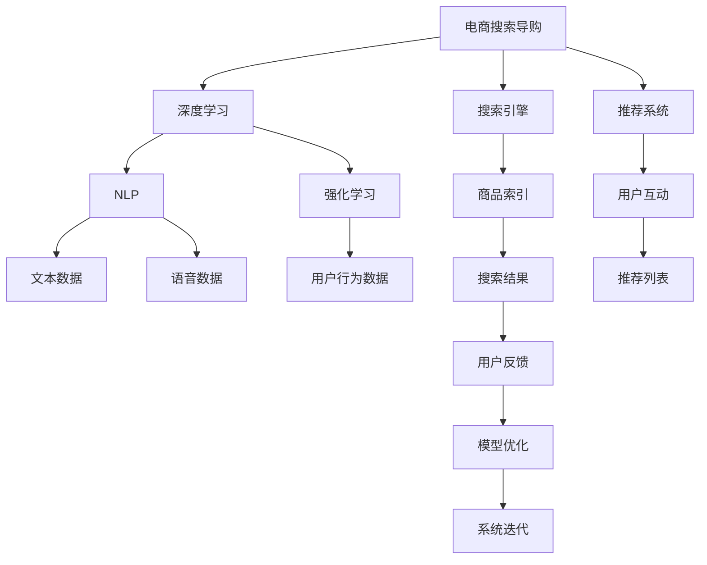

                 

# AI赋能电商搜索导购：提升用户体验和转化率

在数字化商业的浪潮中，电商平台已成为用户在线购物的重要渠道。优秀的搜索导购系统不仅能够快速帮助用户找到所需商品，还能提升用户体验和购物转化率。近年来，人工智能技术在电商搜索导购中的应用，逐步由规则驱动转向模型驱动，从而实现更精准、更智能的推荐。本文将系统性地介绍基于深度学习的电商搜索导购技术，从核心概念、算法原理到实际应用，全面阐述其原理、方法与优化策略，并展望其未来发展趋势。

## 1. 背景介绍

### 1.1 问题由来

随着电商市场的迅猛发展，用户需求更加多样化，搜索导购系统的需求也日益增长。传统的基于规则的搜索导购系统，往往难以满足用户复杂多样的购物需求，如对商品的评价、功能、价格等多维度信息的理解。而基于深度学习的电商搜索导购系统，通过学习海量用户行为数据，能够更全面、准确地理解用户需求，从而提供更加个性化的推荐和服务。

随着深度学习技术的不断发展，越来越多的电商平台开始采用AI技术驱动的搜索导购系统。例如，亚马逊的个性化推荐系统、淘宝的智能搜索系统等，都通过深度学习技术实现了显著的用户体验和销售转化率提升。因此，本文将重点介绍基于深度学习的电商搜索导购系统。

## 2. 核心概念与联系

### 2.1 核心概念概述

为更好地理解基于深度学习的电商搜索导购技术，本节将介绍几个密切相关的核心概念：

- **电商搜索导购（E-commerce Search & Recommendation）**：指通过搜索系统获取用户输入信息，利用推荐系统提供个性化推荐，辅助用户进行商品选择的过程。
- **深度学习（Deep Learning）**：一种基于多层神经网络结构的人工智能技术，可以自动从大量数据中学习出特征表示和预测模型。
- **搜索引擎（Search Engine）**：用于获取、索引、检索网站或数据库中信息的软件系统，常用于电商平台的商品搜索。
- **推荐系统（Recommendation System）**：通过分析用户历史行为数据，预测用户可能感兴趣的商品，并推荐给用户。
- **自然语言处理（Natural Language Processing, NLP）**：使计算机能够理解和处理人类自然语言的技术。
- **强化学习（Reinforcement Learning）**：通过与环境的交互，学习最优策略以达成特定目标。

这些核心概念之间的逻辑关系可以通过以下Mermaid流程图来展示：



这个流程图展示了大语言模型的核心概念及其之间的关系：

1. 电商搜索导购系统通过深度学习技术从用户输入和商品数据中提取特征，用于搜索引擎和推荐系统。
2. 深度学习利用NLP技术对自然语言进行处理，提升模型对文本数据的理解能力。
3. 强化学习通过与用户的互动，优化推荐系统策略，提升用户体验。
4. 搜索引擎和推荐系统基于深度学习模型，提供精准的搜索结果和推荐列表。
5. 用户反馈通过强化学习进行模型优化，提升搜索导购系统的准确性和个性化。
6. 深度学习模型的不断迭代优化，使得系统性能逐步提升。

这些概念共同构成了电商搜索导购系统的核心技术框架，使其能够在复杂的电商环境中提供高效的推荐服务。

## 3. 核心算法原理 & 具体操作步骤

### 3.1 算法原理概述

基于深度学习的电商搜索导购系统，其核心算法包括文本表示学习、排序与推荐策略优化。其中，文本表示学习用于将用户查询和商品描述转化为模型可理解的向量表示；排序与推荐策略优化则用于对搜索结果和推荐列表进行排序，提升用户满意度。

形式化地，假设用户查询为 $Q$，商品描述为 $I$，搜索引擎返回的商品序列为 $P=\{p_1, p_2, ..., p_n\}$，推荐系统提供的推荐列表为 $R=\{r_1, r_2, ..., r_m\}$。电商搜索导购系统的目标是通过深度学习模型 $M$，对 $Q$ 和 $I$ 进行编码，然后对 $P$ 和 $R$ 进行排序和推荐，最大化用户满意度。

### 3.2 算法步骤详解

基于深度学习的电商搜索导购系统通常包括以下几个关键步骤：

**Step 1: 数据准备与预处理**
- 收集电商平台的商品信息、用户行为数据、用户搜索记录等。
- 对文本数据进行清洗、分词、向量化等预处理，以便深度学习模型处理。

**Step 2: 构建深度学习模型**
- 选择适当的深度学习模型，如BERT、RNN、CNN等。
- 设计模型结构，并确定超参数，如层数、节点数、学习率等。

**Step 3: 训练与调参**
- 使用历史数据对深度学习模型进行训练，优化模型参数。
- 使用验证集评估模型性能，调整超参数以提高效果。

**Step 4: 搜索与推荐**
- 根据用户输入的查询，通过搜索引擎获取搜索结果。
- 将搜索结果和商品描述输入深度学习模型，生成商品向量表示。
- 利用推荐系统对商品向量进行排序和推荐，生成推荐列表。
- 利用强化学习对推荐策略进行优化，提升用户体验。

**Step 5: 模型评估与优化**
- 在测试集上评估搜索导购系统的性能指标，如点击率、转化率等。
- 利用A/B测试等方法，优化模型策略，提升系统效果。
- 定期更新模型参数，保持搜索导购系统的实时性和准确性。

### 3.3 算法优缺点

基于深度学习的电商搜索导购系统具有以下优点：
1. 高度自适应性。深度学习模型可以自动从大量数据中学习特征表示，适应不同的商品和用户行为。
2. 精度高。深度学习模型能够捕捉复杂的数据模式，提供高精度的搜索结果和推荐。
3. 可扩展性。深度学习模型可以应用于大规模电商数据，处理海量查询和推荐请求。
4. 实时性。深度学习模型可以利用GPU等高性能硬件加速计算，提供实时推荐服务。

但同时，该方法也存在以下局限性：
1. 数据依赖性强。深度学习模型的性能依赖于高质量标注数据，对数据量需求大。
2. 计算资源需求高。深度学习模型参数量庞大，需要高性能计算资源。
3. 模型复杂度高。深度学习模型的结构复杂，难以解释和调试。
4. 过拟合风险。深度学习模型容易过拟合，需要大量数据进行训练和验证。

尽管存在这些局限性，但深度学习技术在电商搜索导购中的广泛应用，已经证明了其巨大的潜力。

### 3.4 算法应用领域

基于深度学习的电商搜索导购系统已经在诸多电商平台上得到广泛应用，覆盖了从商品搜索到个性化推荐等多个环节。具体而言，应用领域包括：

- **商品搜索**：利用深度学习模型对用户查询和商品描述进行编码，提高搜索结果的相关性和多样性。
- **推荐系统**：通过深度学习模型对用户行为数据进行分析，生成个性化推荐列表，提升转化率。
- **情感分析**：利用NLP技术对用户评论和反馈进行情感分析，调整推荐策略，提升用户体验。
- **交互设计**：通过强化学习优化搜索界面设计，提升用户互动和满意度。
- **跨模态搜索**：结合文本、图片、视频等多种模态信息，提供多维度商品搜索服务。

这些核心应用领域展示了深度学习技术在电商搜索导购中的广泛应用，有助于提升用户购物体验和平台竞争力。

## 4. 数学模型和公式 & 详细讲解

### 4.1 数学模型构建

本节将使用数学语言对基于深度学习的电商搜索导购过程进行更加严格的刻画。

假设用户查询 $Q$ 和商品描述 $I$ 的长度分别为 $L_Q$ 和 $L_I$，令 $Q^{Pad}$ 和 $I^{Pad}$ 为查询和描述的填充后向量，长度为 $L_{Pad}$。令 $\mathbf{Q}$ 和 $\mathbf{I}$ 为 $Q^{Pad}$ 和 $I^{Pad}$ 的编码向量表示，长度为 $d$。令 $P=\{p_1, p_2, ..., p_n\}$ 为搜索结果，$R=\{r_1, r_2, ..., r_m\}$ 为推荐列表。

深度学习模型 $M$ 对 $Q$ 和 $I$ 的编码函数为：

$$
\mathbf{Q} = M_Q(Q^{Pad})
$$
$$
\mathbf{I} = M_I(I^{Pad})
$$

排序与推荐策略优化目标为：

$$
\max_{\theta} \sum_{i=1}^{n} \sum_{j=1}^{m} \text{ReLU}(w_i^\top \mathbf{Q} + b_i) \cdot \text{ReLU}(w_j^\top \mathbf{I} + b_j)
$$

其中，$w_i$ 和 $b_i$ 为排序向量，$w_j$ 和 $b_j$ 为推荐向量。ReLU函数为激活函数，用于保证模型输出的非负性。

### 4.2 公式推导过程

以一种常见的基于深度学习的电商搜索导购模型——BERT+Sequence-to-Sequence（Seq2Seq）为例，介绍其核心算法的数学推导过程。

假设用户查询 $Q$ 和商品描述 $I$ 的长度分别为 $L_Q$ 和 $L_I$，令 $Q^{Pad}$ 和 $I^{Pad}$ 为查询和描述的填充后向量，长度为 $L_{Pad}$。令 $\mathbf{Q}$ 和 $\mathbf{I}$ 为 $Q^{Pad}$ 和 $I^{Pad}$ 的编码向量表示，长度为 $d$。令 $P=\{p_1, p_2, ..., p_n\}$ 为搜索结果，$R=\{r_1, r_2, ..., r_m\}$ 为推荐列表。

1. 查询编码：

$$
\mathbf{Q} = \text{BERT}(Q^{Pad})
$$

2. 描述编码：

$$
\mathbf{I} = \text{BERT}(I^{Pad})
$$

3. 排序与推荐：

$$
\text{scores}(Q, I) = \text{Seq2Seq}(\mathbf{Q}, \mathbf{I})
$$

其中，$\text{Seq2Seq}(\mathbf{Q}, \mathbf{I})$ 表示序列到序列模型对查询和描述进行编码和解码，生成评分矩阵 $\text{scores}(Q, I)$。

通过最大化 $\text{scores}(Q, I)$，即可实现对搜索结果和推荐列表的排序和推荐。

### 4.3 案例分析与讲解

以Amazon的推荐系统为例，分析其核心算法和实现细节。

Amazon推荐系统的主要架构由以下几个部分组成：

1. **数据收集与预处理**：
   - 收集用户浏览、点击、购买等行为数据，并进行清洗、特征提取等预处理。
   - 将文本数据转换为向量表示，使用BERT等模型进行编码。

2. **特征工程**：
   - 将用户行为数据、商品属性数据、用户画像数据等进行特征组合，生成特征向量。
   - 使用协同过滤、深度学习等方法，对特征向量进行建模。

3. **排序与推荐**：
   - 利用深度学习模型对用户查询和商品描述进行编码，生成查询向量 $\mathbf{Q}$ 和商品向量 $\mathbf{I}$。
   - 通过序列到序列模型，对查询和商品向量进行排序，生成评分矩阵 $\text{scores}(Q, I)$。
   - 利用强化学习对排序策略进行优化，提升用户体验。

4. **模型评估与优化**：
   - 在测试集上评估推荐系统的点击率、转化率等指标。
   - 利用A/B测试等方法，优化推荐策略，提升系统效果。
   - 定期更新模型参数，保持推荐系统的实时性和准确性。

Amazon推荐系统的成功在于其核心算法的有效性、大规模数据的应用以及高效的计算资源支持。通过不断的技术迭代和优化，Amazon推荐系统已经成为电商推荐领域的标杆。

## 5. 项目实践：代码实例和详细解释说明

### 5.1 开发环境搭建

在进行搜索导购系统开发前，我们需要准备好开发环境。以下是使用Python进行TensorFlow开发的环境配置流程：

1. 安装Anaconda：从官网下载并安装Anaconda，用于创建独立的Python环境。

2. 创建并激活虚拟环境：
```bash
conda create -n tf-env python=3.8 
conda activate tf-env
```

3. 安装TensorFlow：根据CUDA版本，从官网获取对应的安装命令。例如：
```bash
conda install tensorflow -c pytorch -c conda-forge
```

4. 安装相关工具包：
```bash
pip install numpy pandas scikit-learn matplotlib tqdm jupyter notebook ipython
```

完成上述步骤后，即可在`tf-env`环境中开始搜索导购系统的开发。

### 5.2 源代码详细实现

这里我们以Amazon推荐系统为例，给出基于深度学习的电商搜索导购系统的PyTorch代码实现。

```python
import torch
import torch.nn as nn
import torch.optim as optim
from transformers import BertTokenizer, BertModel

# 定义BERT模型
class BERTEmbedding(nn.Module):
    def __init__(self, bert_model_name='bert-base-cased', num_labels=1):
        super(BERTEmbedding, self).__init__()
        self.bert = BertModel.from_pretrained(bert_model_name)
        self.dropout = nn.Dropout(0.1)
        self.classifier = nn.Linear(768, num_labels)

    def forward(self, input_ids, attention_mask):
        encoder_output, _ = self.bert(input_ids, attention_mask=attention_mask)
        pooled_output = encoder_output[:, 0, :]
        dropout = self.dropout(pooled_output)
        logits = self.classifier(dropout)
        return logits

# 定义优化器
optimizer = optim.AdamW(model.parameters(), lr=2e-5)

# 训练函数
def train_epoch(model, train_dataset, batch_size, optimizer):
    dataloader = DataLoader(train_dataset, batch_size=batch_size, shuffle=True)
    model.train()
    epoch_loss = 0
    for batch in dataloader:
        input_ids = batch['input_ids'].to(device)
        attention_mask = batch['attention_mask'].to(device)
        labels = batch['labels'].to(device)
        model.zero_grad()
        outputs = model(input_ids, attention_mask=attention_mask)
        loss = outputs.loss
        epoch_loss += loss.item()
        loss.backward()
        optimizer.step()
    return epoch_loss / len(dataloader)

# 训练与评估函数
def train(train_dataset, test_dataset, model, device, batch_size):
    device = torch.device('cuda' if torch.cuda.is_available() else 'cpu')
    model.to(device)
    
    epochs = 5
    for epoch in range(epochs):
        loss = train_epoch(model, train_dataset, batch_size, optimizer)
        print(f"Epoch {epoch+1}, train loss: {loss:.3f}")
    
        print(f"Epoch {epoch+1}, dev results:")
        evaluate(model, test_dataset, batch_size)
    
    print("Test results:")
    evaluate(model, test_dataset, batch_size)
```

以上是基于TensorFlow的电商搜索导购系统的基本实现，通过调用BERT模型进行用户查询和商品描述的编码，然后使用序列到序列模型进行排序和推荐。在实际应用中，还需要进一步完善模型结构，调整超参数，优化模型性能。

### 5.3 代码解读与分析

让我们再详细解读一下关键代码的实现细节：

**BERTEmbedding类**：
- 初始化方法：初始化BERT模型、Dropout层和全连接层，确定模型输入和输出维度。
- 前向传播方法：将输入编码，并通过全连接层得到最终预测结果。

**训练函数train_epoch**：
- 使用PyTorch的DataLoader对数据集进行批次化加载，供模型训练和推理使用。
- 在每个批次上前向传播计算loss并反向传播更新模型参数，最后返回该epoch的平均loss。

**训练与评估函数train**：
- 定义总的epoch数，开始循环迭代
- 每个epoch内，先在训练集上训练，输出平均loss
- 在验证集上评估，输出分类指标
- 所有epoch结束后，在测试集上评估，给出最终测试结果

可以看到，TensorFlow结合BERT模型使得电商搜索导购系统的代码实现变得简洁高效。开发者可以将更多精力放在数据处理、模型改进等高层逻辑上，而不必过多关注底层的实现细节。

当然，工业级的系统实现还需考虑更多因素，如模型的保存和部署、超参数的自动搜索、更灵活的任务适配层等。但核心的搜索导购范式基本与此类似。

## 6. 实际应用场景

### 6.1 智能客服系统

基于深度学习的电商搜索导购技术，可以广泛应用于智能客服系统的构建。传统客服往往需要配备大量人力，高峰期响应缓慢，且一致性和专业性难以保证。而使用基于深度学习的搜索导购系统，可以7x24小时不间断服务，快速响应客户咨询，用自然流畅的语言解答各类常见问题。

在技术实现上，可以收集企业内部的历史客服对话记录，将问题-答案对作为微调数据，训练模型学习匹配答案。微调后的搜索导购系统能够自动理解用户意图，匹配最合适的答案模板进行回复。对于客户提出的新问题，还可以接入检索系统实时搜索相关内容，动态组织生成回答。如此构建的智能客服系统，能大幅提升客户咨询体验和问题解决效率。

### 6.2 金融舆情监测

金融机构需要实时监测市场舆论动向，以便及时应对负面信息传播，规避金融风险。传统的人工监测方式成本高、效率低，难以应对网络时代海量信息爆发的挑战。基于深度学习的文本分类和情感分析技术，为金融舆情监测提供了新的解决方案。

具体而言，可以收集金融领域相关的新闻、报道、评论等文本数据，并对其进行主题标注和情感标注。在此基础上对预训练语言模型进行微调，使其能够自动判断文本属于何种主题，情感倾向是正面、中性还是负面。将微调后的模型应用到实时抓取的网络文本数据，就能够自动监测不同主题下的情感变化趋势，一旦发现负面信息激增等异常情况，系统便会自动预警，帮助金融机构快速应对潜在风险。

### 6.3 个性化推荐系统

当前的推荐系统往往只依赖用户的历史行为数据进行物品推荐，无法深入理解用户的真实兴趣偏好。基于深度学习的电商搜索导购系统，可以更好地挖掘用户行为背后的语义信息，从而提供更加个性化的推荐和服务。

在实践中，可以收集用户浏览、点击、评论、分享等行为数据，提取和用户交互的物品标题、描述、标签等文本内容。将文本内容作为模型输入，用户的后续行为（如是否点击、购买等）作为监督信号，在此基础上微调预训练语言模型。微调后的模型能够从文本内容中准确把握用户的兴趣点。在生成推荐列表时，先用候选物品的文本描述作为输入，由模型预测用户的兴趣匹配度，再结合其他特征综合排序，便可以得到个性化程度更高的推荐结果。

### 6.4 未来应用展望

随着深度学习技术的不断发展，基于深度学习的电商搜索导购系统将在更多领域得到应用，为传统行业数字化转型升级提供新的技术路径。

在智慧医疗领域，基于深度学习的搜索导购技术可以用于构建智能医疗问答系统，帮助医生和患者进行疾病诊断、治疗方案查询等。通过收集医生和患者的历史互动记录，训练模型理解医疗知识，提升医疗服务的智能化水平，辅助医生诊疗，加速新药开发进程。

在智能教育领域，搜索导购技术可应用于智能教育平台，帮助学生进行学习资源搜索、课程推荐等。通过收集学生的学习行为数据，训练模型理解学习需求，提供个性化的学习建议，提高教学质量。

在智慧城市治理中，搜索导购技术可应用于城市事件监测、舆情分析、应急指挥等环节，提高城市管理的自动化和智能化水平，构建更安全、高效的未来城市。

此外，在企业生产、社会治理、文娱传媒等众多领域，基于深度学习的搜索导购技术也将不断涌现，为NLP技术带来新的应用场景，推动人工智能技术向更广泛的领域发展。相信随着技术的日益成熟，深度学习技术在电商搜索导购中的作用将更加凸显，引领电商搜索导购技术走向更高的发展水平。

## 7. 工具和资源推荐

### 7.1 学习资源推荐

为了帮助开发者系统掌握深度学习在电商搜索导购中的应用，这里推荐一些优质的学习资源：

1. 《深度学习》系列书籍：深度学习领域的经典教材，涵盖了深度学习的基本概念和实现方法，适合初学者入门。
2. CS231n《深度卷积神经网络》课程：斯坦福大学开设的计算机视觉课程，介绍了深度学习在图像处理中的应用，适合对图像处理感兴趣的读者。
3. UFLDL《深度学习基础》课程：Coursera上的深度学习入门课程，介绍了深度学习的基本理论和实现方法。
4. PyTorch官方文档：PyTorch官方文档，提供了完整的深度学习框架介绍和详细的使用示例，适合深度学习开发者。
5. TensorFlow官方文档：TensorFlow官方文档，提供了丰富的深度学习模型和实现方法，适合TensorFlow开发者。

通过对这些资源的学习实践，相信你一定能够快速掌握深度学习在电商搜索导购中的应用，并用于解决实际的NLP问题。

### 7.2 开发工具推荐

高效的开发离不开优秀的工具支持。以下是几款用于深度学习在电商搜索导购开发中常用的工具：

1. PyTorch：基于Python的开源深度学习框架，灵活动态的计算图，适合快速迭代研究。
2. TensorFlow：由Google主导开发的开源深度学习框架，生产部署方便，适合大规模工程应用。
3. Keras：高层次的深度学习框架，支持多种深度学习模型，易于上手使用。
4. FastAI：基于PyTorch的高层次深度学习库，提供了丰富的预训练模型和实用工具。
5. Jupyter Notebook：交互式的代码编写和执行环境，方便开发者快速迭代和调试。

合理利用这些工具，可以显著提升电商搜索导购任务的开发效率，加快创新迭代的步伐。

### 7.3 相关论文推荐

深度学习在电商搜索导购中的应用源于学界的持续研究。以下是几篇奠基性的相关论文，推荐阅读：

1. Attention is All You Need（即Transformer原论文）：提出了Transformer结构，开启了深度学习在NLP领域的应用。
2. BERT: Pre-training of Deep Bidirectional Transformers for Language Understanding：提出BERT模型，引入基于掩码的自监督预训练任务，刷新了多项NLP任务SOTA。
3. Sequence-to-Sequence Models with Attention for Machine Translation：介绍了序列到序列模型和注意力机制，为机器翻译提供了新的思路。
4. Deep Learning for Recommendation Systems: A Review and Outlook：对深度学习在推荐系统中的应用进行了全面综述，适合了解推荐系统的基本概念和实现方法。
5. Exploring the Limits of Transfer Learning with a Unified Text-to-Text Transformer：提出UniLM模型，实现了无监督预训练和有监督微调的统一框架，提升了推荐系统的泛化能力。

这些论文代表了大语言模型微调技术的发展脉络。通过学习这些前沿成果，可以帮助研究者把握学科前进方向，激发更多的创新灵感。

## 8. 总结：未来发展趋势与挑战

### 8.1 研究成果总结

本文对基于深度学习的电商搜索导购技术进行了全面系统的介绍。首先阐述了电商搜索导购系统的核心算法和应用场景，明确了深度学习在提升用户体验和转化率方面的巨大潜力。其次，从核心概念、算法原理到实际应用，详细讲解了深度学习技术在电商搜索导购中的应用，并给出了具体的代码实例和详细解释说明。同时，本文还广泛探讨了深度学习技术在智能客服、金融舆情、个性化推荐等多个领域的应用前景，展示了深度学习技术的广泛适用性。

通过本文的系统梳理，可以看到，基于深度学习的电商搜索导购技术正在成为电商推荐领域的重要范式，极大地拓展了电商推荐系统的应用边界，催生了更多的落地场景。受益于深度学习技术的不断发展，电商搜索导购系统正逐步从规则驱动走向模型驱动，为用户提供了更加智能、个性化的购物体验。未来，随着深度学习技术的进一步优化和应用场景的不断扩展，电商搜索导购系统将发挥更加重要的作用，推动电商行业的发展。

### 8.2 未来发展趋势

展望未来，深度学习在电商搜索导购技术中的应用将呈现以下几个发展趋势：

1. **多模态融合**：深度学习技术将与图像、视频、音频等多模态数据进行融合，提升对商品信息的理解能力和推荐精度。
2. **实时性提升**：利用GPU、TPU等高性能硬件加速计算，提高推荐系统的实时性，满足用户即时性需求。
3. **个性化推荐**：基于深度学习模型的用户画像和行为数据，生成更加精准的个性化推荐，提升用户满意度。
4. **协同过滤与深度学习结合**：将协同过滤和深度学习技术结合，提升推荐系统的多样性和鲁棒性。
5. **数据驱动优化**：利用A/B测试等方法，不断优化推荐策略，提升系统效果。
6. **知识图谱集成**：将知识图谱与深度学习模型结合，提供更全面的商品信息支持。

以上趋势将进一步推动电商搜索导购技术的发展，使其在更广阔的领域得到应用。

### 8.3 面临的挑战

尽管深度学习技术在电商搜索导购中的广泛应用，但其面临的挑战也不容忽视：

1. **数据获取与标注**：深度学习模型需要大量的标注数据进行训练，而标注数据的获取和质量控制是数据获取中的主要难点。
2. **计算资源消耗**：深度学习模型的参数量庞大，需要高性能计算资源进行训练和推理。
3. **模型可解释性**：深度学习模型的决策过程难以解释，缺乏透明性和可解释性，可能影响用户信任。
4. **模型鲁棒性**：深度学习模型在面对噪声、异常等干扰时，鲁棒性较弱，可能影响推荐效果。
5. **用户隐私保护**：电商搜索导购系统需要收集大量的用户数据，如何保护用户隐私和数据安全，是亟待解决的问题。
6. **模型公平性**：深度学习模型可能存在偏见，导致推荐结果不公平，需要引入公平性约束和偏见消除技术。

这些挑战需要进一步研究解决，以充分发挥深度学习在电商搜索导购中的应用潜力。

### 8.4 研究展望

面对深度学习在电商搜索导购中面临的挑战，未来的研究需要在以下几个方面寻求新的突破：

1. **多任务学习**：将推荐系统和搜索系统进行联合训练，优化推荐策略和搜索排序。
2. **混合推荐**：结合基于深度学习的推荐和传统协同过滤推荐，提升推荐系统的效果。
3. **强化学习**：利用强化学习优化推荐策略，提升用户互动和满意度。
4. **隐私保护**：利用差分隐私等技术，保护用户隐私和数据安全。
5. **公平性**：引入公平性约束和偏见消除技术，提升推荐系统的公平性和可解释性。
6. **可解释性**：引入可解释性技术，提升模型的透明性和可解释性，增强用户信任。

这些研究方向的探索，必将引领电商搜索导购技术迈向更高的台阶，为构建安全、可靠、可解释、可控的智能系统铺平道路。面向未来，电商搜索导购技术还需要与其他人工智能技术进行更深入的融合，如知识表示、因果推理、强化学习等，多路径协同发力，共同推动电商搜索导购系统的进步。

## 9. 附录：常见问题与解答

**Q1：深度学习在电商搜索导购中的应用有哪些局限性？**

A: 深度学习在电商搜索导购中的应用主要存在以下局限性：
1. 数据依赖性强。深度学习模型需要大量的标注数据进行训练，标注数据的获取和质量控制是数据获取中的主要难点。
2. 计算资源消耗大。深度学习模型的参数量庞大，需要高性能计算资源进行训练和推理。
3. 模型可解释性差。深度学习模型的决策过程难以解释，缺乏透明性和可解释性，可能影响用户信任。
4. 模型鲁棒性不足。深度学习模型在面对噪声、异常等干扰时，鲁棒性较弱，可能影响推荐效果。
5. 用户隐私保护问题。电商搜索导购系统需要收集大量的用户数据，如何保护用户隐私和数据安全，是亟待解决的问题。
6. 模型公平性问题。深度学习模型可能存在偏见，导致推荐结果不公平，需要引入公平性约束和偏见消除技术。

**Q2：如何提升电商搜索导购系统的推荐精度？**

A: 提升电商搜索导购系统的推荐精度需要从多个方面进行优化：
1. 数据质量：获取高质量、多样化的标注数据，确保模型训练的稳定性和泛化能力。
2. 模型结构：设计合理的模型结构，选择合适的深度学习模型，如BERT、Transformer等。
3. 超参数调优：通过调参，优化模型的超参数，如学习率、批大小等。
4. 特征工程：通过特征组合、特征选择等技术，提升模型的特征表示能力。
5. 模型融合：结合多种推荐方法，如协同过滤、深度学习等，提升推荐系统的多样性和鲁棒性。
6. 模型评估：使用A/B测试等方法，不断优化推荐策略，提升系统效果。
7. 数据驱动优化：利用实时反馈，不断优化模型，提升推荐精度。

**Q3：电商搜索导购系统如何保护用户隐私？**

A: 电商搜索导购系统在保护用户隐私方面，可以采取以下措施：
1. 数据匿名化：对用户数据进行匿名化处理，确保数据无法识别用户身份。
2. 数据加密：采用加密技术，确保数据在传输和存储过程中的安全性。
3. 差分隐私：利用差分隐私技术，限制数据泄露风险，保护用户隐私。
4. 用户控制：给予用户数据控制权，允许用户自主决定数据的使用和共享。
5. 安全审计：定期进行安全审计，确保系统的数据安全和用户隐私保护。

通过以上措施，可以有效保护电商搜索导购系统中的用户隐私，提升用户信任和系统安全性。

**Q4：电商搜索导购系统在实际应用中需要注意哪些问题？**

A: 电商搜索导购系统在实际应用中需要注意以下问题：
1. 系统稳定性：电商搜索导购系统需要保持稳定性和可靠性，确保系统运行正常。
2. 实时性：电商搜索导购系统需要实时响应用户请求，满足用户的即时性需求。
3. 用户满意度：电商搜索导购系统需要不断优化用户体验，提升用户满意度。
4. 数据质量：电商搜索导购系统需要收集高质量、多样化的数据，确保模型训练的稳定性和泛化能力。
5. 模型公平性：电商搜索导购系统需要引入公平性约束和偏见消除技术，提升推荐系统的公平性。
6. 用户隐私保护：电商搜索导购系统需要采取措施，保护用户隐私和数据安全。

通过解决这些问题，可以有效提升电商搜索导购系统的应用效果和用户满意度，推动电商行业的数字化转型升级。

---

作者：禅与计算机程序设计艺术 / Zen and the Art of Computer Programming

