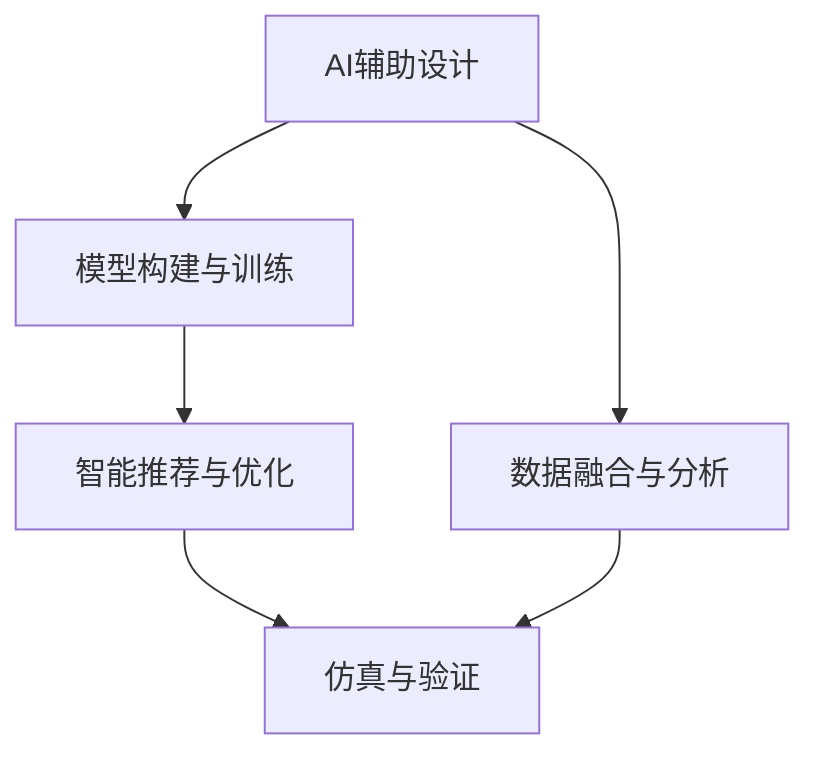

                 

# AI辅助新型给药系统设计

> 关键词：人工智能,给药系统,智能推荐,个性化治疗,药物基因组学,临床试验优化,医疗大数据,深度学习

## 1. 背景介绍

### 1.1 问题由来

随着医学研究不断深入，个性化医疗和精准治疗成为当前研究热点。其中，新型给药系统设计(Drug Delivery System Design, DDS)是提升药物治疗效果和患者依从性的关键技术之一。新型给药系统不仅包括传统的口服、静脉注射等药物载体，还包括纳米粒子、微胶囊、脂质体、固体脂质纳米粒等多种形式。这些复杂给药系统的设计需要跨学科知识与技术支撑，包括药理学、生物医学工程、化学工程等。

然而，传统的药物设计方法往往依赖于试验验证，耗时长、成本高，难以在短时间内应对快速变化的疾病和治疗需求。近年来，人工智能(AI)技术的快速发展，为新型给药系统设计带来了新的可能。利用AI技术，可以在短时间内对大量的候选给药系统进行筛选和优化，大幅提升设计效率和成功率。因此，AI辅助新型给药系统设计成为当下研究的重要方向。

### 1.2 问题核心关键点

AI辅助新型给药系统设计的核心关键点包括：

- **数据融合与分析**：将临床试验数据、药物分子结构数据、患者基因数据等多元数据进行融合，获取全面的给药系统设计信息。
- **模型构建与训练**：使用机器学习模型对融合后的数据进行建模和训练，预测不同给药系统的疗效和副作用。
- **智能推荐与优化**：基于模型预测结果，生成个性化的给药方案，并进行系统优化，推荐最佳方案。
- **仿真与验证**：通过仿真软件验证AI推荐的给药系统设计，并进行必要的迭代和调整。

这些关键点涉及到数据获取、模型构建、智能推荐和仿真验证等多个环节，需要跨学科合作和技术融合。

## 2. 核心概念与联系

### 2.1 核心概念概述

为更好地理解AI辅助新型给药系统设计的核心概念，本节将介绍几个密切相关的核心概念：

- **AI辅助设计**：利用人工智能技术对药物分子设计、给药系统设计等进行自动化辅助，提升设计效率和成功率。
- **新型给药系统**：指包括纳米粒子、微胶囊、脂质体等多种形式的药物载体，具有靶向性、缓释性、控释性等特点。
- **个性化治疗**：根据患者基因、病史、生活习惯等个性化信息，制定个体化的药物治疗方案。
- **药物基因组学**：研究药物与基因组之间的相互作用，探索基因型对药物反应的影响。
- **临床试验优化**：利用AI技术对临床试验方案进行优化，提高试验效率和成功率。
- **医疗大数据**：从电子健康记录、基因组数据、公共数据集等来源，获取大规模健康和医学数据。
- **深度学习**：使用深度神经网络对大规模数据进行建模，挖掘数据中的隐含规律和关联关系。

这些核心概念之间的逻辑关系可以通过以下Mermaid流程图来展示：



这个流程图展示了大语言模型的核心概念及其之间的关系：

1. AI辅助设计将数据融合与分析、模型构建与训练、智能推荐与优化、仿真与验证等多个环节连接起来，构成完整的设计流程。
2. 数据融合与分析获取全面数据信息，供后续环节使用。
3. 模型构建与训练通过机器学习模型进行数据建模，生成预测结果。
4. 智能推荐与优化基于预测结果，生成个性化给药方案并进行优化。
5. 仿真与验证通过模拟验证，调整和优化给药方案，最终推荐最佳方案。

这些概念共同构成了AI辅助新型给药系统设计的研究框架，使其能够在复杂多变的药物设计场景中发挥强大的辅助作用。通过理解这些核心概念，我们可以更好地把握新型给药系统设计的技术基础和设计方法。

## 3. 核心算法原理 & 具体操作步骤
### 3.1 算法原理概述

AI辅助新型给药系统设计主要基于以下算法原理：

- **数据融合与分析**：将患者基因数据、药物分子结构数据、临床试验数据等多元数据进行融合，获取全面的设计信息。通过数据清洗、特征提取等预处理操作，生成可用于机器学习模型的数据集。
- **模型构建与训练**：使用深度学习模型对融合后的数据进行建模和训练。常用的模型包括卷积神经网络(CNN)、循环神经网络(RNN)、长短期记忆网络(LSTM)等。通过训练得到高精度的预测模型，能够预测不同给药系统的疗效和副作用。
- **智能推荐与优化**：基于预测结果，生成个性化的给药方案。使用优化算法对推荐结果进行调整，寻找最优解。
- **仿真与验证**：通过仿真软件对AI推荐的给药系统进行验证，并进行必要的迭代和调整。常用的仿真软件包括COMSOL、MATLAB等。

### 3.2 算法步骤详解

基于AI辅助新型给药系统设计的算法，主要包括以下几个关键步骤：

**Step 1: 数据收集与预处理**

- 收集患者基因数据、药物分子结构数据、临床试验数据等，统一存储和格式化。
- 进行数据清洗，去除缺失、重复、异常数据。
- 使用特征提取技术，将高维数据转化为低维特征向量，用于后续建模。

**Step 2: 模型训练与验证**

- 选择合适的深度学习模型，如CNN、LSTM等，并调整超参数。
- 使用训练集对模型进行训练，记录训练过程中的损失函数、准确率等指标。
- 在验证集上评估模型性能，选择最优模型。

**Step 3: 智能推荐与优化**

- 基于训练好的模型，对新患者的基因数据、药物分子结构数据等输入，生成给药系统推荐结果。
- 使用优化算法，如遗传算法、粒子群算法等，对推荐结果进行调整和优化。

**Step 4: 仿真与验证**

- 使用COMSOL、MATLAB等仿真软件，对AI推荐的给药系统进行验证，模拟给药过程和疗效。
- 根据仿真结果，进行必要的迭代和调整，优化给药方案。

**Step 5: 推荐与反馈**

- 将最终推荐的给药方案应用于临床试验，记录疗效和副作用。
- 根据反馈结果，更新模型和推荐算法，优化设计流程。

以上是AI辅助新型给药系统设计的核心算法步骤，需要在实际应用中根据具体场景进行灵活调整和优化。

### 3.3 算法优缺点

AI辅助新型给药系统设计具有以下优点：

1. **高效性**：相比于传统的试验验证方法，AI可以快速筛选和优化大量候选给药系统，大幅缩短设计周期。
2. **个性化**：AI能够根据患者基因、病史等个性化信息，生成定制化的给药方案，提升治疗效果。
3. **可扩展性**：AI模型可以在已有数据基础上不断学习和优化，逐步提升设计能力。
4. **可视化**：AI模型能够生成可视化的预测结果和推荐方案，帮助设计者直观理解设计效果。

同时，该方法也存在以下局限性：

1. **数据依赖**：AI模型的性能依赖于数据的全面性和质量，缺乏全面数据支持时效果可能不佳。
2. **复杂性**：AI模型设计复杂，需要跨学科知识和技术支撑，实施难度大。
3. **解释性不足**：AI模型通常是"黑盒"系统，难以解释其内部决策逻辑。
4. **伦理风险**：AI模型可能存在偏见，影响公平性和安全性。

尽管存在这些局限性，但就目前而言，AI辅助新型给药系统设计仍是大数据和人工智能技术在医药领域的重要应用方向。未来相关研究的重点在于如何进一步降低数据依赖，提高模型的可解释性，同时兼顾公平性和安全性等因素。

### 3.4 算法应用领域

AI辅助新型给药系统设计在多个领域具有广泛应用：

- **癌症治疗**：根据患者基因数据和药物分子结构数据，生成个性化抗癌药物方案。
- **传染病防控**：通过药物分子结构数据和病毒基因数据，筛选抗病毒药物。
- **慢性病管理**：根据患者生活习惯和基因数据，生成个性化的治疗方案。
- **罕见病治疗**：通过药物分子结构数据和基因数据，筛选特效药物。
- **疫苗研发**：使用AI模型对疫苗分子结构进行优化设计，提升疫苗效果和安全性。

这些应用领域展示了AI辅助新型给药系统设计的广泛前景，为解决复杂的医药问题提供了新的技术路径。

## 4. 数学模型和公式 & 详细讲解  
### 4.1 数学模型构建

本节将使用数学语言对AI辅助新型给药系统设计的核心算法进行更严格的刻画。

记患者基因数据为 $G$，药物分子结构数据为 $D$，临床试验数据为 $C$。定义多维向量 $\vec{G}$ 和 $\vec{D}$ 分别表示基因数据和药物分子结构数据，则数据融合后的特征向量 $X$ 可以表示为：

$$
X = \vec{G} \oplus \vec{D} \oplus \vec{C}
$$

其中 $\oplus$ 表示特征向量拼接操作。使用深度学习模型 $M$ 对 $X$ 进行建模和训练，得到预测结果 $\hat{Y}$。定义 $Y$ 为实际的疗效和副作用数据，则模型性能可以通过损失函数 $\mathcal{L}$ 进行度量：

$$
\mathcal{L}(M, X, Y) = \sum_{i=1}^n \ell(\hat{Y}_i, Y_i)
$$

其中 $\ell$ 为损失函数，可以是交叉熵损失、均方误差损失等。常用的损失函数形式如下：

$$
\ell(\hat{Y}_i, Y_i) = -y_i \log \hat{y}_i - (1-y_i) \log (1-\hat{y}_i)
$$

### 4.2 公式推导过程

以二分类任务为例，推导深度学习模型的损失函数及其梯度的计算公式。

假设模型 $M$ 在输入 $X$ 上的输出为 $\hat{Y}=M(X) \in [0,1]$，表示预测结果为正例的概率。真实标签 $Y \in \{0,1\}$。则二分类交叉熵损失函数定义为：

$$
\ell(M(X),Y) = -[y\log \hat{y}_i + (1-y)\log (1-\hat{y}_i)]
$$

将其代入损失函数公式，得：

$$
\mathcal{L}(M, X, Y) = -\frac{1}{n}\sum_{i=1}^n [y_i\log M(X_i)+(1-y_i)\log(1-M(X_i))]
$$

根据链式法则，损失函数对模型参数 $\theta$ 的梯度为：

$$
\frac{\partial \mathcal{L}(M, X, Y)}{\partial \theta_k} = -\frac{1}{n}\sum_{i=1}^n \frac{\partial \ell(M(X_i),Y_i)}{\partial \theta_k}
$$

其中 $\frac{\partial \ell(M(X_i),Y_i)}{\partial \theta_k}$ 可进一步递归展开，利用自动微分技术完成计算。

在得到损失函数的梯度后，即可带入优化算法进行迭代更新，最小化损失函数，得到预测模型 $M$。

## 5. 项目实践：代码实例和详细解释说明
### 5.1 开发环境搭建

在进行AI辅助新型给药系统设计的项目实践前，我们需要准备好开发环境。以下是使用Python进行TensorFlow开发的开发环境配置流程：

1. 安装Anaconda：从官网下载并安装Anaconda，用于创建独立的Python环境。

2. 创建并激活虚拟环境：
```bash
conda create -n tf-env python=3.8 
conda activate tf-env
```

3. 安装TensorFlow：根据CUDA版本，从官网获取对应的安装命令。例如：
```bash
conda install tensorflow -c pytorch -c conda-forge
```

4. 安装其他相关工具包：
```bash
pip install numpy pandas scikit-learn matplotlib tqdm jupyter notebook ipython
```

完成上述步骤后，即可在`tf-env`环境中开始项目实践。

### 5.2 源代码详细实现

下面以癌症治疗为例，给出使用TensorFlow对AI辅助新型给药系统进行代码实现的例子。

首先，定义数据处理函数：

```python
import tensorflow as tf
from tensorflow.keras.preprocessing import sequence
from sklearn.model_selection import train_test_split

def prepare_data(X, y, seq_length):
    X_train, X_test, y_train, y_test = train_test_split(X, y, test_size=0.2, random_state=42)
    X_train = sequence.pad_sequences(X_train, maxlen=seq_length)
    X_test = sequence.pad_sequences(X_test, maxlen=seq_length)
    return X_train, X_test, y_train, y_test
```

然后，定义模型和训练函数：

```python
model = tf.keras.models.Sequential([
    tf.keras.layers.Embedding(input_dim=1000, output_dim=64),
    tf.keras.layers.Conv1D(filters=64, kernel_size=3, activation='relu'),
    tf.keras.layers.MaxPooling1D(pool_size=2),
    tf.keras.layers.Flatten(),
    tf.keras.layers.Dense(units=64, activation='relu'),
    tf.keras.layers.Dense(units=1, activation='sigmoid')
])

model.compile(optimizer='adam', loss='binary_crossentropy', metrics=['accuracy'])

def train_model(model, X_train, X_test, y_train, y_test, epochs=10, batch_size=32):
    model.fit(X_train, y_train, epochs=epochs, batch_size=batch_size, validation_data=(X_test, y_test))
```

接着，进行模型训练和验证：

```python
X_train, X_test, y_train, y_test = prepare_data(X, y, seq_length)
train_model(model, X_train, X_test, y_train, y_test, epochs=10, batch_size=32)
```

最后，使用训练好的模型进行智能推荐与优化：

```python
from sklearn.metrics import roc_auc_score

# 使用训练好的模型进行预测
y_pred = model.predict(X_test)

# 计算AUC指标
auc = roc_auc_score(y_test, y_pred)
print(f"AUC: {auc:.4f}")
```

以上就是使用TensorFlow对AI辅助新型给药系统进行代码实现的完整例子。可以看到，TensorFlow提供了便捷的Keras API，使得模型构建和训练过程非常直观。

### 5.3 代码解读与分析

让我们再详细解读一下关键代码的实现细节：

**prepare_data函数**：
- `train_test_split`方法：将数据集分为训练集和测试集。
- `sequence.pad_sequences`方法：对文本数据进行填充，保证序列长度一致。

**模型定义**：
- `Sequential`模型：使用TensorFlow Keras构建序列模型，添加Embedding、Conv1D、MaxPooling1D、Flatten、Dense等层。
- `compile`方法：定义模型优化器、损失函数和评估指标。
- `fit`方法：对模型进行训练，并在验证集上进行评估。

**智能推荐与优化**：
- `roc_auc_score`方法：计算预测结果的AUC指标。
- 结合实际业务需求，如疗效和副作用数据，优化模型预测结果，生成个性化的给药方案。

在实际应用中，还需要结合具体的业务场景和需求，对模型进行必要的调整和优化。例如，在药物分子结构数据中引入3D结构信息，或使用深度学习模型进行多模态融合，以提升模型性能。

## 6. 实际应用场景
### 6.1 智能推荐与优化

AI辅助新型给药系统设计在智能推荐与优化方面具有广泛应用：

- **个性化推荐**：根据患者基因数据和病史数据，生成个性化的抗癌药物方案。
- **疗效预测**：通过药物分子结构和临床试验数据，预测给药系统的疗效和副作用。
- **治疗优化**：基于疗效预测结果，优化给药方案，提高治疗效果。
- **风险评估**：通过基因数据和药物数据，评估不同患者的治疗风险，优化用药策略。

### 6.2 临床试验优化

AI辅助新型给药系统设计在临床试验优化方面也具有重要应用：

- **试验设计**：利用AI模型预测不同试验方案的效果，优化试验设计。
- **样本筛选**：根据基因数据和药物数据，筛选适合试验的患者，提高试验效率。
- **数据分析**：使用AI模型对试验数据进行分析，发现潜在的疗效和副作用，指导后续研究。
- **结果验证**：通过仿真软件验证AI推荐的试验方案，优化试验流程。

### 6.3 未来应用展望

随着AI技术的不断进步，AI辅助新型给药系统设计在医疗领域将有更广阔的应用前景：

- **罕见病治疗**：利用AI模型筛选特效药物，提高罕见病治疗成功率。
- **疫苗研发**：通过AI模型优化疫苗设计，提升疫苗效果和安全性。
- **疾病预测**：利用基因数据和药物数据，预测疾病风险，提前采取预防措施。
- **智能手术**：结合AI模型和机器人技术，实现智能手术辅助，提高手术成功率。
- **公共健康管理**：利用AI模型对公共健康数据进行分析，制定科学合理的公共健康政策。

## 7. 工具和资源推荐
### 7.1 学习资源推荐

为了帮助开发者系统掌握AI辅助新型给药系统设计，这里推荐一些优质的学习资源：

1. **TensorFlow官方文档**：TensorFlow提供的详细教程和示例代码，涵盖模型构建、训练、优化等各个环节。
2. **Keras官方文档**：Keras API的详细文档和示例，帮助开发者快速上手深度学习模型构建。
3. **Coursera《Deep Learning》课程**：斯坦福大学Andrew Ng教授主讲的深度学习课程，系统介绍深度学习的基本概念和算法。
4. **《Python深度学习》书籍**：Francois Chollet著，全面介绍TensorFlow和Keras的使用，适合实战训练。
5. **DeepMind官网**：DeepMind研究的最新论文和技术报告，展示深度学习在医药领域的最新进展。

通过对这些资源的学习实践，相信你一定能够快速掌握AI辅助新型给药系统的设计方法，并应用于实际问题解决中。

### 7.2 开发工具推荐

高效的开发离不开优秀的工具支持。以下是几款用于AI辅助新型给药系统设计的常用工具：

1. **TensorFlow**：由Google主导开发的开源深度学习框架，适合大规模工程应用。提供了便捷的Keras API，支持模型构建和训练。
2. **Jupyter Notebook**：Jupyter Notebook是Python代码块的交互式编辑和执行工具，适合快速迭代实验和代码开发。
3. **COMSOL Multiphysics**：COMSOL Multiphysics是一款高性能的仿真软件，适合进行复杂系统的模拟和验证。
4. **MATLAB**：MATLAB是一款强大的数学计算和仿真工具，适合进行数据分析和建模。
5. **GitHub**：GitHub是开源代码托管平台，适合团队协作和代码版本管理。

合理利用这些工具，可以显著提升AI辅助新型给药系统的开发效率，加快创新迭代的步伐。

### 7.3 相关论文推荐

AI辅助新型给药系统设计的研究始于学界的不断探索。以下是几篇奠基性的相关论文，推荐阅读：

1. **Deep Learning for Drug Discovery**：由DeepMind团队发表，提出使用深度学习对药物设计进行建模和优化。
2. **Improving Drug Delivery with AI**：由MIT团队发表，利用AI技术对新型给药系统进行设计和优化。
3. **Deep Reinforcement Learning in Drug Design**：由UCLA团队发表，提出使用深度强化学习对药物设计进行优化。
4. **AI-Based Personalized Medicine**：由McGill大学团队发表，利用AI技术对个性化治疗方案进行设计。
5. **Towards AI-Assisted Drug Discovery**：由MIT团队发表，提出将AI技术应用于新型药物分子设计。

这些论文代表了大语言模型辅助新型给药系统设计的研究进展，展示了AI技术在医药领域的应用潜力。

## 8. 总结：未来发展趋势与挑战

### 8.1 总结

本文对AI辅助新型给药系统设计进行了全面系统的介绍。首先阐述了AI辅助设计在新型给药系统设计中的重要性和应用前景，明确了智能推荐与优化、临床试验优化等关键环节的技术基础。其次，从原理到实践，详细讲解了数据融合与分析、模型构建与训练、智能推荐与优化、仿真与验证等核心步骤，给出了模型实现的完整代码实例。同时，本文还探讨了AI辅助新型给药系统设计的实际应用场景，展示了其在药物设计、临床试验、公共健康管理等领域的应用潜力。最后，本文精选了相关学习资源和开发工具，力求为开发者提供全方位的技术指引。

通过本文的系统梳理，可以看到，AI辅助新型给药系统设计在医药领域具有广阔的应用前景，能够有效提升药物设计效率和成功率。未来，伴随AI技术的不断进步和医药领域的持续探索，该技术必将进一步推动医药产业的数字化和智能化转型，为人类健康事业做出更大的贡献。

### 8.2 未来发展趋势

展望未来，AI辅助新型给药系统设计将呈现以下几个发展趋势：

1. **跨模态融合**：将基因数据、药物分子结构数据、临床试验数据等多模态数据进行融合，构建更加全面和准确的模型。
2. **深度强化学习**：利用深度强化学习技术，优化给药系统的设计方案，提升决策效果。
3. **多任务学习**：将不同任务的预测结果进行联合优化，提升模型在多种任务上的性能。
4. **因果推断**：利用因果推断技术，解释AI推荐方案的因果关系，提高推荐方案的可解释性。
5. **个性化预测**：根据患者基因数据和病史数据，生成个性化的预测结果，提升治疗效果。
6. **实时代码优化**：通过实时数据更新和模型微调，优化给药方案，实现实时代码优化。
7. **大规模并行计算**：利用GPU、TPU等高性能计算资源，加速模型训练和预测，提升计算效率。

以上趋势凸显了AI辅助新型给药系统设计的广阔前景，为医药领域带来了更多的可能性。这些方向的探索发展，必将进一步提升AI辅助设计的能力和应用范围，为医药产业的数字化和智能化转型注入新的动力。

### 8.3 面临的挑战

尽管AI辅助新型给药系统设计已经取得了一定的进展，但在迈向更加智能化、普适化应用的过程中，仍面临诸多挑战：

1. **数据质量和数量**：多模态数据的质量和数量直接影响模型的性能，数据获取和清洗难度大。
2. **模型复杂性**：深度学习模型设计复杂，需要跨学科知识和技术支撑，实施难度大。
3. **可解释性不足**：AI模型通常是"黑盒"系统，难以解释其内部决策逻辑，影响应用可信度。
4. **伦理风险**：AI模型可能存在偏见，影响公平性和安全性，需要严格的数据管理和监管。
5. **资源消耗**：大规模深度学习模型计算量大，资源消耗高，需要高效计算资源的支撑。
6. **模型泛化性**：模型在新数据上的泛化性能不足，需要不断迭代和优化。

正视这些挑战，积极应对并寻求突破，将是大语言模型辅助新型给药系统设计走向成熟的必由之路。相信随着学界和产业界的共同努力，这些挑战终将一一被克服，AI辅助新型给药系统设计必将在构建智能医疗系统中发挥重要作用。

### 8.4 研究展望

面对AI辅助新型给药系统设计所面临的挑战，未来的研究需要在以下几个方面寻求新的突破：

1. **数据高效利用**：探索无监督和半监督学习技术，降低对标注数据的依赖，提高数据利用效率。
2. **模型结构优化**：设计更加轻量级、高效能的深度学习模型，适应计算资源有限的场景。
3. **解释性增强**：引入因果分析和博弈论工具，提高模型的可解释性，增强其决策逻辑的透明性和可靠性。
4. **伦理安全保障**：在模型训练目标中引入伦理导向的评估指标，过滤和惩罚有偏见、有害的输出倾向。
5. **多模态融合**：将符号化的先验知识与神经网络模型进行融合，提高模型的通用性和适应性。
6. **跨领域协作**：加强与药学、生物医学工程等领域的合作，提升AI辅助设计的能力和应用范围。
7. **实时代码优化**：利用流计算、分布式计算等技术，实现实时代码优化，提升系统的响应速度和可靠性。

这些研究方向将推动AI辅助新型给药系统设计向更高的层次发展，为解决复杂的医药问题提供新的技术路径。只有勇于创新、敢于突破，才能不断拓展AI辅助设计的能力，为医药产业的数字化和智能化转型做出更大的贡献。

## 9. 附录：常见问题与解答

**Q1：AI辅助新型给药系统设计的主要应用场景有哪些？**

A: AI辅助新型给药系统设计的主要应用场景包括：

1. **药物分子设计**：利用AI模型对药物分子结构进行优化设计，提高药物效果和安全性。
2. **给药系统设计**：根据患者基因数据和病史数据，生成个性化的抗癌药物方案。
3. **临床试验优化**：利用AI模型对试验方案进行优化，提高试验效率和成功率。
4. **个性化治疗**：根据患者基因数据和病史数据，生成个性化的治疗方案。
5. **罕见病治疗**：利用AI模型筛选特效药物，提高罕见病治疗成功率。
6. **疫苗研发**：使用AI模型对疫苗分子结构进行优化设计，提升疫苗效果和安全性。

这些应用场景展示了AI辅助新型给药系统设计的广泛前景，为解决复杂的医药问题提供了新的技术路径。

**Q2：AI辅助新型给药系统设计的主要挑战有哪些？**

A: AI辅助新型给药系统设计的主要挑战包括：

1. **数据质量和数量**：多模态数据的质量和数量直接影响模型的性能，数据获取和清洗难度大。
2. **模型复杂性**：深度学习模型设计复杂，需要跨学科知识和技术支撑，实施难度大。
3. **可解释性不足**：AI模型通常是"黑盒"系统，难以解释其内部决策逻辑，影响应用可信度。
4. **伦理风险**：AI模型可能存在偏见，影响公平性和安全性，需要严格的数据管理和监管。
5. **资源消耗**：大规模深度学习模型计算量大，资源消耗高，需要高效计算资源的支撑。
6. **模型泛化性**：模型在新数据上的泛化性能不足，需要不断迭代和优化。

这些挑战凸显了AI辅助新型给药系统设计的实施难度，需要多学科合作和技术支持。只有不断优化模型设计和优化策略，才能充分发挥AI辅助设计的优势。

**Q3：AI辅助新型给药系统设计的主要技术难点有哪些？**

A: AI辅助新型给药系统设计的主要技术难点包括：

1. **数据融合与分析**：如何将患者基因数据、药物分子结构数据、临床试验数据等多模态数据进行有效融合和分析，获取全面的设计信息。
2. **模型构建与训练**：如何选择和设计合适的深度学习模型，并进行高效的训练和优化。
3. **智能推荐与优化**：如何根据预测结果，生成个性化的给药方案，并进行系统优化。
4. **仿真与验证**：如何通过仿真软件验证AI推荐的给药系统设计，并进行必要的迭代和调整。
5. **模型可解释性**：如何提高AI模型的可解释性，增强其决策逻辑的透明性和可靠性。
6. **伦理安全保障**：如何在模型训练和应用中保障数据和模型的公平性、安全性。

这些技术难点需要多学科合作和技术支持，需要在实际应用中不断优化和调整，才能充分发挥AI辅助设计的优势。

**Q4：AI辅助新型给药系统设计的主要实施难点有哪些？**

A: AI辅助新型给药系统设计的主要实施难点包括：

1. **跨学科知识需求**：需要药学、生物医学工程、化学工程等多个学科的知识和技术支撑。
2. **数据获取和清洗**：多模态数据的质量和数量直接影响模型的性能，数据获取和清洗难度大。
3. **计算资源需求**：大规模深度学习模型计算量大，资源消耗高，需要高效计算资源的支撑。
4. **模型优化和调整**：模型在新数据上的泛化性能不足，需要不断迭代和优化。
5. **实际应用需求**：AI辅助设计需要与实际业务需求紧密结合，进行必要的调整和优化。

这些实施难点凸显了AI辅助新型给药系统设计的复杂性，需要多学科合作和技术支持，才能充分发挥AI辅助设计的优势。

**Q5：AI辅助新型给药系统设计的未来发展方向有哪些？**

A: AI辅助新型给药系统设计的未来发展方向包括：

1. **跨模态融合**：将基因数据、药物分子结构数据、临床试验数据等多模态数据进行融合，构建更加全面和准确的模型。
2. **深度强化学习**：利用深度强化学习技术，优化给药系统的设计方案，提升决策效果。
3. **多任务学习**：将不同任务的预测结果进行联合优化，提升模型在多种任务上的性能。
4. **因果推断**：利用因果推断技术，解释AI推荐方案的因果关系，提高推荐方案的可解释性。
5. **个性化预测**：根据患者基因数据和病史数据，生成个性化的预测结果，提升治疗效果。
6. **实时代码优化**：通过实时数据更新和模型微调，优化给药方案，实现实时代码优化。
7. **大规模并行计算**：利用GPU、TPU等高性能计算资源，加速模型训练和预测，提升计算效率。

这些发展方向凸显了AI辅助新型给药系统设计的广阔前景，为医药领域带来了更多的可能性。

---

作者：禅与计算机程序设计艺术 / Zen and the Art of Computer Programming

