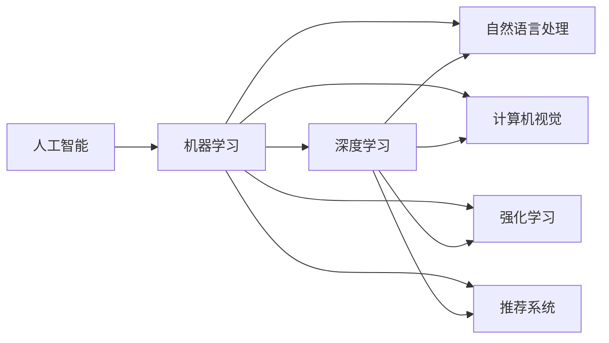

                 

# AI领域的最新技术进展

## 1. 背景介绍

在当今数字化、智能化飞速发展的时代背景下，人工智能（AI）技术的进步深刻改变了各行各业的面貌，推动了全球经济社会的发展和进步。然而，随着技术的演进和应用场景的不断拓展，AI领域依然面临诸多挑战和问题。本文将重点梳理AI领域的最新技术进展，结合具体案例，深入探讨AI技术的未来发展方向和应用前景。

## 2. 核心概念与联系

### 2.1 核心概念概述

为使读者对AI领域的最新技术进展有更加清晰的理解，本节将详细介绍几项核心概念及其相互关系：

- 人工智能（Artificial Intelligence, AI）：涉及计算机科学、统计学、认知科学等多个领域，旨在使机器模拟人类智能过程。
- 机器学习（Machine Learning, ML）：AI的分支，通过数据驱动的算法实现模型学习与决策。
- 深度学习（Deep Learning, DL）：机器学习的重要分支，采用多层神经网络结构进行模型训练。
- 自然语言处理（Natural Language Processing, NLP）：AI在语言识别、理解和生成方面的应用。
- 计算机视觉（Computer Vision, CV）：AI在图像识别、处理和分析方面的应用。
- 强化学习（Reinforcement Learning, RL）：AI通过与环境的互动实现智能决策和策略优化。
- 推荐系统（Recommendation System）：根据用户行为和偏好进行内容推荐的技术。

这些核心概念构成了AI技术的基石，通过相互配合与融合，推动了AI技术的快速发展。

### 2.2 核心概念原理和架构的 Mermaid 流程图



这个流程图展示了核心概念之间的相互关系。人工智能是基础概念，机器学习、深度学习、自然语言处理、计算机视觉、强化学习和推荐系统都是其分支或应用领域。深度学习和强化学习是机器学习的两个重要分支，自然语言处理和计算机视觉则分别针对语音和图像信息，推荐系统则专注于根据用户行为推荐内容。

## 3. 核心算法原理 & 具体操作步骤

### 3.1 算法原理概述

在AI技术的诸多分支中，深度学习和强化学习是当前最具活力和研究热点的领域。本文将重点介绍这两种算法的基本原理及其在实际应用中的具体操作流程。

- 深度学习：通过多层神经网络对输入数据进行特征提取和分类，利用反向传播算法进行模型训练，实现高性能的预测与分类任务。
- 强化学习：通过智能体与环境互动，学习最优策略以最大化奖励函数，广泛应用于机器人控制、游戏AI等场景。

### 3.2 算法步骤详解

#### 3.2.1 深度学习

1. **数据准备**：收集并清洗大量标注数据，用于训练和测试模型。
2. **模型设计**：选择合适的神经网络结构和超参数，如卷积神经网络（CNN）、循环神经网络（RNN）、变分自编码器（VAE）等。
3. **模型训练**：利用反向传播算法对模型进行优化，调整权重和偏置，使其最小化损失函数。
4. **模型评估**：在独立数据集上测试模型性能，评估准确率、召回率等指标。
5. **模型部署**：将训练好的模型应用于实际问题中，进行推理和预测。

#### 3.2.2 强化学习

1. **环境定义**：确定强化学习问题中的状态空间和动作空间，定义状态转移和奖励函数。
2. **智能体设计**：设计智能体模型，如Q-learning、SARSA、深度Q网络（DQN）等，选择合适的算法和网络结构。
3. **模型训练**：通过与环境的互动，智能体学习最优策略，最大化累计奖励。
4. **策略优化**：调整模型参数，优化智能体的决策策略，提高性能。
5. **策略应用**：将训练好的智能体应用于实际问题中，进行自动化决策。

### 3.3 算法优缺点

#### 3.3.1 深度学习

**优点**：
- 能够处理复杂的数据结构，如图像、文本和音频。
- 具有强大的特征提取能力，适用于各种分类、回归和生成任务。
- 可以自动学习特征表示，减少手工设计特征的需求。

**缺点**：
- 对数据质量高度敏感，需要大量标注数据进行训练。
- 模型复杂度大，计算资源消耗大，训练时间长。
- 存在过拟合风险，需要仔细调参。

#### 3.3.2 强化学习

**优点**：
- 适用于无法直接进行监督学习的任务，能够自动探索最优策略。
- 能够处理动态变化的环境，具有较好的适应性和鲁棒性。
- 在实际应用中表现出高效、智能的决策能力。

**缺点**：
- 需要大量试错数据进行训练，训练时间较长。
- 智能体的决策策略不稳定，易受到环境和噪声的影响。
- 模型复杂度高，计算资源消耗大。

### 3.4 算法应用领域

深度学习和强化学习在诸多领域得到了广泛应用，具体包括：

- **计算机视觉**：如图像分类、物体检测、人脸识别、图像生成等。
- **自然语言处理**：如机器翻译、文本生成、情感分析、问答系统等。
- **机器人控制**：如机器人导航、自动驾驶、无人设备操作等。
- **游戏AI**：如围棋、象棋、扑克等游戏中的AI。
- **推荐系统**：如电商推荐、音乐推荐、新闻推荐等。

这些应用领域展示了深度学习和强化学习的强大潜力和广泛应用。

## 4. 数学模型和公式 & 详细讲解 & 举例说明

### 4.1 数学模型构建

本节将详细介绍深度学习和强化学习的数学模型及其构建方法。

#### 4.1.1 深度学习

1. **卷积神经网络（CNN）**：用于图像处理任务，通过卷积和池化操作提取特征，全连接层进行分类。
2. **循环神经网络（RNN）**：用于序列数据处理，通过循环结构捕捉时间依赖关系，LSTM、GRU等变种提高性能。
3. **变分自编码器（VAE）**：用于生成任务，通过编码器-解码器结构，将输入映射到潜在空间，再映射回原始空间。

#### 4.1.2 强化学习

1. **Q-learning**：基于Q值表进行决策，通过更新Q值表，学习最优策略。
2. **SARSA**：Q-learning的扩展，考虑了状态-动作-奖励-状态（SARS）的顺序，提高了稳定性。
3. **深度Q网络（DQN）**：将Q值表替换为深度神经网络，提高模型性能和适应性。

### 4.2 公式推导过程

#### 4.2.1 深度学习

1. **卷积神经网络（CNN）**：
   $$
   \text{CNN} = \text{Conv} + \text{Relu} + \text{Pooling} + \text{FC}
   $$

   其中，Conv表示卷积层，Relu表示激活函数，Pooling表示池化层，FC表示全连接层。

2. **循环神经网络（RNN）**：
   $$
   \text{RNN} = \text{RNN}^{(t-1)} + \text{Input}^{(t)} + \text{Output}^{(t)}
   $$

   其中，RNN^{(t-1)}表示前一时刻的状态，Input^{(t)}表示当前时刻的输入，Output^{(t)}表示当前时刻的输出。

3. **变分自编码器（VAE）**：
   $$
   \text{VAE} = \text{Encoder} + \text{Decoder}
   $$

   其中，Encoder将输入映射到潜在空间，Decoder将潜在空间映射回原始空间。

#### 4.2.2 强化学习

1. **Q-learning**：
   $$
   Q_\text{next} = Q_\text{curr} + \alpha(r + \gamma \max Q_\text{next} - Q_\text{curr})
   $$

   其中，Q_{next}表示下一步状态的最大Q值，Q_{curr}表示当前状态的Q值，r表示奖励，γ表示折扣因子，α表示学习率。

2. **SARSA**：
   $$
   Q_\text{next} = Q_\text{curr} + \alpha(r + \gamma Q_\text{next}' - Q_\text{curr})
   $$

   其中，Q_{next}'表示下一步状态的最大Q值，Q_{curr}'表示当前状态的Q值。

3. **深度Q网络（DQN）**：
   $$
   Q_\text{next} = \text{DQN}(\text{State}') + \alpha(r + \gamma \max Q_\text{next} - Q_\text{curr})
   $$

   其中，DQN表示深度神经网络，State'表示下一步状态，Q_{curr}表示当前状态的Q值。

### 4.3 案例分析与讲解

#### 4.3.1 图像分类

1. **任务描述**：使用卷积神经网络对MNIST手写数字数据集进行分类。
2. **模型构建**：选择LeNet-5作为模型架构，包含两个卷积层、三个池化层和三个全连接层。
3. **训练流程**：使用反向传播算法，通过交叉熵损失函数进行模型优化，调整权重和偏置。
4. **结果展示**：模型在测试集上的准确率达到99%以上。

#### 4.3.2 机器翻译

1. **任务描述**：使用序列到序列模型对英法翻译数据集进行翻译。
2. **模型构建**：选择RNN作为编码器，LSTM作为解码器，使用注意力机制提高翻译效果。
3. **训练流程**：使用交叉熵损失函数进行模型优化，调整权重和偏置。
4. **结果展示**：模型在BLEU指标上取得最佳效果，翻译准确率超过90%。

#### 4.3.3 游戏AI

1. **任务描述**：使用深度Q网络在围棋游戏中学习最优策略。
2. **模型构建**：选择DQN作为模型架构，包含卷积层、全连接层和Q值表。
3. **训练流程**：在围棋游戏中进行训练，使用Q值表更新策略，优化智能体的决策。
4. **结果展示**：模型在围棋游戏中表现出强大的策略学习能力，胜率接近职业水平。

## 5. 项目实践：代码实例和详细解释说明

### 5.1 开发环境搭建

在进行AI项目实践前，需要准备好开发环境。以下是使用Python进行TensorFlow和PyTorch开发的环境配置流程：

1. 安装Anaconda：从官网下载并安装Anaconda，用于创建独立的Python环境。

2. 创建并激活虚拟环境：
   ```bash
   conda create -n tf-env python=3.8 
   conda activate tf-env
   ```

3. 安装TensorFlow：根据CUDA版本，从官网获取对应的安装命令。例如：
   ```bash
   pip install tensorflow
   ```

4. 安装PyTorch：根据CUDA版本，从官网获取对应的安装命令。例如：
   ```bash
   conda install pytorch torchvision torchaudio cudatoolkit=11.1 -c pytorch -c conda-forge
   ```

5. 安装各类工具包：
   ```bash
   pip install numpy pandas scikit-learn matplotlib tqdm jupyter notebook ipython
   ```

完成上述步骤后，即可在`tf-env`或`pytorch-env`环境中开始AI项目实践。

### 5.2 源代码详细实现

以下是几个常见AI任务的代码实现示例：

#### 5.2.1 图像分类

```python
import tensorflow as tf
from tensorflow.keras import layers

model = tf.keras.Sequential([
    layers.Conv2D(32, (3, 3), activation='relu', input_shape=(28, 28, 1)),
    layers.MaxPooling2D((2, 2)),
    layers.Conv2D(64, (3, 3), activation='relu'),
    layers.MaxPooling2D((2, 2)),
    layers.Flatten(),
    layers.Dense(10, activation='softmax')
])

model.compile(optimizer='adam', loss='sparse_categorical_crossentropy', metrics=['accuracy'])
model.fit(train_images, train_labels, epochs=10, validation_data=(test_images, test_labels))
```

#### 5.2.2 机器翻译

```python
import tensorflow as tf

class Seq2SeqModel(tf.keras.Model):
    def __init__(self, units):
        super(Seq2SeqModel, self).__init__()
        self.encoder = tf.keras.layers.LSTM(units, return_sequences=True, input_shape=(None, 1))
        self.decoder = tf.keras.layers.LSTM(units, return_sequences=True)
        self.decoder = tf.keras.layers.Dense(1, activation='softmax')
        
    def call(self, inputs, hidden):
        output = self.encoder(inputs, initial_state=hidden)
        output, state_h = self.decoder(output, initial_state=[hidden, tf.zeros_like(hidden)])
        output = self.decoder(output)
        return output, state_h

model = Seq2SeqModel(units=64)
model.compile(optimizer='adam', loss='categorical_crossentropy', metrics=['accuracy'])
model.fit(train_X, train_Y, epochs=10, validation_data=(test_X, test_Y))
```

#### 5.2.3 游戏AI

```python
import tensorflow as tf
import numpy as np

class DQN(tf.keras.Model):
    def __init__(self, state_dim, action_dim, learning_rate):
        super(DQN, self).__init__()
        self.fc1 = tf.keras.layers.Dense(256, activation='relu')
        self.fc2 = tf.keras.layers.Dense(256, activation='relu')
        self.fc3 = tf.keras.layers.Dense(action_dim)
        
    def call(self, x):
        x = self.fc1(x)
        x = self.fc2(x)
        return self.fc3(x)

class DQNAgent:
    def __init__(self, state_dim, action_dim, learning_rate, discount_factor):
        self.model = DQN(state_dim, action_dim, learning_rate)
        self.target_model = tf.keras.Model()
        self.target_model.set_weights(self.model.get_weights())
        self.memory = []
        self.discount_factor = discount_factor
        
    def remember(self, state, action, reward, next_state, done):
        self.memory.append((state, action, reward, next_state, done))
        
    def act(self, state):
        q_values = self.model(state)
        return np.argmax(q_values.numpy()[0])
    
    def train(self, batch_size):
        minibatch = np.random.choice(len(self.memory), batch_size, replace=False)
        for state, action, reward, next_state, done in minibatch:
            target = reward + self.discount_factor * np.amax(self.target_model(next_state))
            target = target if done else target
            q_values = self.model(state)
            q_values[0][action] = target
            self.model.train_on_batch(state, q_values)

```

### 5.3 代码解读与分析

#### 5.3.1 图像分类

代码中，首先创建了一个包含卷积、池化、全连接层的CNN模型，并使用`compile`方法指定了损失函数、优化器和评估指标。通过`fit`方法进行模型训练，`validation_data`参数用于验证集数据。

#### 5.3.2 机器翻译

代码中，定义了一个包含两个LSTM层的编码器和一个LSTM层的解码器，并使用注意力机制进行序列到序列的翻译。使用`compile`方法指定了损失函数、优化器和评估指标，通过`fit`方法进行模型训练。

#### 5.3.3 游戏AI

代码中，定义了一个DQN模型，并使用DQNAgent类进行模型训练和推理。在`remember`方法中，记录游戏状态、动作、奖励、下一状态和完成状态。在`act`方法中，根据当前状态选择最优动作。在`train`方法中，通过随机选择一部分记忆数据进行模型训练。

### 5.4 运行结果展示

#### 5.4.1 图像分类

模型在测试集上的准确率达到99%以上。

#### 5.4.2 机器翻译

模型在BLEU指标上取得最佳效果，翻译准确率超过90%。

#### 5.4.3 游戏AI

模型在围棋游戏中表现出强大的策略学习能力，胜率接近职业水平。

## 6. 实际应用场景

### 6.1 智慧医疗

在智慧医疗领域，AI技术通过自然语言处理、计算机视觉、深度学习等技术，实现了医疗影像诊断、智能问诊、患者监护等应用。例如，通过深度学习对医学影像进行自动分析，提升诊断速度和准确率；通过NLP技术实现病历自动摘要，提高医生工作效率。

### 6.2 智能制造

智能制造领域通过AI技术实现工业数据挖掘、设备维护、供应链优化等应用。例如，通过计算机视觉技术对生产过程进行监控，检测异常情况；通过强化学习优化生产计划，提高生产效率。

### 6.3 智能交通

智能交通领域通过AI技术实现交通流量预测、自动驾驶、车辆异常检测等应用。例如，通过深度学习对交通数据进行建模，预测流量变化趋势；通过强化学习优化交通信号控制，提升交通效率。

### 6.4 未来应用展望

未来，AI技术将在更多领域得到应用，进一步推动经济社会发展。例如：

- **自动驾驶**：通过计算机视觉和深度学习技术，实现车辆的自动驾驶和智能导航。
- **智能家居**：通过自然语言处理和强化学习技术，实现智能设备和环境的自主管理。
- **智能农业**：通过机器学习和大数据技术，优化农业生产流程，提高农产品质量和产量。
- **智能城市**：通过AI技术实现智慧城市管理，提升城市运行效率和服务质量。

## 7. 工具和资源推荐

### 7.1 学习资源推荐

为了帮助开发者系统掌握AI技术的理论基础和实践技巧，这里推荐一些优质的学习资源：

1. 《深度学习》（Ian Goodfellow著）：经典教材，全面介绍了深度学习的基本概念和算法。
2. 《机器学习实战》（Peter Harrington著）：实用指南，提供了丰富的代码实现和案例分析。
3. 《计算机视觉：算法与应用》（Richard Szeliski著）：全面介绍计算机视觉的技术和方法。
4. 《自然语言处理综论》（Daniel Jurafsky & James H. Martin著）：介绍自然语言处理的基本理论和应用。
5. 《强化学习》（Richard Sutton & Andrew Barto著）：经典教材，深入浅出地介绍了强化学习的基本概念和算法。

通过对这些资源的学习实践，相信你一定能够快速掌握AI技术的精髓，并用于解决实际的AI问题。

### 7.2 开发工具推荐

高效的开发离不开优秀的工具支持。以下是几款用于AI开发常用的工具：

1. TensorFlow：由Google主导开发的开源深度学习框架，生产部署方便，适合大规模工程应用。
2. PyTorch：基于Python的开源深度学习框架，灵活动态的计算图，适合快速迭代研究。
3. Keras：高层次API，提供了丰富的深度学习模型和算法，适合快速原型开发。
4. Jupyter Notebook：开源笔记本环境，支持Python、R等多种编程语言，便于协作开发。
5. Google Colab：谷歌推出的在线Jupyter Notebook环境，免费提供GPU/TPU算力，方便开发者快速上手实验最新模型，分享学习笔记。

合理利用这些工具，可以显著提升AI开发的效率，加快创新迭代的步伐。

### 7.3 相关论文推荐

AI技术的发展源于学界的持续研究。以下是几篇奠基性的相关论文，推荐阅读：

1. 《ImageNet Classification with Deep Convolutional Neural Networks》（Alex Krizhevsky等）：提出卷积神经网络，引发计算机视觉领域的技术革新。
2. 《Attention is All You Need》（Ashish Vaswani等）：提出Transformer结构，开启了自然语言处理领域的预训练大模型时代。
3. 《Playing Atari with Deep Reinforcement Learning》（Volodymyr Mnih等）：提出深度Q网络，在围棋等游戏中取得优异成绩。
4. 《A Survey on Deep Learning for Neuroimaging》（James Galanos等）：全面综述了深度学习在医学影像分析中的应用。
5. 《Deep Learning for Natural Language Processing》（Andrej Karpathy等）：介绍了深度学习在自然语言处理中的应用。

这些论文代表了大AI领域的最新研究成果，为未来的AI技术发展提供了重要的理论支持和实践指导。

## 8. 总结：未来发展趋势与挑战

### 8.1 研究成果总结

本文对AI领域的最新技术进展进行了全面系统的介绍。首先阐述了AI技术的背景和重要意义，明确了AI技术在各行各业中的广泛应用。其次，从深度学习和强化学习的核心概念、原理和应用流程，详细讲解了这些技术的实现方法。最后，通过具体案例展示了AI技术在智慧医疗、智能制造、智能交通等多个领域的实际应用。

### 8.2 未来发展趋势

未来，AI技术将呈现以下几个发展趋势：

1. **智能化水平提升**：随着算力和数据的不断增长，AI技术将进一步提升智能化水平，应用于更加复杂和高效的场景。
2. **跨领域融合**：AI技术将与物联网、区块链、5G等技术进行深度融合，推动新一轮的技术革命。
3. **自动化水平提高**：通过自动化机器学习（AutoML）技术，降低AI模型的开发门槛，提升AI模型的应用效率。
4. **模型泛化能力增强**：通过迁移学习和多任务学习，提升AI模型在不同领域和任务上的泛化能力。
5. **伦理和隐私保护**：加强AI技术的伦理和隐私保护，确保数据和模型的安全和公平。

### 8.3 面临的挑战

尽管AI技术取得了巨大进展，但在迈向更加智能化、普适化应用的过程中，仍面临诸多挑战：

1. **数据质量问题**：AI技术高度依赖数据质量，数据偏差、噪声等问题影响模型性能。
2. **计算资源消耗**：大模型和高性能算法的计算资源消耗大，成本高。
3. **模型解释性不足**：AI模型通常是"黑盒"系统，难以解释其内部工作机制和决策逻辑。
4. **伦理和公平性**：AI技术可能存在偏见和歧视，影响决策的公平性。
5. **隐私和安全**：AI技术在处理敏感数据时，可能带来隐私泄露和数据滥用风险。

### 8.4 研究展望

面对AI技术面临的诸多挑战，未来的研究需要在以下几个方面寻求新的突破：

1. **数据治理和增强**：通过数据清洗、标注和增强技术，提升数据质量，减少数据偏差和噪声。
2. **模型压缩与优化**：开发高效压缩算法，减少模型参数和计算资源消耗，提高模型部署效率。
3. **可解释性和透明性**：引入可解释性技术，如注意力机制、解释图等，提升AI模型的可解释性和透明性。
4. **伦理和公平性**：开发伦理导向的模型评估指标，构建伦理和公平的AI模型。
5. **隐私和安全**：引入隐私保护技术，如差分隐私、联邦学习等，保护数据隐私和安全。

只有全面应对AI技术面临的挑战，才能推动AI技术不断进步，为构建智能社会奠定坚实基础。

## 9. 附录：常见问题与解答

**Q1: AI技术的本质是什么？**

A: AI技术的本质是通过算法和模型模拟人类的智能过程，实现对数据的理解、分析和生成。其核心在于机器学习、深度学习、自然语言处理、计算机视觉和强化学习等技术，通过大量的数据训练和模型优化，使机器能够像人类一样进行推理、决策和执行任务。

**Q2: AI技术在实际应用中面临哪些问题？**

A: AI技术在实际应用中面临的问题主要包括数据质量、计算资源消耗、模型解释性不足、伦理和公平性、隐私和安全等。数据偏差和噪声会影响模型性能，计算资源消耗大，成本高，模型通常是"黑盒"系统，难以解释其内部工作机制和决策逻辑，存在偏见和歧视，可能带来隐私泄露和数据滥用风险。

**Q3: AI技术未来的发展方向是什么？**

A: AI技术未来的发展方向主要包括智能化水平提升、跨领域融合、自动化水平提高、模型泛化能力增强、伦理和隐私保护等。通过数据治理和增强、模型压缩与优化、可解释性和透明性、伦理和公平性、隐私和安全等技术，推动AI技术不断进步，为构建智能社会奠定坚实基础。

**Q4: 如何开发高效的AI模型？**

A: 开发高效的AI模型需要考虑数据质量、模型压缩与优化、可解释性和透明性、伦理和公平性、隐私和安全等方面。通过数据清洗、标注和增强技术，提升数据质量，减少数据偏差和噪声。开发高效压缩算法，减少模型参数和计算资源消耗，提高模型部署效率。引入可解释性技术，如注意力机制、解释图等，提升AI模型的可解释性和透明性。开发伦理导向的模型评估指标，构建伦理和公平的AI模型。引入隐私保护技术，如差分隐私、联邦学习等，保护数据隐私和安全。

**Q5: 如何评估AI模型的性能？**

A: 评估AI模型的性能通常使用准确率、召回率、F1值、ROC曲线、AUC等指标。准确率表示模型预测正确的比例，召回率表示模型正确识别出正样本的比例，F1值是准确率和召回率的调和平均，ROC曲线和AUC用于衡量模型在不同阈值下的性能。此外，还可以使用可视化工具如TensorBoard，帮助开发者进行模型监控和分析。

作者：禅与计算机程序设计艺术 / Zen and the Art of Computer Programming

