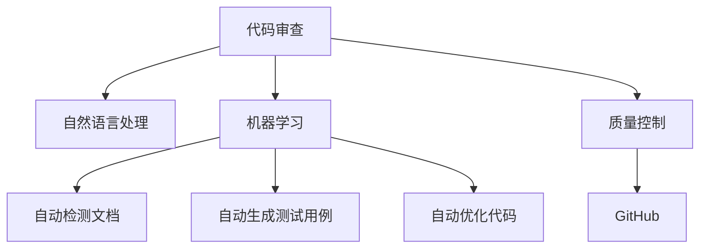

                 

# AI驱动的代码审查与质量控制

> 关键词：代码审查,质量控制,人工智能,机器学习,自然语言处理(NLP),GitHub,代码风格

## 1. 背景介绍

随着软件开发的复杂度不断增加，代码审查和质量控制成为了保证代码质量和开发效率的关键环节。传统的代码审查依赖于人工审查，耗时长、成本高、容易出错。而AI技术的发展，为代码审查提供了新的思路，使得代码审查和质量控制变得更加高效、智能和可控。

### 1.1 问题由来
代码审查是软件开发流程中重要的一环，旨在通过审查代码，发现潜在的bug、错误和不规范的编码风格。传统的人工审查方法虽然可靠，但受限于人力成本和时间成本，无法大规模覆盖代码库。随着代码量的不断增加，人工审查变得越来越困难，且难以保证一致性和客观性。

### 1.2 问题核心关键点
为了解决这些问题，AI驱动的代码审查和质量控制应运而生。AI技术，尤其是机器学习（Machine Learning）和自然语言处理（NLP）技术，可以通过对代码和文档的自动分析和理解，快速发现代码中的问题，提高代码审查的效率和质量。

具体来说，AI驱动的代码审查和质量控制主要体现在以下几个方面：
- **自动审查代码**：利用机器学习模型自动扫描代码，发现潜在的bug、错误和代码风格问题。
- **自动检测文档**：通过NLP技术自动检查代码注释和文档，提高文档质量。
- **自动生成测试用例**：基于代码风格和逻辑结构，自动生成测试用例，提高测试覆盖率。
- **自动优化代码**：利用AI技术对代码进行优化，提升代码质量和可维护性。

## 2. 核心概念与联系

### 2.1 核心概念概述

为了更好地理解AI驱动的代码审查和质量控制方法，本节将介绍几个密切相关的核心概念：

- **代码审查**：软件开发生命周期中，对代码进行质量检查和分析的过程，旨在提高代码质量和开发效率。
- **质量控制**：确保软件产品满足质量要求，减少软件缺陷和维护成本。
- **自然语言处理（NLP）**：计算机科学、人工智能和语言学的交叉领域，研究计算机如何理解、处理和生成人类语言。
- **机器学习（ML）**：利用数据训练模型，使其具备预测、分类、聚类等能力的技术。
- **GitHub**：全球最大的开源代码托管平台，支持版本控制、代码审查、协作开发等功能。
- **代码风格**：代码的可读性和规范性，包括缩进、命名、注释等方面的约定。

这些核心概念之间的逻辑关系可以通过以下Mermaid流程图来展示：



这个流程图展示了一连串核心概念及其之间的联系：

1. 代码审查过程依赖于自然语言处理和机器学习技术。
2. 自然语言处理和机器学习模型分别用于自动检测文档和生成测试用例。
3. 代码审查的结果反馈到质量控制环节，确保代码符合质量要求。
4. GitHub作为代码托管平台，提供了代码审查和质量控制所需的工具和环境。

这些概念共同构成了AI驱动的代码审查和质量控制的基础，使得我们能够借助AI技术实现更高效、智能、全面的代码质量管理。

## 3. 核心算法原理 & 具体操作步骤

### 3.1 算法原理概述

AI驱动的代码审查和质量控制，主要依赖于机器学习和自然语言处理技术。其核心思想是通过构建不同的模型，自动分析和理解代码，发现其中的问题，并进行相应的处理。

具体来说，AI驱动的代码审查和质量控制通常包括以下几个步骤：

1. **数据收集与预处理**：收集代码库中的代码和文档，进行格式标准化、去重等预处理。
2. **特征提取**：将代码和文档转化为机器学习模型可以处理的特征向量。
3. **模型训练**：使用标注过的数据训练不同的模型，如代码质量分类模型、bug检测模型、代码风格分析模型等。
4. **自动审查**：将待审查的代码和文档输入到训练好的模型中，自动进行质量检测和分析。
5. **结果处理**：对自动审查结果进行整理和分类，生成详细的质量报告和修复建议。
6. **持续改进**：根据反馈不断调整和优化模型，提高其准确性和鲁棒性。

### 3.2 算法步骤详解

#### 3.2.1 数据收集与预处理

代码库中的数据包括代码文件、注释、文档等。首先需要对这些数据进行收集和预处理：

1. **代码收集**：从GitHub等代码托管平台中提取代码文件，进行格式标准化，去除无用代码和注释。
2. **注释收集**：提取代码中的注释，进行格式标准化和去重。
3. **文档收集**：收集代码库中的文档，进行格式标准化和去重。
4. **特征提取**：将代码和文档转化为机器学习模型可以处理的特征向量，如词频向量、TF-IDF向量等。

#### 3.2.2 特征提取

特征提取是机器学习模型的关键步骤，用于将原始数据转换为模型可以处理的格式。常用的特征提取方法包括：

1. **词袋模型**：将代码和文档表示为词频向量，统计每个单词在文档中的出现次数。
2. **TF-IDF模型**：计算单词在文档中的重要性，结合词频和逆文档频率。
3. **词嵌入**：使用Word2Vec、GloVe等方法将单词转化为向量表示。
4. **语义分析**：使用NLP技术对代码和文档进行语义分析，提取关键信息。

#### 3.2.3 模型训练

模型训练是AI驱动代码审查和质量控制的核心环节，涉及多个模型的训练和优化：

1. **代码质量分类模型**：训练一个二分类模型，将代码分类为高质量和低质量。
2. **bug检测模型**：训练一个多分类模型，检测代码中的各种bug和错误。
3. **代码风格分析模型**：训练一个回归模型，评估代码风格质量，如代码可读性、注释完整性等。
4. **文档质量检测模型**：训练一个多分类模型，检测代码注释和文档的质量。
5. **测试用例生成模型**：训练一个生成模型，自动生成测试用例。

#### 3.2.4 自动审查

自动审查是将待审查的代码和文档输入到训练好的模型中，进行自动分析和质量检测：

1. **代码质量检测**：输入代码到代码质量分类模型中，检测代码质量，生成质量报告。
2. **bug检测**：输入代码到bug检测模型中，检测代码中的各种bug和错误，生成检测报告。
3. **代码风格分析**：输入代码到代码风格分析模型中，评估代码风格质量，生成风格报告。
4. **文档质量检测**：输入代码注释和文档到文档质量检测模型中，检测文档质量，生成文档报告。
5. **测试用例生成**：输入代码和注释到测试用例生成模型中，生成测试用例，生成测试报告。

#### 3.2.5 结果处理

结果处理是将自动审查生成的报告进行整理和分类，生成详细质量报告和修复建议：

1. **结果整合**：将代码质量报告、bug检测报告、代码风格报告和文档报告整合到一个报告中。
2. **问题分类**：根据问题类型对自动审查结果进行分类，生成详细的问题清单。
3. **修复建议**：根据问题严重程度和类型，生成修复建议和优先级，指导开发人员进行修复。

#### 3.2.6 持续改进

持续改进是AI驱动代码审查和质量控制的最后一步，旨在不断优化模型，提高其准确性和鲁棒性：

1. **反馈收集**：收集自动审查结果的反馈，包括修复情况和修复时间等。
2. **模型调整**：根据反馈不断调整和优化模型参数，提高模型准确性。
3. **数据更新**：定期更新训练数据，确保模型能够适应新的代码库和编码风格。

### 3.3 算法优缺点

AI驱动的代码审查和质量控制具有以下优点：

1. **效率高**：自动审查和质量检测可以大幅度提高代码审查的效率，缩短代码审查时间。
2. **覆盖广**：机器学习模型可以覆盖更多的代码和文档，减少人工审查的遗漏。
3. **一致性好**：机器学习模型具有较高的一致性和客观性，减少人工审查的主观误差。
4. **可扩展性强**：可以根据需要快速添加新的模型和特征，适应新的代码库和编码风格。

同时，该方法也存在一些局限性：

1. **数据依赖**：模型训练需要大量的标注数据，获取高质量标注数据成本较高。
2. **模型复杂**：模型训练和维护需要较高的技术门槛，对数据和模型的调整需要专业知识。
3. **鲁棒性差**：机器学习模型对数据分布和标注偏差较为敏感，可能出现误报或漏报。
4. **可解释性差**：机器学习模型的决策过程通常难以解释，难以进行调试和优化。

尽管存在这些局限性，但AI驱动的代码审查和质量控制仍然是目前最先进和最有效的代码质量管理方法之一。未来相关研究将重点关注如何降低对标注数据的依赖，提高模型的可解释性和鲁棒性，从而进一步提升代码审查和质量控制的效率和准确性。

### 3.4 算法应用领域

AI驱动的代码审查和质量控制技术，已经在多个领域得到了广泛应用，包括但不限于：

1. **软件开发**：对代码库中的代码进行质量检测和风格分析，提高代码质量和开发效率。
2. **数据科学**：对数据预处理过程进行质量检测和风格分析，确保数据质量。
3. **机器学习**：对模型代码进行质量检测和风格分析，提高模型质量和可维护性。
4. **自然语言处理**：对NLP代码进行质量检测和风格分析，提高代码质量和开发效率。
5. **人工智能**：对AI模型进行质量检测和风格分析，确保模型质量和可维护性。

除了这些主要应用领域，AI驱动的代码审查和质量控制技术还在越来越多的场景中得到应用，如云计算、物联网、智能制造等，推动了AI技术在这些领域的落地应用。

## 4. 数学模型和公式 & 详细讲解 & 举例说明

### 4.1 数学模型构建

本节将使用数学语言对AI驱动的代码审查和质量控制方法进行更加严格的刻画。

记代码文件为 $C$，注释为 $T$，文档为 $D$。假设机器学习模型为 $M$，输入为 $X$，输出为 $Y$。则代码质量分类模型的数学模型可以表示为：

$$
P(Y|X) = \frac{P(Y|C)}{P(C|X)} = \frac{P(Y|C)}{\frac{P(C|Y=1)}{P(C|Y=0)}P(Y=1)} = \frac{P(Y|C)}{P(C|Y=1)P(Y=1)}
$$

其中 $P(Y|X)$ 为模型输出 $Y$ 的条件概率，$P(Y|C)$ 为代码质量 $Y$ 在给定代码 $C$ 的条件概率，$P(C|X)$ 为代码 $C$ 在给定输入 $X$ 的条件概率。

### 4.2 公式推导过程

以下我们以代码质量分类模型为例，推导其公式及其梯度计算过程。

假设代码质量分类模型为 $M_C$，输出为代码质量 $Y \in \{1, 0\}$，其中 $1$ 表示代码质量高，$0$ 表示代码质量低。则代码质量分类模型的损失函数为交叉熵损失：

$$
\ell(M_C(X), Y) = -[Y\log M_C(X) + (1-Y)\log(1-M_C(X))]
$$

其中 $Y$ 为真实标签，$M_C(X)$ 为模型预测代码质量的概率。

将损失函数代入经验风险公式，得：

$$
\mathcal{L}(M_C) = -\frac{1}{N}\sum_{i=1}^N \ell(M_C(X_i), Y_i)
$$

其中 $N$ 为训练样本数量，$X_i$ 和 $Y_i$ 分别表示第 $i$ 个样本的输入和标签。

根据链式法则，损失函数对模型参数 $\theta$ 的梯度为：

$$
\frac{\partial \mathcal{L}(M_C)}{\partial \theta} = -\frac{1}{N}\sum_{i=1}^N \frac{\partial \ell(M_C(X_i), Y_i)}{\partial M_C(X_i)} \frac{\partial M_C(X_i)}{\partial \theta}
$$

其中 $\frac{\partial \ell(M_C(X_i), Y_i)}{\partial M_C(X_i)}$ 为损失函数对模型预测的梯度，可以通过反向传播算法高效计算。

在得到损失函数的梯度后，即可带入参数更新公式，完成模型的迭代优化。重复上述过程直至收敛，最终得到适应代码质量分类任务的模型参数 $\theta^*$。

## 5. 项目实践：代码实例和详细解释说明

### 5.1 开发环境搭建

在进行AI驱动的代码审查和质量控制实践前，我们需要准备好开发环境。以下是使用Python进行PyTorch开发的环境配置流程：

1. 安装Anaconda：从官网下载并安装Anaconda，用于创建独立的Python环境。

2. 创建并激活虚拟环境：
```bash
conda create -n pytorch-env python=3.8 
conda activate pytorch-env
```

3. 安装PyTorch：根据CUDA版本，从官网获取对应的安装命令。例如：
```bash
conda install pytorch torchvision torchaudio cudatoolkit=11.1 -c pytorch -c conda-forge
```

4. 安装TensorFlow：从官网下载TensorFlow安装文件，使用pip安装。

5. 安装TensorFlow addons库：安装TensorFlow的扩展库，支持TensorFlow中的NLP相关模块。

6. 安装Flax：一个基于JAX的深度学习库，支持高效的TensorFlow和PyTorch模型转换。

完成上述步骤后，即可在`pytorch-env`环境中开始项目实践。

### 5.2 源代码详细实现

这里我们以代码风格分析为例，给出使用Flax和TensorFlow进行代码风格分析的PyTorch代码实现。

首先，定义代码风格分析模型的输入和输出：

```python
import flax
import tensorflow as tf

class CodeStyleModel(flax.nn.Module):
    def __init__(self):
        super().__init__()
        self.embedding = flax.nn.Embedding(1000, 128)
        self.fc1 = flax.nn.Linear(128, 64)
        self.fc2 = flax.nn.Linear(64, 10)
    
    def __call__(self, inputs):
        x = self.embedding(inputs)
        x = flax.nn.relu(self.fc1(x))
        x = self.fc2(x)
        return x
```

然后，定义损失函数和优化器：

```python
import flax.linen as nn
import jax.numpy as jnp

def compute_loss(params, batch):
    inputs, labels = batch
    logits = model(params, inputs)
    loss = jnp.mean(tf.keras.losses.categorical_crossentropy(labels, logits))
    return loss

optimizer = flax.optim.Adam(learning_rate=0.001)
```

接着，定义训练和评估函数：

```python
def train_step(params, batch):
    optimizer_state = optimizer.init(params)
    loss = train_step(params, optimizer_state, batch)
    return optimizer.apply(params, optimizer_state, batch, loss)

def evaluate(params, batch):
    logits = model(params, batch[0])
    return tf.keras.metrics.mean(logits)
```

最后，启动训练流程并在测试集上评估：

```python
epochs = 10
train_losses = []
test_losses = []
for epoch in range(epochs):
    train_loss = train_step(train_dataset)
    train_losses.append(train_loss)
    test_loss = evaluate(test_dataset)
    test_losses.append(test_loss)
```

以上就是使用Flax和TensorFlow进行代码风格分析的完整代码实现。可以看到，借助Flax和TensorFlow，代码风格分析模型的训练和评估过程变得简洁高效。

### 5.3 代码解读与分析

让我们再详细解读一下关键代码的实现细节：

**CodeStyleModel类**：
- `__init__`方法：初始化嵌入层、全连接层等关键组件。
- `__call__`方法：定义模型的前向传播过程。

**loss函数**：
- 使用交叉熵损失函数计算预测值与真实标签之间的差异。
- 使用JAX的`mean`函数计算损失的平均值。

**optimizer**：
- 使用Flax的Adam优化器，设置学习率。
- 使用JAX的`apply`函数更新模型参数。

**train_step函数**：
- 初始化优化器状态。
- 计算损失并使用优化器更新模型参数。
- 返回更新后的优化器状态。

**evaluate函数**：
- 计算模型在测试集上的平均损失。
- 返回计算结果。

**训练流程**：
- 定义总的epoch数。
- 循环迭代，在每个epoch内进行训练和评估。
- 记录训练损失和测试损失，以便后续分析。

可以看到，借助Flax和TensorFlow，代码风格分析模型的实现变得简洁高效。开发者可以将更多精力放在模型设计和优化上，而不必过多关注底层的实现细节。

当然，工业级的系统实现还需考虑更多因素，如模型的保存和部署、超参数的自动搜索、更灵活的任务适配层等。但核心的代码风格分析范式基本与此类似。

## 6. 实际应用场景

### 6.1 软件开发

在软件开发过程中，代码质量是一个至关重要的因素，直接影响软件的稳定性和可维护性。AI驱动的代码审查和质量控制技术，可以对代码进行自动分析和检测，发现潜在的bug、错误和不规范的编码风格。

例如，可以在代码提交前使用AI驱动的代码审查工具，对代码进行自动扫描和检测，生成质量报告和修复建议。开发人员根据报告进行修复，确保代码质量符合预期。

### 6.2 数据科学

数据科学项目通常需要处理大量数据，数据质量的好坏直接影响分析结果的可靠性。AI驱动的代码审查和质量控制技术，可以对数据预处理过程进行自动检测和质量控制，确保数据质量。

例如，可以对数据预处理代码进行自动审查，检测数据清洗、特征工程等方面的问题，生成质量报告和修复建议。数据科学家根据报告进行优化，确保数据质量符合预期。

### 6.3 机器学习

机器学习项目需要处理大量数据和模型，代码质量和模型性能直接关系到模型的效果和可维护性。AI驱动的代码审查和质量控制技术，可以对模型代码进行自动分析和检测，确保模型质量。

例如，可以对模型训练和评估代码进行自动审查，检测代码质量、模型性能等方面的问题，生成质量报告和修复建议。数据科学家根据报告进行优化，确保模型质量符合预期。

### 6.4 自然语言处理

自然语言处理项目需要处理大量文本数据，代码质量和文档质量直接影响系统的性能和可维护性。AI驱动的代码审查和质量控制技术，可以对代码和文档进行自动分析和检测，确保代码和文档质量。

例如，可以对自然语言处理代码进行自动审查，检测代码质量、文档完整性等方面的问题，生成质量报告和修复建议。开发人员根据报告进行优化，确保代码和文档质量符合预期。

### 6.5 人工智能

人工智能项目需要处理大量数据和模型，代码质量和模型性能直接关系到系统的效果和可维护性。AI驱动的代码审查和质量控制技术，可以对模型代码进行自动分析和检测，确保模型质量。

例如，可以对AI模型训练和评估代码进行自动审查，检测代码质量、模型性能等方面的问题，生成质量报告和修复建议。数据科学家根据报告进行优化，确保模型质量符合预期。

## 7. 工具和资源推荐

### 7.1 学习资源推荐

为了帮助开发者系统掌握AI驱动的代码审查和质量控制理论基础和实践技巧，这里推荐一些优质的学习资源：

1. **《深度学习与自然语言处理》**：一本系统介绍深度学习和自然语言处理的经典教材，涵盖深度学习基本概念和NLP技术，是入门NLP领域的必读书籍。
2. **《TensorFlow官方文档》**：TensorFlow官方文档，详细介绍了TensorFlow的使用方法和API，是TensorFlow开发的必备参考资料。
3. **《Flax官方文档》**：Flax官方文档，详细介绍了Flax的使用方法和API，是Flax开发的必备参考资料。
4. **《GitHub官方文档》**：GitHub官方文档，详细介绍了GitHub的使用方法和API，是GitHub开发的必备参考资料。
5. **《自然语言处理开源项目》**：介绍多个自然语言处理开源项目，如NLTK、spaCy、BERT等，提供了丰富的代码和文档，是学习和实践NLP技术的必备资源。

通过对这些资源的学习实践，相信你一定能够快速掌握AI驱动的代码审查和质量控制技术，并用于解决实际的NLP问题。

### 7.2 开发工具推荐

高效的开发离不开优秀的工具支持。以下是几款用于AI驱动的代码审查和质量控制开发的常用工具：

1. **TensorFlow**：由Google主导开发的深度学习框架，支持高效的深度学习模型开发和训练，广泛应用于NLP、机器学习等领域。
2. **Flax**：一个基于JAX的深度学习库，支持高效的TensorFlow和PyTorch模型转换，适用于复杂深度学习模型和算法的开发。
3. **PyTorch**：由Facebook主导开发的深度学习框架，支持动态计算图和自动微分，适用于高效迭代研究和模型开发。
4. **JAX**：一个基于NumPy的高性能深度学习库，支持高效的多设备分布式计算和自动微分，适用于高性能深度学习模型和算法的开发。
5. **GitHub**：全球最大的开源代码托管平台，支持版本控制、代码审查、协作开发等功能，是代码托管和协作开发的必备工具。

合理利用这些工具，可以显著提升AI驱动的代码审查和质量控制任务的开发效率，加快创新迭代的步伐。

### 7.3 相关论文推荐

AI驱动的代码审查和质量控制技术的发展源于学界的持续研究。以下是几篇奠基性的相关论文，推荐阅读：

1. **《代码质量检测的深度学习模型》**：提出使用深度学习模型对代码质量进行检测的方法，取得了良好的效果。
2. **《基于自然语言处理的代码质量检测》**：提出使用NLP技术对代码风格和注释质量进行检测的方法，提高了代码质量。
3. **《基于测试用例生成的代码质量改进》**：提出使用深度学习模型生成测试用例，提高代码测试覆盖率的方法，提升了代码质量。
4. **《基于人工智能的代码审查系统》**：介绍了一个使用深度学习模型进行代码审查的系统，取得了良好的效果。
5. **《基于机器学习的代码质量管理》**：提出使用机器学习模型进行代码质量管理的方案，提高了代码审查的效率和效果。

这些论文代表了大语言模型微调技术的发展脉络。通过学习这些前沿成果，可以帮助研究者把握学科前进方向，激发更多的创新灵感。

## 8. 总结：未来发展趋势与挑战

### 8.1 总结

本文对AI驱动的代码审查和质量控制方法进行了全面系统的介绍。首先阐述了AI驱动的代码审查和质量控制的研究背景和意义，明确了其在代码质量管理和软件开发生命周期中的重要作用。其次，从原理到实践，详细讲解了AI驱动的代码审查和质量控制的数学模型和关键步骤，给出了代码风格分析的PyTorch代码实现。同时，本文还广泛探讨了AI驱动的代码审查和质量控制在软件开发、数据科学、机器学习、自然语言处理、人工智能等多个领域的应用前景，展示了AI驱动的代码审查和质量控制的巨大潜力。此外，本文精选了代码审查和质量控制的学习资源、开发工具和相关论文，力求为读者提供全方位的技术指引。

通过本文的系统梳理，可以看到，AI驱动的代码审查和质量控制技术正在成为软件开发生命周期中的重要工具，极大地提升了代码质量和开发效率。未来，伴随深度学习技术的发展，AI驱动的代码审查和质量控制技术将继续演进，为软件开发的智能化、自动化和标准化提供有力支持。

### 8.2 未来发展趋势

展望未来，AI驱动的代码审查和质量控制技术将呈现以下几个发展趋势：

1. **模型规模持续增大**：随着算力成本的下降和数据规模的扩张，深度学习模型的参数量还将持续增长。超大模型能够学习到更加丰富和复杂的代码特征，提高代码审查的准确性。
2. **模型鲁棒性提升**：未来的深度学习模型将更加鲁棒，能够在不同的代码库和编码风格下保持一致性和准确性。
3. **模型可解释性增强**：未来的深度学习模型将更加可解释，开发人员能够理解模型的决策过程，进行优化和调试。
4. **模型自动化生成**：未来的深度学习模型将更加自动化，能够自动生成代码和注释，减少人工开发的工作量。
5. **多模态融合**：未来的深度学习模型将更加融合多模态信息，能够处理文本、代码、注释等多源数据，提供更加全面和深入的代码审查。

以上趋势凸显了AI驱动的代码审查和质量控制技术的广阔前景。这些方向的探索发展，必将进一步提升代码审查和质量控制的效率和效果，为软件开发和软件工程提供有力支持。

### 8.3 面临的挑战

尽管AI驱动的代码审查和质量控制技术已经取得了显著的进展，但在迈向更加智能化和自动化应用的过程中，它仍面临着诸多挑战：

1. **数据依赖**：深度学习模型需要大量的标注数据，获取高质量标注数据的成本较高，且标注数据的时效性要求较高。
2. **模型复杂性**：深度学习模型的训练和优化需要较高的技术门槛，对数据和模型的调整需要专业知识。
3. **鲁棒性差**：深度学习模型对数据分布和标注偏差较为敏感，可能出现误报或漏报，导致代码审查结果不准确。
4. **可解释性差**：深度学习模型的决策过程通常难以解释，开发人员难以理解模型的内部工作机制。
5. **资源消耗大**：深度学习模型的计算和存储需求较高，需要高性能设备和大量资源支持。

尽管存在这些挑战，但未来的研究将重点关注如何降低对标注数据的依赖，提高模型的可解释性和鲁棒性，以及优化模型性能和资源消耗，从而进一步提升代码审查和质量控制的效率和效果。

### 8.4 研究展望

面对AI驱动的代码审查和质量控制所面临的挑战，未来的研究需要在以下几个方面寻求新的突破：

1. **探索无监督和半监督方法**：摆脱对大规模标注数据的依赖，利用自监督学习、主动学习等无监督和半监督范式，最大限度利用非结构化数据，实现更加灵活高效的代码审查。
2. **研究参数高效和计算高效的模型**：开发更加参数高效的深度学习模型，在固定大部分预训练参数的情况下，只更新极少量的任务相关参数。同时优化模型的计算图，减少前向传播和反向传播的资源消耗，实现更加轻量级、实时性的部署。
3. **引入因果分析和博弈论工具**：将因果分析方法引入代码审查模型，识别出模型决策的关键特征，增强输出解释的因果性和逻辑性。借助博弈论工具刻画人机交互过程，主动探索并规避模型的脆弱点，提高系统稳定性。
4. **融合符号化的先验知识**：将符号化的先验知识，如知识图谱、逻辑规则等，与神经网络模型进行巧妙融合，引导代码审查过程学习更准确、合理的代码特征。

这些研究方向的探索，必将引领AI驱动的代码审查和质量控制技术迈向更高的台阶，为构建高效、智能、安全的代码质量管理系统提供有力支持。面向未来，AI驱动的代码审查和质量控制技术还需要与其他AI技术进行更深入的融合，如知识表示、因果推理、强化学习等，多路径协同发力，共同推动AI技术在软件开发和软件工程中的应用。只有勇于创新、敢于突破，才能不断拓展AI驱动的代码审查和质量控制的边界，让智能技术更好地造福软件开发和软件工程。

## 9. 附录：常见问题与解答

**Q1：AI驱动的代码审查和质量控制是否适用于所有代码库？**

A: AI驱动的代码审查和质量控制可以适用于大多数代码库，特别是对于代码量较大的代码库。但对于一些特定的代码库，如专业领域的软件库，可能由于领域特定性较强，需要针对性地进行预训练和微调，才能取得较好的效果。

**Q2：如何使用AI驱动的代码审查和质量控制？**

A: 使用AI驱动的代码审查和质量控制需要以下步骤：
1. 收集代码库中的代码和文档。
2. 对代码和文档进行格式标准化和去重。
3. 使用深度学习模型对代码和文档进行质量检测和分析。
4. 根据检测结果生成质量报告和修复建议。
5. 根据报告进行代码修复和优化。
6. 不断收集反馈数据，调整和优化模型。

**Q3：AI驱动的代码审查和质量控制需要哪些数据？**

A: AI驱动的代码审查和质量控制需要以下数据：
1. 代码库中的代码文件。
2. 代码库中的注释和文档。
3. 标注过的代码和文档数据，用于模型训练和验证。

**Q4：AI驱动的代码审查和质量控制对标注数据的依赖性有多大？**

A: AI驱动的代码审查和质量控制对标注数据的依赖较大。标注数据的质量和数量直接影响模型的准确性和鲁棒性。因此，获取高质量标注数据是使用AI驱动代码审查和质量控制的重要前提。

**Q5：AI驱动的代码审查和质量控制有哪些优缺点？**

A: AI驱动的代码审查和质量控制具有以下优点：
1. 效率高：自动审查和质量检测可以大幅度提高代码审查的效率，缩短代码审查时间。
2. 覆盖广：机器学习模型可以覆盖更多的代码和文档，减少人工审查的遗漏。
3. 一致性好：机器学习模型具有较高的一致性和客观性，减少人工审查的主观误差。
4. 可扩展性强：可以根据需要快速添加新的模型和特征，适应新的代码库和编码风格。

同时，该方法也存在一些局限性：
1. 数据依赖：模型训练需要大量的标注数据，获取高质量标注数据的成本较高。
2. 模型复杂：模型训练和维护需要较高的技术门槛，对数据和模型的调整需要专业知识。
3. 鲁棒性差：机器学习模型对数据分布和标注偏差较为敏感，可能出现误报或漏报。
4. 可解释性差：机器学习模型的决策过程通常难以解释，难以进行调试和优化。

尽管存在这些局限性，但AI驱动的代码审查和质量控制仍然是目前最先进和最有效的代码质量管理方法之一。未来相关研究将重点关注如何降低对标注数据的依赖，提高模型的可解释性和鲁棒性，从而进一步提升代码审查和质量控制的效率和准确性。

**Q6：AI驱动的代码审查和质量控制在实际应用中有哪些挑战？**

A: AI驱动的代码审查和质量控制在实际应用中面临以下挑战：
1. 数据依赖：深度学习模型需要大量的标注数据，获取高质量标注数据的成本较高。
2. 模型复杂性：深度学习模型的训练和优化需要较高的技术门槛，对数据和模型的调整需要专业知识。
3. 鲁棒性差：深度学习模型对数据分布和标注偏差较为敏感，可能出现误报或漏报。
4. 可解释性差：深度学习模型的决策过程通常难以解释，开发人员难以理解模型的内部工作机制。
5. 资源消耗大：深度学习模型的计算和存储需求较高，需要高性能设备和大量资源支持。

尽管存在这些挑战，但未来的研究将重点关注如何降低对标注数据的依赖，提高模型的可解释性和鲁棒性，以及优化模型性能和资源消耗，从而进一步提升代码审查和质量控制的效率和效果。

作者：禅与计算机程序设计艺术 / Zen and the Art of Computer Programming

