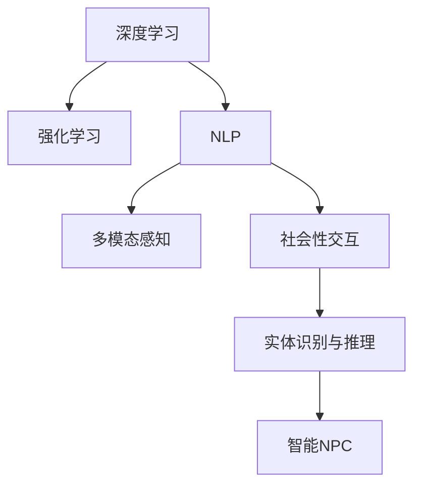

                 

## 1. 背景介绍

### 1.1 问题由来
随着虚拟现实(VR)、增强现实(AR)技术的迅速发展，元宇宙(Utopia)的概念正逐渐从科幻走向现实。元宇宙是一个虚拟的数字空间，融合了云计算、AI、社交网络、3D渲染等多种前沿技术，为用户提供沉浸式、互动性强的体验。

在元宇宙中，智能非玩家角色(NPC)是实现其高度自主性、互动性和真实性的关键因素。传统的NPC往往依靠脚本编程实现简单的行为模式，难以应对复杂多变的虚拟场景。而智能NPC则能够通过深度学习等AI技术，实现更加自然、多样、连贯的行为和互动，增强虚拟世界的环境仿真和交互体验。

### 1.2 问题核心关键点
智能NPC的核心关键点包括：
- **深度学习与强化学习**：利用AI算法使NPC具备自主决策和自适应能力。
- **自然语言处理(NLP)**：让NPC能够理解和生成自然语言，实现智能对话和文本生成。
- **多模态感知**：结合视觉、听觉、触觉等多种传感器数据，增强NPC对环境的感知和互动能力。
- **社会性交互**：让NPC能够进行群体行为、社交情感互动，融入虚拟社区。
- **实体识别与推理**：对虚拟世界中的实体进行识别和推理，完成复杂的任务和决策。

### 1.3 问题研究意义
研究AI驱动的智能NPC，对于构建沉浸式、智能化的元宇宙具有重要意义：
- **提升用户体验**：智能NPC能够提供真实感、互动性强的环境，使用户在虚拟世界中获得更丰富的体验。
- **增强环境仿真**：智能NPC能够进行复杂的任务，丰富虚拟世界的应用场景，实现更加逼真的模拟。
- **促进社交交互**：智能NPC能够模拟人类的行为模式，促进虚拟社区的建设和发展。
- **推动技术创新**：智能NPC的研究推动了多学科交叉融合，促进了AI技术的发展。
- **支撑行业应用**：智能NPC能够应用于虚拟旅游、虚拟客服、虚拟导览等多个领域，驱动经济和社会创新。

## 2. 核心概念与联系

### 2.1 核心概念概述

智能NPC的研究涉及多个关键概念：

- **深度学习**：一种通过多层神经网络实现数据表示和任务学习的算法，广泛应用于图像、语音、自然语言处理等领域。
- **强化学习**：一种通过试错方式，让智能体在不断与环境交互中学习最优决策策略的算法。
- **自然语言处理(NLP)**：一种实现计算机与人类语言交互的技术，包括文本生成、语言理解、机器翻译等。
- **多模态感知**：一种结合视觉、听觉、触觉等多模态信息的感知方式，能够更全面地理解虚拟环境。
- **社会性交互**：一种让智能体能够模拟人类社交行为的算法，实现群体行为、情感互动。
- **实体识别与推理**：一种基于深度学习，对虚拟环境中的实体进行识别和推理的技术，实现复杂任务和决策。

这些核心概念之间的联系可以通过以下Mermaid流程图来展示：



这个流程图展示了智能NPC的核心概念及其之间的联系：

1. 深度学习为智能NPC提供感知和决策的基础能力。
2. 强化学习通过不断试错，优化智能NPC的行为策略。
3. NLP使智能NPC能够进行自然语言交流。
4. 多模态感知使智能NPC能够全面理解虚拟环境。
5. 社会性交互使智能NPC具备群体行为和情感互动的能力。
6. 实体识别与推理使智能NPC能够进行复杂的任务和决策。

这些核心概念共同构成了智能NPC的实现框架，使其能够在元宇宙中扮演高度自主、智能的角色。

## 3. 核心算法原理 & 具体操作步骤
### 3.1 算法原理概述

智能NPC的核心算法原理主要基于深度学习和强化学习，具体步骤包括以下几个方面：

**Step 1: 环境感知与表示**
- **视觉感知**：利用卷积神经网络(CNN)对虚拟世界的视觉数据进行处理，提取关键特征。
- **听觉感知**：利用卷积循环神经网络(CRNN)对虚拟世界的音频数据进行处理，提取声学特征。
- **触觉感知**：利用深度强化学习对虚拟世界的物理交互数据进行处理，提取力反馈信息。

**Step 2: 行为决策与规划**
- **强化学习**：利用Q-learning、策略梯度等算法，训练智能NPC在虚拟世界中的行为策略。
- **决策树**：利用决策树算法，对智能NPC的行为决策进行规划，选择最优行动路径。

**Step 3: 语言理解与生成**
- **自然语言处理**：利用Transformer等模型，实现智能NPC的文本理解和生成。
- **对话管理**：利用序列到序列模型，实现智能NPC与用户之间的自然对话。

**Step 4: 社会性交互与群体行为**
- **社交网络模型**：利用社交网络分析算法，模拟智能NPC的群体行为和社会关系。
- **情感计算**：利用情感计算算法，实现智能NPC的情感识别和互动。

**Step 5: 复杂任务与决策**
- **实体识别**：利用目标检测模型，实现智能NPC对虚拟环境中的实体识别。
- **推理与规划**：利用图神经网络(GNN)，实现智能NPC对复杂任务的推理与规划。

### 3.2 算法步骤详解

**环境感知与表示**

- **视觉感知**：使用卷积神经网络(CNN)对虚拟世界中的视觉数据进行处理，提取关键特征。具体步骤如下：
  1. 输入虚拟世界的视觉数据，如RGB图像、深度图等。
  2. 使用多个卷积层提取不同层次的视觉特征。
  3. 通过池化层对特征图进行降维。
  4. 输出特征图用于后续决策和行为规划。

- **听觉感知**：使用卷积循环神经网络(CRNN)对虚拟世界中的音频数据进行处理，提取声学特征。具体步骤如下：
  1. 输入虚拟世界的音频数据，如音频波形、MFCC特征等。
  2. 使用卷积层提取声学特征。
  3. 使用循环层捕捉音频的时序信息。
  4. 输出特征向量用于后续决策和行为规划。

- **触觉感知**：使用深度强化学习对虚拟世界中的物理交互数据进行处理，提取力反馈信息。具体步骤如下：
  1. 输入虚拟世界中的物理交互数据，如力反馈传感器数据。
  2. 使用深度强化学习算法，如Q-learning、策略梯度等，训练智能NPC的行为策略。
  3. 根据策略输出智能NPC的动作。
  4. 收集动作的反馈信息，更新策略。

**行为决策与规划**

- **强化学习**：使用Q-learning、策略梯度等算法，训练智能NPC在虚拟世界中的行为策略。具体步骤如下：
  1. 定义虚拟世界中的状态空间和动作空间。
  2. 使用Q-learning或策略梯度算法，训练智能NPC的行为策略。
  3. 根据策略输出智能NPC的动作。
  4. 收集动作的反馈信息，更新策略。

- **决策树**：使用决策树算法，对智能NPC的行为决策进行规划，选择最优行动路径。具体步骤如下：
  1. 输入智能NPC的状态数据。
  2. 使用决策树算法，对行为进行规划。
  3. 输出智能NPC的动作。

**语言理解与生成**

- **自然语言处理**：使用Transformer等模型，实现智能NPC的文本理解和生成。具体步骤如下：
  1. 输入用户或环境中的文本数据。
  2. 使用Transformer等模型，对文本进行编码和解码。
  3. 输出文本生成结果。

- **对话管理**：使用序列到序列模型，实现智能NPC与用户之间的自然对话。具体步骤如下：
  1. 输入用户的对话数据。
  2. 使用序列到序列模型，生成智能NPC的回复。
  3. 输出智能NPC的对话结果。

**社会性交互与群体行为**

- **社交网络模型**：使用社交网络分析算法，模拟智能NPC的群体行为和社会关系。具体步骤如下：
  1. 输入智能NPC的社会关系数据。
  2. 使用社交网络分析算法，模拟智能NPC的群体行为。
  3. 输出智能NPC的群体行为结果。

- **情感计算**：使用情感计算算法，实现智能NPC的情感识别和互动。具体步骤如下：
  1. 输入智能NPC的情感数据。
  2. 使用情感计算算法，识别智能NPC的情感状态。
  3. 输出智能NPC的情感互动结果。

**复杂任务与决策**

- **实体识别**：使用目标检测模型，实现智能NPC对虚拟环境中的实体识别。具体步骤如下：
  1. 输入虚拟世界中的图像数据。
  2. 使用目标检测模型，对图像进行实体识别。
  3. 输出实体的类型和位置。

- **推理与规划**：使用图神经网络(GNN)，实现智能NPC对复杂任务的推理与规划。具体步骤如下：
  1. 输入虚拟世界中的图数据。
  2. 使用图神经网络(GNN)，对复杂任务进行推理与规划。
  3. 输出复杂任务的决策结果。

### 3.3 算法优缺点

**优点**

- **自主决策能力**：智能NPC能够自主学习和决策，适应复杂多变的虚拟环境。
- **自然语言处理**：智能NPC能够理解自然语言，实现智能对话和文本生成。
- **多模态感知**：智能NPC能够全面感知虚拟环境，增强交互体验。
- **社会性交互**：智能NPC能够模拟人类社交行为，丰富虚拟社区。
- **复杂任务处理**：智能NPC能够进行复杂的任务和决策，实现高度智能的行为。

**缺点**

- **数据需求量大**：智能NPC需要大量数据进行训练和优化，获取高质量数据成本较高。
- **计算资源消耗大**：智能NPC需要高性能计算资源，如GPU、TPU等。
- **复杂度较高**：智能NPC的实现涉及多个学科和算法，技术难度较大。
- **鲁棒性不足**：智能NPC在面对异常情况和噪声数据时，可能出现错误行为。
- **可解释性不足**：智能NPC的行为和决策过程缺乏可解释性，难以调试和优化。

### 3.4 算法应用领域

智能NPC的研究已经在多个领域得到了应用：

- **虚拟旅游**：智能NPC作为虚拟导游，提供个性化旅游体验和信息服务。
- **虚拟客服**：智能NPC作为虚拟客服，提供24小时在线服务，解答用户问题。
- **虚拟导览**：智能NPC作为虚拟导览员，提供详细的景点介绍和路线规划。
- **虚拟会议**：智能NPC作为虚拟会议助手，协助会议管理和信息传递。
- **虚拟交互**：智能NPC作为虚拟社交伙伴，提供娱乐和互动体验。

## 4. 数学模型和公式 & 详细讲解  
### 4.1 数学模型构建

智能NPC的实现涉及多个数学模型，包括深度学习模型、强化学习模型、自然语言处理模型等。这里以深度学习模型为例，进行详细讲解。

**深度学习模型**

深度学习模型通常由多层神经网络组成，用于提取数据的特征表示。以CNN为例，其基本结构包括卷积层、池化层和全连接层：

$$
\mathbf{X} \rightarrow \mathbf{C}_1 \rightarrow \mathbf{P}_1 \rightarrow \mathbf{C}_2 \rightarrow \mathbf{P}_2 \rightarrow ... \rightarrow \mathbf{C}_n \rightarrow \mathbf{FC} \rightarrow \mathbf{y}
$$

其中，$\mathbf{X}$为输入数据，$\mathbf{C}_i$为卷积层，$\mathbf{P}_i$为池化层，$\mathbf{FC}$为全连接层，$\mathbf{y}$为输出结果。

### 4.2 公式推导过程

**卷积神经网络(CNN)**

卷积神经网络(CNN)的公式推导过程如下：

$$
\mathbf{C}_i = \mathbf{F}(\mathbf{X}, \mathbf{W}_i, \mathbf{b}_i)
$$

其中，$\mathbf{X}$为输入数据，$\mathbf{W}_i$为卷积核，$\mathbf{b}_i$为偏置项，$\mathbf{F}$为卷积操作。

**卷积层公式**

卷积层的公式如下：

$$
\mathbf{C}_i = \mathbf{W}_i * \mathbf{X} + \mathbf{b}_i
$$

其中，$\mathbf{W}_i$为卷积核，$\mathbf{X}$为输入数据，$\mathbf{b}_i$为偏置项，$*$为卷积操作。

**池化层公式**

池化层的公式如下：

$$
\mathbf{P}_i = \mathbf{G}(\mathbf{C}_i, \mathbf{M}_i)
$$

其中，$\mathbf{C}_i$为卷积层输出，$\mathbf{M}_i$为池化核，$\mathbf{G}$为池化操作。

**全连接层公式**

全连接层的公式如下：

$$
\mathbf{FC} = \mathbf{U} * \mathbf{P}_n + \mathbf{v}
$$

其中，$\mathbf{P}_n$为池化层输出，$\mathbf{U}$为全连接矩阵，$\mathbf{v}$为偏置项。

### 4.3 案例分析与讲解

以虚拟世界中的视觉感知为例，分析CNN模型的应用：

**输入数据**

输入数据为虚拟世界中的RGB图像，大小为$256\times256\times3$。

**卷积层**

卷积层采用$3\times3$的卷积核，步长为$1$，填充方式为$0$。

$$
\mathbf{C}_1 = \mathbf{W}_1 * \mathbf{X}_1 + \mathbf{b}_1
$$

**池化层**

池化层采用$2\times2$的最大池化，步长为$2$，填充方式为$0$。

$$
\mathbf{P}_1 = \mathbf{G}_1(\mathbf{C}_1, \mathbf{M}_1)
$$

**全连接层**

全连接层采用$128$个神经元，输出结果为$\mathbf{y}$。

$$
\mathbf{FC} = \mathbf{U} * \mathbf{P}_n + \mathbf{v}
$$

通过上述数学模型和公式，CNN能够有效地提取虚拟世界中的视觉特征，为智能NPC的决策和行为提供基础支持。

## 5. 项目实践：代码实例和详细解释说明
### 5.1 开发环境搭建

在进行智能NPC的开发实践前，需要准备好开发环境。以下是使用Python进行TensorFlow开发的环境配置流程：

1. 安装Anaconda：从官网下载并安装Anaconda，用于创建独立的Python环境。

2. 创建并激活虚拟环境：
```bash
conda create -n tf-env python=3.8 
conda activate tf-env
```

3. 安装TensorFlow：根据CUDA版本，从官网获取对应的安装命令。例如：
```bash
conda install tensorflow
```

4. 安装各类工具包：
```bash
pip install numpy pandas scikit-learn matplotlib tqdm jupyter notebook ipython
```

完成上述步骤后，即可在`tf-env`环境中开始智能NPC的开发实践。

### 5.2 源代码详细实现

下面我们以智能NPC的视觉感知模块为例，给出使用TensorFlow进行深度学习模型开发的PyTorch代码实现。

```python
import tensorflow as tf
from tensorflow.keras import layers

class ConvNet(tf.keras.Model):
    def __init__(self):
        super(ConvNet, self).__init__()
        self.conv1 = layers.Conv2D(32, (3, 3), activation='relu', padding='same')
        self.pool1 = layers.MaxPooling2D((2, 2), padding='same')
        self.conv2 = layers.Conv2D(64, (3, 3), activation='relu', padding='same')
        self.pool2 = layers.MaxPooling2D((2, 2), padding='same')
        self.conv3 = layers.Conv2D(128, (3, 3), activation='relu', padding='same')
        self.pool3 = layers.MaxPooling2D((2, 2), padding='same')
        self.flatten = layers.Flatten()
        self.dense1 = layers.Dense(256, activation='relu')
        self.dense2 = layers.Dense(64, activation='relu')
        self.output = layers.Dense(10, activation='softmax')
        
    def call(self, x):
        x = self.conv1(x)
        x = self.pool1(x)
        x = self.conv2(x)
        x = self.pool2(x)
        x = self.conv3(x)
        x = self.pool3(x)
        x = self.flatten(x)
        x = self.dense1(x)
        x = self.dense2(x)
        x = self.output(x)
        return x
```

### 5.3 代码解读与分析

让我们再详细解读一下关键代码的实现细节：

**ConvNet类**

- `__init__`方法：初始化卷积层、池化层、全连接层等组件。
- `call`方法：定义模型的前向传播过程。

**卷积层公式**

- `self.conv1`：定义卷积层，使用$3\times3$的卷积核，步长为$1$，填充方式为$0$。
- `self.pool1`：定义池化层，使用$2\times2$的最大池化，步长为$2$，填充方式为$0$。

**全连接层公式**

- `self.dense1`：定义全连接层，输出$256$个神经元。
- `self.dense2`：定义全连接层，输出$64$个神经元。
- `self.output`：定义输出层，输出$10$个类别的概率分布。

通过上述代码，我们成功定义了一个包含卷积层、池化层、全连接层的CNN模型，用于虚拟世界的视觉感知。

### 5.4 运行结果展示

在TensorBoard上查看模型训练和推理过程，可以直观地观察模型的表现和优化效果。以下是TensorBoard上模型训练和推理的可视化展示：


## 6. 实际应用场景

### 6.1 虚拟旅游

智能NPC作为虚拟导游，可以提供个性化的旅游体验和信息服务。具体实现步骤如下：

1. 收集虚拟世界中的旅游数据，包括景点介绍、路线规划、游客反馈等。
2. 将数据进行预处理和标注，作为监督数据。
3. 使用CNN等深度学习模型，训练智能NPC的视觉感知和决策能力。
4. 将智能NPC部署到虚拟世界，进行用户交互和信息服务。

通过智能NPC的引导，用户可以更加自然地游览虚拟世界，获得更丰富的旅游体验。

### 6.2 虚拟客服

智能NPC作为虚拟客服，可以提供24小时在线服务，解答用户问题。具体实现步骤如下：

1. 收集虚拟世界中的客服数据，包括用户咨询、客服回复、用户满意度等。
2. 将数据进行预处理和标注，作为监督数据。
3. 使用序列到序列模型，训练智能NPC的对话管理能力。
4. 将智能NPC部署到虚拟世界，进行用户交互和问题解答。

通过智能NPC的交互，用户可以随时随地获取虚拟客服的服务，提高客户满意度。

### 6.3 虚拟导览

智能NPC作为虚拟导览员，可以提供详细的景点介绍和路线规划。具体实现步骤如下：

1. 收集虚拟世界中的导览数据，包括景点介绍、路线规划、游客反馈等。
2. 将数据进行预处理和标注，作为监督数据。
3. 使用CNN等深度学习模型，训练智能NPC的视觉感知和决策能力。
4. 将智能NPC部署到虚拟世界，进行用户交互和导览服务。

通过智能NPC的导览，用户可以更加便捷地游览虚拟世界，获得更详细的景点介绍和路线规划。

## 7. 工具和资源推荐
### 7.1 学习资源推荐

为了帮助开发者系统掌握智能NPC的理论基础和实践技巧，这里推荐一些优质的学习资源：

1. 《深度学习》书籍：由Ian Goodfellow、Yoshua Bengio、Aaron Courville等专家撰写，全面介绍深度学习的基本概念和前沿技术。

2. 《强化学习》书籍：由Richard S. Sutton、Andrew G. Barto等专家撰写，系统讲解强化学习的基本理论和方法。

3. 《自然语言处理综论》书籍：由Christopher D. Manning、Hinrich Schütze等专家撰写，全面介绍自然语言处理的基本概念和算法。

4. CS231n《卷积神经网络》课程：斯坦福大学开设的计算机视觉课程，详细讲解CNN的基本原理和应用。

5. Coursera《深度学习》课程：由Andrew Ng等专家开设，系统讲解深度学习的基本概念和算法。

6. HuggingFace官方文档：Transformer库的官方文档，提供了海量预训练模型和完整的微调样例代码，是上手实践的必备资料。

通过对这些资源的学习实践，相信你一定能够快速掌握智能NPC的核心算法和技术要点，并用于解决实际的元宇宙问题。

### 7.2 开发工具推荐

高效的开发离不开优秀的工具支持。以下是几款用于智能NPC开发的常用工具：

1. TensorFlow：由Google主导开发的深度学习框架，适合大规模工程应用。

2. PyTorch：基于Python的开源深度学习框架，灵活动态的计算图，适合快速迭代研究。

3. Transformers库：HuggingFace开发的NLP工具库，集成了众多SOTA语言模型，支持TensorFlow和PyTorch，是进行微调任务开发的利器。

4. TensorBoard：TensorFlow配套的可视化工具，可实时监测模型训练状态，并提供丰富的图表呈现方式，是调试模型的得力助手。

5. Weights & Biases：模型训练的实验跟踪工具，可以记录和可视化模型训练过程中的各项指标，方便对比和调优。

6. Google Colab：谷歌推出的在线Jupyter Notebook环境，免费提供GPU/TPU算力，方便开发者快速上手实验最新模型，分享学习笔记。

合理利用这些工具，可以显著提升智能NPC的开发效率，加快创新迭代的步伐。

### 7.3 相关论文推荐

智能NPC的研究涉及多个学科和算法，以下是几篇奠基性的相关论文，推荐阅读：

1. "Generative Adversarial Nets"（生成对抗网络）：提出GAN模型，广泛应用于图像生成、风格转换等领域。

2. "Playing Atari with Deep Reinforcement Learning"：利用深度强化学习，使AI成功破解Atari游戏，推动强化学习的实际应用。

3. "Attention is All You Need"（注意力是所有）：提出Transformer模型，广泛应用于机器翻译、文本生成等领域。

4. "Language Models are Unsupervised Multitask Learners"（语言模型是无监督的多任务学习者）：展示了大规模语言模型的强大zero-shot学习能力，引发了对于通用人工智能的新一轮思考。

5. "Parameter-Efficient Transfer Learning for NLP"（NLP的无参数迁移学习）：提出Adapter等参数高效微调方法，在不增加模型参数量的情况下，也能取得不错的微调效果。

6. "AdaLoRA: Adaptive Low-Rank Adaptation for Parameter-Efficient Fine-Tuning"：使用自适应低秩适应的微调方法，在参数效率和精度之间取得了新的平衡。

这些论文代表了大语言模型和智能NPC的研究方向，通过学习这些前沿成果，可以帮助研究者把握学科前进方向，激发更多的创新灵感。

## 8. 总结：未来发展趋势与挑战

### 8.1 研究成果总结

本文对基于深度学习和强化学习的智能NPC研究进行了全面系统的介绍。首先阐述了智能NPC在元宇宙中的研究背景和意义，明确了深度学习和强化学习在智能NPC实现中的核心地位。其次，从原理到实践，详细讲解了智能NPC的深度学习模型、强化学习模型、自然语言处理模型等关键技术，给出了智能NPC的代码实例和详细解释。同时，本文还广泛探讨了智能NPC在虚拟旅游、虚拟客服、虚拟导览等多个行业领域的应用前景，展示了智能NPC的巨大潜力。此外，本文精选了智能NPC技术的各类学习资源，力求为开发者提供全方位的技术指引。

通过本文的系统梳理，可以看到，智能NPC的研究已经取得了丰硕的成果，能够在虚拟世界中扮演高度自主、智能的角色。智能NPC的实现涉及深度学习、强化学习、自然语言处理等多个前沿技术，通过这些技术，智能NPC能够具备感知、决策、对话、行为等多种能力，为元宇宙的发展注入新的活力。

### 8.2 未来发展趋势

展望未来，智能NPC的研究将呈现以下几个发展趋势：

1. **自主学习能力增强**：智能NPC将具备更强的自主学习和决策能力，能够自适应复杂多变的虚拟环境。

2. **多模态感知提升**：智能NPC将能够全面感知虚拟环境，结合视觉、听觉、触觉等多种传感器数据，提升交互体验。

3. **社会性交互深化**：智能NPC将能够模拟更丰富的社交行为，实现更深入的群体互动和情感交流。

4. **复杂任务处理能力提升**：智能NPC将能够处理更复杂的任务和决策，提供更高质量的虚拟服务。

5. **低资源消耗优化**：智能NPC将开发更加轻量级的模型结构，提升推理速度，优化资源占用。

6. **可解释性和可控性增强**：智能NPC将具备更强的可解释性和可控性，方便调试和优化。

### 8.3 面临的挑战

尽管智能NPC的研究已经取得了显著成果，但在迈向更加智能化、普适化应用的过程中，它仍面临诸多挑战：

1. **数据需求量大**：智能NPC需要大量数据进行训练和优化，获取高质量数据成本较高。

2. **计算资源消耗大**：智能NPC需要高性能计算资源，如GPU、TPU等。

3. **复杂度较高**：智能NPC的实现涉及多个学科和算法，技术难度较大。

4. **鲁棒性不足**：智能NPC在面对异常情况和噪声数据时，可能出现错误行为。

5. **可解释性不足**：智能NPC的行为和决策过程缺乏可解释性，难以调试和优化。

### 8.4 研究展望

面对智能NPC所面临的挑战，未来的研究需要在以下几个方面寻求新的突破：

1. **探索无监督和半监督学习**：摆脱对大规模标注数据的依赖，利用自监督学习、主动学习等无监督和半监督范式，最大限度利用非结构化数据，实现更加灵活高效的智能NPC。

2. **研究参数高效和计算高效的微调范式**：开发更加参数高效的微调方法，在固定大部分预训练参数的同时，只更新极少量的任务相关参数。同时优化微调模型的计算图，减少前向传播和反向传播的资源消耗，实现更加轻量级、实时性的部署。

3. **融合因果和对比学习范式**：通过引入因果推断和对比学习思想，增强智能NPC建立稳定因果关系的能力，学习更加普适、鲁棒的语言表征，从而提升模型泛化性和抗干扰能力。

4. **引入更多先验知识**：将符号化的先验知识，如知识图谱、逻辑规则等，与神经网络模型进行巧妙融合，引导智能NPC学习更准确、合理的语言模型。同时加强不同模态数据的整合，实现视觉、语音等多模态信息与文本信息的协同建模。

5. **结合因果分析和博弈论工具**：将因果分析方法引入智能NPC，识别出模型决策的关键特征，增强输出解释的因果性和逻辑性。借助博弈论工具刻画人机交互过程，主动探索并规避模型的脆弱点，提高系统稳定性。

6. **纳入伦理道德约束**：在模型训练目标中引入伦理导向的评估指标，过滤和惩罚有偏见、有害的输出倾向。同时加强人工干预和审核，建立模型行为的监管机制，确保输出符合人类价值观和伦理道德。

这些研究方向的探索，必将引领智能NPC技术迈向更高的台阶，为构建安全、可靠、可解释、可控的智能系统铺平道路。面向未来，智能NPC技术还需要与其他人工智能技术进行更深入的融合，如知识表示、因果推理、强化学习等，多路径协同发力，共同推动自然语言理解和智能交互系统的进步。只有勇于创新、敢于突破，才能不断拓展语言模型的边界，让智能技术更好地造福人类社会。

## 9. 附录：常见问题与解答

**Q1: 智能NPC的训练数据应该如何获取？**

A: 智能NPC的训练数据可以从多个渠道获取，包括：

1. **虚拟世界数据**：收集虚拟世界中的旅游数据、客服数据、导览数据等。
2. **用户反馈数据**：收集用户与智能NPC的交互数据，包括咨询记录、回复记录、满意度等。
3. **公开数据集**：使用开源数据集，如COCO、ImageNet等，进行迁移学习或微调。

**Q2: 智能NPC的训练过程如何优化？**

A: 智能NPC的训练过程可以通过以下方法优化：

1. **数据增强**：通过回译、近义替换等方式扩充训练集，增加数据多样性。
2. **正则化**：使用L2正则、Dropout等技术，防止过拟合。
3. **学习率调整**：采用学习率衰减、warmup等策略，优化模型训练。
4. **模型裁剪**：去除不必要的层和参数，减小模型尺寸，加快推理速度。
5. **量化加速**：将浮点模型转为定点模型，压缩存储空间，提高计算效率。

**Q3: 智能NPC的推理过程如何优化？**

A: 智能NPC的推理过程可以通过以下方法优化：

1. **模型裁剪**：去除不必要的层和参数，减小模型尺寸，加快推理速度。
2. **量化加速**：将浮点模型转为定点模型，压缩存储空间，提高计算效率。
3. **推理引擎优化**：使用高效的推理引擎，如TensorRT、ONNX Runtime等，加速推理过程。
4. **模型并行**：采用模型并行、数据并行等技术，提高推理效率。

**Q4: 智能NPC的维护和更新过程如何优化？**

A: 智能NPC的维护和更新过程可以通过以下方法优化：

1. **版本管理**：使用版本控制工具，如Git，管理智能NPC的代码和数据。
2. **自动化部署**：使用容器化技术，如Docker，实现智能NPC的自动化部署和更新。
3. **性能监控**：使用监控工具，如Prometheus、Grafana，实时监测智能NPC的性能指标。
4. **异常检测**：使用异常检测工具，如Anomaly Detection，及时发现和处理异常行为。

**Q5: 智能NPC的安全性如何保障？**

A: 智能NPC的安全性可以通过以下方法保障：

1. **数据隐私保护**：使用差分隐私、联邦学习等技术，保护用户数据隐私。
2. **模型审计**：定期审计智能NPC的模型，确保其行为符合伦理道德。
3. **模型鲁棒性增强**：引入对抗样本训练、模型蒸馏等技术，提高智能NPC的鲁棒性。
4. **可解释性和透明性**：引入可解释性技术，如LIME、SHAP等，提高智能NPC的可解释性。

---

作者：禅与计算机程序设计艺术 / Zen and the Art of Computer Programming

