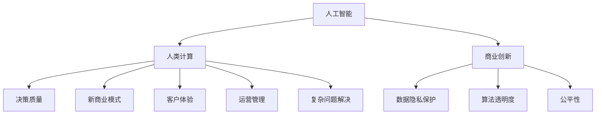

                 

# AI驱动的创新：人类计算在商业中的潜力与挑战

> 关键词：人工智能,人类计算,商业创新,创新挑战,应用场景,发展趋势,技术突破,未来展望

## 1. 背景介绍

### 1.1 问题由来
在数字化转型的浪潮中，人工智能（AI）技术的飞速发展正成为推动商业创新的重要引擎。然而，随着AI技术的日益普及，其潜在的伦理、法律和社会影响也逐渐显现。如何在享受AI带来的红利的同时，合理应对由此产生的各种挑战，成为了一个亟待解决的问题。

### 1.2 问题核心关键点
在AI技术的推动下，“人类计算”成为了一种新型的计算方式。它结合了人类的创造力和AI的计算能力，赋予了商业更多的智能和创新可能性。然而，这种融合也带来了新的挑战，如数据隐私保护、算法透明度、公平性等。本文将聚焦于“人类计算”在商业中的应用潜力及其面临的挑战，通过深入分析，为商业创新提供启示与建议。

### 1.3 问题研究意义
研究“人类计算”在商业中的应用，对于推动企业的智能化转型，提升商业竞争力，以及探索AI与人类协作的新模式，具有重要意义：

1. **提升决策质量**：结合AI的计算能力和人类的经验判断，可以大大提高商业决策的准确性和效率。
2. **创造新商业模式**：通过AI辅助设计的新型产品和服务，可以开辟新的市场空间。
3. **增强客户体验**：利用AI技术实现个性化推荐、情感分析等功能，改善客户互动，提升用户满意度。
4. **优化运营管理**：AI在供应链管理、资源调配等方面的应用，可以显著提高企业的运营效率。
5. **解决复杂问题**：面对不确定性高、复杂度大的问题，人类计算可以提供更加全面和深入的解决方案。

## 2. 核心概念与联系

### 2.1 核心概念概述

为更好地理解“人类计算”在商业中的应用潜力与挑战，本节将介绍几个关键概念：

- **人工智能**：一种通过算法使机器模拟人类智能过程的技术，包括学习、推理、自我修正等能力。
- **人类计算**：指将人类智慧与AI计算能力相结合，形成人机协同的计算模式，以解决复杂和创造性问题。
- **商业创新**：指通过引入新技术、新方法，优化现有业务流程，创造新的商业模式和服务形态的过程。
- **数据隐私保护**：指保护用户数据的个人隐私权，防止数据泄露和滥用。
- **算法透明度**：指算法的决策过程、参数设置等应公开透明，确保可解释性。
- **公平性**：指AI系统在处理不同人群、不同类型数据时，应保证公正无偏。

这些概念之间的逻辑关系可以通过以下Mermaid流程图来展示：



这个流程图展示了大语言模型的核心概念及其之间的关系：

1. 人工智能通过深度学习等技术，赋予计算机处理复杂问题的能力。
2. 人类计算利用人工智能的计算能力和人类的智慧，形成人机协作的计算模式。
3. 商业创新通过引入人工智能技术，优化现有业务流程，创造新的商业模式和服务形态。
4. 数据隐私保护、算法透明度和公平性是商业创新中必须考虑的重要因素。
5. 人类计算在决策质量提升、新商业模式创造、客户体验改善、运营管理优化和复杂问题解决等方面发挥着重要作用。

这些概念共同构成了“人类计算”的应用框架，使其能够在商业创新中发挥巨大的潜力。

## 3. 核心算法原理 & 具体操作步骤
### 3.1 算法原理概述

“人类计算”的核心理念是结合人类智慧与AI计算能力，形成人机协同的计算模式。其核心算法原理包括以下几个方面：

1. **数据预处理**：通过清洗、标注等手段，准备高质量的数据集，作为AI模型的训练和推理基础。
2. **模型训练**：选择合适的AI模型，利用训练数据对其进行训练，使其具备特定任务的能力。
3. **人机协同**：将AI模型与人类专家进行协同，解决复杂和创造性问题，如自然语言理解、情感分析、智能推荐等。
4. **效果评估**：通过评估指标（如精度、召回率、用户满意度等），对“人类计算”的效果进行量化分析。

### 3.2 算法步骤详解

以下是“人类计算”在商业中应用的具体操作步骤：

**Step 1: 准备数据集**
- 收集与业务相关的数据，进行清洗、标注等预处理，生成高质量的数据集。
- 确保数据集的多样性和代表性，覆盖不同场景和用户需求。

**Step 2: 选择和训练模型**
- 根据任务特点选择合适的AI模型，如自然语言处理、图像识别、预测模型等。
- 利用训练数据对模型进行训练，调整参数，优化模型性能。

**Step 3: 人机协同设计**
- 与业务专家和数据科学家合作，设计AI辅助的业务流程。
- 利用AI模型提供的数据洞察和预测，辅助业务决策，提升效率和质量。

**Step 4: 效果评估与迭代**
- 通过设置评估指标，对“人类计算”的效果进行量化评估。
- 根据评估结果，调整模型参数和业务流程，持续优化和迭代。

### 3.3 算法优缺点

“人类计算”具有以下优点：
1. **提升决策质量**：结合人类智慧和AI计算能力，能够提供更全面、准确的决策支持。
2. **创造新商业模式**：通过AI辅助设计的新型产品和服务，可以开辟新的市场空间。
3. **优化运营管理**：AI在供应链管理、资源调配等方面的应用，可以显著提高企业的运营效率。
4. **解决复杂问题**：面对不确定性高、复杂度大的问题，人类计算可以提供更加全面和深入的解决方案。

同时，该方法也存在一些局限性：
1. **数据依赖性高**：高质量的数据是“人类计算”的前提，数据的获取和处理成本较高。
2. **技术门槛高**：AI模型的选择和训练需要专业的技术知识和经验。
3. **隐私和伦理问题**：AI模型处理敏感数据时，可能涉及数据隐私和伦理问题。
4. **算法透明度不足**：某些AI模型（如深度学习）的决策过程复杂，难以解释和理解。

尽管存在这些局限性，但就目前而言，“人类计算”仍是大数据时代商业创新的重要手段。未来相关研究的重点在于如何进一步降低技术门槛，提高数据质量，同时兼顾隐私和伦理等因素。

### 3.4 算法应用领域

“人类计算”在商业中的应用领域广泛，具体包括：

- **金融行业**：利用AI进行风险评估、信用评分、智能投顾等，提升金融服务的智能化水平。
- **零售业**：通过AI进行客户分析、个性化推荐、库存管理等，优化供应链和营销策略。
- **医疗行业**：利用AI进行疾病预测、医学影像分析、智能诊断等，提高医疗服务的效率和质量。
- **制造业**：通过AI进行质量控制、故障预测、供应链优化等，提升生产效率和产品质量。
- **物流行业**：利用AI进行路径规划、配送优化、需求预测等，提高物流效率和客户满意度。
- **能源行业**：通过AI进行能源消耗预测、智能调度、故障预警等，优化能源管理。
- **娱乐行业**：利用AI进行内容推荐、用户行为分析、智能创作等，提升用户体验。

## 4. 数学模型和公式 & 详细讲解
### 4.1 数学模型构建

在“人类计算”中，模型的选择和训练是一个核心环节。以一个简单的线性回归模型为例，其数学模型可以表示为：

$$
y = \beta_0 + \beta_1 x_1 + \beta_2 x_2 + \cdots + \beta_n x_n + \epsilon
$$

其中，$y$ 为预测值，$x_i$ 为特征变量，$\beta_i$ 为模型参数，$\epsilon$ 为误差项。

### 4.2 公式推导过程

以线性回归模型为例，其参数估计过程如下：

1. **最小二乘法**：求解使误差项$\epsilon$最小化的模型参数$\beta_i$。
2. **正则化**：通过引入正则项，防止模型过拟合。

公式推导过程较为复杂，涉及矩阵运算、求导等数学知识，本文不再赘述。感兴趣读者可参考相关统计学或机器学习教材。

### 4.3 案例分析与讲解

以下以一个简单的客户流失预测为例，展示“人类计算”在商业中的应用：

- **数据准备**：收集客户基本信息、购买记录、行为数据等，进行清洗和标注。
- **模型选择**：选择合适的线性回归模型或决策树模型。
- **模型训练**：利用训练数据对模型进行训练，调整参数。
- **效果评估**：通过预测准确率和召回率等指标，评估模型效果。
- **人机协同**：结合业务专家对模型的输出结果进行解读和决策。

## 5. 项目实践：代码实例和详细解释说明
### 5.1 开发环境搭建

在进行“人类计算”实践前，我们需要准备好开发环境。以下是使用Python进行Scikit-Learn开发的环境配置流程：

1. 安装Anaconda：从官网下载并安装Anaconda，用于创建独立的Python环境。

2. 创建并激活虚拟环境：
```bash
conda create -n pythontest python=3.8 
conda activate pythontest
```

3. 安装Scikit-Learn：
```bash
pip install scikit-learn
```

4. 安装各类工具包：
```bash
pip install numpy pandas matplotlib scikit-learn scikit-learn numpy scipy pandas
```

完成上述步骤后，即可在`pythontest`环境中开始项目实践。

### 5.2 源代码详细实现

下面我们以客户流失预测为例，给出使用Scikit-Learn对线性回归模型进行训练和评估的Python代码实现。

首先，定义训练集和测试集：

```python
from sklearn.model_selection import train_test_split
from sklearn.linear_model import LinearRegression

# 假设已准备好数据集 X, y
X_train, X_test, y_train, y_test = train_test_split(X, y, test_size=0.2, random_state=42)

# 定义模型
model = LinearRegression()

# 训练模型
model.fit(X_train, y_train)
```

然后，进行模型评估：

```python
from sklearn.metrics import mean_squared_error

# 预测测试集
y_pred = model.predict(X_test)

# 计算均方误差
mse = mean_squared_error(y_test, y_pred)

print("均方误差:", mse)
```

最后，结合业务专家进行决策：

```python
# 假设业务专家根据模型输出，制定了相应的营销策略
expert_decision = "执行营销策略X"

print("专家决策:", expert_decision)
```

以上就是使用Scikit-Learn对线性回归模型进行客户流失预测的完整代码实现。可以看到，通过“人类计算”，我们能够充分利用AI模型的计算能力和人类的经验判断，共同解决问题。

### 5.3 代码解读与分析

让我们再详细解读一下关键代码的实现细节：

**数据准备**：
- `train_test_split`：将数据集划分为训练集和测试集，以便进行模型评估。

**模型选择**：
- `LinearRegression`：选择一个简单的线性回归模型，作为“人类计算”的基础。

**模型训练**：
- `fit`：利用训练数据对模型进行训练，调整参数，使模型更好地拟合数据。

**模型评估**：
- `mean_squared_error`：计算模型在测试集上的均方误差，评估模型预测的准确性。

**人机协同**：
- 结合业务专家的经验，根据模型的输出结果，制定相应的决策。

可以看到，“人类计算”在商业中的实践，不仅仅是简单的数据处理和模型训练，更是一个人机协同的复杂过程。

## 6. 实际应用场景
### 6.1 金融行业

在金融行业，“人类计算”可以应用于风险评估、信用评分、智能投顾等多个领域。例如，通过AI分析大量的历史交易数据，识别出潜在的风险点，结合业务专家的经验，制定相应的风险管理策略。

### 6.2 零售业

在零售业，“人类计算”可以应用于客户分析、个性化推荐、库存管理等。例如，利用AI分析客户的购买历史和行为数据，识别出高价值客户，结合业务专家的市场知识，制定相应的营销策略。

### 6.3 医疗行业

在医疗行业，“人类计算”可以应用于疾病预测、医学影像分析、智能诊断等。例如，通过AI分析患者的电子病历和医学影像数据，识别出可能的疾病，结合医生的专业判断，制定相应的治疗方案。

### 6.4 制造业

在制造业，“人类计算”可以应用于质量控制、故障预测、供应链优化等。例如，利用AI分析生产设备的运行数据，识别出潜在的故障点，结合工程师的经验，制定相应的维护策略。

### 6.5 物流行业

在物流行业，“人类计算”可以应用于路径规划、配送优化、需求预测等。例如，通过AI分析历史物流数据，预测未来的需求和配送路线，结合业务专家的经验，优化物流计划。

### 6.6 能源行业

在能源行业，“人类计算”可以应用于能源消耗预测、智能调度、故障预警等。例如，通过AI分析能源消耗数据，预测未来的能源需求，结合业务专家的经验，制定相应的能源管理策略。

### 6.7 娱乐行业

在娱乐行业，“人类计算”可以应用于内容推荐、用户行为分析、智能创作等。例如，通过AI分析用户的行为数据，推荐符合用户兴趣的内容，结合业务专家的创意，创作新的娱乐作品。

## 7. 工具和资源推荐
### 7.1 学习资源推荐

为了帮助开发者系统掌握“人类计算”的理论基础和实践技巧，这里推荐一些优质的学习资源：

1. 《机器学习》系列课程：由斯坦福大学和MIT等名校开设，涵盖机器学习的各个方面，包括数据预处理、模型选择、评估等。
2. 《Python数据科学手册》：详细介绍了使用Python进行数据处理、模型训练、可视化的各种工具和技术。
3. 《人工智能伦理》课程：由斯坦福大学开设，探讨AI技术的伦理和法律问题，培养对AI的全面认识。
4. Kaggle平台：全球最大的数据科学竞赛平台，提供大量数据集和比赛机会，提升数据处理和模型训练能力。
5. Coursera平台：提供丰富的在线课程，涵盖从入门到高级的各种AI相关课程，适合不同层次的开发者学习。

通过对这些资源的学习实践，相信你一定能够快速掌握“人类计算”的精髓，并用于解决实际的商业问题。

### 7.2 开发工具推荐

高效的开发离不开优秀的工具支持。以下是几款用于“人类计算”开发的常用工具：

1. Jupyter Notebook：开源的交互式笔记本，支持多种编程语言，便于代码的编写和共享。
2. TensorFlow：由Google主导开发的开源深度学习框架，支持分布式计算和模型部署。
3. PyTorch：由Facebook开发的开源深度学习框架，支持动态计算图，便于模型的快速迭代和调试。
4. Apache Spark：大规模数据处理和机器学习框架，支持分布式计算和模型训练。
5. Scikit-Learn：Python机器学习库，提供各种常见的机器学习算法和工具，便于模型开发和评估。
6. Weights & Biases：模型训练的实验跟踪工具，记录和可视化模型训练过程中的各项指标，便于调优。
7. TensorBoard：TensorFlow配套的可视化工具，实时监测模型训练状态，提供丰富的图表呈现方式。

合理利用这些工具，可以显著提升“人类计算”任务的开发效率，加快创新迭代的步伐。

### 7.3 相关论文推荐

“人类计算”是人工智能和商业应用相结合的新兴领域，以下几篇奠基性的相关论文，推荐阅读：

1. "Human-Centered AI: Bridging the Gap between Human and Machine Intelligence"：讨论了如何通过“人类计算”将人类智慧和AI技术相结合，解决复杂和创造性问题。
2. "The Potential and Challenges of Human-Centered AI in Business"：探讨了“人类计算”在商业中的潜力与挑战，提供了详细的案例分析。
3. "Human-Centered Machine Learning: Towards a Collaborative Future"：研究了“人类计算”在商业中的应用，强调了人机协同的重要性。
4. "Human-in-the-Loop Machine Learning: A Survey"：综述了“人类计算”在机器学习中的应用，分析了不同人机协同模式的优缺点。
5. "Human-Centered Data Science: From Data to Insight"：探讨了“人类计算”在数据科学中的作用，强调了人类专家的重要性和数据解释的重要性。

这些论文代表了大数据时代“人类计算”的应用方向和发展趋势，值得深入学习和思考。

## 8. 总结：未来发展趋势与挑战
### 8.1 总结

本文对“人类计算”在商业中的应用潜力与挑战进行了全面系统的介绍。首先阐述了“人类计算”的背景和意义，明确了其在提升决策质量、创造新商业模式、优化运营管理、解决复杂问题等方面的作用。其次，从原理到实践，详细讲解了“人类计算”的数学模型和操作步骤，给出了具体的代码实例。同时，本文还探讨了“人类计算”在金融、零售、医疗、制造等多个行业的应用场景，展示了其广阔的潜力和应用前景。最后，本文精选了相关学习资源和开发工具，力求为读者提供全方位的技术指引。

通过本文的系统梳理，可以看到，“人类计算”在商业中的应用潜力巨大，但也面临着数据隐私、技术门槛、算法透明度、公平性等多方面的挑战。只有在实践中不断探索和创新，才能克服这些挑战，推动“人类计算”技术在商业中的广泛应用。

### 8.2 未来发展趋势

展望未来，“人类计算”在商业中的应用将呈现以下几个发展趋势：

1. **智能化转型加速**：随着AI技术的日益成熟，越来越多的企业将利用“人类计算”进行智能化转型，提升业务效率和竞争力。
2. **多领域融合深入**：“人类计算”将更多地与其他技术（如物联网、区块链、大数据）进行融合，形成更加全面和多样化的应用场景。
3. **个性化服务提升**：通过“人类计算”，能够更好地理解用户需求，提供更加个性化和精准的服务，提升用户体验。
4. **跨行业协作加强**：不同行业之间的协作将更加频繁，形成更加协同和创新的业务模式。
5. **伦理和法律规范完善**：随着“人类计算”的普及，相关的伦理和法律规范也将逐步完善，确保技术应用的合法性和安全性。
6. **技术标准统一**：不同技术之间的互操作性和标准化将更加重要，形成更加开放和互通的生态系统。

以上趋势凸显了“人类计算”在商业中的应用前景。这些方向的探索发展，必将进一步推动商业创新，促进企业的智能化转型。

### 8.3 面临的挑战

尽管“人类计算”在商业中的应用前景广阔，但也面临着诸多挑战：

1. **技术门槛高**：“人类计算”需要掌握复杂的AI技术和业务知识，对技术水平和业务理解的要求较高。
2. **数据隐私保护**：在处理敏感数据时，如何保护用户隐私和数据安全，避免数据泄露和滥用，是一大难题。
3. **算法透明度不足**：某些AI模型的决策过程复杂，难以解释和理解，影响业务决策的透明度和可信任度。
4. **公平性问题**：AI模型在处理不同人群、不同类型数据时，可能存在偏见和歧视，影响公平性。
5. **伦理和法律规范不完善**：在AI技术普及的过程中，相关的伦理和法律规范尚未完全制定，可能存在法律风险。
6. **技术成本高**：AI技术的开发和部署需要大量的资金和技术投入，对中小企业和初创企业来说，是一个不小的负担。

这些挑战需要业界共同努力，通过技术创新、政策引导和伦理规范，逐步解决，确保“人类计算”技术的健康发展和广泛应用。

### 8.4 研究展望

未来的研究需要在以下几个方面寻求新的突破：

1. **提升数据质量**：通过数据清洗、标注等手段，提升数据集的多样性和代表性，确保模型训练的数据质量。
2. **降低技术门槛**：开发更加易用的AI工具和框架，降低技术入门的门槛，提升技术普及度。
3. **增强算法透明度**：通过可解释性和可视化技术，增强AI模型的透明度和可解释性，提升业务决策的可信度。
4. **提升公平性**：通过数据均衡、算法公正等手段，确保AI模型的公平性，避免偏见和歧视。
5. **完善伦理和法律规范**：制定和完善相关的伦理和法律规范，确保技术应用的合法性和安全性。
6. **优化技术成本**：通过技术创新和应用推广，降低AI技术的开发和部署成本，促进其普及应用。

这些研究方向的探索，必将引领“人类计算”技术迈向更高的台阶，为商业创新提供更加强大和灵活的工具。

## 9. 附录：常见问题与解答

**Q1：“人类计算”与传统人工智能有什么区别？**

A: “人类计算”强调人机协同，利用人类的智慧和经验与AI的计算能力相结合，解决复杂和创造性问题。而传统人工智能则更注重通过算法实现机器的智能化，较少考虑人类专家的参与。

**Q2：“人类计算”在商业中的优势是什么？**

A: “人类计算”的优势在于：
1. **提升决策质量**：结合人类智慧和AI计算能力，能够提供更全面、准确的决策支持。
2. **创造新商业模式**：通过AI辅助设计的新型产品和服务，可以开辟新的市场空间。
3. **优化运营管理**：AI在供应链管理、资源调配等方面的应用，可以显著提高企业的运营效率。
4. **解决复杂问题**：面对不确定性高、复杂度大的问题，人类计算可以提供更加全面和深入的解决方案。

**Q3：“人类计算”在商业中面临的主要挑战是什么？**

A: “人类计算”在商业中面临的主要挑战包括：
1. **技术门槛高**：需要掌握复杂的AI技术和业务知识，对技术水平和业务理解的要求较高。
2. **数据隐私保护**：在处理敏感数据时，如何保护用户隐私和数据安全，避免数据泄露和滥用，是一大难题。
3. **算法透明度不足**：某些AI模型的决策过程复杂，难以解释和理解，影响业务决策的透明度和可信任度。
4. **公平性问题**：AI模型在处理不同人群、不同类型数据时，可能存在偏见和歧视，影响公平性。
5. **伦理和法律规范不完善**：在AI技术普及的过程中，相关的伦理和法律规范尚未完全制定，可能存在法律风险。
6. **技术成本高**：AI技术的开发和部署需要大量的资金和技术投入，对中小企业和初创企业来说，是一个不小的负担。

**Q4：“人类计算”如何在商业中实现？**

A: “人类计算”在商业中的实现步骤如下：
1. **数据准备**：收集与业务相关的数据，进行清洗、标注等预处理，生成高质量的数据集。
2. **模型选择**：选择合适的AI模型，如自然语言处理、图像识别、预测模型等。
3. **模型训练**：利用训练数据对模型进行训练，调整参数，优化模型性能。
4. **人机协同设计**：与业务专家和数据科学家合作，设计AI辅助的业务流程。
5. **模型评估**：通过设置评估指标，对“人类计算”的效果进行量化评估。
6. **效果评估与迭代**：根据评估结果，调整模型参数和业务流程，持续优化和迭代。

**Q5：如何平衡“人类计算”中的技术创新和商业应用？**

A: 平衡“人类计算”中的技术创新和商业应用，需要从以下几个方面入手：
1. **需求驱动**：根据商业需求和用户反馈，不断调整和优化模型和业务流程。
2. **用户参与**：通过用户测试和反馈，不断改进和完善技术实现。
3. **跨学科合作**：与业务专家、数据科学家、技术工程师等不同领域的专家进行合作，形成多学科的创新团队。
4. **开放生态**：鼓励开源和技术共享，形成开放和协同的技术生态系统，促进技术普及和应用。
5. **伦理和法律合规**：在技术创新的同时，注重伦理和法律合规，确保技术应用的合法性和安全性。

这些措施可以确保“人类计算”技术在商业中的创新和应用相辅相成，实现双赢。

---

作者：禅与计算机程序设计艺术 / Zen and the Art of Computer Programming

