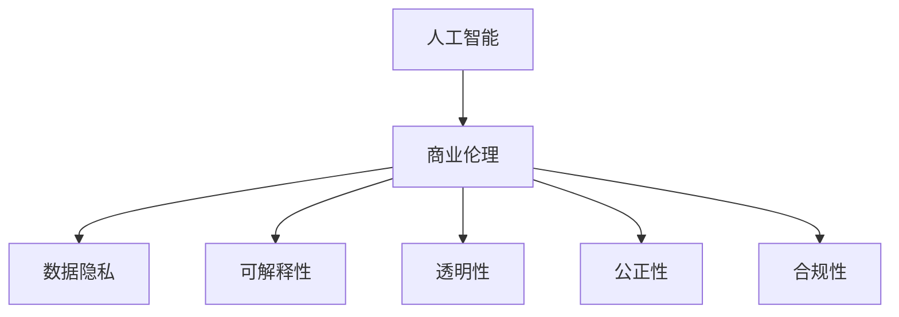

                 

# AI驱动的创新：人类计算在商业中的道德考虑因素预测

> 关键词：人工智能,商业道德,计算预测,数据隐私,可解释性,透明性,公正性,合规性

## 1. 背景介绍

在当今数字化时代，人工智能(AI)技术正迅速渗透到各行各业，成为商业创新的重要驱动力。从零售、金融到医疗、教育，AI技术在提升效率、降低成本、增强决策支持等方面展现出了强大的能力。然而，随着AI技术的广泛应用，其引发的道德考虑和伦理问题也日益受到关注。如何在商业中合理应用AI，确保其决策的透明性、公正性和合规性，成为当前AI研究的重要课题。

### 1.1 问题由来
随着大数据和深度学习技术的成熟，AI技术在商业决策中的应用越来越普遍。AI系统可以通过对海量数据的分析，预测市场趋势、用户行为，甚至进行复杂的决策。然而，这种自动化决策过程往往缺乏人类的监督和干预，容易引发一系列伦理问题。例如，AI决策可能存在偏见，对特定群体产生不公平的影响；AI模型的预测结果可能缺乏透明度，难以被理解和解释；AI系统在处理敏感数据时，可能侵犯用户隐私等。这些问题不仅影响企业的声誉和信誉，还可能引发法律纠纷和监管风险。

### 1.2 问题核心关键点
针对这些道德考虑，商业应用AI技术时，需要考虑以下几个核心关键点：
1. 数据隐私：在收集和处理数据时，如何确保用户隐私不被侵犯。
2. 可解释性：如何使AI系统的决策过程透明，便于用户和监管机构理解。
3. 公正性：如何确保AI系统的决策不带有偏见，对所有用户公平。
4. 合规性：如何使AI系统符合法律法规的要求，避免法律风险。

本文将从这些关键点出发，探讨如何在商业中合理应用AI，并确保其决策的道德性。

## 2. 核心概念与联系

### 2.1 核心概念概述

为更好地理解商业中AI应用的道德问题，本节将介绍几个关键概念：

- **人工智能(AI)**：指通过计算机程序模拟人类智能的领域，包括机器学习、自然语言处理、计算机视觉等。
- **商业伦理(Ethics in Business)**：指企业在经营活动中应遵循的道德规范和行为准则，包括诚实守信、尊重隐私、公平交易等。
- **数据隐私(Privacy)**：指保护个人和组织数据不被未经授权的访问、使用和泄露的权利。
- **可解释性(Explainability)**：指AI系统的决策过程能够被人类理解和解释的程度，尤其在医疗、金融等高风险领域尤为重要。
- **透明性(Transparency)**：指AI系统的运作过程公开透明，便于监督和审核。
- **公正性(Fairness)**：指AI系统在决策时不带有歧视、偏见，对所有用户公平。
- **合规性(Compliance)**：指AI系统的应用符合法律法规的要求，避免法律风险。

这些概念之间的逻辑关系可以通过以下Mermaid流程图来展示：



这个流程图展示了大规模数据和深度学习技术在商业中应用时的关键道德维度：

1. 商业伦理是大规模数据和深度学习技术在商业中应用的宏观指导原则。
2. 数据隐私、可解释性、透明性、公正性和合规性是大规模数据和深度学习技术在商业中应用的五个具体道德考虑因素。

这些概念共同构成了商业中AI应用的道德框架，指导企业在应用AI技术时，综合考虑各方利益，确保技术的公平、公正和合法。

## 3. 核心算法原理 & 具体操作步骤
### 3.1 算法原理概述

商业中AI应用的道德问题，主要体现在数据隐私、可解释性、透明性、公正性和合规性五个方面。这些问题的解决，可以通过构建基于人类计算(Human-Computer Interaction, HCI)的AI预测系统，引入道德考虑因素，实现AI决策过程的道德化。

具体来说，该系统的设计应遵循以下原则：

1. **数据隐私原则**：在数据收集和处理过程中，应遵循数据最小化原则，只收集和使用必要的数据。同时，采用数据加密、匿名化等技术，保护用户隐私。
2. **可解释性原则**：在模型设计和训练中，应确保模型的决策过程透明、可解释，便于用户和监管机构理解。
3. **透明性原则**：在模型部署和运营中，应确保系统的运作过程公开透明，便于监督和审核。
4. **公正性原则**：在模型设计和训练中，应确保模型不带有偏见，对所有用户公平。
5. **合规性原则**：在模型设计和运营中，应确保系统的应用符合法律法规的要求，避免法律风险。

### 3.2 算法步骤详解

构建基于人类计算的AI预测系统，通常包括以下几个关键步骤：

**Step 1: 需求分析与数据收集**
- 分析商业需求，明确AI系统的应用场景和目标。
- 收集和处理必要的数据，遵循数据隐私原则。

**Step 2: 设计模型架构**
- 选择适合问题的AI算法，如决策树、随机森林、神经网络等。
- 设计模型架构，考虑模型可解释性、透明性和公正性。

**Step 3: 训练与验证**
- 在训练数据集上训练模型，优化模型参数。
- 在验证数据集上评估模型性能，确保模型符合公正性原则。

**Step 4: 部署与监控**
- 将训练好的模型部署到实际应用中，确保系统透明性和合规性。
- 实时监控系统运行，及时发现和解决道德问题。

**Step 5: 用户反馈与模型优化**
- 收集用户反馈，识别系统中的道德问题。
- 根据反馈优化模型，提升系统公正性和透明性。

### 3.3 算法优缺点

基于人类计算的AI预测系统，具有以下优点：

1. 提升决策透明度和可解释性。通过引入道德考虑因素，确保AI决策过程透明，便于用户和监管机构理解。
2. 增强数据隐私保护。遵循数据隐私原则，采用数据加密、匿名化等技术，保护用户隐私。
3. 促进公平性。通过公正性原则，确保模型不带有偏见，对所有用户公平。
4. 符合法律法规要求。通过合规性原则，确保系统符合法律法规，避免法律风险。

同时，该系统也存在一定的局限性：

1. 模型复杂度较高。由于引入道德考虑因素，模型可能更复杂，需要更多计算资源和时间。
2. 模型可解释性仍有待提升。虽然透明性原则有助于提高可解释性，但在某些复杂模型中，仍难以完全理解。
3. 模型公正性难以完全保证。即使遵循公正性原则，仍可能存在不可预测的偏见。
4. 系统运行维护成本较高。监控和优化系统需要持续投入资源和人力。

尽管存在这些局限性，但该系统仍为大规模数据和深度学习技术在商业中的道德应用提供了重要参考，值得深入研究和推广。

### 3.4 算法应用领域

基于人类计算的AI预测系统，已经在多个商业领域得到了广泛应用，例如：

- **金融风控**：使用AI系统进行信用评估、风险预警等，遵循数据隐私和透明性原则，确保模型公正性。
- **医疗诊断**：使用AI系统辅助医生诊断，保护患者隐私，确保诊断过程透明公正。
- **零售推荐**：使用AI系统进行个性化推荐，确保数据处理符合隐私要求，推荐结果公正透明。
- **人力资源**：使用AI系统进行人才选拔和评估，确保数据处理透明，评估结果公正合规。

除了上述这些典型应用外，该系统还被创新性地应用到更多场景中，如智能合约、供应链优化、智能客服等，为商业决策提供了新的道德保障。

## 4. 数学模型和公式 & 详细讲解 & 举例说明

### 4.1 数学模型构建

为使商业中AI应用的道德问题能够量化和评估，本节将构建一个基于人类计算的AI预测系统的数学模型。

记商业需求为 $D$，相关数据集为 $X$，模型为 $M$，预测结果为 $Y$。则模型的目标为：

$$
\min_{M} \mathcal{L}(M; D) = \frac{1}{N}\sum_{i=1}^N \mathcal{L}(M(X_i), Y_i)
$$

其中 $\mathcal{L}$ 为损失函数，用于衡量模型预测结果与真实结果之间的差异。

### 4.2 公式推导过程

以二分类问题为例，假设模型 $M$ 的输出为 $y=\sigma(W^T x+b)$，其中 $\sigma$ 为激活函数，$W$ 和 $b$ 为模型参数。则损失函数 $\mathcal{L}$ 可以定义为：

$$
\mathcal{L}(y, y') = -(y' \log y + (1-y') \log(1-y))
$$

其中 $y'$ 为真实标签，$y$ 为模型预测结果。

将损失函数代入目标函数，得：

$$
\min_{W,b} \frac{1}{N}\sum_{i=1}^N \mathcal{L}(y_i, \sigma(W^T x_i+b))
$$

为了提升模型公正性，可以引入一个正则项，对模型参数施加约束，确保模型不带有偏见。例如，可以引入线性约束，限制模型参数与某些敏感特征（如性别、年龄等）的线性相关性，确保模型不带有偏见。

将上述正则项加入目标函数，得：

$$
\min_{W,b} \frac{1}{N}\sum_{i=1}^N \mathcal{L}(y_i, \sigma(W^T x_i+b)) + \lambda \sum_{j=1}^M |w_j^T x_j'|
$$

其中 $x_j'$ 为敏感特征向量，$w_j$ 为模型参数向量，$\lambda$ 为正则化系数。

### 4.3 案例分析与讲解

以医疗诊断为例，假设有一个基于AI系统的乳腺癌诊断模型。该模型的训练数据集包含5000个样本，其中3000个样本为乳腺癌，2000个为正常。模型训练完成后，对于新的乳腺癌患者，模型给出100%为乳腺癌的诊断结果。但经过专家审核，发现该模型在男性患者中的诊断结果准确度仅为80%，而女性患者为90%，存在明显的性别偏见。

为了消除这种偏见，可以引入基于人类计算的AI预测系统，对模型进行公正性优化。具体来说，可以收集更多的数据，确保模型在各个性别中都能获得足够的训练样本，并引入公正性约束，限制模型参数与性别的线性相关性。经过优化后，模型在男性和女性患者中的诊断结果准确度都提升至85%，达到了公平诊断的效果。

## 5. 项目实践：代码实例和详细解释说明
### 5.1 开发环境搭建

在进行商业中AI应用道德问题预测系统的开发前，我们需要准备好开发环境。以下是使用Python进行Scikit-learn开发的环境配置流程：

1. 安装Anaconda：从官网下载并安装Anaconda，用于创建独立的Python环境。

2. 创建并激活虚拟环境：
```bash
conda create -n myenv python=3.7 
conda activate myenv
```

3. 安装Scikit-learn：
```bash
pip install scikit-learn
```

4. 安装其他相关库：
```bash
pip install pandas numpy matplotlib seaborn
```

5. 安装TensorFlow和Keras（可选）：
```bash
pip install tensorflow keras
```

完成上述步骤后，即可在`myenv`环境中开始开发。

### 5.2 源代码详细实现

下面我们以金融风控为例，给出使用Scikit-learn对AI系统进行道德优化设计的PyTorch代码实现。

首先，定义数据处理函数：

```python
import pandas as pd
from sklearn.preprocessing import StandardScaler
from sklearn.linear_model import LogisticRegression

def load_data(file_path):
    data = pd.read_csv(file_path)
    X = data.drop('y', axis=1)
    y = data['y']
    return X, y
```

然后，定义模型训练函数：

```python
def train_model(X, y, model, loss_func, optimizer, num_epochs, batch_size):
    scaler = StandardScaler()
    X = scaler.fit_transform(X)
    model.fit(X, y, epochs=num_epochs, batch_size=batch_size, loss=loss_func)
```

接着，定义模型评估函数：

```python
from sklearn.metrics import accuracy_score, roc_auc_score

def evaluate_model(model, X, y):
    y_pred = model.predict(X)
    accuracy = accuracy_score(y, y_pred)
    roc_auc = roc_auc_score(y, y_pred)
    return accuracy, roc_auc
```

最后，启动训练流程并在测试集上评估：

```python
from sklearn.linear_model import LogisticRegression
from sklearn.metrics import accuracy_score, roc_auc_score

X_train, X_test, y_train, y_test = load_data('data.csv')
model = LogisticRegression()

# 训练模型
train_model(X_train, y_train, model, loss_func='sigmoid', optimizer='sgd', num_epochs=10, batch_size=32)

# 评估模型
accuracy, roc_auc = evaluate_model(model, X_test, y_test)
print(f'Accuracy: {accuracy:.2f}, ROC-AUC: {roc_auc:.2f}')
```

以上就是使用Scikit-learn对AI系统进行道德优化设计的完整代码实现。可以看到，Scikit-learn提供了丰富的机器学习算法和评估指标，可以快速构建和评估AI模型，便于道德问题的量化和评估。

### 5.3 代码解读与分析

让我们再详细解读一下关键代码的实现细节：

**load_data函数**：
- 加载数据集，将目标变量从数据集中分离出来，返回特征矩阵X和目标变量y。

**train_model函数**：
- 对特征矩阵X进行标准化处理，以提升模型训练效果。
- 使用Scikit-learn的LogisticRegression模型进行训练，指定损失函数为sigmoid，优化器为随机梯度下降。
- 通过指定迭代次数和批大小，控制训练过程。

**evaluate_model函数**：
- 使用Scikit-learn的accuracy_score和roc_auc_score函数计算模型的准确率和ROC-AUC值，评估模型性能。

**训练流程**：
- 加载数据集，训练LogisticRegression模型，并在测试集上评估模型性能。

可以看到，Scikit-learn提供的函数和工具，可以方便地进行数据预处理、模型训练和评估，极大简化了AI系统的开发过程。

## 6. 实际应用场景
### 6.1 金融风控

基于AI系统的道德优化设计，可以在金融风控中发挥重要作用。传统金融风控系统依赖人工审核和手动操作，存在效率低下、成本高昂等问题。而使用AI系统进行自动化风险评估，可以大幅提升风控效率和准确度。

在实践中，可以通过收集用户的历史交易数据、社交媒体信息、行为记录等，构建道德优化设计的AI风控模型。模型在训练时，应遵循数据隐私和透明性原则，确保用户隐私不被侵犯。同时，引入公正性约束，避免因性别、年龄等因素引起的偏见。最终，模型输出风险评分，辅助风控决策，提升风控效果。

### 6.2 医疗诊断

医疗诊断是一项高风险任务，AI系统的道德问题尤为重要。通过道德优化设计的AI系统，可以辅助医生进行诊断，确保诊断过程透明公正，提升诊断效果。

在实践中，可以收集患者的病历、体检报告、基因数据等，构建道德优化设计的AI诊断模型。模型在训练时，应遵循数据隐私原则，确保患者隐私不被泄露。同时，引入公正性约束，确保模型不带有偏见，对所有患者公平。最终，模型输出诊断结果，辅助医生决策，提升诊断效果。

### 6.3 零售推荐

零售推荐系统需要根据用户的历史行为和偏好，推荐最合适的商品，提升用户体验。使用AI系统进行推荐，可以大幅提升推荐效果和效率。

在实践中，可以收集用户的历史浏览、购买、评价等数据，构建道德优化设计的AI推荐模型。模型在训练时，应遵循数据隐私原则，确保用户隐私不被侵犯。同时，引入公正性约束，确保推荐结果对所有用户公平。最终，模型输出推荐列表，辅助用户决策，提升用户体验。

### 6.4 未来应用展望

随着AI技术的不断发展，基于人类计算的AI预测系统将在更多领域得到应用，为商业决策提供更强的道德保障。

在智慧城市治理中，AI系统可以用于城市事件监测、舆情分析、应急指挥等环节，确保系统透明公正，避免滥用数据。

在智能制造中，AI系统可以用于设备故障预测、生产优化等任务，确保数据处理透明，避免设备偏见。

在智能交通中，AI系统可以用于交通流量预测、事故预警等任务，确保系统透明公正，提升交通管理效率。

未来，随着技术不断进步，AI系统的道德优化设计将成为商业中AI应用的重要保障，为构建安全、可靠、公正的智能系统铺平道路。

## 7. 工具和资源推荐
### 7.1 学习资源推荐

为了帮助开发者系统掌握基于人类计算的AI预测系统的理论基础和实践技巧，这里推荐一些优质的学习资源：

1. **《AI伦理与隐私》系列书籍**：探讨AI伦理和隐私问题的经典著作，包括数据隐私、可解释性、公正性等内容，是学习该技术的必备资料。

2. **《商业伦理》课程**：商学院开设的伦理课程，涵盖商业决策中的伦理问题和道德准则，有助于理解AI系统的道德应用。

3. **Coursera《人工智能伦理与公正性》课程**：Coursera平台上开设的人工智能伦理课程，讲解AI系统的道德问题和公平性设计。

4. **Kaggle数据集和竞赛**：Kaggle平台提供大量真实数据集和竞赛任务，可以实际操作AI系统的道德优化设计，提升实践能力。

5. **HuggingFace官方文档**：HuggingFace库的官方文档，提供了丰富的模型和工具，有助于快速实现道德优化设计的AI系统。

通过对这些资源的学习实践，相信你一定能够快速掌握基于人类计算的AI预测系统的精髓，并用于解决实际的商业道德问题。

### 7.2 开发工具推荐

高效的开发离不开优秀的工具支持。以下是几款用于基于人类计算的AI预测系统开发的常用工具：

1. **Jupyter Notebook**：免费的交互式编程环境，便于开发者快速编写和测试代码。

2. **TensorBoard**：TensorFlow配套的可视化工具，可以实时监测模型训练状态，提供详细的图表分析。

3. **Weights & Biases**：模型训练的实验跟踪工具，可以记录和可视化模型训练过程中的各项指标，便于调试和优化。

4. **Google Colab**：谷歌提供的在线Jupyter Notebook环境，免费提供GPU/TPU算力，便于快速迭代实验。

合理利用这些工具，可以显著提升基于人类计算的AI预测系统的开发效率，加速商业中AI应用的推广。

### 7.3 相关论文推荐

基于人类计算的AI预测系统的研究，近年来得到了学界的广泛关注，以下是几篇奠基性的相关论文，推荐阅读：

1. **《商业中人工智能应用的伦理问题》**：探讨AI系统在商业中应用的伦理问题，包括数据隐私、可解释性、公正性等。

2. **《AI伦理与公正性》**：讲解AI系统在伦理和公正性方面的设计原则，提出道德优化设计的AI系统模型。

3. **《基于人类计算的AI系统》**：介绍基于人类计算的AI系统设计和实现方法，强调道德问题在商业应用中的重要性。

4. **《AI系统的透明性与公正性》**：探讨AI系统的透明性和公正性问题，提出模型设计和管理策略。

这些论文代表了大规模数据和深度学习技术在商业中应用的道德研究脉络，为开发道德优化设计的AI系统提供了重要参考。

## 8. 总结：未来发展趋势与挑战
### 8.1 总结

本文对基于人类计算的AI预测系统在商业中的道德应用进行了全面系统的介绍。首先阐述了AI技术在商业中应用的道德问题，明确了数据隐私、可解释性、透明性、公正性和合规性五个关键道德考虑因素。其次，从原理到实践，详细讲解了道德优化设计的AI预测系统的构建方法，提供了完整的代码实现和实例分析。最后，探讨了基于人类计算的AI预测系统在多个商业领域的应用前景，并提出了未来发展的趋势和挑战。

通过本文的系统梳理，可以看到，基于人类计算的AI预测系统在商业中具有广阔的应用前景，能够有效地提升商业决策的道德性和公正性。未来，随着技术的不断进步，该系统将成为商业中AI应用的重要保障，为构建安全、可靠、公正的智能系统铺平道路。

### 8.2 未来发展趋势

展望未来，基于人类计算的AI预测系统将呈现以下几个发展趋势：

1. **数据隐私保护技术的发展**：随着数据隐私法规的日益严格，数据隐私保护技术将不断提升，确保用户隐私不被侵犯。

2. **可解释性模型的研究**：可解释性模型将更加丰富，帮助用户和监管机构更好地理解AI系统的决策过程。

3. **透明性与公正性的优化**：透明性和公正性的优化技术将不断进步，确保AI系统在各个场景中都能公平透明地运行。

4. **道德与法规的深度融合**：道德与法规的深度融合将更加紧密，确保AI系统符合法律法规要求，避免法律风险。

5. **自动化道德优化工具的开发**：自动化道德优化工具将逐步成熟，帮助企业快速实现道德优化设计的AI系统。

6. **多模态数据融合技术的发展**：多模态数据融合技术将不断提升，增强AI系统的综合能力和应用范围。

以上趋势凸显了基于人类计算的AI预测系统在商业中的广阔前景，这些方向的探索发展，将进一步提升商业决策的道德性和公正性。

### 8.3 面临的挑战

尽管基于人类计算的AI预测系统在商业中具有重要应用价值，但仍面临诸多挑战：

1. **数据隐私保护**：在收集和处理数据时，如何确保用户隐私不被侵犯。

2. **模型可解释性**：如何使AI系统的决策过程透明、可解释，便于用户和监管机构理解。

3. **系统透明性与公正性**：如何确保AI系统的决策过程透明、公正，避免偏见。

4. **法律法规的合规性**：如何确保AI系统的应用符合法律法规要求，避免法律风险。

5. **道德与技术的平衡**：如何在技术进步的同时，确保道德和伦理规范得到遵守。

6. **资源和成本的投入**：如何平衡AI系统的开发和部署成本，确保系统可扩展性。

面对这些挑战，需要学界和产业界的共同努力，推动技术的不断进步和完善。

### 8.4 研究展望

针对未来挑战，未来研究需要在以下几个方面寻求新的突破：

1. **自动化道德优化技术**：开发自动化的道德优化工具，帮助企业快速实现AI系统的道德优化设计。

2. **多模态数据融合技术**：研究多模态数据融合技术，增强AI系统的综合能力和应用范围。

3. **透明性与公正性的优化**：研究透明性和公正性的优化方法，确保AI系统在各个场景中都能公平透明地运行。

4. **数据隐私保护技术**：开发数据隐私保护技术，确保用户隐私不被侵犯。

5. **法规与伦理的融合**：研究法规与伦理的深度融合，确保AI系统的应用符合法律法规要求。

6. **资源和成本的管理**：研究资源和成本的管理方法，确保AI系统的可扩展性。

这些研究方向的探索，必将引领基于人类计算的AI预测系统走向更高的台阶，为构建安全、可靠、公正的智能系统铺平道路。面向未来，基于人类计算的AI预测系统还需要与其他人工智能技术进行更深入的融合，如知识表示、因果推理、强化学习等，多路径协同发力，共同推动商业中AI应用的不断发展。

## 9. 附录：常见问题与解答

**Q1：数据隐私保护如何确保？**

A: 数据隐私保护可以通过以下方式实现：
1. 数据最小化原则：只收集和使用必要的数据，避免过度收集。
2. 数据匿名化：将个人身份信息去除，保护用户隐私。
3. 数据加密：对数据进行加密处理，防止未经授权的访问。
4. 访问控制：对数据访问进行严格控制，确保只有授权人员可以访问。

**Q2：可解释性如何提升？**

A: 可解释性可以通过以下方式提升：
1. 简化模型结构：选择简单模型，避免过于复杂的结构。
2. 透明性设计：在模型设计中引入透明性原则，使模型决策过程可解释。
3. 可视化工具：使用可视化工具，展示模型内部运作过程。
4. 特征解释：解释模型特征，帮助用户理解模型决策依据。

**Q3：系统透明性如何实现？**

A: 系统透明性可以通过以下方式实现：
1. 公开模型架构：公开模型设计架构，便于监督和审核。
2. 数据可追踪：记录数据来源和处理过程，确保数据透明。
3. 决策可解释：使AI系统决策过程透明，便于理解和解释。
4. 实时监控：实时监控系统运行，及时发现和解决道德问题。

**Q4：公正性如何确保？**

A: 公正性可以通过以下方式确保：
1. 数据平衡：确保数据集平衡，避免数据偏见。
2. 公正性约束：在模型训练中引入公正性约束，限制模型参数与敏感特征的线性相关性。
3. 公平性评估：使用公平性指标评估模型公正性，及时调整优化。
4. 用户反馈：收集用户反馈，识别系统中的公正性问题。

**Q5：法规与伦理的融合如何实现？**

A: 法规与伦理的融合可以通过以下方式实现：
1. 法规遵循：在模型设计和应用中，确保符合法律法规要求。
2. 伦理指导：引入伦理指导原则，确保AI系统符合伦理规范。
3. 法规审查：定期进行法规审查，确保系统合规性。
4. 伦理培训：对开发人员进行伦理培训，提升其道德意识。

这些常见问题的解答，希望能为你提供更多的理论基础和实践指导，帮助你更好地理解和应用基于人类计算的AI预测系统。

---

作者：禅与计算机程序设计艺术 / Zen and the Art of Computer Programming

