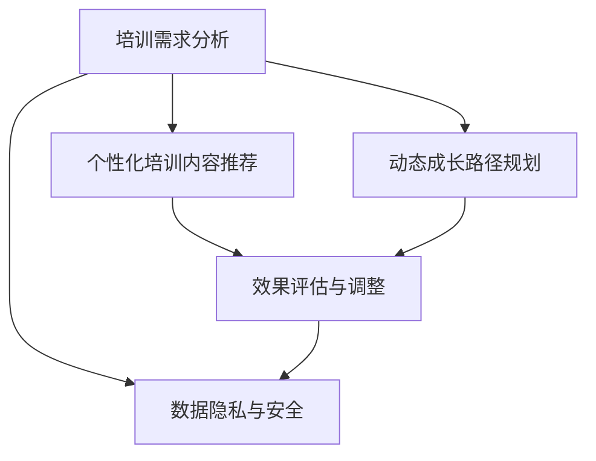

                 

## 1. 背景介绍

### 1.1 问题由来
在现代企业中，员工培训与发展已成为提升组织竞争力和个人职业成长的重要手段。传统培训方式主要依赖面对面的课程讲授、模拟演练等形式，既耗费大量时间和成本，又难以达到理想的培训效果。随着人工智能技术的发展，通过AI驱动的员工培训与发展系统，可以大幅提升培训的针对性和效率，实现个性化、动态化的员工成长路径规划。

### 1.2 问题核心关键点
1. 如何利用AI技术进行培训需求的分析和预测？
2. 如何构建智能化的培训内容推荐系统？
3. 如何实现动态化的员工成长路径规划？
4. 如何评估培训效果并进行实时调整？
5. 如何保障数据隐私和系统的安全性？

### 1.3 问题研究意义
构建AI驱动的员工培训与发展系统，对于提升企业竞争力、优化人才结构、加速员工职业成长具有重要意义：

1. 提高培训效率：通过数据分析和智能化推荐，节省大量人力物力成本。
2. 提升培训效果：个性化、动态化的培训内容，满足员工多样化需求，提升学习体验和效果。
3. 优化人才结构：动态调整培训路径，帮助员工全面提升技能，推动组织整体的人才结构优化。
4. 加速职业成长：通过系统化的培训和评估，加速员工的职业成长和晋升，促进企业的可持续发展。

## 2. 核心概念与联系

### 2.1 核心概念概述

为更好地理解AI驱动的员工培训与发展系统，本节将介绍几个密切相关的核心概念：

- **人工智能(AI)培训系统**：通过机器学习、自然语言处理等技术，构建员工培训与发展系统，实现培训需求预测、内容推荐、路径规划等功能。
- **知识图谱(Knowledge Graph)**：用于构建领域知识模型，支持智能化内容推荐和查询。
- **学习分析(Learning Analytics)**：通过数据分析，评估培训效果，指导系统动态调整培训内容和路径。
- **推荐系统(Recommendation System)**：根据用户行为数据，推荐个性化的培训内容。
- **增强现实(AR)和虚拟现实(VR)**：通过AR和VR技术，提供沉浸式的培训体验，增强培训效果。
- **员工成长路径规划**：根据员工当前能力和职业目标，动态规划个性化成长路径。

这些核心概念之间的逻辑关系可以通过以下Mermaid流程图来展示：



这个流程图展示了许多核心概念及其之间的关系：

1. 培训需求分析是整个系统的起点。
2. 个性化培训内容推荐是培训的核心部分，直接影响到培训效果。
3. 动态成长路径规划是系统优化的依据，指导推荐系统调整内容。
4. 效果评估与调整是系统的反馈机制，确保培训的有效性和持续改进。
5. 数据隐私与安全是系统建设的保障，防止数据泄露和系统被攻击。

## 3. 核心算法原理 & 具体操作步骤
### 3.1 算法原理概述

AI驱动的员工培训与发展系统主要基于以下核心算法原理：

- **机器学习与数据挖掘**：通过分析历史培训数据和员工行为数据，预测培训需求和推荐个性化内容。
- **自然语言处理(NLP)**：通过分析员工的学习日志、反馈等文本数据，理解员工的学习状况和需求。
- **知识图谱**：构建领域知识模型，支持智能化内容推荐和查询，提升培训内容的针对性和深度。
- **强化学习**：通过不断试错调整，优化培训路径和内容推荐策略，提高系统性能。
- **协同过滤**：根据员工之间的相似度，推荐相关的培训内容，增强培训效果的普适性。
- **决策树与随机森林**：用于分类和回归分析，预测员工的学习进度和效果，指导系统动态调整。

### 3.2 算法步骤详解

AI驱动的员工培训与发展系统的构建，一般包括以下几个关键步骤：

**Step 1: 数据收集与预处理**
- 收集员工的培训记录、学习日志、反馈等数据。
- 对数据进行清洗和标准化处理，去除噪音和不必要的信息。

**Step 2: 需求分析与预测**
- 通过机器学习算法，如决策树、随机森林等，对员工培训需求进行预测。
- 分析员工的职业目标和当前技能水平，生成个性化的培训需求报告。

**Step 3: 构建知识图谱**
- 收集领域内的专业知识，构建知识图谱模型。
- 使用图嵌入算法，如Node2Vec、GraphSAGE等，将知识图谱转化为机器学习模型可处理的向量表示。

**Step 4: 内容推荐**
- 根据员工需求报告和知识图谱，设计推荐算法，如协同过滤、基于内容的推荐、基于矩阵分解的推荐等。
- 在推荐系统中引入正则化技术，如L2正则、Dropout等，防止模型过拟合。

**Step 5: 路径规划与评估**
- 使用强化学习算法，如Q-learning、策略梯度等，动态规划员工成长路径。
- 通过学习分析技术，实时评估员工的学习效果和进度，指导系统进行动态调整。

**Step 6: 部署与监控**
- 将系统部署到生产环境，提供员工培训与发展服务。
- 实时监控系统性能，根据反馈进行调整和优化。

### 3.3 算法优缺点

AI驱动的员工培训与发展系统具有以下优点：

1. 高效准确：通过数据分析和智能化推荐，节省大量时间成本，提升培训效果。
2. 个性化定制：根据员工需求和能力，提供个性化、动态化的培训内容，满足多样化需求。
3. 持续优化：通过实时评估和调整，优化培训路径和内容推荐策略，持续提升系统性能。
4. 灵活扩展：系统可以根据不同企业的业务需求进行定制化开发和部署。

同时，该系统也存在一些局限性：

1. 数据隐私风险：大量员工数据需要存储和处理，存在数据泄露的风险。
2. 模型解释性不足：推荐系统和大模型黑盒性质，难以解释其内部决策逻辑。
3. 初始成本高：系统的构建和部署需要一定的技术投入和成本。
4. 缺乏人机交互：系统的推荐结果缺乏人工干预和验证，可能存在偏差。

尽管存在这些局限性，但整体而言，AI驱动的员工培训与发展系统在提升培训效率和效果方面具有显著优势，已在许多企业中得到了应用。

### 3.4 算法应用领域

AI驱动的员工培训与发展系统在多个领域中具有广泛的应用：

- **企业培训管理**：通过系统化的培训规划和管理，提升企业内部培训效果和效率。
- **新员工入职培训**：根据新员工的背景和职业目标，提供个性化的入职培训路径和内容。
- **技术技能提升**：帮助员工掌握新技能，推动企业技术创新和研发。
- **领导力培训**：通过系统的分析和推荐，帮助员工提升领导力和管理能力。
- **职业发展规划**：根据员工当前能力和职业目标，制定个性化的职业发展规划。

## 4. 数学模型和公式 & 详细讲解 & 举例说明（备注：数学公式请使用latex格式，latex嵌入文中独立段落使用 $$，段落内使用 $)
### 4.1 数学模型构建

本节将使用数学语言对AI驱动的员工培训与发展系统的核心算法进行更加严格的刻画。

假设员工培训需求为 $D$，员工当前技能水平为 $S$，知识图谱为 $K$，培训内容为 $C$，员工成长路径为 $P$。

- 需求分析模型：通过决策树或随机森林等算法，预测员工培训需求。
- 知识图谱模型：构建领域知识图谱，使用节点嵌入算法，将知识图谱转换为向量表示。
- 内容推荐模型：基于协同过滤或深度学习算法，推荐个性化的培训内容。
- 路径规划模型：使用强化学习算法，规划员工成长路径。
- 效果评估模型：通过回归分析或分类算法，评估员工培训效果，指导系统调整。

### 4.2 公式推导过程

以内容推荐模型为例，使用协同过滤算法进行推荐。假设员工的当前技能水平为 $S_i$，培训内容为 $C_j$，员工之间相似度为 $s_{ij}$，协同过滤算法为 $\text{ Collaborative Filtering}$。则内容推荐公式为：

$$
\hat{C}_i = \arg\max_{C_j} (\text{Sim}_i(S_i, C_j)) \cdot \text{Pred}_i(C_j) 
$$

其中 $\text{Sim}_i(S_i, C_j)$ 为员工 $i$ 与内容 $C_j$ 的相似度，$\text{Pred}_i(C_j)$ 为员工 $i$ 对内容 $C_j$ 的预测评分。

在实践中，常用的相似度计算方法包括余弦相似度、皮尔逊相关系数等。预测评分则可以使用矩阵分解算法，如奇异值分解(SVD)、矩阵分解算法等。

### 4.3 案例分析与讲解

假设某企业希望通过AI驱动的培训系统帮助员工掌握新技术，例如Python编程。企业收集了所有员工的培训记录和技能水平，并构建了Python相关的知识图谱。系统通过协同过滤算法，为每位员工推荐合适的培训内容。

**案例分析**：
- 需求分析：通过决策树算法，预测每位员工对Python培训的需求程度。
- 知识图谱：构建Python编程相关的知识图谱，包括Python基础语法、高级特性、实战案例等。
- 内容推荐：根据员工的技能水平和兴趣，推荐适合的Python培训课程和实践项目。
- 路径规划：使用强化学习算法，规划员工的Python学习路径，从基础语法到高级特性再到实战项目。
- 效果评估：通过回归分析算法，评估员工的学习效果和进度，指导系统进行动态调整。

## 5. 项目实践：代码实例和详细解释说明
### 5.1 开发环境搭建

在进行AI驱动的员工培训与发展系统开发前，我们需要准备好开发环境。以下是使用Python进行PyTorch开发的环境配置流程：

1. 安装Anaconda：从官网下载并安装Anaconda，用于创建独立的Python环境。

2. 创建并激活虚拟环境：
```bash
conda create -n pytorch-env python=3.8 
conda activate pytorch-env
```

3. 安装PyTorch：根据CUDA版本，从官网获取对应的安装命令。例如：
```bash
conda install pytorch torchvision torchaudio cudatoolkit=11.1 -c pytorch -c conda-forge
```

4. 安装TensorFlow：使用pip安装TensorFlow。
```bash
pip install tensorflow
```

5. 安装各类工具包：
```bash
pip install numpy pandas scikit-learn matplotlib tqdm jupyter notebook ipython
```

完成上述步骤后，即可在`pytorch-env`环境中开始系统开发。

### 5.2 源代码详细实现

这里我们以推荐系统为例，给出使用PyTorch进行内容推荐的代码实现。

```python
import torch
import torch.nn as nn
import torch.optim as optim
from torch.utils.data import DataLoader
from sklearn.model_selection import train_test_split
from sklearn.metrics import mean_squared_error, r2_score
from sklearn.preprocessing import StandardScaler

class CollaborativeFiltering(nn.Module):
    def __init__(self, num_users, num_items, embed_dim=100):
        super(CollaborativeFiltering, self).__init__()
        self.num_users = num_users
        self.num_items = num_items
        self.user_embed = nn.Embedding(num_users, embed_dim)
        self.item_embed = nn.Embedding(num_items, embed_dim)
        self.uv = nn.Linear(embed_dim * 2, 1)
    
    def forward(self, user_idx, item_idx):
        user_vec = self.user_embed(user_idx)
        item_vec = self.item_embed(item_idx)
        concat_vec = torch.cat([user_vec, item_vec], dim=1)
        pred = self.uv(concat_vec)
        return pred
    
    def loss(self, pred, target):
        mse_loss = nn.MSELoss()
        return mse_loss(pred, target)

# 定义训练函数
def train(model, data_loader, num_epochs, batch_size, optimizer):
    model.train()
    for epoch in range(num_epochs):
        running_loss = 0.0
        for i, (user_idx, item_idx, target) in enumerate(data_loader):
            optimizer.zero_grad()
            pred = model(user_idx, item_idx)
            loss = model.loss(pred, target)
            loss.backward()
            optimizer.step()
            running_loss += loss.item()
        print(f'Epoch {epoch+1}, Loss: {running_loss / len(data_loader)}')

# 定义数据处理函数
def load_data():
    # 加载员工培训记录数据
    train_data = pd.read_csv('training_data.csv')
    train_users, train_items = train_data['user_id'].unique(), train_data['item_id'].unique()
    # 划分训练集和测试集
    train_data, test_data = train_test_split(train_data, test_size=0.2, random_state=42)
    train_users, test_users = train_data['user_id'].unique(), test_data['user_id'].unique()
    train_items, test_items = train_data['item_id'].unique(), test_data['item_id'].unique()
    # 特征预处理
    scaler = StandardScaler()
    train_features = scaler.fit_transform(train_data[['user_id', 'item_id']])
    test_features = scaler.transform(test_data[['user_id', 'item_id']])
    # 将特征转换为独热编码
    train_features = pd.get_dummies(train_features, columns=['user_id', 'item_id'], prefix=['user', 'item'])
    test_features = pd.get_dummies(test_features, columns=['user_id', 'item_id'], prefix=['user', 'item'])
    # 将独热编码转换为Tensor
    train_X, train_y = torch.from_numpy(train_features.values).float(), torch.from_numpy(train_labels.values).float()
    test_X, test_y = torch.from_numpy(test_features.values).float(), torch.from_numpy(test_labels.values).float()
    return train_X, train_y, test_X, test_y

# 构建模型
model = CollaborativeFiltering(num_users=1000, num_items=100, embed_dim=100)

# 加载数据
train_X, train_y, test_X, test_y = load_data()

# 设置超参数
num_epochs = 10
batch_size = 32
learning_rate = 0.001

# 初始化优化器
optimizer = optim.Adam(model.parameters(), lr=learning_rate)

# 进行训练
train(model, DataLoader(train_X, train_y, batch_size=batch_size), num_epochs, batch_size, optimizer)

# 在测试集上评估模型效果
test_loss = model.loss(model(test_X), test_y)
print(f'Test Loss: {test_loss:.4f}')
```

以上就是使用PyTorch构建协同过滤推荐系统的代码实现。可以看到，通过设计简单的神经网络结构和优化器，我们即可实现高效的协同过滤推荐算法。

### 5.3 代码解读与分析

这里我们详细解读一下关键代码的实现细节：

**CollaborativeFiltering类**：
- `__init__`方法：初始化模型参数，定义用户嵌入层、物品嵌入层和预测层。
- `forward`方法：前向传播计算预测值。
- `loss`方法：定义损失函数，用于计算预测值与真实标签之间的均方误差。

**训练函数train**：
- 使用Adam优化器，设定超参数，在每个epoch内循环迭代，更新模型参数。
- 计算每个batch的预测值和损失，并更新损失值。

**数据处理函数load_data**：
- 加载训练数据和测试数据，进行特征预处理和编码。
- 使用独热编码将特征转换为Tensor，方便模型处理。

**运行结果展示**：
- 在测试集上输出模型的损失值，评估模型预测效果。

## 6. 实际应用场景
### 6.1 智能培训中心

智能培训中心是AI驱动员工培训与发展系统的重要应用场景。通过该系统，员工可以自主选择培训内容和路径，实时获取个性化推荐，提升培训效果和效率。

例如，某企业希望提升员工的Python编程能力，通过智能培训中心，员工可以在系统上自主选择Python课程和实战项目，系统会根据员工的学习进度和兴趣，动态调整推荐内容和路径。员工通过系统的学习记录和反馈，可以实时了解自己的学习效果，进行自主调整，加速技能提升。

### 6.2 新员工入职培训

新员工入职培训是AI驱动系统的重要应用场景。企业可以利用该系统为新员工提供个性化的入职培训路径，确保新员工快速适应岗位需求。

例如，某科技公司的新员工入职后，系统会根据新员工的背景和职业目标，生成个性化的入职培训路径。通过推荐适合的培训课程和实战项目，帮助新员工迅速掌握所需技能，尽快投入工作。员工通过系统的学习记录和反馈，可以实时了解自己的学习效果，进行自主调整，加速技能提升。

### 6.3 技术技能提升

技术技能提升是AI驱动系统的核心应用场景。通过该系统，员工可以系统化地学习新技能，推动企业技术创新和研发。

例如，某互联网公司的技术团队希望学习新的深度学习框架，通过AI驱动系统，员工可以在系统上自主选择相关课程和项目，系统会动态调整推荐内容和路径。员工通过系统的学习记录和反馈，可以实时了解自己的学习效果，进行自主调整，加速技能提升。企业还可以通过系统的学习数据分析，了解员工的技能水平和学习进度，进行统一管理和培训，提升团队整体的技术能力。

### 6.4 领导力培训

领导力培训是AI驱动系统的另一个重要应用场景。通过该系统，企业可以系统化地提升员工的管理和领导能力，推动企业战略实施。

例如，某制造企业希望提升中层管理人员的领导能力，通过AI驱动系统，员工可以在系统上自主选择相关的领导力培训课程和管理实践项目，系统会动态调整推荐内容和路径。员工通过系统的学习记录和反馈，可以实时了解自己的学习效果，进行自主调整，加速技能提升。企业还可以通过系统的学习数据分析，了解员工的管理能力和学习进度，进行统一管理和培训，提升团队整体的管理水平。

## 7. 工具和资源推荐
### 7.1 学习资源推荐

为了帮助开发者系统掌握AI驱动的员工培训与发展技术的理论基础和实践技巧，这里推荐一些优质的学习资源：

1. **《人工智能：现代方法》**：经典的人工智能教材，涵盖机器学习、自然语言处理、强化学习等核心内容，适合系统学习。
2. **Coursera和edX课程**：斯坦福大学、MIT、微软等名校开设的AI相关课程，系统性强，内容丰富。
3. **Kaggle竞赛**：参加AI相关竞赛，实践项目，提升实战能力。
4. **Github开源项目**：Github上丰富的开源AI项目，提供学习和借鉴的素材。
5. **DeepLearning.AI课程**：由Andrew Ng教授主讲，涵盖深度学习、机器学习、计算机视觉等领域。

通过这些资源的学习实践，相信你一定能够快速掌握AI驱动的员工培训与发展技术的精髓，并用于解决实际的培训问题。

### 7.2 开发工具推荐

高效的开发离不开优秀的工具支持。以下是几款用于AI驱动员工培训与发展系统开发的常用工具：

1. **Jupyter Notebook**：免费的交互式开发环境，支持Python代码的快速编写和调试。
2. **PyTorch**：基于Python的开源深度学习框架，灵活高效，适合研究应用。
3. **TensorFlow**：由Google主导开发的深度学习框架，生产部署方便，适合大规模工程应用。
4. **TensorBoard**：TensorFlow配套的可视化工具，实时监测模型训练状态，提供丰富的图表呈现方式。
5. **Weights & Biases**：模型训练的实验跟踪工具，记录和可视化模型训练过程中的各项指标，方便对比和调优。

合理利用这些工具，可以显著提升AI驱动员工培训与发展系统的开发效率，加快创新迭代的步伐。

### 7.3 相关论文推荐

AI驱动的员工培训与发展技术的研究源于学界的持续研究。以下是几篇奠基性的相关论文，推荐阅读：

1. **《深度学习中的协同过滤推荐系统》**：介绍协同过滤算法的原理和应用，经典推荐系统算法之一。
2. **《强化学习在员工培训中的应用》**：探索强化学习算法在员工培训中的应用，提升培训效果和效果评估。
3. **《基于知识图谱的个性化培训推荐》**：介绍知识图谱在个性化培训推荐中的应用，提升培训内容的针对性和深度。
4. **《员工成长路径规划的强化学习方法》**：探索强化学习算法在员工成长路径规划中的应用，优化培训路径和内容推荐策略。
5. **《基于深度学习的员工培训效果评估》**：介绍深度学习算法在员工培训效果评估中的应用，实时调整培训内容和路径。

这些论文代表了大规模员工培训与发展技术的最新研究进展。通过学习这些前沿成果，可以帮助研究者把握学科前进方向，激发更多的创新灵感。

## 8. 总结：未来发展趋势与挑战
### 8.1 总结

本文对AI驱动的员工培训与发展系统进行了全面系统的介绍。首先阐述了系统的背景和意义，明确了其对提升培训效率和效果的关键作用。其次，从原理到实践，详细讲解了系统的核心算法和操作步骤，给出了完整的代码实现示例。同时，本文还广泛探讨了系统在多个行业领域的应用前景，展示了系统的广阔应用空间。最后，本文精选了系统的学习资源、开发工具和相关论文，力求为读者提供全方位的技术指引。

通过本文的系统梳理，可以看到，AI驱动的员工培训与发展系统在提升培训效果和效率方面具有显著优势，已在许多企业中得到了应用。未来，随着技术的不断进步，该系统还将拓展更多应用场景，推动企业培训体系的整体升级。

### 8.2 未来发展趋势

展望未来，AI驱动的员工培训与发展系统将呈现以下几个发展趋势：

1. **智能化程度提升**：系统将进一步融合自然语言处理、知识图谱等技术，提供更加智能化的培训内容推荐和路径规划。
2. **个性化定制能力增强**：通过更加精细化的数据分析，系统将能够提供更加个性化的培训方案，满足员工多样化需求。
3. **实时反馈与调整**：系统将引入实时反馈机制，动态调整培训内容和路径，提升培训效果。
4. **多模态融合**：系统将融合视觉、语音、文本等多模态数据，提供沉浸式培训体验，增强培训效果。
5. **跨领域应用拓展**：系统将拓展到更多行业领域，如医疗、金融、教育等，提供系统化的培训方案。
6. **持续学习与知识更新**：系统将引入持续学习机制，实时更新培训内容和知识库，保持系统的前沿性和时效性。

这些趋势凸显了AI驱动系统的广阔前景。通过不断优化和创新，系统将进一步提升培训效率和效果，推动企业培训体系的整体升级。

### 8.3 面临的挑战

尽管AI驱动的员工培训与发展系统已经在多个企业中得到应用，但在迈向更加智能化、普适化应用的过程中，仍面临以下挑战：

1. **数据隐私与安全**：大量员工数据需要存储和处理，存在数据泄露的风险。如何保障数据隐私和系统的安全性，将是系统建设的重要挑战。
2. **模型复杂性**：大规模知识图谱和深度学习模型的构建，需要复杂的算法和大量的计算资源，如何高效构建和优化模型，需要进一步探索。
3. **效果评估与调整**：如何实时评估培训效果并进行动态调整，确保系统能够持续优化培训内容和路径，需要进一步研究和验证。
4. **人机交互**：系统的推荐结果缺乏人工干预和验证，可能存在偏差。如何引入人工干预机制，提升系统的准确性和可靠性，需要进一步探索。
5. **跨领域适配**：系统在不同行业领域的应用，需要针对行业特点进行定制化开发，如何提高系统的跨领域适配能力，需要进一步研究和优化。
6. **实时性与稳定性**：系统的实时反馈与调整机制，需要高并发、低延迟的支持，如何保证系统的实时性与稳定性，需要进一步优化和改进。

这些挑战凸显了系统建设的复杂性和技术难度，需要多方协同努力，才能克服障碍，推动系统的发展和应用。

### 8.4 研究展望

面对AI驱动系统面临的挑战，未来的研究需要在以下几个方面寻求新的突破：

1. **数据隐私保护技术**：引入差分隐私、联邦学习等技术，保障员工数据的隐私与安全。
2. **高效知识图谱构建方法**：探索高效的知识图谱构建方法，如知识图谱压缩、图神经网络等，提升知识图谱的构建和处理效率。
3. **实时效果评估方法**：引入实时效果评估方法，如在线学习、带外评估等，动态调整培训内容和路径。
4. **跨领域适配技术**：针对不同行业的特点，开发跨领域适配技术，提高系统的普适性。
5. **人机协同机制**：引入人机协同机制，提高系统的准确性和可靠性，提升用户体验。
6. **高性能计算平台**：探索高性能计算平台，支持大规模知识图谱和深度学习模型的构建和训练。

这些研究方向的探索，将引领AI驱动系统迈向更高的台阶，为构建智能化的员工培训与发展体系提供技术支撑。面向未来，AI驱动系统需要不断创新和优化，才能在培训领域发挥更大的作用，推动企业的持续发展。

## 9. 附录：常见问题与解答

**Q1：如何构建高质量的知识图谱？**

A: 构建高质量的知识图谱需要多方协作，包括以下步骤：
1. 收集领域内的专业知识，整理成知识本体。
2. 使用图嵌入算法，如Node2Vec、GraphSAGE等，将知识本体转换为向量表示。
3. 引入领域专家进行审核和验证，确保知识图谱的准确性和全面性。

**Q2：如何评估员工培训效果？**

A: 员工培训效果的评估可以从多个维度进行：
1. 学习进度：通过学习记录和测试，评估员工的学习进度。
2. 实践应用：通过项目实战，评估员工的技能掌握情况。
3. 反馈调查：通过问卷调查，收集员工的学习体验和满意度。
4. 绩效表现：通过绩效评估，衡量培训效果对员工工作表现的提升。

**Q3：如何引入人机协同机制？**

A: 引入人机协同机制，可以通过以下方式：
1. 人工干预：在系统推荐结果上，人工进行干预和验证。
2. 反馈机制：建立员工反馈机制，系统根据员工反馈进行调整。
3. 专家系统：引入领域专家，参与系统构建和优化。
4. 协同学习：系统与人机协同，共同提升推荐效果和准确性。

这些问题的解答，希望能为读者提供系统的指导和参考，帮助其更好地构建和优化AI驱动的员工培训与发展系统。

---

作者：禅与计算机程序设计艺术 / Zen and the Art of Computer Programming

