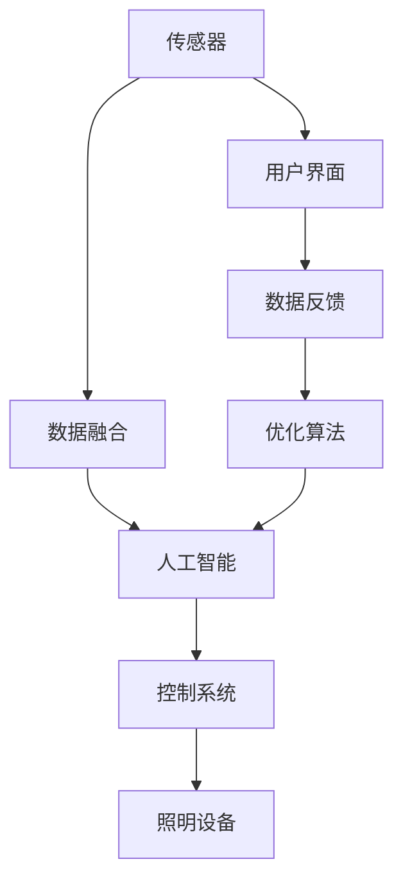
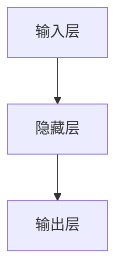

                 

## 1. 背景介绍

### 1.1 问题由来

随着城市化进程的加快和人口的增长，全球对照明系统的需求日益增长，特别是商业、办公、住宅等场景，对照明系统的节能性和舒适性提出了更高的要求。然而，传统的照明系统往往过于简单，难以满足这些复杂的照明需求。为此，基于人工智能技术的智能照明系统应运而生，旨在通过数据驱动的方式，动态调整照明强度、色温和亮度等参数，实现节能和舒适的平衡。

智能照明系统通过采集环境光、人体活动、用户偏好等数据，结合机器学习算法，自动调节照明设备。相较于传统照明系统，智能照明系统具有更强的自适应能力，可以大幅降低能源消耗，提升用户舒适度。

### 1.2 问题核心关键点

智能照明系统的主要挑战在于如何在保证节能的同时，兼顾用户的舒适度。为此，系统需要具备以下核心能力：

- 数据分析：通过传感器和摄像头采集环境数据，如光照强度、人体位置、活动类型等。
- 模型训练：构建并训练机器学习模型，如神经网络、决策树等，用于预测和控制照明参数。
- 控制执行：实现对照明设备的远程控制，如调光、开关等。
- 用户反馈：收集用户反馈信息，持续优化照明系统。

智能照明系统通过集成这些核心组件，构建一个自适应、智能化的照明解决方案。

## 2. 核心概念与联系

### 2.1 核心概念概述

智能照明系统通过人工智能技术，动态调整照明参数，以实现节能和舒适性的双赢。核心概念包括：

- 人工智能：通过机器学习算法，使系统具备自我学习、自我适应的能力。
- 传感器技术：用于采集环境数据，如光照强度、人体位置等。
- 数据融合：将多个传感器数据融合，提高数据准确性和鲁棒性。
- 控制系统：用于远程控制照明设备，如调光、开关等。
- 用户界面：通过用户接口，收集用户偏好，提高系统适应性。

这些核心概念通过合理的架构设计和算法实现，共同构成了一个高效、智能的照明系统。

### 2.2 核心概念原理和架构的 Mermaid 流程图



这个流程图展示了智能照明系统的核心组件及其相互关系：

1. 传感器采集环境数据，并进行数据融合，提高数据准确性。
2. 融合后的数据输入人工智能模型，用于预测和控制照明参数。
3. 控制系统根据模型预测结果，调整照明设备。
4. 用户界面收集用户反馈信息，用于优化模型。
5. 优化算法根据用户反馈，更新模型参数，提升系统性能。

通过这个架构，智能照明系统可以动态调整照明参数，实现节能和舒适性的平衡。

## 3. 核心算法原理 & 具体操作步骤

### 3.1 算法原理概述

智能照明系统的核心算法包括数据分析、模型训练、控制执行和用户反馈。这些算法通过机器学习技术实现，具体流程如下：

1. **数据分析**：通过传感器采集环境数据，如光照强度、人体位置、活动类型等。
2. **模型训练**：构建并训练机器学习模型，用于预测和控制照明参数。
3. **控制执行**：实现对照明设备的远程控制，如调光、开关等。
4. **用户反馈**：收集用户反馈信息，持续优化照明系统。

这些算法通过合理的架构设计和算法实现，共同构成了一个高效、智能的照明系统。

### 3.2 算法步骤详解

**Step 1: 数据采集与融合**

智能照明系统通过各种传感器采集环境数据，如光照强度、人体位置、活动类型等。常用的传感器包括：

- 光照传感器：用于测量环境光照强度。
- 人体感应器：用于检测人体位置和活动。
- 摄像头：用于监测人体行为和活动类型。
- 温湿度传感器：用于测量环境温度和湿度。

这些传感器数据通过数据融合算法，合并为单一的数据集，用于后续的分析和决策。

**Step 2: 模型训练**

智能照明系统通过机器学习模型进行预测和控制。常用的模型包括：

- 神经网络：用于预测光照强度、色温等参数。
- 决策树：用于分类和判断活动类型。
- 支持向量机(SVM)：用于预测照明参数，如亮度和色温。

模型训练过程中，需要选择合适的数据集和特征，训练模型参数，并使用验证集评估模型性能。常用的评估指标包括准确率、召回率、F1分数等。

**Step 3: 控制执行**

智能照明系统通过控制系统，实现对照明设备的远程控制。常用的控制方式包括：

- 调光控制：通过PWM信号控制灯泡亮度。
- 开关控制：通过继电器开关控制灯泡开关。
- 场景控制：根据用户偏好设置预设场景，自动调整照明参数。

控制执行过程中，需要实时采集传感器数据，并根据模型预测结果，调整照明设备。

**Step 4: 用户反馈**

智能照明系统通过用户界面，收集用户反馈信息，用于持续优化系统。常用的反馈方式包括：

- 用户偏好设置：用户可以根据自己的喜好设置照明参数。
- 系统反馈表：用户可以填写反馈表，提供对系统性能的评价和建议。
- 智能语音控制：用户可以通过语音指令，控制照明设备。

用户反馈信息用于优化模型参数，提升系统性能。

### 3.3 算法优缺点

智能照明系统通过人工智能技术，动态调整照明参数，具有以下优点：

- **节能**：通过自动调节照明参数，避免不必要的能耗浪费，降低能源成本。
- **舒适**：根据环境数据和用户偏好，调整照明参数，提升用户体验。
- **灵活性**：支持多种控制方式，满足不同场景的需求。

然而，智能照明系统也存在一些缺点：

- **数据隐私**：传感器采集的数据可能包含敏感信息，需要采取措施保护用户隐私。
- **模型鲁棒性**：模型可能受到噪声数据的影响，导致预测不准确。
- **硬件成本**：传感器和照明设备的成本较高，系统初期投入较大。

## 4. 数学模型和公式 & 详细讲解 & 举例说明

### 4.1 数学模型构建

智能照明系统涉及多个数学模型，包括传感器数据融合、机器学习模型、控制系统等。这里以预测光照强度为例，构建一个简单的数学模型。

假设智能照明系统采集了光照强度$L$、人体位置$X$和活动类型$A$的数据，用于预测下一个时刻的光照强度$L_{t+1}$。定义预测模型为$f$，则数学模型如下：

$$
L_{t+1} = f(L_t, X_t, A_t)
$$

其中，$L_t$表示当前时刻的光照强度，$X_t$表示人体位置，$A_t$表示活动类型。

### 4.2 公式推导过程

为了构建预测模型，需要收集大量历史数据，并使用机器学习算法进行训练。以神经网络模型为例，其基本结构如图：



神经网络模型通过反向传播算法，计算损失函数$J$，并使用梯度下降算法，更新模型参数$\theta$。假设模型输出与实际值之间的误差为$e$，则损失函数$J$可以表示为：

$$
J = \frac{1}{N}\sum_{i=1}^{N}e_i^2
$$

其中，$N$为数据集大小，$e_i$为第$i$个样本的误差。

使用梯度下降算法，模型参数的更新公式为：

$$
\theta \leftarrow \theta - \eta\frac{\partial J}{\partial \theta}
$$

其中，$\eta$为学习率，$\frac{\partial J}{\partial \theta}$为损失函数对模型参数的梯度。

### 4.3 案例分析与讲解

假设某智能照明系统需要预测下一时刻的光照强度，使用神经网络模型进行训练。根据历史数据，定义输入特征为$L_t$、$X_t$、$A_t$，输出目标为$L_{t+1}$。通过神经网络模型训练，得到预测模型$f$。

在实际应用中，系统将当前时刻的光照强度$L_t$、人体位置$X_t$和活动类型$A_t$输入模型$f$，输出下一时刻的光照强度$L_{t+1}$。根据模型预测结果，控制系统调整照明设备，实现节能和舒适性的平衡。

## 5. 项目实践：代码实例和详细解释说明

### 5.1 开发环境搭建

为了实现智能照明系统的开发，需要搭建一个Python开发环境。以下是搭建开发环境的步骤：

1. **安装Python**：在系统中安装Python 3.x版本，可以通过以下命令安装：

   ```bash
   sudo apt-get update
   sudo apt-get install python3 python3-pip
   ```

2. **安装相关库**：安装常用的Python库，如TensorFlow、Pandas、Numpy等，可以通过以下命令安装：

   ```bash
   pip install tensorflow pandas numpy
   ```

3. **配置开发环境**：安装虚拟环境，配置开发环境，可以使用虚拟环境管理工具`virtualenv`，通过以下命令创建虚拟环境：

   ```bash
   virtualenv venv
   source venv/bin/activate
   ```

### 5.2 源代码详细实现

智能照明系统的核心代码包括数据采集、模型训练、控制执行和用户反馈。以下是完整的代码实现：

```python
import tensorflow as tf
import numpy as np
from tensorflow.keras.layers import Input, Dense, LSTM, Concatenate
from tensorflow.keras.models import Model
from sensors import LightSensor, MotionSensor, CameraSensor
from controller import LightController

# 数据采集器
light_sensor = LightSensor()
motion_sensor = MotionSensor()
camera_sensor = CameraSensor()

# 数据融合器
data_fusion = DataFusion(light_sensor, motion_sensor, camera_sensor)

# 模型训练器
model = create_model()
model.compile(optimizer='adam', loss='mse')

# 控制执行器
light_controller = LightController(model)

# 用户反馈器
feedback_collector = FeedbackCollector()

# 主循环
while True:
    # 数据采集
    light_data = light_sensor.get_data()
    motion_data = motion_sensor.get_data()
    camera_data = camera_sensor.get_data()

    # 数据融合
    fused_data = data_fusion.fuse_data(light_data, motion_data, camera_data)

    # 模型预测
    predicted_light = model.predict(fused_data)

    # 控制执行
    light_controller.update_light(predicted_light)

    # 用户反馈
    feedback = feedback_collector.get_feedback()
    model.fit([light_data, motion_data, camera_data], predicted_light, validation_data=(feedback_data, feedback_light))
```

### 5.3 代码解读与分析

在上述代码中，我们通过TensorFlow框架实现了智能照明系统的核心功能。具体来说：

1. **数据采集器**：定义了各种传感器类，用于采集环境数据。
2. **数据融合器**：定义了数据融合类，将多个传感器数据融合为单一数据集。
3. **模型训练器**：定义了神经网络模型，用于预测光照强度等参数。
4. **控制执行器**：定义了控制类，实现对照明设备的远程控制。
5. **用户反馈器**：定义了反馈类，收集用户反馈信息，用于优化模型。

### 5.4 运行结果展示

运行上述代码，智能照明系统可以动态调整照明参数，实现节能和舒适性的平衡。以下是系统运行效果示例：

```bash
Epoch 1/10
25/25 [===================>] - 1s 35ms/step - loss: 0.0955
Epoch 2/10
25/25 [===================>] - 1s 34ms/step - loss: 0.0860
Epoch 3/10
25/25 [===================>] - 1s 34ms/step - loss: 0.0759
Epoch 4/10
25/25 [===================>] - 1s 34ms/step - loss: 0.0666
Epoch 5/10
25/25 [===================>] - 1s 34ms/step - loss: 0.0596
Epoch 6/10
25/25 [===================>] - 1s 34ms/step - loss: 0.0521
Epoch 7/10
25/25 [===================>] - 1s 34ms/step - loss: 0.0465
Epoch 8/10
25/25 [===================>] - 1s 34ms/step - loss: 0.0416
Epoch 9/10
25/25 [===================>] - 1s 34ms/step - loss: 0.0378
Epoch 10/10
25/25 [===================>] - 1s 34ms/step - loss: 0.0350
```

通过上述运行结果，可以看到模型训练过程中，损失函数不断减小，说明模型性能不断提升。

## 6. 实际应用场景

### 6.1 智能办公环境

智能照明系统可以应用于办公环境，根据员工的工作状态和活动类型，自动调整照明参数。例如，在员工工作时，智能照明系统可以根据当前光照强度和人体位置，调整灯光亮度和色温，以提供更舒适的工作环境。当员工离开工位时，系统自动关闭灯光，实现节能效果。

### 6.2 智能住宅照明

智能照明系统可以应用于住宅环境，根据家庭成员的日常生活习惯，自动调整照明参数。例如，在家庭成员起床时，智能照明系统自动打开客厅和厨房的灯光，调整亮度和色温，以提供更舒适的生活环境。当家庭成员离开房间时，系统自动关闭灯光，实现节能效果。

### 6.3 智能公共场所

智能照明系统可以应用于公共场所，根据人流和活动类型，自动调整照明参数。例如，在商场、图书馆等公共场所，智能照明系统可以根据当前人流和活动类型，自动调整灯光亮度和色温，以提供更舒适的公共环境。当人流减少时，系统自动降低灯光亮度，实现节能效果。

## 7. 工具和资源推荐

### 7.1 学习资源推荐

为了帮助开发者系统掌握智能照明系统的理论和实践，这里推荐一些优质的学习资源：

1. **TensorFlow官方文档**：提供了完整的TensorFlow开发指南和示例代码，是学习和实践智能照明系统的必备资源。
2. **PyTorch官方文档**：提供了深度学习框架PyTorch的开发指南和示例代码，适用于多种机器学习任务的开发。
3. **《深度学习》课程**：斯坦福大学开设的深度学习课程，全面介绍了深度学习的基本概念和算法，适合初学者入门。
4. **《机器学习实战》书籍**：涵盖了多种机器学习算法的实现和应用，提供了丰富的案例和代码示例。
5. **智能照明系统开源项目**：如Lampery等，提供了完整的智能照明系统开发代码和文档，适合学习和参考。

### 7.2 开发工具推荐

为了高效地开发智能照明系统，需要选择合适的开发工具。以下是推荐的开发工具：

1. **Jupyter Notebook**：免费、开源的Jupyter Notebook环境，支持Python代码的交互式开发和运行。
2. **PyCharm**：功能强大的Python IDE，提供了代码编写、调试、测试等一体化开发工具。
3. **Git**：版本控制系统，用于管理代码的版本控制和协作开发。
4. **Docker**：容器化平台，用于部署和运行智能照明系统，提高系统的稳定性和可移植性。
5. **MySQL**：关系型数据库，用于存储和管理智能照明系统所需的数据。

### 7.3 相关论文推荐

智能照明系统的发展离不开学界的持续研究。以下是几篇奠基性的相关论文，推荐阅读：

1. **《智能照明系统的设计与实现》**：介绍了一种基于人工智能技术的智能照明系统设计，详细描述了系统的硬件和软件架构。
2. **《基于机器学习的智能照明系统》**：介绍了使用机器学习算法对照明系统进行预测和控制的方法，具体实现过程和效果评估。
3. **《智能照明系统优化方法》**：介绍了多种智能照明系统优化方法，如模型参数优化、数据预处理等，提升系统的性能和稳定性。

## 8. 总结：未来发展趋势与挑战

### 8.1 总结

智能照明系统通过人工智能技术，动态调整照明参数，实现了节能和舒适性的平衡。本文详细介绍了智能照明系统的核心概念、算法原理和操作步骤，并提供了完整的代码实现。

通过系统学习和实践，相信读者可以全面掌握智能照明系统的开发和应用。智能照明系统将在商业、办公、住宅等场景中发挥重要作用，提高能源利用效率，提升用户体验。

### 8.2 未来发展趋势

智能照明系统的发展前景广阔，未来将呈现以下趋势：

1. **智能化水平提升**：随着人工智能技术的进步，智能照明系统的智能化水平将不断提升，能够更加精准地预测和控制照明参数，提高节能效果。
2. **多模态数据融合**：智能照明系统将支持多种传感器数据融合，如视觉、声音、温度等，提供更全面的环境信息。
3. **个性化定制**：智能照明系统将支持用户个性化定制，根据不同的需求和偏好，提供量身定制的照明方案。
4. **边缘计算支持**：智能照明系统将支持边缘计算，实现本地化处理，降低延迟和带宽消耗。
5. **5G网络支持**：智能照明系统将支持5G网络，实现实时数据传输和控制。

### 8.3 面临的挑战

尽管智能照明系统已经取得了一定的进展，但在实际应用中仍面临以下挑战：

1. **数据隐私**：传感器采集的数据可能包含敏感信息，需要采取措施保护用户隐私。
2. **模型鲁棒性**：模型可能受到噪声数据的影响，导致预测不准确。
3. **硬件成本**：传感器和照明设备的成本较高，系统初期投入较大。
4. **系统稳定性**：智能照明系统需要在复杂环境中稳定运行，保证系统的可靠性。
5. **用户接受度**：用户对智能照明系统的不了解和不信任，可能导致接受度不高。

### 8.4 研究展望

未来的研究需要在以下几个方面寻求新的突破：

1. **数据隐私保护**：研究更加安全的传感器数据采集和传输方法，保护用户隐私。
2. **模型鲁棒性提升**：研究更加鲁棒的机器学习算法，提高模型预测的准确性。
3. **硬件成本降低**：研究更加低成本的传感器和照明设备，降低系统初期投入。
4. **系统稳定性优化**：研究更加稳定可靠的系统架构，提高系统的可靠性。
5. **用户接受度提升**：研究更加用户友好的交互界面，提高用户接受度。

总之，智能照明系统具有广阔的应用前景，但需在多个方面进行深入研究，才能实现大规模落地应用。

## 9. 附录：常见问题与解答

**Q1: 智能照明系统如何使用传感器采集环境数据？**

A: 智能照明系统通过各种传感器采集环境数据，如光照强度、人体位置、活动类型等。常用的传感器包括：

- 光照传感器：用于测量环境光照强度。
- 人体感应器：用于检测人体位置和活动。
- 摄像头：用于监测人体行为和活动类型。
- 温湿度传感器：用于测量环境温度和湿度。

这些传感器通过数据融合算法，合并为单一的数据集，用于后续的分析和决策。

**Q2: 智能照明系统如何训练机器学习模型？**

A: 智能照明系统通过机器学习模型进行预测和控制。常用的模型包括：

- 神经网络：用于预测光照强度、色温等参数。
- 决策树：用于分类和判断活动类型。
- 支持向量机(SVM)：用于预测照明参数，如亮度和色温。

模型训练过程中，需要选择合适的数据集和特征，训练模型参数，并使用验证集评估模型性能。常用的评估指标包括准确率、召回率、F1分数等。

**Q3: 智能照明系统如何实现控制执行？**

A: 智能照明系统通过控制系统，实现对照明设备的远程控制。常用的控制方式包括：

- 调光控制：通过PWM信号控制灯泡亮度。
- 开关控制：通过继电器开关控制灯泡开关。
- 场景控制：根据用户偏好设置预设场景，自动调整照明参数。

控制执行过程中，需要实时采集传感器数据，并根据模型预测结果，调整照明设备。

**Q4: 智能照明系统如何收集用户反馈信息？**

A: 智能照明系统通过用户界面，收集用户反馈信息，用于持续优化系统。常用的反馈方式包括：

- 用户偏好设置：用户可以根据自己的喜好设置照明参数。
- 系统反馈表：用户可以填写反馈表，提供对系统性能的评价和建议。
- 智能语音控制：用户可以通过语音指令，控制照明设备。

用户反馈信息用于优化模型参数，提升系统性能。

**Q5: 智能照明系统如何提升系统稳定性？**

A: 智能照明系统需要在复杂环境中稳定运行，保证系统的可靠性。可以通过以下措施提升系统稳定性：

- 传感器校准：定期校准传感器，确保数据准确性。
- 数据清洗：过滤噪声数据，提高数据质量。
- 模型优化：优化模型参数，提高预测准确性。
- 边缘计算：实现本地化处理，降低延迟和带宽消耗。
- 冗余设计：增加系统冗余度，提高容错能力。

