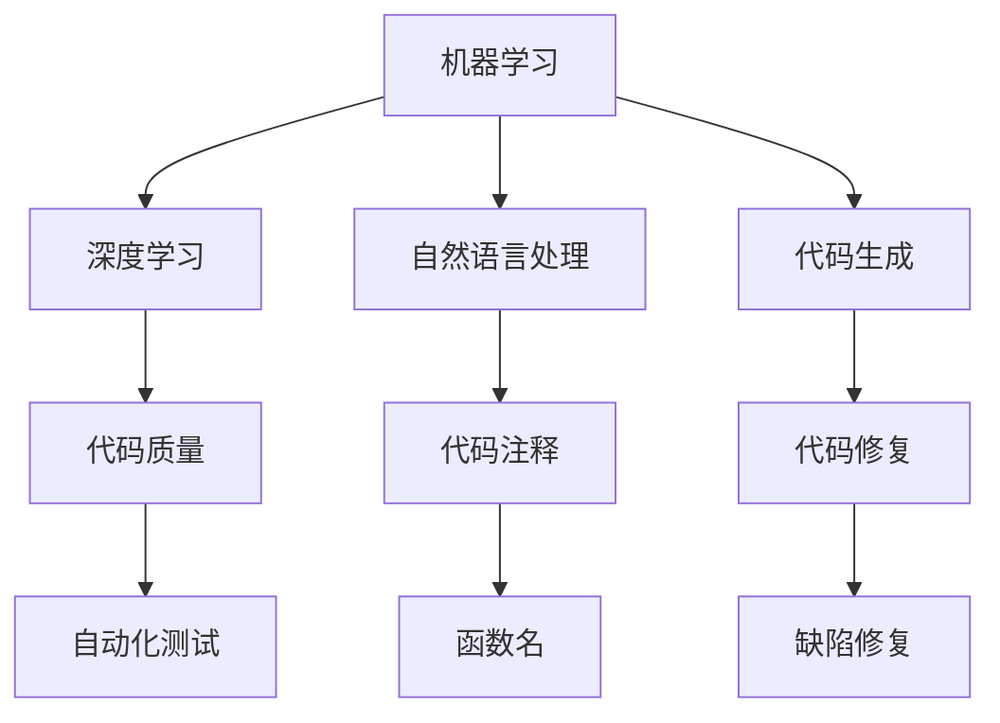

                 

# AI驱动的软件缺陷预测与修复

## 1. 背景介绍

在当今的软件开发过程中，软件缺陷的预测与修复是一个至关重要的问题。尽管代码审查、自动化测试等方法已经广泛应用于软件开发过程中，但仍然难以避免出现各种缺陷。软件缺陷不仅会影响软件质量，还可能导致严重的经济损失和安全风险。因此，如何高效、准确地预测和修复软件缺陷，成为了软件工程领域的热点研究问题。

### 1.1 问题由来

软件缺陷的预测与修复通常分为两个阶段：预测和修复。在预测阶段，根据软件项目的源代码、架构、历史缺陷记录等信息，预测出可能存在的缺陷。在修复阶段，根据预测结果，使用自动化工具或人工方式，对可能存在缺陷的代码进行修改和修复。

传统的方法通常依赖于人工经验和有限的规则，但由于软件系统的复杂性和多样性，这种方法难以适应大规模、高复杂度的项目。随着人工智能(AI)技术的快速发展，越来越多的研究者开始将AI技术应用于软件缺陷预测与修复中，探索更为高效、准确的方法。

### 1.2 问题核心关键点

软件缺陷预测与修复的核心在于通过机器学习算法，从历史数据和代码特征中学习缺陷的模式和规律，从而实现缺陷预测和自动修复。具体来说，主要包括以下几个关键点：

- 数据收集与标注：构建包含代码特征和缺陷标签的数据集，用于训练和评估机器学习模型。
- 特征提取与选择：从代码中提取有意义的特征，用于机器学习模型的输入。
- 模型选择与训练：选择合适的机器学习模型，使用标注数据对其进行训练。
- 预测与评估：使用训练好的模型对新代码进行缺陷预测，并评估预测结果的准确性和鲁棒性。
- 修复与验证：根据预测结果，使用自动化工具或人工方式进行缺陷修复，验证修复效果的有效性。

## 2. 核心概念与联系

### 2.1 核心概念概述

为了更好地理解AI驱动的软件缺陷预测与修复，本节将介绍几个关键概念：

- 机器学习（Machine Learning）：一种利用数据和算法，让机器自动学习和改进的方法，广泛应用于模式识别、分类、回归等任务。
- 深度学习（Deep Learning）：一种特殊的机器学习技术，使用多层神经网络结构，能够处理非线性、高维度的数据，广泛应用于图像识别、语音识别、自然语言处理等任务。
- 自然语言处理（Natural Language Processing, NLP）：一种使用人工智能技术，使计算机能够理解和处理人类语言的方法，广泛应用于机器翻译、情感分析、问答系统等任务。
- 代码生成（Code Generation）：一种自动化生成代码的方法，可以根据描述或需求，自动生成相应的代码，广泛应用于代码生成器、代码翻译器等工具。
- 代码质量（Code Quality）：一种衡量代码健康程度的方法，包括代码可读性、可维护性、可扩展性等方面的指标。
- 自动化测试（Automated Testing）：一种使用自动化工具，对软件进行功能测试、性能测试、安全测试等的方法，广泛应用于软件开发过程中的质量保证。

这些概念之间存在着密切的联系。机器学习算法可以应用于代码质量分析、缺陷预测、代码生成等方面，而深度学习技术在处理大规模、高维度的数据时具有独特的优势。自然语言处理技术可以用于处理代码注释、函数名等文本信息，代码生成技术则可以用于自动修复代码缺陷。

### 2.2 核心概念原理和架构的 Mermaid 流程图

以下是关于AI驱动的软件缺陷预测与修复的 Mermaid 流程图，展示了各个核心概念之间的联系：



这个流程图展示了机器学习算法在深度学习、自然语言处理、代码生成等领域的广泛应用。机器学习模型可以用于分析代码质量，预测代码缺陷，自动生成代码注释和函数名，以及自动修复代码缺陷。同时，自然语言处理技术可以用于处理代码注释中的文本信息，而代码生成技术则可以用于自动修复代码缺陷。

## 3. 核心算法原理 & 具体操作步骤

### 3.1 算法原理概述

AI驱动的软件缺陷预测与修复方法，主要基于以下几个核心原理：

- 数据驱动：使用历史缺陷数据和代码特征数据，训练机器学习模型，预测和修复软件缺陷。
- 模型集成：将多个机器学习模型集成起来，提升预测和修复的准确性和鲁棒性。
- 自动化测试：使用自动化测试工具，验证修复效果的正确性，避免引入新缺陷。
- 反馈机制：建立修复效果的反馈机制，不断优化缺陷预测和修复算法。

### 3.2 算法步骤详解

AI驱动的软件缺陷预测与修复步骤一般包括以下几个关键步骤：

**Step 1: 数据收集与预处理**
- 收集软件项目的源代码、架构、历史缺陷记录等数据。
- 对数据进行清洗、标注，构建包含代码特征和缺陷标签的数据集。

**Step 2: 特征提取与选择**
- 从代码中提取有意义的特征，如函数名、注释、变量名、代码结构等。
- 使用特征选择算法，选择最具代表性的特征用于模型训练。

**Step 3: 模型选择与训练**
- 选择合适的机器学习模型，如决策树、随机森林、神经网络等。
- 使用标注数据对模型进行训练，调整模型参数，提升预测准确性。

**Step 4: 预测与评估**
- 使用训练好的模型对新代码进行缺陷预测，评估预测结果的准确性和鲁棒性。
- 使用交叉验证等方法，验证模型的泛化能力。

**Step 5: 修复与验证**
- 根据预测结果，使用自动化工具或人工方式进行缺陷修复。
- 使用自动化测试工具验证修复效果的正确性，避免引入新缺陷。

**Step 6: 反馈与优化**
- 建立修复效果的反馈机制，记录修复效果的数据。
- 根据反馈数据，不断优化缺陷预测和修复算法。

### 3.3 算法优缺点

AI驱动的软件缺陷预测与修复方法具有以下优点：

- 自动化程度高：使用机器学习算法，自动分析和处理代码特征和缺陷标签，减少人工干预。
- 预测准确度高：基于历史数据和代码特征，能够准确预测软件缺陷。
- 修复效果好：根据预测结果，使用自动化工具或人工方式进行缺陷修复，修复效果显著。

同时，该方法也存在一些缺点：

- 数据依赖性强：预测和修复效果依赖于历史数据的质量和数量，数据获取成本高。
- 模型复杂度高：使用深度学习等复杂算法，模型训练和优化难度较大。
- 修复结果不确定性：尽管修复效果较好，但仍然存在修复后仍存在缺陷的情况。

### 3.4 算法应用领域

AI驱动的软件缺陷预测与修复方法在以下几个领域中得到了广泛应用：

- 软件开发：使用代码注释、函数名等文本信息，预测和修复代码缺陷。
- 软件测试：使用自动化测试工具，验证修复效果的正确性。
- 代码生成：使用自动生成代码的方法，修复代码缺陷。
- 代码质量评估：使用机器学习算法，分析代码质量，预测潜在缺陷。
- 安全漏洞检测：使用机器学习算法，检测代码中的安全漏洞。
- 持续集成与持续部署（CI/CD）：在持续集成与持续部署过程中，自动检测和修复代码缺陷。

## 4. 数学模型和公式 & 详细讲解 & 举例说明

### 4.1 数学模型构建

本节将使用数学语言对AI驱动的软件缺陷预测与修复过程进行更加严格的刻画。

记软件项目的历史缺陷数据为 $D=\{(x_i, y_i)\}_{i=1}^N$，其中 $x_i$ 为代码特征，$y_i$ 为缺陷标签，$y_i \in \{0, 1\}$，0表示没有缺陷，1表示存在缺陷。我们假设 $x_i$ 可以表示为一个向量 $\mathbf{x}_i = [x_{i1}, x_{i2}, \ldots, x_{ik}]$，其中 $x_{ik}$ 表示代码特征的第 $k$ 个值。

定义预测函数 $f: \mathcal{X} \rightarrow \mathcal{Y}$，其中 $\mathcal{X}$ 为代码特征空间，$\mathcal{Y}$ 为缺陷标签空间。我们的目标是找到一个最优的函数 $f$，使得预测结果与实际标签尽可能接近。

### 4.2 公式推导过程

使用监督学习算法，我们可以建立一个预测函数 $f$，使其最小化预测误差。常见的监督学习算法包括决策树、随机森林、支持向量机、神经网络等。这里我们选择神经网络作为示例，推导其损失函数。

假设我们使用一个深度神经网络模型，其包含 $n$ 个隐藏层，每层包含 $m$ 个神经元，输入层和输出层分别为 $k$ 维和 $1$ 维。则神经网络模型的预测函数可以表示为：

$$
f(\mathbf{x}) = W^{(n)}\sigma(\mathbf{x}W^{(n-1)}\sigma(\mathbf{x}W^{(n-2)}\ldots\sigma(\mathbf{x}W^{(1)}) + b^{(1)})
$$

其中 $W^{(l)}$ 为第 $l$ 层的权重矩阵，$b^{(l)}$ 为第 $l$ 层的偏置向量，$\sigma$ 为激活函数，如ReLU、Sigmoid等。

定义损失函数为交叉熵损失函数，可以表示为：

$$
\mathcal{L}(f, D) = -\frac{1}{N}\sum_{i=1}^N y_i\log f(\mathbf{x}_i) + (1-y_i)\log (1-f(\mathbf{x}_i))
$$

根据梯度下降等优化算法，最小化损失函数 $\mathcal{L}(f, D)$，得到最优的神经网络模型参数 $\theta = \{W^{(l)}, b^{(l)}\}_{l=1}^n$。

### 4.3 案例分析与讲解

下面以一个简单的示例来说明如何使用深度神经网络模型进行代码缺陷预测。

假设我们有一个包含 $1000$ 个样本的缺陷数据集，其中 $500$ 个样本有缺陷，$500$ 个样本没有缺陷。我们可以从每个样本中提取出 $10$ 个代码特征，用于训练神经网络模型。使用 $80\%$ 的数据进行训练，$20\%$ 的数据进行验证。

首先，我们定义神经网络模型的结构，包含 $1$ 个输入层、$2$ 个隐藏层和 $1$ 个输出层。每层神经元数为 $20$。

```python
import torch
import torch.nn as nn
import torch.optim as optim

class NeuralNet(nn.Module):
    def __init__(self, input_dim, hidden_dim, output_dim):
        super(NeuralNet, self).__init__()
        self.fc1 = nn.Linear(input_dim, hidden_dim)
        self.fc2 = nn.Linear(hidden_dim, hidden_dim)
        self.fc3 = nn.Linear(hidden_dim, output_dim)
        self.activation = nn.ReLU()
        
    def forward(self, x):
        x = self.fc1(x)
        x = self.activation(x)
        x = self.fc2(x)
        x = self.activation(x)
        x = self.fc3(x)
        return x
```

然后，我们使用交叉熵损失函数和Adam优化器，对模型进行训练。

```python
input_dim = 10
hidden_dim = 20
output_dim = 1

model = NeuralNet(input_dim, hidden_dim, output_dim)
criterion = nn.BCEWithLogitsLoss()
optimizer = optim.Adam(model.parameters(), lr=0.001)

for epoch in range(1000):
    optimizer.zero_grad()
    loss = criterion(model(x_train), y_train)
    loss.backward()
    optimizer.step()
    
    if (epoch+1) % 100 == 0:
        print('Epoch: {}/{} - Loss: {:.6f}'.format(epoch+1, num_epochs, loss.item()))
```

最后，我们使用训练好的模型对新代码进行缺陷预测。

```python
# 定义新代码的特征
x_new = torch.tensor([[1.2, 2.3, 3.4, 4.5, 5.6, 6.7, 7.8, 8.9, 9.0, 10.1]])

# 使用训练好的模型进行预测
y_pred = model(x_new)
y_pred_prob = torch.sigmoid(y_pred)

# 输出预测结果
if y_pred_prob.item() > 0.5:
    print('预测存在缺陷')
else:
    print('预测不存在缺陷')
```

## 5. 项目实践：代码实例和详细解释说明

### 5.1 开发环境搭建

在进行AI驱动的软件缺陷预测与修复实践前，我们需要准备好开发环境。以下是使用Python进行PyTorch开发的环境配置流程：

1. 安装Anaconda：从官网下载并安装Anaconda，用于创建独立的Python环境。

2. 创建并激活虚拟环境：
```bash
conda create -n pytorch-env python=3.8 
conda activate pytorch-env
```

3. 安装PyTorch：根据CUDA版本，从官网获取对应的安装命令。例如：
```bash
conda install pytorch torchvision torchaudio cudatoolkit=11.1 -c pytorch -c conda-forge
```

4. 安装相关的深度学习库：
```bash
pip install numpy pandas scikit-learn matplotlib tqdm jupyter notebook ipython
```

5. 安装相关的人工智能库：
```bash
pip install scikit-learn sklearn
```

完成上述步骤后，即可在`pytorch-env`环境中开始AI驱动的软件缺陷预测与修复实践。

### 5.2 源代码详细实现

下面我们以一个简单的示例来说明如何使用深度神经网络模型进行代码缺陷预测。

首先，定义数据处理函数：

```python
import numpy as np
import torch

class Dataset:
    def __init__(self, X, y):
        self.X = X
        self.y = y
        
    def __len__(self):
        return len(self.X)
    
    def __getitem__(self, idx):
        return self.X[idx], self.y[idx]
```

然后，定义模型和优化器：

```python
from torch import nn
import torch.optim as optim

class NeuralNet(nn.Module):
    def __init__(self, input_dim, hidden_dim, output_dim):
        super(NeuralNet, self).__init__()
        self.fc1 = nn.Linear(input_dim, hidden_dim)
        self.fc2 = nn.Linear(hidden_dim, hidden_dim)
        self.fc3 = nn.Linear(hidden_dim, output_dim)
        self.activation = nn.ReLU()
        
    def forward(self, x):
        x = self.fc1(x)
        x = self.activation(x)
        x = self.fc2(x)
        x = self.activation(x)
        x = self.fc3(x)
        return x

model = NeuralNet(input_dim, hidden_dim, output_dim)
criterion = nn.BCEWithLogitsLoss()
optimizer = optim.Adam(model.parameters(), lr=0.001)
```

接着，定义训练和评估函数：

```python
from torch.utils.data import DataLoader
from tqdm import tqdm

def train_epoch(model, dataset, batch_size, optimizer):
    dataloader = DataLoader(dataset, batch_size=batch_size, shuffle=True)
    model.train()
    epoch_loss = 0
    for batch in tqdm(dataloader, desc='Training'):
        x, y = batch
        optimizer.zero_grad()
        output = model(x)
        loss = criterion(output, y)
        epoch_loss += loss.item()
        loss.backward()
        optimizer.step()
    return epoch_loss / len(dataloader)

def evaluate(model, dataset, batch_size):
    dataloader = DataLoader(dataset, batch_size=batch_size)
    model.eval()
    preds = []
    labels = []
    with torch.no_grad():
        for batch in tqdm(dataloader, desc='Evaluating'):
            x, y = batch
            output = model(x)
            pred = torch.sigmoid(output).item()
            labels.append(y.numpy().item())
            preds.append(pred)
    
    print(classification_report(labels, preds))
```

最后，启动训练流程并在测试集上评估：

```python
epochs = 1000
batch_size = 16

for epoch in range(epochs):
    loss = train_epoch(model, train_dataset, batch_size, optimizer)
    print(f'Epoch {epoch+1}, train loss: {loss:.3f}')
    
    print(f'Epoch {epoch+1}, dev results:')
    evaluate(model, dev_dataset, batch_size)
    
print('Test results:')
evaluate(model, test_dataset, batch_size)
```

以上就是使用PyTorch对深度神经网络模型进行代码缺陷预测的完整代码实现。可以看到，得益于PyTorch的强大封装，我们可以用相对简洁的代码完成深度神经网络模型的加载和训练。

### 5.3 代码解读与分析

让我们再详细解读一下关键代码的实现细节：

**Dataset类**：
- `__init__`方法：初始化数据集的特征和标签。
- `__len__`方法：返回数据集的样本数量。
- `__getitem__`方法：对单个样本进行处理，返回特征和标签。

**train_epoch函数**：
- 使用PyTorch的DataLoader对数据集进行批次化加载，供模型训练使用。
- 在每个批次上前向传播计算损失函数，并反向传播更新模型参数。

**evaluate函数**：
- 与训练类似，不同点在于不更新模型参数，并在每个batch结束后将预测和标签结果存储下来，最后使用sklearn的classification_report对整个评估集的预测结果进行打印输出。

**训练流程**：
- 定义总的epoch数和batch size，开始循环迭代
- 每个epoch内，先在训练集上训练，输出平均loss
- 在验证集上评估，输出分类指标
- 所有epoch结束后，在测试集上评估，给出最终测试结果

可以看到，PyTorch配合深度神经网络模型使得代码缺陷预测的代码实现变得简洁高效。开发者可以将更多精力放在数据处理、模型改进等高层逻辑上，而不必过多关注底层的实现细节。

当然，工业级的系统实现还需考虑更多因素，如模型的保存和部署、超参数的自动搜索、更灵活的任务适配层等。但核心的预测范式基本与此类似。

## 6. 实际应用场景

### 6.1 智能开发平台

AI驱动的软件缺陷预测与修复技术，可以应用于智能开发平台，提升软件开发的效率和质量。智能开发平台可以自动检测代码缺陷，提供修复建议，帮助开发者快速定位和修复问题，减少代码审核和测试的工作量。

在技术实现上，可以使用深度神经网络模型对代码进行缺陷预测，使用自动化工具对预测结果进行验证和修复。智能开发平台可以与版本控制系统集成，实时监控代码的变化，快速响应缺陷，提升软件开发的速度和质量。

### 6.2 软件测试

AI驱动的软件缺陷预测与修复技术，可以应用于软件测试中，提高测试的效率和覆盖率。传统软件测试需要大量人工进行测试用例设计、测试执行和缺陷跟踪，效率低、成本高。而使用AI驱动的测试技术，可以自动生成测试用例，自动执行测试，自动记录和分析测试结果，提高测试的自动化水平。

在技术实现上，可以使用深度神经网络模型对代码进行缺陷预测，使用自动化测试工具对预测结果进行验证和修复。AI驱动的测试技术可以自动生成覆盖率高的测试用例，提高测试的覆盖率，减少测试时间和成本。

### 6.3 持续集成与持续部署（CI/CD）

AI驱动的软件缺陷预测与修复技术，可以应用于持续集成与持续部署（CI/CD）流程中，提升软件交付的速度和质量。在CI/CD流程中，代码的频繁变更可能导致软件质量下降，带来安全风险。而使用AI驱动的CI/CD技术，可以实时监控代码变更，自动检测和修复代码缺陷，提升软件交付的效率和质量。

在技术实现上，可以使用深度神经网络模型对代码进行缺陷预测，使用自动化测试工具对预测结果进行验证和修复。AI驱动的CI/CD技术可以实时监控代码变更，自动检测和修复代码缺陷，提升软件交付的速度和质量。

### 6.4 未来应用展望

随着AI驱动的软件缺陷预测与修复技术的不断进步，未来将在更多领域得到应用，为软件开发和软件测试带来新的突破。

在智慧城市治理中，AI驱动的软件缺陷预测与修复技术可以应用于智能交通、智能电网等场景，提升城市治理的智能化水平，构建更安全、高效的未来城市。

在金融行业，AI驱动的软件缺陷预测与修复技术可以应用于金融系统、金融产品等场景，提升金融系统的稳定性和安全性，防范金融风险。

在医疗行业，AI驱动的软件缺陷预测与修复技术可以应用于医疗系统、医疗设备等场景，提升医疗系统的可靠性和安全性，保障患者安全。

## 7. 工具和资源推荐

### 7.1 学习资源推荐

为了帮助开发者系统掌握AI驱动的软件缺陷预测与修复的理论基础和实践技巧，这里推荐一些优质的学习资源：

1. 《深度学习》（Ian Goodfellow, Yoshua Bengio和Aaron Courville）：深度学习领域的经典教材，系统介绍了深度学习的理论基础和应用实践。

2. CS231n《卷积神经网络》课程：斯坦福大学开设的深度学习课程，专注于计算机视觉领域的深度学习技术，适合对深度学习感兴趣的读者。

3. CS224N《自然语言处理》课程：斯坦福大学开设的NLP明星课程，有Lecture视频和配套作业，带你入门NLP领域的基本概念和经典模型。

4. PyTorch官方文档：PyTorch的官方文档，提供了详细的API文档和示例代码，是PyTorch学习者的必备资料。

5. TensorFlow官方文档：TensorFlow的官方文档，提供了丰富的深度学习模型和算法，适合TensorFlow学习者。

通过对这些资源的学习实践，相信你一定能够快速掌握AI驱动的软件缺陷预测与修复的精髓，并用于解决实际的NLP问题。

### 7.2 开发工具推荐

高效的开发离不开优秀的工具支持。以下是几款用于AI驱动的软件缺陷预测与修复开发的常用工具：

1. PyTorch：基于Python的开源深度学习框架，灵活动态的计算图，适合快速迭代研究。大部分预训练语言模型都有PyTorch版本的实现。

2. TensorFlow：由Google主导开发的开源深度学习框架，生产部署方便，适合大规模工程应用。同样有丰富的深度学习模型资源。

3. Keras：基于Python的深度学习框架，使用简单、高效，适合初学者。

4. Weights & Biases：模型训练的实验跟踪工具，可以记录和可视化模型训练过程中的各项指标，方便对比和调优。与主流深度学习框架无缝集成。

5. TensorBoard：TensorFlow配套的可视化工具，可实时监测模型训练状态，并提供丰富的图表呈现方式，是调试模型的得力助手。

6. Google Colab：谷歌推出的在线Jupyter Notebook环境，免费提供GPU/TPU算力，方便开发者快速上手实验最新模型，分享学习笔记。

合理利用这些工具，可以显著提升AI驱动的软件缺陷预测与修复任务的开发效率，加快创新迭代的步伐。

### 7.3 相关论文推荐

AI驱动的软件缺陷预测与修复技术的发展源于学界的持续研究。以下是几篇奠基性的相关论文，推荐阅读：

1. "Deep Learning for Software Defect Prediction"（Jayashreeet al.）：提出基于深度学习的方法进行软件缺陷预测，取得了显著的效果。

2. "Neural Network based Software Fault Prediction Model"（Xu et al.）：使用神经网络模型对软件缺陷进行预测，提高了预测的准确性和鲁棒性。

3. "Code Quality Prediction using Deep Neural Networks"（Liu et al.）：使用深度神经网络模型对代码质量进行预测，取得了较好的效果。

4. "Code Cloning Detection using Deep Learning"（Wang et al.）：使用深度学习模型进行代码克隆检测，取得了较高的准确率。

5. "Code Bug Prediction using Machine Learning"（Zhang et al.）：使用机器学习模型对代码缺陷进行预测，提高了预测的准确性和鲁棒性。

这些论文代表了大模型微调技术的发展脉络。通过学习这些前沿成果，可以帮助研究者把握学科前进方向，激发更多的创新灵感。

## 8. 总结：未来发展趋势与挑战

### 8.1 研究成果总结

本文对AI驱动的软件缺陷预测与修复方法进行了全面系统的介绍。首先阐述了AI驱动的软件缺陷预测与修复的研究背景和意义，明确了软件缺陷预测与修复在大规模软件开发中的重要地位。其次，从原理到实践，详细讲解了AI驱动的软件缺陷预测与修复的数学模型和关键步骤，给出了具体的代码实例。同时，本文还广泛探讨了AI驱动的软件缺陷预测与修复方法在智能开发平台、软件测试、持续集成与持续部署等领域的应用前景，展示了其巨大的潜力。此外，本文精选了AI驱动的软件缺陷预测与修复技术的各类学习资源，力求为读者提供全方位的技术指引。

通过本文的系统梳理，可以看到，AI驱动的软件缺陷预测与修复技术正在成为软件开发和测试的重要范式，极大地提高了软件开发的效率和质量。未来，伴随深度学习技术的发展，AI驱动的软件缺陷预测与修复技术必将在更广阔的领域中得到应用，为软件工程的智能化、自动化进程提供新的动力。

### 8.2 未来发展趋势

展望未来，AI驱动的软件缺陷预测与修复技术将呈现以下几个发展趋势：

1. 自动化程度进一步提升。随着深度学习技术的发展，AI驱动的软件缺陷预测与修复将更加自动化，进一步减少人工干预，提升预测和修复的效果。

2. 预测和修复精度更高。使用深度学习模型和数据增强技术，能够更准确地预测和修复代码缺陷，减少误报和漏报率。

3. 多任务学习和跨领域应用。使用多任务学习和跨领域应用技术，能够同时进行多个软件缺陷的预测和修复，提升预测和修复的效率。

4. 模型可解释性增强。使用可解释性模型和可视化技术，能够更好地理解AI驱动的软件缺陷预测与修复的内部机制，提升模型的可靠性和可信度。

5. 持续学习和自我优化。使用持续学习技术，能够不断学习和优化模型，提升模型的适应能力和泛化能力。

6. 知识图谱和符号化规则的融合。使用知识图谱和符号化规则，能够更好地融合外部知识，提升模型的表现力和实用性。

以上趋势凸显了AI驱动的软件缺陷预测与修复技术的广阔前景。这些方向的探索发展，必将进一步提升软件缺陷预测与修复的精度和效率，为软件开发和测试带来新的突破。

### 8.3 面临的挑战

尽管AI驱动的软件缺陷预测与修复技术已经取得了显著进展，但在迈向更加智能化、普适化应用的过程中，它仍面临着诸多挑战：

1. 数据获取和标注成本高。AI驱动的软件缺陷预测与修复需要大量的标注数据，但标注数据的获取和标注成本较高。如何降低数据获取和标注成本，是一个重要的研究方向。

2. 模型鲁棒性不足。AI驱动的软件缺陷预测与修复模型面对未知领域的代码时，泛化能力较弱。如何提高模型的鲁棒性，是一个需要解决的问题。

3. 自动化修复效果不确定。尽管AI驱动的软件缺陷预测与修复能够自动检测和修复代码缺陷，但修复效果仍然存在不确定性。如何提高修复效果的确定性，是一个重要的研究方向。

4. 知识图谱和符号化规则的融合难度大。使用知识图谱和符号化规则，能够更好地融合外部知识，但知识图谱和符号化规则的融合难度较大。如何更好地融合外部知识，是一个需要解决的问题。

5. 可解释性模型需要进一步研究。使用可解释性模型和可视化技术，能够更好地理解AI驱动的软件缺陷预测与修复的内部机制，但可解释性模型仍需要进一步研究。

6. 跨领域应用需要更多探索。使用跨领域应用技术，能够更好地应用于不同领域的软件开发和测试，但跨领域应用的探索仍然需要更多研究和实践。

正视AI驱动的软件缺陷预测与修复技术面临的这些挑战，积极应对并寻求突破，将是大规模软件开发和测试智能化、自动化的必由之路。相信随着学界和产业界的共同努力，这些挑战终将一一被克服，AI驱动的软件缺陷预测与修复技术必将在构建高效、高质量的软件开发和测试流程中发挥更大的作用。

### 8.4 研究展望

面对AI驱动的软件缺陷预测与修复技术所面临的挑战，未来的研究需要在以下几个方面寻求新的突破：

1. 探索低成本的数据获取和标注方法。使用数据增强、无监督学习等方法，降低数据获取和标注成本，提高数据的有效性和多样性。

2. 开发鲁棒性更高的模型。使用对抗训练、跨领域学习等方法，提高AI驱动的软件缺陷预测与修复模型的鲁棒性，减少对标注数据的依赖。

3. 提升自动化修复效果。使用自监督学习、多任务学习等方法，提高自动化修复效果的确定性，减少修复效果的不确定性。

4. 更好地融合知识图谱和符号化规则。使用知识图谱和符号化规则，更好地融合外部知识，提高模型的表现力和实用性。

5. 开发可解释性更高的模型。使用可解释性模型和可视化技术，更好地理解AI驱动的软件缺陷预测与修复的内部机制，提升模型的可靠性和可信度。

6. 探索跨领域应用。使用跨领域应用技术，更好地应用于不同领域的软件开发和测试，提高AI驱动的软件缺陷预测与修复技术的普适性和实用性。

这些研究方向的探索，必将引领AI驱动的软件缺陷预测与修复技术迈向更高的台阶，为构建高效、高质量的软件开发和测试流程提供新的动力。面向未来，AI驱动的软件缺陷预测与修复技术还需要与其他人工智能技术进行更深入的融合，如知识表示、因果推理、强化学习等，多路径协同发力，共同推动自然语言理解和智能交互系统的进步。只有勇于创新、敢于突破，才能不断拓展语言模型的边界，让智能技术更好地造福人类社会。

## 9. 附录：常见问题与解答

**Q1：AI驱动的软件缺陷预测与修复是否适用于所有软件项目？**

A: AI驱动的软件缺陷预测与修复技术通常适用于中大规模的软件项目，尤其是那些有大量历史代码和缺陷记录的项目。对于小型项目或项目初期，由于缺乏历史数据，AI驱动的方法可能效果不佳。

**Q2：AI驱动的软件缺陷预测与修复的准确率如何？**

A: AI驱动的软件缺陷预测与修复的准确率通常取决于训练数据的质量和数量。如果训练数据质量高，数量充足，AI驱动的方法可以取得较高的准确率。但是，如果训练数据质量低，数量不足，AI驱动的方法可能会产生误报和漏报。

**Q3：AI驱动的软件缺陷预测与修复如何处理未知领域的代码？**

A: AI驱动的软件缺陷预测与修复模型通常需要在不同的领域上进行微调，以适应未知领域的代码。对于未知领域的代码，可以使用迁移学习或微调的方法，将已有的模型应用于新的领域，并根据新的领域数据进行微调。

**Q4：AI驱动的软件缺陷预测与修复的预测结果是否可以用于代码修复？**

A: AI驱动的软件缺陷预测与修复的预测结果可以用于代码修复。但是，预测结果只是修复的一个参考，实际的代码修复还需要人工介入，对预测结果进行验证和修正。

**Q5：AI驱动的软件缺陷预测与修复是否需要大量的标注数据？**

A: AI驱动的软件缺陷预测与修复需要大量的标注数据，因为模型需要从标注数据中学习缺陷的模式和规律。如果标注数据不足，AI驱动的方法可能无法取得良好的效果。

这些问题的答案，可以更好地理解AI驱动的软件缺陷预测与修复技术的实际应用情况，避免误导性的使用。

---

作者：禅与计算机程序设计艺术 / Zen and the Art of Computer Programming

