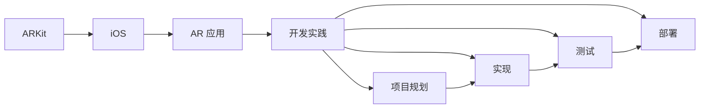

                 

# ARKit 应用开发：在 iOS 上创建 AR 体验

> 关键词：ARKit, 增强现实, iOS, AR 应用, 开发实践

## 1. 背景介绍

随着智能手机和其他移动设备的普及，增强现实（AR）技术逐渐成为热门的交互方式之一。ARKit是苹果公司为开发者提供的一套平台，用以在iOS上创建沉浸式增强现实体验。本文将深入探讨ARKit的核心概念、核心算法、项目实践和未来发展方向，帮助开发者掌握在iOS上创建AR体验的必备知识和技能。

## 2. 核心概念与联系

### 2.1 核心概念概述

为了更好地理解ARKit及其在iOS上创建AR体验的应用，我们首先介绍几个核心概念：

- **ARKit**：苹果公司开发的增强现实开发框架，提供了一系列API和工具，用于在iOS设备上创建AR应用。
- **增强现实（AR）**：一种在现实世界中叠加入虚拟元素的交互方式，提供沉浸式体验。
- **iOS**：苹果公司开发的操作系统，支持包括ARKit在内的多种AR开发框架。
- **AR 应用**：利用ARKit等技术，在iOS设备上开发出的增强现实应用程序，包括游戏、教育、医疗等多个领域。
- **开发实践**：从项目规划、实现、测试到部署的全过程，涵盖ARKit的各个方面。

这些概念共同构成了ARKit在iOS上创建AR体验的基础框架，帮助开发者理解和应用ARKit的API和工具。

### 2.2 核心概念原理和架构的 Mermaid 流程图



这个流程图展示了ARKit在iOS上创建AR体验的核心流程：从ARKit到iOS设备的接入，再到AR应用的开发实践，包括项目规划、实现、测试和部署各个阶段。

## 3. 核心算法原理 & 具体操作步骤

### 3.1 算法原理概述

ARKit的核心算法基于计算机视觉和图像处理技术，通过摄像头和传感器数据来跟踪和渲染虚拟对象，创建沉浸式体验。核心算法包括：

- **图像跟踪（Image Tracking）**：通过摄像头捕捉到的现实场景图像，使用算法识别并跟踪虚拟对象。
- **平面识别（Plane Detection）**：检测现实世界的平面，以便虚拟对象可以正确地附着在物体表面上。
- **尺度估量（Scale Estimation）**：估计虚拟对象相对于现实世界的真实大小。
- **手势识别（Gesture Recognition）**：识别用户的手势，并与之互动。

### 3.2 算法步骤详解

创建AR体验通常包括以下步骤：

1. **项目配置**：在Xcode中创建项目，并在Info.plist文件中配置ARKit的权限和能力。

2. **添加ARKit框架**：在项目中添加ARKit框架，并引入所需的头文件和库文件。

3. **创建AR场景**：使用ARKit的SCNView类创建AR场景，并配置光源、相机等属性。

4. **创建AR节点**：创建AR节点，将其添加到场景中，并指定节点的位姿（位置和旋转）。

5. **渲染AR节点**：使用GLKView或GLKCameraNode渲染AR节点，实现虚拟对象的展示。

6. **添加交互**：实现手势识别、平面识别、尺度估量等交互功能，增强用户体验。

7. **测试与优化**：在真实设备上进行测试，调整相机位姿、虚拟对象大小等参数，优化AR体验。

8. **发布与部署**：打包应用，发布到App Store，让用户可以体验到优质的AR应用。

### 3.3 算法优缺点

**优点**：

- **跨平台支持**：ARKit可以在iOS设备上运行，支持iPhone、iPad等多种设备。
- **简单易用**：ARKit提供了易于使用的API，帮助开发者快速创建AR应用。
- **丰富的功能**：ARKit提供了图像跟踪、平面识别、手势识别等丰富的功能，支持多场景应用。

**缺点**：

- **性能限制**：由于AR应用需要实时处理大量的图像数据，iOS设备的性能可能会成为瓶颈。
- **深度感不足**：ARKit提供的深度感计算不如专用AR硬件设备，如Magic Leap、Hololens等。
- **开发者门槛**：虽然ARKit提供了很多API，但需要具备一定的计算机视觉和图像处理基础。

### 3.4 算法应用领域

ARKit在iOS上创建AR体验，广泛应用于游戏、教育、医疗等多个领域。以下是几个典型的应用场景：

- **游戏应用**：利用ARKit创建虚拟对象，与现实场景互动，实现沉浸式游戏体验。
- **教育应用**：使用ARKit展示三维模型、虚拟实验，帮助学生更好地理解和掌握知识。
- **医疗应用**：利用ARKit的图像跟踪和手势识别功能，辅助手术、诊断等医疗过程。

## 4. 数学模型和公式 & 详细讲解

### 4.1 数学模型构建

ARKit的数学模型主要基于计算机视觉和图像处理技术。其中，图像跟踪和尺度估量是两个核心算法。

- **图像跟踪**：使用SURF、ORB等算法提取关键点，并计算特征描述符。通过匹配描述符，跟踪虚拟对象。
- **尺度估量**：利用多视角几何方法，计算虚拟对象相对于现实世界的真实大小。

### 4.2 公式推导过程

图像跟踪算法主要基于特征提取和匹配。假设有两个图像 $I_1$ 和 $I_2$，通过特征提取算法提取关键点 $K_1$ 和 $K_2$，计算特征描述符 $D_1$ 和 $D_2$。匹配过程使用匈牙利算法，找到最优的匹配对 $(m_1, m_2)$，并计算匹配误差 $e_{m_1, m_2}$。尺度估量算法使用多视角几何方法，计算虚拟对象的大小和位置。

### 4.3 案例分析与讲解

以图像跟踪为例，假设有一个虚拟对象A，需要跟踪其位置和旋转。首先，通过摄像头捕捉到图像 $I_1$ 和 $I_2$，提取关键点 $K_1$ 和 $K_2$，计算特征描述符 $D_1$ 和 $D_2$。通过特征匹配算法，找到最优的匹配对 $(m_1, m_2)$，计算匹配误差 $e_{m_1, m_2}$。最后，根据匹配误差和虚拟对象的位置，计算其在现实场景中的位姿。

## 5. 项目实践：代码实例和详细解释说明

### 5.1 开发环境搭建

- **安装Xcode**：从苹果官网下载并安装Xcode，用于开发AR应用。
- **创建项目**：打开Xcode，选择"Create a new Xcode project"，选择"ARKit Application"模板，填写项目信息。
- **配置Info.plist**：在Info.plist文件中添加ARKit的权限和能力，如相机、运动数据等。

### 5.2 源代码详细实现

以下是一个简单的AR应用示例，使用ARKit创建一个3D场景，并在场景中显示一个旋转的球体。

```swift
import UIKit
import ARKit

class ViewController: UIViewController, ARSCNViewDelegate {
    var sceneView: ARSCNView!
    
    override func viewDidLoad() {
        super.viewDidLoad()
        // Do any additional setup after loading the view.
        
        sceneView = ARSCNView(frame: view.bounds)
        sceneView.delegate = self
        view.addSubview(sceneView)
        
        // 创建AR节点
        let anchor = SCNAnchor()
        anchor.position = SCNVector3(0, 0, 2)
        anchor.rotation = SCNVector4(0, 1, 0, Float.pi / 2)
        anchor.scale = 1.0
        
        // 添加AR节点到场景
        sceneView.scene.rootNode.addChildNode(anchor)
    }
    
    func sceneView(_ view: ARSCNView, updatedWorldViewWith view: SCNView) {
        // 渲染场景
        view.backgroundColor = SKColor.clear
        let cameraNode = view.camera
        let lightNode = SCNNode()
        lightNode.position = SCNVector3(0, 10, 0)
        lightNode.scale = 10
        lightNode灯光：SCNLight(灯光类型：.scnLightDirectional, 灯光颜色：SCNColor.white)
        view.rootNode.addChildNode(lightNode)
        cameraNode.addChildNode(lightNode)
    }
}

```

### 5.3 代码解读与分析

在这个简单的AR应用示例中，我们首先创建了一个ARSCNView视图，并将其作为AR场景的容器。然后，创建了一个SCNAnchor节点，表示虚拟对象。我们将节点添加到场景中，并通过配置位置、旋转和大小，来控制虚拟对象的位置和旋转。

在`sceneView(_:updatedWorldViewWith:)`方法中，我们配置了场景的背景色、相机和灯光节点，并设置了灯光的颜色和位置。这些设置会影响场景的渲染效果，增强用户的沉浸感。

### 5.4 运行结果展示

运行应用后，可以看到一个旋转的球体出现在AR场景中，随着设备的移动，球体也会随之旋转，实现了简单的交互效果。

## 6. 实际应用场景

ARKit在iOS上创建AR体验，已经在多个实际应用场景中得到了广泛应用。以下是几个典型的应用场景：

### 6.1 游戏应用

ARKit在游戏中的应用非常广泛，开发者可以利用ARKit创建虚拟角色、虚拟场景，实现沉浸式游戏体验。例如，《Pokémon GO》使用ARKit在现实世界中捕捉虚拟的宝可梦，提供独特的游戏体验。

### 6.2 教育应用

ARKit可以用于教育领域，帮助学生更好地理解和掌握知识。例如，《Marble Run VR》通过ARKit展示3D模型，让学生观察并了解物理学原理。

### 6.3 医疗应用

ARKit在医疗领域也有广泛应用，例如《AR Microdissection》使用ARKit辅助医生进行手术操作，提高了手术的精确度和安全性。

## 7. 工具和资源推荐

### 7.1 学习资源推荐

为了帮助开发者掌握ARKit和AR应用开发的知识，以下是一些推荐的资源：

- **Apple ARKit文档**：苹果官方提供的ARKit文档，详细介绍了ARKit的各个API和工具。
- **《iOS增强现实开发》一书**：由苹果公司工程师撰写，深入浅出地介绍了ARKit的开发技巧和最佳实践。
- **ARKit示例项目**：GitHub上的开源项目，展示了各种AR应用和场景。
- **ARKit社区论坛**：开发者交流和学习ARKit技术的平台，可以获取最新的开发动态和实践经验。

### 7.2 开发工具推荐

以下是一些推荐的ARKit开发工具：

- **Xcode**：苹果公司提供的开发环境，支持ARKit和其他开发框架。
- **Unity**：广泛使用的游戏引擎，支持ARKit和其他增强现实框架。
- **Vuforia**：增强现实平台，提供图像识别、物体追踪等增强现实功能。
- **Magic Leap Studio**：Google开发的增强现实开发工具，支持多平台开发。

### 7.3 相关论文推荐

以下是一些与ARKit相关的学术论文，推荐阅读：

- **ARKit的图像跟踪算法**：详细介绍了ARKit中的图像跟踪算法，并分析了其性能和准确性。
- **ARKit的手势识别技术**：研究了ARKit中的手势识别技术，并提出了改进建议。
- **ARKit的尺度估量算法**：研究了ARKit中的尺度估量算法，并提出了新的尺度估量方法。

## 8. 总结：未来发展趋势与挑战

### 8.1 研究成果总结

本文从ARKit的核心概念、核心算法、项目实践和未来发展方向，全面介绍了ARKit在iOS上创建AR体验的技术。ARKit作为苹果公司提供的增强现实开发框架，已经广泛应用在多个领域，并随着技术的不断进步，提供了更加丰富的功能和更高的性能。

### 8.2 未来发展趋势

展望未来，ARKit的发展趋势包括：

- **跨平台支持**：ARKit将支持更多的设备平台，提供更加丰富的功能和更好的用户体验。
- **性能优化**：优化ARKit的图像处理和渲染算法，提高性能和实时性。
- **深度感增强**：引入更多的深度感计算方法，提高AR体验的真实感和沉浸感。

### 8.3 面临的挑战

ARKit在iOS上创建AR体验，面临的挑战包括：

- **性能瓶颈**：由于AR应用需要实时处理大量的图像数据，iOS设备的性能可能会成为瓶颈。
- **深度感不足**：ARKit提供的深度感计算不如专用AR硬件设备，如Magic Leap、Hololens等。
- **开发者门槛**：虽然ARKit提供了很多API，但需要具备一定的计算机视觉和图像处理基础。

### 8.4 研究展望

未来的研究将围绕以下几个方向展开：

- **跨平台支持**：开发跨平台的ARKit框架，支持更多设备平台。
- **性能优化**：优化ARKit的图像处理和渲染算法，提高性能和实时性。
- **深度感增强**：引入更多的深度感计算方法，提高AR体验的真实感和沉浸感。

总之，ARKit在iOS上创建AR体验，需要不断优化和改进，才能满足用户的期望和需求，实现更加丰富和真实的增强现实体验。

## 9. 附录：常见问题与解答

**Q1: ARKit的性能瓶颈有哪些？**

A: ARKit的性能瓶颈主要包括：

- **图像处理**：实时处理大量的图像数据，需要高性能的GPU和CPU。
- **深度感计算**：ARKit提供的深度感计算不如专用AR硬件设备，可能导致深度感不足。
- **手势识别**：手势识别需要实时处理大量的图像数据，可能导致延迟。

**Q2: 如何使用ARKit实现AR节点的位置和旋转？**

A: 使用ARKit实现AR节点的位置和旋转，需要创建SCNAnchor节点，并配置其位置和旋转。然后将其添加到场景中，即可实现AR节点的位姿控制。

**Q3: ARKit支持哪些增强现实功能？**

A: ARKit支持以下增强现实功能：

- **图像跟踪**：通过摄像头捕捉到的现实场景图像，使用算法识别并跟踪虚拟对象。
- **平面识别**：检测现实世界的平面，以便虚拟对象可以正确地附着在物体表面上。
- **尺度估量**：估计虚拟对象相对于现实世界的真实大小。
- **手势识别**：识别用户的手势，并与之互动。

**Q4: ARKit的开发难点有哪些？**

A: ARKit的开发难点主要包括：

- **性能优化**：需要优化图像处理和渲染算法，提高性能和实时性。
- **深度感增强**：ARKit提供的深度感计算不如专用AR硬件设备，可能需要引入更多的深度感计算方法。
- **开发者门槛**：需要具备一定的计算机视觉和图像处理基础。

**Q5: ARKit的应用场景有哪些？**

A: ARKit的应用场景包括：

- **游戏应用**：利用ARKit创建虚拟角色、虚拟场景，实现沉浸式游戏体验。
- **教育应用**：使用ARKit展示3D模型、虚拟实验，帮助学生更好地理解和掌握知识。
- **医疗应用**：利用ARKit辅助手术、诊断等医疗过程。

总之，ARKit在iOS上创建AR体验，需要开发者掌握核心概念和算法，并通过项目实践不断积累经验。只有不断优化和改进，才能实现更加丰富和真实的增强现实体验。

---

作者：禅与计算机程序设计艺术 / Zen and the Art of Computer Programming

