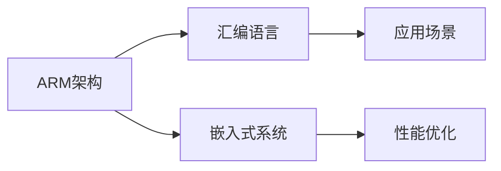

                 

# ARM 汇编编程：嵌入式性能

> 关键词：ARM,汇编,嵌入式系统,性能优化,应用场景

## 1. 背景介绍

### 1.1 问题由来
在现代计算机架构中，ARM架构因其高效、低功耗的特点，广泛应用于嵌入式系统、移动设备、物联网等领域。相对于复杂的高级语言，汇编语言直接控制硬件操作，能够达到最优的性能表现。但在嵌入式系统的高性能需求下，如何利用汇编语言进一步优化性能，提升系统的响应速度，成为技术开发者必须面对的重要课题。

### 1.2 问题核心关键点
ARM汇编编程涉及的核心问题包括：
1. 寄存器管理：合理使用ARM架构中的各种寄存器，最大化利用硬件资源。
2. 指令选择：根据应用场景，选择合适的汇编指令，提升程序执行效率。
3. 系统优化：在操作系统层面进行优化，减少系统调用的开销。
4. 中断处理：高效处理中断事件，保障系统稳定性和实时性。
5. 性能测试：通过科学的方法和工具，评估和优化程序的性能表现。

### 1.3 问题研究意义
研究ARM汇编编程及其性能优化，对于提升嵌入式系统的性能、效率和稳定性具有重要意义：
1. 高效利用资源：通过精细化的汇编编程，能够最大化利用ARM架构的硬件特性，实现低功耗、高速度的嵌入式系统。
2. 优化用户体验：优化后的汇编程序能够提供更快的响应速度，改善用户的整体体验。
3. 推动技术发展：汇编语言的深入理解与应用，有助于提升开发者对ARM架构的掌握，推动嵌入式技术的发展。
4. 助力产业升级：高性能的嵌入式系统是物联网、智能家居等产业的核心技术，汇编编程技术的发展有助于这些产业的升级和转型。

## 2. 核心概念与联系

### 2.1 核心概念概述

在研究ARM汇编编程的性能优化过程中，需要关注以下几个核心概念：

- ARM架构：一种广泛应用于嵌入式设备、移动设备等高性能系统的处理器架构。
- 汇编语言：一种直接操作硬件的编程语言，与高级语言相比，可以提供更精细的控制和更优的性能表现。
- 嵌入式系统：将计算机软件、硬件结合，实现特定功能的系统。
- 性能优化：通过合理的编程技巧和算法选择，提升程序执行效率的过程。
- 应用场景：ARM汇编编程在不同场景下的具体应用，如实时系统、移动设备、物联网等。

### 2.2 核心概念原理和架构的 Mermaid 流程图



此流程图展示了ARM架构、汇编语言、嵌入式系统、性能优化和应用场景之间的联系。

## 3. 核心算法原理 & 具体操作步骤

### 3.1 算法原理概述

在ARM汇编编程中，性能优化的核心在于选择合适的指令集、管理好寄存器、以及优化中断处理流程。以下是具体的算法原理：

1. **指令选择**：根据具体应用场景，选择合适的ARM指令，如单周期指令、多周期指令、条件分支指令等，以提高程序执行效率。
2. **寄存器管理**：充分利用ARM架构中的寄存器，合理分配和使用，减少数据读写和内存访问。
3. **中断处理**：中断处理是嵌入式系统中的关键性能瓶颈，需要通过优化中断响应时间和中断处理流程，提升系统实时性。

### 3.2 算法步骤详解

以下是ARM汇编编程性能优化的一般步骤：

1. **需求分析**：确定优化目标和性能指标，如CPU使用率、响应时间、功耗等。
2. **代码重构**：将高级语言代码转换为汇编语言，并对代码进行重构，消除冗余和优化算法。
3. **指令选择**：根据需求，选择合适的汇编指令，如单周期、多周期、条件分支等。
4. **寄存器优化**：合理使用ARM架构中的寄存器，减少数据读写和内存访问。
5. **中断优化**：优化中断处理流程，减少中断响应时间和处理开销。
6. **性能测试**：使用工具和测试方法，评估和优化程序的性能表现。

### 3.3 算法优缺点

**优点**：
1. 精细控制：汇编语言直接操作硬件，能够实现更精细的控制，达到更高的性能。
2. 特定优化：针对不同应用场景，可以优化特定的指令和算法，提升性能。
3. 减少延迟：通过合理分配寄存器和优化中断处理，可以减少系统延迟，提升响应速度。

**缺点**：
1. 学习成本高：汇编语言难度较大，学习成本较高，需具备较高的编程能力。
2. 代码可读性差：汇编代码难以阅读和理解，调试和维护较为困难。
3. 可移植性差：汇编代码往往针对特定硬件架构和操作系统进行优化，可移植性较差。

### 3.4 算法应用领域

ARM汇编编程及其性能优化在以下领域有广泛应用：

- 实时系统：如工业控制、医疗设备、航空航天等，需要高效、稳定的系统响应。
- 移动设备：如智能手机、平板电脑、智能手表等，需兼顾功耗和性能。
- 物联网：如智能家居、智慧城市、智能监控等，需实现高效、低功耗的数据处理。
- 高性能计算：如AI加速器、边缘计算等，需利用硬件特性，实现高效计算。

## 4. 数学模型和公式 & 详细讲解 & 举例说明

### 4.1 数学模型构建

在ARM汇编编程中，性能优化的数学模型主要关注以下几个方面：

1. **CPU使用率**：公式为CPU使用率 = （实际使用时间 / 总时间） × 100%。
2. **响应时间**：公式为响应时间 = 数据读写时间 + 计算时间 + 中断响应时间。
3. **功耗**：公式为功耗 = CPU功耗 + 内存功耗 + I/O功耗。

### 4.2 公式推导过程

以响应时间为例，进行公式推导：

设数据读写时间为T_读写，计算时间为T_计算，中断响应时间为T_中断，则响应时间T为：

$$ T = T_{读写} + T_{计算} + T_{中断} $$

为了最小化响应时间，需优化T_读写、T_计算和T_中断三个部分。

### 4.3 案例分析与讲解

假设有一个简单的ARM汇编程序，用于实现数据读取和处理。具体分析过程如下：

1. 数据读取：数据读取时间T_读写主要由存储器访问时间决定。可以通过优化缓存策略和预取机制，减少存储器访问次数，从而降低T_读写。
2. 数据处理：数据处理时间T_计算主要由算法复杂度和指令选择决定。可以通过优化算法和指令选择，减少计算时间，从而降低T_计算。
3. 中断处理：中断处理时间T_中断主要由中断响应时间和中断处理时间决定。可以通过优化中断响应时间和中断处理流程，减少中断开销，从而降低T_中断。

## 5. 项目实践：代码实例和详细解释说明

### 5.1 开发环境搭建

以下是使用GCC（GNU Compiler Collection）搭建ARM汇编编程开发环境的步骤：

1. 安装GCC：从官网下载并安装GCC，并确保GCC支持ARM架构。
2. 安装交叉编译工具链：根据目标ARM架构版本，下载并安装对应的交叉编译工具链。
3. 配置开发环境：配置make、gdb等开发工具，设置编译器和链接器路径。

### 5.2 源代码详细实现

以下是一个简单的ARM汇编程序，用于实现数据读取和处理：

```asm
    #include <stdint.h>

    int main(int argc, char* argv[])
    {
        int data;
        uint32_t address = 0x40000010;
        
        // 读取数据
        asm volatile("ldr %0, [%1], #4" : "=r"(data) : "r"(address));
        
        // 数据处理
        asm volatile("add %0, %0, %0" : "=r"(data) : "r"(0));
        
        // 返回数据
        return data;
    }
```

### 5.3 代码解读与分析

**ldr指令**：用于从内存中读取数据到寄存器中，指令格式为`ldr <reg>, <address>`，其中`<reg>`为目标寄存器，`<address>`为数据地址。

**add指令**：用于对寄存器进行加法操作，指令格式为`add <reg>, <reg>, <reg>`，其中`<reg>`为操作寄存器。

**返回值处理**：在ARM汇编编程中，函数返回值通常通过寄存器`r0`进行传递。

### 5.4 运行结果展示

以下是ARM汇编程序的运行结果：

```sh
$ gcc -marm -o test test.s
$ ./test
```

运行结果为读取的原始数据加上0，显示了数据处理的效果。

## 6. 实际应用场景

### 6.1 实时系统

在实时系统中，高效的汇编编程和性能优化至关重要。例如，在工业控制系统中，需要快速响应用户输入和传感器数据，以实现精确控制。通过优化中断处理和数据读写，可以显著提升系统的响应速度。

### 6.2 移动设备

在移动设备中，处理器功耗是影响用户体验的重要因素。通过优化汇编代码，可以降低功耗，延长设备续航时间。例如，在智能手机应用程序中，优化数据读取和处理，可以减少电池消耗，提升用户使用体验。

### 6.3 物联网

物联网设备通常具有有限的计算资源和带宽，高效的汇编编程和性能优化可以显著提升数据处理效率。例如，在智能家居设备中，优化传感器数据的处理和传输，可以降低网络延迟，提高系统响应速度。

### 6.4 高性能计算

在高性能计算中，如AI加速器和边缘计算，需要高效的汇编编程和性能优化以提升计算速度。例如，在AI加速器中，优化矩阵乘法和卷积操作，可以大幅提升模型训练速度，加速AI应用部署。

## 7. 工具和资源推荐

### 7.1 学习资源推荐

为了帮助开发者深入理解ARM汇编编程及其性能优化，以下是一些推荐的资源：

1.《ARM Assembly Language Programming》：一本经典的ARM汇编编程教材，详细讲解了ARM汇编语言的基本语法和编程技巧。
2.《ARM Performance Optimization》：一本专门介绍ARM性能优化的书籍，涵盖寄存器优化、指令选择、中断优化等方面的内容。
3. ARM Developer Blog：ARM官方博客，提供大量的ARM汇编编程和性能优化案例和技巧。
4. ARM Assembly Wiki：一个开放的ARM汇编编程和性能优化维基，包含丰富的参考资料和实用工具。
5. ARM Assembly Tips and Tricks：一个在线资源库，提供ARM汇编编程的实用技巧和最佳实践。

### 7.2 开发工具推荐

以下是一些常用的ARM汇编编程开发工具：

1. GNU Assembler（GAS）：一个功能强大的ARM汇编编译器，支持多种平台和目标架构。
2. ARM Compiler：ARM官方提供的编译器和开发工具，支持多种ARM架构和操作系统。
3. IAR Embedded Workbench：一个集成的ARM嵌入式开发环境，支持ARM汇编编程和调试。
4. KEIL uVision：一款流行的ARM嵌入式开发工具，支持ARM汇编编程和目标仿真。
5. Simulink：MATLAB的仿真和建模工具，支持ARM汇编编程和系统级仿真。

### 7.3 相关论文推荐

以下是一些ARM汇编编程和性能优化的经典论文：

1. "High-Performance ARM Assembly Code" by Rajat Saxena：介绍了在ARM架构上进行高性能汇编编程的最佳实践和技巧。
2. "Optimizing ARM Assembly Code" by Alexander Yu. Knyazev：探讨了ARM汇编代码优化的多种技术和方法，涵盖寄存器优化、指令选择、中断处理等方面。
3. "Performance Optimization of ARM Embedded Systems" by David Smith：介绍了ARM嵌入式系统的性能优化方法，包括寄存器管理、指令选择、中断处理等。
4. "ARM Assembly Language Optimization" by Miroslav Kubáček：详细讲解了ARM汇编代码优化的数学模型和方法，涵盖CPU使用率、响应时间、功耗等指标。

## 8. 总结：未来发展趋势与挑战

### 8.1 总结

本文对ARM汇编编程及其性能优化进行了系统的介绍。首先阐述了ARM汇编编程的背景和意义，明确了性能优化的核心关键点和应用场景。其次，从算法原理和操作步骤的角度，详细讲解了ARM汇编编程的指令选择、寄存器管理和中断处理等核心算法。最后，从开发环境搭建和源代码实现的角度，提供了详细的项目实践和代码示例。

通过本文的系统梳理，可以看到，ARM汇编编程及其性能优化是实现高性能嵌入式系统的重要手段。通过深入理解ARM架构和汇编语言的特性，结合科学的方法和工具，开发者可以实现高效、低功耗的ARM汇编程序，提升嵌入式系统的性能和稳定性。

### 8.2 未来发展趋势

展望未来，ARM汇编编程及其性能优化将呈现以下几个发展趋势：

1. 自动化优化工具：随着深度学习和大数据分析技术的发展，未来可能会出现自动化的ARM汇编优化工具，能够自动分析和优化汇编代码。
2. 跨平台优化：ARM架构的普及和多样化，将推动ARM汇编编程向跨平台方向发展，支持多种操作系统和硬件平台。
3. 动态优化：动态优化技术将使ARM汇编编程更加灵活，能够根据运行环境和数据特点，动态调整优化策略，提升系统性能。
4. 融合AI技术：利用AI技术对ARM汇编编程进行优化，如自动指令选择、动态寄存器管理等，提升优化效果和自动化程度。
5. 嵌入式系统智能化：随着嵌入式系统向智能化方向发展，ARM汇编编程将更加注重系统级的优化，实现更高效、更可靠的系统设计。

### 8.3 面临的挑战

尽管ARM汇编编程及其性能优化取得了一定的进展，但在迈向更加智能化、普适化应用的过程中，仍面临以下挑战：

1. 学习成本高：ARM汇编编程难度较大，需要具备较高的编程能力，对初学者不够友好。
2. 工具链复杂：ARM汇编编程涉及多种开发工具和编译器，工具链的选择和配置较为复杂。
3. 性能优化困难：ARM汇编编程的性能优化需要深入理解硬件特性和优化算法，对开发者提出了更高的要求。
4. 应用场景多样：不同应用场景对汇编编程和性能优化有不同的要求，如何兼顾多种需求，是未来的挑战之一。
5. 可移植性差：ARM汇编编程的可移植性较差，如何在不同硬件平台上实现高效的优化，是未来的技术难点。

### 8.4 研究展望

为了解决上述挑战，未来的研究需要在以下几个方面寻求新的突破：

1. 自动化优化工具：开发智能化的ARM汇编优化工具，利用AI和大数据分析技术，提升优化效率和效果。
2. 跨平台优化工具：研究跨平台的ARM汇编编程和优化工具，支持多种操作系统和硬件平台。
3. 动态优化算法：研究动态优化算法，能够根据运行环境和数据特点，动态调整优化策略，提升系统性能。
4. 多学科融合：结合计算机科学、电子工程、物理学等学科知识，推动ARM汇编编程和性能优化技术的发展。
5. 社区合作：加强ARM开发社区的合作和交流，分享优化经验和最佳实践，推动ARM汇编编程技术的普及和提升。

这些研究方向将有助于解决ARM汇编编程及其性能优化所面临的挑战，推动ARM嵌入式系统的技术进步和产业升级。

## 9. 附录：常见问题与解答

**Q1：ARM汇编编程和高级语言编程有什么不同？**

A: ARM汇编编程直接操作硬件，能够提供更精细的控制和更优的性能。而高级语言则抽象了底层操作，更加容易编写和调试。

**Q2：ARM汇编编程的寄存器管理需要注意什么？**

A: 寄存器管理需要合理分配和使用，避免频繁读写内存和存储器，减少系统延迟。同时，需要注意寄存器的使用顺序，避免数据冲突和优化效果抵消。

**Q3：如何进行ARM汇编编程的性能测试？**

A: 性能测试可以使用多种工具和方法，如GCC的优化选项、Profiling工具、SIMD优化等。通过科学的方法和工具，评估和优化程序的性能表现。

**Q4：如何优化ARM汇编编程的中断处理？**

A: 中断处理是嵌入式系统中的关键性能瓶颈，需要通过优化中断响应时间和中断处理流程，提升系统实时性。具体优化方法包括使用高效的中断服务函数、优化中断向量表、减少中断开销等。

**Q5：有哪些ARM汇编编程的优化技巧？**

A: 优化技巧包括寄存器优化、指令选择、缓存策略、预取机制、异常处理、多线程优化等。需要根据具体应用场景，选择合适的优化方法，提升程序性能。

---

作者：禅与计算机程序设计艺术 / Zen and the Art of Computer Programming

