                 

# AWS IoT 核心：管理 IoT 设备

> 关键词：AWS IoT, IoT 设备, 设备管理, 数据安全, 边缘计算, 云边协同

## 1. 背景介绍

### 1.1 问题由来

随着物联网(IoT)技术的迅速发展，越来越多的设备被连接到互联网中。这些设备产生的海量数据为各行各业带来了新的机遇和挑战。设备管理成为IoT解决方案中的核心任务，要求既能保证设备的可靠性和安全性，又能高效地利用数据，从而提升业务的智能化水平。AWS IoT是一个强大的IoT管理平台，提供了丰富的服务和功能，帮助企业实现设备的安全连接、数据采集和处理、应用开发等。

然而，尽管AWS IoT功能丰富，其复杂性和管理难度也随之增加。如何在确保设备可靠性的同时，高效地管理和利用设备数据，成为企业关注的重点。本文将系统性地介绍AWS IoT核心功能，从设备管理、数据安全、边缘计算和云边协同等角度，帮助读者深入理解AWS IoT的关键点。

## 2. 核心概念与联系

### 2.1 核心概念概述

在深入讨论AWS IoT之前，我们首先介绍几个关键概念：

- **AWS IoT**：Amazon Web Services（AWS）提供的IoT管理平台，帮助企业实现设备的安全连接、数据采集和处理、应用开发等功能。
- **IoT设备**：物联网中的智能设备，包括传感器、智能家居设备、工业设备和交通工具等。
- **设备管理**：指对IoT设备进行配置、监控、维护和更新的过程，确保设备正常运行。
- **数据安全**：保护IoT设备和系统免受未授权访问和数据泄露，确保数据安全。
- **边缘计算**：指将数据处理和分析从中心服务器移向边缘节点（靠近数据源），提升数据处理效率和实时性。
- **云边协同**：指云平台与边缘设备之间的协作，优化数据处理流程，提升系统性能。

这些概念共同构成了AWS IoT的核心架构，如图2-1所示。

```mermaid
graph TB
    A[设备] --> B[连接管理]
    A --> C[数据采集]
    A --> D[设备管理]
    C --> E[数据处理]
    D --> E
    C --> F[数据传输]
    E --> F
    F --> G[数据分析]
    G --> H[决策支持]
    G --> I[业务应用]
    H --> I
    I --> J[用户界面]
```



图2-1 AWS IoT核心架构图

### 2.2 核心概念原理和架构的 Mermaid 流程图

#### 设备连接管理

设备连接管理是AWS IoT的核心功能之一。通过物联网套件（IoT Suite）中的Device Shadow和Device Connectivity功能，AWS IoT可以实现设备的安全连接和状态管理。


设备影子（Device Shadow）用于存储设备的当前状态和历史状态，提供状态同步和离线时数据持久化功能。设备连接性（Device Connectivity）用于监测和管理设备的连接状态，检测连接中断和异常，确保设备的在线状态。

#### 数据采集与传输

设备采集的数据通过MQTT（消息队列遥测传输协议）协议传输到AWS IoT平台。AWS IoT消息传输服务（IoT Messaging）提供可靠、安全的数据传输通道，确保数据的安全性和完整性。


#### 数据处理与分析

AWS IoT提供设备管理套件（Device Management Suite），帮助企业对设备进行配置、维护和更新。设备管理套件包括设备监控、配置管理、固件更新和远程维护等功能。


AWS IoT还支持流处理（Stream Processing）功能，通过Kinesis Data Streams和Lambda函数，将设备数据实时处理和分析，提供更高效的数据处理能力。

## 3. 核心算法原理 & 具体操作步骤

### 3.1 算法原理概述

AWS IoT设备管理主要包括以下几个关键算法：

- **连接管理算法**：负责监测和管理设备的连接状态，确保设备稳定在线。
- **数据采集算法**：负责通过MQTT协议从设备收集数据，并进行数据同步和异常检测。
- **设备配置和更新算法**：负责设备的配置管理、固件更新和远程维护。
- **数据处理和分析算法**：负责将设备数据进行实时处理和分析，提供决策支持。

### 3.2 算法步骤详解

#### 3.2.1 连接管理算法

1. **设备注册与认证**：设备通过AWS IoT Device Credential（证书）进行身份认证，确保设备身份的安全性。
2. **设备连接检测**：AWS IoT通过Device Connectivity功能，检测设备连接状态，确保设备在线。
3. **异常检测与处理**：设备状态发生变化时，AWS IoT立即更新设备影子，确保数据同步。

#### 3.2.2 数据采集算法

1. **MQTT连接建立**：设备通过MQTT协议建立与AWS IoT的连接，确保数据传输的可靠性。
2. **数据采集与传输**：设备将采集到的数据通过MQTT协议传输到AWS IoT，确保数据完整性。
3. **数据同步与存储**：设备影子负责数据同步和存储，确保数据的安全性和持久化。

#### 3.2.3 设备配置和更新算法

1. **配置管理**：通过AWS IoT Device Definition功能，定义设备的配置项，确保设备的一致性和安全性。
2. **固件更新**：通过AWS IoT Device Lifecycle管理功能，实现设备的固件更新和版本控制。
3. **远程维护**：通过AWS IoT Device Management功能，实现设备的远程配置和维护。

#### 3.2.4 数据处理和分析算法

1. **数据流处理**：通过Kinesis Data Streams和Lambda函数，将设备数据实时处理和分析，提供决策支持。
2. **数据分析**：通过AWS IoT Analytics功能，对设备数据进行统计分析，提供数据洞察。
3. **业务应用集成**：将分析结果集成到业务应用中，提升业务智能化水平。

### 3.3 算法优缺点

AWS IoT设备管理算法的主要优点包括：

- **安全性高**：通过设备认证、数据加密和异常检测等功能，确保设备数据的安全性。
- **可靠性高**：通过设备连接监测和数据同步功能，确保设备在线和数据完整性。
- **灵活性高**：通过配置管理和远程维护功能，方便设备的灵活配置和维护。

其主要缺点包括：

- **复杂度高**：需要配置和管理大量设备，操作复杂度较高。
- **成本高**：需要支付设备连接费用、数据存储费用和数据处理费用。
- **延迟高**：数据处理和传输过程存在一定的延迟，不适合对实时性要求较高的场景。

### 3.4 算法应用领域

AWS IoT设备管理算法在多个领域得到广泛应用，包括智能制造、智慧城市、智能家居、智能农业等。

- **智能制造**：通过设备管理功能，提升生产设备的自动化和智能化水平，优化生产流程。
- **智慧城市**：通过设备管理功能，提升城市设施的智能化水平，改善城市管理效率。
- **智能家居**：通过设备管理功能，提升家居设备的智能化水平，改善家居环境。
- **智能农业**：通过设备管理功能，提升农业设施的自动化和智能化水平，优化农业生产。

## 4. 数学模型和公式 & 详细讲解 & 举例说明

### 4.1 数学模型构建

AWS IoT设备管理算法涉及多个子模型，如图4-1所示。


图4-1 AWS IoT设备管理算法模型

#### 连接管理模型

连接管理模型主要用于监测和管理设备的连接状态，确保设备稳定在线。模型包括以下关键组件：

- **设备认证模块**：负责设备身份的验证，确保设备身份的安全性。
- **连接状态监测模块**：负责监测设备的连接状态，检测连接中断和异常。
- **数据同步模块**：负责设备状态的数据同步和持久化。

#### 数据采集模型

数据采集模型主要用于通过MQTT协议从设备收集数据，并进行数据同步和异常检测。模型包括以下关键组件：

- **MQTT连接模块**：负责建立与AWS IoT的连接，确保数据传输的可靠性。
- **数据采集模块**：负责从设备采集数据，并进行数据传输。
- **数据同步模块**：负责设备状态的数据同步和持久化。

#### 设备配置和更新模型

设备配置和更新模型主要用于设备的配置管理、固件更新和远程维护。模型包括以下关键组件：

- **配置管理模块**：负责定义设备的配置项，确保设备的一致性和安全性。
- **固件更新模块**：负责设备的固件更新和版本控制。
- **远程维护模块**：负责设备的远程配置和维护。

#### 数据处理和分析模型

数据处理和分析模型主要用于将设备数据进行实时处理和分析，提供决策支持。模型包括以下关键组件：

- **数据流处理模块**：负责设备数据实时处理和分析，提供决策支持。
- **数据分析模块**：负责设备数据统计分析，提供数据洞察。
- **业务应用集成模块**：将分析结果集成到业务应用中，提升业务智能化水平。

### 4.2 公式推导过程

#### 连接管理模型

设备认证模块使用公钥基础设施（Public Key Infrastructure, PKI）进行身份验证，确保设备身份的安全性。设备认证过程包括：

1. **设备证书生成**：设备生成设备证书（X.509证书），包含设备公钥和证书有效期等信息。
2. **证书上传**：设备将设备证书上传到AWS IoT平台，并进行身份验证。
3. **身份验证成功**：验证通过后，AWS IoT分配设备安全信息和设备影子（Device Shadow），允许设备连接到AWS IoT平台。

#### 数据采集模型

MQTT连接模块使用MQTT协议，确保数据传输的可靠性。MQTT协议包含以下关键步骤：

1. **连接建立**：设备通过MQTT协议建立与AWS IoT的连接，进行身份验证。
2. **数据采集**：设备从传感器或其他设备采集数据，并通过MQTT协议传输到AWS IoT平台。
3. **数据存储**：设备影子负责数据同步和存储，确保数据的安全性和持久化。

#### 设备配置和更新模型

配置管理模块使用AWS IoT Device Definition功能，定义设备的配置项，确保设备的一致性和安全性。固件更新模块使用AWS IoT Device Lifecycle功能，实现设备的固件更新和版本控制。远程维护模块使用AWS IoT Device Management功能，实现设备的远程配置和维护。

#### 数据处理和分析模型

数据流处理模块使用Kinesis Data Streams和Lambda函数，将设备数据实时处理和分析，提供决策支持。数据分析模块使用AWS IoT Analytics功能，对设备数据进行统计分析，提供数据洞察。业务应用集成模块将分析结果集成到业务应用中，提升业务智能化水平。

### 4.3 案例分析与讲解

#### 案例一：智能制造

某智能制造企业使用AWS IoT设备管理功能，对生产设备进行管理和维护。具体实现步骤如下：

1. **设备认证**：使用设备证书进行身份验证，确保设备身份的安全性。
2. **设备连接**：通过MQTT协议建立与AWS IoT的连接，确保数据传输的可靠性。
3. **数据采集**：从生产设备采集温度、压力、振动等数据，并通过MQTT协议传输到AWS IoT平台。
4. **设备配置**：通过AWS IoT Device Definition功能，定义设备的配置项，确保设备的一致性和安全性。
5. **固件更新**：通过AWS IoT Device Lifecycle功能，实现设备的固件更新和版本控制。
6. **远程维护**：通过AWS IoT Device Management功能，实现设备的远程配置和维护。
7. **数据处理和分析**：使用Kinesis Data Streams和Lambda函数，将设备数据实时处理和分析，提供决策支持。
8. **业务应用集成**：将分析结果集成到生产管理系统，提升生产效率和智能化水平。

#### 案例二：智慧城市

某智慧城市项目使用AWS IoT设备管理功能，对城市设施进行管理和维护。具体实现步骤如下：

1. **设备认证**：使用设备证书进行身份验证，确保设备身份的安全性。
2. **设备连接**：通过MQTT协议建立与AWS IoT的连接，确保数据传输的可靠性。
3. **数据采集**：从路灯、监控摄像头等设备采集数据，并通过MQTT协议传输到AWS IoT平台。
4. **设备配置**：通过AWS IoT Device Definition功能，定义设备的配置项，确保设备的一致性和安全性。
5. **固件更新**：通过AWS IoT Device Lifecycle功能，实现设备的固件更新和版本控制。
6. **远程维护**：通过AWS IoT Device Management功能，实现设备的远程配置和维护。
7. **数据处理和分析**：使用Kinesis Data Streams和Lambda函数，将设备数据实时处理和分析，提供决策支持。
8. **业务应用集成**：将分析结果集成到城市管理系统，提升城市管理效率。

## 5. 项目实践：代码实例和详细解释说明

### 5.1 开发环境搭建

在进行AWS IoT设备管理实践前，我们需要准备好开发环境。以下是使用Python进行AWS SDK开发的环境配置流程：

1. 安装Python：从官网下载并安装Python，确保版本支持。
2. 安装AWS SDK：使用pip命令安装AWS SDK，例如：
   ```bash
   pip install boto3
   ```
3. 安装AWS CLI：使用pip命令安装AWS CLI，例如：
   ```bash
   pip install awscli
   ```
4. 配置AWS CLI：使用aws configure命令配置AWS CLI，例如：
   ```bash
   aws configure
   ```
   输入AWS账号、Region、Access Key ID和Secret Access Key。

完成上述步骤后，即可在本地环境进行AWS IoT设备管理的实践。

### 5.2 源代码详细实现

以下是使用Python和AWS SDK进行AWS IoT设备管理的示例代码，涵盖设备注册、设备连接、数据采集和处理等关键操作。

```python
import boto3
from botocore.exceptions import NoCredentialsError

# 初始化AWS IoT客户端
client = boto3.client('iot', region_name='us-west-2')

# 设备证书信息
certificate = {
    'certificatePem': 'your-certificate-pem',
    'privateKeyPem': 'your-private-key-pem',
    'caCertPem': 'your-ca-cert-pem',
}

# 设备证书上传
try:
    response = client.create_certificate(**certificate)
    print('设备证书创建成功：', response['certificateId'])
except NoCredentialsError as e:
    print('设备证书创建失败：', e)

# 创建设备影子
try:
    response = client.create_device_shadow(deviceId='your-device-id', payload='your-payload')
    print('设备影子创建成功：', response['shadowId'])
except NoCredentialsError as e:
    print('设备影子创建失败：', e)

# 创建设备连接规则
try:
    response = client.create_device_connection_rule(ruleName='your-rule-name')
    print('设备连接规则创建成功：', response['ruleId'])
except NoCredentialsError as e:
    print('设备连接规则创建失败：', e)

# 设备连接
try:
    response = client.connect_device(deviceId='your-device-id', thingShadowName='your-thing-shadow-name')
    print('设备连接成功：', response['connectionToken'])
except NoCredentialsError as e:
    print('设备连接失败：', e)

# 数据采集
try:
    response = client.get_device_shadow(deviceId='your-device-id')
    shadow = response['shadow']
    payload = shadow['payload']
    print('设备影子数据：', payload)
except NoCredentialsError as e:
    print('设备影子数据获取失败：', e)

# 数据流处理
try:
    kinesis_client = boto3.client('kinesis', region_name='us-west-2')
    response = kinesis_client.put_record(StreamName='your-stream-name', Data='your-data', PartitionKey='your-partition-key')
    print('数据流处理成功：', response['RecordId'])
except NoCredentialsError as e:
    print('数据流处理失败：', e)
```

上述代码实现了AWS IoT设备管理的核心功能，包括设备证书的创建和上传、设备影子的创建、设备连接规则的创建、设备的连接、设备影子数据的获取和数据流处理。

### 5.3 代码解读与分析

让我们再详细解读一下关键代码的实现细节：

**设备证书的创建和上传**：
- 使用`create_certificate`方法创建设备证书，指定证书的PEM格式。
- 使用`create_device_shadow`方法创建设备影子，指定设备ID和初始影子数据。

**设备连接规则的创建**：
- 使用`create_device_connection_rule`方法创建设备连接规则，指定规则名称。
- 设备连接规则定义了设备的连接方式，如连接的MQTT主题、连接超时时间等。

**设备连接**：
- 使用`connect_device`方法连接设备，指定设备ID和影子名称。
- 设备连接成功后，获取设备连接Token，用于后续的数据传输。

**设备影子数据的获取**：
- 使用`get_device_shadow`方法获取设备影子数据，指定设备ID。
- 设备影子数据包含了设备当前状态和历史状态，用于数据同步和异常检测。

**数据流处理**：
- 使用`kinesis_client`连接Kinesis流，使用`put_record`方法将数据流处理到Kinesis流中，指定数据内容和分区键。
- Kinesis流用于实时处理和分析设备数据，提供决策支持。

## 6. 实际应用场景

### 6.1 智能制造

在智能制造领域，AWS IoT设备管理功能可以帮助企业实现设备的自动化和智能化管理。例如，通过设备连接和数据采集功能，实现设备状态的实时监控和告警；通过设备配置和固件更新功能，确保设备的一致性和安全性；通过数据处理和分析功能，提升生产效率和智能化水平。

### 6.2 智慧城市

在智慧城市领域，AWS IoT设备管理功能可以帮助企业实现城市设施的智能化管理。例如，通过设备连接和数据采集功能，实现路灯、监控摄像头等设备状态的实时监控和告警；通过设备配置和固件更新功能，确保设备的一致性和安全性；通过数据处理和分析功能，提升城市管理效率和智能化水平。

### 6.3 智能家居

在智能家居领域，AWS IoT设备管理功能可以帮助企业实现家居设备的智能化管理。例如，通过设备连接和数据采集功能，实现智能家居设备的远程控制和监控；通过设备配置和固件更新功能，确保设备的一致性和安全性；通过数据处理和分析功能，提升家居环境的智能化水平。

### 6.4 未来应用展望

随着IoT技术的不断发展和AWS IoT功能的持续完善，未来的应用场景将更加多样和广泛。以下展望一些未来的应用方向：

1. **智能医疗**：通过设备连接和数据采集功能，实现医疗设备的远程监控和管理；通过设备配置和固件更新功能，确保设备的一致性和安全性；通过数据处理和分析功能，提升医疗诊断和治疗的智能化水平。

2. **智能农业**：通过设备连接和数据采集功能，实现农业设施的远程监控和管理；通过设备配置和固件更新功能，确保设备的一致性和安全性；通过数据处理和分析功能，提升农业生产的智能化水平。

3. **智能交通**：通过设备连接和数据采集功能，实现交通设施的远程监控和管理；通过设备配置和固件更新功能，确保设备的一致性和安全性；通过数据处理和分析功能，提升交通管理和智能化的水平。

4. **智能能源**：通过设备连接和数据采集功能，实现能源设备的远程监控和管理；通过设备配置和固件更新功能，确保设备的一致性和安全性；通过数据处理和分析功能，提升能源管理的智能化水平。

## 7. 工具和资源推荐

### 7.1 学习资源推荐

为了帮助开发者系统掌握AWS IoT设备管理的理论基础和实践技巧，这里推荐一些优质的学习资源：

1. AWS IoT官方文档：详细介绍了AWS IoT的各种服务和功能，包括设备管理、数据安全、边缘计算和云边协同等内容。
2. AWS IoT教程：提供了多个实际案例，涵盖智能制造、智慧城市、智能家居等不同应用场景，帮助读者深入理解AWS IoT的核心技术。
3. AWS IoT workshop：AWS官方组织的IoT工作坊，提供 hands-on 实践机会，让开发者亲身体验AWS IoT的部署和管理。
4. AWS IoT社区：汇集了AWS IoT领域的技术专家和开发者，提供丰富的技术交流和资源分享。
5. IoT建设指南：提供详细的IoT建设方案和最佳实践，帮助企业实现IoT解决方案的快速部署和管理。

通过对这些资源的学习实践，相信你一定能够快速掌握AWS IoT设备管理的精髓，并用于解决实际的IoT问题。

### 7.2 开发工具推荐

高效的开发离不开优秀的工具支持。以下是几款用于AWS IoT设备管理开发的常用工具：

1. AWS CLI：AWS命令行工具，提供了丰富的AWS IoT命令，方便开发者进行设备管理和数据处理。
2. AWS IoT SDK：AWS IoT SDK提供了Python、Java、C#等语言的API，方便开发者进行设备连接和数据采集。
3. AWS IoT Analytics：AWS IoT Analytics提供了数据处理和分析功能，方便开发者进行数据统计和洞察。
4. AWS IoT Device Definition：AWS IoT Device Definition提供了设备配置管理功能，方便开发者进行设备定义和固件更新。
5. AWS IoT Device Lifecycle：AWS IoT Device Lifecycle提供了固件更新和设备管理功能，方便开发者进行设备维护和远程控制。

合理利用这些工具，可以显著提升AWS IoT设备管理的开发效率，加快创新迭代的步伐。

### 7.3 相关论文推荐

AWS IoT设备管理技术的发展源于学界的持续研究。以下是几篇奠基性的相关论文，推荐阅读：

1. Secure and Reliable IoT Management with AWS IoT: A Survey：介绍了AWS IoT在设备连接、数据采集、数据安全等方面的技术进展，提供了丰富的案例和应用。
2. Edge Computing and IoT: A Survey：介绍了边缘计算在IoT中的应用，提供了丰富的技术和案例。
3. Cloud-Edge Computing in IoT: A Survey：介绍了云边协同在IoT中的应用，提供了丰富的技术和案例。
4. Secure IoT Data Processing: A Survey：介绍了IoT数据处理和分析中的安全性问题，提供了丰富的技术和案例。
5. Internet of Things: A Survey on Recent Advances and Future Directions：介绍了IoT技术的最新进展和未来方向，提供了丰富的技术和案例。

这些论文代表了大规模IoT设备管理的最新进展。通过学习这些前沿成果，可以帮助研究者把握学科前进方向，激发更多的创新灵感。

## 8. 总结：未来发展趋势与挑战

### 8.1 总结

本文对AWS IoT设备管理方法进行了全面系统的介绍。首先阐述了AWS IoT设备管理的背景和意义，明确了设备管理在IoT解决方案中的核心地位。其次，从设备管理、数据安全、边缘计算和云边协同等角度，详细讲解了AWS IoT的核心功能。最后，通过具体的案例分析，展示了AWS IoT设备管理在实际应用中的广泛应用。

通过本文的系统梳理，可以看到，AWS IoT设备管理技术已经在多个领域得到应用，提升了设备的自动化和智能化水平。未来，随着IoT技术的不断发展和AWS IoT功能的持续完善，其应用范围将更加广泛和深入。

### 8.2 未来发展趋势

展望未来，AWS IoT设备管理技术将呈现以下几个发展趋势：

1. **边缘计算的普及**：随着5G等通信技术的普及，边缘计算将得到广泛应用，提升数据处理效率和实时性。
2. **云边协同的深入**：云平台与边缘设备之间的协同将更加紧密，提升系统性能和可靠性。
3. **数据安全的提升**：随着IoT设备数量的增加，数据安全问题将更加突出，需要更加严格的加密和访问控制措施。
4. **设备管理的智能化**：通过AI技术，提升设备管理的智能化水平，自动化处理异常和故障。
5. **设备配置的动态化**：根据设备状态和环境条件，动态调整设备配置，提升设备的适应性和灵活性。
6. **设备的自适应性**：通过自适应技术，使设备能够自动调整参数，优化性能和能耗。

以上趋势凸显了AWS IoT设备管理技术的广阔前景。这些方向的探索发展，必将进一步提升IoT系统的性能和应用范围，为各行各业带来变革性影响。

### 8.3 面临的挑战

尽管AWS IoT设备管理技术已经取得了显著进展，但在迈向更加智能化、普适化应用的过程中，仍面临诸多挑战：

1. **设备异构性**：不同设备之间的异构性较高，需要统一的管理和配置标准。
2. **数据量大**：大量设备产生的数据需要高效处理和存储，需要强大的计算和存储能力。
3. **网络可靠性**：IoT设备通常部署在网络覆盖较差的地区，网络可靠性较差。
4. **安全威胁**：IoT设备面临多种安全威胁，如网络攻击、数据泄露等，需要更强大的安全防护措施。
5. **成本高昂**：IoT设备管理和数据处理需要支付各种费用，如设备连接费用、数据存储费用等。
6. **系统复杂性**：IoT系统的复杂性较高，需要更强大的技术支持和开发资源。

正视IoT设备管理面临的这些挑战，积极应对并寻求突破，将是大规模IoT设备管理走向成熟的必由之路。相信随着学界和产业界的共同努力，这些挑战终将一一被克服，IoT设备管理必将在构建人机协同的智能时代中扮演越来越重要的角色。

### 8.4 研究展望

面对IoT设备管理所面临的挑战，未来的研究需要在以下几个方面寻求新的突破：

1. **统一的管理和配置标准**：制定统一的IoT设备管理和配置标准，提升设备管理的标准化和规范化水平。
2. **高效的数据处理和存储**：采用高效的数据处理和存储技术，如分布式计算、存储、流处理等，提升数据处理效率和存储能力。
3. **可靠的网络通信**：采用可靠的网络通信技术，如5G、LoRa、Wi-Fi等，提升网络覆盖和可靠性。
4. **强大的安全防护措施**：采用强大的安全防护措施，如加密、访问控制、威胁检测等，提升设备的安全性。
5. **动态的设备配置和自适应**：采用动态的设备配置和自适应技术，提升设备的适应性和灵活性。
6. **智能化的设备管理**：采用智能化的设备管理技术，如AI、机器学习等，提升设备管理的智能化水平。

这些研究方向将引领IoT设备管理技术迈向更高的台阶，为IoT设备管理带来新的突破和发展。面向未来，IoT设备管理技术需要与其他人工智能技术进行更深入的融合，如知识表示、因果推理、强化学习等，多路径协同发力，共同推动IoT设备管理的进步。

## 9. 附录：常见问题与解答

**Q1：AWS IoT设备管理是否适用于所有IoT设备？**

A: AWS IoT设备管理适用于各种类型的IoT设备，包括传感器、智能家居设备、工业设备和交通工具等。但不同的设备可能需要不同的配置和维护方式，需要根据具体设备进行适配。

**Q2：AWS IoT设备管理的成本如何？**

A: AWS IoT设备管理的成本主要包括以下几个方面：
1. 设备连接费用：每次设备连接到AWS IoT平台需要支付连接费用。
2. 数据存储费用：设备影子数据需要存储在AWS IoT平台，需要支付存储费用。
3. 数据传输费用：设备数据需要通过网络传输到AWS IoT平台，需要支付数据传输费用。
4. 数据处理费用：设备数据需要进行处理和分析，需要支付相关费用。

这些费用具体数额取决于使用情况和设备数量。需要根据实际需求进行成本评估。

**Q3：AWS IoT设备管理如何保证设备的安全性？**

A: AWS IoT设备管理通过以下措施保证设备的安全性：
1. 设备认证：使用公钥基础设施（PKI）进行身份验证，确保设备身份的安全性。
2. 数据加密：设备数据在传输和存储过程中使用AES等加密算法进行加密，确保数据的安全性。
3. 异常检测：通过设备影子（Device Shadow）功能，检测设备状态的异常变化，确保设备在线和数据完整性。
4. 访问控制：通过IAM（Identity and Access Management）功能，实现设备访问控制和权限管理。
5. 威胁检测：通过AWS IoT Analytics功能，对设备数据进行威胁检测和分析，及时发现和处理安全问题。

这些措施能够有效提升设备的安全性和可靠性，确保设备数据的安全传输和存储。

**Q4：AWS IoT设备管理的性能如何？**

A: AWS IoT设备管理的性能主要取决于以下几个因素：
1. 网络环境：网络环境对设备连接、数据传输和处理都有重要影响。
2. 设备性能：设备性能对数据采集、处理和分析都有重要影响。
3. 数据量：数据量对数据存储和处理都有重要影响。
4. 系统架构：系统架构对设备连接、数据传输和处理都有重要影响。
5. 配置和优化：配置和优化对设备连接、数据传输和处理都有重要影响。

因此，需要根据实际需求进行性能优化和配置调整，才能获得理想的性能表现。

**Q5：AWS IoT设备管理如何实现设备数据的实时处理和分析？**

A: AWS IoT设备管理通过以下步骤实现设备数据的实时处理和分析：
1. 数据采集：设备通过MQTT协议将数据传输到AWS IoT平台。
2. 数据流处理：将设备数据流处理到Kinesis流中，使用Lambda函数进行实时处理和分析。
3. 数据分析：使用AWS IoT Analytics功能对设备数据进行统计分析和洞察。
4. 业务应用集成：将分析结果集成到业务应用中，提升业务智能化水平。

通过上述步骤，AWS IoT设备管理能够实现设备数据的实时处理和分析，提供决策支持。

---

作者：禅与计算机程序设计艺术 / Zen and the Art of Computer Programming

