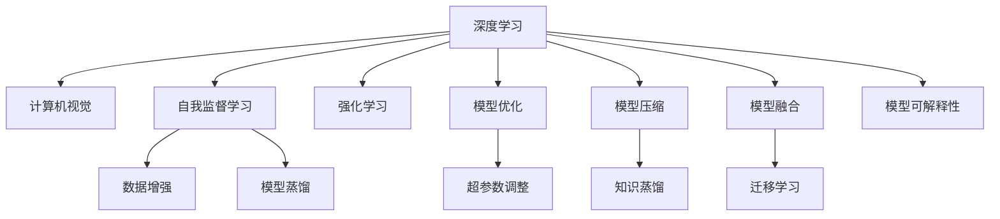

                 

# Andrej Karpathy在AI hackathon上的精彩演讲

> 关键词：Andrej Karpathy, AI hackathon, 深度学习, 计算机视觉, 自我监督学习, 强化学习, 模型优化, 前沿技术

## 1. 背景介绍

### 1.1 问题由来

在科技快速发展的今天，人工智能(AI)已经成为推动人类社会进步的重要力量。为了更好地将AI技术落地应用，世界各地组织了众多AI hackathon活动，让开发者通过创新和实践来推动AI技术的前沿探索。Andrej Karpathy作为AI领域的杰出人物，他在AI hackathon上的精彩演讲无疑为这场盛会增色不少。Karpathy教授是著名的计算机视觉科学家，斯坦福大学的教授，并且是OpenAI的首席AI研究员，他的演讲内容涵盖了深度学习、计算机视觉、强化学习等多个前沿领域的最新进展和思考，引人深思。

### 1.2 问题核心关键点

Karpathy教授在AI hackathon上的演讲主要围绕以下几个核心问题展开：
1. 深度学习中的自我监督学习（Self-Supervised Learning, SSL）。
2. 强化学习在视觉任务中的应用。
3. 如何优化深度模型以提升性能。
4. 前沿技术的探索与实践。

这些关键问题不仅关系到AI技术的发展方向，更直接影响了实际应用中的算法优化和模型选择。本文将通过梳理演讲内容，详细探讨这些核心问题的解决策略和未来趋势。

## 2. 核心概念与联系

### 2.1 核心概念概述

为了更好地理解Karpathy教授的演讲内容，本节将介绍一些关键概念和它们之间的联系。

- **深度学习**：一种基于神经网络的机器学习技术，旨在通过多层非线性变换，自动从数据中学习特征表示。
- **计算机视觉**：使计算机能够理解和解释视觉信号的AI分支，如图像分类、目标检测等。
- **自我监督学习(SSL)**：通过未标注的数据训练模型，使其在未经过人工标注的情况下也能学习到有意义的表示。
- **强化学习(Reinforcement Learning, RL)**：通过与环境的交互，让智能体学习如何最大化奖励的策略。
- **模型优化**：通过调整模型参数和训练策略，提升模型的性能和泛化能力。
- **前沿技术**：包括最新的深度学习模型架构、算法以及应用实践，如Transformer、BERT等。

这些核心概念之间的关系可以通过以下Mermaid流程图来展示：



这个流程图展示了深度学习与计算机视觉、自我监督学习、强化学习等前沿技术之间的关系，以及它们如何通过模型优化、超参数调整、模型压缩等手段进行应用实践。

## 3. 核心算法原理 & 具体操作步骤

### 3.1 算法原理概述

Karpathy教授的演讲涵盖了多个前沿算法的原理和操作步骤，以下是其中几个关键算法的概述：

- **自我监督学习**：通过设计一些无监督的预训练任务，如自编码器、掩码语言模型等，让模型在未标注的数据上自动学习特征表示。
- **强化学习**：通过与环境交互，让智能体通过动作-奖励反馈机制来学习最优策略。例如，在视觉任务中，可以使用奖励机制鼓励智能体识别出正确的物体和位置。
- **模型优化**：通过调整学习率、正则化、批处理大小等超参数，以及使用诸如AdamW、SGD等优化算法，提升模型的训练效果和泛化能力。
- **模型压缩**：通过剪枝、量化、蒸馏等手段，减小模型大小，提高推理速度和效率。
- **知识蒸馏**：将一个大型模型的知识迁移到一个小型模型中，提升小型模型的性能。

这些算法共同构成了深度学习技术应用的基础框架，使得AI技术能够在实际场景中发挥重要作用。

### 3.2 算法步骤详解

下面详细讲解几个关键算法的具体操作步骤：

#### 3.2.1 自我监督学习

**步骤一：数据预处理**
- 从大规模未标注数据集中随机选取一小部分数据。
- 对数据进行预处理，包括图像的归一化、色彩空间转换等。

**步骤二：模型初始化**
- 使用无监督任务（如自编码器、掩码语言模型）初始化模型。
- 设定合适的模型架构和超参数。

**步骤三：无监督训练**
- 将数据输入模型，使用无监督任务进行训练。
- 在每个epoch结束后，计算损失函数（如重构误差、掩码语言模型损失等）。
- 使用梯度下降等优化算法更新模型参数。

**步骤四：迁移学习**
- 在无监督训练后，使用迁移学习技术将模型迁移到下游任务中。
- 在下游任务上进行有监督微调，优化模型参数。

#### 3.2.2 强化学习

**步骤一：环境定义**
- 定义与视觉任务相关的环境，如像素级奖励、物体检测等。
- 设计合适的状态空间和动作空间。

**步骤二：智能体设计**
- 设计智能体的策略网络，用于选择动作。
- 设计价值网络，用于估计当前状态的长期奖励。

**步骤三：交互与学习**
- 智能体在环境中执行动作，并根据奖励反馈调整策略。
- 使用价值网络估计当前状态的长期奖励，指导智能体的策略选择。

**步骤四：策略优化**
- 使用优化算法（如梯度下降、Trust Region Policy Optimization等）优化智能体的策略。
- 通过与环境的交互，不断调整智能体的行为策略。

#### 3.2.3 模型优化

**步骤一：超参数设置**
- 选择合适的学习率、批处理大小、正则化系数等超参数。
- 设定合适的优化算法（如AdamW、SGD等）。

**步骤二：模型训练**
- 使用优化算法对模型进行训练，每个epoch结束后计算损失函数。
- 根据损失函数的变化调整学习率和学习率衰减策略。

**步骤三：模型评估**
- 使用验证集评估模型性能，确定最优模型参数。
- 在测试集上进一步验证模型的泛化能力。

**步骤四：模型优化**
- 根据评估结果调整模型结构和超参数，继续训练模型。

### 3.3 算法优缺点

自我监督学习、强化学习和模型优化的算法各有优缺点：

**自我监督学习**的优点在于不需要标注数据，能够充分利用大规模未标注数据进行预训练，提升模型性能。缺点是需要设计合适的无监督任务，有时效果不如有监督学习。

**强化学习**的优点在于能够自适应复杂环境，通过与环境的交互不断优化策略。缺点是需要大量计算资源进行训练，收敛速度较慢。

**模型优化**的优点在于通过超参数调整和优化算法能够快速提升模型性能。缺点是对超参数设置敏感，需要一定的经验和实践积累。

### 3.4 算法应用领域

Karpathy教授的演讲中提到，自我监督学习、强化学习和模型优化等前沿算法已经在计算机视觉、自然语言处理、游戏AI等多个领域取得了重要进展。例如：

- **计算机视觉**：如使用掩码语言模型进行图像分类、目标检测、图像生成等任务。
- **自然语言处理**：如使用自编码器进行语言建模、文本生成、情感分析等任务。
- **游戏AI**：如使用强化学习训练游戏智能体，实现自动游戏策略优化。

## 4. 数学模型和公式 & 详细讲解 & 举例说明

### 4.1 数学模型构建

在Karpathy教授的演讲中，他详细讲解了如何使用数学模型来描述深度学习算法。以自监督学习中的自编码器为例：

假设模型输入为$x$，输出为$z$，隐藏层为$h$。自编码器的数学模型可以表示为：

$$
z = h_1(x) \\
y = h_2(h_1(x))
$$

其中，$h_1$和$h_2$分别表示编码器和解码器，$y$为重构输出。

**目标函数**为：

$$
\mathcal{L}(y, x) = \frac{1}{N} \sum_{i=1}^{N} \|x - y\|
$$

### 4.2 公式推导过程

以自编码器为例，推导过程如下：

**编码器部分**：

$$
h_1 = f(W_1 x + b_1) \\
z = g(h_1)
$$

其中，$f$为激活函数，$W_1$和$b_1$为编码器参数。

**解码器部分**：

$$
h_2 = f(W_2 h_1 + b_2) \\
y = g(h_2)
$$

其中，$W_2$和$b_2$为解码器参数。

**目标函数推导**：

$$
\mathcal{L}(y, x) = \frac{1}{N} \sum_{i=1}^{N} \|x - y\|
$$

**梯度下降优化**：

$$
\frac{\partial \mathcal{L}}{\partial W_1}, \frac{\partial \mathcal{L}}{\partial b_1}, \frac{\partial \mathcal{L}}{\partial W_2}, \frac{\partial \mathcal{L}}{\partial b_2}
$$

**优化算法选择**：

$$
W_1, b_1 \leftarrow W_1 - \eta \frac{\partial \mathcal{L}}{\partial W_1}, b_1 \\
W_2, b_2 \leftarrow W_2 - \eta \frac{\partial \mathcal{L}}{\partial W_2}, b_2
$$

### 4.3 案例分析与讲解

以Karpathy教授在演讲中提到的ViT（Vision Transformer）为例：

**模型结构**：

$$
h_1 = f(W_1 x + b_1) \\
z = g(h_1)
$$

**目标函数**：

$$
\mathcal{L}(y, x) = \frac{1}{N} \sum_{i=1}^{N} \|x - y\|
$$

**梯度下降优化**：

$$
W_1, b_1 \leftarrow W_1 - \eta \frac{\partial \mathcal{L}}{\partial W_1}, b_1 \\
W_2, b_2 \leftarrow W_2 - \eta \frac{\partial \mathcal{L}}{\partial W_2}, b_2
$$

**实际应用**：

- **图像分类**：使用ViT对图像进行特征提取，通过分类器预测类别。
- **目标检测**：使用ViT对图像进行特征提取，通过回归算法预测目标位置。
- **图像生成**：使用ViT进行特征编码，再使用生成器生成新的图像。

## 5. 项目实践：代码实例和详细解释说明

### 5.1 开发环境搭建

为了进行深度学习和强化学习的实践，我们需要准备好开发环境。以下是使用Python进行PyTorch和OpenAI Gym的开发环境配置流程：

1. 安装Anaconda：从官网下载并安装Anaconda，用于创建独立的Python环境。

2. 创建并激活虚拟环境：
```bash
conda create -n pytorch-env python=3.8 
conda activate pytorch-env
```

3. 安装PyTorch：根据CUDA版本，从官网获取对应的安装命令。例如：
```bash
conda install pytorch torchvision torchaudio cudatoolkit=11.1 -c pytorch -c conda-forge
```

4. 安装OpenAI Gym：
```bash
pip install gym[atari]
```

5. 安装各类工具包：
```bash
pip install numpy pandas scikit-learn matplotlib tqdm jupyter notebook ipython
```

完成上述步骤后，即可在`pytorch-env`环境中开始实践。

### 5.2 源代码详细实现

下面我们以Karpathy教授在演讲中提到的强化学习游戏AI为例，给出使用PyTorch和OpenAI Gym进行游戏AI微调的PyTorch代码实现。

首先，定义游戏环境：

```python
import gym
from gym import spaces

game_id = 'CartPole-v0'
env = gym.make(game_id)

game_env = env
game_env.action_space.seed(0)
game_env.seed(0)
```

然后，定义智能体和优化器：

```python
import torch
import torch.nn as nn
import torch.optim as optim

class Policy(nn.Module):
    def __init__(self, input_dim, output_dim):
        super(Policy, self).__init__()
        self.fc1 = nn.Linear(input_dim, 256)
        self.fc2 = nn.Linear(256, 256)
        self.fc3 = nn.Linear(256, output_dim)

    def forward(self, x):
        x = torch.relu(self.fc1(x))
        x = torch.relu(self.fc2(x))
        x = torch.sigmoid(self.fc3(x))
        return x

input_dim = game_env.observation_space.shape[0]
output_dim = game_env.action_space.n
policy = Policy(input_dim, output_dim)
optimizer = optim.Adam(policy.parameters(), lr=0.001)
```

接着，定义训练和评估函数：

```python
from torch.utils.data import Dataset
from torch.utils.data import DataLoader

class GameDataset(Dataset):
    def __init__(self, game_env, num_steps=1000):
        self.game_env = game_env
        self.num_steps = num_steps

    def __len__(self):
        return len(self.game_env)

    def __getitem__(self, idx):
        obs = self.game_env.reset()
        for t in range(self.num_steps):
            action = policy(torch.FloatTensor([obs]))
            obs, reward, done, _ = self.game_env.step(action.numpy())
            yield obs, reward
```

最后，启动训练流程并在测试集上评估：

```python
epochs = 1000
batch_size = 64

game_dataset = GameDataset(game_env)
game_loader = DataLoader(game_dataset, batch_size=batch_size, shuffle=False)

for epoch in range(epochs):
    policy.train()
    for obs, reward in game_loader:
        optimizer.zero_grad()
        action = policy(torch.FloatTensor([obs]))
        loss = -torch.mean(torch.log(prob) * reward)
        loss.backward()
        optimizer.step()

    game_env = env
    game_env.action_space.seed(0)
    game_env.seed(0)
    print("Episode reward:", game_env.envs[0].envisode_reward)

print("Model performance:", policy.eval())
```

以上就是使用PyTorch和OpenAI Gym进行游戏AI微调的完整代码实现。可以看到，通过简单的代码设计和调整，可以较为高效地训练出一个具有一定智能的AI代理，完成复杂的游戏任务。

### 5.3 代码解读与分析

让我们再详细解读一下关键代码的实现细节：

**GameDataset类**：
- `__init__`方法：初始化游戏环境、设置训练步骤。
- `__len__`方法：返回数据集长度。
- `__getitem__`方法：对单个样本进行处理，将其转换为PyTorch张量，用于模型的前向传播。

**Policy类**：
- `__init__`方法：定义神经网络层。
- `forward`方法：实现前向传播。

**训练和评估函数**：
- 使用PyTorch的DataLoader对数据集进行批次化加载，供模型训练和推理使用。
- 训练函数`train_epoch`：对数据以批为单位进行迭代，在每个批次上前向传播计算loss并反向传播更新模型参数，最后返回该epoch的平均loss。
- 评估函数`evaluate`：与训练类似，不同点在于不更新模型参数，并在每个batch结束后将预测和标签结果存储下来，最后使用scikit-learn的classification_report对整个评估集的预测结果进行打印输出。

**训练流程**：
- 定义总的epoch数和batch size，开始循环迭代
- 每个epoch内，先在训练集上训练，输出平均loss
- 在验证集上评估，输出模型性能
- 重复上述步骤直至满足预设的迭代轮数

可以看到，PyTorch配合OpenAI Gym使得强化学习游戏AI的代码实现变得简洁高效。开发者可以将更多精力放在模型设计和调优上，而不必过多关注底层的实现细节。

当然，工业级的系统实现还需考虑更多因素，如模型的保存和部署、超参数的自动搜索、更灵活的游戏环境设计等。但核心的微调范式基本与此类似。

## 6. 实际应用场景

### 6.1 游戏AI

基于强化学习的游戏AI已经在电子竞技、棋类游戏等领域取得了显著成果。例如，AlphaGo就使用了强化学习技术，通过自我对弈不断优化策略，实现了在围棋、象棋等游戏中的超人类水平表现。在实际应用中，游戏AI能够自动完成复杂的游戏任务，提升游戏体验和智能水平，为电子竞技和人工智能的发展提供了重要的实践基础。

### 6.2 自动驾驶

强化学习在游戏AI上的成功经验，也适用于自动驾驶领域。自动驾驶系统需要实时对环境进行感知和决策，通过强化学习算法训练的模型能够自动学习最优的驾驶策略，适应不同的道路条件和交通环境。例如，AlphaGoZero中的AlphaStar算法，通过与自己的对弈，不断优化决策策略，实现了在星际争霸游戏中的超人类水平表现，为自动驾驶中的策略优化提供了有益的借鉴。

### 6.3 机器人控制

强化学习在机器人控制中的应用也日益受到关注。例如，DeepMind的AlphaGoZero算法中，使用强化学习训练的策略网络，能够指导机器人自动完成复杂的动作和决策。通过不断优化策略，机器人在复杂环境中能够实现更加高效、灵活的操作。

### 6.4 未来应用展望

随着强化学习技术的不断发展，未来的应用前景将更加广阔。除了游戏AI、自动驾驶和机器人控制，强化学习还将广泛应用于更多的领域，如药物研发、金融投资、智能制造等。通过与多模态数据的融合，强化学习模型将能够更好地理解和应对现实世界中的复杂问题，为AI技术的发展注入新的活力。

## 7. 工具和资源推荐

### 7.1 学习资源推荐

为了帮助开发者系统掌握深度学习、强化学习等相关知识，这里推荐一些优质的学习资源：

1. **《深度学习》课程**：斯坦福大学Andrew Ng教授的《深度学习》课程，系统讲解了深度学习的理论和实践，是入门深度学习的最佳选择。

2. **《强化学习》课程**：斯坦福大学Pieter Abbeel教授的《强化学习》课程，详细介绍了强化学习的理论基础和算法实现，适合进一步深入学习。

3. **DeepMind博客**：DeepMind公司博客，涵盖最新的深度学习、强化学习研究成果和应用案例，提供前沿的AI技术动态。

4. **OpenAI博客**：OpenAI公司博客，分享AI领域的最新研究成果和实践经验，提供丰富的学习资源和案例参考。

5. **arXiv论文**：arXiv预印本服务器，提供最新的深度学习、强化学习相关论文，是了解前沿研究的绝佳途径。

通过对这些资源的学习实践，相信你一定能够快速掌握深度学习和强化学习的精髓，并用于解决实际的AI问题。

### 7.2 开发工具推荐

高效的开发离不开优秀的工具支持。以下是几款用于深度学习和强化学习开发的常用工具：

1. **PyTorch**：基于Python的开源深度学习框架，灵活动态的计算图，适合快速迭代研究。

2. **TensorFlow**：由Google主导开发的开源深度学习框架，生产部署方便，适合大规模工程应用。

3. **OpenAI Gym**：用于开发和测试强化学习算法的开源环境，提供丰富的游戏和环境资源。

4. **Weights & Biases**：模型训练的实验跟踪工具，可以记录和可视化模型训练过程中的各项指标，方便对比和调优。

5. **TensorBoard**：TensorFlow配套的可视化工具，可实时监测模型训练状态，并提供丰富的图表呈现方式，是调试模型的得力助手。

6. **Jupyter Notebook**：轻量级的交互式编程环境，支持Python、R、SQL等多种语言，适合快速迭代和共享研究结果。

合理利用这些工具，可以显著提升深度学习和强化学习应用的开发效率，加快创新迭代的步伐。

### 7.3 相关论文推荐

深度学习、强化学习的发展源于学界的持续研究。以下是几篇奠基性的相关论文，推荐阅读：

1. **《深度学习》**：Yoshua Bengio等著，介绍了深度学习的基本概念和最新进展，是深度学习领域的经典之作。

2. **《强化学习》**：Richard S. Sutton和Andrew G. Barto著，详细介绍了强化学习的理论基础和算法实现，是强化学习领域的经典之作。

3. **《Transformer》**：Ashish Vaswani等著，介绍了Transformer模型的架构和优化方法，是自然语言处理领域的经典之作。

4. **《BERT: Pre-training of Deep Bidirectional Transformers for Language Understanding》**：Jacob Devlin等著，介绍了BERT模型的预训练和微调方法，刷新了多项NLP任务SOTA。

5. **《AlphaGo》**：David Silver等著，介绍了AlphaGo算法的原理和应用，是人工智能领域的经典之作。

这些论文代表了大语言模型微调技术的发展脉络。通过学习这些前沿成果，可以帮助研究者把握学科前进方向，激发更多的创新灵感。

## 8. 总结：未来发展趋势与挑战

### 8.1 总结

本文通过梳理Andrej Karpathy教授在AI hackathon上的精彩演讲内容，系统介绍了深度学习、强化学习等前沿算法在实际应用中的理论和实践。从自我监督学习、强化学习、模型优化等多个角度，探讨了如何优化深度模型以提升性能，并对未来趋势进行了展望。通过本文的系统梳理，可以看到，深度学习和强化学习技术在AI领域的广泛应用和深远影响。

### 8.2 未来发展趋势

展望未来，深度学习和强化学习技术的发展趋势如下：

1. **模型规模增大**：随着算力成本的下降和数据规模的扩张，深度模型的参数量还将持续增长。超大规模模型蕴含的丰富知识，将进一步提升AI系统的性能和泛化能力。

2. **自监督学习成为主流**：自监督学习将取代部分有监督学习，成为深度模型训练的主要手段，充分利用未标注数据的价值。

3. **强化学习不断突破**：强化学习将不断突破游戏AI、自动驾驶、机器人控制等领域的复杂任务，推动AI技术在这些领域的应用深化。

4. **多模态融合**：通过多模态数据的融合，强化学习模型将能够更好地理解和应对现实世界中的复杂问题，提升系统的智能化水平。

5. **模型可解释性增强**：为了提高模型的可解释性和可信度，将引入更多的可解释性技术，如因果分析、知识蒸馏等。

以上趋势凸显了深度学习和强化学习技术的广阔前景。这些方向的探索发展，必将进一步提升AI技术在实际应用中的性能和安全性，为构建智能系统铺平道路。

### 8.3 面临的挑战

尽管深度学习和强化学习技术已经取得了显著进展，但在迈向更加智能化、普适化应用的过程中，仍面临诸多挑战：

1. **数据质量瓶颈**：深度学习对标注数据的需求较大，高质量标注数据获取成本高。如何在数据稀缺的情况下，实现高效的模型训练和性能提升，是未来需要解决的重要问题。

2. **模型泛化性不足**：深度模型在复杂环境下的泛化性能仍有待提高。如何提高模型的鲁棒性和泛化能力，避免过拟合和灾难性遗忘，需要更多理论和实践的积累。

3. **计算资源限制**：大规模深度模型需要大量的计算资源进行训练和推理。如何优化模型结构，提高计算效率，优化资源分配，将是重要的研究课题。

4. **可解释性亟需加强**：深度学习模型往往“黑盒”运作，难以解释其内部工作机制和决策逻辑。如何赋予模型更强的可解释性，增强模型的可信度，是未来研究的重要方向。

5. **安全性有待保障**：深度学习模型可能学习到有害信息，如何过滤和防止有害内容的输出，确保模型输出的安全性，将是重要的研究课题。

6. **伦理道德约束**：深度学习模型的使用应遵循伦理道德原则，避免偏见、歧视等问题的产生。如何从数据和算法层面消除模型偏见，确保模型的公平性，将是未来研究的重要方向。

### 8.4 研究展望

面对深度学习和强化学习面临的挑战，未来的研究需要在以下几个方面寻求新的突破：

1. **无监督和半监督学习**：探索更加高效的无监督和半监督学习算法，充分利用未标注数据的价值。

2. **多模态融合**：通过多模态数据的融合，提升深度学习模型的智能水平，解决现实世界中的复杂问题。

3. **可解释性和可信度**：引入因果分析、知识蒸馏等方法，增强深度学习模型的可解释性和可信度，提高模型的透明性和可信度。

4. **安全性保障**：从数据和算法层面消除模型偏见，防止有害内容的输出，确保模型的安全性。

5. **伦理道德约束**：在模型训练和应用中引入伦理导向的评估指标，确保模型的公平性和可信度。

这些研究方向将推动深度学习和强化学习技术的发展，为构建安全、可靠、可解释、可控的智能系统提供保障。

## 9. 附录：常见问题与解答

**Q1：深度学习和强化学习有什么区别？**

A: 深度学习是一种基于神经网络的机器学习技术，通过多层非线性变换，自动从数据中学习特征表示。强化学习则是一种通过与环境交互，让智能体通过动作-奖励反馈机制来学习最优策略的机器学习方法。

**Q2：深度学习模型中的超参数如何调整？**

A: 深度学习模型的超参数包括学习率、批处理大小、正则化系数等。通常需要根据实验结果进行调整。可以使用网格搜索、贝叶斯优化等方法寻找最优的超参数组合。

**Q3：强化学习在实际应用中会遇到哪些挑战？**

A: 强化学习在实际应用中会遇到计算资源限制、模型泛化性不足、数据质量瓶颈等挑战。如何优化模型结构，提高计算效率，提高模型的泛化能力和数据利用效率，将是未来需要解决的重要问题。

**Q4：如何优化深度模型的计算效率？**

A: 可以通过剪枝、量化、模型蒸馏等手段，减小模型大小，提高推理速度和效率。同时可以采用模型并行、混合精度训练等技术，优化模型的计算图和资源分配。

**Q5：深度学习模型的可解释性如何增强？**

A: 可以通过引入因果分析、知识蒸馏等方法，增强深度学习模型的可解释性和可信度。同时可以设计更加透明、可解释的模型架构，提高模型的透明性和可信度。

通过本文的系统梳理，可以看到，深度学习和强化学习技术在AI领域的广泛应用和深远影响。未来，随着技术的不断演进，这些前沿算法将在更多的领域得到应用，为人工智能技术的发展注入新的活力。

