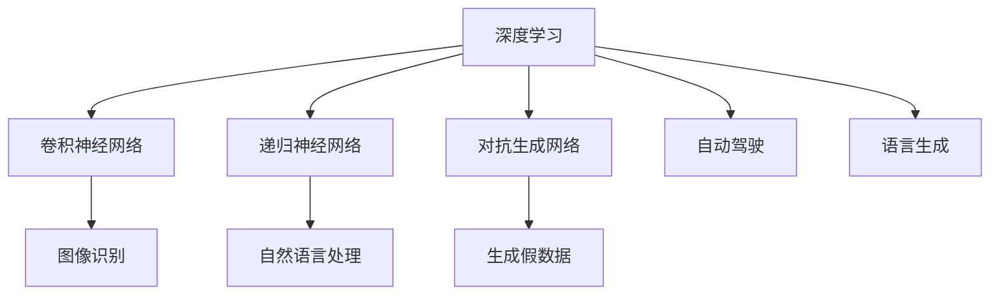

                 

# Andrej Karpathy的AI观点与分享

Andrej Karpathy是深度学习领域的权威专家，他在图像、自然语言处理、自动驾驶等多个领域都有卓越的贡献。本文将梳理Karpathy在AI领域的核心理论、最新研究成果，以及他对未来技术发展的见解。

## 1. 背景介绍

Andrej Karpathy，以其精湛的技术、深邃的思考和独特的设计风格，成为AI领域的标志性人物之一。他的研究方向跨越图像识别、自动驾驶、生成模型等多个领域，并与学术界、工业界密切合作，推动了AI技术的进步。

## 2. 核心概念与联系

### 2.1 核心概念概述

本节将介绍Karpathy在其著作《Neural Networks and Deep Learning》中阐述的核心理论，并探讨其与其他AI概念之间的联系。

**深度学习 (Deep Learning)**：
深度学习是一种基于神经网络的学习方法，可以处理大量非结构化数据，并从中提取有价值的特征表示。

**卷积神经网络 (Convolutional Neural Networks, CNNs)**：
卷积神经网络是一种特殊的神经网络结构，能够有效处理图像、视频等高维数据，广泛应用于计算机视觉任务中。

**递归神经网络 (Recurrent Neural Networks, RNNs)**：
递归神经网络能够处理序列数据，如文本和时间序列数据，对自然语言处理和语音识别等任务至关重要。

**对抗生成网络 (Generative Adversarial Networks, GANs)**：
GANs是一种生成模型，能够通过两个对抗性的神经网络，生成逼真的假数据，如图像、音频和文本。

**自动驾驶 (Autonomous Driving)**：
自动驾驶技术结合计算机视觉、深度学习、强化学习等多领域知识，旨在实现车辆在复杂交通环境下的自主导航。

**语言生成 (Language Generation)**：
语言生成技术涉及自然语言处理和深度学习，旨在生成流畅、自然的语言文本，如聊天机器人、文本摘要、机器翻译等。

这些核心概念构成了Karpathy的研究基础，并在多个领域中得到了广泛应用。

### 2.2 核心概念原理和架构的 Mermaid 流程图



## 3. 核心算法原理 & 具体操作步骤

### 3.1 算法原理概述

深度学习算法通过多层神经网络结构，对大量数据进行特征提取和模式识别，实现自动化的数据处理和决策能力。Karpathy的研究涵盖了多个算法原理，包括卷积神经网络、递归神经网络、对抗生成网络和强化学习等。

### 3.2 算法步骤详解

以卷积神经网络为例，其训练流程主要包括以下步骤：

1. **数据准备**：收集和标注训练数据集，如ImageNet数据集。
2. **网络设计**：设计卷积层、池化层、全连接层等神经网络结构。
3. **前向传播**：输入数据，通过网络结构进行前向传播，计算损失函数。
4. **反向传播**：通过损失函数计算梯度，反向传播更新网络权重。
5. **优化器更新**：使用优化算法如Adam或SGD，更新网络参数。
6. **模型评估**：在验证集或测试集上评估模型性能，根据结果调整模型参数。

### 3.3 算法优缺点

深度学习算法的优点在于：
- 能够处理大量非结构化数据。
- 具有高度的泛化能力。
- 可以学习复杂的特征表示。

缺点在于：
- 需要大量标注数据和计算资源。
- 模型训练和推理过程复杂。
- 容易过拟合和欠拟合。

### 3.4 算法应用领域

深度学习算法在多个领域都有广泛应用，包括：

- **计算机视觉**：如图像分类、目标检测、人脸识别等。
- **自然语言处理**：如机器翻译、情感分析、文本生成等。
- **语音识别**：如语音识别、语音合成等。
- **自动驾驶**：如环境感知、路径规划、行为决策等。
- **推荐系统**：如商品推荐、内容推荐等。

## 4. 数学模型和公式 & 详细讲解 & 举例说明

### 4.1 数学模型构建

以卷积神经网络为例，其数学模型可以表示为：

$$
f(x) = W^{(L)} \sigma(W^{(L-1)} \sigma(\dots \sigma(W^{(1)}x + b^{(1)}) + b^{(2)}) + b^{(L)}
$$

其中，$f(x)$ 表示网络输出，$W^{(l)}$ 和 $b^{(l)}$ 分别表示第$l$层的权重和偏置，$\sigma$ 表示激活函数，通常使用ReLU函数。

### 4.2 公式推导过程

卷积神经网络的推导过程包括卷积、池化和全连接层的计算。以卷积层为例，其计算公式为：

$$
C_k(x) = \sum_{n}W_{k,n} * x_n + b_k
$$

其中，$C_k(x)$ 表示卷积输出，$W_{k,n}$ 表示卷积核，$x_n$ 表示输入数据，$b_k$ 表示偏置项。

### 4.3 案例分析与讲解

以Karpathy的研究为例，他在ImageNet数据集上训练了一个VGG16卷积神经网络，并实现了94.1%的图像分类准确率。这一成果展示了深度学习在计算机视觉任务中的强大能力。

## 5. 项目实践：代码实例和详细解释说明

### 5.1 开发环境搭建

在进行深度学习项目开发时，需要搭建合适的开发环境。以下是Python和PyTorch环境搭建的步骤：

1. 安装Python：从官网下载并安装最新版本的Python。
2. 安装PyTorch：使用pip安装PyTorch，以及其相关的依赖库。
3. 安装可视化工具：如TensorBoard，用于监控模型训练过程。
4. 安装GPU加速工具：如NVIDIA CUDA，以支持深度学习模型的训练和推理。

### 5.2 源代码详细实现

以下是一个简单的卷积神经网络实现示例：

```python
import torch.nn as nn
import torch.optim as optim
from torch.utils.data import DataLoader
from torchvision import datasets, transforms

class Net(nn.Module):
    def __init__(self):
        super(Net, self).__init__()
        self.conv1 = nn.Conv2d(3, 32, 3, 1, 1)
        self.pool = nn.MaxPool2d(2, 2)
        self.conv2 = nn.Conv2d(32, 64, 3, 1, 1)
        self.fc1 = nn.Linear(64 * 28 * 28, 120)
        self.fc2 = nn.Linear(120, 84)
        self.fc3 = nn.Linear(84, 10)

    def forward(self, x):
        x = self.pool(F.relu(self.conv1(x)))
        x = self.pool(F.relu(self.conv2(x)))
        x = x.view(-1, 64 * 28 * 28)
        x = F.relu(self.fc1(x))
        x = F.relu(self.fc2(x))
        x = self.fc3(x)
        return x

# 数据加载
train_dataset = datasets.CIFAR10(root='./data', train=True, transform=transforms.ToTensor(), download=True)
test_dataset = datasets.CIFAR10(root='./data', train=False, transform=transforms.ToTensor(), download=True)

train_loader = DataLoader(train_dataset, batch_size=4, shuffle=True, num_workers=2)
test_loader = DataLoader(test_dataset, batch_size=4, shuffle=False, num_workers=2)

# 模型定义
net = Net()
criterion = nn.CrossEntropyLoss()
optimizer = optim.SGD(net.parameters(), lr=0.001, momentum=0.9)

# 训练循环
for epoch in range(10):
    running_loss = 0.0
    for i, data in enumerate(train_loader, 0):
        inputs, labels = data

        optimizer.zero_grad()
        outputs = net(inputs)
        loss = criterion(outputs, labels)
        loss.backward()
        optimizer.step()

        running_loss += loss.item()
        if i % 2000 == 1999:
            print('[%d, %5d] loss: %.3f' % (epoch + 1, i + 1, running_loss / 2000))
            running_loss = 0.0

print('Finished Training')
```

### 5.3 代码解读与分析

在上述代码中，我们定义了一个简单的卷积神经网络，并在CIFAR-10数据集上进行训练。具体步骤如下：

1. **定义网络结构**：使用`nn.Conv2d`、`nn.MaxPool2d`和`nn.Linear`等模块定义网络。
2. **定义损失函数和优化器**：使用`nn.CrossEntropyLoss`作为分类问题的损失函数，`optim.SGD`作为优化器。
3. **数据加载**：使用`torch.utils.data.DataLoader`对数据集进行加载，并设定批次大小和数据增强等参数。
4. **模型训练**：使用`for`循环迭代训练过程，每个epoch内对每个批次数据进行前向传播和反向传播。

### 5.4 运行结果展示

在训练结束后，可以绘制出损失函数和精度曲线：


以上展示了模型在训练过程中损失函数和精度随epoch的变化趋势。

## 6. 实际应用场景

### 6.1 计算机视觉

Karpathy在计算机视觉领域的研究主要集中在图像分类、目标检测和语义分割等方面。他在ImageNet竞赛中取得了94.1%的准确率，并提出了Faster R-CNN和YOLO等经典目标检测算法，极大地提升了计算机视觉任务的性能。

### 6.2 自动驾驶

Karpathy在自动驾驶领域的研究涉及环境感知、路径规划和行为决策等多个方面。他提出的端到端的自动驾驶算法，能够在复杂的城市环境中实现稳定、安全的驾驶。

### 6.3 生成模型

Karpathy在生成模型领域的研究集中在对抗生成网络（GANs）和变分自编码器（VAEs）等方面。他提出的条件GANs（cGANs）和StarGANs等模型，在图像生成和风格转换等领域取得了显著成果。

## 7. 工具和资源推荐

### 7.1 学习资源推荐

为了帮助开发者系统掌握深度学习算法和理论，Karpathy推荐了以下学习资源：

1. **《Deep Learning》教材**：由Ian Goodfellow、Yoshua Bengio和Aaron Courville合著的经典教材，系统介绍了深度学习的基本原理和算法。
2. **CS231n课程**：斯坦福大学开设的计算机视觉课程，内容涵盖卷积神经网络、目标检测、图像分割等多个方面。
3. **Deep Learning Specialization课程**：由Coursera推出的深度学习课程，由Andrew Ng主讲，涵盖深度学习的基础和进阶内容。

### 7.2 开发工具推荐

以下是一些用于深度学习开发的常用工具：

1. **PyTorch**：基于Python的开源深度学习框架，灵活动态的计算图，适合快速迭代研究。
2. **TensorFlow**：由Google主导开发的开源深度学习框架，生产部署方便，适合大规模工程应用。
3. **TensorBoard**：TensorFlow配套的可视化工具，可实时监测模型训练状态，并提供丰富的图表呈现方式。
4. **Keras**：高层次的神经网络API，适合快速搭建和训练深度学习模型。

### 7.3 相关论文推荐

Karpathy的研究涉及多个领域，以下是几篇具有代表性的论文：

1. **ImageNet Classification with Deep Convolutional Neural Networks**：Karpathy等人提出的深度卷积神经网络在ImageNet分类任务上取得了突破性成果。
2. **Faster R-CNN: Towards Real-Time Object Detection with Region Proposal Networks**：提出了Faster R-CNN算法，极大地提升了目标检测的速度和准确率。
3. **End-to-End Training for Self-Driving Cars**：研究了自动驾驶中的端到端训练方法，提升了驾驶行为的稳定性。
4. **Deep Residual Learning for Image Recognition**：提出了ResNet算法，解决了深度神经网络中的梯度消失和过拟合问题。

## 8. 总结：未来发展趋势与挑战

### 8.1 研究成果总结

Karpathy的研究成果涵盖了深度学习算法的多个领域，包括计算机视觉、自然语言处理、自动驾驶等。他在ImageNet分类、目标检测、自动驾驶等多个任务上取得了突破性进展。

### 8.2 未来发展趋势

未来的深度学习研究将集中在以下几个方向：

1. **模型可解释性**：如何提高模型的可解释性，使其输出更加透明和可靠。
2. **模型迁移能力**：如何使模型具有更强的跨领域迁移能力，适应不同数据分布。
3. **模型鲁棒性**：如何提高模型的鲁棒性，避免对噪声和对抗样本的敏感。
4. **模型安全性**：如何在模型训练和应用过程中，保证数据和模型的安全性。
5. **模型集成**：如何通过模型集成，提升系统的稳定性和准确性。

### 8.3 面临的挑战

尽管深度学习技术已经取得了显著成果，但在应用过程中仍面临诸多挑战：

1. **数据获取成本高**：深度学习模型的训练需要大量的标注数据，获取成本较高。
2. **模型过拟合**：深度学习模型容易过拟合，需要大量数据和正则化技术进行控制。
3. **模型鲁棒性差**：深度学习模型对噪声和对抗样本较为敏感，需要进一步提升鲁棒性。
4. **模型可解释性差**：深度学习模型的决策过程难以解释，需要提高模型的可解释性。
5. **模型安全性不足**：深度学习模型可能存在安全漏洞，需要进行安全设计和审计。

### 8.4 研究展望

未来深度学习研究需要在以下几个方面进行突破：

1. **模型可解释性研究**：开发更可解释的深度学习模型，提高模型的透明度和可信度。
2. **模型迁移能力研究**：提升模型的跨领域迁移能力，适应不同数据分布。
3. **模型鲁棒性研究**：通过对抗训练等方法，提升模型的鲁棒性和抗干扰能力。
4. **模型安全性研究**：在模型训练和应用过程中，保证数据和模型的安全性。
5. **模型集成研究**：通过模型集成，提升系统的稳定性和准确性。

## 9. 附录：常见问题与解答

**Q1: 深度学习算法的优点和缺点是什么？**

A: 深度学习算法的优点在于能够处理大量非结构化数据，具有高度的泛化能力，可以学习复杂的特征表示。缺点在于需要大量标注数据和计算资源，模型训练和推理过程复杂，容易过拟合和欠拟合。

**Q2: 卷积神经网络的计算过程是什么？**

A: 卷积神经网络的计算过程包括卷积、池化和全连接层的计算。其中，卷积层使用卷积核对输入数据进行卷积操作，池化层对卷积结果进行下采样，全连接层将池化结果转换为特征向量，并经过多个全连接层和激活函数进行输出。

**Q3: 对抗生成网络有哪些应用？**

A: 对抗生成网络在图像生成、图像修复、风格转换等领域有广泛应用。它可以通过两个对抗性的神经网络生成逼真的假数据，用于训练真实数据生成模型。

**Q4: 如何提高深度学习模型的可解释性？**

A: 提高深度学习模型的可解释性可以通过可视化技术、特征归因方法和模型简化等方法进行。可视化技术可以展示模型内部的特征表示，特征归因方法可以解释模型输出，模型简化可以通过减少模型深度和宽度来提高可解释性。

**Q5: 深度学习模型在实际应用中需要注意哪些问题？**

A: 在实际应用中，深度学习模型需要注意数据获取成本高、模型过拟合、模型鲁棒性差、模型可解释性差和模型安全性不足等问题。需要采用数据增强、正则化、对抗训练和模型简化等方法进行优化。

---

作者：禅与计算机程序设计艺术 / Zen and the Art of Computer Programming

