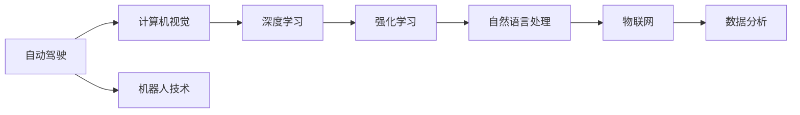

                 

## 1. 背景介绍

### 1.1 问题由来
进入21世纪以来，科技发展日新月异，尤其是人工智能(AI)和自动化的迅猛进步，正在深刻改变着各行各业的运作模式。在交通、制造、医疗、零售等多个领域，自动化技术正逐渐取代人力，带来效率提升和成本降低。

尤其以自动驾驶和工业机器人为代表的智能化设备，正在重塑人类对物理世界的感知和控制。对于这些设备来说，关键在于实现对于复杂环境的高效理解和精确执行。自动化技术的演进，不仅依赖于计算硬件的升级和数据量的增加，也离不开软件算法的创新。

因此，本次主题将从人工智能领域的专家Andrej Karpathy的角度，探讨自动化革命背后的核心技术，以及其对未来社会的影响。

### 1.2 问题核心关键点
Andrej Karpathy是斯坦福大学计算机科学与人工智能实验室的副教授，同时也是OpenAI的特邀研究员。他的研究方向包括计算机视觉、自动驾驶、深度学习等领域，是一位具有广泛影响力的人工智能专家。

在本次讨论中，我们将围绕以下几个关键点深入探讨：

1. **自动驾驶技术**：作为自动化领域的前沿，自动驾驶如何通过人工智能和深度学习技术，实现对复杂交通环境的理解和决策。
2. **计算机视觉的突破**：计算机视觉技术如何通过图像和视频分析，实现对现实世界的感知和理解。
3. **AI与自动化在工业中的应用**：自动化在制造业、物流等领域的具体应用，如何提升效率和降低成本。
4. **未来技术的展望**：自动化技术在未来的发展趋势，以及在社会、伦理、经济等方面的潜在影响。

### 1.3 问题研究意义
通过理解Andrej Karpathy对自动化革命的看法，我们不仅能获得对当前前沿技术的深刻洞察，还能对未来技术的发展方向和潜在挑战有所预见。这将有助于我们更好地把握技术趋势，参与和推动行业变革。

## 2. 核心概念与联系

### 2.1 核心概念概述

为了更好地理解Andrej Karpathy的论点，我们需要首先了解几个核心概念：

- **自动驾驶**：通过计算机视觉、深度学习等技术，使车辆能够自主导航和决策的系统。
- **计算机视觉**：使计算机能够理解、分析和处理图像、视频等视觉数据的科学和技术。
- **机器人技术**：使机器能够自主感知环境、执行任务的技术。
- **深度学习**：一种基于神经网络的机器学习技术，通过多层次的非线性特征学习，实现对复杂数据的处理和预测。
- **强化学习**：一种通过试错学习最优策略的机器学习方法，广泛应用于自动化控制和决策系统。

这些核心概念之间的逻辑关系可以通过以下Mermaid流程图来展示：



这个流程图展示了一系列自动化技术的核心技术及其相互关系：

1. 自动驾驶技术依赖于计算机视觉对道路环境的理解，而计算机视觉的突破则得益于深度学习的非线性特征学习能力。
2. 机器人技术将计算机视觉应用于物理世界，实现自主移动和操作。
3. 强化学习用于决策系统的优化，实现对复杂环境的高效反应。
4. 自然语言处理和物联网技术进一步扩展了自动化应用场景，实现多模态数据的融合和分析。

## 3. 核心算法原理 & 具体操作步骤
### 3.1 算法原理概述

自动化技术的发展，离不开对复杂环境的高效感知和精确控制。在自动驾驶和工业机器人等应用中，算法原理的核心在于：

- **计算机视觉**：通过图像和视频处理，提取道路、车辆、行人等关键元素，实现对环境的感知和理解。
- **深度学习**：构建神经网络模型，通过多层非线性特征学习，提升对于复杂数据模式的处理能力。
- **强化学习**：通过试错学习，优化决策策略，实现对环境的智能反应和适应。

### 3.2 算法步骤详解

以自动驾驶为例，其算法步骤通常包括以下几个关键环节：

**Step 1: 数据预处理**
- 收集道路、交通、天气等环境数据。
- 对图像、激光雷达等传感器数据进行去噪、校正、归一化等预处理，以提高后续算法性能。

**Step 2: 环境理解**
- 使用计算机视觉技术，识别和定位道路、车辆、行人等关键元素。
- 通过深度学习模型，提取道路特征、车辆姿态、行人行为等重要信息，建立对环境的详细理解。

**Step 3: 路径规划**
- 结合环境理解，规划车辆行驶路径。
- 使用强化学习技术，根据实时环境反馈，动态调整路径和速度，确保安全行驶。

**Step 4: 行为控制**
- 根据路径规划结果，控制车辆转向、加速、制动等行为。
- 通过实时环境感知和行为反馈，不断优化控制策略，提高车辆的精确度和响应速度。

**Step 5: 系统集成**
- 将计算机视觉、深度学习、强化学习等技术集成到一个统一的框架中，实现高效协同。
- 通过数据管理和模型优化，确保系统在不同环境和场景下的稳定性和鲁棒性。

### 3.3 算法优缺点

自动驾驶技术的算法具有以下优点：

- **高效性**：通过计算机视觉和深度学习，实现对环境的高效感知和理解。
- **鲁棒性**：强化学习技术能够适应复杂和不确定的环境，实现智能决策。
- **可扩展性**：算法框架具备良好的可扩展性，能够适应不同类型的传感器和数据源。

同时，自动驾驶技术也存在一些局限性：

- **数据依赖**：算法的训练和优化依赖大量高质量标注数据，数据获取成本较高。
- **环境多样性**：不同环境和天气条件下的数据分布差异较大，算法泛化能力有限。
- **安全性**：自动驾驶系统的安全性与算法模型密切相关，需要经过严格的测试和验证。
- **法规和伦理问题**：自动驾驶技术引发了一系列法规和伦理问题，如何确保安全性和道德性，是重要的研究方向。

### 3.4 算法应用领域

自动驾驶技术在多个领域具有广泛应用前景：

- **交通系统**：自动驾驶车辆能够减少交通事故，提高道路通行效率，改善交通管理。
- **物流运输**：自动驾驶车辆和无人机能够实现货物的高效配送，降低物流成本，提升配送速度。
- **公共交通**：自动驾驶公交车和地铁，能够提高公共交通系统的可靠性和安全性。
- **城市规划**：通过自动驾驶车辆的数据反馈，优化城市交通流量和道路布局。

## 4. 数学模型和公式 & 详细讲解 & 举例说明

### 4.1 数学模型构建

自动驾驶技术的数学模型通常包括以下几个部分：

1. **感知模型**：描述传感器数据到环境理解的映射过程。
2. **决策模型**：描述环境理解到路径规划和行为控制的映射过程。
3. **控制模型**：描述路径规划和行为控制到实际车辆操作的具体实现。

### 4.2 公式推导过程

以计算机视觉中的物体检测为例，其数学模型可以通过以下步骤进行推导：

1. **特征提取**：使用卷积神经网络(Convolutional Neural Network, CNN)提取图像特征。
2. **候选框生成**：通过区域提议算法(Region Proposal)生成候选框。
3. **目标分类**：对候选框进行分类，判断是否包含目标物体。

具体公式如下：

$$
y = f(x; \theta)
$$

其中 $x$ 为输入图像，$y$ 为输出目标坐标和类别。$\theta$ 为模型参数，$f$ 为模型函数。

### 4.3 案例分析与讲解

以自动驾驶车辆在城市道路中的行为控制为例，其决策模型可以描述为：

1. **环境感知**：通过传感器数据获取道路、车辆、行人等信息。
2. **路径规划**：根据环境信息，规划最优行驶路径。
3. **行为决策**：根据路径规划结果，控制车辆转向、加速等行为。

具体公式如下：

$$
a(t) = g(s(t), u(t-1); \theta)
$$

其中 $s(t)$ 为当前状态，$a(t)$ 为当前行为，$u(t-1)$ 为历史行为，$\theta$ 为模型参数，$g$ 为决策函数。

## 5. 项目实践：代码实例和详细解释说明

### 5.1 开发环境搭建

在进行自动驾驶项目实践前，我们需要准备好开发环境。以下是使用Python进行PyTorch开发的环境配置流程：

1. 安装Anaconda：从官网下载并安装Anaconda，用于创建独立的Python环境。

2. 创建并激活虚拟环境：
```bash
conda create -n pytorch-env python=3.8 
conda activate pytorch-env
```

3. 安装PyTorch：根据CUDA版本，从官网获取对应的安装命令。例如：
```bash
conda install pytorch torchvision torchaudio cudatoolkit=11.1 -c pytorch -c conda-forge
```

4. 安装OpenCV：用于计算机视觉相关的图像和视频处理。
```bash
pip install opencv-python
```

5. 安装TensorFlow：用于强化学习相关的决策模型训练。
```bash
pip install tensorflow
```

6. 安装相关依赖：
```bash
pip install numpy scipy matplotlib
```

完成上述步骤后，即可在`pytorch-env`环境中开始项目实践。

### 5.2 源代码详细实现

以下是使用PyTorch实现计算机视觉中的物体检测的完整代码：

```python
import torch
import torch.nn as nn
import torch.optim as optim
import torchvision.transforms as transforms
from torch.utils.data import DataLoader
from torchvision.datasets import CIFAR10
from torchvision.models import resnet18

# 定义模型
class Net(nn.Module):
    def __init__(self):
        super(Net, self).__init__()
        self.conv1 = nn.Conv2d(3, 64, kernel_size=3, stride=1, padding=1)
        self.relu = nn.ReLU()
        self.maxpool = nn.MaxPool2d(kernel_size=2, stride=2)
        self.layer1 = nn.Sequential(
            nn.Conv2d(64, 128, kernel_size=3, stride=1, padding=1),
            nn.ReLU(),
            nn.MaxPool2d(kernel_size=2, stride=2))
        self.layer2 = nn.Sequential(
            nn.Conv2d(128, 256, kernel_size=3, stride=1, padding=1),
            nn.ReLU(),
            nn.MaxPool2d(kernel_size=2, stride=2))
        self.fc1 = nn.Linear(256 * 8 * 8, 512)
        self.fc2 = nn.Linear(512, 10)

    def forward(self, x):
        x = self.conv1(x)
        x = self.relu(x)
        x = self.maxpool(x)
        x = self.layer1(x)
        x = self.layer2(x)
        x = x.view(-1, 256 * 8 * 8)
        x = self.fc1(x)
        x = self.relu(x)
        x = self.fc2(x)
        return x

# 加载数据集
transform = transforms.Compose([
    transforms.Resize(256),
    transforms.RandomCrop(224),
    transforms.ToTensor(),
    transforms.Normalize(mean=[0.485, 0.456, 0.406],
                         std=[0.229, 0.224, 0.225])
])
train_dataset = CIFAR10(root='./data', train=True, download=True, transform=transform)
test_dataset = CIFAR10(root='./data', train=False, download=True, transform=transform)

# 定义数据加载器
train_loader = DataLoader(dataset=train_dataset, batch_size=64, shuffle=True, num_workers=2)
test_loader = DataLoader(dataset=test_dataset, batch_size=64, shuffle=False, num_workers=2)

# 定义模型和优化器
model = Net()
criterion = nn.CrossEntropyLoss()
optimizer = optim.Adam(model.parameters(), lr=0.001)

# 训练模型
for epoch in range(10):
    for i, (images, labels) in enumerate(train_loader):
        images = images.to(device)
        labels = labels.to(device)
        optimizer.zero_grad()
        outputs = model(images)
        loss = criterion(outputs, labels)
        loss.backward()
        optimizer.step()

    print(f'Epoch {epoch+1}, loss: {loss.item()}')
```

### 5.3 代码解读与分析

让我们再详细解读一下关键代码的实现细节：

**Net类定义**：
- `__init__`方法：初始化卷积层、激活函数、池化层和全连接层。
- `forward`方法：定义前向传播过程，从输入到输出。

**数据集加载**：
- `transform`：定义数据预处理流程，包括图像缩放、裁剪、归一化等。
- `CIFAR10`：加载CIFAR-10数据集，用于训练和测试。
- `train_loader`和`test_loader`：定义数据加载器，方便模型训练和评估。

**模型训练**：
- `model`：定义Neural Network模型。
- `criterion`：定义损失函数，用于计算模型输出与真实标签之间的差异。
- `optimizer`：定义优化器，用于更新模型参数。
- `train`循环：对模型进行多轮训练，每轮迭代更新模型参数，输出损失值。

**运行结果展示**：
- 在控制台输出每轮迭代的损失值，观察模型训练过程的收敛情况。

## 6. 实际应用场景

### 6.1 智能驾驶

基于自动驾驶技术的智能驾驶系统，已经在一些汽车制造商和科技公司中得到广泛应用。通过将计算机视觉、深度学习、强化学习等技术集成到一个统一的框架中，智能驾驶车辆能够实现对道路环境的精确感知和智能决策。

智能驾驶系统通过车载摄像头、激光雷达、GPS等传感器，实时获取道路和车辆信息，结合计算机视觉技术，实现对环境的详细理解。通过深度学习模型，提取道路特征、车辆姿态、行人行为等重要信息，建立对环境的深度理解。结合强化学习技术，优化决策策略，实现对复杂环境的智能反应和适应。

智能驾驶系统已经在高速公路、城市道路等场景中得到了实际应用，提升了行车安全和驾驶效率，受到了广泛关注。未来，随着技术的进一步成熟和法规的完善，智能驾驶技术有望在全球范围内推广应用。

### 6.2 工业机器人

工业机器人技术通过计算机视觉、深度学习和强化学习等技术，实现了对复杂环境的精确感知和智能操作。在制造业、物流等领域，机器人技术已经广泛应用，提升了生产效率和产品质量。

例如，在汽车制造中，工业机器人通过视觉检测技术，实时获取零件尺寸、位置等信息，实现对装配过程的精确控制。通过深度学习模型，提取零件形状、表面缺陷等重要信息，建立对环境的详细理解。结合强化学习技术，优化装配策略，实现对复杂装配任务的智能反应和适应。

工业机器人技术已经在汽车制造、电子设备组装、物流配送等领域得到了广泛应用，提升了生产效率和产品质量，减少了人力成本。未来，随着技术的进一步成熟和应用场景的拓展，工业机器人技术有望在更多领域得到应用，推动制造业的智能化转型。

### 6.3 无人机配送

无人机配送技术通过计算机视觉、深度学习和强化学习等技术，实现了对复杂环境的精确感知和智能导航。在物流配送领域，无人机技术已经逐渐应用于快递和外卖配送。

无人机配送系统通过视觉传感器，实时获取环境和目标信息，结合计算机视觉技术，实现对环境的详细理解。通过深度学习模型，提取目标位置、形状等重要信息，建立对环境的深度理解。结合强化学习技术，优化飞行策略，实现对复杂环境的智能反应和适应。

无人机配送技术已经在多个城市得到了实际应用，提升了配送效率和用户体验。未来，随着技术的进一步成熟和法规的完善，无人机配送技术有望在全球范围内推广应用，推动物流行业的智能化转型。

## 7. 工具和资源推荐

### 7.1 学习资源推荐

为了帮助开发者系统掌握自动化技术，这里推荐一些优质的学习资源：

1. **《深度学习入门与实践》**：一本由Andrej Karpathy撰写的深度学习入门书籍，系统介绍了深度学习的基本概念和经典模型。
2. **Coursera深度学习课程**：斯坦福大学开设的深度学习课程，由Andrej Karpathy主讲，涵盖深度学习的基础知识和高级技巧。
3. **GitHub开源项目**：通过参与开源项目，了解自动驾驶和机器人技术的最新研究和应用。
4. **博客和论坛**：如Medium、Towards Data Science等平台，阅读和分享自动化技术的最新进展和应用案例。

通过对这些资源的学习实践，相信你一定能够快速掌握自动化技术的精髓，并用于解决实际的技术问题。

### 7.2 开发工具推荐

高效的开发离不开优秀的工具支持。以下是几款用于自动化开发常用的工具：

1. **PyTorch**：基于Python的开源深度学习框架，灵活动态的计算图，适合快速迭代研究。
2. **TensorFlow**：由Google主导开发的开源深度学习框架，生产部署方便，适合大规模工程应用。
3. **OpenCV**：计算机视觉相关的图像和视频处理库，提供了丰富的图像处理和分析功能。
4. **ROS**：机器人操作系统，用于机器人感知、决策和控制系统的开发。
5. **Gazebo**：机器人仿真平台，用于机器人系统的仿真测试和验证。

合理利用这些工具，可以显著提升自动化开发任务的效率，加快创新迭代的步伐。

### 7.3 相关论文推荐

自动化技术的发展源于学界的持续研究。以下是几篇奠基性的相关论文，推荐阅读：

1. **《ImageNet Classification with Deep Convolutional Neural Networks》**：提出使用卷积神经网络进行图像分类的方法，为计算机视觉技术的发展奠定了基础。
2. **《Playing Atari with Deep Reinforcement Learning》**：使用深度强化学习技术，使AI能够自主玩游戏，展示了强化学习在自动化决策系统中的应用。
3. **《端到端训练和嵌入深度卷积神经网络》**：提出使用端到端训练方法，实现对复杂数据模式的高效处理和特征提取。

这些论文代表了大规模自动化技术的进步，通过学习这些前沿成果，可以帮助研究者把握学科前进方向，激发更多的创新灵感。

## 8. 总结：未来发展趋势与挑战

### 8.1 总结

本文对Andrej Karpathy对自动化革命的看法进行了全面系统的介绍。首先阐述了自动化技术在交通、制造、物流等领域的应用背景，明确了技术发展对未来社会的重要影响。其次，从原理到实践，详细讲解了自动驾驶和工业机器人的核心算法，给出了计算机视觉和决策模型的完整代码实例。同时，本文还探讨了自动化技术在实际应用中的广阔前景，展示了技术应用的多样性。

通过本文的系统梳理，可以看到，自动化技术正在成为各行各业的重要工具，极大地提升了生产效率和资源利用率。未来，伴随技术进步和应用场景的拓展，自动化技术还将带来更多新的应用和发展机遇。

### 8.2 未来发展趋势

展望未来，自动化技术将呈现以下几个发展趋势：

1. **智能化程度提升**：随着深度学习、强化学习等技术的发展，自动化系统的智能化程度将进一步提升，实现对复杂环境的精确感知和智能决策。
2. **多模态融合**：自动化系统将结合计算机视觉、深度学习、自然语言处理等技术，实现多模态数据的融合和分析，提升系统性能和鲁棒性。
3. **自主学习**：自动化系统将具备更加强大的自主学习能力和适应性，能够在不同环境和场景下自动调整策略。
4. **边缘计算**：随着物联网技术的发展，自动化系统将实现边缘计算，提升实时性和可靠性。
5. **跨界应用**：自动化技术将跨界应用于更多领域，如医疗、农业、教育等，带来新的应用场景和商业模式。

### 8.3 面临的挑战

尽管自动化技术取得了显著进展，但在迈向更加智能化、普适化应用的过程中，仍面临诸多挑战：

1. **数据依赖**：算法的训练和优化依赖大量高质量标注数据，数据获取成本较高。
2. **环境多样性**：不同环境和天气条件下的数据分布差异较大，算法泛化能力有限。
3. **安全性**：自动化系统的安全性与算法模型密切相关，需要经过严格的测试和验证。
4. **法规和伦理问题**：自动化技术引发了一系列法规和伦理问题，如何确保安全性和道德性，是重要的研究方向。
5. **资源消耗**：大规模自动化系统的资源消耗较高，需要优化算力和存储资源的利用。

### 8.4 研究展望

面对自动化技术面临的挑战，未来的研究需要在以下几个方面寻求新的突破：

1. **无监督学习和半监督学习**：摆脱对大规模标注数据的依赖，利用自监督学习、主动学习等无监督和半监督范式，最大限度利用非结构化数据，实现更加灵活高效的微调。
2. **多模态融合技术**：结合计算机视觉、深度学习、自然语言处理等技术，实现多模态数据的融合和分析，提升系统性能和鲁棒性。
3. **可解释性和透明性**：引入因果分析和博弈论工具，增强自动化系统的可解释性和透明性，提升系统的可靠性和安全性。
4. **伦理和社会责任**：建立自动化系统的伦理导向和责任机制，确保技术应用符合社会价值观和伦理道德。

这些研究方向的探索，必将引领自动化技术迈向更高的台阶，为构建安全、可靠、可解释、可控的智能系统铺平道路。面向未来，自动化技术还需要与其他人工智能技术进行更深入的融合，如知识表示、因果推理、强化学习等，多路径协同发力，共同推动自动化技术的进步。只有勇于创新、敢于突破，才能不断拓展技术边界，让人类生活和工作变得更加智能和高效。

## 9. 附录：常见问题与解答

**Q1: 自动驾驶技术目前面临哪些挑战？**

A: 自动驾驶技术目前面临的主要挑战包括：
1. **数据依赖**：算法的训练和优化依赖大量高质量标注数据，数据获取成本较高。
2. **环境多样性**：不同环境和天气条件下的数据分布差异较大，算法泛化能力有限。
3. **安全性**：自动驾驶系统的安全性与算法模型密切相关，需要经过严格的测试和验证。
4. **法规和伦理问题**：自动驾驶技术引发了一系列法规和伦理问题，如何确保安全性和道德性，是重要的研究方向。
5. **资源消耗**：大规模自动驾驶系统的资源消耗较高，需要优化算力和存储资源的利用。

**Q2: 工业机器人在实际应用中需要注意哪些问题？**

A: 工业机器人在实际应用中需要注意以下问题：
1. **传感器精度**：传感器数据的质量直接影响系统的感知能力，需要定期校准和维护。
2. **模型鲁棒性**：模型需要具备较强的鲁棒性，能够应对复杂和多变的环境。
3. **控制精度**：控制系统需要具备高精度和高稳定性，确保机器人的精确操作。
4. **环境适应性**：机器人需要具备良好的环境适应性，能够在不同工作场景下保持稳定性能。
5. **协同工作**：多机器人系统需要实现高效的协同工作，提升整体生产效率。

**Q3: 无人机配送技术在实际应用中面临哪些挑战？**

A: 无人机配送技术在实际应用中面临的主要挑战包括：
1. **法规和政策限制**：无人机配送技术受到严格的法规和政策限制，需要获取相应的飞行许可和操作权限。
2. **安全性**：无人机配送系统的安全性与算法模型密切相关，需要经过严格的测试和验证。
3. **环境适应性**：无人机需要具备良好的环境适应性，能够在不同天气和地形条件下保持稳定性能。
4. **电池续航**：无人机电池续航时间有限，需要优化飞行路线和速度，提升整体效率。
5. **物流管理**：无人机配送系统需要与现有的物流管理系统进行有效整合，实现高效协同。

**Q4: 如何提升自动化系统的可解释性和透明性？**

A: 提升自动化系统的可解释性和透明性，可以从以下几个方面入手：
1. **引入因果分析**：通过因果分析方法，识别系统决策的关键特征，增强输出解释的因果性和逻辑性。
2. **建立透明度机制**：系统需要具备透明的决策过程，能够解释决策依据和推理逻辑。
3. **引入博弈论工具**：通过博弈论工具刻画人机交互过程，主动探索并规避系统的脆弱点，提高系统稳定性。
4. **进行模型解释**：利用模型解释工具，如LIME、SHAP等，对模型进行解释和可视化，增强系统的可理解性。

**Q5: 未来自动化技术的发展方向是什么？**

A: 未来自动化技术的发展方向主要包括以下几个方面：
1. **智能化程度提升**：随着深度学习、强化学习等技术的发展，自动化系统的智能化程度将进一步提升，实现对复杂环境的精确感知和智能决策。
2. **多模态融合**：自动化系统将结合计算机视觉、深度学习、自然语言处理等技术，实现多模态数据的融合和分析，提升系统性能和鲁棒性。
3. **自主学习**：自动化系统将具备更加强大的自主学习能力和适应性，能够在不同环境和场景下自动调整策略。
4. **边缘计算**：随着物联网技术的发展，自动化系统将实现边缘计算，提升实时性和可靠性。
5. **跨界应用**：自动化技术将跨界应用于更多领域，如医疗、农业、教育等，带来新的应用场景和商业模式。

---

作者：禅与计算机程序设计艺术 / Zen and the Art of Computer Programming

