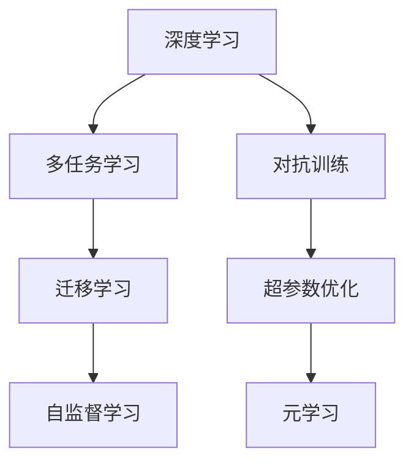

                 

## 1. 背景介绍

安德里·卡尔帕西（Andrej Karpathy），一位来自斯坦福大学的计算机视觉和深度学习专家，是卷积神经网络（CNN）领域的先驱，因对自动驾驶汽车的深度学习研究而闻名。卡尔帕西对人工智能的未来发展持有独到的见解，他认为当前AI技术的突破主要来自于深度学习和多任务学习，然而这些技术在带来创新成果的同时，也带来了诸多挑战。本文将从卡尔帕西的角度，探讨AI技术的发展方向和未来可能面临的挑战。

## 2. 核心概念与联系

### 2.1 核心概念概述

为更好理解卡尔帕西对AI未来的看法，我们需要理解几个关键概念：

- **深度学习（Deep Learning）**：利用多层神经网络进行学习和预测的技术，广泛应用于图像识别、语音识别、自然语言处理等领域。
- **多任务学习（Multi-task Learning）**：训练模型同时执行多个任务，通过共享部分参数或特征，提升模型在多个任务上的表现。
- **迁移学习（Transfer Learning）**：利用已有任务的知识，帮助新任务学习，减少训练时间，提高性能。
- **对抗训练（Adversarial Training）**：通过引入对抗样本，提高模型的鲁棒性，使其对噪声和攻击更加稳健。
- **超参数优化（Hyperparameter Optimization）**：通过搜索或优化算法，确定模型训练过程中最重要的参数，提升模型效果。
- **自监督学习（Self-supervised Learning）**：利用未标注数据，通过自监督学习任务，学习模型所需的重要特征。
- **元学习（Meta-learning）**：快速学习新任务，通过适应新数据和算法，优化模型性能。

这些概念构成了当前深度学习和人工智能技术的基础，了解它们有助于更好地理解卡尔帕西对AI未来发展的看法。

### 2.2 核心概念原理和架构的 Mermaid 流程图



这个流程图展示了深度学习和多任务学习之间的联系，以及它们在迁移学习和自监督学习中的作用。对抗训练和超参数优化是提升模型性能的关键技术，而元学习则是快速适应新任务的重要方法。

## 3. 核心算法原理 & 具体操作步骤

### 3.1 算法原理概述

卡尔帕西认为，当前AI技术的发展主要依赖于深度学习和多任务学习。深度学习通过构建多层神经网络，能够自动学习输入数据的复杂特征，从而进行高精度的预测和分类。而多任务学习则通过共享部分参数或特征，进一步提升模型性能，使其能够在多个任务上表现优异。

然而，这些技术在带来创新成果的同时，也带来了诸多挑战。例如，深度学习的复杂性和计算资源的消耗，多任务学习中的模型过拟合和参数共享的问题，以及对抗训练和超参数优化中的算法复杂度和收敛问题。

### 3.2 算法步骤详解

**Step 1: 数据准备**
- 收集并标注数据集，确保数据的多样性和代表性。
- 使用自监督学习或预训练技术，提升模型的初始化性能。

**Step 2: 模型构建**
- 设计合适的神经网络结构，如卷积神经网络（CNN）、循环神经网络（RNN）、变换器（Transformer）等。
- 定义损失函数和优化器，如交叉熵损失、AdamW等。

**Step 3: 模型训练**
- 将数据划分为训练集、验证集和测试集。
- 使用梯度下降等优化算法，更新模型参数，最小化损失函数。

**Step 4: 模型评估和调整**
- 在验证集上评估模型性能，调整超参数和模型结构。
- 在测试集上进一步验证模型效果。

**Step 5: 应用和部署**
- 将模型部署到实际应用场景中，进行实时推理和预测。
- 持续监测和优化模型性能，处理异常情况。

### 3.3 算法优缺点

深度学习和多任务学习的优点：
1. 强大的特征学习能力：能够处理高维复杂数据，自动学习特征。
2. 泛化能力强：通过多任务学习，模型能够在多个任务上表现优异。
3. 灵活性高：模型可以适应多种任务，具有较强的通用性。

缺点：
1. 计算资源需求高：深度学习模型通常需要大量的计算资源，如GPU、TPU等。
2. 过拟合风险高：深度学习模型容易出现过拟合，导致性能下降。
3. 训练时间长：模型训练通常需要较长的训练时间，特别是在大规模数据集上。

### 3.4 算法应用领域

深度学习和多任务学习在多个领域都有广泛应用：

- 计算机视觉：如图像识别、目标检测、图像生成等。
- 自然语言处理：如机器翻译、情感分析、文本生成等。
- 语音识别和处理：如语音识别、语音合成、说话人识别等。
- 医疗健康：如医学影像分析、疾病诊断、药物发现等。
- 自动驾驶：如环境感知、路径规划、决策制定等。

## 4. 数学模型和公式 & 详细讲解 & 举例说明

### 4.1 数学模型构建

深度学习的核心模型是多层神经网络，其基本结构包括输入层、隐藏层和输出层。假设输入为 $x$，输出为 $y$，隐藏层为 $h$，则前向传播过程可以表示为：

$$
h = \sigma(W_h x + b_h)
$$
$$
y = \sigma(W_y h + b_y)
$$

其中，$\sigma$ 为激活函数，$W_h$ 和 $b_h$ 为隐藏层的权重和偏置，$W_y$ 和 $b_y$ 为输出层的权重和偏置。

### 4.2 公式推导过程

以图像分类任务为例，我们定义损失函数为交叉熵损失：

$$
\mathcal{L} = -\sum_{i=1}^C y_i \log p(y_i)
$$

其中，$C$ 为类别数，$y_i$ 为真实标签，$p(y_i)$ 为模型预测的概率。前向传播和反向传播过程如下：

- 前向传播：
  $$
  z = W_h x + b_h
  $$
  $$
  h = \sigma(z)
  $$
  $$
  z' = W_y h + b_y
  $$
  $$
  y' = \sigma(z')
  $$

- 反向传播：
  $$
  \frac{\partial \mathcal{L}}{\partial z'} = y' - y
  $$
  $$
  \frac{\partial \mathcal{L}}{\partial z} = W_y^T \frac{\partial \mathcal{L}}{\partial z'}
  $$
  $$
  \frac{\partial \mathcal{L}}{\partial W_h} = \frac{\partial \mathcal{L}}{\partial h} \frac{\partial h}{\partial z} W_h^T
  $$
  $$
  \frac{\partial \mathcal{L}}{\partial b_h} = \frac{\partial \mathcal{L}}{\partial h}
  $$

### 4.3 案例分析与讲解

以卷积神经网络（CNN）为例，其基本结构包括卷积层、池化层和全连接层。假设输入为 $x$，输出为 $y$，卷积层为 $c$，池化层为 $p$，全连接层为 $f$，则前向传播过程可以表示为：

$$
c = W_c x + b_c
$$
$$
p = \max(h)
$$
$$
f = W_f p + b_f
$$
$$
y = \sigma(f)
$$

其中，$W_c$ 和 $b_c$ 为卷积层的权重和偏置，$h$ 为池化后的特征图，$W_f$ 和 $b_f$ 为全连接层的权重和偏置。反向传播过程如下：

- 前向传播：
  $$
  c' = W_c^T \frac{\partial \mathcal{L}}{\partial y}
  $$
  $$
  p' = \frac{\partial \mathcal{L}}{\partial c'}
  $$
  $$
  f' = W_f^T p'
  $$
  $$
  y' = \frac{\partial \mathcal{L}}{\partial f}
  $$

- 反向传播：
  $$
  \frac{\partial \mathcal{L}}{\partial W_c} = c' \frac{\partial h}{\partial c}
  $$
  $$
  \frac{\partial \mathcal{L}}{\partial b_c} = c'
  $$
  $$
  \frac{\partial \mathcal{L}}{\partial W_f} = f' \frac{\partial y}{\partial f}
  $$
  $$
  \frac{\partial \mathcal{L}}{\partial b_f} = f'
  $$

## 5. 项目实践：代码实例和详细解释说明

### 5.1 开发环境搭建

为了进行深度学习和多任务学习项目开发，我们需要以下环境：

- 安装Python和相关库，如TensorFlow、PyTorch、Keras等。
- 准备深度学习框架的依赖库，如NumPy、Pandas、Scikit-learn等。
- 配置GPU或TPU设备，以便进行高效的模型训练。

### 5.2 源代码详细实现

以下是一个简单的卷积神经网络模型实现，用于图像分类任务：

```python
import tensorflow as tf
from tensorflow.keras import layers, models

model = models.Sequential([
    layers.Conv2D(32, (3, 3), activation='relu', input_shape=(32, 32, 3)),
    layers.MaxPooling2D((2, 2)),
    layers.Conv2D(64, (3, 3), activation='relu'),
    layers.MaxPooling2D((2, 2)),
    layers.Flatten(),
    layers.Dense(64, activation='relu'),
    layers.Dense(10, activation='softmax')
])

model.compile(optimizer='adam',
              loss='sparse_categorical_crossentropy',
              metrics=['accuracy'])

model.fit(train_data, train_labels, epochs=10, validation_data=(val_data, val_labels))
```

### 5.3 代码解读与分析

- 定义一个顺序模型，包括卷积层、池化层和全连接层。
- 编译模型，指定优化器、损失函数和评估指标。
- 使用fit方法进行模型训练，指定训练数据、标签、批次大小和训练轮数。

### 5.4 运行结果展示

训练完成后，可以在测试集上评估模型性能，使用evaluate方法：

```python
test_loss, test_acc = model.evaluate(test_data, test_labels)
print('Test accuracy:', test_acc)
```

## 6. 实际应用场景

### 6.1 智能医疗

深度学习在医疗领域有广泛应用，如医学影像分析、疾病诊断、药物发现等。多任务学习可以帮助模型在多个医疗任务上表现优异，提升诊断准确率和疾病预测能力。

### 6.2 自动驾驶

自动驾驶技术依赖于深度学习进行环境感知和路径规划。多任务学习可以帮助模型同时学习感知和决策，提升车辆的安全性和稳定性。

### 6.3 金融风控

深度学习在金融风控中有广泛应用，如欺诈检测、信用评分等。多任务学习可以帮助模型同时学习多个风控任务，提高预测准确率和模型鲁棒性。

### 6.4 未来应用展望

未来深度学习和多任务学习将进一步拓展应用场景，如医疗健康、自动驾驶、金融风控等领域。同时，将更加注重模型的可解释性和公平性，确保模型决策的透明性和公正性。

## 7. 工具和资源推荐

### 7.1 学习资源推荐

- Coursera深度学习课程：由斯坦福大学的Andrew Ng教授主讲，系统讲解深度学习的原理和应用。
- Kaggle竞赛：参加数据科学竞赛，实践深度学习和多任务学习技术。
- arXiv论文：阅读最新深度学习研究论文，了解前沿技术和研究成果。

### 7.2 开发工具推荐

- TensorFlow：由Google主导的开源深度学习框架，支持多任务学习和分布式训练。
- PyTorch：由Facebook开发的深度学习框架，灵活性高，易于开发和调试。
- Keras：基于TensorFlow和Theano开发的高级深度学习框架，使用简单，易于上手。

### 7.3 相关论文推荐

- Dropout: A Simple Way to Prevent Neural Networks from Overfitting：提出Dropout技术，防止深度学习模型过拟合。
- One Model to Learn Them All：通过多任务学习，模型在多个任务上表现优异。
- Unsupervised Feature Learning via Denoising Autoencoders：提出自监督学习技术，利用未标注数据进行特征学习。

## 8. 总结：未来发展趋势与挑战

### 8.1 研究成果总结

深度学习和多任务学习在多个领域取得了显著成果，如计算机视觉、自然语言处理、自动驾驶等。然而，这些技术也面临诸多挑战，如计算资源消耗高、过拟合风险高、模型可解释性差等。

### 8.2 未来发展趋势

未来深度学习和多任务学习将进一步拓展应用场景，提升模型性能和鲁棒性。同时，将更加注重模型的可解释性和公平性，确保模型决策的透明性和公正性。

### 8.3 面临的挑战

- 计算资源消耗高：深度学习模型通常需要大量的计算资源，如GPU、TPU等。
- 过拟合风险高：深度学习模型容易出现过拟合，导致性能下降。
- 模型可解释性差：深度学习模型通常被视为"黑盒"系统，难以解释其内部工作机制和决策逻辑。
- 模型公平性不足：深度学习模型可能存在偏见，导致某些群体的数据被忽视或歧视。

### 8.4 研究展望

未来研究需要在以下几个方面进行深入探讨：

- 提高模型效率：开发更加高效、低资源的深度学习模型，如轻量级卷积神经网络。
- 降低模型偏见：通过数据增强、正则化等技术，减少模型偏见，提升模型的公平性。
- 增强模型可解释性：开发可解释性更强、透明性更高的深度学习模型，确保模型决策的透明性和公正性。
- 探索新型深度学习架构：开发更加高效、灵活、可解释的深度学习架构，如神经网络结构搜索、元学习等。

## 9. 附录：常见问题与解答

**Q1：深度学习和多任务学习的优点是什么？**

A: 深度学习和多任务学习的优点包括：
1. 强大的特征学习能力：能够处理高维复杂数据，自动学习特征。
2. 泛化能力强：通过多任务学习，模型能够在多个任务上表现优异。
3. 灵活性高：模型可以适应多种任务，具有较强的通用性。

**Q2：深度学习和多任务学习的主要挑战是什么？**

A: 深度学习和多任务学习的主要挑战包括：
1. 计算资源需求高：深度学习模型通常需要大量的计算资源，如GPU、TPU等。
2. 过拟合风险高：深度学习模型容易出现过拟合，导致性能下降。
3. 模型可解释性差：深度学习模型通常被视为"黑盒"系统，难以解释其内部工作机制和决策逻辑。

**Q3：如何提高深度学习模型的可解释性？**

A: 提高深度学习模型可解释性可以采取以下措施：
1. 可视化模型训练过程：通过可视化训练过程，了解模型学习过程和特征变化。
2. 使用可解释性方法：如LIME、SHAP等，生成模型输出解释。
3. 引入规则和符号知识：结合规则和符号知识，增强模型可解释性。

**Q4：如何降低深度学习模型的过拟合风险？**

A: 降低深度学习模型过拟合风险可以采取以下措施：
1. 数据增强：通过回译、近义替换等方式扩充训练集。
2. 正则化：使用L2正则、Dropout等技术，防止模型过拟合。
3. 对抗训练：引入对抗样本，提高模型鲁棒性。
4. 模型剪枝：去除不必要的层和参数，减小模型尺寸。

**Q5：深度学习在医疗领域有哪些应用？**

A: 深度学习在医疗领域有以下应用：
1. 医学影像分析：如CT、MRI等医学影像的自动诊断。
2. 疾病预测：如癌症、心脏病等疾病的早期预测。
3. 药物发现：通过深度学习技术，发现新的药物和治疗方法。

---

作者：禅与计算机程序设计艺术 / Zen and the Art of Computer Programming

