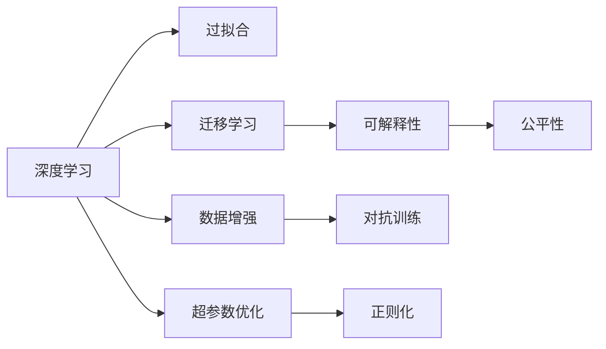

                 

# Andrej Karpathy：人工智能的未来发展挑战

人工智能(AI)技术正在以前所未有的速度发展，而斯坦福大学教授、深度学习先驱Andrej Karpathy的研究和见解，为我们揭示了这一领域未来的诸多挑战和机遇。本文将深入探讨Andrej Karpathy关于人工智能未来发展的核心观点，帮助读者更深刻地理解这一领域的最新动态和研究方向。

## 1. 背景介绍

### 1.1 问题由来

在过去的十年中，人工智能技术取得了长足的进步，从深度学习、自然语言处理到计算机视觉等各个领域，AI技术在理论和实践上均取得了显著成果。然而，尽管如此，AI技术的未来发展仍面临着诸多挑战，包括技术瓶颈、伦理问题、社会影响等。在这一背景下，Andrej Karpathy作为深度学习领域的佼佼者，通过其研究成果和观点，为我们提供了关于未来AI发展趋势的深刻洞察。

### 1.2 问题核心关键点

Andrej Karpathy的研究聚焦于以下几个核心问题：
1. 如何克服深度学习模型中的过拟合问题。
2. 如何在模型训练中更好地利用数据和计算资源。
3. 如何在确保模型公平性和透明度的同时，提升其性能。
4. 如何构建可解释的AI模型，增强其可信度。
5. 如何在保持高效的同时，增强模型的灵活性和适应性。

这些关键问题构成了AI技术发展的核心挑战，也是Karpathy深入研究的重点领域。

## 2. 核心概念与联系

### 2.1 核心概念概述

为更好地理解Andrej Karpathy的研究，本节将介绍几个与其工作密切相关的核心概念：

- **深度学习(Deep Learning)**：通过多层神经网络模型，自动学习数据中的抽象特征，从而实现复杂模式识别和预测。
- **过拟合(Overfitting)**：模型在训练数据上表现出色，但在测试数据上表现较差的现象。
- **迁移学习(Transfer Learning)**：将在一个任务上训练好的模型，应用于另一个相关但不同任务上，以提高新任务的性能。
- **可解释性(Explainability)**：确保AI模型的决策过程透明、可理解，从而增强其可信度。
- **公平性(Fairness)**：确保AI模型对不同群体的预测结果一致，避免偏见和歧视。

这些概念之间具有紧密的联系，共同构成了AI技术发展的基本框架。

### 2.2 核心概念原理和架构的 Mermaid 流程图



这个流程图展示了深度学习与AI研究中几个核心概念之间的联系和相互作用：

- 深度学习模型通过数据增强、对抗训练等技术来提升泛化能力，减少过拟合。
- 迁移学习有助于将已有的知识迁移到新任务，提高模型在新环境中的性能。
- 可解释性使得模型决策过程透明，便于理解和使用。
- 公平性确保模型在不同群体间的预测结果一致，避免歧视性。

这些概念共同构成了一个完整的AI技术体系，Andrej Karpathy的研究也正是围绕这些核心问题展开的。

## 3. 核心算法原理 & 具体操作步骤

### 3.1 算法原理概述

Andrej Karpathy的研究主要集中在以下几个方面：

1. **深度学习模型优化**：探索更好的优化算法和损失函数，提高模型的泛化能力和性能。
2. **数据增强**：利用数据增强技术，增加训练集多样性，减少过拟合。
3. **对抗训练**：通过引入对抗样本，提高模型的鲁棒性和泛化能力。
4. **模型解释**：研究可解释性方法，使得模型决策过程透明，便于理解和调试。
5. **公平性算法**：设计公平性算法，确保模型在不同群体间的预测一致，避免偏见。

### 3.2 算法步骤详解

以下是Andrej Karpathy关于AI研究中常见算法的详细步骤：

**步骤1：数据预处理**
- 对数据进行清洗、标准化、归一化等预处理，减少数据噪声，提高模型训练效果。
- 利用数据增强技术，如随机裁剪、旋转、翻转等，增加训练集的多样性，减少过拟合。

**步骤2：模型选择与设计**
- 选择合适的深度学习模型架构，如卷积神经网络(CNN)、循环神经网络(RNN)、Transformer等。
- 设计合适的损失函数，如交叉熵损失、均方误差损失等。
- 选择合适的优化算法，如Adam、SGD等。

**步骤3：模型训练**
- 将预处理后的数据划分为训练集、验证集和测试集。
- 在训练集上应用对抗训练，引入对抗样本，提高模型鲁棒性。
- 使用正则化技术，如L2正则、Dropout等，防止过拟合。
- 使用学习率调度策略，如学习率衰减、学习率预热等，优化模型性能。

**步骤4：模型评估与优化**
- 在验证集上评估模型性能，如准确率、召回率、F1值等。
- 根据评估结果，调整模型超参数，如学习率、批大小、迭代轮数等。
- 使用可解释性方法，如Attention、梯度权重等，增强模型解释性。

**步骤5：模型部署与监控**
- 将训练好的模型部署到生产环境中，进行实时推理和预测。
- 监控模型性能，如响应时间、准确率等，及时发现和解决性能问题。
- 定期更新模型，利用新数据进行微调，保持模型性能。

### 3.3 算法优缺点

**优点**：
- 深度学习模型具有强大的表征能力，能够自动学习数据中的复杂模式。
- 迁移学习可以显著提升模型在新任务上的性能，减少训练成本。
- 数据增强和对抗训练技术可以有效减少过拟合，提高模型泛化能力。
- 可解释性方法使得模型决策过程透明，便于理解和使用。
- 公平性算法可以确保模型在不同群体间的预测一致，避免歧视。

**缺点**：
- 深度学习模型需要大量计算资源和标注数据，训练和推理成本较高。
- 模型复杂度高，解释性较差，难以理解和调试。
- 对抗样本和对抗训练可能导致模型性能下降。
- 模型公平性算法设计复杂，效果有限。

尽管存在这些缺点，深度学习模型仍然在AI研究中占据重要地位，Andrej Karpathy的研究也为这些问题提供了有效的解决方案。

### 3.4 算法应用领域

Andrej Karpathy的研究成果广泛应用于以下领域：

- **计算机视觉**：在图像识别、目标检测、图像生成等领域取得显著成果。
- **自然语言处理**：在机器翻译、文本分类、情感分析等领域推动了深度学习技术的发展。
- **自动驾驶**：在自动驾驶、交通预测等领域展示了AI技术的潜力。
- **医疗健康**：在医学影像分析、疾病预测等领域提高了医疗服务效率和质量。

这些应用领域的突破，展示了Andrej Karpathy研究的重要价值。

## 4. 数学模型和公式 & 详细讲解 & 举例说明

### 4.1 数学模型构建

在AI研究中，数学模型和公式的构建是理解算法原理和推导步骤的关键。

以卷积神经网络(CNN)为例，其数学模型可以表示为：

$$
\text{Output} = \text{Conv2D}(\text{Input}, \text{Filter}, \text{Stride}, \text{Padding}) + \text{ActivationFunction}
$$

其中，$\text{Input}$为输入图像，$\text{Filter}$为卷积核，$\text{Stride}$和$\text{Padding}$为卷积参数，$\text{ActivationFunction}$为激活函数。

### 4.2 公式推导过程

以CNN中常用的ReLU激活函数为例，其推导过程如下：

$$
\text{ReLU}(x) = \max(0,x)
$$

在反向传播时，梯度更新公式为：

$$
\frac{\partial \text{ReLU}(x)}{\partial x} = \mathbb{1}(x > 0)
$$

其中$\mathbb{1}$为指示函数。

### 4.3 案例分析与讲解

以图像分类任务为例，假设使用CNN模型进行训练，其训练过程可以表示为：

1. **前向传播**：
   $$
   y_{\text{pred}} = \text{Conv2D}(x_{\text{input}}, w_{\text{conv}}, s_{\text{stride}}, p_{\text{padding}}) + b_{\text{conv}} + \text{ActivationFunction}
   $$
   其中$x_{\text{input}}$为输入图像，$w_{\text{conv}}$为卷积核，$s_{\text{stride}}$和$p_{\text{padding}}$为卷积参数，$b_{\text{conv}}$为偏置项，$\text{ActivationFunction}$为激活函数。

2. **损失函数**：
   $$
   \mathcal{L} = \frac{1}{N} \sum_{i=1}^N \ell(y_{\text{pred}}, y_{\text{target}})
   $$
   其中$y_{\text{pred}}$为模型预测输出，$y_{\text{target}}$为真实标签，$\ell$为损失函数。

3. **反向传播**：
   $$
   \frac{\partial \mathcal{L}}{\partial w_{\text{conv}}} = \frac{1}{N} \sum_{i=1}^N \frac{\partial \ell(y_{\text{pred}}, y_{\text{target}})}{\partial y_{\text{pred}}} \frac{\partial y_{\text{pred}}}{\partial w_{\text{conv}}}
   $$
   其中$\frac{\partial \ell(y_{\text{pred}}, y_{\text{target}})}{\partial y_{\text{pred}}}$为损失函数对预测输出的梯度，$\frac{\partial y_{\text{pred}}}{\partial w_{\text{conv}}}$为预测输出对卷积核的梯度。

通过以上步骤，我们可以对CNN模型进行训练和优化，实现高效的图像分类任务。

## 5. 项目实践：代码实例和详细解释说明

### 5.1 开发环境搭建

在进行项目实践前，我们需要准备好开发环境。以下是使用Python进行TensorFlow开发的环境配置流程：

1. 安装Anaconda：从官网下载并安装Anaconda，用于创建独立的Python环境。

2. 创建并激活虚拟环境：
```bash
conda create -n tf-env python=3.8 
conda activate tf-env
```

3. 安装TensorFlow：根据CUDA版本，从官网获取对应的安装命令。例如：
```bash
conda install tensorflow-gpu=2.6 -c pytorch -c conda-forge
```

4. 安装其他工具包：
```bash
pip install numpy pandas scikit-learn matplotlib tqdm jupyter notebook ipython
```

完成上述步骤后，即可在`tf-env`环境中开始项目实践。

### 5.2 源代码详细实现

以下是使用TensorFlow进行图像分类任务代码的实现：

```python
import tensorflow as tf
from tensorflow.keras import datasets, layers, models

# 加载数据集
(train_images, train_labels), (test_images, test_labels) = datasets.cifar10.load_data()

# 数据预处理
train_images, test_images = train_images / 255.0, test_images / 255.0

# 构建模型
model = models.Sequential([
    layers.Conv2D(32, (3, 3), activation='relu', input_shape=(32, 32, 3)),
    layers.MaxPooling2D((2, 2)),
    layers.Conv2D(64, (3, 3), activation='relu'),
    layers.MaxPooling2D((2, 2)),
    layers.Conv2D(64, (3, 3), activation='relu'),
    layers.Flatten(),
    layers.Dense(64, activation='relu'),
    layers.Dense(10)
])

# 编译模型
model.compile(optimizer='adam',
              loss=tf.keras.losses.SparseCategoricalCrossentropy(from_logits=True),
              metrics=['accuracy'])

# 训练模型
history = model.fit(train_images, train_labels, epochs=10, 
                    validation_data=(test_images, test_labels))

# 评估模型
test_loss, test_acc = model.evaluate(test_images,  test_labels, verbose=2)
print('\nTest accuracy:', test_acc)
```

以上代码实现了使用TensorFlow进行图像分类的基本流程，包括数据加载、预处理、模型构建、编译、训练和评估。

### 5.3 代码解读与分析

让我们再详细解读一下关键代码的实现细节：

**数据加载与预处理**：
- 使用`tf.keras.datasets.cifar10.load_data()`加载CIFAR-10数据集，其中训练集和测试集分别包含60,000张32x32像素的彩色图像。
- 对图像数据进行归一化处理，即除以255，将像素值缩放到[0,1]范围内。

**模型构建**：
- 使用`tf.keras.Sequential()`创建顺序模型，包含多个卷积层、池化层和全连接层。
- 第一层使用32个3x3卷积核，激活函数为ReLU。
- 第二层使用最大池化层，池化大小为2x2。
- 第三层使用64个3x3卷积核，激活函数为ReLU。
- 第四层再次使用最大池化层，池化大小为2x2。
- 第五层使用64个3x3卷积核，激活函数为ReLU。
- 第六层使用Flatten层将卷积层的输出展平。
- 第七层使用64个全连接层，激活函数为ReLU。
- 第八层使用10个全连接层，输出层使用softmax激活函数，分类标签为0-9。

**模型编译**：
- 使用`model.compile()`方法编译模型，选择Adam优化器，损失函数为交叉熵损失函数，指标为准确率。

**模型训练**：
- 使用`model.fit()`方法训练模型，其中训练集为`train_images`和`train_labels`，验证集为`test_images`和`test_labels`，迭代轮数为10。

**模型评估**：
- 使用`model.evaluate()`方法评估模型性能，输出测试集上的损失和准确率。

## 6. 实际应用场景

### 6.1 智能医疗

在智能医疗领域，AI技术可以用于医学影像分析、疾病预测、药物研发等方面，提高医疗服务效率和质量。以医学影像分析为例，使用预训练的深度学习模型，如ResNet、Inception等，可以自动识别和分类医学影像中的病变区域，辅助医生进行诊断和治疗。

### 6.2 自动驾驶

自动驾驶技术是AI技术在交通领域的重要应用之一。通过深度学习和计算机视觉技术，自动驾驶系统可以实时感知和理解道路环境，进行路径规划和行为决策，提升驾驶安全性和效率。

### 6.3 金融风控

在金融领域，AI技术可以用于风险评估、欺诈检测、信用评分等方面。使用深度学习和数据分析技术，构建智能风控系统，能够实时监测金融市场动态，预测风险和损失，保护投资者利益。

### 6.4 未来应用展望

随着AI技术的不断进步，未来在更多领域将看到其应用的深入和扩展。以下是几个未来应用展望：

1. **智慧城市**：AI技术可以用于交通管理、环境监测、公共安全等领域，构建更加智能、高效的城市管理模式。
2. **智能制造**：在工业领域，AI技术可以用于生产优化、设备维护、质量控制等方面，提高生产效率和质量。
3. **教育领域**：AI技术可以用于智能辅导、学习推荐、智能评估等方面，提升教育质量和个性化水平。

## 7. 工具和资源推荐

### 7.1 学习资源推荐

为了帮助开发者系统掌握AI技术，这里推荐一些优质的学习资源：

1. 《深度学习》书籍：Ian Goodfellow、Yoshua Bengio和Aaron Courville合著的经典教材，系统介绍了深度学习的基本原理和算法。
2. 《TensorFlow实战》书籍：由Google官方出版，提供了从入门到高级的TensorFlow教程和实战案例。
3. 《动手学深度学习》课程：由李沐等教授主讲的深度学习课程，详细讲解了深度学习模型和算法，并提供了丰富的实践项目。
4. 《PyTorch官方文档》：PyTorch官方文档提供了丰富的教程和API文档，是学习PyTorch的重要资源。
5. Kaggle竞赛平台：Kaggle提供大量的数据集和竞赛项目，是提升AI实践能力的好地方。

通过对这些资源的学习实践，相信你一定能够快速掌握AI技术的精髓，并用于解决实际的AI问题。

### 7.2 开发工具推荐

高效的开发离不开优秀的工具支持。以下是几款用于AI项目开发的常用工具：

1. PyTorch：基于Python的开源深度学习框架，灵活动态的计算图，适合快速迭代研究。
2. TensorFlow：由Google主导开发的开源深度学习框架，生产部署方便，适合大规模工程应用。
3. Keras：高层次的深度学习框架，提供了简洁易用的API，适合快速原型开发。
4. Jupyter Notebook：轻量级的数据分析和实验平台，支持Python、R等多种语言。
5. Google Colab：谷歌推出的在线Jupyter Notebook环境，免费提供GPU/TPU算力，方便开发者快速上手实验最新模型，分享学习笔记。

合理利用这些工具，可以显著提升AI项目开发效率，加快创新迭代的步伐。

### 7.3 相关论文推荐

AI技术的发展离不开学界的持续研究。以下是几篇奠基性的相关论文，推荐阅读：

1. AlexNet：ImageNet大规模视觉识别竞赛冠军模型，展示了深度学习在图像分类中的巨大潜力。
2. RNN与LSTM：通过RNN和LSTM网络，展示了深度学习在序列数据处理中的应用。
3. Transformer模型：Google提出的Transformer模型，展示了深度学习在自然语言处理中的突破。
4. GAN生成对抗网络：Isola等提出的GAN模型，展示了深度学习在图像生成中的创新应用。
5. Attention机制：Vaswani等提出的Transformer模型中的Attention机制，展示了深度学习在模型设计上的新思路。

这些论文代表了大AI技术的发展脉络。通过学习这些前沿成果，可以帮助研究者把握学科前进方向，激发更多的创新灵感。

## 8. 总结：未来发展趋势与挑战

### 8.1 研究成果总结

Andrej Karpathy的研究涵盖了深度学习模型优化、数据增强、对抗训练、模型解释等多个方面，为AI技术的发展做出了重要贡献。其研究成果已经广泛应用于计算机视觉、自然语言处理、自动驾驶等领域，推动了AI技术在这些领域的应用和突破。

### 8.2 未来发展趋势

展望未来，AI技术将呈现以下几个发展趋势：

1. **模型性能提升**：随着计算资源的不断提升，深度学习模型将具备更强的表征能力和泛化能力，从而提升性能。
2. **模型解释性增强**：在实际应用中，可解释性模型将更具可信度和可接受性，从而推动AI技术的广泛应用。
3. **多模态融合**：将视觉、语音、文本等多模态数据进行融合，提升AI系统的综合能力。
4. **联邦学习**：在保护数据隐私的前提下，通过分布式学习技术，提升模型性能和训练效率。
5. **跨领域迁移学习**：利用迁移学习技术，将已有知识迁移到新领域，提升模型在新任务上的性能。

### 8.3 面临的挑战

尽管AI技术在不断进步，但仍面临着诸多挑战：

1. **计算资源限制**：深度学习模型需要大量计算资源，如何有效利用计算资源是一个重要挑战。
2. **数据隐私和安全**：如何在保护数据隐私的前提下，进行模型训练和推理，是未来AI技术的重要研究方向。
3. **模型解释性不足**：深度学习模型通常被视为“黑盒”系统，难以理解和解释，这限制了其在实际应用中的广泛应用。
4. **公平性和偏见**：如何设计公平性算法，确保模型在不同群体间的预测一致，避免偏见和歧视，是未来AI技术的重要研究方向。
5. **伦理和安全**：如何在AI系统中引入伦理和道德约束，确保其应用符合社会价值观，是未来AI技术的重要研究方向。

### 8.4 研究展望

面对这些挑战，未来的研究需要在以下几个方面寻求新的突破：

1. **高效模型设计**：研究更高效、更轻量级的深度学习模型，提升模型的可部署性和性能。
2. **模型解释性**：研究可解释性技术，使得模型决策过程透明，便于理解和调试。
3. **公平性和偏见**：设计公平性算法，确保模型在不同群体间的预测一致，避免偏见和歧视。
4. **伦理和安全**：引入伦理和道德约束，确保AI系统应用符合社会价值观，增强系统的可信度和安全性。
5. **联邦学习**：研究分布式学习技术，提升模型性能和训练效率，保护数据隐私。

这些研究方向将引领AI技术迈向更高的台阶，为构建安全、可靠、可解释、可控的智能系统铺平道路。

## 9. 附录：常见问题与解答

**Q1：深度学习模型过拟合问题如何解决？**

A: 深度学习模型过拟合问题可以通过以下方法解决：
1. 数据增强：利用数据增强技术，增加训练集的多样性，减少过拟合。
2. 正则化：使用L2正则、Dropout等正则化技术，防止过拟合。
3. 早停策略：在验证集上监控模型性能，当性能不再提升时停止训练，避免过拟合。

**Q2：模型解释性不足如何解决？**

A: 模型解释性不足可以通过以下方法解决：
1. 可解释性方法：使用Attention机制、梯度权重等技术，使得模型决策过程透明，便于理解和使用。
2. 可视化技术：使用可视化工具，如TensorBoard，展示模型的内部结构和输出结果。
3. 简化模型：简化模型结构，去除不必要的层和参数，减小模型复杂度，提高可解释性。

**Q3：模型公平性问题如何解决？**

A: 模型公平性问题可以通过以下方法解决：
1. 公平性算法：设计公平性算法，确保模型在不同群体间的预测一致，避免偏见。
2. 数据预处理：对数据进行去偏处理，减少数据中的偏见。
3. 模型评估：在评估模型性能时，考虑公平性指标，如AUC-ROC、PR曲线等。

**Q4：模型训练资源有限如何解决？**

A: 模型训练资源有限可以通过以下方法解决：
1. 模型剪枝：去除不必要的层和参数，减小模型尺寸，提高推理速度。
2. 量化加速：将浮点模型转为定点模型，压缩存储空间，提高计算效率。
3. 分布式训练：利用分布式训练技术，加速模型训练，提高效率。

**Q5：如何设计高效的深度学习模型？**

A: 设计高效的深度学习模型可以通过以下方法解决：
1. 模型架构优化：研究高效的模型架构，如Transformer、ResNet等。
2. 模型参数压缩：使用模型压缩技术，如剪枝、量化等，减小模型参数量。
3. 数据增强：利用数据增强技术，增加训练集的多样性，减少过拟合。
4. 正则化技术：使用正则化技术，如L2正则、Dropout等，防止过拟合。

这些方法将有助于设计高效、可解释、公平的深度学习模型，推动AI技术的不断进步。

---

作者：禅与计算机程序设计艺术 / Zen and the Art of Computer Programming

