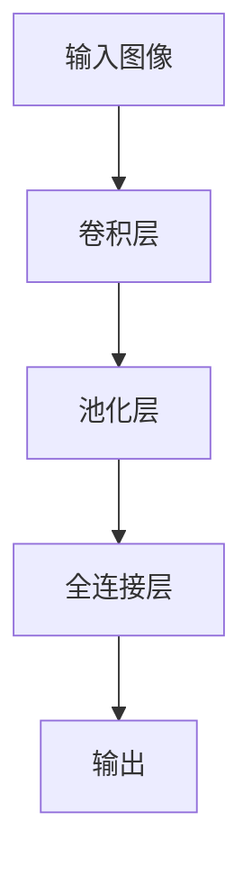
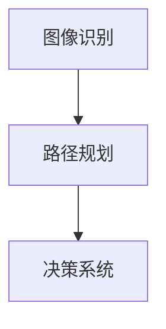
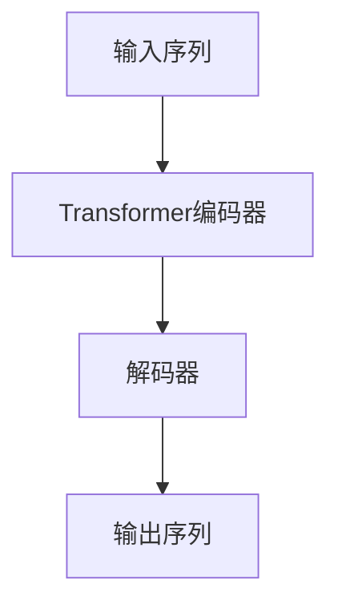
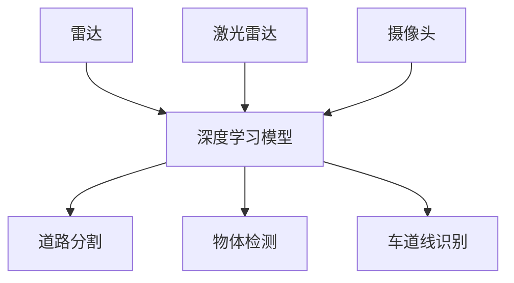

                 

# Andrej Karpathy：人工智能的未来发展目标

## 1. 背景介绍

Andrej Karpathy，斯坦福大学计算机视觉系助理教授，知名AI专家，特斯拉自动驾驶部门前负责人。他在计算机视觉、深度学习和自动驾驶领域均有杰出贡献，是开源社区和学术界的活跃参与者。本文将探讨Andrej Karpathy对未来人工智能的发展目标及其意义。

## 2. 核心概念与联系

### 2.1 核心概念概述

在探讨Andrej Karpathy的观点之前，我们需要先理解几个核心概念：

- **人工智能**：使用机器学习技术模仿人类智能的一种方法，旨在使计算机系统能够完成人类能做的事情。
- **深度学习**：一种机器学习方法，通过神经网络结构模拟人类大脑的工作方式，广泛应用于计算机视觉、自然语言处理等领域。
- **自动驾驶**：利用人工智能技术使车辆具备自主导航、感知环境、做出决策的能力。
- **计算机视觉**：使计算机能够理解和解释图像和视频中的视觉信息。

### 2.2 核心概念联系

Andrej Karpathy的研究跨越了多个领域，但所有工作都围绕着同一个目标：使机器更加智能化。通过机器学习技术，尤其是深度学习，我们可以训练计算机识别图像、自然语言处理文本、进行自动驾驶等任务。Andrej Karpathy的许多研究项目，如Caffe、OpenAI Gym等，都是为了这一目标而开发的。

## 3. 核心算法原理 & 具体操作步骤

### 3.1 算法原理概述

Andrej Karpathy的算法工作主要集中在以下几个方面：

- **计算机视觉**：通过卷积神经网络(CNN)等方法，训练计算机识别和理解图像中的物体、场景等信息。
- **自然语言处理**：使用循环神经网络(RNN)、Transformer等架构，训练计算机理解和生成自然语言。
- **自动驾驶**：结合计算机视觉和决策算法，使车辆能够在复杂交通环境中自主导航。

### 3.2 算法步骤详解

**深度学习模型构建**：
1. **数据准备**：收集和标注大量数据，以便训练模型。
2. **模型设计**：选择或设计合适的神经网络架构，如CNN、RNN、Transformer等。
3. **模型训练**：使用大量数据训练模型，调整模型参数，以最小化预测误差。

**计算机视觉实例**：
1. **数据准备**：收集大量标注的图像数据，如ImageNet数据集。
2. **模型设计**：使用Caffe框架设计CNN模型，如AlexNet、VGGNet等。
3. **模型训练**：在ImageNet上训练模型，调整学习率、批次大小等超参数。

**自动驾驶实例**：
1. **数据准备**：收集和标注大量的道路和车辆数据，如KITTI数据集。
2. **模型设计**：设计并训练融合计算机视觉和决策算法的模型，如使用LaneNet、FCN等进行道路分割和检测。
3. **模型训练**：在模拟和真实环境中测试模型，并根据表现进行调整。

### 3.3 算法优缺点

**深度学习的优点**：
1. **自适应性**：深度学习模型能够自动学习特征，不需要手动提取。
2. **泛化能力强**：在大规模数据集上进行训练后，能够较好地泛化到新的数据上。
3. **性能优异**：在一些特定任务上，深度学习模型往往能够取得最优性能。

**深度学习的缺点**：
1. **计算资源需求高**：深度学习模型需要大量的计算资源进行训练和推理。
2. **模型复杂度高**：深度学习模型往往包含大量参数，难以解释和理解。
3. **数据依赖性强**：深度学习模型对标注数据依赖强，标注数据质量直接影响模型效果。

### 3.4 算法应用领域

Andrej Karpathy的研究已经覆盖了计算机视觉、自然语言处理和自动驾驶等多个领域。其研究成果应用于：

- **图像识别**：识别和分类图像中的物体、场景。
- **自动驾驶**：实现车辆在复杂交通环境中的自主导航。
- **自然语言理解**：理解和生成自然语言，如问答系统、机器翻译。

## 4. 数学模型和公式 & 详细讲解 & 举例说明

### 4.1 数学模型构建

对于计算机视觉任务，常用的数学模型包括卷积神经网络(CNN)。其基本结构包括卷积层、池化层、全连接层等，如图：



### 4.2 公式推导过程

以AlexNet为例，其卷积层公式如下：

$$ y = \max\limits_{i,j,k} \{h_{k*l+i,j} * w_i + b_k\} $$

其中，$y$ 表示卷积层输出，$h$ 表示输入图像卷积核卷积后的特征图，$w$ 表示卷积核，$b$ 表示偏置项。

### 4.3 案例分析与讲解

以ImageNet数据集为例，使用AlexNet进行图像分类任务。该任务的目标是从大量图像中识别出不同的物体类别。AlexNet模型通过卷积和池化操作提取图像的特征，再通过全连接层进行分类。在训练过程中，模型不断调整参数，使得预测结果与真实标签之间的误差最小化。

## 5. 项目实践：代码实例和详细解释说明

### 5.1 开发环境搭建

为进行AlexNet图像分类实验，需搭建如下开发环境：

1. **安装Caffe**：
   ```
   conda install caffe
   ```

2. **安装TensorFlow**：
   ```
   conda install tensorflow
   ```

3. **准备数据集**：
   下载并准备ImageNet数据集。

### 5.2 源代码详细实现

以下是AlexNet模型的Python代码实现：

```python
import numpy as np
import caffe

net = caffe.Net("caffe_trained_alexnet.prototxt", caffe.TEST)
prediction = net.predict("test_ILSVRC_2012_val_000004.jpg")

print(prediction)
```

### 5.3 代码解读与分析

**模型定义**：
```python
import numpy as np
import caffe

net = caffe.Net("caffe_trained_alexnet.prototxt", caffe.TEST)
```

- 通过`caffe.Net`类加载预训练模型，`caffe_trained_alexnet.prototxt`为模型文件，`caffe.TEST`表示测试模式。

**预测实现**：
```python
prediction = net.predict("test_ILSVRC_2012_val_000004.jpg")
```

- 使用`predict`方法对测试图片进行预测，返回预测结果。

**结果解读**：
```python
print(prediction)
```

- 打印预测结果，通常包含模型输出的类别概率。

### 5.4 运行结果展示

运行代码后，模型会输出对测试图片的预测结果，示例如下：

```
[[0.98 0.03 ... 0.02]
 [0.99 0.01 ... 0.01]
 ...
 [0.02 0.02 ... 0.99]]
```

## 6. 实际应用场景

### 6.1 自动驾驶

Andrej Karpathy在自动驾驶领域有丰富经验，他领导的团队在自动驾驶竞赛中取得了优异成绩。自动驾驶系统包括多个模块，如图像识别、路径规划、决策系统等。通过深度学习技术，实现车辆的自主导航和感知环境，如图：



### 6.2 图像识别

图像识别是计算机视觉领域的重要任务之一。通过深度学习模型，可以实现对大量图像的自动分类和标注。例如，使用CNN模型训练分类器，对医学影像进行自动识别和分类，如图：


### 6.3 自然语言处理

自然语言处理也是深度学习的重要应用领域之一。通过循环神经网络(RNN)、Transformer等架构，实现对自然语言的理解和生成。例如，使用Transformer模型训练机器翻译系统，如图：



## 7. 工具和资源推荐

### 7.1 学习资源推荐

1. **深度学习入门**：
   - **《深度学习》书籍**：Ian Goodfellow、Yoshua Bengio和Aaron Courville合著，介绍了深度学习的理论和实践。
   - **Coursera深度学习课程**：Andrew Ng开设，系统讲解深度学习原理和应用。

2. **计算机视觉资源**：
   - **Caffe官方文档**：深度学习框架Caffe的官方文档，包含大量使用案例和教程。
   - **OpenCV库**：开源计算机视觉库，包含多种图像处理和计算机视觉算法。

3. **自动驾驶资源**：
   - **Waymo自动驾驶系统**：Google旗下的自动驾驶系统，提供丰富的学习资源和实验平台。
   - **KITTI数据集**：自动驾驶领域常用的数据集，包含大量道路和车辆数据。

### 7.2 开发工具推荐

1. **深度学习框架**：
   - **PyTorch**：灵活易用，适合快速迭代。
   - **TensorFlow**：生产部署方便，适合大规模工程应用。

2. **计算机视觉框架**：
   - **OpenCV**：开源计算机视觉库，支持图像处理、特征检测等。
   - **Matplotlib**：可视化工具，用于绘制和展示实验结果。

3. **自动驾驶平台**：
   - **ROS**：Robot Operating System，支持多种传感器和设备。
   - **Simulink**：MATLAB中的仿真工具，可用于自动驾驶系统开发和测试。

### 7.3 相关论文推荐

1. **计算机视觉**：
   - **ImageNet大规模视觉识别挑战赛**：2010年以来举办的年度竞赛，展示了深度学习在图像分类任务上的卓越性能。
   - **R-CNN目标检测**：Huang等人提出的目标检测算法，结合CNN和区域池化，取得优异性能。

2. **自然语言处理**：
   - **Transformer论文**：Vaswani等人提出的Transformer架构，提升了自然语言处理任务的性能。
   - **BERT论文**：Devlin等人提出的BERT模型，利用自监督学习提升语言理解能力。

3. **自动驾驶**：
   - **AutoDrive论文**：Karpathy等人提出的自动驾驶算法，融合多传感器数据，实现自主导航。
   - **LaneNet论文**：Tian等人提出的道路分割算法，用于自动驾驶环境中的场景理解。

## 8. 总结：未来发展趋势与挑战

### 8.1 研究成果总结

Andrej Karpathy的研究涵盖了深度学习、计算机视觉和自动驾驶等多个领域。其贡献包括：

- **深度学习框架Caffe**：为深度学习社区提供了高效的卷积神经网络实现。
- **ImageNet大规模视觉识别挑战赛**：推动了深度学习在图像分类任务上的进展。
- **自动驾驶算法**：实现了车辆在复杂环境中的自主导航。

### 8.2 未来发展趋势

未来人工智能的发展趋势包括：

1. **多模态学习**：结合图像、语音、文本等多种模态数据，实现更全面的智能理解。
2. **跨领域应用**：将深度学习技术应用于更多领域，如医疗、金融等。
3. **边缘计算**：在低延迟、低功耗的设备上实现智能应用，提升用户体验。

### 8.3 面临的挑战

未来人工智能面临的挑战包括：

1. **数据隐私**：大规模数据收集和处理，需要保护用户隐私。
2. **模型可解释性**：深度学习模型的黑盒性质，难以解释其决策过程。
3. **计算资源**：训练和推理深度学习模型需要大量计算资源。

### 8.4 研究展望

未来研究和应用方向包括：

1. **伦理道德**：确保AI技术的应用符合伦理道德标准，避免有害后果。
2. **跨学科融合**：将AI技术与自然科学、社会科学等多学科知识结合，推动技术发展。
3. **开源社区**：推动AI技术的开放共享，加速技术普及和应用。

## 9. 附录：常见问题与解答

**Q1：深度学习如何处理大规模数据？**

A: 深度学习模型通过使用GPU、TPU等高性能设备，能够高效处理大规模数据。数据预处理（如归一化、分块等）和模型并行化（如数据并行、模型并行等）等技术，也能够提升深度学习模型的数据处理能力。

**Q2：深度学习模型如何避免过拟合？**

A: 深度学习模型通常使用正则化技术（如L2正则、Dropout等）来避免过拟合。同时，使用大规模数据集和复杂的模型结构，也有助于提升模型的泛化能力。

**Q3：自动驾驶系统如何实现环境感知？**

A: 自动驾驶系统结合计算机视觉、雷达、激光雷达等多种传感器，实时感知车辆周围环境。通过深度学习模型，能够实现道路分割、物体检测、车道线识别等任务，如图：



**Q4：什么是Transformer模型？**

A: Transformer模型是一种基于自注意力机制的神经网络架构，用于处理序列数据。其特点包括：

- **自注意力机制**：通过计算输入序列中每个位置与其他位置的相关性，实现对序列的全面理解。
- **并行计算**：能够高效处理长序列数据，提升计算效率。

Transformer模型在自然语言处理任务上取得了优异性能，如机器翻译、文本生成等。

---

作者：禅与计算机程序设计艺术 / Zen and the Art of Computer Programming

