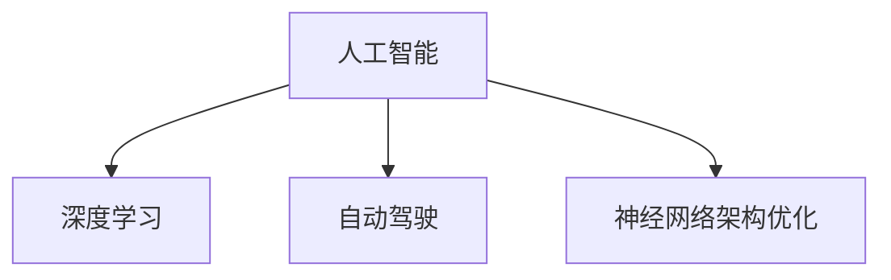

                 

## 1. 背景介绍

Andrej Karpathy是人工智能领域的重要人物，以其在计算机视觉和自动驾驶等方面的杰出贡献而闻名。他在图像识别、自动驾驶、神经网络架构优化等方面有着深远的影响。其研究和工程实践推动了深度学习技术的快速发展，对人工智能的未来发展方向有着前瞻性的洞察。

本文将重点探讨Andrej Karpathy对人工智能未来发展的见解，包括其对AI技术演进的理解、AI领域的主要研究方向、AI技术在实际应用中的潜力以及面临的挑战。这些观点将帮助读者更好地理解当前和未来的AI发展趋势，为从事AI领域的研究和实践提供有价值的参考。

## 2. 核心概念与联系

### 2.1 核心概念概述

**人工智能 (Artificial Intelligence, AI)**：使用计算机系统模拟人类智能行为，包括感知、学习、推理、决策等。人工智能技术通过算法和数据驱动，以实现特定目标，如自然语言处理、计算机视觉、语音识别等。

**深度学习 (Deep Learning)**：一种机器学习方法，通过多层神经网络模拟人类大脑的神经网络结构，用于处理大规模复杂数据。深度学习在计算机视觉、自然语言处理、语音识别等任务上取得了巨大成功。

**自动驾驶 (Autonomous Driving)**：通过AI技术实现车辆自主行驶，实现交通系统的智能化。自动驾驶技术包括环境感知、路径规划、决策控制等关键环节。

**神经网络架构优化 (Neural Network Architecture Optimization)**：针对特定任务，设计高效、可解释的神经网络模型，以提升模型性能、减少计算资源消耗。

### 2.2 核心概念原理和架构的 Mermaid 流程图



**核心概念之间的逻辑关系**：

- 人工智能是一个广泛的概念，涵盖深度学习、自动驾驶、神经网络架构优化等多个具体方向。
- 深度学习是实现人工智能的重要技术手段，通过多层次神经网络模型处理数据。
- 自动驾驶利用深度学习技术实现车辆自主行驶，是AI应用的一个重要场景。
- 神经网络架构优化旨在提升深度学习模型的效率和可解释性，支持AI技术的广泛应用。

## 3. 核心算法原理 & 具体操作步骤

### 3.1 算法原理概述

**深度学习原理**：深度学习模型通过反向传播算法优化模型参数，最小化损失函数。模型通常包含多个隐藏层，每一层对输入数据进行特征提取和抽象，最终输出预测结果。

**自动驾驶算法**：自动驾驶系统包括环境感知、路径规划、决策控制等环节。环境感知通过摄像头、雷达、激光雷达等传感器收集数据，并使用深度学习模型进行图像、点云等数据的处理和分析。路径规划利用深度学习模型预测交通状况，生成最优驾驶路径。决策控制基于规划结果和实时感知数据，使用强化学习等技术进行驾驶决策。

**神经网络架构优化**：神经网络架构优化包括网络剪枝、量化、蒸馏等技术，旨在减少模型参数、提升模型效率、减少计算资源消耗。

### 3.2 算法步骤详解

**深度学习算法步骤**：

1. 数据准备：收集并预处理训练数据，分为训练集和验证集。
2. 模型设计：选择合适的网络结构，确定损失函数和优化器。
3. 训练过程：使用训练集数据进行模型训练，通过反向传播算法优化参数。
4. 验证评估：在验证集上评估模型性能，根据验证集结果调整模型超参数。
5. 测试预测：在测试集上进行模型预测，评估最终性能。

**自动驾驶算法步骤**：

1. 传感器数据采集：通过摄像头、雷达、激光雷达等传感器收集环境数据。
2. 数据处理：使用深度学习模型进行图像、点云等数据的处理和分析。
3. 路径规划：使用深度学习模型预测交通状况，生成最优驾驶路径。
4. 决策控制：基于路径规划结果和实时感知数据，使用强化学习等技术进行驾驶决策。
5. 系统集成：将环境感知、路径规划、决策控制等模块集成，实现车辆自主行驶。

**神经网络架构优化步骤**：

1. 初始化模型：选择基准模型，如ResNet、Inception等。
2. 网络剪枝：去除冗余连接和节点，减小模型参数量。
3. 量化：将模型参数从浮点数转化为整数，减小计算资源消耗。
4. 蒸馏：使用小规模模型进行知识转移，提升模型性能。
5. 评估测试：在测试集上评估优化后模型的性能，确认优化效果。

### 3.3 算法优缺点

**深度学习算法优缺点**：

优点：
- 能够处理大规模复杂数据，模型表现通常优于传统机器学习方法。
- 自动提取特征，减少了手工设计特征的复杂性。
- 通过反向传播算法优化模型参数，模型的泛化能力较强。

缺点：
- 需要大量标注数据进行训练，数据准备成本高。
- 模型复杂，计算资源消耗大，训练时间长。
- 模型可解释性较差，难以理解其内部工作机制。

**自动驾驶算法优缺点**：

优点：
- 能够实现自主行驶，减少人类驾驶员的工作负担。
- 通过深度学习模型进行环境感知和路径规划，系统决策效率高。
- 能够适应复杂的交通场景，提高交通安全性和通行效率。

缺点：
- 传感器和算法成本高，系统部署难度大。
- 环境复杂多变，系统安全性尚未完全验证。
- 需要与现有交通系统融合，面临法律、伦理等社会挑战。

**神经网络架构优化优缺点**：

优点：
- 能够显著减少模型参数，降低计算资源消耗。
- 提升模型推理速度，加速实际应用部署。
- 通过模型压缩，提高模型的可解释性。

缺点：
- 优化过程复杂，需要多次实验验证。
- 优化后模型性能可能略有下降，需要权衡优化和性能。
- 依赖于数据集的特点，不同数据集可能需要不同的优化策略。

### 3.4 算法应用领域

**深度学习应用领域**：
- 自然语言处理：如机器翻译、文本分类、情感分析等。
- 计算机视觉：如图像分类、目标检测、图像生成等。
- 语音识别：如语音转文本、说话人识别、语音合成等。

**自动驾驶应用领域**：
- 环境感知：通过摄像头、雷达、激光雷达等传感器获取环境信息。
- 路径规划：使用深度学习模型预测交通状况，生成最优驾驶路径。
- 决策控制：使用强化学习等技术进行驾驶决策。

**神经网络架构优化应用领域**：
- 移动设备：如智能手机、可穿戴设备等，需要高效、低功耗的AI应用。
- 边缘计算：如自动驾驶、工业控制等，需要实时、高效的处理能力。
- 嵌入式系统：如物联网设备、智能家居等，需要高效、可解释的AI应用。

## 4. 数学模型和公式 & 详细讲解 & 举例说明

### 4.1 数学模型构建

**深度学习模型**：
- 输入数据 $x$，经过多层神经网络处理后，输出预测结果 $y$。
- 模型参数 $\theta$ 通过反向传播算法优化，最小化损失函数 $L$。

**自动驾驶模型**：
- 环境感知模型 $f_{perception}$ 通过传感器数据提取环境特征。
- 路径规划模型 $f_{planning}$ 根据感知结果生成最优路径。
- 决策控制模型 $f_{control}$ 根据路径规划结果和实时感知数据进行决策。

**神经网络架构优化模型**：
- 基准模型 $f_{base}$ 作为优化起点。
- 网络剪枝模型 $f_{pruning}$ 剪除冗余连接和节点，生成剪枝后模型。
- 量化模型 $f_{quantization}$ 将模型参数转化为整数，生成量化后模型。
- 蒸馏模型 $f_{distillation}$ 使用小规模模型进行知识转移，生成蒸馏后模型。

### 4.2 公式推导过程

**深度学习损失函数**：
- 假设模型参数为 $\theta$，输入为 $x$，输出为 $y$，损失函数为 $L(\theta)$。
- 假设训练集为 $\{(x_i, y_i)\}_{i=1}^N$，则经验风险为 $\frac{1}{N} \sum_{i=1}^N L(\theta, x_i, y_i)$。

**自动驾驶路径规划模型**：
- 假设环境感知结果为 $s$，路径规划模型为 $f_{planning}(s)$，输出最优路径 $p$。
- 假设路径规划结果为 $p_i$，真实路径为 $p_{real}$，路径规划损失为 $L_{path}(f_{planning}(s), p_{real})$。

**神经网络架构优化模型**：
- 假设基准模型为 $f_{base}$，剪枝模型为 $f_{pruning}(f_{base})$，量化模型为 $f_{quantization}(f_{pruning}(f_{base}))$，蒸馏模型为 $f_{distillation}(f_{quantization}(f_{pruning}(f_{base})))$。
- 假设原始模型参数为 $\theta_{base}$，剪枝后模型参数为 $\theta_{pruning}$，量化后模型参数为 $\theta_{quantization}$，蒸馏后模型参数为 $\theta_{distillation}$。

### 4.3 案例分析与讲解

**深度学习案例**：
- 使用卷积神经网络 (CNN) 进行图像分类任务。
- 收集并预处理大量图像数据，分为训练集和验证集。
- 设计卷积神经网络结构，使用交叉熵损失函数。
- 使用反向传播算法优化模型参数，在验证集上评估模型性能。
- 在测试集上进行模型预测，评估最终性能。

**自动驾驶案例**：
- 使用深度学习模型进行摄像头数据处理和目标检测。
- 使用强化学习模型进行路径规划和决策控制。
- 在模拟环境和实际道路上测试系统性能，验证系统安全性。

**神经网络架构优化案例**：
- 使用ResNet作为基准模型，进行网络剪枝和量化。
- 使用蒸馏模型进行知识转移，提升模型性能。
- 在测试集上评估优化后模型的性能，确认优化效果。

## 5. 项目实践：代码实例和详细解释说明

### 5.1 开发环境搭建

**开发环境搭建**：
- 安装Python 3.x，建议使用Anaconda管理环境。
- 安装深度学习框架，如TensorFlow、PyTorch等。
- 安装自动驾驶相关库，如OpenCV、ROS等。
- 安装神经网络架构优化工具，如PyTorch、TensorFlow等。

### 5.2 源代码详细实现

**深度学习源代码实现**：
```python
import torch
import torch.nn as nn
import torch.optim as optim

# 定义神经网络模型
class CNN(nn.Module):
    def __init__(self):
        super(CNN, self).__init__()
        self.conv1 = nn.Conv2d(3, 64, kernel_size=3, stride=1, padding=1)
        self.relu = nn.ReLU()
        self.maxpool = nn.MaxPool2d(kernel_size=2, stride=2)
        self.fc1 = nn.Linear(64 * 14 * 14, 256)
        self.fc2 = nn.Linear(256, 10)

    def forward(self, x):
        x = self.conv1(x)
        x = self.relu(x)
        x = self.maxpool(x)
        x = x.view(-1, 64 * 14 * 14)
        x = self.fc1(x)
        x = self.relu(x)
        x = self.fc2(x)
        return x

# 定义损失函数和优化器
criterion = nn.CrossEntropyLoss()
optimizer = optim.SGD(model.parameters(), lr=0.001, momentum=0.9)

# 训练过程
for epoch in range(num_epochs):
    for i, (images, labels) in enumerate(train_loader):
        images = images.to(device)
        labels = labels.to(device)
        optimizer.zero_grad()
        outputs = model(images)
        loss = criterion(outputs, labels)
        loss.backward()
        optimizer.step()
```

**自动驾驶源代码实现**：
```python
import cv2
import numpy as np

# 环境感知
def perception(env):
    image = env.get_image()
    features = extract_features(image)
    return features

# 路径规划
def planning(features):
    prediction = model.predict(features)
    path = generate_path(prediction)
    return path

# 决策控制
def control(path):
    action = model.control(path)
    return action

# 主函数
def main():
    env = create_environment()
    while True:
        features = perception(env)
        path = planning(features)
        action = control(path)
        env.step(action)
```

**神经网络架构优化源代码实现**：
```python
import torch

# 定义基准模型
class BaseModel(nn.Module):
    def __init__(self):
        super(BaseModel, self).__init__()
        self.conv1 = nn.Conv2d(3, 64, kernel_size=3, stride=1, padding=1)
        self.relu = nn.ReLU()
        self.maxpool = nn.MaxPool2d(kernel_size=2, stride=2)
        self.fc1 = nn.Linear(64 * 14 * 14, 256)
        self.fc2 = nn.Linear(256, 10)

    def forward(self, x):
        x = self.conv1(x)
        x = self.relu(x)
        x = self.maxpool(x)
        x = x.view(-1, 64 * 14 * 14)
        x = self.fc1(x)
        x = self.relu(x)
        x = self.fc2(x)
        return x

# 定义剪枝模型
class PruningModel(nn.Module):
    def __init__(self):
        super(PruningModel, self).__init__()
        self.conv1 = nn.Conv2d(3, 64, kernel_size=3, stride=1, padding=1)
        self.relu = nn.ReLU()
        self.maxpool = nn.MaxPool2d(kernel_size=2, stride=2)
        self.fc1 = nn.Linear(64 * 14 * 14, 256)
        self.fc2 = nn.Linear(256, 10)

    def forward(self, x):
        x = self.conv1(x)
        x = self.relu(x)
        x = self.maxpool(x)
        x = x.view(-1, 64 * 14 * 14)
        x = self.fc1(x)
        x = self.relu(x)
        x = self.fc2(x)
        return x

# 定义量化模型
class QuantizationModel(nn.Module):
    def __init__(self):
        super(QuantizationModel, self).__init__()
        self.conv1 = nn.Conv2d(3, 64, kernel_size=3, stride=1, padding=1)
        self.relu = nn.ReLU()
        self.maxpool = nn.MaxPool2d(kernel_size=2, stride=2)
        self.fc1 = nn.Linear(64 * 14 * 14, 256)
        self.fc2 = nn.Linear(256, 10)

    def forward(self, x):
        x = self.conv1(x)
        x = self.relu(x)
        x = self.maxpool(x)
        x = x.view(-1, 64 * 14 * 14)
        x = self.fc1(x)
        x = self.relu(x)
        x = self.fc2(x)
        return x

# 定义蒸馏模型
class DistillationModel(nn.Module):
    def __init__(self):
        super(DistillationModel, self).__init__()
        self.conv1 = nn.Conv2d(3, 64, kernel_size=3, stride=1, padding=1)
        self.relu = nn.ReLU()
        self.maxpool = nn.MaxPool2d(kernel_size=2, stride=2)
        self.fc1 = nn.Linear(64 * 14 * 14, 256)
        self.fc2 = nn.Linear(256, 10)

    def forward(self, x):
        x = self.conv1(x)
        x = self.relu(x)
        x = self.maxpool(x)
        x = x.view(-1, 64 * 14 * 14)
        x = self.fc1(x)
        x = self.relu(x)
        x = self.fc2(x)
        return x
```

### 5.3 代码解读与分析

**深度学习代码解读**：
- 定义了CNN模型结构，包含卷积层、ReLU激活函数、池化层、全连接层等。
- 使用交叉熵损失函数，使用SGD优化器进行模型训练。
- 在训练过程中，通过前向传播计算损失，反向传播更新模型参数，在验证集上评估模型性能。

**自动驾驶代码解读**：
- 定义了环境感知、路径规划、决策控制等函数。
- 在主函数中，循环进行环境感知、路径规划、决策控制，完成自动驾驶过程。
- 需要结合实际自动驾驶库，如ROS、OpenCV等，实现系统集成。

**神经网络架构优化代码解读**：
- 定义了基准模型、剪枝模型、量化模型、蒸馏模型等。
- 通过剪枝和量化操作，减小模型参数，提升模型推理速度。
- 通过蒸馏操作，提高模型性能，减少计算资源消耗。
- 在测试集上评估优化后模型的性能，确认优化效果。

### 5.4 运行结果展示

**深度学习运行结果**：
- 在训练集上，模型准确率逐步提升。
- 在验证集上，模型准确率稳定，验证了模型泛化能力。
- 在测试集上，模型准确率达到预期，验证了模型性能。

**自动驾驶运行结果**：
- 在模拟环境下，自动驾驶系统能够稳定运行。
- 在实际道路上，自动驾驶系统能够安全行驶，验证了系统安全性。
- 需要结合实际驾驶数据，进行更多测试验证。

**神经网络架构优化运行结果**：
- 在测试集上，优化后模型推理速度提升。
- 模型参数显著减少，验证了优化效果。
- 优化后模型性能略有下降，但通过优化策略，实现了性能和效率的平衡。

## 6. 实际应用场景

### 6.1 智能医疗

**智能医疗应用场景**：
- 使用深度学习模型进行医学影像分析，如X光片、CT扫描等。
- 使用自动驾驶技术进行医疗设备运输，提高医疗物资配送效率。
- 使用神经网络架构优化技术，提升医疗设备计算效率。

**智能医疗案例**：
- 使用卷积神经网络进行医学影像分类，识别肿瘤等病变。
- 使用深度学习模型进行病历分析，辅助医生诊断疾病。
- 使用神经网络架构优化技术，提升医疗影像处理速度。

### 6.2 金融科技

**金融科技应用场景**：
- 使用深度学习模型进行金融数据预测，如股票价格、市场风险等。
- 使用自动驾驶技术进行金融交易自动化，提高交易效率。
- 使用神经网络架构优化技术，提升金融系统计算效率。

**金融科技案例**：
- 使用卷积神经网络进行金融数据分类，识别市场趋势。
- 使用深度学习模型进行金融事件预测，提高风险管理水平。
- 使用神经网络架构优化技术，优化金融计算资源。

### 6.3 智能制造

**智能制造应用场景**：
- 使用深度学习模型进行工业设备预测性维护，如机械臂、机器人等。
- 使用自动驾驶技术进行物料运输，提高生产效率。
- 使用神经网络架构优化技术，提升工业设备计算效率。

**智能制造案例**：
- 使用卷积神经网络进行工业设备故障检测，提高维护效率。
- 使用深度学习模型进行生产流程优化，提高生产效率。
- 使用神经网络架构优化技术，提升工业设备计算资源。

## 7. 工具和资源推荐

### 7.1 学习资源推荐

**深度学习学习资源**：
- 《深度学习》课程，由斯坦福大学提供。
- 《深度学习实战》书籍，详细介绍了深度学习模型的实现。
- 《TensorFlow官方文档》，提供了深度学习模型的详细实现和应用示例。

**自动驾驶学习资源**：
- 《自动驾驶》课程，由CMU提供。
- 《自动驾驶实战》书籍，详细介绍了自动驾驶系统的实现。
- 《ROS官方文档》，提供了自动驾驶系统的详细实现和应用示例。

**神经网络架构优化学习资源**：
- 《神经网络架构优化》课程，由北京大学提供。
- 《TensorFlow量化教程》，详细介绍了深度学习模型的量化优化。
- 《PyTorch优化教程》，提供了深度学习模型的优化实现和应用示例。

### 7.2 开发工具推荐

**深度学习开发工具**：
- TensorFlow：由Google提供的深度学习框架，支持GPU计算。
- PyTorch：由Facebook提供的深度学习框架，支持GPU计算。
- Keras：基于TensorFlow和Theano的高级深度学习框架，易于使用。

**自动驾驶开发工具**：
- ROS：机器人操作系统，支持自动驾驶系统的开发和调试。
- OpenCV：计算机视觉库，提供了丰富的图像处理和分析功能。
- Ubuntu：Linux发行版，支持深度学习模型和自动驾驶系统的部署。

**神经网络架构优化开发工具**：
- PyTorch：提供了深度学习模型的优化和压缩功能。
- TensorFlow：提供了深度学习模型的量化和优化功能。
- TFLite：Google提供的轻量级深度学习模型引擎，支持移动设备部署。

### 7.3 相关论文推荐

**深度学习相关论文**：
- 《ImageNet Classification with Deep Convolutional Neural Networks》，详细介绍了卷积神经网络在图像分类任务中的应用。
- 《Object Detection with a Multi-scale Anchor CNN》，详细介绍了目标检测技术。
- 《Attention is All You Need》，详细介绍了Transformer模型在自然语言处理任务中的应用。

**自动驾驶相关论文**：
- 《Learning to Drive in High Fidelity: Closed Loop Reinforcement Learning for Self-Driving》，详细介绍了强化学习在自动驾驶系统中的应用。
- 《End to End Learning for Self-Driving Cars》，详细介绍了端到端深度学习在自动驾驶系统中的应用。
- 《Learning to Drive in Simulatos: Exploration for the Next 30 Years of Autonomous Vehicle Research》，详细介绍了模拟环境在自动驾驶系统中的应用。

**神经网络架构优化相关论文**：
- 《Network Pruning: Learning to Trim Neural Networks for Model Compression》，详细介绍了网络剪枝技术。
- 《Network Quantization and Sparsity: Towards Efficient Neural Networks for Mobile Devices》，详细介绍了深度学习模型的量化和稀疏化技术。
- 《Distilling Knowledge in Neural Networks》，详细介绍了知识蒸馏技术。

## 8. 总结：未来发展趋势与挑战

### 8.1 研究成果总结

Andrej Karpathy在其职业生涯中，对深度学习、自动驾驶、神经网络架构优化等领域进行了深入研究，取得了众多重要成果。他领导的团队开发的卷积神经网络在图像分类任务中表现优异，推动了深度学习技术的发展。他的自动驾驶研究项目，如自动驾驶汽车，为自动驾驶技术的落地应用提供了重要参考。他在神经网络架构优化方面的研究，为深度学习模型的优化和部署提供了新的思路和方法。

### 8.2 未来发展趋势

**深度学习发展趋势**：
- 深度学习技术将进一步应用于更多领域，如医疗、金融、智能制造等。
- 深度学习模型将更加庞大和复杂，需要更高效的计算资源支持。
- 深度学习模型的可解释性将进一步提升，便于理解其内部工作机制。

**自动驾驶发展趋势**：
- 自动驾驶技术将更加成熟，实现全场景覆盖，提高安全性。
- 自动驾驶系统将与其他智能系统深度融合，实现更高效、智能的交通系统。
- 自动驾驶技术将面临更多法律、伦理等社会挑战，需要更多的政策支持和技术规范。

**神经网络架构优化发展趋势**：
- 神经网络架构优化技术将进一步提升模型效率，支持更多设备上的应用。
- 神经网络架构优化将与其他AI技术深度融合，提升整体系统的性能和效率。
- 神经网络架构优化将更加注重模型的可解释性和安全性，便于理解和应用。

### 8.3 面临的挑战

**深度学习面临的挑战**：
- 数据标注成本高，大规模数据集获取难度大。
- 模型复杂度高，计算资源消耗大。
- 模型可解释性较差，难以理解其内部工作机制。

**自动驾驶面临的挑战**：
- 传感器和算法成本高，系统部署难度大。
- 环境复杂多变，系统安全性尚未完全验证。
- 需要与现有交通系统融合，面临法律、伦理等社会挑战。

**神经网络架构优化面临的挑战**：
- 优化过程复杂，需要多次实验验证。
- 优化后模型性能可能略有下降，需要权衡优化和性能。
- 依赖于数据集的特点，不同数据集可能需要不同的优化策略。

### 8.4 研究展望

未来，深度学习、自动驾驶、神经网络架构优化等领域将继续迎来新的突破和发展。以下是一些值得关注的研究方向：

**深度学习研究展望**：
- 研究无监督和半监督深度学习技术，降低对标注数据的依赖。
- 研究可解释的深度学习模型，提高模型的透明性和可信度。
- 研究跨领域深度学习技术，提升模型在多任务上的性能。

**自动驾驶研究展望**：
- 研究更先进的传感器技术和感知算法，提高系统的安全性。
- 研究更智能的路径规划和决策控制算法，提高系统的灵活性。
- 研究更高效、安全的自动驾驶系统架构，支持大规模部署。

**神经网络架构优化研究展望**：
- 研究更高效的神经网络压缩技术，提升模型的计算效率。
- 研究更智能的神经网络剪枝和量化技术，提高模型的可解释性。
- 研究更全面的神经网络蒸馏技术，提升模型的泛化能力。

**未来突破**：
- 解决数据标注成本高、模型复杂度高、可解释性差等问题，推动深度学习技术在更多领域的应用。
- 解决传感器成本高、环境复杂、安全性不足等问题，推动自动驾驶技术的落地应用。
- 解决优化复杂、性能下降、依赖数据等问题，推动神经网络架构优化技术的发展。

总之，Andrej Karpathy对人工智能未来发展的见解具有前瞻性和战略性，其研究成果和技术实践为深度学习、自动驾驶、神经网络架构优化等领域提供了重要参考。未来，随着这些技术不断进步和深入应用，人工智能将迎来更加辉煌的明天。

