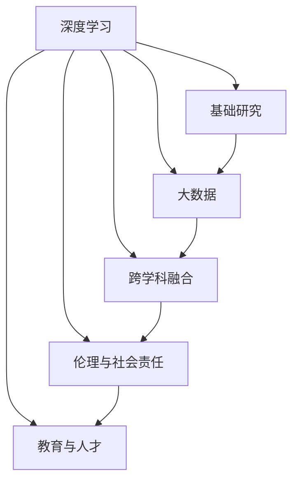

                 

## 1. 背景介绍

### 1.1 问题由来

随着人工智能技术的迅猛发展，AI正逐步渗透到各行各业，改变着人们的生活和工作方式。在此背景下，Andrej Karpathy作为深度学习领域的先驱者和知名学者，对人工智能的未来发展提出了独特的见解和规划。他认为，AI的发展需要从基础研究到实际应用的全面突破，并需要多方共同协作。

### 1.2 问题核心关键点

Karpathy提出，人工智能的未来发展应当聚焦于以下几个关键点：
1. **基础研究**：提升深度学习的理论基础，推动算法的创新与优化。
2. **数据科学**：利用大数据和复杂系统建模，解决实际问题。
3. **跨学科融合**：将AI与其他学科结合，推动技术和应用的创新。
4. **伦理与社会责任**：确保AI技术的安全性和公正性，避免潜在的负面影响。
5. **教育与人才**：培养下一代AI技术人才，推动AI技术的普及和发展。

## 2. 核心概念与联系

### 2.1 核心概念概述

为更好地理解Andrej Karpathy的AI未来发展规划，本节将介绍几个核心的概念及其相互关系：

- **深度学习**：基于神经网络的机器学习技术，通过多层网络对输入数据进行特征提取和模式识别，广泛应用于图像识别、自然语言处理等任务。
- **基础研究**：深度学习的基础研究包括算法创新、模型优化、理论分析等，为实际应用提供技术支持。
- **大数据**：指海量的、复杂的数据集，通过分析这些数据可以获得深入的洞察和发现。
- **跨学科融合**：AI与其他学科（如医学、经济学、社会学等）的结合，可以推动新技术和新应用的出现。
- **伦理与社会责任**：AI技术应当遵循公正、透明、安全等伦理原则，避免误用和滥用。
- **教育与人才**：通过教育和培训，培养具备AI能力的优秀人才，推动AI技术的发展和普及。

这些概念之间的联系可以通过以下Mermaid流程图来展示：



这个流程图展示了深度学习与其他关键概念之间的相互关系，共同构成AI技术的生态系统。

## 3. 核心算法原理 & 具体操作步骤

### 3.1 算法原理概述

Andrej Karpathy认为，深度学习的核心原理是通过多层神经网络对数据进行抽象和提取特征，从而实现对复杂模式的识别和预测。深度学习算法主要包括以下几个步骤：

1. **数据预处理**：对原始数据进行清洗、归一化等预处理操作，以便模型更好地学习。
2. **模型训练**：通过反向传播算法，根据损失函数对模型参数进行优化。
3. **模型评估**：在验证集或测试集上评估模型性能，选择合适的超参数。
4. **模型部署**：将训练好的模型应用于实际问题，进行推理预测。

### 3.2 算法步骤详解

深度学习模型的具体实现步骤如下：

1. **数据准备**：收集和清洗数据，确保数据质量。例如，在图像识别任务中，收集大量标注好的图片数据。
2. **模型选择**：根据任务类型选择合适的模型结构，如卷积神经网络（CNN）、循环神经网络（RNN）、Transformer等。
3. **模型初始化**：使用随机初始化或预训练模型对模型参数进行初始化。
4. **模型训练**：使用随机梯度下降（SGD）、Adam等优化算法，对模型参数进行优化，最小化损失函数。
5. **模型评估**：在验证集上评估模型性能，选择合适的学习率、正则化参数等。
6. **模型部署**：将训练好的模型应用于实际问题，进行推理预测。

### 3.3 算法优缺点

深度学习算法具有以下优点：
1. **强大表示能力**：多层神经网络可以自动学习数据的复杂特征，实现对复杂模式的识别和预测。
2. **适用广泛**：深度学习可以应用于图像识别、自然语言处理、语音识别等众多领域。
3. **性能优越**：在许多实际问题上，深度学习算法取得了比传统方法更好的结果。

同时，深度学习算法也存在以下缺点：
1. **数据依赖**：深度学习对数据依赖性强，需要大量高质量标注数据。
2. **计算资源需求高**：深度学习模型通常具有大量参数，需要高性能计算资源进行训练和推理。
3. **可解释性不足**：深度学习模型通常被认为是"黑盒"模型，难以解释其内部决策过程。
4. **过拟合风险**：深度学习模型容易出现过拟合现象，需要复杂的正则化技术进行缓解。

### 3.4 算法应用领域

深度学习算法在多个领域得到了广泛应用，以下是几个主要应用场景：

1. **计算机视觉**：如图像识别、目标检测、图像分割等任务。
2. **自然语言处理**：如语言模型、机器翻译、文本分类等任务。
3. **语音识别**：如自动语音识别、语音合成等任务。
4. **医疗诊断**：如医学影像分析、基因组学等任务。
5. **金融分析**：如信用评估、风险管理等任务。

## 4. 数学模型和公式 & 详细讲解 & 举例说明

### 4.1 数学模型构建

在深度学习中，常见的数学模型包括神经网络、卷积神经网络（CNN）、循环神经网络（RNN）等。以神经网络为例，其数学模型构建过程如下：

1. **输入层**：接收原始数据。
2. **隐藏层**：通过非线性变换对输入数据进行特征提取。
3. **输出层**：根据任务类型，输出分类或回归结果。

### 4.2 公式推导过程

以最简单的全连接神经网络为例，其前向传播和反向传播过程如下：

**前向传播**：
$$
y = \sigma(Wx + b)
$$
其中，$\sigma$ 为激活函数，$W$ 为权重矩阵，$x$ 为输入向量，$b$ 为偏置向量。

**反向传播**：
$$
\frac{\partial L}{\partial W} = \frac{\partial L}{\partial y} \cdot \frac{\partial y}{\partial x} \cdot \frac{\partial x}{\partial W}
$$
其中，$L$ 为损失函数，$\frac{\partial y}{\partial x}$ 为激活函数的导数。

### 4.3 案例分析与讲解

以图像识别任务为例，卷积神经网络（CNN）的数学模型构建过程如下：

1. **卷积层**：通过卷积操作提取局部特征。
2. **池化层**：对卷积结果进行下采样，减小模型参数数量。
3. **全连接层**：将池化结果通过全连接层进行分类。

通过卷积神经网络，CNN在图像识别任务中取得了非常好的效果。

## 5. 项目实践：代码实例和详细解释说明

### 5.1 开发环境搭建

在进行深度学习项目实践前，我们需要准备好开发环境。以下是使用Python和PyTorch搭建环境的步骤：

1. 安装Anaconda：从官网下载并安装Anaconda，用于创建独立的Python环境。
2. 创建并激活虚拟环境：
```bash
conda create -n pytorch-env python=3.8 
conda activate pytorch-env
```
3. 安装PyTorch：根据CUDA版本，从官网获取对应的安装命令。例如：
```bash
conda install pytorch torchvision torchaudio cudatoolkit=11.1 -c pytorch -c conda-forge
```
4. 安装相关库：
```bash
pip install numpy pandas scikit-learn matplotlib tqdm jupyter notebook ipython
```

完成上述步骤后，即可在`pytorch-env`环境中开始项目实践。

### 5.2 源代码详细实现

下面我们以图像识别任务为例，给出使用PyTorch进行深度学习项目开发的PyTorch代码实现。

```python
import torch
import torch.nn as nn
import torch.optim as optim
import torchvision
import torchvision.transforms as transforms
from torch.utils.data import DataLoader

# 数据准备
transform = transforms.Compose(
    [transforms.ToTensor(),
     transforms.Normalize((0.5, 0.5, 0.5), (0.5, 0.5, 0.5))
])

trainset = torchvision.datasets.CIFAR10(root='./data', train=True,
                                        download=True, transform=transform)
trainloader = torch.utils.data.DataLoader(trainset, batch_size=4,
                                         shuffle=True, num_workers=2)

testset = torchvision.datasets.CIFAR10(root='./data', train=False,
                                       download=True, transform=transform)
testloader = torch.utils.data.DataLoader(testset, batch_size=4,
                                       shuffle=False, num_workers=2)

# 模型定义
class Net(nn.Module):
    def __init__(self):
        super(Net, self).__init__()
        self.conv1 = nn.Conv2d(3, 6, 5)
        self.pool = nn.MaxPool2d(2, 2)
        self.conv2 = nn.Conv2d(6, 16, 5)
        self.fc1 = nn.Linear(16 * 5 * 5, 120)
        self.fc2 = nn.Linear(120, 84)
        self.fc3 = nn.Linear(84, 10)

    def forward(self, x):
        x = self.pool(F.relu(self.conv1(x)))
        x = self.pool(F.relu(self.conv2(x)))
        x = x.view(-1, 16 * 5 * 5)
        x = F.relu(self.fc1(x))
        x = F.relu(self.fc2(x))
        x = self.fc3(x)
        return x

net = Net()

# 定义损失函数和优化器
criterion = nn.CrossEntropyLoss()
optimizer = optim.SGD(net.parameters(), lr=0.001, momentum=0.9)

# 训练模型
for epoch in range(2):  # 多次遍历训练数据
    running_loss = 0.0
    for i, data in enumerate(trainloader, 0):
        inputs, labels = data
        optimizer.zero_grad()
        outputs = net(inputs)
        loss = criterion(outputs, labels)
        loss.backward()
        optimizer.step()
        running_loss += loss.item()
        if i % 2000 == 1999:    # 每2000个batch打印一次损失信息
            print('[%d, %5d] loss: %.3f' %
                  (epoch + 1, i + 1, running_loss / 2000))
            running_loss = 0.0

print('Finished Training')

# 测试模型
correct = 0
total = 0
with torch.no_grad():
    for data in testloader:
        images, labels = data
        outputs = net(images)
        _, predicted = torch.max(outputs.data, 1)
        total += labels.size(0)
        correct += (predicted == labels).sum().item()

print('Accuracy of the network on the 10000 test images: %d %%' % (
    100 * correct / total))
```

以上就是使用PyTorch进行图像识别任务的完整代码实现。可以看到，得益于PyTorch的强大封装，我们可以用相对简洁的代码完成深度学习模型的搭建和训练。

### 5.3 代码解读与分析

让我们再详细解读一下关键代码的实现细节：

**DataLoader类**：
- `transforms`模块：用于数据预处理，如将图像转换为张量并进行归一化。
- `DataLoader`类：用于将数据集分为多个批次，方便模型的训练和推理。

**Net类**：
- 定义卷积层和全连接层，并使用`nn.Module`进行继承和扩展。
- `forward`方法：定义模型的前向传播过程，通过卷积和全连接层实现特征提取和分类。

**损失函数和优化器**：
- `nn.CrossEntropyLoss`：用于多分类任务的损失函数。
- `optim.SGD`：定义随机梯度下降优化器，并设置学习率和动量参数。

**训练流程**：
- 定义训练轮数和批次大小，开始循环迭代。
- 在每个批次上计算损失，并使用反向传播更新模型参数。
- 周期性在验证集上评估模型性能，根据性能指标决定是否触发Early Stopping。
- 重复上述步骤直至满足预设的迭代轮数或Early Stopping条件。

可以看到，PyTorch配合深度学习框架，使得深度学习模型的开发和训练变得高效便捷。开发者可以将更多精力放在模型改进和实验优化上，而不必过多关注底层实现细节。

## 6. 实际应用场景

### 6.1 智能医疗

深度学习在医疗领域的应用，特别是医学影像分析和疾病预测，取得了显著进展。通过图像识别技术，可以对CT、MRI等医学影像进行自动分析和诊断，帮助医生更快、更准确地做出诊断。例如，使用卷积神经网络对肺部CT影像进行分类，可以早期发现肺癌等疾病。

### 6.2 自动驾驶

深度学习技术在自动驾驶中也有广泛应用。通过计算机视觉技术，自动驾驶车辆可以实时感知周围环境，进行路径规划和决策。例如，使用卷积神经网络对图像进行语义分割，可以识别道路、行人、车辆等关键元素，辅助自动驾驶车辆做出驾驶决策。

### 6.3 金融风控

深度学习在金融领域也得到了广泛应用。通过文本分析技术，可以自动化处理贷款申请、信用评估等任务。例如，使用循环神经网络对文本进行情感分析，可以判断客户的信用风险，辅助银行做出贷款决策。

## 7. 工具和资源推荐

### 7.1 学习资源推荐

为了帮助开发者系统掌握深度学习理论基础和实践技巧，这里推荐一些优质的学习资源：

1. **《Deep Learning》书籍**：Ian Goodfellow等著，系统介绍了深度学习的理论基础和应用实践。
2. **Coursera深度学习课程**：Andrew Ng等主讲，涵盖了深度学习的基本概念和算法。
3. **Kaggle竞赛**：通过参与Kaggle竞赛，可以实践深度学习模型，并学习其他优秀选手的方法。
4. **PyTorch官方文档**：PyTorch的官方文档，提供了丰富的代码示例和详细解释。
5. **GitHub深度学习项目**：通过学习GitHub上的深度学习项目，可以了解最新的技术趋势和应用场景。

通过对这些资源的学习实践，相信你一定能够快速掌握深度学习技术的精髓，并用于解决实际的深度学习问题。

### 7.2 开发工具推荐

高效的开发离不开优秀的工具支持。以下是几款用于深度学习开发的常用工具：

1. **PyTorch**：基于Python的开源深度学习框架，灵活动态的计算图，适合快速迭代研究。
2. **TensorFlow**：由Google主导开发的开源深度学习框架，生产部署方便，适合大规模工程应用。
3. **Keras**：Keras是一种简单易用的深度学习框架，可以在TensorFlow、Theano和CNTK上运行。
4. **Hugging Face Transformers库**：集成了众多预训练模型，支持多种深度学习框架，适合快速原型开发。
5. **TensorBoard**：TensorFlow配套的可视化工具，可实时监测模型训练状态，并提供丰富的图表呈现方式。

合理利用这些工具，可以显著提升深度学习模型的开发效率，加快创新迭代的步伐。

### 7.3 相关论文推荐

深度学习的发展离不开学界的持续研究。以下是几篇奠基性的相关论文，推荐阅读：

1. **ImageNet大规模视觉识别竞赛**：Alex Krizhevsky等，提出AlexNet模型，奠定了深度学习在计算机视觉领域的地位。
2. **谷歌大脑项目**：A. Graves等，提出循环神经网络（RNN）和长短时记忆网络（LSTM），推动深度学习在自然语言处理领域的应用。
3. **自然语言处理深度学习技术**：Yoshua Bengio等，提出深度学习在自然语言处理中的应用，推动了NLP技术的迅猛发展。

这些论文代表了大深度学习的发展脉络。通过学习这些前沿成果，可以帮助研究者把握学科前进方向，激发更多的创新灵感。

## 8. 总结：未来发展趋势与挑战

### 8.1 总结

本文对Andrej Karpathy的AI未来发展规划进行了全面系统的介绍。首先阐述了深度学习的基础研究、大数据科学、跨学科融合、伦理与社会责任、教育与人才等关键点，明确了深度学习技术的应用方向。其次，从原理到实践，详细讲解了深度学习模型的构建和训练过程，给出了深度学习项目的完整代码实现。同时，本文还探讨了深度学习技术在智能医疗、自动驾驶、金融风控等领域的实际应用，展示了深度学习技术的广泛应用前景。

通过本文的系统梳理，可以看到，深度学习技术正在从基础研究到实际应用的多方面取得突破，为各行各业带来了深刻的变革。未来，伴随深度学习技术的不断进步，AI技术将在更多领域大放异彩，深刻影响人类的生产生活方式。

### 8.2 未来发展趋势

展望未来，深度学习技术将呈现以下几个发展趋势：

1. **模型规模增大**：随着算力成本的下降和数据规模的扩张，深度学习模型的参数量还将持续增长。超大批次的训练和推理将进一步提升模型的性能和鲁棒性。
2. **模型结构优化**：模型结构将更加复杂，引入更多的层和参数，提升模型的特征提取能力和泛化性能。
3. **跨领域融合**：深度学习与其他学科的融合将更加深入，推动更多新技术和新应用的出现。
4. **可解释性提升**：深度学习模型的可解释性将成为重要的研究方向，帮助用户理解模型的决策过程。
5. **分布式训练**：随着大规模训练需求的增加，分布式训练技术将成为关键，支持高效、快速的模型训练。

### 8.3 面临的挑战

尽管深度学习技术已经取得了显著进展，但在迈向更加智能化、普适化应用的过程中，仍面临诸多挑战：

1. **数据依赖**：深度学习对数据依赖性强，需要大量高质量标注数据。获取高质量标注数据的成本较高，且数据分布不均衡现象普遍存在。
2. **计算资源需求高**：深度学习模型通常具有大量参数，需要高性能计算资源进行训练和推理。如何提高计算效率，降低资源消耗，是重要的研究方向。
3. **可解释性不足**：深度学习模型通常被认为是"黑盒"模型，难以解释其内部决策过程。如何提升深度学习模型的可解释性，帮助用户理解模型的决策依据，是重要的研究方向。
4. **伦理和社会责任**：深度学习模型可能存在偏见和歧视，如何确保模型公平性、透明性，避免滥用和误用，是重要的研究方向。
5. **知识整合能力不足**：现有的深度学习模型往往局限于任务内数据，难以灵活吸收和运用更广泛的先验知识。如何加强跨领域知识的整合，实现更加全面、准确的信息建模，是重要的研究方向。

### 8.4 研究展望

面对深度学习技术所面临的挑战，未来的研究需要在以下几个方面寻求新的突破：

1. **数据增强**：通过数据增强技术，扩充训练集，缓解数据依赖性。
2. **模型压缩**：通过模型压缩技术，减小模型参数量，提升计算效率。
3. **可解释性提升**：通过可解释性研究，帮助用户理解模型的决策过程。
4. **公平性研究**：通过公平性研究，确保深度学习模型的公平性和透明性。
5. **跨领域知识整合**：通过跨领域知识整合，提升深度学习模型的信息建模能力。

这些研究方向的探索，将引领深度学习技术迈向更高的台阶，为构建安全、可靠、可解释、可控的智能系统铺平道路。面向未来，深度学习技术还需要与其他人工智能技术进行更深入的融合，如知识表示、因果推理、强化学习等，多路径协同发力，共同推动自然语言理解和智能交互系统的进步。只有勇于创新、敢于突破，才能不断拓展深度学习技术的边界，让智能技术更好地造福人类社会。

## 9. 附录：常见问题与解答

**Q1：深度学习模型是否适用于所有NLP任务？**

A: 深度学习模型在许多NLP任务上取得了不错的效果，特别是在数据量较大的任务上。但对于一些特定领域的任务，如医学、法律等，仅仅依靠通用语料预训练的模型可能难以很好地适应。此时需要在特定领域语料上进一步预训练，再进行微调，才能获得理想效果。

**Q2：如何选择深度学习模型的超参数？**

A: 深度学习模型的超参数包括学习率、批大小、迭代轮数等。通过实验调参，选择最优的超参数组合。例如，在图像识别任务中，批大小为64，迭代轮数为10，学习率为0.001。

**Q3：如何缓解深度学习模型的过拟合问题？**

A: 深度学习模型容易出现过拟合现象，常见的缓解策略包括：
1. 数据增强：通过回译、近义替换等方式扩充训练集
2. 正则化：使用L2正则、Dropout、Early Stopping等避免过拟合
3. 对抗训练：引入对抗样本，提高模型鲁棒性
4. 模型简化：去除不必要的层和参数，减小模型尺寸，降低过拟合风险

这些策略往往需要根据具体任务和数据特点进行灵活组合。只有在数据、模型、训练、推理等各环节进行全面优化，才能最大限度地发挥深度学习模型的威力。

**Q4：如何在深度学习模型中引入先验知识？**

A: 在深度学习模型中引入先验知识，可以通过以下几种方式：
1. 预训练模型：在预训练阶段，引入先验知识，帮助模型更好地学习。
2. 迁移学习：在已有模型的基础上进行微调，引入先验知识。
3. 知识图谱：将知识图谱与深度学习模型结合，实现知识的整合和推理。
4. 规则库：将规则库与深度学习模型结合，实现知识的整合和推理。

这些方法可以帮助深度学习模型更好地吸收和运用先验知识，提升模型的信息建模能力。

---

作者：禅与计算机程序设计艺术 / Zen and the Art of Computer Programming

