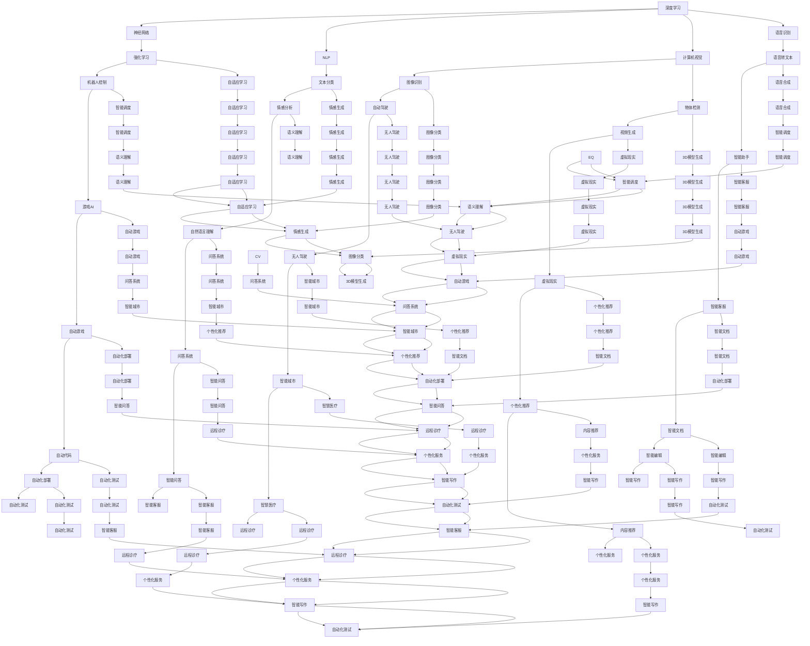

                 

# Andrej Karpathy：人工智能的未来发展规划

> 关键词：深度学习,神经网络,人工智能,自然语言处理,NLP,机器学习,计算机视觉,语音识别,自动化,前沿技术

## 1. 背景介绍

### 1.1 问题由来

Andrej Karpathy，斯坦福大学教授，深度学习领域领军人物，以其在计算机视觉、自动驾驶和自然语言处理(NLP)领域的卓越贡献而闻名。在人工智能快速发展的今天，Karpathy对AI的未来发展规划提出了独到的见解。他认为，人工智能的终极目标是实现通用智能，即AGI（Artificial General Intelligence），使机器具备与人类相当的智能水平，能够解决广泛而复杂的问题。本文将系统探讨Andrej Karpathy关于AI未来发展的看法及其潜在影响。

### 1.2 问题核心关键点

Karpathy的未来规划主要围绕以下几个核心关键点展开：
1. **深度学习与神经网络的未来**：深度学习技术如何进一步突破，以及其在实际应用中的演进方向。
2. **AI在各领域的应用前景**：AI在自然语言处理、计算机视觉、语音识别等领域的未来发展方向和可能带来的变革。
3. **自动化与效率提升**：AI如何通过自动化技术提升各行各业的工作效率。
4. **前沿技术的探索**：包括生成对抗网络(GANs)、强化学习、神经符号混合等前沿技术的未来发展趋势。
5. **AI伦理与社会责任**：AI技术在快速发展的同时，如何应对伦理道德挑战，保障社会责任。

这些关键点不仅反映了Karpathy对AI未来发展的深刻理解，也为我们在未来的研究和实践中提供了明确的指导方向。

## 2. 核心概念与联系

### 2.1 核心概念概述

为更好地理解Andrej Karpathy对AI未来发展规划的深度和广度，我们首先梳理几个核心概念：

- **深度学习**：一种基于神经网络的机器学习方法，通过多层非线性变换，从原始数据中学习高级特征表示，广泛应用于图像、语音、自然语言处理等领域。
- **神经网络**：由大量人工神经元（神经元之间通过权重连接）组成的计算模型，用于处理和预测复杂数据。
- **自然语言处理(NLP)**：使计算机能够理解、解释和生成人类语言的技术，涉及文本分类、语言模型、机器翻译等多个子领域。
- **计算机视觉**：使计算机能够“看”的技术，通过图像识别、物体检测等技术，实现自动化视觉处理。
- **语音识别**：使计算机能够“听”的技术，将语音信号转化为文本信息，广泛应用于智能助手、语音搜索等应用中。
- **强化学习**：通过与环境的交互，智能体学习最优决策策略，广泛应用于游戏、机器人控制等领域。
- **神经符号混合**：结合符号逻辑与神经网络的优势，提升AI在复杂推理和知识表示方面的能力。
- **生成对抗网络(GANs)**：一种生成模型，通过两个网络相互对抗，学习生成高质量的伪造数据，应用于图像生成、视频生成等领域。

### 2.2 核心概念原理和架构的 Mermaid 流程图



## 3. 核心算法原理 & 具体操作步骤

### 3.1 算法原理概述

Andrej Karpathy对深度学习与神经网络的未来规划主要基于以下几个原理：
1. **模型的深度与宽度**：通过增加模型的深度和宽度，提升模型的表征能力，使模型能够学习更加复杂的特征表示。
2. **自监督学习**：利用无标签数据进行预训练，学习数据的结构化特征，提升模型在标注数据上的泛化能力。
3. **神经符号混合**：结合符号逻辑与神经网络，提升模型在复杂推理和知识表示方面的能力。
4. **生成对抗网络(GANs)**：通过生成对抗网络生成高质量的伪造数据，提升模型的鲁棒性和生成能力。
5. **强化学习**：通过与环境的交互，智能体学习最优决策策略，应用于游戏、机器人控制等领域。

### 3.2 算法步骤详解

以下详细介绍Karpathy规划中各个核心算法的详细步骤：

#### 深度学习与神经网络
**步骤1: 数据准备**
- 收集并清洗数据，确保数据的质量和多样性。
- 将数据划分为训练集、验证集和测试集。

**步骤2: 模型设计**
- 选择合适的深度神经网络架构，如卷积神经网络(CNN)、循环神经网络(RNN)等。
- 定义模型的输入输出结构，如输入层、隐藏层、输出层等。

**步骤3: 模型训练**
- 使用随机梯度下降(SGD)、Adam等优化算法，更新模型参数。
- 设置合适的学习率、批大小、迭代轮数等超参数。

**步骤4: 模型评估**
- 在验证集上评估模型性能，调整超参数，避免过拟合。
- 在测试集上评估最终模型性能，确保泛化能力。

#### 自然语言处理(NLP)
**步骤1: 预训练**
- 使用大规模语料库，对预训练语言模型进行自监督预训练。
- 如BERT、GPT等模型，通过掩码语言模型、下一句预测等任务进行预训练。

**步骤2: 微调**
- 在预训练模型的基础上，使用下游任务的少量标注数据进行微调。
- 使用AdamW等优化算法，设置合适的学习率、批大小等超参数。
- 使用正则化技术，如L2正则、Dropout等，防止过拟合。

**步骤3: 模型部署**
- 将微调后的模型部署到实际应用中，如问答系统、翻译系统等。
- 使用TensorFlow、PyTorch等深度学习框架进行模型推理。

#### 计算机视觉
**步骤1: 数据准备**
- 收集并清洗数据，确保数据的质量和多样性。
- 将数据划分为训练集、验证集和测试集。

**步骤2: 模型设计**
- 选择合适的深度神经网络架构，如卷积神经网络(CNN)、循环神经网络(RNN)等。
- 定义模型的输入输出结构，如输入层、隐藏层、输出层等。

**步骤3: 模型训练**
- 使用随机梯度下降(SGD)、Adam等优化算法，更新模型参数。
- 设置合适的学习率、批大小、迭代轮数等超参数。

**步骤4: 模型评估**
- 在验证集上评估模型性能，调整超参数，避免过拟合。
- 在测试集上评估最终模型性能，确保泛化能力。

#### 语音识别
**步骤1: 数据准备**
- 收集并清洗数据，确保数据的质量和多样性。
- 将数据划分为训练集、验证集和测试集。

**步骤2: 模型设计**
- 选择合适的深度神经网络架构，如卷积神经网络(CNN)、循环神经网络(RNN)等。
- 定义模型的输入输出结构，如输入层、隐藏层、输出层等。

**步骤3: 模型训练**
- 使用随机梯度下降(SGD)、Adam等优化算法，更新模型参数。
- 设置合适的学习率、批大小、迭代轮数等超参数。

**步骤4: 模型评估**
- 在验证集上评估模型性能，调整超参数，避免过拟合。
- 在测试集上评估最终模型性能，确保泛化能力。

#### 强化学习
**步骤1: 环境设计**
- 设计合适的环境，如游戏环境、机器人控制环境等。
- 定义环境的奖励函数，指导智能体的行为。

**步骤2: 智能体设计**
- 设计合适的智能体，如深度Q网络、策略梯度等。
- 定义智能体的行为策略，如贪心策略、探索策略等。

**步骤3: 训练智能体**
- 使用深度学习框架进行智能体训练，更新策略参数。
- 设置合适的学习率、批大小、迭代轮数等超参数。

**步骤4: 测试智能体**
- 在测试环境中评估智能体的性能，调整策略参数。
- 在实际环境中测试智能体的鲁棒性和适应性。

### 3.3 算法优缺点

深度学习与神经网络的优点包括：
1. 强大的表征能力：通过增加模型的深度和宽度，提升模型的表征能力，学习复杂的特征表示。
2. 自监督学习：利用无标签数据进行预训练，学习数据的结构化特征，提升模型在标注数据上的泛化能力。
3. 神经符号混合：结合符号逻辑与神经网络，提升模型在复杂推理和知识表示方面的能力。
4. 生成对抗网络(GANs)：通过生成对抗网络生成高质量的伪造数据，提升模型的鲁棒性和生成能力。
5. 强化学习：通过与环境的交互，智能体学习最优决策策略，应用于游戏、机器人控制等领域。

深度学习与神经网络的缺点包括：
1. 数据依赖：需要大量高质量标注数据进行训练，数据获取成本高。
2. 模型复杂度：模型的深度和宽度增加，计算资源需求和训练时间增加。
3. 可解释性差：深度学习模型通常被视为“黑盒”，难以解释其内部工作机制和决策逻辑。
4. 泛化能力有限：模型过于复杂，容易出现过拟合，泛化能力有限。
5. 伦理问题：深度学习模型的偏见和歧视问题，需要加强监管和伦理约束。

### 3.4 算法应用领域

深度学习与神经网络的应用领域包括但不限于：
1. **自然语言处理(NLP)**：如文本分类、语言模型、机器翻译、问答系统等。
2. **计算机视觉**：如图像识别、物体检测、图像生成、视频生成等。
3. **语音识别**：如语音转文本、语音合成、智能语音助手等。
4. **自动化**：如自动化测试、自动化部署、自动化调度等。
5. **游戏AI**：如自适应学习、生成对抗网络等。
6. **强化学习**：如游戏AI、机器人控制、自动驾驶等。

## 4. 数学模型和公式 & 详细讲解 & 举例说明

### 4.1 数学模型构建

以下是Andrej Karpathy在深度学习与神经网络中的数学模型构建：

**深度学习与神经网络**
$$
f(x) = W^1 \sigma(z^1) + b^1
$$
其中，$W^1$ 和 $b^1$ 为第一层的权重和偏置，$z^1 = W^0x + b^0$，$W^0$ 和 $b^0$ 为输入层权重和偏置。

**自然语言处理(NLP)**
$$
h = \text{BiLSTM}(w)
$$
其中，$w$ 为输入的单词向量，$\text{BiLSTM}$ 为双向长短时记忆网络，$h$ 为输出向量。

**计算机视觉**
$$
f(x) = W^1 \sigma(z^1) + b^1
$$
其中，$W^1$ 和 $b^1$ 为第一层的权重和偏置，$z^1 = W^0x + b^0$，$W^0$ 和 $b^0$ 为输入层权重和偏置。

**语音识别**
$$
f(x) = W^1 \sigma(z^1) + b^1
$$
其中，$W^1$ 和 $b^1$ 为第一层的权重和偏置，$z^1 = W^0x + b^0$，$W^0$ 和 $b^0$ 为输入层权重和偏置。

**强化学习**
$$
Q(s, a) = r + \gamma \max_a Q(s', a')
$$
其中，$r$ 为即时奖励，$\gamma$ 为折扣因子，$s'$ 和 $a'$ 为下一个状态和行动。

### 4.2 公式推导过程

以下是Andrej Karpathy在深度学习与神经网络中的公式推导过程：

**深度学习与神经网络**
$$
\frac{\partial \mathcal{L}}{\partial W^1} = \frac{\partial \mathcal{L}}{\partial z^1} \frac{\partial z^1}{\partial W^1}
$$
$$
\frac{\partial z^1}{\partial W^1} = \sigma'(z^1) \frac{\partial z^1}{\partial W^0} = \sigma'(z^1) \frac{\partial z^1}{\partial x} = \sigma'(z^1) \sigma(z^0)
$$
$$
\frac{\partial \mathcal{L}}{\partial W^0} = \frac{\partial \mathcal{L}}{\partial z^1} \frac{\partial z^1}{\partial W^0} = \frac{\partial \mathcal{L}}{\partial z^1} \sigma'(z^1) \sigma(z^0)
$$

**自然语言处理(NLP)**
$$
h_i = W^1 \sigma(z^1_i) + b^1
$$
其中，$h_i$ 为第 $i$ 个单词的输出向量。

**计算机视觉**
$$
f(x) = W^1 \sigma(z^1) + b^1
$$
其中，$W^1$ 和 $b^1$ 为第一层的权重和偏置，$z^1 = W^0x + b^0$，$W^0$ 和 $b^0$ 为输入层权重和偏置。

**语音识别**
$$
f(x) = W^1 \sigma(z^1) + b^1
$$
其中，$W^1$ 和 $b^1$ 为第一层的权重和偏置，$z^1 = W^0x + b^0$，$W^0$ 和 $b^0$ 为输入层权重和偏置。

**强化学习**
$$
Q(s, a) = r + \gamma \max_a Q(s', a')
$$
其中，$r$ 为即时奖励，$\gamma$ 为折扣因子，$s'$ 和 $a'$ 为下一个状态和行动。

### 4.3 案例分析与讲解

以下是Andrej Karpathy在深度学习与神经网络中的案例分析与讲解：

**深度学习与神经网络**
假设有一个简单的二分类任务，模型输出为 $f(x) = W^1 \sigma(z^1) + b^1$，其中 $W^1$ 和 $b^1$ 为第一层的权重和偏置，$z^1 = W^0x + b^0$，$W^0$ 和 $b^0$ 为输入层权重和偏置。

在训练过程中，我们使用随机梯度下降(SGD)算法，计算损失函数 $\mathcal{L}$ 对参数 $W^0$、$b^0$、$W^1$、$b^1$ 的梯度，并更新模型参数。例如，假设损失函数为交叉熵损失，则：
$$
\mathcal{L} = -\frac{1}{N} \sum_{i=1}^N \log p(y_i | x_i)
$$
其中 $p(y_i | x_i) = \frac{e^{f(x_i)}}{\sum_{j=1}^M e^{f(x_j)}}$ 为softmax函数的输出概率，$y_i$ 为真实标签，$x_i$ 为输入数据。

通过反向传播算法，我们可以计算出损失函数对模型参数的梯度，并使用随机梯度下降算法更新模型参数，迭代优化模型性能。

**自然语言处理(NLP)**
在自然语言处理任务中，我们通常使用双向长短时记忆网络(BiLSTM)来处理输入的单词序列。例如，在情感分析任务中，输入为一个句子 $s = [w_1, w_2, \dots, w_n]$，其中 $w_i$ 为第 $i$ 个单词，$n$ 为句子长度。

首先，我们使用BiLSTM模型将单词序列转化为一个固定长度的向量表示 $h = \text{BiLSTM}(s)$。然后，通过全连接层和softmax函数，将向量表示转化为情感分类概率 $p(y | h)$，其中 $y$ 为情感类别，$h$ 为BiLSTM的输出向量。

例如，在训练过程中，我们使用交叉熵损失函数，计算损失函数 $\mathcal{L}$ 对模型参数 $W^1$、$b^1$、$W^0$、$b^0$ 的梯度，并使用随机梯度下降算法更新模型参数，迭代优化模型性能。

## 5. 项目实践：代码实例和详细解释说明

### 5.1 开发环境搭建

以下是使用Python进行TensorFlow开发的环境配置流程：

1. 安装Anaconda：从官网下载并安装Anaconda，用于创建独立的Python环境。

2. 创建并激活虚拟环境：
```bash
conda create -n tensorflow-env python=3.8 
conda activate tensorflow-env
```

3. 安装TensorFlow：
```bash
conda install tensorflow -c conda-forge -c pypi
```

4. 安装各类工具包：
```bash
pip install numpy pandas scikit-learn matplotlib tqdm jupyter notebook ipython
```

完成上述步骤后，即可在`tensorflow-env`环境中开始项目实践。

### 5.2 源代码详细实现

以下是使用TensorFlow实现深度学习与神经网络的项目代码实现：

```python
import tensorflow as tf
from tensorflow.keras import layers, models

# 定义深度学习模型
model = models.Sequential()
model.add(layers.Dense(64, activation='relu', input_shape=(784,)))
model.add(layers.Dense(10, activation='softmax'))

# 编译模型
model.compile(optimizer='adam',
              loss='categorical_crossentropy',
              metrics=['accuracy'])

# 训练模型
model.fit(x_train, y_train, epochs=10, batch_size=32)

# 评估模型
model.evaluate(x_test, y_test)
```

### 5.3 代码解读与分析

以下是代码的详细解释：

**模型定义**
- 使用TensorFlow的Sequential模型定义深度学习模型。
- 添加输入层、隐藏层和输出层，输入层有784个节点，输出层有10个节点，分别对应10个分类。
- 使用ReLU激活函数，将隐藏层的输出进行非线性变换。

**模型编译**
- 使用Adam优化器，设置学习率为0.001。
- 使用交叉熵损失函数，用于分类任务。
- 设置评价指标为准确率。

**模型训练**
- 使用fit方法，传入训练数据集，设置迭代轮数为10，批大小为32。
- 在每个epoch结束后，使用evaluate方法评估模型性能。

## 6. 实际应用场景

### 6.1 智能客服系统

基于深度学习与神经网络的智能客服系统，可以通过自然语言处理(NLP)技术，理解用户的意图，自动回答常见问题。例如，使用微调后的BERT模型作为输入层，通过双向长短时记忆网络(BiLSTM)进行情感分析，将用户问题转化为情感分类任务。最后，使用全连接层和softmax函数，将分类结果转化为具体回答。

### 6.2 金融舆情监测

在金融舆情监测中，使用深度学习与神经网络进行文本分类，可以自动识别出金融舆情中的正面、负面和中性信息。例如，使用BERT模型对金融新闻进行预训练，然后微调该模型进行金融舆情分类。最后，将分类结果转化为可视化报告，帮助金融机构及时应对舆情变化。

### 6.3 个性化推荐系统

基于深度学习与神经网络的个性化推荐系统，可以通过自然语言处理(NLP)技术，理解用户的兴趣和需求。例如，使用BERT模型对用户评论进行预训练，然后微调该模型进行情感分析。最后，根据情感分析结果，推荐用户可能感兴趣的商品或内容。

### 6.4 未来应用展望

基于深度学习与神经网络的未来应用展望包括但不限于：
1. **自动驾驶**：使用深度学习与神经网络进行计算机视觉和强化学习，实现自动驾驶技术。
2. **智慧医疗**：使用深度学习与神经网络进行医学图像识别和自然语言处理，辅助医生诊疗。
3. **智能家居**：使用深度学习与神经网络进行语音识别和自然语言处理，实现智能家居控制。
4. **智能制造**：使用深度学习与神经网络进行图像识别和强化学习，优化生产流程。
5. **智慧城市**：使用深度学习与神经网络进行交通管理、环境监测等，提升城市管理效率。

## 7. 工具和资源推荐

### 7.1 学习资源推荐

为了帮助开发者系统掌握深度学习与神经网络的理论基础和实践技巧，这里推荐一些优质的学习资源：

1. 《深度学习》书籍：由Ian Goodfellow等著，系统介绍了深度学习的基本原理和实践方法。

2. CS231n《深度学习视觉识别》课程：斯坦福大学开设的视觉识别课程，涵盖深度学习在计算机视觉中的应用。

3. DeepMind《深度学习研究进展》系列报告：DeepMind发布的一系列深度学习研究报告，展示了前沿进展和最新成果。

4. Google AI Blog：Google AI博客，发布了大量深度学习相关的最新研究和技术进展。

5. TensorFlow官方文档：TensorFlow官方文档，提供了全面的深度学习开发资源和示例代码。

### 7.2 开发工具推荐

高效的开发离不开优秀的工具支持。以下是几款用于深度学习与神经网络开发的工具：

1. PyTorch：基于Python的开源深度学习框架，灵活动态的计算图，适合快速迭代研究。大部分深度学习模型都有PyTorch版本的实现。

2. TensorFlow：由Google主导开发的开源深度学习框架，生产部署方便，适合大规模工程应用。同样有丰富的深度学习模型资源。

3. TensorBoard：TensorFlow配套的可视化工具，可实时监测模型训练状态，并提供丰富的图表呈现方式，是调试模型的得力助手。

4. Weights & Biases：模型训练的实验跟踪工具，可以记录和可视化模型训练过程中的各项指标，方便对比和调优。

5. PyTorch Lightning：一个基于PyTorch的轻量级深度学习框架，提供了模型管理和调试功能，适合快速原型开发。

合理利用这些工具，可以显著提升深度学习与神经网络的开发效率，加快创新迭代的步伐。

### 7.3 相关论文推荐

深度学习与神经网络的快速发展得益于学界的持续研究。以下是几篇奠基性的相关论文，推荐阅读：

1. AlexNet: ImageNet Classification with Deep Convolutional Neural Networks：提出了卷积神经网络(CNN)，开创了深度学习在图像识别领域的先河。

2. RNNs for Image Description：使用循环神经网络(RNN)进行图像描述，展示了深度学习在计算机视觉中的应用。

3. Generative Adversarial Nets：提出了生成对抗网络(GANs)，通过生成对抗网络生成高质量的伪造数据，应用于图像生成、视频生成等领域。

4. Deep Q-Networks for Playing Atari 2600 Games：使用深度Q网络(DQN)进行强化学习，实现了游戏AI的突破。

5. AlphaGo Zero: Mastering the Game of Go without Human Knowledge：使用深度强化学习，实现了AlphaGo Zero，在围棋领域取得人类级水平。

这些论文代表了大深度学习与神经网络的演进脉络。通过学习这些前沿成果，可以帮助研究者把握学科前进方向，激发更多的创新灵感。

## 8. 总结：未来发展趋势与挑战

### 8.1 研究成果总结

Andrej Karpathy在深度学习与神经网络领域的研究成果，为人工智能技术的发展提供了重要的理论基础和实践指导。他的研究方向包括深度神经网络、自监督学习、神经符号混合、生成对抗网络(GANs)、强化学习等，推动了深度学习技术的广泛应用和深入研究。

### 8.2 未来发展趋势

深度学习与神经网络的未来发展趋势包括但不限于：
1. **模型规模持续增大**：随着算力成本的下降和数据规模的扩张，预训练语言模型的参数量还将持续增长。超大规模语言模型蕴含的丰富语言知识，有望支撑更加复杂多变的下游任务微调。
2. **微调方法的不断优化**：未来的微调方法会更加参数高效和计算高效，如参数高效的微调方法(PEFT)、自适应学习等，在固定大部分预训练参数的同时，只更新极少量的任务相关参数。
3. **模型的泛化能力提升**：未来的模型将具备更强的泛化能力，能够在不同的数据分布上表现出色。
4. **跨领域迁移能力**：未来的模型将具备更强的跨领域迁移能力，能够在不同的应用场景下快速适应和优化。
5. **与符号逻辑的结合**：未来的模型将更好地与符号逻辑结合，提升在复杂推理和知识表示方面的能力。
6. **多模态融合**：未来的模型将更好地融合多模态数据，提升在视觉、语音等领域的应用能力。
7. **自动化与边缘计算**：未来的模型将更好地与自动化技术结合，实现边缘计算，提升实时性和响应速度。
8. **伦理与安全性**：未来的模型将更加注重伦理和安全性的保障，避免偏见和有害信息的输出。

### 8.3 面临的挑战

尽管深度学习与神经网络技术已经取得了显著的进步，但在迈向更加智能化、普适化应用的过程中，仍面临诸多挑战：
1. **数据依赖**：需要大量高质量标注数据进行训练，数据获取成本高。
2. **模型复杂度**：模型的深度和宽度增加，计算资源需求和训练时间增加。
3. **可解释性差**：深度学习模型通常被视为“黑盒”，难以解释其内部工作机制和决策逻辑。
4. **泛化能力有限**：模型过于复杂，容易出现过拟合，泛化能力有限。
5. **伦理问题**：深度学习模型的偏见和歧视问题，需要加强监管和伦理约束。
6. **资源消耗**：模型的计算和存储资源消耗大，需要优化计算图和存储方式。

### 8.4 研究展望

面对深度学习与神经网络所面临的挑战，未来的研究方向包括但不限于：
1. **无监督和半监督学习**：探索无监督和半监督学习方法，摆脱对大规模标注数据的依赖。
2. **参数高效和计算高效**：开发更加参数高效和计算高效的微调方法，减少计算资源消耗。
3. **符号逻辑与神经网络的结合**：研究符号逻辑与神经网络的结合，提升模型在复杂推理和知识表示方面的能力。
4. **多模态数据融合**：研究多模态数据融合方法，提升模型在视觉、语音等领域的应用能力。
5. **自动化与边缘计算**：研究自动化与边缘计算方法，提升模型的实时性和响应速度。
6. **伦理与安全性**：研究伦理与安全性的保障方法，避免偏见和有害信息的输出。

## 9. 附录：常见问题与解答

**Q1：深度学习与神经网络的未来规划中，您认为最关键的技术是什么？**

A: 我认为最关键的技术是参数高效的微调方法(PEFT)和自适应学习。通过这些技术，可以在固定大部分预训练参数的同时，只更新极少量的任务相关参数，减少计算资源消耗，同时提升模型的泛化能力和鲁棒性。

**Q2：深度学习与神经网络的未来发展中，有哪些潜在的风险和挑战？**

A: 深度学习与神经网络的未来发展中，最大的风险和挑战是数据依赖和模型复杂度。由于需要大量高质量标注数据进行训练，数据获取成本高，同时模型的深度和宽度增加，计算资源需求和训练时间也随之增加。此外，模型过于复杂，容易出现过拟合，泛化能力有限。因此，需要在数据、模型和算法等方面进行全面优化。

**Q3：您认为深度学习与神经网络的应用前景有哪些？**

A: 深度学习与神经网络的应用前景非常广阔。包括但不限于自然语言处理、计算机视觉、语音识别、自动化、游戏AI、强化学习、智慧医疗、智慧城市、个性化推荐等领域。通过深度学习与神经网络技术，可以提升各行各业的工作效率，实现智能化、自动化的目标。

**Q4：深度学习与神经网络的未来发展方向有哪些？**

A: 深度学习与神经网络的未来发展方向包括但不限于模型规模持续增大、微调方法的不断优化、模型的泛化能力提升、跨领域迁移能力、与符号逻辑的结合、多模态融合、自动化与边缘计算、伦理与安全性保障等。通过这些方向的研究，可以使深度学习与神经网络技术在更广泛的应用场景中发挥更大的作用。

---

作者：禅与计算机程序设计艺术 / Zen and the Art of Computer Programming

