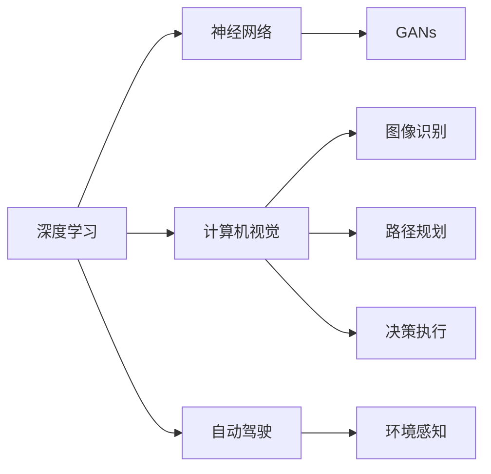

                 

# Andrej Karpathy：人工智能的未来发展规划

## 1. 背景介绍

Andrej Karpathy是人工智能领域的一位杰出专家，斯坦福大学计算机视觉实验室主任，Facebook AI Research (FAIR) 实验室的高级研究员。他对人工智能的未来发展有着独到的见解，尤其在计算机视觉、自动驾驶和深度学习等领域有着深刻的影响。在这篇博客中，我们将基于Andrej Karpathy的最新演讲和著作，探讨人工智能未来的发展规划。

Andrej Karpathy的研究跨越了计算机视觉、深度学习、自动驾驶等多个领域，其发表的论文多次获得机器学习领域最高奖项，对人工智能的发展产生了深远影响。他的工作不仅推动了AI技术的进步，还指导着新一代AI研究者，影响了未来技术的发展方向。

## 2. 核心概念与联系

为了更好地理解Andrej Karpathy对AI未来发展规划的见解，我们将介绍几个核心概念及其相互联系。

### 2.1 核心概念概述

1. **深度学习与神经网络**：深度学习是一种机器学习方法，通过构建神经网络实现端到端的自动学习。神经网络由多层神经元组成，通过前向传播和反向传播训练模型，可以用于图像识别、语音识别、自然语言处理等任务。

2. **计算机视觉**：计算机视觉是指让计算机理解和处理图像和视频，是人工智能领域的重要分支。通过训练深度学习模型，计算机可以识别物体、场景、动作等，并在实际应用中发挥作用。

3. **自动驾驶**：自动驾驶技术是指利用计算机视觉、深度学习等技术，使车辆能够自主驾驶，从而减少交通事故，提升交通效率。自动驾驶涉及环境感知、路径规划、决策执行等多个环节。

4. **生成对抗网络（GANs）**：GANs是一种生成模型，由生成器和判别器两个神经网络组成。生成器用于生成假数据，判别器用于区分真数据和假数据。通过对抗训练，GANs可以生成逼真的图像、音频、视频等。

5. **强化学习（RL）**：强化学习是一种机器学习范式，通过与环境的交互，智能体学习最优策略以最大化奖励。在自动驾驶、游戏AI等领域，强化学习发挥了重要作用。

### 2.2 核心概念原理和架构的 Mermaid 流程图

### 2.3 核心概念之间的联系

以上概念之间存在紧密的联系，共同构成了人工智能未来的技术框架：

- 深度学习和神经网络为计算机视觉、自动驾驶等提供了强大的计算工具，使其能够实现端到端的自动学习。
- 计算机视觉是自动驾驶的基础，使得车辆能够感知周围环境，进行路径规划和决策。
- GANs可以用于生成逼真图像，辅助计算机视觉和自动驾驶的训练。
- 强化学习用于训练自动驾驶车辆，使车辆能够在复杂环境中自主决策。

Andrej Karpathy的研究在这些领域均有重要贡献，如其在计算机视觉领域的图像生成、图像分割和语义理解技术，在自动驾驶领域的感知、决策和控制技术等。

## 3. 核心算法原理 & 具体操作步骤

### 3.1 算法原理概述

深度学习算法通过构建神经网络，实现对数据的高效学习和表示。其核心思想是通过反向传播算法优化网络参数，使网络输出逼近真实标签。深度学习的核心算法包括前向传播和反向传播。

- **前向传播**：输入数据通过网络各层进行线性变换和激活函数操作，最终输出预测结果。
- **反向传播**：计算损失函数对各层参数的梯度，并通过链式法则逐层更新参数，最小化损失函数。

### 3.2 算法步骤详解

以计算机视觉中的图像分类任务为例，深度学习算法的训练步骤如下：

1. **数据准备**：收集标注好的图像数据集，分为训练集、验证集和测试集。
2. **模型选择**：选择适合的深度学习模型，如卷积神经网络（CNN）。
3. **模型初始化**：随机初始化模型参数。
4. **前向传播**：将图像输入模型，计算输出。
5. **损失计算**：计算模型输出与真实标签之间的损失。
6. **反向传播**：计算损失对各层参数的梯度，并更新参数。
7. **验证和测试**：在验证集和测试集上评估模型性能。

### 3.3 算法优缺点

深度学习算法具有以下优点：

- 强大的数据建模能力，能够处理复杂的数据结构。
- 自动提取特征，减少了手工特征工程的复杂度。
- 适用于多种任务，如图像分类、语音识别、自然语言处理等。

但同时也存在一些缺点：

- 数据依赖性强，需要大量标注数据。
- 模型复杂度高，训练时间长。
- 对超参数敏感，需要细致的调参。
- 可解释性差，难以理解模型的决策过程。

### 3.4 算法应用领域

深度学习算法在计算机视觉、自动驾驶、自然语言处理等领域有广泛应用：

- 图像分类、物体检测、图像分割等计算机视觉任务。
- 语音识别、语音生成、机器翻译等自然语言处理任务。
- 自动驾驶中的环境感知、路径规划和决策执行。

## 4. 数学模型和公式 & 详细讲解 & 举例说明

### 4.1 数学模型构建

以图像分类任务为例，深度学习模型可以使用卷积神经网络（CNN），其数学模型为：

$$
f_{\theta}(x) = \sigma(W^{(L)} \sigma(W^{(L-1)} \cdots \sigma(W^{(1)} x) \cdots))
$$

其中，$f_{\theta}$ 为模型函数，$x$ 为输入图像，$\theta$ 为模型参数，$\sigma$ 为激活函数，$W^{(l)}$ 为第 $l$ 层的权重矩阵。

### 4.2 公式推导过程

以二分类任务为例，假设模型输出为 $y^{(1)}$ 和 $y^{(2)}$，真实标签为 $y$，则损失函数可定义如下：

$$
\mathcal{L} = -\log\left(\frac{y^{(1)}}{y^{(1)} + y^{(2)}}\right)
$$

通过反向传播算法，计算损失函数对各层参数的梯度，并更新参数，使得模型输出逼近真实标签。

### 4.3 案例分析与讲解

以图像分类任务为例，使用LeNet网络进行训练，步骤如下：

1. **数据准备**：收集MNIST手写数字数据集，分为训练集和测试集。
2. **模型选择**：选择LeNet网络结构。
3. **模型初始化**：随机初始化网络参数。
4. **前向传播**：将输入图像通过网络各层进行卷积和池化操作，输出特征图。
5. **损失计算**：计算模型输出与真实标签之间的交叉熵损失。
6. **反向传播**：计算损失对各层参数的梯度，并更新参数。
7. **验证和测试**：在验证集和测试集上评估模型性能。

## 5. Andrej Karpathy的创新项目

Andrej Karpathy的研究涵盖多个领域，以下是他的几个创新项目：

### 5.1 Project GAN：生成对抗网络（GANs）

Project GAN是一个研究生成对抗网络（GANs）的项目，通过GANs生成逼真图像。Andrej Karpathy在项目中提出了一种新型的GANs架构，使生成图像的分辨率和质量大幅提升。

### 5.2 Visual-Textual Reasoning：视觉-文本推理

Andrej Karpathy还研究了视觉-文本推理技术，使计算机能够同时处理视觉和文本信息，并推理出合理的答案。这为自动驾驶、智能客服等任务提供了新的解决方案。

### 5.3 Self-Driving Car with LSTM：LSTM自驾驶汽车

Andrej Karpathy领导的FAIR团队开发了一款基于LSTM的自动驾驶汽车，通过感知、决策和控制模块实现了环境感知和路径规划。该项目还发表了多篇论文，获得了学术界的高度评价。

## 6. 实际应用场景

### 6.1 自动驾驶

Andrej Karpathy在自动驾驶领域的研究成果显著，他和他的团队开发的自动驾驶技术已经在Facebook汽车项目中得到应用。未来，自动驾驶技术将广泛应用于交通出行、物流配送等领域，提高交通效率，减少交通事故。

### 6.2 游戏AI

Andrej Karpathy的研究还涉及游戏AI，他和他的团队开发的AlphaGoZero在围棋比赛中取得了令人瞩目的成绩。未来，AI将在更多游戏中应用，提升游戏体验和竞技水平。

### 6.3 医疗影像分析

Andrej Karpathy还研究了医疗影像分析技术，通过深度学习模型自动识别病理图像中的病变区域。未来，AI将在医疗影像分析中广泛应用，辅助医生诊断和治疗。

## 7. 工具和资源推荐

### 7.1 学习资源推荐

1. 《Deep Learning》：Ian Goodfellow、Yoshua Bengio和Aaron Courville合著的经典深度学习教材，全面介绍了深度学习的理论和实践。

2. 《Reinforcement Learning: An Introduction》：Richard S. Sutton和Andrew G. Barto的经典强化学习教材，详细介绍了强化学习的理论和算法。

3. 《Computer Vision: Algorithms and Applications》：Richard Szeliski的计算机视觉教材，介绍了计算机视觉的基本理论和算法。

4. 《Learning to See》：Andrej Karpathy撰写的博客，介绍了计算机视觉领域的前沿技术和研究思路。

### 7.2 开发工具推荐

1. PyTorch：由Facebook开发的深度学习框架，支持动态计算图，适合快速原型开发。

2. TensorFlow：由Google开发的深度学习框架，支持分布式训练和静态计算图，适合生产部署。

3. OpenCV：开源计算机视觉库，提供了丰富的图像处理和计算机视觉算法。

4. TensorBoard：TensorFlow配套的可视化工具，实时监测模型训练状态，提供丰富的图表呈现方式。

### 7.3 相关论文推荐

1. "Learning Deep Architectures for AI"（Geoffrey Hinton）：介绍了深度神经网络的构建和训练算法。

2. "Playing Atari with Deep Reinforcement Learning"（Volodymyr Mnih等）：展示了深度强化学习在Atari游戏上的应用。

3. "Deep Residual Learning for Image Recognition"（Kaiming He等）：介绍了残差网络在图像分类任务上的应用。

## 8. 总结：未来发展趋势与挑战

### 8.1 未来发展趋势

未来，人工智能技术将继续快速发展，呈现以下趋势：

1. **多模态学习**：深度学习将融合视觉、文本、语音等多种模态，提升模型的泛化能力和鲁棒性。

2. **自监督学习**：自监督学习将取代部分标注数据，提高数据利用效率，降低对标注数据的依赖。

3. **弱监督学习**：弱监督学习将利用弱标注数据进行训练，提升模型的泛化能力和鲁棒性。

4. **联邦学习**：联邦学习将使得模型在不同设备上分散训练，保护数据隐私。

5. **可解释性**：可解释性AI将提升模型的透明度和可信度，便于理解和使用。

### 8.2 未来发展挑战

未来，人工智能技术的发展仍面临以下挑战：

1. **数据隐私和安全**：如何保护用户隐私和数据安全，避免数据泄露和滥用。

2. **公平性和伦理**：如何确保AI系统的公平性和伦理，避免偏见和歧视。

3. **鲁棒性和可解释性**：如何提高AI系统的鲁棒性和可解释性，提升用户信任。

4. **计算资源和效率**：如何优化计算资源和模型效率，满足大规模部署的需求。

5. **模型复杂度和可解释性**：如何平衡模型复杂度和可解释性，提升模型的透明度和可信度。

## 9. 附录：常见问题与解答

**Q1：如何提高深度学习模型的泛化能力？**

A: 提高泛化能力的方法包括：

1. 增加数据量：收集更多的训练数据，提升模型的泛化能力。
2. 数据增强：通过旋转、裁剪、翻转等方式扩充训练集。
3. 正则化：使用L2正则、Dropout等方法避免过拟合。
4. 模型集成：使用多个模型的平均输出，提升模型的泛化能力。
5. 学习率调度：使用学习率衰减等方法调整学习率，提升模型的泛化能力。

**Q2：深度学习模型如何解释其决策过程？**

A: 深度学习模型的决策过程通常不透明，难以解释。常见的方法包括：

1. 可视化技术：使用梯度图、激活图等可视化工具，展示模型内部的激活状态。
2. 可解释性技术：使用可解释性模型（如LIME、SHAP等），解释模型的决策过程。
3. 知识图谱：结合知识图谱，解释模型的推理过程。

**Q3：如何保护数据隐私和安全性？**

A: 保护数据隐私和安全性的方法包括：

1. 数据加密：使用加密技术保护数据隐私。
2. 联邦学习：在设备端进行模型训练，避免数据集中存储。
3. 差分隐私：在数据收集和处理过程中，保护用户隐私。

**Q4：未来AI技术的发展方向是什么？**

A: 未来AI技术的发展方向包括：

1. 多模态学习：融合视觉、文本、语音等多种模态，提升模型的泛化能力和鲁棒性。
2. 自监督学习：利用自监督学习，提高数据利用效率。
3. 弱监督学习：利用弱标注数据进行训练，提升模型的泛化能力和鲁棒性。
4. 联邦学习：在设备端进行模型训练，保护数据隐私。
5. 可解释性AI：提高模型的透明度和可信度，便于理解和使用。

---

作者：禅与计算机程序设计艺术 / Zen and the Art of Computer Programming

