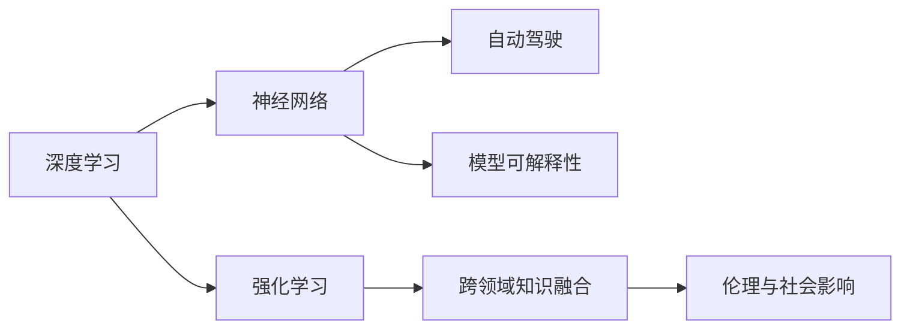

                 

# Andrej Karpathy：人工智能的未来发展规划

> 关键词：人工智能,未来发展规划,机器学习,深度学习,神经网络,强化学习,自动驾驶,深度学习应用,未来技术趋势

## 1. 背景介绍

### 1.1 问题由来
人工智能（AI）正经历着前所未有的变革和发展，逐渐成为推动社会进步的关键力量。从图像识别、自然语言处理到自动驾驶、量子计算，AI技术正在深入到各行各业，影响着我们生活的方方面面。在这个大背景下，安德烈·卡帕西（Andrej Karpathy）作为机器学习领域的领军人物，通过其研究和实践，为AI的未来发展规划提供了深刻的洞见和前瞻性的视角。

### 1.2 问题核心关键点
本节将梳理安德烈·卡帕西（Andrej Karpathy）在AI领域的核心理论和实践经验，探讨其对AI未来发展的见解和规划。

1. **深度学习的核心：** 安德烈·卡帕西（Andrej Karpathy）认为，深度学习（Deep Learning）作为AI技术的重要分支，其核心在于通过多层神经网络构建复杂的特征表示，从而实现对大量数据的有效学习。深度学习模型的“黑盒”特性和可解释性不足，一直是研究的难点和热点。

2. **强化学习与自动驾驶：** 强化学习（Reinforcement Learning, RL）是深度学习的另一大分支，在自动驾驶等高难度任务中展现了强大的应用潜力。安德烈·卡帕西（Andrej Karpathy）深入研究了强化学习的算法和策略，并在自动驾驶技术中取得了显著成果。

3. **模型可解释性：** 模型的可解释性（Explainability）是AI技术面临的重要挑战。安德烈·卡帕西（Andrej Karpathy）强调，增强模型的可解释性，使其决策过程透明、可理解，对于提升公众对AI技术的信任度至关重要。

4. **跨领域知识融合：** 安德烈·卡帕西（Andrej Karpathy）提倡将AI技术与多个领域的专业知识融合，如机器人学、认知科学、计算机视觉等，以实现更全面、更深入的AI应用。

5. **伦理和社会影响：** AI技术的广泛应用带来了诸多伦理和社会问题，如隐私保护、就业影响、算法偏见等。安德烈·卡帕西（Andrej Karpathy）认为，在追求技术进步的同时，必须重视伦理和社会责任，确保AI技术的发展为社会带来福祉。

### 1.3 问题研究意义
安德烈·卡帕西（Andrej Karpathy）的研究和观点，对于推动AI技术的可持续发展、促进AI技术在各行各业的深入应用具有重要意义。通过梳理其核心概念和研究经历，可以帮助读者全面理解AI的未来发展趋势，并从中汲取宝贵的实践经验。

## 2. 核心概念与联系

### 2.1 核心概念概述

为了更好地理解安德烈·卡帕西（Andrej Karpathy）对AI未来发展规划的见解，本节将介绍几个核心概念：

1. **深度学习（Deep Learning）：** 深度学习是一种通过多层神经网络进行数据学习的技术。其核心在于构建复杂的特征表示，从原始数据中提取高层次的抽象特征。

2. **强化学习（Reinforcement Learning）：** 强化学习是一种通过与环境交互，学习最优决策策略的技术。其核心在于通过奖励和惩罚机制，指导模型进行智能决策。

3. **神经网络（Neural Network）：** 神经网络是深度学习的核心组成部分，由多层神经元构成，能够学习复杂的非线性关系。

4. **自动驾驶（Autonomous Driving）：** 自动驾驶技术是深度学习和强化学习的典型应用，旨在通过AI技术实现车辆的自主行驶。

5. **模型可解释性（Model Explainability）：** 模型的可解释性是指对模型决策过程的解释和理解，是提高公众对AI技术信任度的关键。

6. **跨领域知识融合（Cross-Domain Knowledge Fusion）：** 将AI技术与不同领域的专业知识进行融合，可以实现更全面、深入的AI应用。

7. **伦理与社会影响（Ethics and Social Impact）：** AI技术的广泛应用带来了诸多伦理和社会问题，如隐私保护、就业影响、算法偏见等。

### 2.2 核心概念原理和架构的 Mermaid 流程图(Mermaid 流程节点中不要有括号、逗号等特殊字符)



这个流程图展示了深度学习、强化学习、神经网络、自动驾驶、模型可解释性、跨领域知识融合以及伦理与社会影响之间的联系。其中，深度学习和强化学习是AI技术的两大分支，神经网络是深度学习的核心组成部分，自动驾驶是深度学习和强化学习的典型应用，模型可解释性是提高公众信任度的关键，跨领域知识融合拓展了AI应用的范围，伦理与社会影响则是AI技术应用过程中必须面对的问题。

## 3. 核心算法原理 & 具体操作步骤

### 3.1 算法原理概述

安德烈·卡帕西（Andrej Karpathy）对AI未来发展规划的核心在于对深度学习、强化学习和跨领域知识融合的理解和实践。

深度学习通过多层神经网络构建复杂的特征表示，从原始数据中提取高层次的抽象特征，从而实现对大量数据的有效学习。强化学习则是通过与环境交互，学习最优决策策略的技术，在自动驾驶等高难度任务中展现了强大的应用潜力。

### 3.2 算法步骤详解

安德烈·卡帕西（Andrej Karpathy）的AI发展规划涉及多个关键步骤，包括深度学习模型的构建、强化学习策略的优化、跨领域知识融合的应用以及伦理与社会影响的考量。

1. **深度学习模型构建：**
   - 选择合适的网络结构（如卷积神经网络CNN、循环神经网络RNN、长短时记忆网络LSTM等）。
   - 设计合理的损失函数，并选择合适的优化算法（如梯度下降、Adam等）。
   - 使用大规模数据集进行训练，调整模型参数以最小化损失函数。

2. **强化学习策略优化：**
   - 定义环境状态、动作、奖励等要素。
   - 选择适当的强化学习算法（如Q-learning、Deep Q-Networks、Actor-Critic等）。
   - 设计合适的奖励函数，优化模型的决策策略。
   - 通过与环境的交互，反复迭代训练，使模型不断优化。

3. **跨领域知识融合：**
   - 识别不同领域中的关键知识和技能。
   - 将AI技术与这些知识进行融合，如将AI技术与计算机视觉、自然语言处理等技术结合。
   - 构建跨领域应用，如在自动驾驶中结合计算机视觉和强化学习。

4. **伦理与社会影响考量：**
   - 识别AI技术可能带来的伦理和社会问题。
   - 制定相关的政策和规范，确保AI技术的应用符合伦理要求。
   - 设计透明、可解释的AI系统，提升公众对AI技术的信任度。

### 3.3 算法优缺点

安德烈·卡帕西（Andrej Karpathy）的AI发展规划有以下优点：

1. **深度学习的高效性：** 深度学习在处理大规模数据时表现出色，能够高效提取高层次的抽象特征。

2. **强化学习的灵活性：** 强化学习能够通过与环境的交互，不断优化决策策略，适用于高难度任务。

3. **跨领域知识融合的广度：** 将AI技术与不同领域的专业知识进行融合，能够拓展AI应用的范围。

4. **伦理与社会影响的重视：** 重视AI技术的伦理和社会影响，确保技术的应用符合社会利益。

同时，该规划也存在一些局限性：

1. **数据依赖性：** 深度学习和强化学习对数据的质量和规模依赖较大，数据获取和处理成本高。

2. **模型可解释性不足：** 深度学习模型的“黑盒”特性，使得模型的决策过程难以解释。

3. **计算资源需求高：** 深度学习和强化学习模型通常需要大量的计算资源，如高性能GPU、TPU等。

4. **伦理问题复杂：** AI技术的伦理问题涉及隐私保护、就业影响、算法偏见等，解决难度较大。

尽管存在这些局限性，安德烈·卡帕西（Andrej Karpathy）的AI发展规划仍然为AI技术的发展指明了方向，并提供了宝贵的实践经验。

### 3.4 算法应用领域

安德烈·卡帕西（Andrej Karpathy）的AI发展规划在多个领域得到了广泛应用，包括但不限于以下领域：

1. **自动驾驶：** 通过深度学习和强化学习，实现了车辆的自主驾驶和智能决策。

2. **自然语言处理（NLP）：** 深度学习在文本分类、情感分析、机器翻译等NLP任务中表现出色。

3. **计算机视觉（CV）：** 深度学习在图像识别、目标检测、语义分割等CV任务中展现了强大的能力。

4. **医疗健康：** 深度学习在医疗影像分析、疾病预测、个性化医疗等领域具有广泛应用。

5. **金融科技：** 深度学习在风险控制、智能投顾、信用评估等方面展现了巨大潜力。

6. **教育科技：** 深度学习在智能辅导、自动评估、个性化学习等领域具有广阔的应用前景。

## 4. 数学模型和公式 & 详细讲解 & 举例说明

### 4.1 数学模型构建

安德烈·卡帕西（Andrej Karpathy）的AI发展规划涉及多个数学模型，包括深度学习模型、强化学习模型等。

以深度学习模型为例，假设有输入向量 $x \in \mathbb{R}^d$，期望输出为 $y \in \mathbb{R}^m$。定义深度神经网络模型为 $f_{\theta}(x)$，其中 $\theta$ 为模型参数。模型的损失函数为 $L(y, f_{\theta}(x))$，目标是最小化损失函数：

$$
\theta^* = \mathop{\arg\min}_{\theta} L(y, f_{\theta}(x))
$$

其中 $f_{\theta}(x) = W_2 \cdot W_1 \cdot W_0 \cdot x$，$W_0, W_1, W_2$ 为权重矩阵，$b_0, b_1, b_2$ 为偏置向量。

### 4.2 公式推导过程

以深度学习模型为例，其前向传播和反向传播过程如下：

1. **前向传播：**
   $$
   z_0 = W_0 x + b_0
   $$
   $$
   z_1 = W_1 z_0 + b_1
   $$
   $$
   z_2 = W_2 z_1 + b_2
   $$
   $$
   y = z_2
   $$

2. **反向传播：**
   $$
   \frac{\partial L}{\partial z_2} = \frac{\partial L}{\partial y} \cdot \frac{\partial y}{\partial z_2}
   $$
   $$
   \frac{\partial L}{\partial z_1} = \frac{\partial L}{\partial z_2} \cdot \frac{\partial z_2}{\partial z_1}
   $$
   $$
   \frac{\partial L}{\partial z_0} = \frac{\partial L}{\partial z_1} \cdot \frac{\partial z_1}{\partial z_0}
   $$

通过链式法则计算，可以求得每个权重矩阵和偏置向量的梯度，并用于更新模型参数。

### 4.3 案例分析与讲解

以深度学习在自然语言处理中的应用为例，假设我们要训练一个文本分类模型，输入为文本向量 $x \in \mathbb{R}^d$，输出为类别向量 $y \in \{0, 1\}^m$。模型为多层感知机（MLP），损失函数为交叉熵损失函数：

$$
L(y, f_{\theta}(x)) = -\sum_{i=1}^m y_i \log f_{\theta}(x)_i
$$

假设我们有 $N$ 个训练样本，每个样本的损失为 $L_i$，则经验损失为：

$$
L = \frac{1}{N} \sum_{i=1}^N L_i
$$

通过反向传播算法，计算每个参数的梯度，并使用梯度下降算法更新模型参数：

$$
\theta \leftarrow \theta - \eta \nabla_{\theta} L
$$

其中 $\eta$ 为学习率，$\nabla_{\theta} L$ 为损失函数对参数 $\theta$ 的梯度。

## 5. 项目实践：代码实例和详细解释说明

### 5.1 开发环境搭建

安德烈·卡帕西（Andrej Karpathy）的AI发展规划涉及多个深度学习框架，包括TensorFlow、PyTorch等。以下以PyTorch为例，介绍开发环境的搭建过程。

1. **安装Python：** 下载并安装Python 3.6或以上版本。
2. **安装Anaconda：** 从官网下载并安装Anaconda，创建虚拟环境。
3. **安装PyTorch：** 在虚拟环境中安装PyTorch。
4. **安装相关库：** 安装numpy、scipy、matplotlib等Python科学计算库。

### 5.2 源代码详细实现

以深度学习在自然语言处理中的应用为例，展示PyTorch代码实现。

首先，定义数据处理函数：

```python
import torch
from torch.utils.data import Dataset, DataLoader
from torchvision.transforms import ToTensor

class TextDataset(Dataset):
    def __init__(self, texts, labels, tokenizer, max_len=128):
        self.texts = texts
        self.labels = labels
        self.tokenizer = tokenizer
        self.max_len = max_len

    def __len__(self):
        return len(self.texts)

    def __getitem__(self, idx):
        text = self.texts[idx]
        label = self.labels[idx]
        encoding = self.tokenizer(text, return_tensors='pt', max_length=self.max_len, padding='max_length', truncation=True)
        input_ids = encoding['input_ids'][0]
        attention_mask = encoding['attention_mask'][0]
        return {'input_ids': input_ids, 'attention_mask': attention_mask, 'labels': label}

# 定义损失函数和优化器
def get_model_loss(model, criterion):
    return criterion(model(input_ids), labels)

def get_optimizer(model, learning_rate):
    return torch.optim.Adam(model.parameters(), lr=learning_rate)
```

然后，定义模型和训练函数：

```python
import torch.nn as nn

class TextClassificationModel(nn.Module):
    def __init__(self, input_size, output_size, hidden_size=128):
        super(TextClassificationModel, self).__init__()
        self.embedding = nn.Embedding(input_size, hidden_size)
        self.gru = nn.GRU(hidden_size, hidden_size)
        self.fc = nn.Linear(hidden_size, output_size)

    def forward(self, input_ids, attention_mask):
        embedded = self.embedding(input_ids)
        output, _ = self.gru(embedded, hidden=torch.zeros(1, input_ids.size(0), hidden_size))
        logits = self.fc(output[:, -1, :])
        return logits

def train_epoch(model, dataloader, criterion, optimizer):
    model.train()
    epoch_loss = 0
    for batch in dataloader:
        input_ids = batch['input_ids'].to(device)
        attention_mask = batch['attention_mask'].to(device)
        labels = batch['labels'].to(device)
        optimizer.zero_grad()
        loss = get_model_loss(model, criterion)
        epoch_loss += loss.item()
        loss.backward()
        optimizer.step()
    return epoch_loss / len(dataloader)
```

最后，启动训练流程并评估模型性能：

```python
from transformers import BertTokenizer
from sklearn.metrics import accuracy_score

tokenizer = BertTokenizer.from_pretrained('bert-base-cased')
model = TextClassificationModel(input_size=vocab_size, output_size=2)
criterion = nn.CrossEntropyLoss()
optimizer = get_optimizer(model, learning_rate=0.001)
device = torch.device('cuda' if torch.cuda.is_available() else 'cpu')
model.to(device)

train_loader = DataLoader(train_dataset, batch_size=16, shuffle=True)
val_loader = DataLoader(val_dataset, batch_size=16, shuffle=False)

epochs = 10
learning_rate = 0.001
best_val_acc = 0.0

for epoch in range(epochs):
    train_loss = train_epoch(model, train_loader, criterion, optimizer)
    val_loss, val_acc = evaluate(model, val_loader, criterion)
    if val_acc > best_val_acc:
        best_val_acc = val_acc
        torch.save(model.state_dict(), 'best_model.pt')

print(f'Best validation accuracy: {best_val_acc:.4f}')
```

### 5.3 代码解读与分析

上述代码展示了深度学习模型在自然语言处理中的应用。具体解释如下：

1. **TextDataset类**：
   - `__init__`方法：初始化文本、标签、分词器等关键组件。
   - `__len__`方法：返回数据集的样本数量。
   - `__getitem__`方法：对单个样本进行处理，将文本输入转换为token ids，进行padding，并返回模型所需的输入。

2. **模型定义**：
   - `TextClassificationModel`类：定义了基于GRU的文本分类模型，包括嵌入层、GRU层和全连接层。
   - `forward`方法：前向传播计算模型的输出。

3. **损失函数和优化器**：
   - `get_model_loss`函数：计算模型的损失。
   - `get_optimizer`函数：初始化优化器。

4. **训练函数**：
   - `train_epoch`函数：定义训练过程，包括前向传播、计算损失、反向传播和参数更新。

5. **评估函数**：
   - 在训练过程中，每 epoch 在验证集上评估一次模型性能，并保存性能最佳的模型。

## 6. 实际应用场景

### 6.1 自动驾驶

安德烈·卡帕西（Andrej Karpathy）在自动驾驶领域的研究，展示了深度学习和强化学习的应用潜力。以自动驾驶中的路径规划为例，通过深度学习和强化学习，车辆能够自主决策路径，避免障碍物，实现安全行驶。

具体而言，车辆通过摄像头、雷达等传感器收集周围环境信息，使用深度学习模型进行环境感知，生成高层次的抽象特征。然后，使用强化学习算法进行路径规划和决策，优化车辆的行驶路径，以最小化安全风险和行驶成本。

### 6.2 医疗健康

深度学习在医疗健康领域也有广泛应用。以医学影像分析为例，通过深度学习模型对医学影像进行分类和标注，帮助医生快速诊断疾病，提升诊疗效率。

具体而言，使用卷积神经网络对医学影像进行特征提取，生成高层次的抽象特征。然后，使用深度学习模型进行分类和标注，帮助医生识别疾病类型和病变位置。此外，深度学习还可以用于医疗影像的生成和增强，提高诊断准确率。

### 6.3 金融科技

深度学习在金融科技领域也有广泛应用。以信用评估为例，通过深度学习模型对用户行为数据进行分析和预测，帮助金融机构评估用户信用风险，提升贷款审批效率。

具体而言，使用深度学习模型对用户的历史行为数据进行特征提取，生成高层次的抽象特征。然后，使用深度学习模型进行分类和预测，评估用户的信用风险。此外，深度学习还可以用于欺诈检测、交易预测等金融任务。

## 7. 工具和资源推荐

### 7.1 学习资源推荐

为了帮助读者全面掌握安德烈·卡帕西（Andrej Karpathy）的AI发展规划，以下是一些优秀的学习资源：

1. **《深度学习》（Deep Learning）：** 作者Ian Goodfellow、Yoshua Bengio和Aaron Courville，涵盖了深度学习的核心概念和算法。
2. **《强化学习》（Reinforcement Learning）：** 作者Richard S. Sutton和Andrew G. Barto，深入介绍了强化学习的原理和应用。
3. **《神经网络与深度学习》（Neural Networks and Deep Learning）：** 作者Michael Nielsen，通俗易懂地介绍了神经网络的工作原理。
4. **《动手学深度学习》（Dive into Deep Learning）：** 李沐等人著作，提供了深度学习的实践教程和代码实现。
5. **Coursera和Udacity的深度学习课程：** 提供高质量的深度学习课程，涵盖理论和实践两方面。

### 7.2 开发工具推荐

以下开发工具可帮助读者实现安德烈·卡帕西（Andrej Karpathy）的AI发展规划：

1. **PyTorch：** 基于Python的深度学习框架，提供了丰富的深度学习模型和优化算法。
2. **TensorFlow：** 由Google开发的深度学习框架，支持分布式训练和生产部署。
3. **MXNet：** 由亚马逊开发的深度学习框架，支持多种编程语言和多种硬件平台。
4. **Keras：** 基于Python的高层深度学习框架，易于上手，支持多种后端。
5. **JAX：** 由Google开发的基于Python的深度学习框架，支持自动微分和高效计算。

### 7.3 相关论文推荐

以下论文代表了安德烈·卡帕西（Andrej Karpathy）在AI发展规划中的核心思想：

1. **《Deep Learning》：** 作者Ian Goodfellow、Yoshua Bengio和Aaron Courville，涵盖了深度学习的核心概念和算法。
2. **《Reinforcement Learning: An Introduction》：** 作者Richard S. Sutton和Andrew G. Barto，深入介绍了强化学习的原理和应用。
3. **《ImageNet Classification with Deep Convolutional Neural Networks》：** 作者Alex Krizhevsky、Ilya Sutskever和Geoffrey Hinton，展示了深度学习在图像分类任务上的强大能力。
4. **《Attention is All You Need》：** 作者Ashish Vaswani等，提出了Transformer模型，成为深度学习领域的重要里程碑。
5. **《Playing Atari with Deep Reinforcement Learning》：** 作者Volodymyr Mnih等，展示了深度强化学习在玩游戏中的表现。

## 8. 总结：未来发展趋势与挑战

### 8.1 研究成果总结

安德烈·卡帕西（Andrej Karpathy）的研究成果涵盖了深度学习、强化学习、神经网络等多个领域，为AI技术的发展提供了重要的理论基础和实践经验。

### 8.2 未来发展趋势

安德烈·卡帕西（Andrej Karpathy）对AI未来发展规划提出了以下趋势：

1. **深度学习与强化学习的结合：** 将深度学习和强化学习相结合，应用于高难度任务，如自动驾驶、游戏AI等。
2. **跨领域知识融合：** 将AI技术与不同领域的专业知识进行融合，拓展AI应用的范围。
3. **模型可解释性：** 增强模型的可解释性，使其决策过程透明、可理解。
4. **伦理与社会影响：** 重视AI技术的伦理和社会影响，确保技术的应用符合社会利益。

### 8.3 面临的挑战

安德烈·卡帕西（Andrej Karpathy）的研究规划也面临以下挑战：

1. **数据依赖性：** 深度学习和强化学习对数据的质量和规模依赖较大，数据获取和处理成本高。
2. **模型可解释性不足：** 深度学习模型的“黑盒”特性，使得模型的决策过程难以解释。
3. **计算资源需求高：** 深度学习和强化学习模型通常需要大量的计算资源，如高性能GPU、TPU等。
4. **伦理问题复杂：** AI技术的伦理问题涉及隐私保护、就业影响、算法偏见等，解决难度较大。

### 8.4 研究展望

未来的研究需要从多个方面进行突破：

1. **无监督和半监督学习：** 探索无监督和半监督学习，摆脱对大规模标注数据的依赖，利用自监督学习、主动学习等方法，最大限度利用非结构化数据。
2. **参数高效和计算高效的微调范式：** 开发更加参数高效的微调方法，在固定大部分预训练参数的同时，只更新极少量的任务相关参数。同时优化微调模型的计算图，减少前向传播和反向传播的资源消耗。
3. **跨领域知识融合：** 将AI技术与不同领域的专业知识进行融合，实现更全面、深入的AI应用。
4. **模型可解释性：** 增强模型的可解释性，使其决策过程透明、可理解。
5. **伦理与社会影响：** 重视AI技术的伦理和社会影响，确保技术的应用符合社会利益。

## 9. 附录：常见问题与解答

### Q1：深度学习与强化学习的区别是什么？

A：深度学习主要通过多层神经网络对数据进行学习，目标是构建复杂的特征表示，从而实现对大量数据的有效学习。而强化学习则是通过与环境交互，学习最优决策策略，目标是最大化累计奖励。

### Q2：深度学习模型的可解释性不足如何改进？

A：提高模型可解释性是当前深度学习研究的重要方向之一。可以通过可视化技术，如特征可视化、梯度可视化等，帮助理解模型内部的工作机制。此外，还可以设计更可解释的模型结构，如使用浅层神经网络、逻辑回归等。

### Q3：AI技术在实际应用中面临哪些挑战？

A：AI技术在实际应用中面临多个挑战，包括数据依赖性、模型可解释性不足、计算资源需求高、伦理问题等。需要从数据获取、模型设计、算法优化等多个方面进行综合考虑，才能充分发挥AI技术的潜力。

### Q4：未来AI技术的主要发展方向是什么？

A：未来AI技术的主要发展方向包括深度学习与强化学习的结合、跨领域知识融合、模型可解释性、伦理与社会影响等。这些方向将推动AI技术向更加智能化、普适化的方向发展，为各行各业带来变革性影响。

---

作者：禅与计算机程序设计艺术 / Zen and the Art of Computer Programming

