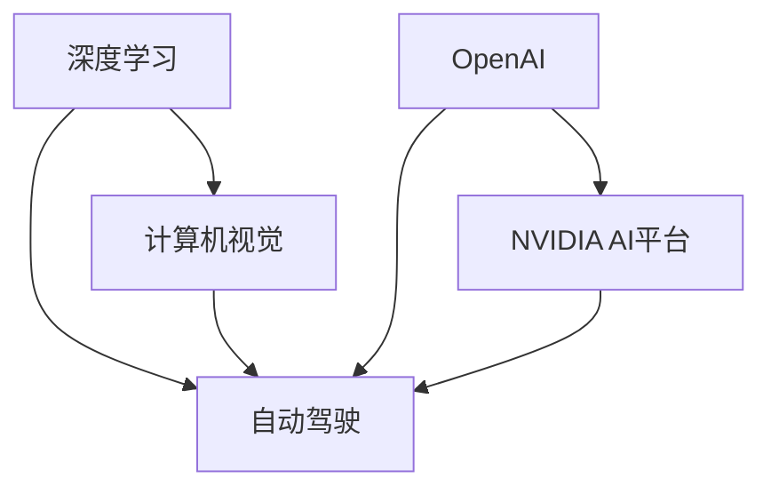
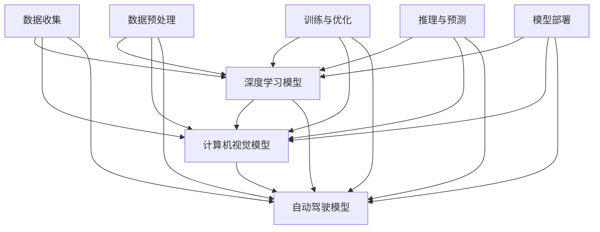

                 

## 1. 背景介绍

Andrej Karpathy，作为世界顶级的人工智能专家和计算机科学家，他在深度学习和计算机视觉领域做出了开创性的贡献。Karpathy曾在NVIDIA、OpenAI等知名科技公司担任领导职务，同时也是Coursera深度学习课程的主讲人。他的研究引领了自动驾驶、机器人视觉等领域的发展，并提出了多项有影响力的深度学习模型和技术。

本文将深度探讨Andrej Karpathy在人工智能领域的未来发展规划。从核心概念到实际应用，从数学模型到工程实践，本文将全面剖析Karpathy对于AI未来的思考和布局。

## 2. 核心概念与联系

### 2.1 核心概念概述

- **深度学习(Deep Learning)**：一种基于神经网络的机器学习方法，通过多层次的抽象表示，解决复杂的模式识别和预测问题。
- **计算机视觉(Computer Vision)**：研究如何让计算机理解并解释视觉信息，包括图像分类、目标检测、图像生成等任务。
- **自动驾驶(Autonomous Driving)**：通过计算机视觉、深度学习和传感器融合等技术，实现无人驾驶车辆的智能导航。
- **NVIDIA AI平台**：由NVIDIA开发的AI计算平台，包括GPU、AI芯片等硬件设施，以及TensorRT等加速软件，为深度学习和大规模计算提供了强大支持。
- **OpenAI**：一家致力于人工智能安全和前沿研究的公司，推出了GPT、DALL·E等知名AI模型，推动了AI领域的快速发展。

这些核心概念通过以下Mermaid流程图展示了它们之间的联系：



这个流程图展示了大语言模型微调技术的应用范围，从基础的深度学习算法到复杂的自动驾驶和计算机视觉应用，再到强大的NVIDIA AI平台和OpenAI，这些技术相互支持，共同构成了Andrej Karpathy对于AI未来规划的基础。

### 2.2 核心概念原理和架构的 Mermaid 流程图

为更好地理解这些概念之间的联系，这里提供一个更为详细的 Mermaid 流程图，展示深度学习、计算机视觉、自动驾驶等技术在实际应用中的架构和交互。



这个流程图详细展示了从数据收集、预处理、模型训练、推理到模型部署的全过程，以及这些过程如何通过深度学习、计算机视觉和自动驾驶等技术的相互支持，实现复杂的AI应用。

## 3. 核心算法原理 & 具体操作步骤

### 3.1 算法原理概述

深度学习在AI中的应用，主要依赖于神经网络的结构和训练方法。神经网络通过多层次的非线性变换，将输入数据映射到高维表示空间，从而实现复杂的模式识别和预测。计算机视觉则通过图像识别、语义分割等技术，让计算机理解和解释视觉信息。自动驾驶则结合了计算机视觉、深度学习和传感器融合，实现了无人驾驶车辆的智能导航。

这些技术的核心算法包括：

- **反向传播算法(Backpropagation)**：用于训练神经网络，通过误差反向传播更新权重。
- **卷积神经网络(CNN)**：用于图像处理和计算机视觉任务，通过卷积操作提取图像特征。
- **生成对抗网络(GAN)**：用于图像生成和图像修复等任务，通过两个神经网络的对抗训练生成高质量的图像。
- **强化学习(Reinforcement Learning)**：用于训练自动驾驶和机器人等应用，通过奖励机制优化行为策略。

### 3.2 算法步骤详解

深度学习算法的训练和应用一般包括以下步骤：

1. **数据收集与预处理**：从现实世界获取数据，并进行清洗、标注和归一化等预处理操作。
2. **模型构建与训练**：根据任务需求，构建神经网络模型，并使用反向传播算法进行训练，优化模型参数。
3. **模型推理与评估**：使用训练好的模型对新数据进行推理预测，并评估模型的性能指标。
4. **模型部署与应用**：将训练好的模型部署到实际应用中，并进行优化和监控。

以计算机视觉中的目标检测任务为例，详细操作步骤如下：

1. **数据收集**：收集包含目标的图像数据集，并进行标注。
2. **模型构建**：构建一个包含多个卷积层和池化层的神经网络，如YOLO、Faster R-CNN等。
3. **训练模型**：使用标注数据对模型进行训练，通过反向传播算法优化权重。
4. **模型评估**：在测试数据集上评估模型的准确率和召回率等指标。
5. **模型部署**：将训练好的模型部署到实际应用中，如摄像头、无人机等设备。

### 3.3 算法优缺点

深度学习的优点包括：

- **强大的模式识别能力**：通过多层次的非线性变换，可以学习复杂的模式和特征。
- **数据驱动的模型训练**：可以自动学习数据中的模式，无需手工设计特征。
- **高效的计算能力**：现代GPU和AI芯片提供了强大的计算支持。

深度学习的缺点包括：

- **数据需求量大**：需要大量的标注数据才能训练出高质量的模型。
- **模型复杂度高**：庞大的神经网络结构可能导致过拟合和计算资源消耗大。
- **可解释性不足**：深度学习的"黑盒"特性使得模型难以解释和调试。

### 3.4 算法应用领域

深度学习技术在多个领域中得到了广泛应用，包括：

- **计算机视觉**：图像分类、目标检测、图像生成、图像修复等。
- **自然语言处理**：语言模型、文本生成、机器翻译、语音识别等。
- **自动驾驶**：车辆导航、交通信号识别、行人检测等。
- **医疗诊断**：医学图像分析、疾病预测等。
- **金融分析**：股票预测、风险评估等。

## 4. 数学模型和公式 & 详细讲解

### 4.1 数学模型构建

深度学习模型的核心是神经网络，其数学模型可以表示为：

$$
y = \sigma(z) = \sigma(Wx + b)
$$

其中 $x$ 为输入数据，$W$ 为权重矩阵，$b$ 为偏置向量，$\sigma$ 为激活函数。深度学习模型通过多个这样的神经元组成，形成多层结构。

### 4.2 公式推导过程

以反向传播算法为例，其公式推导如下：

$$
\frac{\partial L}{\partial W} = \frac{\partial L}{\partial z} \frac{\partial z}{\partial W}
$$

其中 $L$ 为损失函数，$z$ 为神经元的输出，$W$ 为权重矩阵。

### 4.3 案例分析与讲解

以计算机视觉中的目标检测任务为例，详细讲解神经网络的构建和训练过程：

1. **数据收集**：收集包含目标的图像数据集，并进行标注。
2. **模型构建**：构建一个包含多个卷积层和池化层的神经网络，如YOLO、Faster R-CNN等。
3. **训练模型**：使用标注数据对模型进行训练，通过反向传播算法优化权重。
4. **模型评估**：在测试数据集上评估模型的准确率和召回率等指标。
5. **模型部署**：将训练好的模型部署到实际应用中，如摄像头、无人机等设备。

## 5. 项目实践：代码实例和详细解释说明

### 5.1 开发环境搭建

在进行深度学习项目开发前，需要搭建开发环境。以下是使用Python进行深度学习开发的环境配置流程：

1. 安装Anaconda：从官网下载并安装Anaconda，用于创建独立的Python环境。
2. 创建并激活虚拟环境：
```bash
conda create -n pytorch-env python=3.8 
conda activate pytorch-env
```

3. 安装PyTorch：根据CUDA版本，从官网获取对应的安装命令。例如：
```bash
conda install pytorch torchvision torchaudio cudatoolkit=11.1 -c pytorch -c conda-forge
```

4. 安装TensorFlow：
```bash
conda install tensorflow -c conda-forge
```

5. 安装TensorBoard：
```bash
pip install tensorboard
```

6. 安装Weights & Biases：
```bash
pip install w&b
```

完成上述步骤后，即可在`pytorch-env`环境中开始深度学习项目的开发。

### 5.2 源代码详细实现

以下是一个简单的深度学习项目代码实现，以卷积神经网络为例，使用PyTorch库进行图像分类任务：

```python
import torch
import torch.nn as nn
import torch.optim as optim
from torchvision import datasets, transforms

# 定义卷积神经网络
class Net(nn.Module):
    def __init__(self):
        super(Net, self).__init__()
        self.conv1 = nn.Conv2d(3, 6, 5)
        self.pool = nn.MaxPool2d(2, 2)
        self.conv2 = nn.Conv2d(6, 16, 5)
        self.fc1 = nn.Linear(16 * 5 * 5, 120)
        self.fc2 = nn.Linear(120, 84)
        self.fc3 = nn.Linear(84, 10)

    def forward(self, x):
        x = self.pool(torch.relu(self.conv1(x)))
        x = self.pool(torch.relu(self.conv2(x)))
        x = x.view(-1, 16 * 5 * 5)
        x = torch.relu(self.fc1(x))
        x = torch.relu(self.fc2(x))
        x = self.fc3(x)
        return x

# 加载数据集
transform = transforms.Compose(
    [transforms.ToTensor(),
     transforms.Normalize((0.5,), (0.5,))])

trainset = datasets.CIFAR10(root='./data', train=True,
                            download=True, transform=transform)
trainloader = torch.utils.data.DataLoader(trainset, batch_size=4,
                                          shuffle=True, num_workers=2)

testset = datasets.CIFAR10(root='./data', train=False,
                           download=True, transform=transform)
testloader = torch.utils.data.DataLoader(testset, batch_size=4,
                                         shuffle=False, num_workers=2)

# 定义损失函数和优化器
net = Net()
criterion = nn.CrossEntropyLoss()
optimizer = optim.SGD(net.parameters(), lr=0.001, momentum=0.9)

# 训练模型
for epoch in range(2):  # 只训练两轮
    running_loss = 0.0
    for i, data in enumerate(trainloader, 0):
        # 获取输入和标签
        inputs, labels = data

        # 将输入和标签送入网络进行前向传播
        outputs = net(inputs)

        # 计算损失
        loss = criterion(outputs, labels)

        # 反向传播
        optimizer.zero_grad()
        loss.backward()
        optimizer.step()

        # 打印日志
        running_loss += loss.item()
        if i % 2000 == 1999:    # 每2000个小批量数据后输出一次日志信息
            print('[%d, %5d] loss: %.3f' %
                  (epoch + 1, i + 1, running_loss / 2000))
            running_loss = 0.0

# 测试模型
correct = 0
total = 0
with torch.no_grad():
    for data in testloader:
        images, labels = data
        outputs = net(images)
        _, predicted = torch.max(outputs.data, 1)
        total += labels.size(0)
        correct += (predicted == labels).sum().item()

print('Accuracy of the network on the 10000 test images: %d %%' % (
    100 * correct / total))
```

### 5.3 代码解读与分析

以上代码实现了一个简单的卷积神经网络，用于图像分类任务。详细解读如下：

1. **定义卷积神经网络**：
```python
class Net(nn.Module):
    def __init__(self):
        super(Net, self).__init__()
        self.conv1 = nn.Conv2d(3, 6, 5)
        self.pool = nn.MaxPool2d(2, 2)
        self.conv2 = nn.Conv2d(6, 16, 5)
        self.fc1 = nn.Linear(16 * 5 * 5, 120)
        self.fc2 = nn.Linear(120, 84)
        self.fc3 = nn.Linear(84, 10)
```

2. **加载数据集**：
```python
transform = transforms.Compose(
    [transforms.ToTensor(),
     transforms.Normalize((0.5,), (0.5,))])

trainset = datasets.CIFAR10(root='./data', train=True,
                            download=True, transform=transform)
trainloader = torch.utils.data.DataLoader(trainset, batch_size=4,
                                          shuffle=True, num_workers=2)

testset = datasets.CIFAR10(root='./data', train=False,
                           download=True, transform=transform)
testloader = torch.utils.data.DataLoader(testset, batch_size=4,
                                         shuffle=False, num_workers=2)
```

3. **定义损失函数和优化器**：
```python
criterion = nn.CrossEntropyLoss()
optimizer = optim.SGD(net.parameters(), lr=0.001, momentum=0.9)
```

4. **训练模型**：
```python
for epoch in range(2):  # 只训练两轮
    running_loss = 0.0
    for i, data in enumerate(trainloader, 0):
        # 获取输入和标签
        inputs, labels = data

        # 将输入和标签送入网络进行前向传播
        outputs = net(inputs)

        # 计算损失
        loss = criterion(outputs, labels)

        # 反向传播
        optimizer.zero_grad()
        loss.backward()
        optimizer.step()

        # 打印日志
        running_loss += loss.item()
        if i % 2000 == 1999:    # 每2000个小批量数据后输出一次日志信息
            print('[%d, %5d] loss: %.3f' %
                  (epoch + 1, i + 1, running_loss / 2000))
            running_loss = 0.0
```

5. **测试模型**：
```python
correct = 0
total = 0
with torch.no_grad():
    for data in testloader:
        images, labels = data
        outputs = net(images)
        _, predicted = torch.max(outputs.data, 1)
        total += labels.size(0)
        correct += (predicted == labels).sum().item()

print('Accuracy of the network on the 10000 test images: %d %%' % (
    100 * correct / total))
```

## 6. 实际应用场景

### 6.1 智能驾驶

深度学习在自动驾驶中的应用，通过计算机视觉、传感器融合和强化学习等技术，实现了无人驾驶车辆的智能导航。具体应用包括：

- **环境感知**：通过摄像头、激光雷达等传感器，获取车辆周围的环境信息，并进行语义分割和目标检测。
- **路径规划**：使用深度学习模型对环境信息进行语义理解和推理，生成车辆行驶路径。
- **行为决策**：结合强化学习算法，优化车辆行为决策策略，实现避障、变道等功能。

### 6.2 医学影像分析

深度学习在医学影像分析中的应用，通过图像识别、语义分割等技术，辅助医生进行疾病诊断和病情评估。具体应用包括：

- **疾病检测**：使用深度学习模型对医学影像进行自动检测，如肿瘤、结节等。
- **影像分割**：将医学影像进行语义分割，区分正常组织和病变区域。
- **病历分析**：结合自然语言处理技术，从医学文本中提取关键信息，辅助医生进行病情分析和诊断。

### 6.3 金融预测

深度学习在金融预测中的应用，通过时间序列预测和风险评估等技术，辅助金融机构进行市场分析和决策。具体应用包括：

- **股票预测**：使用深度学习模型对股票价格进行预测，帮助投资者做出投资决策。
- **风险评估**：通过深度学习模型对金融市场进行风险评估，预测潜在的金融危机。
- **信用评估**：结合深度学习和大数据技术，对客户的信用风险进行评估，提高贷款审批效率。

## 7. 工具和资源推荐

### 7.1 学习资源推荐

为了帮助开发者系统掌握深度学习理论基础和实践技巧，这里推荐一些优质的学习资源：

1. 《Deep Learning》书籍：由Ian Goodfellow、Yoshua Bengio和Aaron Courville合著，全面介绍了深度学习的原理和算法。
2. Coursera深度学习课程：由Andrew Ng主讲，涵盖深度学习的核心概念和应用实例。
3. PyTorch官方文档：提供了完整的PyTorch库文档，以及丰富的代码示例和教程。
4. TensorFlow官方文档：提供了TensorFlow的完整文档，以及详细的API参考和示例。
5.Weights & Biases官方文档：提供了模型训练的实验跟踪工具，帮助开发者监控和优化模型训练过程。

通过这些资源的学习实践，相信你一定能够快速掌握深度学习理论基础和实践技巧，应用于实际项目中。

### 7.2 开发工具推荐

高效的开发离不开优秀的工具支持。以下是几款用于深度学习开发的常用工具：

1. PyTorch：基于Python的开源深度学习框架，灵活动态的计算图，适合快速迭代研究。
2. TensorFlow：由Google主导开发的开源深度学习框架，生产部署方便，适合大规模工程应用。
3. Keras：基于TensorFlow和Theano的高级神经网络API，提供了简洁的接口和丰富的模型组件。
4. Jupyter Notebook：一个交互式的开发环境，支持多语言编程和实时可视化。
5. Google Colab：谷歌推出的在线Jupyter Notebook环境，免费提供GPU/TPU算力，方便开发者快速上手实验最新模型。

合理利用这些工具，可以显著提升深度学习项目的开发效率，加快创新迭代的步伐。

### 7.3 相关论文推荐

深度学习技术的发展源于学界的持续研究。以下是几篇奠基性的相关论文，推荐阅读：

1. AlexNet：深度学习在图像分类任务中的突破性应用，提出了卷积神经网络架构。
2. ResNet：深度神经网络的训练和优化方法，解决了深度神经网络训练中的梯度消失问题。
3. RNN：递归神经网络，用于处理序列数据，广泛应用于语音识别和自然语言处理任务。
4. GAN：生成对抗网络，用于生成高质量的图像和视频内容。
5. LSTM：长短时记忆网络，用于处理时间序列数据，广泛应用于文本生成和语音识别任务。

这些论文代表了大语言模型微调技术的发展脉络。通过学习这些前沿成果，可以帮助研究者把握学科前进方向，激发更多的创新灵感。

## 8. 总结：未来发展趋势与挑战

### 8.1 总结

本文对Andrej Karpathy在人工智能领域的未来发展规划进行了全面系统的介绍。首先，从深度学习、计算机视觉、自动驾驶等核心概念出发，详细讲解了深度学习算法的基本原理和操作步骤。其次，从数学模型和公式推导，以及实际项目实现，全面解析了深度学习的理论和实践。最后，从智能驾驶、医学影像分析、金融预测等实际应用场景，探讨了深度学习的广泛应用前景。

通过本文的系统梳理，可以看到，深度学习技术在多个领域中得到了广泛应用，并带来了深远的变革。未来的深度学习发展将更加依赖于算法创新、数据驱动和工程实践的不断突破。

### 8.2 未来发展趋势

展望未来，深度学习技术将呈现以下几个发展趋势：

1. **深度学习与多模态数据的融合**：深度学习不仅处理图像和文本数据，还将扩展到音频、视频等多模态数据，形成更全面的数据模型。
2. **深度学习与因果推理的结合**：通过引入因果推断和对比学习思想，增强深度学习模型的因果关系和泛化能力。
3. **深度学习与强化学习的结合**：通过强化学习优化深度学习模型，实现更加智能化的决策和行为。
4. **深度学习与量子计算的结合**：借助量子计算的并行计算能力，加速深度学习模型的训练和优化。
5. **深度学习与AI芯片的结合**：借助AI芯片的加速计算能力，优化深度学习模型的推理和部署效率。
6. **深度学习与大数据的结合**：通过大数据技术，提升深度学习模型的训练效率和性能。

这些趋势凸显了深度学习技术的广阔前景，未来的深度学习发展将更加依赖于多学科的交叉和融合，推动人工智能技术的进一步突破。

### 8.3 面临的挑战

尽管深度学习技术已经取得了瞩目成就，但在迈向更加智能化、普适化应用的过程中，它仍面临着诸多挑战：

1. **数据需求量大**：深度学习模型需要大量的标注数据进行训练，对于数据稀缺的应用场景，数据获取成本高。
2. **模型复杂度高**：庞大的神经网络结构可能导致过拟合和计算资源消耗大。
3. **可解释性不足**：深度学习的"黑盒"特性使得模型难以解释和调试。
4. **安全性和隐私问题**：深度学习模型可能学习到有害信息，带来安全隐患和隐私问题。
5. **计算资源消耗大**：深度学习模型的训练和推理需要大量的计算资源，对于计算资源有限的场景，难以应用。

### 8.4 研究展望

面对深度学习面临的这些挑战，未来的研究需要在以下几个方面寻求新的突破：

1. **无监督学习和半监督学习**：摆脱对大规模标注数据的依赖，利用自监督学习、主动学习等无监督和半监督范式，最大限度利用非结构化数据，实现更加灵活高效的深度学习模型。
2. **模型压缩与加速**：开发更加参数高效和计算高效的深度学习模型，如网络剪枝、量化加速等技术，减少计算资源消耗，提高模型推理效率。
3. **模型解释与可控性**：通过引入符号化的先验知识，引导深度学习模型学习更准确、合理的表示，提高模型的可解释性和可控性。
4. **隐私保护与安全**：引入隐私保护技术，如差分隐私、联邦学习等，保护用户隐私和数据安全。
5. **跨领域应用**：将深度学习技术应用于更多领域，如医疗、金融、教育等，解决实际问题，推动人工智能技术的产业化进程。

这些研究方向将引领深度学习技术迈向更高的台阶，为人工智能技术在垂直行业的规模化落地提供坚实的技术基础。

## 9. 附录：常见问题与解答

**Q1：深度学习在实际应用中存在哪些问题？**

A: 深度学习在实际应用中存在以下问题：

1. **数据需求量大**：深度学习模型需要大量的标注数据进行训练，对于数据稀缺的应用场景，数据获取成本高。
2. **模型复杂度高**：庞大的神经网络结构可能导致过拟合和计算资源消耗大。
3. **可解释性不足**：深度学习的"黑盒"特性使得模型难以解释和调试。
4. **安全性和隐私问题**：深度学习模型可能学习到有害信息，带来安全隐患和隐私问题。
5. **计算资源消耗大**：深度学习模型的训练和推理需要大量的计算资源，对于计算资源有限的场景，难以应用。

**Q2：如何应对深度学习中的数据稀缺问题？**

A: 应对深度学习中的数据稀缺问题，可以采取以下方法：

1. **数据增强**：通过对原始数据进行旋转、翻转、缩放等操作，扩充数据集，增加数据的多样性。
2. **数据合成**：利用生成对抗网络等技术，生成新的数据样本，增加数据量。
3. **半监督学习**：利用未标注数据和少量标注数据，进行半监督学习，提高模型的泛化能力。
4. **主动学习**：通过模型对数据的重要性进行评估，优先标注最具代表性的数据，提高标注效率。

**Q3：深度学习在实际应用中如何提高可解释性？**

A: 提高深度学习的可解释性，可以采取以下方法：

1. **可视化技术**：通过可视化工具，如梯度热图、特征图等，展示模型的决策过程，帮助理解模型的行为。
2. **符号化知识融合**：将符号化的先验知识，如知识图谱、逻辑规则等，与神经网络模型进行融合，引导模型学习更准确、合理的表示。
3. **解释性模型**：使用解释性模型，如决策树、线性回归等，结合深度学习模型，提供可解释的输出结果。

**Q4：如何在计算资源有限的情况下应用深度学习？**

A: 在计算资源有限的情况下应用深度学习，可以采取以下方法：

1. **模型压缩**：使用网络剪枝、量化加速等技术，减少模型参数量和计算资源消耗，提高模型推理效率。
2. **分布式计算**：利用分布式计算框架，如TensorFlow、PyTorch等，实现模型的并行训练和推理，提升计算效率。
3. **云平台资源**：利用云平台提供的GPU/TPU算力，进行模型训练和推理，减少本地计算资源的消耗。

---

作者：禅与计算机程序设计艺术 / Zen and the Art of Computer Programming

