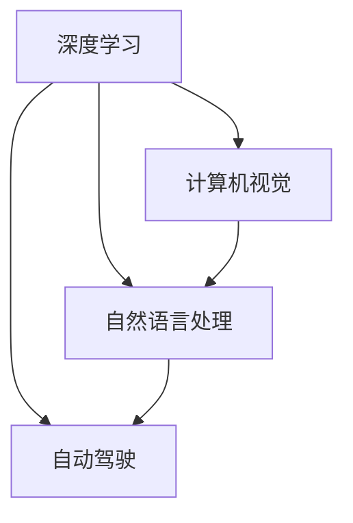

                 

# Andrej Karpathy：人工智能的未来影响

在人工智能的浪潮中，Andrej Karpathy 以其卓越的学术成就和前瞻性的技术见解，成为了业界的杰出代表。本文将深入探讨 Andréj Karpathy 对人工智能发展的深刻洞见及其对未来影响的独到分析。

## 1. 背景介绍

### 1.1 作者简介

Andréj Karpathy 是深度学习领域一位极具影响力的研究者和工程师。他以其在计算机视觉、自然语言处理和自动驾驶等领域的卓越贡献而闻名。Andrej 是斯坦福大学计算机科学与人工智能实验室的教授，同时也是OpenAI和Meta AI的研究员。他的开创性工作在学术界和工业界都产生了深远的影响。

### 1.2 人工智能发展历程

自20世纪50年代以来，人工智能领域经历了几次浪潮和低谷，直到2012年深度学习技术的发展，人工智能开始进入一个新的发展阶段。在这段时期内，机器学习、计算机视觉、自然语言处理、自动驾驶等技术不断取得突破，人工智能正在逐步从科学研究走向实际应用，解决人类面临的各种挑战。

## 2. 核心概念与联系

### 2.1 核心概念概述

在Andrej Karpathy 的研究中，经常涉及的核心概念包括深度学习、计算机视觉、自动驾驶、自然语言处理等。这些概念之间存在紧密的联系，共同推动了人工智能的发展。

- **深度学习**：是人工智能的核心技术之一，通过模拟人脑神经网络的工作方式，实现对复杂数据的高效处理和分析。
- **计算机视觉**：使计算机能够像人一样“看”和理解图像和视频，在自动驾驶、图像识别等领域有广泛应用。
- **自然语言处理**：使计算机能够理解和生成自然语言，是实现人机交互和信息处理的关键技术。
- **自动驾驶**：是计算机视觉和自然语言处理技术的综合应用，旨在实现汽车自主驾驶。

这些核心概念之间的联系可以通过以下Mermaid流程图来展示：



## 3. 核心算法原理 & 具体操作步骤

### 3.1 算法原理概述

Andrej Karpathy 对深度学习算法原理有深入研究，特别是在卷积神经网络（CNN）和递归神经网络（RNN）方面。他提出了一系列深度学习模型，如ResNet、RNN、LSTM等，这些模型在图像识别、语音识别、自然语言处理等任务上表现出色。

以卷积神经网络（CNN）为例，其核心思想是通过卷积操作提取图像特征，通过池化操作减少特征维度，最终通过全连接层进行分类。CNN 在图像分类、目标检测等计算机视觉任务中表现优异。

### 3.2 算法步骤详解

以CNN为例，CNN 的训练步骤如下：

1. **数据准备**：收集并标注大量数据集，如ImageNet等。
2. **模型初始化**：随机初始化网络权重。
3. **前向传播**：将输入数据通过卷积、池化等操作，得到特征图。
4. **计算损失**：通过比较预测结果和真实标签，计算损失函数。
5. **反向传播**：通过反向传播算法，计算梯度，更新权重。
6. **迭代训练**：重复上述步骤，直至收敛。

### 3.3 算法优缺点

**优点**：
- 强大的特征提取能力：CNN 能够自动学习并提取图像中的高层次特征。
- 高效的计算方式：CNN 的并行计算能力较强，训练速度快。
- 广泛的应用场景：CNN 在图像处理、语音识别、自然语言处理等领域均有应用。

**缺点**：
- 参数量大：CNN 的参数量较大，导致过拟合风险较高。
- 对数据依赖性强：CNN 需要大量标注数据进行训练，否则效果不佳。
- 难以解释：CNN 的内部工作机制较难解释，缺乏可解释性。

### 3.4 算法应用领域

CNN 广泛应用于以下几个领域：

- **计算机视觉**：图像分类、目标检测、图像分割等。
- **语音识别**：语音转文本、说话人识别、情感识别等。
- **自然语言处理**：文本分类、命名实体识别、情感分析等。
- **自动驾驶**：道路检测、行人检测、场景理解等。

## 4. 数学模型和公式 & 详细讲解 & 举例说明

### 4.1 数学模型构建

以卷积神经网络（CNN）为例，其核心数学模型可以表示为：

$$
y = W^T a(x) + b
$$

其中，$a(x)$ 表示输入数据经过卷积和池化等操作的特征表示，$W$ 和 $b$ 为可训练参数。

### 4.2 公式推导过程

以卷积操作为例，设输入数据 $x$ 的尺寸为 $(n_h, n_w, c)$，卷积核 $k$ 的尺寸为 $(m_h, m_w, c)$，步长为 $s$，则卷积操作的公式为：

$$
y_{ij} = \sum_{k=0}^{c-1} x_{i-m_h/2,j-m_w/2,k} \ast k
$$

其中，$\ast$ 表示卷积核与输入数据的逐元素乘积。

### 4.3 案例分析与讲解

以图像分类为例，使用 AlexNet 模型对 ImageNet 数据集进行训练，步骤如下：

1. **数据准备**：收集并标注 ImageNet 数据集，分训练集和测试集。
2. **模型初始化**：使用随机初始化的权重。
3. **前向传播**：将输入图像通过多个卷积层和全连接层，得到最终的分类结果。
4. **计算损失**：通过交叉熵损失函数，计算预测结果与真实标签之间的差异。
5. **反向传播**：计算梯度，更新权重。
6. **迭代训练**：重复上述步骤，直至收敛。

## 5. 项目实践：代码实例和详细解释说明

### 5.1 开发环境搭建

搭建 Python 环境，安装 TensorFlow 和 Keras，并下载 ImageNet 数据集。

```bash
conda create -n tf-env python=3.7
conda activate tf-env
pip install tensorflow
```

### 5.2 源代码详细实现

以下是使用 Keras 实现卷积神经网络（CNN）的代码：

```python
from tensorflow.keras.models import Sequential
from tensorflow.keras.layers import Conv2D, MaxPooling2D, Flatten, Dense

model = Sequential()
model.add(Conv2D(32, (3, 3), activation='relu', input_shape=(32, 32, 3)))
model.add(MaxPooling2D((2, 2)))
model.add(Conv2D(64, (3, 3), activation='relu'))
model.add(MaxPooling2D((2, 2)))
model.add(Conv2D(128, (3, 3), activation='relu'))
model.add(MaxPooling2D((2, 2)))
model.add(Flatten())
model.add(Dense(64, activation='relu'))
model.add(Dense(10, activation='softmax'))

model.compile(optimizer='adam', loss='categorical_crossentropy', metrics=['accuracy'])
model.fit(train_images, train_labels, epochs=10, validation_data=(test_images, test_labels))
```

### 5.3 代码解读与分析

- **Sequential 模型**：使用 Keras 的 Sequential 模型，逐层添加卷积层、池化层和全连接层。
- **Conv2D 层**：使用 2D 卷积层提取图像特征，参数包括卷积核大小和数量。
- **MaxPooling2D 层**：使用最大池化层减少特征维度，参数包括池化窗口大小。
- **Flatten 层**：将多维特征图展平为一维向量，便于后续全连接层处理。
- **Dense 层**：使用全连接层进行分类，输出 10 个类别的概率分布。

## 6. 实际应用场景

### 6.1 自动驾驶

Andrej Karpathy 在自动驾驶领域做出了重要贡献，他领导开发的 Drive AI 是 Tesla 自动驾驶的核心算法之一。Drive AI 使用深度学习和计算机视觉技术，实现道路检测、行人检测、场景理解等任务，使汽车具备自主驾驶能力。

### 6.2 医疗影像分析

在医疗影像分析领域，Andrej Karpathy 提出了一系列基于深度学习的技术，如病理图像分类、器官分割等。这些技术能够自动分析医疗影像，辅助医生进行诊断，提高医疗效率和准确性。

### 6.3 自然语言处理

Andrej Karpathy 在自然语言处理领域也有深入研究，他提出了一种名为 Pointer-Net 的模型，能够从文本中自动生成代码。这一技术在代码生成、代码调试等方面具有重要应用价值。

### 6.4 未来应用展望

未来，Andrej Karpathy 对人工智能的发展寄予厚望，他认为人工智能将在以下几个领域取得突破：

- **计算机视觉**：自动驾驶、机器人视觉、智能监控等领域将得到更广泛应用。
- **自然语言处理**：自动摘要、文本生成、对话系统等将进一步提升人机交互体验。
- **自动驾驶**：无人驾驶汽车将实现大规模商业化应用，提升交通效率和安全性。
- **医疗影像**：医疗影像分析将助力早期疾病检测和精准治疗，改善患者预后。

## 7. 工具和资源推荐

### 7.1 学习资源推荐

- **《Deep Learning》书籍**：Ian Goodfellow 等人所著，全面介绍深度学习原理和应用。
- **Coursera 课程**：Andrej Karpathy 在 Coursera 开设的《深度学习》课程，涵盖了深度学习的基础理论和实践应用。
- **GitHub 项目**：Andrej Karpathy 在 GitHub 上发布了许多开源项目，如 Drive AI、PyTorch 等，提供了大量深度学习资源的实现。

### 7.2 开发工具推荐

- **TensorFlow**：Google 开发的深度学习框架，支持分布式计算，性能优越。
- **Keras**：基于 TensorFlow 的高级 API，易于使用，适合快速原型开发。
- **PyTorch**：Facebook 开发的深度学习框架，灵活性高，生态系统完善。

### 7.3 相关论文推荐

- **《Deep Residual Learning for Image Recognition》**：He 等人提出残差网络，在图像分类任务上取得 SOTA 表现。
- **《Long Short-Term Memory》**：Hochreiter 等人提出 LSTM 模型，在序列建模任务上表现优异。
- **《ImageNet Classification with Deep Convolutional Neural Networks》**：Krizhevsky 等人提出 AlexNet 模型，在图像分类任务上取得突破。

## 8. 总结：未来发展趋势与挑战

### 8.1 研究成果总结

Andrej Karpathy 在深度学习领域的贡献是多方面的，涵盖了计算机视觉、自然语言处理、自动驾驶等多个领域。他的研究工作推动了深度学习技术的发展，并带来了实际应用中的突破。

### 8.2 未来发展趋势

未来，人工智能的发展将呈现以下几个趋势：

- **多模态学习**：深度学习技术将进一步发展，实现多模态数据的协同学习，提升系统的综合理解能力。
- **无监督学习**：无监督学习将成为主流，深度学习技术将更加注重数据驱动和知识驱动的结合。
- **普适化应用**：人工智能技术将在更多领域实现普适化应用，如自动驾驶、医疗影像、自然语言处理等。
- **伦理与法律**：人工智能技术的普及将带来新的伦理和法律问题，需要在技术研发中加以考虑和解决。

### 8.3 面临的挑战

人工智能的发展也面临诸多挑战，主要包括：

- **数据依赖性强**：深度学习技术对标注数据的需求较高，获取高质量标注数据的成本较高。
- **模型复杂性**：深度学习模型的复杂性较高，难以解释其内部机制。
- **计算资源消耗**：深度学习模型的训练和推理需要大量计算资源，对硬件要求较高。
- **伦理与安全**：深度学习技术的应用可能带来新的伦理与安全问题，需要在技术研发中加以考虑。

### 8.4 研究展望

未来，Andrej Karpathy 对人工智能的发展寄予厚望，他认为人工智能将在以下几个方面取得突破：

- **多模态学习**：深度学习技术将进一步发展，实现多模态数据的协同学习，提升系统的综合理解能力。
- **无监督学习**：无监督学习将成为主流，深度学习技术将更加注重数据驱动和知识驱动的结合。
- **普适化应用**：人工智能技术将在更多领域实现普适化应用，如自动驾驶、医疗影像、自然语言处理等。
- **伦理与法律**：人工智能技术的普及将带来新的伦理和法律问题，需要在技术研发中加以考虑和解决。

## 9. 附录：常见问题与解答

**Q1：深度学习与传统机器学习的区别是什么？**

A: 深度学习与传统机器学习的主要区别在于模型的复杂度和参数量。深度学习模型通常具有更多的参数，能够学习更复杂的非线性关系，适用于处理大规模、高维度的数据。而传统机器学习模型参数较少，处理数据的能力相对较弱。

**Q2：如何选择合适的深度学习模型？**

A: 选择合适的深度学习模型需要考虑以下几个因素：
- **任务类型**：不同任务适合不同类型的模型，如计算机视觉任务适合卷积神经网络，自然语言处理任务适合循环神经网络。
- **数据规模**：大数据集适合使用深度学习模型，小数据集则适合使用传统机器学习模型。
- **计算资源**：深度学习模型需要大量的计算资源，计算能力不足时需考虑模型压缩等优化措施。

**Q3：深度学习模型如何避免过拟合？**

A: 避免过拟合的方法包括：
- **正则化**：使用 L1、L2 正则化等方法，限制模型复杂度。
- **Dropout**：在训练过程中随机丢弃部分神经元，防止模型对训练数据过拟合。
- **数据增强**：对训练数据进行随机变换，如旋转、裁剪等，增加数据多样性。
- **早停法**：在验证集上监测模型性能，一旦性能不再提升，立即停止训练。

**Q4：深度学习模型的可解释性如何提高？**

A: 提高深度学习模型的可解释性，可以采取以下措施：
- **可视化工具**：使用可视化工具如 TensorBoard，观察模型的激活情况和特征图。
- **注意力机制**：引入注意力机制，使模型能够关注输入中的重要部分，提高模型的可解释性。
- **可解释模型**：使用可解释的模型结构，如 Tree-based 模型、简单模型等，提高模型的可解释性。

**Q5：深度学习在自动驾驶中的应用有哪些？**

A: 深度学习在自动驾驶中的应用包括：
- **道路检测**：使用卷积神经网络对道路进行检测和分割。
- **行人检测**：使用卷积神经网络检测行人位置和姿态。
- **场景理解**：使用循环神经网络或注意力机制，理解道路和交通场景。
- **驾驶决策**：使用深度强化学习，制定最优驾驶决策，提升驾驶安全性和效率。

---

作者：禅与计算机程序设计艺术 / Zen and the Art of Computer Programming

