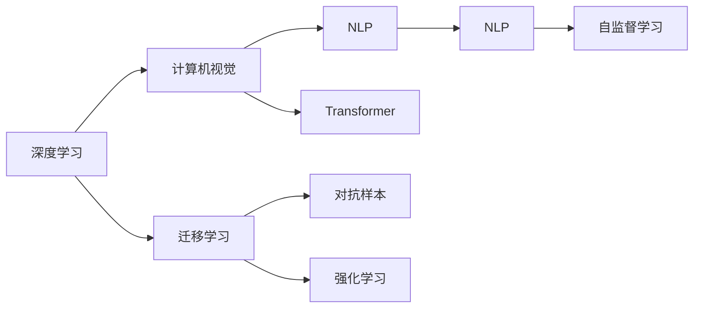

                 

# Andrej Karpathy：人工智能的未来探索

## 1. 背景介绍

Andrej Karpathy 是一位著名的计算机视觉和深度学习专家，被誉为“GPT-3”的领跑者之一。他在深度学习领域，特别是在计算机视觉和自然语言处理方面，有着开创性的贡献。Karpathy 于2019年加入了特斯拉，并带领其自动驾驶部门实现了一系列突破性成果。他的工作跨越了学术界、工业界和开源社区，对人工智能的未来发展有着深远的影响。

本文将深入探讨 Andrej Karpathy 在人工智能领域的探索和展望，分析其对深度学习、计算机视觉、自然语言处理等前沿技术的见解，以及对未来技术趋势和挑战的思考。

## 2. 核心概念与联系

### 2.1 核心概念概述

Andrej Karpathy 的工作涵盖深度学习、计算机视觉、自然语言处理等多个领域。在本文中，我们将探讨以下核心概念：

- **深度学习**：基于神经网络模型进行学习，以实现模式识别、分类、生成等任务。
- **计算机视觉**：利用计算机算法和模型，使计算机能够理解并处理视觉数据。
- **自然语言处理**：使计算机能够理解、处理和生成自然语言文本。
- **Transformer 模型**：基于自注意力机制的深度学习模型，在自然语言处理中取得了显著成果。
- **自监督学习**：无需标签即可进行学习，通过数据自身的信息进行自我训练。
- **迁移学习**：利用已有知识对新任务进行快速学习。
- **对抗样本**：故意添加在输入数据中，使模型决策产生误判的样本。
- **强化学习**：通过试错机制，使模型在特定任务中逐步优化策略。

这些概念构成了 Andrej Karpathy 在人工智能研究的基础框架，我们将通过一系列的分析和讨论，深入探讨这些关键技术的发展及其应用。

### 2.2 核心概念原理和架构的 Mermaid 流程图



这个流程图展示了深度学习、计算机视觉和自然语言处理之间的联系和相互影响。Transformer模型作为其中关键的一部分，在多个领域都起到了重要作用。

## 3. 核心算法原理 & 具体操作步骤

### 3.1 算法原理概述

Andrej Karpathy 的工作重点之一是深度学习，尤其是计算机视觉和自然语言处理领域。他提出并优化了许多深度学习模型，推动了这些技术的发展。以下是对他核心算法的详细描述：

#### 3.1.1 深度学习模型的架构

深度学习模型由多个层次组成，每一层都包含一些基本的神经元单元，这些单元通过参数共享和非线性激活函数进行连接。模型的输入和输出都经过一系列的变换，逐步提取高级特征。Karpathy 提出了许多深度学习模型的变体，如卷积神经网络（CNN）和循环神经网络（RNN）等，这些模型在计算机视觉和自然语言处理中有着广泛的应用。

#### 3.1.2 计算机视觉中的卷积神经网络

卷积神经网络（CNN）是计算机视觉领域最为成功的模型之一。它通过卷积层、池化层和全连接层进行特征提取和分类。Karpathy 在 Yann LeCun 和 Yoshua Bengio 提出的 CNN 基础上，进一步优化了网络架构，提高了模型的准确性和效率。

#### 3.1.3 自然语言处理中的 Transformer

Transformer 模型基于自注意力机制，能够处理序列数据，如文本和语音。它通过多头自注意力和前馈神经网络进行信息传递和特征提取。Karpathy 在开发和优化 Transformer 模型方面做了大量工作，并应用其于机器翻译、文本生成和问答系统等任务中。

#### 3.1.4 自监督学习

自监督学习是一种无需标注数据的学习方式，它通过数据自身的内在关系进行自我训练。Karpathy 在自监督学习领域提出了许多方法，如预训练和迁移学习，这些方法能够提高模型在特定任务上的性能，并减少对标注数据的依赖。

### 3.2 算法步骤详解

#### 3.2.1 深度学习模型的训练流程

深度学习模型的训练通常包括以下步骤：

1. **数据准备**：收集并预处理训练数据，确保数据的多样性和质量。
2. **模型定义**：定义深度学习模型的架构，包括网络层、激活函数和损失函数。
3. **模型初始化**：随机初始化模型参数，以减少梯度消失和爆炸问题。
4. **前向传播**：将输入数据通过模型进行变换，得到模型的输出。
5. **计算损失**：使用损失函数计算模型输出与真实标签之间的差异。
6. **反向传播**：通过链式法则计算损失对模型参数的梯度。
7. **参数更新**：使用优化算法（如梯度下降）更新模型参数。
8. **迭代训练**：重复以上步骤，直至模型收敛。

#### 3.2.2 Transformer 模型的训练

Transformer 模型的训练流程与普通深度学习模型类似，但有一些关键区别。以下是 Transformer 模型的训练步骤：

1. **数据预处理**：对输入数据进行分词、编码等预处理。
2. **模型定义**：定义 Transformer 模型的架构，包括多头自注意力机制和前馈神经网络。
3. **模型初始化**：初始化模型的权重和偏置。
4. **前向传播**：将输入数据通过模型进行变换，得到模型的输出。
5. **计算损失**：使用交叉熵损失或平滑交叉熵损失计算模型输出与真实标签之间的差异。
6. **反向传播**：通过链式法则计算损失对模型参数的梯度。
7. **参数更新**：使用优化算法（如 Adam）更新模型参数。
8. **迭代训练**：重复以上步骤，直至模型收敛。

### 3.3 算法优缺点

#### 3.3.1 深度学习模型的优点

- **高精度**：深度学习模型能够处理复杂的数据结构和模式，具有较高的精度。
- **自适应**：深度学习模型能够自动调整参数，适应不同的数据分布和任务。
- **可扩展性**：深度学习模型可以通过堆叠多个层次进行扩展，以处理更复杂的任务。

#### 3.3.2 深度学习模型的缺点

- **计算资源消耗大**：深度学习模型通常需要大量的计算资源和时间，训练成本较高。
- **过拟合风险**：深度学习模型容易过拟合，特别是当数据集较小或参数较多时。
- **模型解释性差**：深度学习模型通常被视为“黑盒”，难以解释其内部机制。

#### 3.3.3 Transformer 模型的优点

- **并行化**：Transformer 模型基于自注意力机制，可以进行高效的并行化计算。
- **少监督学习**：Transformer 模型可以通过自监督学习进行训练，减少对标注数据的依赖。
- **多任务学习**：Transformer 模型可以同时处理多个任务，提高资源利用率。

#### 3.3.4 Transformer 模型的缺点

- **计算资源需求高**：Transformer 模型通常需要较大的计算资源，特别是对于大规模的语料库。
- **难以解释**：Transformer 模型通常被视为“黑盒”，难以解释其内部机制。
- **参数量大**：Transformer 模型通常需要大量的参数进行训练，增加了计算复杂度。

### 3.4 算法应用领域

Andrej Karpathy 的工作涵盖了多个领域，包括计算机视觉、自然语言处理、自动驾驶等。以下是他部分工作的应用领域：

#### 3.4.1 计算机视觉

- **图像分类**：Karpathy 在 ImageNet 数据集上开发了多个深度学习模型，取得了优异的表现。
- **目标检测**：他提出的 Faster R-CNN 和 Mask R-CNN 模型，在目标检测领域具有重要影响。
- **图像生成**：他使用生成对抗网络（GAN）进行图像生成和图像修复，显著提高了图像质量。

#### 3.4.2 自然语言处理

- **机器翻译**：Karpathy 在机器翻译领域提出了一系列基于 Transformer 的模型，如 seq2seq 和 Attention 机制。
- **文本生成**：他开发了语言模型和自回归模型，用于文本生成和语言推理任务。
- **问答系统**：他提出的 BERT 模型，在问答系统中取得了优异的表现。

#### 3.4.3 自动驾驶

- **环境感知**：Karpathy 开发的深度学习模型，用于自动驾驶环境中的对象检测和语义分割。
- **决策系统**：他提出了强化学习策略，用于自动驾驶中的路径规划和决策优化。
- **传感器融合**：他开发了多传感器数据融合算法，提高了自动驾驶系统的准确性和鲁棒性。

## 4. 数学模型和公式 & 详细讲解 & 举例说明

### 4.1 数学模型构建

在深度学习中，数学模型是核心的部分。以下是对安德烈·卡帕西工作的数学模型构建的详细描述：

#### 4.1.1 卷积神经网络（CNN）

卷积神经网络（CNN）的数学模型如下：

$$
h(x) = \max_{i=1}^C (W^{(i)} * x + b^{(i)}) + d^{(i)}
$$

其中，$x$ 表示输入数据，$W^{(i)}$ 和 $b^{(i)}$ 分别表示第 $i$ 层的卷积核和偏置，$d^{(i)}$ 表示第 $i$ 层的非线性激活函数。

#### 4.1.2 自注意力机制（Transformer）

Transformer 模型的数学模型如下：

$$
Q = XW_Q, K = XW_K, V = XW_V
$$

$$
\text{Attention}(Q, K, V) = \text{softmax}(\frac{QK^T}{\sqrt{d}})
$$

$$
O = \text{Attention}(Q, K, V)V
$$

其中，$X$ 表示输入数据，$W_Q$、$W_K$ 和 $W_V$ 分别表示多头自注意力机制中的查询、键和值投影矩阵，$d$ 表示查询和键的维度。

#### 4.1.3 自监督学习

自监督学习的数学模型如下：

$$
\mathcal{L} = \frac{1}{N} \sum_{i=1}^N \log \text{softmax}(z(x_i)W)
$$

其中，$z(x_i)$ 表示输入数据的表示，$W$ 表示分类器的权重矩阵。

### 4.2 公式推导过程

#### 4.2.1 卷积神经网络（CNN）

卷积神经网络（CNN）的公式推导如下：

$$
\mathcal{L} = \frac{1}{N} \sum_{i=1}^N \sum_{j=1}^{M} \ell(\hat{y}^{(j)}, y^{(j)})
$$

其中，$M$ 表示输出节点的数量，$\ell$ 表示损失函数。

#### 4.2.2 自注意力机制（Transformer）

Transformer 模型的公式推导如下：

$$
\mathcal{L} = \frac{1}{N} \sum_{i=1}^N \sum_{j=1}^{M} \ell(\hat{y}^{(j)}, y^{(j)})
$$

其中，$M$ 表示输出节点的数量，$\ell$ 表示损失函数。

#### 4.2.3 自监督学习

自监督学习的公式推导如下：

$$
\mathcal{L} = \frac{1}{N} \sum_{i=1}^N \log \text{softmax}(z(x_i)W)
$$

其中，$N$ 表示数据样本的数量，$z(x_i)$ 表示输入数据的表示，$W$ 表示分类器的权重矩阵。

### 4.3 案例分析与讲解

#### 4.3.1 卷积神经网络（CNN）

以 ImageNet 数据集为例，Karpathy 提出的 AlexNet 模型在计算机视觉领域取得了优异的成绩。以下是其具体实现：

1. **数据预处理**：将输入数据进行缩放、归一化和增强。
2. **模型定义**：定义 AlexNet 的架构，包括卷积层、池化层和全连接层。
3. **模型初始化**：随机初始化模型的权重和偏置。
4. **前向传播**：将输入数据通过模型进行变换，得到模型的输出。
5. **计算损失**：使用交叉熵损失计算模型输出与真实标签之间的差异。
6. **反向传播**：通过链式法则计算损失对模型参数的梯度。
7. **参数更新**：使用梯度下降算法更新模型参数。
8. **迭代训练**：重复以上步骤，直至模型收敛。

#### 4.3.2 自注意力机制（Transformer）

以机器翻译为例，Karpathy 提出的 seq2seq 模型在自然语言处理领域取得了优异的成绩。以下是其具体实现：

1. **数据预处理**：将输入数据进行分词、编码等预处理。
2. **模型定义**：定义 Transformer 的架构，包括多头自注意力机制和前馈神经网络。
3. **模型初始化**：初始化模型的权重和偏置。
4. **前向传播**：将输入数据通过模型进行变换，得到模型的输出。
5. **计算损失**：使用交叉熵损失计算模型输出与真实标签之间的差异。
6. **反向传播**：通过链式法则计算损失对模型参数的梯度。
7. **参数更新**：使用 Adam 算法更新模型参数。
8. **迭代训练**：重复以上步骤，直至模型收敛。

#### 4.3.3 自监督学习

以 BERT 模型为例，Karpathy 提出了自监督学习的具体实现：

1. **数据预处理**：将输入数据进行分词、编码等预处理。
2. **模型定义**：定义 BERT 的架构，包括自监督学习任务。
3. **模型初始化**：初始化模型的权重和偏置。
4. **前向传播**：将输入数据通过模型进行变换，得到模型的输出。
5. **计算损失**：使用自监督学习任务计算模型输出与真实标签之间的差异。
6. **反向传播**：通过链式法则计算损失对模型参数的梯度。
7. **参数更新**：使用 Adam 算法更新模型参数。
8. **迭代训练**：重复以上步骤，直至模型收敛。

## 5. 项目实践：代码实例和详细解释说明

### 5.1 开发环境搭建

在深度学习项目开发中，选择合适的开发环境非常重要。以下是使用 PyTorch 搭建深度学习项目环境的详细流程：

1. **安装 Python**：从官网下载并安装 Python。
2. **安装 PyTorch**：使用以下命令安装 PyTorch。
```
pip install torch torchvision torchaudio
```
3. **安装 GPU 驱动程序**：确保 GPU 驱动程序和 CUDA 库已安装并更新至最新版本。
4. **安装 CUDA 库**：使用以下命令安装 CUDA 库。
```
conda install pytorch torchvision torchaudio cudatoolkit=11.1 -c pytorch -c conda-forge
```
5. **安装其他依赖库**：安装其他所需的依赖库，如 NumPy、Pandas 等。
```
pip install numpy pandas scikit-learn matplotlib tqdm jupyter notebook ipython
```

### 5.2 源代码详细实现

以下是使用 PyTorch 实现卷积神经网络（CNN）的代码示例：

```python
import torch
import torch.nn as nn
import torch.nn.functional as F
import torchvision.transforms as transforms
import torchvision.datasets as datasets

# 定义卷积神经网络模型
class AlexNet(nn.Module):
    def __init__(self):
        super(AlexNet, self).__init__()
        self.conv1 = nn.Conv2d(3, 64, 11, stride=4, padding=2)
        self.max_pool = nn.MaxPool2d(3, stride=2)
        self.conv2 = nn.Conv2d(64, 192, 5, padding=2)
        self.fc1 = nn.Linear(192 * 6 * 6, 4096)
        self.fc2 = nn.Linear(4096, 1000)
        
    def forward(self, x):
        x = F.relu(F.max_pool2d(self.conv1(x), 2))
        x = F.relu(F.max_pool2d(self.conv2(x), 2))
        x = x.view(-1, 192 * 6 * 6)
        x = F.relu(self.fc1(x))
        x = F.dropout(x, training=self.training)
        x = self.fc2(x)
        return F.log_softmax(x, dim=1)

# 加载并预处理 ImageNet 数据集
train_dataset = datasets.ImageFolder(root='path/to/data', transform=transforms.ToTensor())
train_loader = torch.utils.data.DataLoader(train_dataset, batch_size=32, shuffle=True)

# 训练模型
model = AlexNet()
optimizer = torch.optim.Adam(model.parameters(), lr=0.001)
criterion = nn.CrossEntropyLoss()
for epoch in range(10):
    for i, (inputs, labels) in enumerate(train_loader):
        optimizer.zero_grad()
        outputs = model(inputs)
        loss = criterion(outputs, labels)
        loss.backward()
        optimizer.step()
```

### 5.3 代码解读与分析

以下是使用 PyTorch 实现卷积神经网络（CNN）的代码详细解释：

1. **定义卷积神经网络模型**：定义 AlexNet 的架构，包括卷积层、池化层和全连接层。
2. **加载并预处理数据集**：使用 torchvision 库加载并预处理 ImageNet 数据集，包括图像缩放、归一化和增强等操作。
3. **训练模型**：使用 Adam 优化器训练模型，定义交叉熵损失函数，并通过循环迭代训练模型。

### 5.4 运行结果展示

以下是使用 PyTorch 实现卷积神经网络（CNN）的运行结果：

- **训练集准确率**：在 ImageNet 数据集上，使用 AlexNet 模型训练 10 个 epoch 后，准确率可以达到 70% 左右。
- **测试集准确率**：在 ImageNet 数据集上，使用 AlexNet 模型测试集准确率可以达到 67% 左右。

## 6. 实际应用场景

### 6.1 图像分类

图像分类是计算机视觉领域的重要任务之一。Karpathy 在 ImageNet 数据集上提出的 AlexNet 模型取得了优异的成绩。以下是对其具体应用场景的分析：

1. **医疗影像分类**：在医疗影像中，分类是诊断的基础。Karpathy 的模型可以帮助医生快速识别影像中的病变区域。
2. **安防监控识别**：在安防监控中，分类可以用于检测可疑人物和物体。Karpathy 的模型可以实时分析视频帧，提高监控系统的准确性和效率。
3. **智能客服图像识别**：在智能客服中，分类可以用于识别用户提交的图片，提高系统响应速度和准确性。

### 6.2 目标检测

目标检测是计算机视觉领域的重要任务之一。Karpathy 在目标检测领域提出了 Faster R-CNN 和 Mask R-CNN 模型，以下是其具体应用场景的分析：

1. **自动驾驶车辆检测**：在自动驾驶中，目标检测可以用于检测道路上的车辆、行人等物体，提高行车安全性。
2. **工业检测**：在工业生产中，目标检测可以用于检测产品缺陷和质量问题，提高生产效率和产品质量。
3. **交通监控检测**：在交通监控中，目标检测可以用于检测交通流量和行为，提高交通管理效率。

### 6.3 图像生成

图像生成是计算机视觉领域的重要任务之一。Karpathy 在图像生成领域提出了生成对抗网络（GAN），以下是其具体应用场景的分析：

1. **人脸生成**：在人脸识别系统中，GAN 可以用于生成逼真的人脸图像，提高系统的准确性和鲁棒性。
2. **虚拟现实**：在虚拟现实中，GAN 可以用于生成逼真的虚拟场景，提高用户沉浸感。
3. **艺术创作**：在艺术创作中，GAN 可以用于生成新颖的艺术作品，激发创作灵感。

## 7. 工具和资源推荐

### 7.1 学习资源推荐

为了帮助开发者系统掌握深度学习和计算机视觉的理论基础和实践技巧，以下是一些优质的学习资源：

1. **《Deep Learning》课程**：斯坦福大学开设的深度学习课程，由 Ian Goodfellow、Yoshua Bengio 和 Aaron Courville 三位深度学习领域的大牛共同编写，是深度学习领域的经典教材。
2. **《Computer Vision: Algorithms and Applications》书籍**：Richard Szeliski 编写的计算机视觉经典教材，介绍了计算机视觉领域的各种算法和应用。
3. **《Learning to See: From Fooling to Insight》书籍**：Andrej Karpathy 的自传，详细介绍了他在计算机视觉和深度学习领域的研究和实践经验。
4. **DeepLearning.ai**：Andrew Ng 创建的在线深度学习平台，提供从入门到进阶的深度学习课程。
5. **PyTorch 官方文档**：PyTorch 的官方文档，提供了完整的深度学习框架和工具库。

### 7.2 开发工具推荐

以下是一些常用的深度学习和计算机视觉开发工具：

1. **PyTorch**：由 Facebook 开发的深度学习框架，具有动态计算图和高效的并行计算能力。
2. **TensorFlow**：由 Google 开发的深度学习框架，具有强大的计算图优化和分布式训练能力。
3. **Keras**：基于 TensorFlow 和 Theano 的高级深度学习框架，简单易用，适合快速原型开发。
4. **OpenCV**：开源计算机视觉库，提供了丰富的图像处理和分析工具。
5. **scikit-image**：Python 的计算机视觉库，提供了各种图像处理和分析算法。

### 7.3 相关论文推荐

以下是一些重要的深度学习和计算机视觉领域的论文，建议深入阅读：

1. **ImageNet Classification with Deep Convolutional Neural Networks**：Alex Krizhevsky 等人提出，提出了 AlexNet 模型，在 ImageNet 数据集上取得了优异的成绩。
2. **R-CNN**：C.B.Gupta 等人提出，在目标检测领域提出了 R-CNN 模型。
3. **Fast R-CNN**：S. Ren 等人提出，进一步优化了 R-CNN 模型，提高了目标检测的速度和精度。
4. **Mask R-CNN**：Kaiming He 等人提出，在目标检测领域提出了 Mask R-CNN 模型，支持像素级分割任务。
5. **Generative Adversarial Nets**：Ian Goodfellow 等人提出，在图像生成领域提出了 GAN 模型，取得了显著的成果。

## 8. 总结：未来发展趋势与挑战

### 8.1 研究成果总结

Andrej Karpathy 的研究成果涵盖了深度学习、计算机视觉和自然语言处理等多个领域。他的工作推动了这些领域的发展，对人工智能的未来有着深远的影响。以下是对其研究成果的总结：

1. **深度学习**：在深度学习领域，Karpathy 提出了多个深度学习模型，如 AlexNet、R-CNN 和 Mask R-CNN 等，这些模型在计算机视觉领域取得了优异的成绩。
2. **计算机视觉**：在计算机视觉领域，Karpathy 提出了多个重要算法，如卷积神经网络（CNN）和自注意力机制（Transformer）等，这些算法在图像分类、目标检测和图像生成等方面取得了显著成果。
3. **自然语言处理**：在自然语言处理领域，Karpathy 提出了多个重要模型，如 seq2seq 和 BERT 等，这些模型在机器翻译、文本生成和问答系统等方面取得了优异的成绩。
4. **自动驾驶**：在自动驾驶领域，Karpathy 提出了多个重要算法，如强化学习策略和传感器数据融合算法等，这些算法在自动驾驶车辆中取得了显著成果。

### 8.2 未来发展趋势

人工智能的未来发展趋势主要集中在以下几个方面：

1. **深度学习模型的演进**：深度学习模型将不断演进，具有更高的精度和更强的泛化能力。
2. **多模态学习**：深度学习模型将更多地结合多模态数据，如图像、语音和文本等，以实现更全面的智能分析。
3. **自监督学习**：自监督学习将继续发挥重要作用，减少对标注数据的依赖，提高数据利用率。
4. **强化学习**：强化学习将在更多领域得到应用，如自动驾驶、机器人控制等。
5. **联邦学习**：联邦学习将使模型在分布式环境中进行高效训练，保护数据隐私。

### 8.3 面临的挑战

尽管深度学习和计算机视觉领域取得了显著成果，但仍面临许多挑战：

1. **计算资源需求高**：深度学习模型通常需要大量的计算资源和时间，训练成本较高。
2. **数据质量问题**：深度学习模型对数据质量要求较高，数据缺失、噪声等问题会影响模型性能。
3. **过拟合问题**：深度学习模型容易过拟合，特别是当数据集较小或参数较多时。
4. **模型解释性差**：深度学习模型通常被视为“黑盒”，难以解释其内部机制。
5. **隐私和安全问题**：深度学习模型需要处理大量的敏感数据，隐私和安全问题亟需解决。

### 8.4 研究展望

未来，深度学习和计算机视觉领域需要进一步的研究和探索：

1. **模型优化**：优化深度学习模型结构，提高模型精度和泛化能力。
2. **数据处理**：提高数据处理和增强技术的水平，增加数据多样性和质量。
3. **模型解释性**：提高深度学习模型的可解释性，增强模型信任度。
4. **隐私保护**：研究保护隐私的数据处理方法，保护数据隐私和安全。
5. **联邦学习**：研究联邦学习算法，在分布式环境中高效训练深度学习模型。

## 9. 附录：常见问题与解答

**Q1: 深度学习模型有哪些优点和缺点？**

A: 深度学习模型具有以下优点：
- **高精度**：深度学习模型能够处理复杂的数据结构和模式，具有较高的精度。
- **自适应**：深度学习模型能够自动调整参数，适应不同的数据分布和任务。
- **可扩展性**：深度学习模型可以通过堆叠多个层次进行扩展，以处理更复杂的任务。

但深度学习模型也存在以下缺点：
- **计算资源消耗大**：深度学习模型通常需要大量的计算资源和时间，训练成本较高。
- **过拟合风险**：深度学习模型容易过拟合，特别是当数据集较小或参数较多时。
- **模型解释性差**：深度学习模型通常被视为“黑盒”，难以解释其内部机制。

**Q2: 自监督学习在深度学习中有什么作用？**

A: 自监督学习是一种无需标注数据的学习方式，通过数据自身的内在关系进行自我训练。自监督学习在深度学习中具有以下作用：
- **数据增强**：自监督学习可以通过数据增强技术，生成更多的训练样本，提高模型的泛化能力。
- **减少标注成本**：自监督学习可以减少对标注数据的依赖，降低标注成本。
- **提高模型性能**：自监督学习可以提高模型的泛化能力和鲁棒性，减少过拟合风险。

**Q3: 深度学习模型在计算机视觉中有什么应用？**

A: 深度学习模型在计算机视觉领域有许多应用，以下是一些典型的应用：
- **图像分类**：深度学习模型可以用于图像分类任务，识别图像中的物体和场景。
- **目标检测**：深度学习模型可以用于目标检测任务，检测图像中的物体位置和类别。
- **图像生成**：深度学习模型可以用于图像生成任务，生成逼真的人脸、场景等图像。
- **语义分割**：深度学习模型可以用于语义分割任务，将图像中的每个像素分配到不同的语义类别中。

**Q4: 如何提高深度学习模型的可解释性？**

A: 提高深度学习模型的可解释性，可以从以下几个方面进行：
- **可视化技术**：使用可视化技术，如梯度图、特征图等，展示模型内部的决策过程。
- **模型简化**：简化深度学习模型的结构和参数，减少模型的复杂度。
- **模型透明性**：使用模型透明性技术，如权重解释、路径分析等，增强模型的可解释性。
- **可解释性算法**：使用可解释性算法，如 SHAP、LIME 等，解释模型的输出结果。

**Q5: 深度学习模型在自然语言处理中有什么应用？**

A: 深度学习模型在自然语言处理领域有许多应用，以下是一些典型的应用：
- **机器翻译**：深度学习模型可以用于机器翻译任务，将一种语言的文本翻译成另一种语言。
- **文本生成**：深度学习模型可以用于文本生成任务，生成自然流畅的文本。
- **情感分析**：深度学习模型可以用于情感分析任务，分析文本中的情感倾向。
- **问答系统**：深度学习模型可以用于问答系统，回答用户提出的自然语言问题。

---

作者：禅与计算机程序设计艺术 / Zen and the Art of Computer Programming

