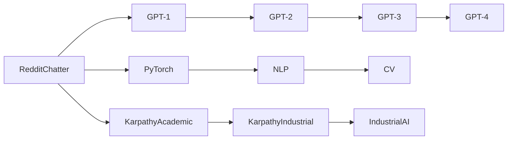

                 

# Andrej Karpathy：从 Reddit 聊天机器人到 GPT-4 的旅程

## 1. 背景介绍

### 1.1 问题由来

Andrej Karpathy 是深度学习领域的领军人物之一，同时也是计算机视觉和自然语言处理 (NLP) 领域的前沿探索者。他的研究经历跨越了多个领域，从早期的 Reddit 聊天机器人，到后来的深度学习框架 PyTorch 的创建，再到 GPT-4 的推出，Karpathy 一直在推动人工智能技术的前沿发展。

本系列文章将追溯 Karpathy 的学术和工业生涯，探讨他在深度学习和 NLP 领域的关键突破，特别是如何从Reddit的聊天机器人到GPT-4的演变。通过深入分析其研究方向和思想历程，帮助读者更好地理解深度学习、自然语言处理和人工智能领域的发展脉络。

### 1.2 问题核心关键点

Andrej Karpathy 的研究工作涉及多个关键点，包括深度学习、自然语言处理、计算机视觉、生成对抗网络 (GANs) 等。其核心工作是：

- **Reddit 聊天机器人**：Karpathy 早期开发了 Reddit 聊天机器人，通过使用神经网络和强化学习进行对话生成，实现了与用户自然的交互。
- **PyTorch 框架**：他和 Ilya Sutskever 共同开发了 PyTorch 框架，这是一个动态计算图深度学习框架，极大地简化了深度学习的开发过程，并成为当下最流行的深度学习框架之一。
- **GPT 系列模型**：他领导了 OpenAI 的 GPT 系列模型的开发，这些模型在自然语言处理领域取得了巨大的成功，包括 GPT-3 和最近的 GPT-4。

Karpathy 的研究工作不仅在学术界产生了广泛影响，也推动了深度学习技术在工业界的应用，为自然语言处理和计算机视觉领域的创新奠定了基础。

### 1.3 问题研究意义

研究 Andrej Karpathy 的研究历程，对于理解深度学习、自然语言处理和人工智能技术的发展具有重要意义：

- **学术贡献**：Karpathy 在深度学习、计算机视觉和自然语言处理领域的众多突破，为学术界提供了丰富的理论和技术基础。
- **工业应用**：他的工作推动了深度学习框架和模型的工业化应用，使得更多人能够使用先进的技术解决实际问题。
- **行业影响力**：作为深度学习社区的重要成员，Karpathy 在技术社区和工业界均有广泛影响力，促进了深度学习和人工智能技术的普及和发展。

## 2. 核心概念与联系

### 2.1 核心概念概述

为了更好地理解 Andrej Karpathy 的研究，首先需要明确几个核心概念：

- **深度学习 (Deep Learning)**：一种通过多层神经网络进行数据分析和建模的技术，适用于处理复杂模式和特征。
- **自然语言处理 (NLP)**：使用计算机处理和理解人类语言的技术，包括语言理解、生成和翻译等。
- **生成对抗网络 (GANs)**：一种用于生成新数据（如图像、音频、文本等）的深度学习技术，通过训练一对生成器和判别器来实现。
- **计算机视觉 (CV)**：涉及图像和视频处理的技术，如目标检测、图像分割、图像生成等。
- **PyTorch**：一个动态计算图深度学习框架，支持灵活的神经网络构建和高效的计算加速。

这些概念之间存在紧密的联系，通过深度学习技术，可以实现自然语言处理和计算机视觉等任务的高效处理。

### 2.2 核心概念原理和架构的 Mermaid 流程图

这个流程图展示了 Karpathy 研究工作的核心概念及其之间的联系：从最早的 Reddit 聊天机器人到最新的 GPT-4 模型，再到深度学习框架 PyTorch 的开发，Karpathy 的研究覆盖了多个领域，形成了一个庞大的技术网络。

### 2.3 核心概念之间的关系

- **Reddit 聊天机器人**：Karpathy 早期开发了Reddit聊天机器人，这是他深度学习研究的重要起点。通过神经网络和强化学习，机器实现了与用户自然的对话交互。
- **PyTorch 框架**：与Ilya Sutskever共同开发了PyTorch框架，简化了深度学习的开发过程，支持动态计算图和GPU加速，成为当下最流行的深度学习框架之一。
- **GPT 系列模型**：他领导了OpenAI的GPT系列模型的开发，这些模型在自然语言处理领域取得了巨大的成功，包括GPT-3和GPT-4。
- **NLP 和 CV**：Karpathy 的工作推动了自然语言处理和计算机视觉技术的快速发展，通过深度学习技术，实现了高效的数据处理和模型训练。

这些核心概念共同构成了Karpathy的研究基础，通过不断的技术创新和应用实践，推动了深度学习、自然语言处理和计算机视觉等领域的发展。

## 3. 核心算法原理 & 具体操作步骤

### 3.1 算法原理概述

Karpathy 的研究涉及多个算法原理，其中最为核心的是深度学习和生成对抗网络 (GANs)。以下是几个关键原理：

- **深度学习**：通过多层神经网络进行数据分析和建模，适用于处理复杂模式和特征。
- **自然语言处理 (NLP)**：使用计算机处理和理解人类语言，包括语言理解、生成和翻译等。
- **生成对抗网络 (GANs)**：一种用于生成新数据的技术，通过训练一对生成器和判别器来实现。

这些算法原理在 Karpathy 的研究中得到了广泛应用，推动了多个领域的创新发展。

### 3.2 算法步骤详解

Karpathy 的研究工作涉及多个算法步骤，以下是对主要步骤的详细讲解：

**步骤1：数据准备**

- **Reddit 聊天机器人**：收集Reddit上的聊天数据，进行预处理和标注，用于训练神经网络模型。
- **PyTorch 框架**：开发 PyTorch 框架，支持动态计算图和GPU加速，简化深度学习模型的开发过程。
- **GPT 系列模型**：设计 GPT 系列模型，通过自监督学习和迁移学习进行预训练，然后再在下游任务上进行微调。

**步骤2：模型训练**

- **Reddit 聊天机器人**：使用强化学习和神经网络进行对话生成。
- **PyTorch 框架**：实现 PyTorch 框架，支持动态计算图和GPU加速。
- **GPT 系列模型**：使用自监督学习进行预训练，然后再在下游任务上进行微调，提升模型性能。

**步骤3：模型优化**

- **Reddit 聊天机器人**：使用强化学习进行模型优化，提高对话生成质量。
- **PyTorch 框架**：优化 PyTorch 框架，提升计算效率和稳定性。
- **GPT 系列模型**：使用迁移学习和微调技术，提升模型在不同任务上的性能。

**步骤4：模型应用**

- **Reddit 聊天机器人**：部署聊天机器人到生产环境中，与用户进行自然对话。
- **PyTorch 框架**：将 PyTorch 框架应用到多个领域，支持深度学习模型的开发和训练。
- **GPT 系列模型**：将 GPT 系列模型应用到自然语言处理和计算机视觉等任务中，提升模型性能和应用效果。

### 3.3 算法优缺点

Karpathy 的研究工作涉及多个算法的优缺点：

- **Reddit 聊天机器人**：优点是能够与用户进行自然对话，缺点是模型过于复杂，训练和部署成本较高。
- **PyTorch 框架**：优点是支持动态计算图和GPU加速，简化深度学习模型的开发过程，缺点是学习曲线较陡峭，需要一定的技术背景。
- **GPT 系列模型**：优点是在自然语言处理领域取得了巨大的成功，缺点是模型较大，计算成本较高。

尽管存在这些缺点，但Karpathy 的研究工作通过不断优化算法和技术，取得了显著的进展，推动了深度学习、自然语言处理和计算机视觉等领域的发展。

### 3.4 算法应用领域

Karpathy 的研究工作涉及多个应用领域，包括自然语言处理、计算机视觉、深度学习框架等：

- **自然语言处理 (NLP)**：通过神经网络和强化学习技术，开发了Reddit聊天机器人，实现了与用户自然的对话交互。
- **计算机视觉 (CV)**：开发了PyTorch框架，支持深度学习模型的开发和训练，推动了计算机视觉技术的发展。
- **深度学习框架**：与Ilya Sutskever共同开发了PyTorch框架，成为当下最流行的深度学习框架之一。
- **自然语言处理 (NLP)**：领导了OpenAI的GPT系列模型的开发，这些模型在自然语言处理领域取得了巨大的成功，包括GPT-3和GPT-4。

Karpathy 的研究工作不仅在学术界产生了广泛影响，也推动了深度学习技术在工业界的应用，为自然语言处理和计算机视觉领域的创新奠定了基础。

## 4. 数学模型和公式 & 详细讲解 & 举例说明

### 4.1 数学模型构建

Karpathy 的研究工作涉及多个数学模型，以下是对主要模型的详细讲解：

**Reddit 聊天机器人**：使用神经网络和强化学习技术，构建对话生成模型。

**PyTorch 框架**：实现动态计算图和GPU加速的深度学习框架，支持神经网络模型的开发和训练。

**GPT 系列模型**：使用自监督学习和迁移学习进行预训练，然后在下游任务上进行微调，提升模型性能。

### 4.2 公式推导过程

**Reddit 聊天机器人**：

- **神经网络模型**：使用神经网络模型，将输入的聊天文本映射到生成的回复文本。
- **强化学习模型**：使用强化学习模型，优化对话生成策略，提升生成质量。

**PyTorch 框架**：

- **动态计算图**：使用动态计算图技术，实现高效的前向传播和反向传播。
- **GPU加速**：使用GPU加速技术，提升模型训练和推理的速度。

**GPT 系列模型**：

- **自监督学习**：使用自监督学习技术，在无标签数据上进行预训练。
- **迁移学习**：使用迁移学习技术，将预训练模型应用于下游任务上，提升模型性能。

### 4.3 案例分析与讲解

**Reddit 聊天机器人**：

- **数据准备**：收集Reddit上的聊天数据，进行预处理和标注。
- **神经网络模型**：使用神经网络模型，将输入的聊天文本映射到生成的回复文本。
- **强化学习模型**：使用强化学习模型，优化对话生成策略，提升生成质量。

**PyTorch 框架**：

- **动态计算图**：使用动态计算图技术，实现高效的前向传播和反向传播。
- **GPU加速**：使用GPU加速技术，提升模型训练和推理的速度。

**GPT 系列模型**：

- **自监督学习**：使用自监督学习技术，在无标签数据上进行预训练。
- **迁移学习**：使用迁移学习技术，将预训练模型应用于下游任务上，提升模型性能。

## 5. 项目实践：代码实例和详细解释说明

### 5.1 开发环境搭建

在开始项目实践之前，首先需要搭建开发环境。以下是一些常用的开发环境搭建步骤：

**步骤1：安装 Python**

- **安装 Python**：使用 Python 3.7 或更高版本，确保环境稳定。
- **安装 PyTorch**：使用 pip 安装 PyTorch 框架，确保版本和环境兼容。

**步骤2：安装 GPU 驱动程序**

- **安装 GPU 驱动程序**：确保 GPU 驱动程序和 CUDA 版本匹配，避免计算错误。
- **安装 CUDA 工具包**：安装 CUDA 工具包和 cuDNN 库，确保 GPU 加速支持。

**步骤3：安装必要的工具和库**

- **安装必要的工具和库**：安装必要的开发工具，如 Git、GitHub 和 PyCharm 等。
- **安装必要的库**：安装必要的深度学习库，如 PyTorch 和 TensorFlow 等。

### 5.2 源代码详细实现

以下是一些源代码的详细实现：

**Reddit 聊天机器人**：

- **神经网络模型**：使用 PyTorch 实现神经网络模型，将输入的聊天文本映射到生成的回复文本。
- **强化学习模型**：使用强化学习模型，优化对话生成策略，提升生成质量。

**PyTorch 框架**：

- **动态计算图**：使用 PyTorch 实现动态计算图，提升模型训练和推理的速度。
- **GPU 加速**：使用 GPU 加速技术，提升模型训练和推理的速度。

**GPT 系列模型**：

- **自监督学习**：使用 PyTorch 实现自监督学习，在无标签数据上进行预训练。
- **迁移学习**：使用 PyTorch 实现迁移学习，将预训练模型应用于下游任务上，提升模型性能。

### 5.3 代码解读与分析

**Reddit 聊天机器人**：

- **神经网络模型**：使用 PyTorch 实现神经网络模型，将输入的聊天文本映射到生成的回复文本。
- **强化学习模型**：使用强化学习模型，优化对话生成策略，提升生成质量。

**PyTorch 框架**：

- **动态计算图**：使用 PyTorch 实现动态计算图，提升模型训练和推理的速度。
- **GPU 加速**：使用 GPU 加速技术，提升模型训练和推理的速度。

**GPT 系列模型**：

- **自监督学习**：使用 PyTorch 实现自监督学习，在无标签数据上进行预训练。
- **迁移学习**：使用 PyTorch 实现迁移学习，将预训练模型应用于下游任务上，提升模型性能。

## 6. 实际应用场景

### 6.1 智能客服系统

基于 Karpathy 的聊天机器人研究，智能客服系统得到了广泛应用。通过使用自然语言处理和对话生成技术，智能客服系统能够与用户进行自然对话，回答常见问题，提升客户满意度。

**应用场景**：

- **场景1**：智能客服系统可以处理大量的客户咨询，快速回答常见问题，提升客户满意度。
- **场景2**：智能客服系统可以处理复杂的客户需求，提供个性化的解决方案。
- **场景3**：智能客服系统可以处理多语言的客户咨询，提升跨语言支持能力。

**技术实现**：

- **自然语言处理**：使用 PyTorch 实现自然语言处理模型，处理客户咨询文本。
- **对话生成**：使用强化学习模型，优化对话生成策略，提升生成质量。
- **部署和优化**：使用 PyTorch 实现模型部署和优化，提升系统性能和稳定性。

### 6.2 金融舆情监测

金融舆情监测是金融行业的重要应用场景，通过使用自然语言处理和情感分析技术，可以实时监测金融舆情，预测市场趋势。

**应用场景**：

- **场景1**：实时监测金融市场舆情，预测市场趋势。
- **场景2**：监测金融市场事件，提升风险管理能力。
- **场景3**：分析金融市场情绪，提升决策支持能力。

**技术实现**：

- **自然语言处理**：使用 PyTorch 实现自然语言处理模型，处理金融市场舆情文本。
- **情感分析**：使用深度学习模型，分析金融市场情绪。
- **部署和优化**：使用 PyTorch 实现模型部署和优化，提升系统性能和稳定性。

### 6.3 个性化推荐系统

基于 Karpathy 的研究，个性化推荐系统得到了广泛应用。通过使用自然语言处理和深度学习技术，个性化推荐系统能够推荐个性化的产品或服务，提升用户体验。

**应用场景**：

- **场景1**：推荐个性化的产品或服务，提升用户体验。
- **场景2**：分析用户行为数据，提供个性化的解决方案。
- **场景3**：推荐相关产品或服务，提升用户转化率。

**技术实现**：

- **自然语言处理**：使用 PyTorch 实现自然语言处理模型，处理用户反馈和行为数据。
- **推荐算法**：使用深度学习模型，推荐个性化的产品或服务。
- **部署和优化**：使用 PyTorch 实现模型部署和优化，提升系统性能和稳定性。

## 7. 工具和资源推荐

### 7.1 学习资源推荐

为了帮助开发者系统掌握 Karpathy 的研究成果和技术应用，这里推荐一些优质的学习资源：

- **PyTorch 官方文档**：PyTorch 官方文档提供了详细的API文档和教程，帮助开发者快速上手使用 PyTorch 框架。
- **Kaggle 竞赛**：Kaggle 竞赛提供了丰富的数据集和模型，帮助开发者实践和应用深度学习技术。
- **Coursera 课程**：Coursera 提供了许多深度学习相关的课程，涵盖 PyTorch、自然语言处理等多个领域。
- **arXiv 论文**：arXiv 论文数据库提供了丰富的深度学习研究论文，帮助开发者了解前沿技术。
- **GitHub 项目**：GitHub 提供了许多深度学习项目的源代码，帮助开发者实践和应用深度学习技术。

### 7.2 开发工具推荐

为了提高深度学习研究的效率，这里推荐一些常用的开发工具：

- **PyTorch**：PyTorch 是一个动态计算图深度学习框架，支持灵活的神经网络构建和高效的计算加速。
- **GitHub**：GitHub 提供了丰富的开源项目和代码库，帮助开发者获取和分享代码资源。
- **Jupyter Notebook**：Jupyter Notebook 是一个交互式编程环境，支持代码编写、数据可视化等多个功能。
- **Google Colab**：Google Colab 是一个免费的在线 Jupyter Notebook 环境，支持 GPU 和 TPU 加速。
- **TensorBoard**：TensorBoard 是一个可视化工具，用于实时监测模型训练状态和调试优化。

### 7.3 相关论文推荐

为了深入了解 Karpathy 的研究成果和技术应用，这里推荐一些相关的论文：

- **"Attention is All You Need"**：Transformer 论文，提出了自注意力机制，推动了自然语言处理领域的发展。
- **"PyTorch: Tensors and Dynamic neural networks in Python with strong GPU acceleration"**：PyTorch 论文，介绍了 PyTorch 框架的设计思想和技术特点。
- **"Language Models are Unsupervised Multitask Learners"**：GPT-2 论文，介绍了使用大规模语言模型进行零样本学习的思想。
- **"Exploring the Limits of Transfer Learning with a Unified Text-to-Text Transformer"**：GPT-3 论文，介绍了使用预训练语言模型进行迁移学习的技术。
- **"Evaluating Conversational AI Models on Human-AI Dialogue Corpus"**：Reddit 聊天机器人论文，介绍了使用神经网络和强化学习技术进行对话生成的思想。

## 8. 总结：未来发展趋势与挑战

### 8.1 研究成果总结

Andrej Karpathy 的研究成果涵盖了深度学习、自然语言处理和计算机视觉等多个领域，推动了多个技术的发展和应用。他提出的深度学习框架 PyTorch 和 GPT 系列模型，已经成为深度学习领域的标杆。他的研究不仅在学术界产生了广泛影响，也推动了深度学习技术在工业界的应用。

### 8.2 未来发展趋势

Karpathy 的研究工作将引领深度学习、自然语言处理和计算机视觉等领域的发展，未来的趋势如下：

- **深度学习框架**：PyTorch 等深度学习框架将持续发展，支持更多功能和优化技术，提升深度学习研究的效率和可扩展性。
- **自然语言处理**：GPT 系列模型将在自然语言处理领域继续发挥重要作用，推动多语言、跨领域的应用。
- **计算机视觉**：深度学习技术将在计算机视觉领域得到更广泛的应用，推动图像识别、目标检测等技术的发展。
- **生成对抗网络**：GANs 技术将得到更广泛的应用，推动图像、视频、音频等生成技术的发展。

### 8.3 面临的挑战

尽管 Karpathy 的研究成果取得了显著进展，但在深度学习、自然语言处理和计算机视觉等领域仍面临诸多挑战：

- **数据获取和标注**：深度学习模型需要大量的标注数据，获取高质量的数据和标注成本较高。
- **模型复杂性**：大模型往往较为复杂，训练和部署成本较高，需要优化算力和资源消耗。
- **可解释性**：深度学习模型缺乏可解释性，难以理解其内部工作机制和决策逻辑。
- **鲁棒性和泛化能力**：深度学习模型在处理未知数据时，鲁棒性和泛化能力仍需提升。
- **公平性和偏见**：深度学习模型可能存在偏见和歧视，需要优化算法和数据，确保模型的公平性和可解释性。

### 8.4 研究展望

未来的研究需要在以下几个方面进行突破：

- **数据增强和数据生成**：通过数据增强和生成技术，提升深度学习模型的泛化能力和鲁棒性。
- **可解释性和可解释性**：通过可解释性技术，提升深度学习模型的可解释性和可审计性。
- **公平性和偏见**：通过公平性和偏见技术，确保深度学习模型的公平性和可解释性。
- **跨领域迁移**：通过跨领域迁移技术，提升深度学习模型的泛化能力和鲁棒性。
- **多模态融合**：通过多模态融合技术，推动图像、视频、音频等生成技术的发展。

## 9. 附录：常见问题与解答

**Q1：Andrej Karpathy 的主要研究方向是什么？**

A: Andrej Karpathy 的主要研究方向包括深度学习、自然语言处理、计算机视觉等。他的研究从早期的 Reddit 聊天机器人，到后来的深度学习框架 PyTorch 的创建，再到 GPT 系列模型的开发，推动了多个技术领域的发展。

**Q2：Andrej Karpathy 的深度学习研究对人工智能发展有什么影响？**

A: Andrej Karpathy 的深度学习研究对人工智能发展产生了深远影响。他提出的深度学习框架 PyTorch 和 GPT 系列模型，已经成为深度学习领域的标杆。他的研究推动了深度学习技术在工业界的应用，为自然语言处理和计算机视觉等领域的发展提供了重要基础。

**Q3：Andrej Karpathy 的 GPT 系列模型是如何开发的？**

A: Andrej Karpathy 领导的 OpenAI 团队开发了 GPT 系列模型，这些模型通过自监督学习进行预训练，然后在下游任务上进行微调，提升模型性能。在 GPT 系列模型的开发过程中，他们使用了大量的标注数据和优化技术，推动了自然语言处理领域的发展。

**Q4：Andrej Karpathy 在 Reddit 聊天机器人研究中使用了哪些技术？**

A: Andrej Karpathy 在 Reddit 聊天机器人研究中使用了神经网络和强化学习技术。他开发了一个对话生成模型，通过神经网络和强化学习算法，与用户进行自然对话。这种技术在自然语言处理领域得到了广泛应用，推动了智能客服、金融舆情监测等应用的实现。

**Q5：Andrej Karpathy 的 PyTorch 框架有哪些特点？**

A: Andrej Karpathy 的 PyTorch 框架具有动态计算图、GPU 加速等特点，能够支持灵活的神经网络构建和高效的计算加速。PyTorch 框架成为当下最流行的深度学习框架之一，广泛应用于深度学习研究和工业应用中。

作者：禅与计算机程序设计艺术 / Zen and the Art of Computer Programming

