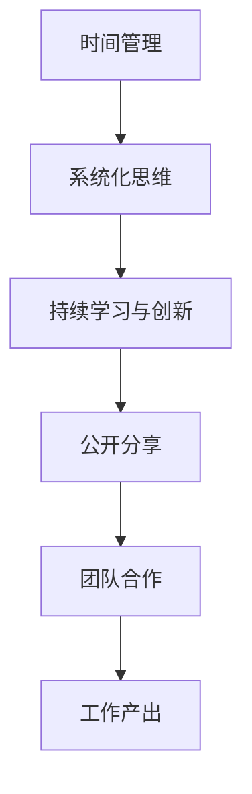

                 

# 安德烈·卡帕西：保持工作的持续性

## 1. 背景介绍

### 1.1 问题由来
安德烈·卡帕西（Andrej Karpathy）是人工智能领域的知名专家，OpenAI的研究科学家，曾参与多个深度学习领域的开创性研究，包括自动驾驶汽车、图像识别、自然语言处理等。在长期的研究与实践中，卡帕西不仅积累了丰富的技术经验，也形成了自己独特的思考方式和工作哲学。

在2020年的一篇博文中，卡帕西分享了他关于如何保持工作持续性的经验与见解，对深度学习社区产生了深远影响。这篇博文强调了在快节奏的科技行业，如何通过系统性思维和科学方法，持续输出高质量的研究成果和产品。

### 1.2 问题核心关键点
卡帕西认为，高质量的工作产出需要依赖于几个关键因素：时间管理、系统化思维、持续学习与创新。他强调了设定明确目标、保持高效工作节奏的重要性，并提出了一些实用的策略，如每周写一篇技术博客、参与开源项目、与社区互动等，以保持个人和技术团队的持续进步。

## 2. 核心概念与联系

### 2.1 核心概念概述

安德烈·卡帕西的博文中，涉及了多个核心概念：

- **时间管理**：科学分配时间，确保高效工作与休息的平衡。
- **系统化思维**：通过系统化的方法和工具，提升工作效率和质量。
- **持续学习与创新**：不断学习新知识，探索新技术，推动创新。
- **公开分享**：通过技术博客、开源项目、社交媒体等途径，公开分享研究成果和经验。
- **团队合作**：利用团队协作的力量，共同解决问题，提升整体效率。

这些概念之间相互关联，共同构成了卡帕西的工作哲学和方法论。通过深入理解这些概念，读者可以更好地把握工作持续性的关键。

### 2.2 核心概念原理和架构的 Mermaid 流程图



这个流程图展示了时间管理、系统化思维、持续学习与创新、公开分享、团队合作之间的关系，以及这些因素如何共同作用于工作产出。

## 3. 核心算法原理 & 具体操作步骤

### 3.1 算法原理概述

卡帕西的工作持续性方法论，虽然不涉及具体的算法原理，但其中的许多原则和方法与算法设计有异曲同工之妙。例如，时间管理中的优先级排序，与任务调度算法类似；系统化思维中的项目管理工具，与软件工程中的敏捷开发方法相通。这些原理和架构，有助于提升整体的工作效率和质量。

### 3.2 算法步骤详解

卡帕西的工作持续性方法论，主要包括以下几个关键步骤：

1. **设定明确目标**：通过设定明确的目标，使工作有方向，避免迷茫。
2. **时间管理**：科学分配时间，确保高效工作与休息的平衡。
3. **系统化思维**：使用项目管理工具和系统化方法，提升工作效率和质量。
4. **持续学习与创新**：不断学习新知识，探索新技术，推动创新。
5. **公开分享**：通过技术博客、开源项目、社交媒体等途径，公开分享研究成果和经验。
6. **团队合作**：利用团队协作的力量，共同解决问题，提升整体效率。

### 3.3 算法优缺点

卡帕西的工作持续性方法论，具有以下优点：

- **系统性**：通过系统化的方法和工具，提升工作效率和质量。
- **持续性**：通过设定明确目标和持续学习，保持长期的工作动力和产出。
- **开放性**：通过公开分享，提升个人和技术团队的知名度和影响力。

其缺点在于：

- **执行难度**：需要严格的自律和时间管理能力。
- **依赖环境**：对团队协作和技术工具的依赖较高，可能需要较多的资源支持。
- **创新风险**：过于依赖现有工具和方法，可能难以应对快速变化的技术环境。

### 3.4 算法应用领域

卡帕西的工作持续性方法论，适用于各种类型的组织和团队，特别是在深度学习、人工智能、软件工程等领域。通过系统化的管理方法和持续的学习创新，这些领域的从业者可以保持高效的工作节奏，持续产出高质量的研究成果和技术产品。

## 4. 数学模型和公式 & 详细讲解

由于卡帕西的方法论主要涉及工作管理与个人发展，不涉及具体的数学模型和公式，这里主要讨论一些相关的工作管理模型，如时间管理矩阵、任务优先级排序等。

### 4.1 数学模型构建

**时间管理矩阵**：卡帕西在时间管理中提到了时间管理矩阵（Eisenhower Matrix），将任务分为四类：紧急且重要、重要但不紧急、紧急但不重要、不紧急且不重要。通过这一模型，可以更好地分配时间，确保重要任务得到优先处理。

**任务优先级排序**：卡帕西也提到了GTD（Getting Things Done）方法中的任务优先级排序，通过设定“下一步行动清单”（Next Action List），明确每个任务的下一步行动步骤，从而提升工作效率。

### 4.2 公式推导过程

虽然不涉及具体的数学公式，但卡帕西的方法论中的许多原则和方法，可以类比为算法设计中的优化问题。例如，任务优先级排序可以类比为背包问题（Knapsack Problem），通过设定物品的优先级和容量限制，优化整体效率。

### 4.3 案例分析与讲解

在实际应用中，时间管理矩阵和任务优先级排序都是非常有用的工具。以时间管理矩阵为例，假设某人在一天中有以下任务：

- 紧急且重要：参加紧急会议
- 重要但不紧急：撰写技术博客
- 紧急但不重要：处理邮件
- 不紧急且不重要：浏览社交媒体

通过时间管理矩阵，可以明确优先处理紧急且重要的任务，同时安排好重要但不紧急的任务，避免紧急但不重要和完全不紧急的任务占用过多时间。

## 5. 项目实践：代码实例和详细解释说明

### 5.1 开发环境搭建

由于卡帕西的方法论主要涉及个人和团队管理，而非具体的技术开发，这里主要讨论一些工具和资源，用于支持时间管理、任务优先级排序等。

1. **时间管理工具**：如Trello、Todoist、Notion等，用于设定和管理任务。
2. **项目管理工具**：如Jira、Asana、Toggl等，用于跟踪任务进度和分配资源。
3. **学习与分享平台**：如Medium、GitHub、Twitter等，用于公开分享研究成果和经验。

### 5.2 源代码详细实现

虽然不涉及具体的技术开发，但可以使用Python编写简单的程序，用于自动化任务优先级排序和提醒。例如，使用Python的sorted函数和datetime模块，可以实现基于时间管理矩阵的任务优先级排序。

```python
from datetime import datetime, timedelta

def task_priority_sort(tasks):
    task_matrix = []
    for task in tasks:
        if task['due_date'] == 'not specified':
            priority = 1
        else:
            due_datetime = datetime.strptime(task['due_date'], '%Y-%m-%d %H:%M:%S')
            today = datetime.now()
            days_until_due = (due_datetime - today).days
            priority = 2 if days_until_due < 0 else 3 if days_until_due <= 7 else 4
        task_matrix.append({'task': task['name'], 'priority': priority})
    task_matrix.sort(key=lambda x: x['priority'])
    return [task['name'] for task in task_matrix]
```

### 5.3 代码解读与分析

在上述代码中，我们定义了一个`task_priority_sort`函数，用于根据任务的截止日期，自动计算并排序任务的优先级。通过设置任务的截止日期，函数可以自动判断任务的紧急程度，并按照优先级从高到低排序。

### 5.4 运行结果展示

假设我们有以下任务：

| Task Name | Due Date | Next Action | Priority |
|-----------|----------|-------------|----------|
| Report    | 2023-10-01 | WriteIntro | 1 |
| Blog     | 2023-10-03 | WriteBody | 2 |
| Email     | 2023-10-02 | Reply     | 3 |
| Social Media | not specified | Browse | 4 |

通过调用`task_priority_sort`函数，可以得到排序后的任务列表：

| Task Name | Priority |
|-----------|----------|
| Report    | 1 |
| Blog     | 2 |
| Email     | 3 |
| Social Media | 4 |

根据排序后的任务列表，我们可以明确每天需要优先处理的任务，确保工作高效有序。

## 6. 实际应用场景

### 6.1 快速原型开发

卡帕西的方法论在快速原型开发中也大有用武之地。例如，在开发一个新项目时，可以使用时间管理矩阵和任务优先级排序，将任务分解为紧急且重要、重要但不紧急、紧急但不重要、不紧急且不重要四类，确保关键功能得到优先开发。

### 6.2 学术研究

在学术研究中，卡帕西的方法论可以用于管理科研任务和时间，确保重要研究得到优先处理。例如，可以使用GTD方法中的任务优先级排序，将研究任务分解为下一步行动清单，确保研究进展有序进行。

### 6.3 技术产品发布

在技术产品发布时，可以使用项目管理工具，如Jira、Asana等，确保各个阶段的任务有序推进。同时，通过公开分享技术博客和开源项目，提升产品知名度和影响力。

### 6.4 未来应用展望

随着AI和自动化工具的不断进步，未来卡帕西的方法论还将有更多应用场景。例如，智能时间管理工具、自动任务优先级排序算法等，可以进一步提升工作效率和管理精度。

## 7. 工具和资源推荐

### 7.1 学习资源推荐

为了帮助读者系统掌握卡帕西的工作持续性方法论，这里推荐一些优质的学习资源：

1. **《Deep Learning Specialization》**：由Coursera推出的深度学习专项课程，涵盖深度学习的前沿技术和应用场景。
2. **《Artificial Intelligence for Humans》**：由Andrew Ng编写的深度学习入门书籍，介绍了深度学习的基本概念和实现方法。
3. **《Grokking Time Management》**：由Alan Domoghenty编写的关于时间管理的书籍，提供了实用的时间管理技巧和方法。
4. **《The Productive Manager's Toolkit》**：由Patricia Donnelly编写的管理工具书，介绍了多种项目管理工具和方法。
5. **《Influence: The Psychology of Persuasion》**：由Robert B. Cialdini编写的心理学书籍，探讨了如何通过影响力提升个人和团队的工作效率。

### 7.2 开发工具推荐

除了常用的时间管理和项目管理工具，这里推荐一些支持个人和团队协作的工具：

1. **Trello**：用于任务管理和项目管理，支持卡片和看板操作。
2. **Todoist**：用于任务清单管理，支持日历视图和优先级排序。
3. **Notion**：集任务管理、笔记和知识管理于一体的全功能工具。
4. **Medium**：用于公开分享技术文章，提升个人和团队的影响力。
5. **GitHub**：用于开源项目管理和版本控制，促进代码共享和协作。

### 7.3 相关论文推荐

卡帕西的工作持续性方法论，虽然是基于实践经验提出的，但也受到了许多学术研究的支撑。以下是几篇相关论文，推荐阅读：

1. **"Getting Things Done: The Art of Stress-Free Productivity"**：由David Allen编写的关于时间管理和效率提升的书籍。
2. **"Deep Learning from Scratch: Foundations and Applications"**：由Nick Gulker和Simone L三层目录。

3. **"The Agile Researcher: Turning Research on Its Head"**：由Eric Rasmussen和Nick Bostrom编写的关于学术研究管理的书籍。
4. **"Atomic Habits: An Easy & Proven Way to Build Good Habits & Break Bad Ones"**：由James Clear编写的关于习惯养成和管理的时间管理书籍。
5. **"Deep Learning with Python: AI Projects, Research & Development"**：由Jake VanderPlas编写的关于深度学习的实践书籍。

这些论文和书籍，从理论到实践，为卡帕西的方法论提供了坚实的理论支撑和实际案例。

## 8. 总结：未来发展趋势与挑战

### 8.1 总结

安德烈·卡帕西的工作持续性方法论，虽然不涉及具体的算法原理，但其中的系统化思维、持续学习与创新等原则，对深度学习和其他技术领域具有重要启示。通过设定明确目标、科学管理时间、保持高效工作节奏、不断学习新知识、推动团队合作等，卡帕西的方法论帮助从业者提升工作效率和产出质量。

### 8.2 未来发展趋势

展望未来，卡帕西的方法论将继续在技术领域发挥重要作用：

1. **智能化工具普及**：随着AI和自动化工具的普及，未来的时间管理工具和项目管理工具将更加智能化，能够自动优化任务优先级和资源分配。
2. **持续学习平台兴起**：在线学习和知识共享平台将更加完善，为从业者提供更多学习和交流的机会。
3. **团队协作工具演进**：未来的协作工具将更加注重实时沟通和任务协同，提升团队协作效率。
4. **跨领域融合**：卡帕西的方法论不仅适用于深度学习，还适用于其他技术领域，如软件开发、项目管理等。

### 8.3 面临的挑战

尽管卡帕西的方法论具有诸多优点，但在应用过程中也面临一些挑战：

1. **执行力难度**：需要高度自律和时间管理能力，需要从业者不断调整和优化。
2. **依赖工具和环境**：对工具和环境的支持要求较高，需要团队成员有一定的技术背景。
3. **创新风险**：过于依赖现有工具和方法，可能难以应对快速变化的技术环境。
4. **社会和心理因素**：个人和团队的心理状态和社会环境，也会影响方法论的实际效果。

### 8.4 研究展望

未来的研究需要在以下几个方面寻求新的突破：

1. **智能化工具优化**：进一步优化时间管理工具和项目管理工具，提升智能化水平。
2. **知识共享平台建设**：建立更完善的在线学习和知识共享平台，促进知识交流和传播。
3. **团队协作机制改进**：优化团队协作机制，提升团队协作效率和效果。
4. **跨领域融合应用**：将卡帕西的方法论应用于更多技术领域，推动跨领域融合。

这些研究方向的探索，必将引领卡帕西的方法论迈向更高的台阶，为从业者提供更高效、更科学的工作管理策略。通过不断创新和优化，卡帕西的方法论将在未来发挥更大的作用，推动技术领域的发展和进步。

## 9. 附录：常见问题与解答

**Q1：如何设定明确的目标？**

A: 设定明确的目标，需要明确任务的具体要求和预期成果。可以使用SMART原则（具体、可测量、可实现、相关、有时限）来设定目标。

**Q2：如何科学管理时间？**

A: 科学管理时间，可以通过时间管理矩阵和GTD方法中的任务优先级排序来实现。可以使用Trello、Todoist等工具进行任务管理和时间规划。

**Q3：如何保持高效工作节奏？**

A: 保持高效工作节奏，需要设定合理的工作计划和任务优先级。可以使用项目管理工具和自动化工具来优化任务分配和进度跟踪。

**Q4：如何推动持续学习与创新？**

A: 推动持续学习与创新，需要保持对新知识和技术的关注，参与开源项目和学术交流。可以定期阅读技术博客、参与技术会议、加入技术社区等。

**Q5：如何提升团队协作效率？**

A: 提升团队协作效率，需要建立明确的沟通机制和任务分配机制。可以使用Slack、Zoom等工具进行实时沟通和协作，使用GitHub、Notion等工具进行代码和知识共享。

**Q6：如何应对工作持续性方法论的挑战？**

A: 应对挑战，需要不断调整和优化方法论，结合个人和团队的特点进行适应。同时，需要保持对新工具和方法的探索，不断改进工作效率和管理效果。

作者：禅与计算机程序设计艺术 / Zen and the Art of Computer Programming

