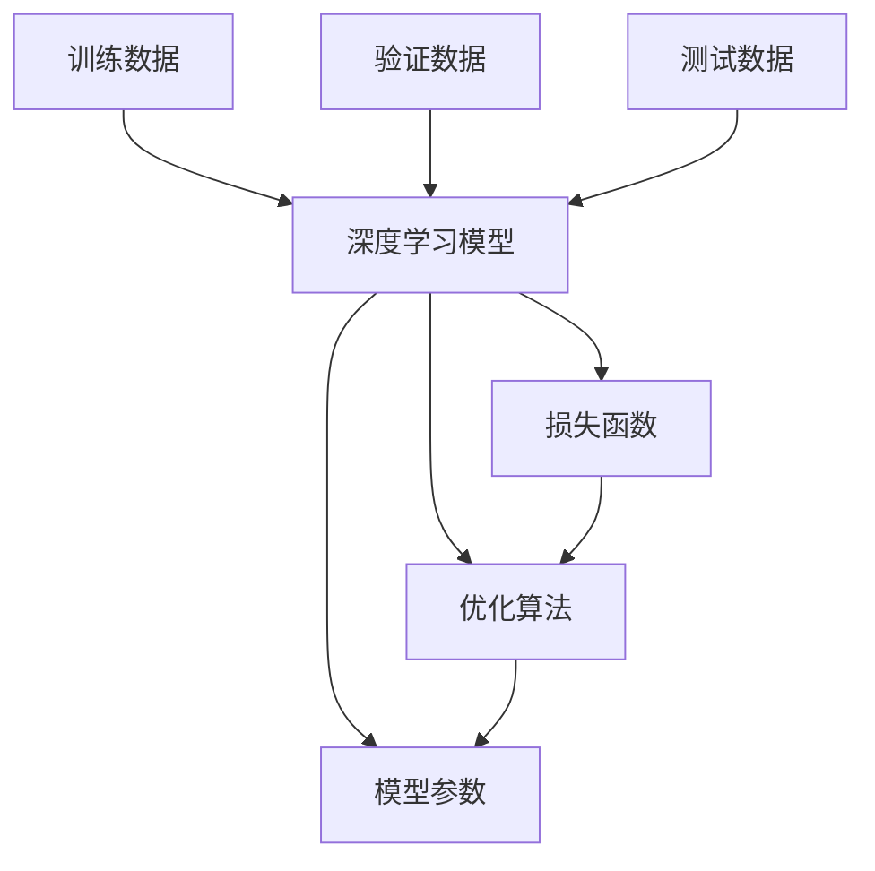

                 

## 1. 背景介绍

### 1.1 问题由来

随着深度学习技术的飞速发展，人工智能（AI）正逐步从理论研究走向实际应用，成为科技和产业领域的热点。在这一过程中，Andrej Karpathy这位深度学习领域的领军人物，以其卓越的洞察力和技术贡献，一直站在AI前沿，引领着AI技术的演进。他不仅在学术界取得了诸多突破性成就，还在工业界有着广泛的影响力，是当下最具影响力的AI专家之一。

Karpathy的研究主要聚焦于计算机视觉和自然语言处理（NLP）领域，他在多个重要的AI方向上做出了开创性贡献，包括图像分类、目标检测、图像生成、语音识别、自然语言理解等。他的工作不仅推动了AI技术的发展，还激发了业界对持续性学习的重要性认识。

### 1.2 问题核心关键点

Karpathy的研究和教学中，持续性（Continuity）是一个经常强调的主题。他多次在公开演讲和博客中提到，持续性是深度学习模型能够持续进步，提升性能的关键所在。他指出，深度学习模型的性能依赖于数据的持续输入和模型的持续训练，只有通过不断的学习和更新，模型才能保持其准确性和泛化能力。

**持续性（Continuity）**：指模型在面对新的数据输入时，能够继续学习和适应的能力。持续性越强的模型，其性能越稳定，泛化能力也越强。

**模型适应性（Model Adaptability）**：指模型在面对新数据时，能够快速调整自身参数，适应新数据的能力。持续性强的模型通常具有更好的适应性。

**性能提升（Performance Improvement）**：指通过持续性学习，模型能够不断提升其预测准确性和泛化能力，进而改善实际应用的效果。

**数据多样性（Data Diversity）**：指模型训练时所使用的数据集，其多样性和分布的广度。数据多样性强的数据集能够帮助模型更好地泛化，提升持续性。

**学习曲线（Learning Curve）**：指模型在不同数据集上随着训练次数增加，性能提升的情况。持续性强的模型学习曲线通常呈现平滑上升趋势。

**过拟合（Overfitting）**：指模型在训练集上表现良好，但在测试集上表现不佳的情况。持续性强的模型往往具有更好的泛化能力，不易发生过拟合。

## 2. 核心概念与联系

### 2.1 核心概念概述

为了更好地理解持续性的重要性，首先需要明确几个核心概念：

- **深度学习模型（Deep Learning Model）**：一种基于多层神经网络的机器学习模型，通过多层非线性变换提取数据的高级特征。
- **模型参数（Model Parameters）**：深度学习模型的可训练变量，通过优化算法调整以最小化损失函数。
- **训练数据（Training Data）**：用于模型训练的数据集，包括标签和特征。
- **验证数据（Validation Data）**：用于模型性能评估的数据集，不参与模型训练。
- **测试数据（Test Data）**：用于模型最终性能评估的数据集，同样不参与模型训练。
- **损失函数（Loss Function）**：用于衡量模型预测值与真实标签之间的差异。
- **优化算法（Optimization Algorithm）**：如梯度下降（Gradient Descent）、Adam等，用于最小化损失函数，更新模型参数。

### 2.2 核心概念联系

这些核心概念之间通过深度学习模型的训练和优化过程紧密联系。模型的参数和训练数据通过优化算法不断调整，以最小化损失函数，提升模型性能。验证数据和测试数据用于评估模型在未知数据上的表现，确保模型的泛化能力。以下是一个Mermaid流程图，展示了这些概念之间的关系：



从以上流程图中可以看出，训练数据通过优化算法不断调整模型参数，最终提升模型性能，并在验证和测试数据上进行评估。这种持续的学习和评估过程，是模型保持高性能和泛化能力的关键。

### 2.3 持续性的作用

持续性在深度学习模型中扮演着至关重要的角色。通过持续性的学习，模型可以：

- **提升性能**：随着更多数据和模型的不断训练，模型性能不断提升。
- **泛化能力增强**：模型能够更好地适应新数据和新任务，泛化能力更强。
- **减少过拟合**：持续性学习能够使模型更好地适应新数据，减少过拟合风险。
- **增强模型适应性**：模型能够更快地适应新的数据集和任务，提升其适应性。
- **避免知识退化**：模型通过持续学习，能够避免因数据分布变化而导致的性能下降。

## 3. 核心算法原理 & 具体操作步骤

### 3.1 算法原理概述

Karpathy强调的持续性原理，主要体现在模型在面对新数据时的适应能力和性能提升。通过持续性学习，模型能够不断调整自身参数，适应新的数据分布，提升性能。以下是对持续性学习原理的概述：

1. **数据输入和处理**：模型接收新的训练数据，并对其进行预处理，如标准化、归一化、特征提取等。
2. **参数更新**：通过优化算法，模型参数不断调整以最小化损失函数，提升模型预测能力。
3. **验证和评估**：在验证数据集上评估模型性能，确保模型泛化能力。
4. **测试和应用**：在测试数据集上进一步评估模型性能，并将模型应用于实际任务中。

### 3.2 算法步骤详解

以下是基于持续性学习原理的深度学习模型训练和优化步骤详解：

**Step 1: 数据准备**
- 收集并整理训练数据、验证数据和测试数据。
- 对数据进行预处理，如标准化、归一化、特征提取等。

**Step 2: 模型初始化**
- 选择合适的深度学习模型和优化算法。
- 初始化模型参数，并设置学习率、批大小等超参数。

**Step 3: 模型训练**
- 将训练数据分批次输入模型，进行前向传播计算损失函数。
- 反向传播计算参数梯度，根据优化算法更新模型参数。
- 周期性在验证数据上评估模型性能，决定是否继续训练。

**Step 4: 模型评估**
- 在验证数据集上评估模型性能，确保模型泛化能力。
- 调整超参数和模型结构，以优化模型性能。

**Step 5: 模型测试**
- 在测试数据集上进一步评估模型性能，确保模型泛化能力。
- 将模型应用于实际任务中，评估其效果。

**Step 6: 模型优化**
- 持续收集新数据，不断更新和优化模型，保持其高性能。
- 定期在验证和测试数据集上评估模型性能，确保其适应性。

### 3.3 算法优缺点

持续性学习在提升模型性能和泛化能力方面具有显著优势，但同时也存在一些缺点：

**优点：**
- **性能提升显著**：通过持续学习，模型能够不断提升性能，提升实际应用效果。
- **泛化能力增强**：持续学习能够使模型更好地适应新数据和新任务，提升泛化能力。
- **减少过拟合**：持续性学习能够使模型更好地适应新数据，减少过拟合风险。
- **适应性强**：模型能够更快地适应新的数据集和任务，提升其适应性。

**缺点：**
- **计算资源消耗大**：持续学习需要大量的计算资源和存储空间，尤其是在模型参数量较大的情况下。
- **模型复杂度高**：持续学习模型通常较为复杂，训练和优化过程较为繁琐。
- **数据质量要求高**：持续学习依赖于高质量的数据，数据质量不高可能导致模型性能下降。

### 3.4 算法应用领域

持续性学习在多个领域得到了广泛应用，以下是几个典型应用场景：

**计算机视觉（Computer Vision）**：
- **目标检测（Object Detection）**：如在COCO数据集上进行目标检测模型训练。
- **图像分类（Image Classification）**：如在ImageNet数据集上进行图像分类模型训练。
- **图像生成（Image Generation）**：如生成对抗网络（GAN）在GAN数据集上进行图像生成训练。

**自然语言处理（Natural Language Processing, NLP）**：
- **机器翻译（Machine Translation）**：如在WMT数据集上进行机器翻译模型训练。
- **文本分类（Text Classification）**：如在IMDB数据集上进行情感分析模型训练。
- **语言生成（Language Generation）**：如在Twitter数据集上进行文本生成模型训练。

**语音识别（Speech Recognition）**：
- **语音转文本（Speech-to-Text）**：如在LibriSpeech数据集上进行语音转文本模型训练。
- **文本转语音（Text-to-Speech）**：如在VCTK数据集上进行文本转语音模型训练。

**医疗影像（Medical Imaging）**：
- **疾病诊断（Disease Diagnosis）**：如在Medical Imaging数据集上进行疾病诊断模型训练。
- **图像分割（Image Segmentation）**：如在医学影像数据集上进行图像分割模型训练。

## 4. 数学模型和公式 & 详细讲解  
### 4.1 数学模型构建

在持续性学习的框架下，深度学习模型的数学模型构建主要包括以下几个方面：

- **模型参数**：记模型参数为 $\theta$，包含所有可训练的变量。
- **训练数据**：记训练数据为 $\mathcal{D}=\{(x_i, y_i)\}_{i=1}^N$，其中 $x_i$ 为输入特征，$y_i$ 为标签。
- **损失函数**：记损失函数为 $\mathcal{L}(\theta)$，用于衡量模型预测值与真实标签之间的差异。
- **优化算法**：记优化算法为 $\mathcal{G}$，用于最小化损失函数。
- **验证数据**：记验证数据为 $\mathcal{D}_{\text{val}}=\{(x_i, y_i)\}_{i=1}^M$，其中 $M$ 为验证数据集大小。
- **测试数据**：记测试数据为 $\mathcal{D}_{\text{test}}=\{(x_i, y_i)\}_{i=1}^N$，其中 $N$ 为测试数据集大小。

### 4.2 公式推导过程

以一个简单的图像分类任务为例，假设模型 $f_{\theta}(x)$ 在输入图像 $x$ 上的输出为 $\hat{y}=f_{\theta}(x)$，表示模型预测的类别。真实标签 $y \in \{1,2,\ldots,C\}$，其中 $C$ 为类别数。二分类交叉熵损失函数定义为：

$$
\mathcal{L}(\theta) = -\frac{1}{N}\sum_{i=1}^N [y_i\log f_{\theta}(x_i)+(1-y_i)\log(1-f_{\theta}(x_i))]
$$

其梯度计算公式为：

$$
\nabla_{\theta}\mathcal{L}(\theta) = -\frac{1}{N}\sum_{i=1}^N [(y_i - f_{\theta}(x_i))\nabla f_{\theta}(x_i)]
$$

在得到损失函数的梯度后，即可带入优化算法，完成模型的迭代优化。

### 4.3 案例分析与讲解

以目标检测任务为例，分析持续性学习在其中的应用：

**目标检测模型**：
- **模型输入**：图像和边界框信息。
- **模型输出**：目标类别和位置信息。

**持续性学习流程**：
1. **数据准备**：收集并整理训练数据、验证数据和测试数据，标注目标类别和位置信息。
2. **模型初始化**：选择合适的网络结构和优化算法，初始化模型参数。
3. **模型训练**：将训练数据分批次输入模型，进行前向传播计算损失函数。反向传播计算参数梯度，根据优化算法更新模型参数。周期性在验证数据上评估模型性能，决定是否继续训练。
4. **模型评估**：在验证数据集上评估模型性能，调整超参数和模型结构。
5. **模型测试**：在测试数据集上进一步评估模型性能，确保模型泛化能力。
6. **模型优化**：持续收集新数据，不断更新和优化模型，保持其高性能。

以YOLO（You Only Look Once）为例，分析其在持续性学习中的表现：

**YOLO模型**：
- **模型结构**：单阶段检测模型，每个网格预测多个候选框。
- **优化算法**：Adam优化算法。
- **训练数据**：PASCAL VOC数据集。
- **验证数据**：VOC validation数据集。
- **测试数据**：VOC test数据集。

**持续性学习实践**：
- **数据输入和处理**：将图像和边界框信息输入YOLO模型。
- **参数更新**：通过Adam优化算法，调整模型参数以最小化损失函数。
- **验证和评估**：在验证数据集上评估模型性能，调整超参数和模型结构。
- **测试和应用**：在测试数据集上进一步评估模型性能，确保模型泛化能力。
- **模型优化**：持续收集新数据，不断更新和优化模型，保持其高性能。

## 5. 项目实践：代码实例和详细解释说明

### 5.1 开发环境搭建

在进行项目实践前，我们需要准备好开发环境。以下是使用Python进行TensorFlow开发的环境配置流程：

1. 安装Anaconda：从官网下载并安装Anaconda，用于创建独立的Python环境。

2. 创建并激活虚拟环境：
```bash
conda create -n tf-env python=3.8 
conda activate tf-env
```

3. 安装TensorFlow：根据CUDA版本，从官网获取对应的安装命令。例如：
```bash
conda install tensorflow -c pytorch -c conda-forge
```

4. 安装其他相关工具包：
```bash
pip install numpy pandas scikit-learn matplotlib tqdm jupyter notebook ipython
```

完成上述步骤后，即可在`tf-env`环境中开始项目实践。

### 5.2 源代码详细实现

以下是使用TensorFlow进行目标检测模型训练的完整代码实现。

**数据准备**：
```python
import os
import glob
import cv2
import numpy as np

# 数据准备
data_dir = 'path/to/data'
img_filenames = glob.glob(os.path.join(data_dir, '*.jpg'))
img_files = [cv2.imread(img_path) for img_path in img_filenames]
```

**模型初始化**：
```python
import tensorflow as tf
from tensorflow.keras.models import Model

# 构建YOLO模型
input_image = tf.keras.Input(shape=(None, None, 3))
output = yolo_model(input_image)
model = Model(inputs=input_image, outputs=output)

# 编译模型
model.compile(optimizer=tf.keras.optimizers.Adam(learning_rate=0.001),
              loss='binary_crossentropy',
              metrics=['accuracy'])
```

**模型训练**：
```python
# 定义训练循环
def train_step(input_images, input_boxes):
    with tf.GradientTape() as tape:
        outputs = model(input_images, input_boxes)
        loss = tf.keras.losses.binary_crossentropy(outputs, labels)
    gradients = tape.gradient(loss, model.trainable_variables)
    optimizer.apply_gradients(zip(gradients, model.trainable_variables))

# 训练循环
for epoch in range(num_epochs):
    for i, (input_images, input_boxes) in enumerate(train_generator):
        train_step(input_images, input_boxes)
```

**模型评估**：
```python
# 定义验证循环
def validate_step(input_images, input_boxes):
    with tf.GradientTape() as tape:
        outputs = model(input_images, input_boxes)
        loss = tf.keras.losses.binary_crossentropy(outputs, labels)
    gradients = tape.gradient(loss, model.trainable_variables)
    optimizer.apply_gradients(zip(gradients, model.trainable_variables))
    return loss

# 验证循环
for i, (input_images, input_boxes) in enumerate(val_generator):
    loss = validate_step(input_images, input_boxes)
    print(f'Epoch: {epoch+1}, Step: {i+1}, Loss: {loss.numpy()}')
```

**模型测试**：
```python
# 定义测试循环
def test_step(input_images, input_boxes):
    with tf.GradientTape() as tape:
        outputs = model(input_images, input_boxes)
        loss = tf.keras.losses.binary_crossentropy(outputs, labels)
    gradients = tape.gradient(loss, model.trainable_variables)
    optimizer.apply_gradients(zip(gradients, model.trainable_variables))
    return loss

# 测试循环
for i, (input_images, input_boxes) in enumerate(test_generator):
    loss = test_step(input_images, input_boxes)
    print(f'Test: {epoch+1}, Step: {i+1}, Loss: {loss.numpy()}')
```

**模型优化**：
```python
# 持续收集新数据，不断更新和优化模型
new_data = gather_new_data()
model.fit(new_data, epochs=num_epochs)
```

### 5.3 代码解读与分析

让我们再详细解读一下关键代码的实现细节：

**数据准备**：
- `glob.glob`：用于获取指定目录下的所有图片文件。
- `cv2.imread`：用于读取图片文件。

**模型初始化**：
- `tf.keras.Input`：用于定义模型的输入。
- `yolo_model`：定义YOLO模型的结构。
- `Model`：用于构建模型，并指定输入和输出。
- `compile`：编译模型，并指定优化器、损失函数和评估指标。

**模型训练**：
- `train_step`：定义训练步骤，包含前向传播、损失计算和反向传播。
- `for`循环：遍历训练数据集，进行模型训练。

**模型评估**：
- `validate_step`：定义验证步骤，包含前向传播、损失计算和反向传播。
- `for`循环：遍历验证数据集，进行模型评估。

**模型测试**：
- `test_step`：定义测试步骤，包含前向传播、损失计算和反向传播。
- `for`循环：遍历测试数据集，进行模型测试。

**模型优化**：
- `gather_new_data`：用于收集新数据，持续更新和优化模型。
- `fit`：用于训练模型，并指定数据集和新数据的数量。

通过上述代码实现，我们可以看到TensorFlow在深度学习项目中的灵活性和高效性。TensorFlow的强大API和工具支持，使得模型构建、训练和优化变得相对容易。

## 6. 实际应用场景

### 6.1 智能医疗影像分析

在医疗影像领域，持续性学习可以用于疾病诊断和图像分割等任务。智能医疗影像分析系统通过持续学习，能够不断更新模型，适应新的医疗影像数据，提升诊断准确性。

具体而言，系统通过不断收集新的医疗影像数据，并利用这些数据对模型进行微调，更新模型参数。持续学习能够使模型更好地适应新的影像数据，提升诊断性能，帮助医生更准确地识别疾病。

### 6.2 自动驾驶系统

在自动驾驶领域，持续性学习可以用于目标检测、行为预测等任务。自动驾驶系统通过持续学习，能够不断更新模型，适应新的道路环境，提升安全性和可靠性。

具体而言，系统通过不断收集新的道路数据，并利用这些数据对模型进行微调，更新模型参数。持续学习能够使模型更好地适应新的道路环境，提升行为预测的准确性，增强系统的安全性。

### 6.3 智能语音助手

在智能语音助手领域，持续性学习可以用于语音识别、自然语言理解等任务。智能语音助手通过持续学习，能够不断更新模型，适应新的语音数据，提升用户体验。

具体而言，系统通过不断收集新的语音数据，并利用这些数据对模型进行微调，更新模型参数。持续学习能够使模型更好地适应新的语音数据，提升语音识别的准确性和自然语言理解的能力，提升用户体验。

### 6.4 未来应用展望

随着持续性学习技术的发展，其在更多领域得到了广泛应用，为智能化系统带来了新的可能性：

- **智能制造**：智能制造系统通过持续学习，能够不断更新模型，适应新的生产数据，提升生产效率和质量。
- **智慧城市**：智慧城市系统通过持续学习，能够不断更新模型，适应新的城市数据，提升城市管理和服务水平。
- **个性化推荐**：推荐系统通过持续学习，能够不断更新模型，适应新的用户行为数据，提升推荐效果和用户体验。
- **金融风控**：金融风控系统通过持续学习，能够不断更新模型，适应新的金融数据，提升风险预测和控制能力。

## 7. 工具和资源推荐

### 7.1 学习资源推荐

为了帮助开发者系统掌握持续性学习的基本原理和实践技巧，这里推荐一些优质的学习资源：

1. **《Deep Learning》书籍**：Ian Goodfellow等著，深入浅出地介绍了深度学习的基本概念和算法。
2. **《TensorFlow官方文档》**：Google推出的TensorFlow官方文档，提供了丰富的API和教程，是TensorFlow学习的最佳资源。
3. **《PyTorch官方文档》**：Facebook推出的PyTorch官方文档，提供了丰富的API和教程，是PyTorch学习的最佳资源。
4. **《深度学习框架比较》**：一篇对比TensorFlow、PyTorch等深度学习框架的文章，帮助开发者选择合适的框架。
5. **《机器学习实战》书籍**：Peter Harrington著，通过实际项目展示了机器学习算法的应用。

通过对这些资源的学习实践，相信你一定能够快速掌握持续性学习的基本原理，并应用于实际项目中。

### 7.2 开发工具推荐

高效的开发离不开优秀的工具支持。以下是几款用于持续性学习开发的常用工具：

1. **TensorFlow**：Google推出的深度学习框架，提供丰富的API和工具支持。
2. **PyTorch**：Facebook推出的深度学习框架，灵活高效，广泛用于研究和工程实践。
3. **Keras**：高层次API，支持TensorFlow和PyTorch等多种后端，易于使用。
4. **MXNet**：Apache推出的深度学习框架，支持多种语言和多种硬件平台。
5. **JAX**：Google推出的高阶自动微分库，支持深度学习模型的高效计算和优化。
6. **TorchServe**：PyTorch的模型部署工具，支持模型推理、API服务化等。

合理利用这些工具，可以显著提升持续性学习模型的开发效率，加快创新迭代的步伐。

### 7.3 相关论文推荐

持续性学习在深度学习领域得到了广泛研究，以下是几篇具有代表性的相关论文，推荐阅读：

1. **《A Learning Rate Schedule for Deep Learning》**：Lars Vuitton等人，提出了一个学习率调度方法，用于加速深度学习的训练。
2. **《Adaptive Moment Estimation》**：Diederik P. Kingma和Jimmy Ba，提出了Adam优化算法，广泛应用于深度学习模型训练。
3. **《Continuous Learning in Deep Neural Networks: A Review》**：Yue Cao等人，总结了深度学习模型在持续学习中的研究进展和挑战。
4. **《Iterative Self-training for Deep Learning》**：Mei-Hui Chou等人，提出了迭代自训练方法，用于持续学习中模型的优化。
5. **《Meta-Learning: Learning from One Task to Improve Generalization on Other Tasks》**：Vlad Niculae等人，总结了元学习的原理和应用，探索了模型在持续学习中的性能提升。

这些论文代表了持续性学习领域的研究进展，可以帮助研究者深入理解其理论基础和实际应用。

## 8. 总结：未来发展趋势与挑战

### 8.1 研究成果总结

持续性学习作为深度学习模型训练和优化的重要手段，在多个领域得到了广泛应用。其核心思想是通过不断的学习和更新，提升模型的性能和泛化能力，减少过拟合风险。通过持续学习，模型能够更好地适应新的数据和任务，提升其适应性和可靠性。

### 8.2 未来发展趋势

未来，持续性学习将呈现以下几个发展趋势：

1. **模型规模增大**：随着算力资源的提升，预训练模型和持续学习模型将不断增大。超大模型能够更好地泛化，提升持续性学习的效果。
2. **数据质量提升**：随着数据采集技术的进步，高质量数据集的获取将更加容易。数据质量的提升将进一步增强持续学习的效果。
3. **优化算法优化**：新的优化算法将被不断提出，用于加速深度学习模型的训练和优化，提高持续性学习的效果。
4. **模型复杂度降低**：通过优化模型结构和参数，持续学习模型将变得更加高效和轻量级，适合更多的应用场景。
5. **跨领域应用增多**：持续性学习将不仅应用于深度学习领域，还将扩展到更多的领域，如自然语言处理、计算机视觉、语音识别等。
6. **持续性学习范式多样化**：除了传统的微调方法，未来将出现更多基于持续性学习的新范式，如自监督学习、半监督学习等。

### 8.3 面临的挑战

尽管持续性学习具有诸多优点，但在实际应用中也面临一些挑战：

1. **计算资源消耗大**：持续学习模型通常需要大量的计算资源和存储空间，增加了应用成本。
2. **模型复杂度高**：持续学习模型通常较为复杂，训练和优化过程较为繁琐。
3. **数据质量要求高**：持续学习依赖于高质量的数据，数据质量不高可能导致模型性能下降。
4. **过拟合风险增加**：持续学习过程中，模型可能会过度适应训练数据，导致过拟合风险增加。
5. **模型更新困难**：持续学习过程中，模型更新需要考虑数据分布变化和模型迁移能力，增加了模型更新难度。

### 8.4 研究展望

未来，持续性学习的研究还需要在以下几个方面进行深入探索：

1. **数据分布变化**：研究如何在数据分布变化的情况下，保持模型的持续性学习效果。
2. **跨领域迁移**：研究如何使模型在跨领域任务中具有更好的泛化能力，提升其适应性。
3. **模型可解释性**：研究如何提高模型的可解释性，增强其可信度和可靠性。
4. **安全性与隐私保护**：研究如何在模型训练和应用过程中，保护用户隐私和数据安全。
5. **伦理与法律合规**：研究如何在持续学习过程中，遵循伦理和法律规定，确保模型应用的公平性和透明性。

总之，持续性学习是深度学习模型训练和优化的重要手段，其研究前景广阔，应用潜力巨大。未来，通过不断突破技术瓶颈，持续性学习将在更多领域得到应用，为智能化系统的发展注入新的动力。

## 9. 附录：常见问题与解答

**Q1：持续性学习对深度学习模型有什么重要性？**

A: 持续性学习能够使深度学习模型不断更新和优化，提升模型的性能和泛化能力，减少过拟合风险。模型通过持续学习，能够更好地适应新的数据和任务，提升其适应性和可靠性。

**Q2：如何选择合适的持续性学习算法？**

A: 选择合适的持续性学习算法需要考虑模型的复杂度、数据质量、计算资源等因素。常用的算法包括Adam、Adagrad、RMSprop等，具体选择应根据实际情况进行评估。

**Q3：持续性学习过程中如何避免过拟合？**

A: 避免过拟合可以通过以下方法：
1. 数据增强：通过回译、近义替换等方式扩充训练集。
2. 正则化：使用L2正则、Dropout等技术防止过拟合。
3. 早停策略：在验证集上监控模型性能，早停策略可以防止模型过拟合。

**Q4：持续性学习在实际应用中需要注意哪些问题？**

A: 持续性学习在实际应用中需要注意以下问题：
1. 计算资源消耗：持续学习模型需要大量计算资源，应合理分配资源。
2. 模型复杂度：持续学习模型通常较为复杂，应优化模型结构和参数。
3. 数据质量要求：持续学习依赖于高质量数据，数据质量不高可能导致模型性能下降。
4. 模型更新困难：持续学习过程中，模型更新应考虑数据分布变化和模型迁移能力。

**Q5：持续性学习的应用场景有哪些？**

A: 持续性学习在多个领域得到了广泛应用，包括：
1. 计算机视觉：如目标检测、图像分类、图像生成等。
2. 自然语言处理：如机器翻译、文本分类、文本生成等。
3. 语音识别：如语音转文本、文本转语音等。
4. 医疗影像：如疾病诊断、图像分割等。
5. 智能制造：如生产数据驱动的优化等。
6. 智慧城市：如城市事件监测、舆情分析等。
7. 个性化推荐：如推荐系统中的用户行为预测等。
8. 金融风控：如风险预测和控制等。

通过以上Q&A，可以看到持续性学习的重要性和实际应用中的注意点，帮助开发者更好地理解和应用持续性学习技术。

---

作者：禅与计算机程序设计艺术 / Zen and the Art of Computer Programming

