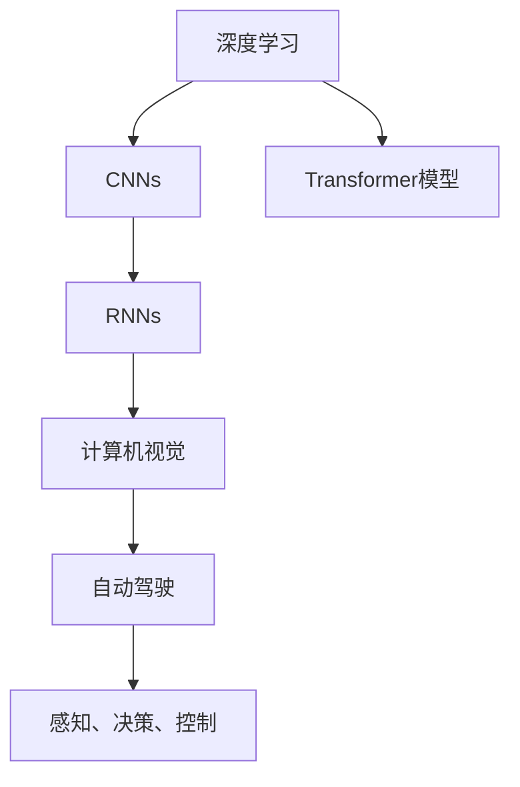

                 

# Andrej Karpathy：见证“小雪球”的发展过程

> 关键词：小雪球，Andrej Karpathy，深度学习，计算机视觉，自动驾驶，AI创新

## 1. 背景介绍

### 1.1 问题由来
随着深度学习技术的快速发展，尤其是卷积神经网络(CNN)的广泛应用，计算机视觉领域取得了显著的突破。在这一过程中，一位名为Andrej Karpathy的计算机科学家，以其独特的视角和贡献，见证并推动了深度学习技术从萌芽到成熟的变革。

Andrej Karpathy，博士毕业于斯坦福大学，现就职于特斯拉，担任自动驾驶项目高级研究科学家。他在计算机视觉、深度学习、自动驾驶等多个领域均有卓越表现，尤其是在CNN和RNN等深度学习模型的研究和应用方面，他的工作为现代计算机视觉技术的发展奠定了坚实的基础。

本文将从Andrej Karpathy的研究历程入手，探讨他是如何见证并推动深度学习技术，特别是计算机视觉领域的发展，以及他对未来AI技术发展的预测和思考。

### 1.2 问题核心关键点
Andrej Karpathy的研究涉及深度学习、计算机视觉、自动驾驶等多个领域，但始终聚焦于通过算法和模型来解决实际问题。以下是几个核心关键点：

1. **深度学习技术的发展与应用**：从最初的CNN、RNN到最新的Transformer模型，Karpathy见证了深度学习技术的迭代和进化。
2. **计算机视觉任务的解决**：在图像分类、目标检测、语义分割等计算机视觉核心任务上，Karpathy提出了一系列创新方法。
3. **自动驾驶技术的突破**：作为特斯拉自动驾驶团队的关键成员，Karpathy在自动驾驶感知、决策和控制等多个环节上都有深入研究。
4. **AI技术的未来展望**：Karpathy对未来AI技术的发展趋势有独到见解，强调算法与实际应用的紧密结合。

通过这些关键点，我们可以更全面地了解Andrej Karpathy的研究贡献及其对深度学习领域的影响。

## 2. 核心概念与联系

### 2.1 核心概念概述

Andrej Karpathy的研究工作跨越多个领域，但其核心概念可以归纳为以下几个方面：

- **深度学习(Deep Learning)**：一种基于多层神经网络的机器学习技术，能够自动学习输入数据的高级表示。
- **卷积神经网络(Convolutional Neural Networks, CNNs)**：一种专门用于处理图像和视频数据的深度学习模型，通过卷积操作捕捉局部特征。
- **循环神经网络(Recurrent Neural Networks, RNNs)**：一种能够处理序列数据的深度学习模型，适用于时间序列数据和自然语言处理。
- **Transformer模型**：一种基于自注意力机制的深度学习模型，能够高效处理长序列数据，广泛应用于NLP任务。
- **自动驾驶(Autonomous Driving)**：结合计算机视觉、深度学习、控制理论等技术，实现车辆自主导航和决策。

这些核心概念之间的逻辑关系可以通过以下Mermaid流程图来展示：



这个流程图展示了大语言模型的工作原理和优化方向：

1. 深度学习是基础，包括CNNs和RNNs等传统深度学习模型。
2. Transformer模型继承并发展了深度学习的优点，成为处理序列数据的新选择。
3. 计算机视觉任务需要图像处理和语义理解，因此CNNs和Transformer模型都有重要应用。
4. 自动驾驶结合了计算机视觉、深度学习、控制理论等技术，实现了车辆自主导航和决策。

## 3. 核心算法原理 & 具体操作步骤
### 3.1 算法原理概述

Andrej Karpathy的研究主要集中在深度学习，尤其是计算机视觉领域。以下将详细介绍他的核心算法原理。

### 3.2 算法步骤详解

Andrej Karpathy的研究工作涉及多个算法，以下是其中几个典型的算法步骤：

**Step 1: 数据预处理和增强**
- 数据预处理：收集、清洗、标注数据，使其适合深度学习模型训练。
- 数据增强：通过旋转、缩放、翻转等方式，增加训练集的多样性，提升模型泛化能力。

**Step 2: 模型选择和设计**
- 选择适当的深度学习模型，如CNNs、RNNs、Transformer等。
- 设计网络结构，添加卷积层、池化层、全连接层等组件。

**Step 3: 模型训练**
- 使用随机梯度下降等优化算法，训练模型参数。
- 使用交叉验证等技术，防止模型过拟合。

**Step 4: 模型评估和调优**
- 在验证集上评估模型性能，调整超参数。
- 使用正则化技术，如L2正则、Dropout等，提升模型泛化能力。

**Step 5: 模型部署和应用**
- 将模型部署到实际应用场景，如自动驾驶、图像分类等。
- 实时采集数据，不断优化模型性能。

### 3.3 算法优缺点

Andrej Karpathy的研究方法具有以下优点：
1. **数据驱动**：强调数据的重要性，通过数据增强、交叉验证等技术提升模型性能。
2. **算法创新**：不断提出新的算法和模型，如GAN、Transformer等，推动深度学习技术的发展。
3. **跨领域应用**：将深度学习技术应用于计算机视觉、自动驾驶等多个领域，实现技术创新和应用突破。
4. **高效迭代**：通过快速迭代和优化，不断提升模型性能，缩短研发周期。

同时，这些方法也存在一些局限性：
1. **数据依赖**：依赖高质量、大规模的数据集，数据获取成本高。
2. **模型复杂度**：深度学习模型通常结构复杂，训练和优化难度大。
3. **可解释性不足**：深度学习模型往往是"黑盒"系统，难以解释内部决策过程。
4. **资源消耗大**：大规模深度学习模型对计算资源和存储要求高。

尽管如此，Andrej Karpathy的研究工作依然为深度学习技术的发展提供了宝贵的经验和方向。

### 3.4 算法应用领域

Andrej Karpathy的研究工作在多个领域均有应用，以下列举几个主要领域：

1. **计算机视觉**：图像分类、目标检测、语义分割等任务，通过卷积神经网络等模型，实现了高效、准确的图像处理。
2. **自然语言处理**：Transformer模型在机器翻译、文本生成、语音识别等任务上的应用，推动了NLP技术的突破。
3. **自动驾驶**：结合计算机视觉、深度学习、控制理论等技术，实现了车辆自主导航和决策。
4. **游戏AI**：通过深度强化学习等技术，开发了先进的智能游戏AI，提升了游戏体验。
5. **医疗影像分析**：利用深度学习技术，对医疗影像进行自动分析和诊断，提高了医疗效率和准确性。

## 4. 数学模型和公式 & 详细讲解 & 举例说明

### 4.1 数学模型构建

Andrej Karpathy的研究工作涉及多个数学模型，以下将以计算机视觉领域的图像分类任务为例，介绍其数学模型构建。

### 4.2 公式推导过程

假设输入为一张NxN的图像I，输出为C个类别的概率分布P。则可以使用卷积神经网络(CNN)模型进行处理，其数学模型如下：

$$
P = \frac{\exp(A \cdot F(I))}{\sum_{i=1}^{C}\exp(A \cdot F(I))}
$$

其中，A为模型参数，F为卷积层、池化层等操作，表示对图像进行特征提取和降维。

### 4.3 案例分析与讲解

以Karpathy在论文《Deep Residual Learning for Image Recognition》中提出的ResNet为例，进行详细讲解。

ResNet通过引入残差连接，解决了深度网络退化问题。其核心思想是，通过添加跨层连接，使得网络能够更轻松地训练深层模型。假设一个包含N层的残差网络，其输出为：

$$
H^{N} = F^{N}(I) + \sum_{i=1}^{N} H^{i-1} \oplus H^{i}
$$

其中，$H^i$表示第i层的输出，$\oplus$表示跨层连接操作。

在实际应用中，ResNet模型通过不断增加层数，提升了模型的深度和泛化能力，取得了显著的图像分类性能。

## 5. 项目实践：代码实例和详细解释说明

### 5.1 开发环境搭建

在进行深度学习项目开发前，需要先准备好开发环境。以下是Python环境下使用TensorFlow进行深度学习开发的环境配置流程：

1. 安装Anaconda：从官网下载并安装Anaconda，用于创建独立的Python环境。

2. 创建并激活虚拟环境：
```bash
conda create -n tf-env python=3.8 
conda activate tf-env
```

3. 安装TensorFlow：根据CUDA版本，从官网获取对应的安装命令。例如：
```bash
conda install tensorflow -c tf
```

4. 安装TensorBoard：TensorFlow配套的可视化工具，用于实时监测模型训练状态，提供丰富的图表呈现方式，是调试模型的得力助手。

5. 安装Keras：TensorFlow的高级API，方便快速开发和调试深度学习模型。

完成上述步骤后，即可在`tf-env`环境中开始深度学习项目的开发。

### 5.2 源代码详细实现

以下给出使用TensorFlow实现图像分类任务的代码示例：

```python
import tensorflow as tf
from tensorflow.keras import layers, models

# 定义模型
model = models.Sequential()
model.add(layers.Conv2D(32, (3, 3), activation='relu', input_shape=(N, N, 3)))
model.add(layers.MaxPooling2D((2, 2)))
model.add(layers.Conv2D(64, (3, 3), activation='relu'))
model.add(layers.MaxPooling2D((2, 2)))
model.add(layers.Conv2D(128, (3, 3), activation='relu'))
model.add(layers.MaxPooling2D((2, 2)))
model.add(layers.Flatten())
model.add(layers.Dense(128, activation='relu'))
model.add(layers.Dense(C, activation='softmax'))

# 编译模型
model.compile(optimizer='adam', loss='sparse_categorical_crossentropy', metrics=['accuracy'])

# 训练模型
model.fit(train_images, train_labels, epochs=10, validation_data=(val_images, val_labels))

# 评估模型
test_loss, test_acc = model.evaluate(test_images, test_labels)
print('Test accuracy:', test_acc)
```

以上是使用TensorFlow实现图像分类任务的完整代码实现。可以看到，TensorFlow的高级API使得深度学习模型的构建和训练变得简洁高效。

### 5.3 代码解读与分析

让我们再详细解读一下关键代码的实现细节：

**Sequential模型**：
- `Sequential`是TensorFlow的模型容器，用于构建线性堆叠的神经网络模型。

**卷积层和池化层**：
- `Conv2D`层用于添加卷积操作，提取图像的局部特征。
- `MaxPooling2D`层用于对特征图进行下采样，减少参数量。

**全连接层**：
- `Flatten`层用于将特征图展平，连接至全连接层。
- `Dense`层用于进行分类，输出预测概率分布。

**损失函数和评估指标**：
- `sparse_categorical_crossentropy`损失函数用于多分类任务。
- `accuracy`评估指标用于计算模型准确率。

**模型训练和评估**：
- `fit`方法用于模型训练，指定训练集、验证集、迭代轮数等参数。
- `evaluate`方法用于模型评估，返回测试集上的损失和准确率。

可以看到，TensorFlow的高级API使得深度学习模型的构建和训练变得简洁高效。开发者可以将更多精力放在数据处理、模型改进等高层逻辑上，而不必过多关注底层的实现细节。

当然，工业级的系统实现还需考虑更多因素，如模型的保存和部署、超参数的自动搜索、更灵活的任务适配层等。但核心的深度学习模型构建和训练基本与此类似。

## 6. 实际应用场景

### 6.1 智能游戏AI

Andrej Karpathy在游戏AI领域也有重要贡献。他领导的团队开发了先进的智能游戏AI，通过深度强化学习等技术，提升了游戏体验。

例如，在《星际争霸II》和《星际争霸III》等游戏中，通过使用深度强化学习算法，训练AI能够在复杂的地图和敌人策略下进行有效决策，显著提升了游戏智能化水平。这些游戏AI的应用，展示了深度学习技术在游戏领域的广泛前景。

### 6.2 医疗影像分析

医疗影像分析是Andrej Karpathy研究的重要方向之一。通过深度学习技术，可以有效提取和分析医疗影像中的特征，辅助医生进行疾病诊断。

例如，在癌症检测任务中，使用卷积神经网络提取影像中的病变区域，结合语义分割技术，实现对肿瘤的精确分割和分类。在心脏病诊断任务中，通过分析心电图等影像数据，实时监测心脏状态，预测潜在风险。

### 6.3 自动驾驶

Andrej Karpathy作为特斯拉自动驾驶团队的关键成员，在自动驾驶感知、决策和控制等多个环节上都有深入研究。

在自动驾驶感知任务中，使用卷积神经网络对传感器数据进行处理，提取道路、车辆、行人等关键信息。在自动驾驶决策任务中，结合深度学习模型和决策树等算法，实现对交通环境的智能分析和预测。在自动驾驶控制任务中，使用深度强化学习算法，优化车辆控制策略，提升行驶安全性和舒适性。

### 6.4 未来应用展望

展望未来，Andrej Karpathy的研究工作将继续引领深度学习技术的发展，带来更多创新应用。

在智慧城市领域，通过深度学习技术，实现对交通、环境、安全等多个方面的智能化管理。在智慧医疗领域，通过医疗影像分析和预测模型，提升医疗服务的智能化水平。在自动驾驶领域，通过感知、决策和控制技术，实现车辆的自主导航和决策，推动无人驾驶技术的发展。

此外，在教育、金融、娱乐等多个领域，深度学习技术也具有广泛应用前景，将带来更多的技术创新和业务突破。

## 7. 工具和资源推荐

### 7.1 学习资源推荐

为了帮助开发者系统掌握深度学习技术，以下是一些优质的学习资源：

1. **《Deep Learning Specialization》**：由Andrew Ng主持的Coursera课程，涵盖深度学习的基础理论和实践应用，适合入门学习。

2. **《Hands-On Machine Learning with Scikit-Learn, Keras, and TensorFlow》**：本书介绍了使用Scikit-Learn、Keras和TensorFlow等库进行深度学习开发的实践技巧。

3. **《Deep Learning》书籍**：Ian Goodfellow、Yoshua Bengio和Aaron Courville合著的经典深度学习教材，全面介绍深度学习的基本概念和最新进展。

4. **《Python Deep Learning》书籍**：Francois Chollet的TensorFlow实践指南，详细讲解TensorFlow的API和最佳实践。

5. **《计算机视觉:算法与应用》书籍**：Richard Szeliski的计算机视觉教材，涵盖了计算机视觉基础和前沿研究。

通过这些资源的学习实践，相信你一定能够系统掌握深度学习技术的精髓，并用于解决实际的NLP问题。

### 7.2 开发工具推荐

以下是几款用于深度学习开发和部署的常用工具：

1. **TensorFlow**：由Google主导开发的开源深度学习框架，生产部署方便，适合大规模工程应用。

2. **Keras**：TensorFlow的高级API，提供简单易用的模型构建和训练接口，适合快速开发和调试。

3. **PyTorch**：Facebook开发的深度学习框架，支持动态计算图，灵活高效，适合研究和原型开发。

4. **TensorBoard**：TensorFlow配套的可视化工具，实时监测模型训练状态，提供丰富的图表呈现方式。

5. **Jupyter Notebook**：支持Python代码和图形化展示的开发环境，适合数据处理、模型训练和可视化。

6. **GitHub**：代码托管和协作平台，方便代码共享和团队协作，支持版本控制和项目管理。

合理利用这些工具，可以显著提升深度学习开发和部署的效率，加快创新迭代的步伐。

### 7.3 相关论文推荐

Andrej Karpathy的研究工作涉及深度学习、计算机视觉等多个领域，以下是几篇奠基性的相关论文：

1. **《ImageNet Classification with Deep Convolutional Neural Networks》**：AlexNet论文，标志着深度卷积神经网络的诞生。

2. **《Very Deep Convolutional Networks for Large-Scale Image Recognition》**：VGGNet论文，提出更深层次的卷积神经网络，提升了图像分类性能。

3. **《Deep Residual Learning for Image Recognition》**：ResNet论文，通过残差连接解决了深度网络退化问题。

4. **《Faster R-CNN: Towards Real-Time Object Detection with Region Proposal Networks》**：Faster R-CNN论文，提出区域提议网络，提升了目标检测速度和准确率。

5. **《Attention Is All You Need》**：Transformer论文，提出自注意力机制，推动了NLP领域的预训练模型发展。

这些论文代表了大深度学习领域的发展脉络，展示了Andrej Karpathy对深度学习技术的深入研究和创新贡献。

## 8. 总结：未来发展趋势与挑战

### 8.1 总结

本文从Andrej Karpathy的研究历程入手，探讨了他在深度学习、计算机视觉、自动驾驶等多个领域的贡献。通过对其核心算法原理、具体操作步骤、应用领域等方面的详细讲解，展示了深度学习技术的发展脉络和未来趋势。

通过本文的系统梳理，可以看到，Andrej Karpathy的研究工作为深度学习技术的发展提供了宝贵的经验和方向，推动了计算机视觉、自动驾驶等领域的技术进步。未来，深度学习技术将在更广阔的领域得到应用，为人类认知智能的进化带来深远影响。

### 8.2 未来发展趋势

展望未来，深度学习技术将继续在多个领域得到应用，为人类认知智能的进化带来深远影响。以下是几个主要发展趋势：

1. **模型规模持续增大**：随着算力成本的下降和数据规模的扩张，深度学习模型的参数量还将持续增长。超大批次的训练和推理也可能遇到显存不足的问题，如何高效优化计算资源，仍是未来的重要研究方向。

2. **算法创新不断涌现**：深度学习算法将继续迭代更新，如Transformer、ResNet等经典模型，以及GAN、强化学习等新兴技术，将推动深度学习技术的进一步发展。

3. **跨领域应用更加广泛**：深度学习技术在计算机视觉、自然语言处理、自动驾驶等多个领域的应用将更加深入，带来更多的技术创新和业务突破。

4. **伦理和安全问题亟需关注**：深度学习模型往往具有较高的决策风险，如何在保证算法效果的同时，确保模型输出符合伦理和法律要求，成为未来的重要研究方向。

5. **算法可解释性有待提升**：深度学习模型通常被视为"黑盒"系统，难以解释内部决策过程。如何赋予模型更强的可解释性，提升用户信任和接受度，将是未来的重要研究方向。

### 8.3 面临的挑战

尽管深度学习技术已经取得了显著进展，但在迈向更加智能化、普适化应用的过程中，仍面临诸多挑战：

1. **数据依赖**：深度学习模型需要大量高质量标注数据，数据获取成本高，标注质量难以保证。如何有效利用大规模非结构化数据，减少对标注数据的依赖，将是未来的重要研究方向。

2. **计算资源消耗大**：大规模深度学习模型对计算资源和存储要求高，如何优化模型结构，提高计算效率，仍是未来的重要研究方向。

3. **模型鲁棒性不足**：深度学习模型面对域外数据时，泛化性能往往大打折扣。如何提高模型的鲁棒性，避免灾难性遗忘，还需要更多理论和实践的积累。

4. **模型可解释性不足**：深度学习模型通常被视为"黑盒"系统，难以解释内部决策过程。如何赋予模型更强的可解释性，提升用户信任和接受度，将是未来的重要研究方向。

5. **安全性问题**：深度学习模型往往具有较高的决策风险，如何确保模型输出符合伦理和法律要求，避免恶意用途，将是未来的重要研究方向。

### 8.4 研究展望

面对深度学习技术面临的挑战，未来的研究需要在以下几个方面寻求新的突破：

1. **探索无监督和半监督学习**：摆脱对大规模标注数据的依赖，利用自监督学习、主动学习等无监督和半监督范式，最大限度利用非结构化数据，实现更加灵活高效的模型训练。

2. **开发参数高效和计算高效的算法**：开发更加参数高效的算法，如Transformer、ResNet等，在固定大部分预训练参数的同时，只更新极少量的任务相关参数。同时优化计算图，减少前向传播和反向传播的资源消耗，实现更加轻量级、实时性的部署。

3. **融合因果分析和博弈论工具**：将因果分析方法引入深度学习模型，识别出模型决策的关键特征，增强输出解释的因果性和逻辑性。借助博弈论工具刻画人机交互过程，主动探索并规避模型的脆弱点，提高系统稳定性。

4. **纳入伦理道德约束**：在模型训练目标中引入伦理导向的评估指标，过滤和惩罚有偏见、有害的输出倾向。加强人工干预和审核，建立模型行为的监管机制，确保输出符合人类价值观和伦理道德。

这些研究方向的探索，必将引领深度学习技术迈向更高的台阶，为构建安全、可靠、可解释、可控的智能系统铺平道路。面向未来，深度学习技术还需要与其他人工智能技术进行更深入的融合，如知识表示、因果推理、强化学习等，多路径协同发力，共同推动人工智能技术的发展。

## 9. 附录：常见问题与解答

**Q1: 深度学习模型在实际应用中如何优化计算资源？**

A: 深度学习模型在实际应用中可以通过以下方式优化计算资源：

1. **模型压缩**：通过剪枝、量化等技术，减少模型的参数量和计算量，提升计算效率。
2. **分布式训练**：将模型分布在多台计算设备上进行并行计算，提升训练速度。
3. **混合精度训练**：使用混合精度计算，将浮点数转换为定点数，减少计算资源消耗。
4. **硬件加速**：使用GPU、TPU等高性能计算设备，加速模型训练和推理。
5. **算法优化**：优化深度学习算法的实现，减少计算开销。

**Q2: 深度学习模型在实际应用中如何提升模型鲁棒性？**

A: 深度学习模型在实际应用中可以通过以下方式提升模型鲁棒性：

1. **数据增强**：通过旋转、缩放、翻转等方式，增加训练集的多样性，提升模型泛化能力。
2. **对抗训练**：引入对抗样本，提高模型对噪声和攻击的鲁棒性。
3. **正则化技术**：使用L2正则、Dropout等技术，防止模型过拟合。
4. **模型融合**：结合多个模型的预测结果，提升模型的稳定性和鲁棒性。
5. **迁移学习**：利用已有模型在类似任务上的经验，减少新模型的训练成本，提升鲁棒性。

**Q3: 深度学习模型在实际应用中如何提高模型可解释性？**

A: 深度学习模型在实际应用中可以通过以下方式提高模型可解释性：

1. **特征可视化**：通过可视化输入数据在模型中的表示，帮助理解模型的内部决策过程。
2. **部分可解释模型**：使用可解释性较强的模型，如决策树、逻辑回归等，作为深度学习模型的补充。
3. **模型调试**：通过逐步排除不重要的特征或参数，逐步缩小模型的复杂度，提高可解释性。
4. **规则约束**：在模型训练目标中引入伦理导向的评估指标，过滤和惩罚有偏见、有害的输出倾向。
5. **人工干预**：在模型决策过程中，加入人工干预和审核，确保模型输出符合伦理和法律要求。

**Q4: 深度学习模型在实际应用中如何处理数据依赖问题？**

A: 深度学习模型在实际应用中可以通过以下方式处理数据依赖问题：

1. **数据生成**：利用数据生成技术，如GAN、VAE等，生成新的训练样本，增加训练集的多样性。
2. **数据扩充**：通过数据增强技术，如旋转、缩放、翻转等方式，增加训练集的多样性，提升模型泛化能力。
3. **弱监督学习**：利用弱监督学习技术，如半监督学习、主动学习等，利用少量标注数据和大量非标注数据进行训练。
4. **迁移学习**：利用已有模型在类似任务上的经验，减少新模型的训练成本，提升模型泛化能力。
5. **小样本学习**：利用小样本学习技术，如Prompt-based Learning等，在少量标注数据下也能实现良好的性能。

**Q5: 深度学习模型在实际应用中如何处理伦理和安全问题？**

A: 深度学习模型在实际应用中可以通过以下方式处理伦理和安全问题：

1. **模型约束**：在模型训练目标中引入伦理导向的评估指标，过滤和惩罚有偏见、有害的输出倾向。
2. **模型监控**：实时监测模型的输出结果，确保模型输出符合伦理和法律要求。
3. **人工干预**：在模型决策过程中，加入人工干预和审核，确保模型输出符合伦理和法律要求。
4. **数据隐私保护**：在数据收集和处理过程中，采取隐私保护措施，确保数据安全。
5. **伦理审查**：在模型应用过程中，进行伦理审查，确保模型应用符合伦理和社会价值观。

这些措施将有助于构建安全、可靠、可解释、可控的智能系统，确保深度学习技术在实际应用中的伦理和安全问题得到有效解决。

---

作者：禅与计算机程序设计艺术 / Zen and the Art of Computer Programming

