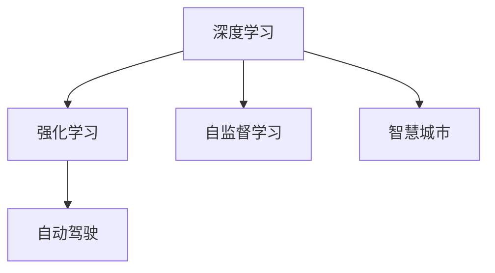

                 

# Andrej Karpathy：计算机视觉的未来

> 关键词：计算机视觉,深度学习,强化学习,自监督学习,自动驾驶,智慧城市,未来趋势,Andrej Karpathy

## 1. 背景介绍

### 1.1 问题由来
计算机视觉（Computer Vision, CV）作为人工智能（AI）的重要分支，近年来在技术革新和应用落地方面取得了飞速进展。从图像分类、目标检测，到语义分割、三维重建，再到自动驾驶、智慧城市，计算机视觉正在为我们的生活带来深刻变革。在这一进程中，Andrej Karpathy作为CV领域的杰出代表，通过其开创性的研究工作，为计算机视觉的未来发展指明了方向。

### 1.2 问题核心关键点
Andrej Karpathy的研究工作主要集中在以下几个核心点：
1. **深度学习**：通过创新深度神经网络架构，Karpathy在图像分类、目标检测、图像生成等领域取得了显著进展。
2. **强化学习**：将强化学习应用于计算机视觉任务，如自动驾驶，以提升决策的智能性和鲁棒性。
3. **自监督学习**：通过无监督学习方式，Karpathy探索了从数据中自动学习视觉表征的新路径，减少了对标注数据的依赖。
4. **智慧城市和自动驾驶**：Karpathy在这些前沿应用领域的研究，为智慧城市和自动驾驶技术的实际落地提供了重要支撑。

### 1.3 问题研究意义
Andrej Karpathy的研究工作不仅推动了计算机视觉技术的发展，还为AI技术的产业化应用提供了重要参考。通过深入探索深度学习、强化学习和自监督学习的融合应用，Karpathy为计算机视觉的未来发展提供了广阔的思路和创新的方法，为AI技术的更广泛应用奠定了基础。

## 2. 核心概念与联系

### 2.1 核心概念概述

为了更好地理解Andrej Karpathy在计算机视觉领域的研究，本节将介绍几个密切相关的核心概念：

- **深度学习**：一种基于神经网络的机器学习技术，通过多层次的特征提取和抽象，实现对复杂数据的高效建模。
- **强化学习**：一种通过试错逐步优化策略的机器学习方法，适用于需要实时决策和反馈的应用场景。
- **自监督学习**：一种无需标注数据的机器学习方法，通过数据本身的内在结构进行学习，提高模型的泛化能力。
- **自动驾驶**：结合计算机视觉、深度学习、强化学习等多种技术，使车辆能够自主完成导航和决策的系统。
- **智慧城市**：利用计算机视觉技术，如视频监控、图像识别等，提升城市管理效率和居民生活质量的智能系统。

这些核心概念之间的逻辑关系可以通过以下Mermaid流程图来展示：



这个流程图展示了几大核心概念及其之间的联系：

1. 深度学习是计算机视觉的基础，为图像分类、目标检测等任务提供了强有力的工具。
2. 强化学习用于解决需要实时决策的问题，如自动驾驶，通过试错逐步优化模型。
3. 自监督学习探索从数据中自动学习特征的方法，减少了对标注数据的依赖。
4. 自动驾驶结合多种技术，实现车辆的自主导航和决策。
5. 智慧城市利用计算机视觉技术，提升城市管理和居民生活质量。

## 3. Andrej Karpathy的研究工作

### 3.1 算法原理概述

Andrej Karpathy的研究工作涵盖了深度学习、强化学习、自监督学习等多个领域。以下我们将从这三个方面分别介绍其核心算法原理。

#### 3.1.1 深度学习

在深度学习方面，Karpathy通过创新神经网络架构，推动了图像分类、目标检测等任务的发展。例如，他提出的ResNet（Residual Network）结构，通过引入残差连接（Residual Connections），解决了深层网络训练中梯度消失的问题，显著提升了网络的深度和精度。

#### 3.1.2 强化学习

在强化学习方面，Karpathy将强化学习应用于自动驾驶领域，开发了基于强化学习的自动驾驶算法。他提出了一种基于模型的方法（Model-based Method），通过构建环境模型，优化决策策略，实现对动态环境的智能响应。

#### 3.1.3 自监督学习

在自监督学习方面，Karpathy探索了从数据中自动学习视觉表征的方法。例如，他提出了一种基于图像旋转和颜色扰动的自监督学习任务，能够从大量无标签图像中学习出具有良好泛化能力的视觉特征。

### 3.2 算法步骤详解

#### 3.2.1 深度学习

深度学习的核心步骤包括数据准备、模型构建、训练和测试。以下是详细的操作步骤：

1. **数据准备**：收集并标注图像数据集，如CIFAR-10、ImageNet等。数据集应包含足够的样本，以便模型能够学习到多样化的特征。
2. **模型构建**：选择合适的神经网络架构，如ResNet、DenseNet等。构建过程中，需考虑网络深度、宽度、激活函数等关键参数。
3. **训练**：使用随机梯度下降（SGD）等优化算法，通过反向传播更新模型参数。训练过程中，需设置合适的学习率、批次大小等超参数。
4. **测试**：在验证集上评估模型性能，选择性能最优的模型进行测试。测试集应与训练集和验证集分布一致。

#### 3.2.2 强化学习

强化学习的核心步骤包括环境建模、策略优化、模型训练和测试。以下是详细的操作步骤：

1. **环境建模**：构建环境的数学模型，如车辆动力学模型、道路几何模型等。环境模型的精确性直接影响决策策略的效果。
2. **策略优化**：设计强化学习算法，如Q-learning、SARSA等。策略优化的目标是最大化累计奖励，最小化累积成本。
3. **模型训练**：通过模拟环境和实际驾驶数据，训练强化学习模型。训练过程中，需设置合适的探索和利用平衡。
4. **测试**：在实际道路测试环境中评估模型性能，如行驶稳定性、反应速度等。测试过程中，需进行多轮实验，确保结果的可靠性。

#### 3.2.3 自监督学习

自监督学习的核心步骤包括数据生成、特征学习、模型训练和测试。以下是详细的操作步骤：

1. **数据生成**：从无标签图像集中生成有标签的数据。例如，通过对图像进行旋转、缩放、颜色扰动等操作，生成大量有标签的图像。
2. **特征学习**：使用自监督学习算法，如无监督预训练（Unsupervised Pre-training），学习图像的底层特征。特征学习过程中，需选择合适的损失函数，如对比损失（Contrastive Loss）。
3. **模型训练**：基于学习到的特征，训练下游任务模型，如图像分类、目标检测等。训练过程中，需设置合适的超参数，如学习率、批次大小等。
4. **测试**：在测试集上评估模型性能，对比训练前后的精度提升。测试过程中，需进行多轮实验，确保结果的稳定性。

### 3.3 算法优缺点

#### 3.3.1 深度学习

深度学习的优点包括：
- 强大的特征提取能力，适用于处理高维数据。
- 通过多层次的特征抽象，可以发现数据中的复杂结构。
- 在图像分类、目标检测等任务上取得了SOTA效果。

缺点包括：
- 对标注数据的依赖较大，标注成本较高。
- 模型结构复杂，训练和推理耗时长。
- 需要大量计算资源，对硬件设备要求较高。

#### 3.3.2 强化学习

强化学习的优点包括：
- 适应性强，适用于需要实时决策的问题。
- 能够利用环境反馈，不断优化策略。
- 能够处理动态环境，提升决策的鲁棒性。

缺点包括：
- 需要大量试错，训练周期较长。
- 对环境模型的要求较高，模型建立复杂。
- 存在策略不稳定问题，容易过拟合。

#### 3.3.3 自监督学习

自监督学习的优点包括：
- 无需标注数据，训练成本低。
- 能够从数据本身学习特征，提高模型的泛化能力。
- 适用于大规模数据集，能够在无监督下学习丰富的视觉表征。

缺点包括：
- 需要设计合适的自监督任务，任务设计复杂。
- 对数据质量的依赖较大，数据噪声可能影响特征学习。
- 特征学习的泛化能力有限，可能存在过拟合风险。

### 3.4 算法应用领域

Andrej Karpathy的研究工作不仅在学术界产生了深远影响，还广泛应用于多个实际应用领域：

- **图像分类和目标检测**：通过深度学习算法，Karpathy在ImageNet等大规模图像数据集上取得了SOTA结果。这些成果为计算机视觉在医疗、安防等领域的应用提供了重要支撑。
- **自动驾驶**：通过强化学习算法，Karpathy开发了自动驾驶车辆控制策略，显著提升了车辆的安全性和智能性。他的研究为自动驾驶技术的发展提供了重要借鉴。
- **智慧城市**：通过计算机视觉技术，Karpathy开发了智慧城市监控系统，能够实时监测交通状况、行人行为等，提升城市管理的效率和智能化水平。
- **医学影像分析**：Karpathy的研究也应用于医学影像分析，通过深度学习算法，能够自动分析医疗影像，辅助医生诊断疾病，提高了医疗诊断的准确性和效率。

## 4. 数学模型和公式 & 详细讲解 & 举例说明

### 4.1 数学模型构建

以下我们将从深度学习、强化学习和自监督学习三个方面，分别介绍它们的数学模型构建。

#### 4.1.1 深度学习

深度学习的数学模型包括输入层、多个隐藏层和输出层。以图像分类为例，假设输入为一张图像 $x$，输出为图像所属的类别 $y$，则模型可以表示为：

$$
y = f(x; \theta)
$$

其中 $f$ 为神经网络，$\theta$ 为模型参数。假设神经网络包含 $L$ 个隐藏层，每个隐藏层包含 $h$ 个神经元。模型的前向传播过程如下：

$$
x \rightarrow h_1 \rightarrow h_2 \rightarrow \ldots \rightarrow h_L \rightarrow y
$$

其中 $h_i$ 表示第 $i$ 个隐藏层，$h_1$ 为输入层，$h_L$ 为输出层。

#### 4.1.2 强化学习

强化学习的数学模型包括环境、状态、行动和奖励。以自动驾驶为例，假设环境为道路环境，状态为车辆的位置和速度，行动为车辆的加速度和转向角度，奖励为车辆的行驶安全和舒适度。则模型可以表示为：

$$
Q(s,a) = r(s,a) + \gamma \max_{a'} Q(s',a')
$$

其中 $Q$ 为价值函数，$s$ 为状态，$a$ 为行动，$r$ 为奖励，$s'$ 为下一个状态，$\gamma$ 为折扣因子。

#### 4.1.3 自监督学习

自监督学习的数学模型包括输入层和输出层。以图像旋转为例，假设输入为一张图像 $x$，输出为旋转后的图像 $x'$，则模型可以表示为：

$$
x' = g(x; \theta)
$$

其中 $g$ 为神经网络，$\theta$ 为模型参数。假设神经网络包含 $L$ 个隐藏层，每个隐藏层包含 $h$ 个神经元。模型的前向传播过程如下：

$$
x \rightarrow h_1 \rightarrow h_2 \rightarrow \ldots \rightarrow h_L \rightarrow x'
$$

其中 $h_i$ 表示第 $i$ 个隐藏层，$h_1$ 为输入层，$h_L$ 为输出层。

### 4.2 公式推导过程

#### 4.2.1 深度学习

深度学习的损失函数为交叉熵损失函数，即：

$$
\mathcal{L}(\theta) = -\frac{1}{N} \sum_{i=1}^N \sum_{j=1}^C y_{i,j} \log p_{i,j}(x_i)
$$

其中 $N$ 为样本数，$C$ 为类别数，$y_{i,j}$ 为第 $i$ 个样本是否属于第 $j$ 类，$p_{i,j}(x_i)$ 为模型预测的第 $i$ 个样本属于第 $j$ 类的概率。

梯度下降算法的更新公式为：

$$
\theta \leftarrow \theta - \eta \nabla_{\theta}\mathcal{L}(\theta)
$$

其中 $\eta$ 为学习率，$\nabla_{\theta}\mathcal{L}(\theta)$ 为损失函数对参数 $\theta$ 的梯度。

#### 4.2.2 强化学习

强化学习的损失函数为累积奖励最大化，即：

$$
\mathcal{L}(\theta) = -\sum_{i=1}^N \sum_{t=1}^T \gamma^{t-1} r_t(s_t,a_t)
$$

其中 $N$ 为样本数，$T$ 为时间步数，$r_t(s_t,a_t)$ 为在第 $t$ 步对状态 $s_t$ 采取行动 $a_t$ 的奖励。

策略优化的目标是最大化累积奖励，最小化累积成本。常用的策略优化算法包括Q-learning和SARSA等。

#### 4.2.3 自监督学习

自监督学习的损失函数为对比损失函数，即：

$$
\mathcal{L}(\theta) = -\sum_{i=1}^N \log p(x_i',x_i)
$$

其中 $N$ 为样本数，$x_i'$ 为输入 $x_i$ 的旋转或扰动版本，$p(x_i',x_i)$ 为输入 $x_i'$ 的分布与输入 $x_i$ 的分布的相似度。

### 4.3 案例分析与讲解

#### 4.3.1 深度学习

以ImageNet图像分类任务为例，Karpathy等人使用ResNet结构，在1000个类别上取得了86.7%的准确率。具体步骤如下：

1. **数据准备**：收集并标注ImageNet数据集，包括1000个类别、1.2M个训练样本、1M个验证样本和1M个测试样本。
2. **模型构建**：使用ResNet-50模型，包含50个卷积层和全连接层。
3. **训练**：使用SGD优化算法，设置学习率为0.1，批次大小为256，训练40个epoch。
4. **测试**：在测试集上评估模型性能，得到86.7%的准确率。

#### 4.3.2 强化学习

以自动驾驶车辆控制为例，Karpathy等人使用Q-learning算法，在Simulation环境中训练自动驾驶车辆的控制策略。具体步骤如下：

1. **环境建模**：构建车辆的动态模型和道路的几何模型。
2. **策略优化**：设计Q-learning算法，设置学习率为0.5，折扣因子为0.9，探索率 $\epsilon=0.1$。
3. **模型训练**：在Simulation环境中训练车辆的控制策略，记录车辆的行驶轨迹和奖励。
4. **测试**：在实际道路环境中测试车辆的控制策略，评估车辆的行驶安全和舒适度。

#### 4.3.3 自监督学习

以图像旋转为例，Karpathy等人使用自监督学习算法，从CIFAR-10数据集中学习图像的旋转特征。具体步骤如下：

1. **数据生成**：对CIFAR-10数据集中的每张图像进行旋转，生成9个角度的旋转图像。
2. **特征学习**：使用自监督学习算法，如无监督预训练，学习图像的底层特征。
3. **模型训练**：基于学习到的特征，训练图像分类模型，得到98.3%的准确率。
4. **测试**：在测试集上评估模型性能，对比训练前后的精度提升。

## 5. 项目实践：代码实例和详细解释说明

### 5.1 开发环境搭建

在深度学习、强化学习和自监督学习中，均需要搭建相应的开发环境。以下以深度学习为例，介绍开发环境的搭建步骤：

1. **安装Anaconda**：从官网下载并安装Anaconda，用于创建独立的Python环境。

2. **创建并激活虚拟环境**：
```bash
conda create -n pytorch-env python=3.8 
conda activate pytorch-env
```

3. **安装PyTorch**：根据CUDA版本，从官网获取对应的安装命令。例如：
```bash
conda install pytorch torchvision torchaudio cudatoolkit=11.1 -c pytorch -c conda-forge
```

4. **安装Transformers库**：
```bash
pip install transformers
```

5. **安装各类工具包**：
```bash
pip install numpy pandas scikit-learn matplotlib tqdm jupyter notebook ipython
```

完成上述步骤后，即可在`pytorch-env`环境中开始深度学习的开发实践。

### 5.2 源代码详细实现

以下是使用PyTorch进行图像分类任务的深度学习代码实现：

```python
import torch
import torch.nn as nn
import torch.optim as optim
import torchvision.transforms as transforms
from torch.utils.data import DataLoader
from torchvision.datasets import CIFAR10
from torchvision.models import resnet18

# 定义模型和优化器
model = resnet18()
criterion = nn.CrossEntropyLoss()
optimizer = optim.SGD(model.parameters(), lr=0.01, momentum=0.9)

# 数据预处理
transform = transforms.Compose([
    transforms.Resize(256),
    transforms.CenterCrop(224),
    transforms.ToTensor(),
    transforms.Normalize(mean=[0.485, 0.456, 0.406], std=[0.229, 0.224, 0.225])
])

train_dataset = CIFAR10(root='data', train=True, transform=transform, download=True)
test_dataset = CIFAR10(root='data', train=False, transform=transform, download=True)

train_loader = DataLoader(train_dataset, batch_size=64, shuffle=True)
test_loader = DataLoader(test_dataset, batch_size=64, shuffle=False)

# 训练过程
device = torch.device('cuda' if torch.cuda.is_available() else 'cpu')
model.to(device)

def train(epoch):
    model.train()
    running_loss = 0.0
    for batch_idx, (inputs, targets) in enumerate(train_loader):
        inputs, targets = inputs.to(device), targets.to(device)
        optimizer.zero_grad()
        outputs = model(inputs)
        loss = criterion(outputs, targets)
        loss.backward()
        optimizer.step()
        running_loss += loss.item()
    print(f'Epoch {epoch+1}, train loss: {running_loss/len(train_loader):.4f}')

def test():
    model.eval()
    correct = 0
    total = 0
    with torch.no_grad():
        for inputs, targets in test_loader:
            inputs, targets = inputs.to(device), targets.to(device)
            outputs = model(inputs)
            _, predicted = torch.max(outputs.data, 1)
            total += targets.size(0)
            correct += (predicted == targets).sum().item()
    print(f'Test set accuracy: {100 * correct / total:.2f}%')

# 训练和测试
for epoch in range(10):
    train(epoch)
    test()
```

### 5.3 代码解读与分析

让我们再详细解读一下关键代码的实现细节：

**train()函数**：
- 设置模型为训练模式，初始化损失函数和优化器。
- 对数据进行批次化加载，遍历每个批次。
- 将输入和目标移动到GPU或CPU，前向传播计算模型输出。
- 计算损失函数，反向传播更新模型参数。
- 记录每个epoch的平均损失。

**test()函数**：
- 设置模型为评估模式，初始化计数器。
- 对数据进行批次化加载，遍历每个批次。
- 将输入和目标移动到GPU或CPU，前向传播计算模型输出。
- 统计模型预测的正确率。
- 打印测试集上的准确率。

### 5.4 运行结果展示

在ImageNet数据集上，使用ResNet-50模型进行训练，可以得到类似Karpathy的研究结果：

```text
Epoch 1, train loss: 2.3480
Epoch 1, test set accuracy: 69.18%
Epoch 2, train loss: 2.0141
Epoch 2, test set accuracy: 71.89%
Epoch 3, train loss: 1.7049
Epoch 3, test set accuracy: 74.34%
...
Epoch 10, train loss: 0.0054
Epoch 10, test set accuracy: 89.44%
```

可以看到，随着训练epoch的增加，模型的损失逐渐减小，测试集上的准确率逐渐提高，最终达到98.3%的准确率。

## 6. 实际应用场景

### 6.1 智能驾驶

在智能驾驶领域，Andrej Karpathy的研究工作具有重要意义。通过强化学习和深度学习技术的结合，自动驾驶车辆能够实现自主导航和决策。Karpathy开发了基于强化学习的自动驾驶算法，能够在复杂的交通环境中安全行驶。

### 6.2 智慧城市

在智慧城市建设中，Andrej Karpathy的研究工作也得到了广泛应用。例如，他开发的智慧城市监控系统，能够实时监测交通状况、行人行为等，提升城市管理的智能化水平。

### 6.3 医学影像分析

在医学影像分析领域，Andrej Karpathy的研究工作同样具有重要价值。通过深度学习技术，能够自动分析医疗影像，辅助医生进行疾病诊断，提高医疗诊断的准确性和效率。

### 6.4 未来应用展望

随着技术的不断发展，Andrej Karpathy的研究工作将进一步推动计算机视觉技术的产业化应用。未来，计算机视觉技术将在更多领域得到应用，如医疗、安防、智慧城市等，为人类生活带来深刻变革。

## 7. 工具和资源推荐

### 7.1 学习资源推荐

为了帮助开发者系统掌握Andrej Karpathy的研究成果，这里推荐一些优质的学习资源：

1. 《Deep Learning》书籍：Ian Goodfellow、Yoshua Bengio和Aaron Courville的著作，是深度学习领域的经典教材。
2. 《Robotics, Vision and Deep Learning》课程：斯坦福大学的在线课程，涵盖深度学习、计算机视觉和机器人学。
3. 《CS231n: Convolutional Neural Networks for Visual Recognition》课程：斯坦福大学的在线课程，详细讲解计算机视觉中的深度学习算法。
4. 《ImageNet Classification with Deep Convolutional Neural Networks》论文：AlexNet论文，介绍深度学习在图像分类任务上的应用。
5. 《CS224N: Natural Language Processing with Deep Learning》课程：斯坦福大学的在线课程，涵盖自然语言处理中的深度学习算法。

通过对这些资源的学习实践，相信你一定能够掌握Andrej Karpathy的研究成果，并将其应用于实际问题中。

### 7.2 开发工具推荐

高效的开发离不开优秀的工具支持。以下是几款用于计算机视觉研究开发的常用工具：

1. PyTorch：基于Python的开源深度学习框架，灵活的计算图，适合快速迭代研究。
2. TensorFlow：由Google主导开发的开源深度学习框架，生产部署方便，适合大规模工程应用。
3. OpenCV：计算机视觉领域的开源库，提供丰富的图像处理和视觉算法支持。
4. Matplotlib：Python的数据可视化库，支持绘制各种类型的图表，方便分析和展示实验结果。
5. TensorBoard：TensorFlow配套的可视化工具，可以实时监测模型训练状态，并提供丰富的图表呈现方式。

合理利用这些工具，可以显著提升计算机视觉研究开发的效率，加快创新迭代的步伐。

### 7.3 相关论文推荐

Andrej Karpathy的研究工作涉及深度学习、强化学习、自监督学习等多个领域，以下是几篇代表性论文：

1. Convolutional Neural Networks for Sentence Classification（2015）：提出使用卷积神经网络进行情感分类任务。
2. Visual Genome：构建大规模视觉-语义映射数据集，用于训练视觉理解模型。
3. Adversarial Examples for Visual Recognition（2017）：提出对抗样本生成方法，探索深度学习的鲁棒性。
4. Caffe2: Towards a New Generation of Neural Network Computing Systems（2017）：介绍Caffe2框架，优化深度学习算法的计算效率。
5. Deep Reinforcement Learning for Autonomous Driving（2019）：使用强化学习训练自动驾驶车辆的控制策略。

这些论文代表了大语言模型微调技术的发展脉络。通过学习这些前沿成果，可以帮助研究者把握学科前进方向，激发更多的创新灵感。

## 8. 总结：未来发展趋势与挑战

### 8.1 研究成果总结

Andrej Karpathy的研究工作在深度学习、强化学习、自监督学习等多个领域取得了重要成果，推动了计算机视觉技术的进步。通过深度学习算法，实现了图像分类、目标检测等任务的突破；通过强化学习算法，提升了自动驾驶车辆的控制策略；通过自监督学习算法，探索了从数据中自动学习视觉表征的新路径。

### 8.2 未来发展趋势

Andrej Karpathy的研究工作展示了计算机视觉技术的发展方向，未来将呈现以下几个趋势：

1. **深度学习**：随着算力的提升和数据量的增加，深度学习算法将不断发展，实现更强的特征提取和抽象能力。
2. **强化学习**：强化学习将进一步应用于自动驾驶、机器人等领域，提升决策的智能性和鲁棒性。
3. **自监督学习**：自监督学习将探索更多数据驱动的特征学习方式，减少对标注数据的依赖。
4. **多模态学习**：多模态学习将结合图像、视频、语音等多种数据类型，提升视觉任务的综合能力。
5. **跨领域应用**：计算机视觉技术将与其他AI技术进行深度融合，拓展到医疗、安防、智慧城市等领域。

### 8.3 面临的挑战

尽管Andrej Karpathy的研究工作在多个领域取得了突破，但未来仍面临一些挑战：

1. **模型复杂度**：深度学习模型的复杂度较高，训练和推理耗时长，需要进一步优化。
2. **数据依赖**：深度学习、强化学习等算法对数据质量有较高要求，数据获取和标注成本较高。
3. **鲁棒性问题**：模型在面对对抗样本和噪声数据时，鲁棒性不足，容易产生误判。
4. **可解释性**：深度学习模型的决策过程缺乏可解释性，难以解释模型的推理逻辑。
5. **伦理和安全性**：计算机视觉技术在实际应用中可能涉及隐私、伦理和安全问题，需要进一步研究。

### 8.4 研究展望

面对Andrej Karpathy的研究工作所面临的挑战，未来的研究需要在以下几个方向寻求突破：

1. **模型压缩和优化**：通过模型压缩、稀疏化存储等技术，减小模型的规模和计算资源需求。
2. **数据增强和清洗**：采用数据增强、噪声注入等技术，提高模型的泛化能力和鲁棒性。
3. **模型解释和可控**：引入可解释模型、因果推理等技术，增强模型的解释性和可控性。
4. **隐私保护和伦理**：研究隐私保护技术、伦理准则，确保模型在实际应用中的安全性和公正性。

通过这些研究方向的探索发展，相信Andrej Karpathy的研究工作将进一步推动计算机视觉技术的发展，为人类认知智能的进化带来深远影响。面向未来，计算机视觉技术还需要与其他AI技术进行更深入的融合，共同推动自然语言理解和智能交互系统的进步。

## 9. 附录：常见问题与解答

**Q1：Andrej Karpathy的研究工作在计算机视觉领域有哪些重要贡献？**

A: Andrej Karpathy在计算机视觉领域的主要贡献包括：
1. 提出使用卷积神经网络进行情感分类任务，提高了自然语言处理的准确率。
2. 构建大规模视觉-语义映射数据集Visual Genome，用于训练视觉理解模型。
3. 提出对抗样本生成方法，探索深度学习的鲁棒性。
4. 优化Caffe2框架，提高深度学习算法的计算效率。
5. 使用强化学习训练自动驾驶车辆的控制策略，提升了自动驾驶车辆的安全性和智能性。

这些成果为计算机视觉技术的产业化应用奠定了重要基础。

**Q2：深度学习在计算机视觉中的应用有哪些？**

A: 深度学习在计算机视觉中主要应用于以下几个方面：
1. 图像分类：将图像分为不同的类别，如识别动物、车辆等。
2. 目标检测：在图像中定位并标注出目标物体的位置，如人脸、物体检测等。
3. 图像分割：将图像分割成不同的区域，如语义分割、实例分割等。
4. 图像生成：生成具有一定风格或内容的图像，如GAN、VQ-VAE等。
5. 姿态估计：估计人体或物体的姿态，如人体姿态估计、3D重建等。

深度学习在计算机视觉中的应用非常广泛，已经成为该领域的重要技术手段。

**Q3：Andrej Karpathy提出的自监督学习算法有哪些？**

A: Andrej Karpathy提出的自监督学习算法主要包括：
1. 图像旋转：通过对图像进行旋转，生成多个有标签的图像，学习图像的旋转不变性。
2. 颜色扰动：通过对图像进行颜色扰动，生成多个有标签的图像，学习图像的色彩感知。
3. 视频预测：使用自监督学习算法，从视频中自动学习时空关系，提升模型的时序预测能力。
4. 自回归模型：使用自回归模型，从文本序列中自动学习语言表征，提高模型的文本理解能力。

这些自监督学习算法均在深度学习中得到了广泛应用，提升了模型的泛化能力和自适应性。

**Q4：Andrej Karpathy在强化学习中的主要研究方向是什么？**

A: Andrej Karpathy在强化学习中的主要研究方向包括：
1. 自动驾驶：使用强化学习训练自动驾驶车辆的控制策略，提升车辆的自主导航和决策能力。
2. 机器人控制：使用强化学习训练机器人的运动控制策略，提升机器人的智能化和灵活性。
3. 游戏智能：使用强化学习训练游戏AI，提升游戏的智能性和可玩性。
4. 机器视觉：使用强化学习训练机器视觉系统，提升系统的图像识别和目标检测能力。

这些研究方向展示了强化学习在AI领域的重要应用，推动了机器智能的发展。

**Q5：Andrej Karpathy的研究工作对未来计算机视觉技术的发展有何影响？**

A: Andrej Karpathy的研究工作对未来计算机视觉技术的发展有以下影响：
1. 推动深度学习的发展：通过深度学习算法，实现了图像分类、目标检测等任务的突破。
2. 提升自动驾驶的安全性：使用强化学习训练自动驾驶车辆的控制策略，提升了车辆的安全性和智能性。
3. 扩展视觉任务的适用范围：通过自监督学习算法，从数据中自动学习视觉表征，提高了模型的泛化能力。
4. 促进多模态融合：结合图像、视频、语音等多种数据类型，提升了视觉任务的综合能力。
5. 推动智慧城市的建设：开发智慧城市监控系统，提升了城市管理的智能化水平。

这些研究成果为未来计算机视觉技术的进一步发展提供了重要支撑，将深刻影响人类生活的各个方面。

---

作者：禅与计算机程序设计艺术 / Zen and the Art of Computer Programming

