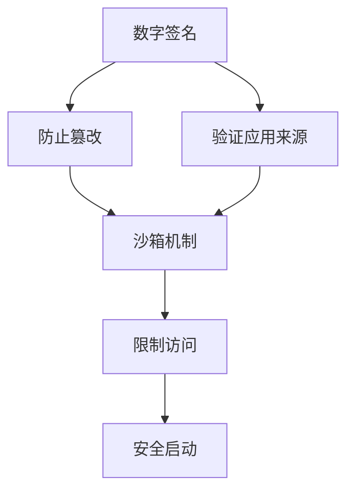

                 

## 1. 背景介绍

在当今数字化社会，Android作为全球最大的移动操作系统，拥有数十亿的用户。但随着移动应用的普及，Android应用的安全问题也日益凸显，给用户带来了巨大的风险。为了保障用户的隐私安全和应用的安全性，Google推出了Android应用安全与加固技术。

### 1.1 问题由来

Android应用的攻击手段不断升级，如SQL注入、跨站脚本攻击、漏洞利用等。这些攻击不仅可能导致数据泄露，还可能控制用户设备，甚至窃取隐私。因此，如何有效保护Android应用的安全，成为开发者和企业关注的重点。

### 1.2 问题核心关键点

Android应用的安全与加固主要包括以下几个方面：
1. 代码审计：识别和修复应用中的安全漏洞。
2. 签名验证：验证应用的数字签名，防止应用被篡改。
3. 权限控制：限制应用访问敏感数据和设备。
4. 沙箱机制：隔离应用和操作系统内核，防止跨应用攻击。
5. 安全配置：确保应用运行在安全模式下，如使用安全启动（Secure Boot）。

### 1.3 问题研究意义

研究Android应用的安全与加固技术，对于提升应用的安全性、保护用户隐私、维护网络安全具有重要意义：
1. 降低应用风险：通过代码审计和安全配置，有效减少应用中的安全漏洞，降低攻击成功概率。
2. 保障用户隐私：限制应用访问敏感数据和设备，防止隐私泄露。
3. 促进产业升级：安全加固技术的应用，加速了Android应用产业的安全化进程，提高了应用的竞争力。

## 2. 核心概念与联系

### 2.1 核心概念概述

为了深入理解Android应用的安全与加固技术，我们先介绍几个核心概念：

- 数字签名（Digital Signature）：一种加密技术，用于验证应用来源的合法性。
- 沙箱（Sandboxing）：将应用隔离在特定的安全环境中，防止恶意代码访问设备资源。
- 权限控制（Permission Control）：限制应用访问敏感数据和设备，防止应用滥用权限。
- 安全启动（Secure Boot）：一种启动机制，确保设备只运行由可信源签名的系统镜像。

这些概念之间通过以下Mermaid流程图进行联系：



这个流程图展示了数字签名、沙箱机制、权限控制和安全启动这四个核心概念的逻辑关系：

1. 数字签名验证了应用来源的合法性，防止应用被篡改。
2. 沙箱机制隔离了应用，限制了应用对设备的访问。
3. 权限控制限制了应用访问敏感数据和设备。
4. 安全启动确保了设备运行的可信性。

这些概念共同构成了Android应用安全与加固的基础框架，使得开发者能够构建安全、可靠的应用。

## 3. 核心算法原理 & 具体操作步骤
### 3.1 算法原理概述

Android应用的安全与加固技术主要基于以下几个原理：

1. 数字签名：利用公钥加密技术，确保应用代码的完整性和来源的合法性。
2. 沙箱机制：将应用隔离在虚拟环境中，防止恶意代码访问设备资源。
3. 权限控制：通过清单文件（AndroidManifest.xml）和权限管理器，限制应用访问敏感数据和设备。
4. 安全启动：通过硬件和软件机制，确保设备只运行可信的应用程序。

### 3.2 算法步骤详解

下面详细介绍Android应用安全与加固的每个步骤：

**Step 1: 数字签名**
- 生成应用签名：使用签名工具（如signapk）生成应用的数字签名。
- 验证应用签名：在安装应用时，Android系统验证应用的签名，确保其来源合法且未被篡改。

**Step 2: 沙箱机制**
- 创建沙箱环境：将应用运行在虚拟的隔离环境中，防止其访问系统敏感资源。
- 限制访问权限：通过沙箱环境限制应用对设备文件、网络、摄像头等敏感资源的访问。

**Step 3: 权限控制**
- 配置权限清单：在AndroidManifest.xml文件中，声明应用所需的权限。
- 授权权限请求：在应用运行时，请求用户授权访问敏感数据和设备。

**Step 4: 安全启动**
- 启用安全启动：在设备设置中启用安全启动，确保设备只运行可信的应用程序。
- 验证系统镜像：在设备启动时，验证系统镜像的数字签名，确保其未被篡改。

### 3.3 算法优缺点

Android应用的安全与加固技术具有以下优点：
1. 提升应用安全性：通过数字签名、沙箱机制、权限控制和安全启动，有效减少了应用中的安全漏洞。
2. 增强用户信任：数字签名和权限控制提高了用户对应用的可信度，增强了用户对应用的信任。
3. 简化开发流程：Google提供了丰富的安全工具和资源，简化开发者的开发流程。

同时，该技术也存在一些局限性：
1. 依赖Google服务：部分安全功能依赖Google Play Protect等Google服务，可能影响用户体验。
2. 设备兼容性：部分功能（如安全启动）需要特定的设备支持，限制了应用的兼容性。
3. 性能开销：沙箱机制和权限控制增加了应用的资源消耗，影响应用的性能。

### 3.4 算法应用领域

Android应用的安全与加固技术广泛应用于各种应用场景：

- 银行应用：通过权限控制和安全启动，保障用户资金安全。
- 医疗应用：限制应用访问健康数据，保护患者隐私。
- 企业应用：通过数字签名和权限控制，确保应用运行在安全环境中。
- 游戏应用：使用沙箱机制防止恶意代码注入，保障用户设备安全。

## 4. 数学模型和公式 & 详细讲解 & 举例说明

### 4.1 数学模型构建

Android应用的安全与加固技术主要依赖于数字签名和权限控制。其中，权限控制通过清单文件（AndroidManifest.xml）进行配置。

清单文件示例：
```xml
<manifest xmlns:android="http://schemas.android.com/apk/res/android"
    package="com.example.myapp">

    <uses-permission android:name="android.permission.CAMERA" />
    <uses-permission android:name="android.permission.WRITE_EXTERNAL_STORAGE" />
    
    <application
        android:name=".MainApplication"
        android:allowBackup="true"
        android:icon="@mipmap/ic_launcher"
        android:label="@string/app_name"
        android:roundIcon="@mipmap/ic_launcher_round"
        android:supportsRtl="true"
        android:theme="@style/AppTheme">
        
        <activity android:name=".MainActivity">
            <intent-filter>
                <action android:name="android.intent.action.MAIN" />
                <category android:name="android.intent.category.LAUNCHER" />
            </intent-filter>
        </activity>
    </application>

</manifest>
```

在清单文件中，通过`<uses-permission>`元素声明应用所需的权限，如`CAMERA`和`WRITE_EXTERNAL_STORAGE`。

### 4.2 公式推导过程

权限控制的核心是清单文件的配置和权限的请求。清单文件通过XML格式声明应用所需的权限，权限请求通过`PackageManager`和`ActivityManager`类进行管理。

权限请求示例代码：
```java
Intent intent = new Intent("com.example.myapp.permission.CAMERA");
if (ContextCompat.checkSelfPermission(this, Manifest.permission.CAMERA) != PackageManager.PERMISSION_GRANTED) {
    ActivityCompat.requestPermissions(this, new String[]{Manifest.permission.CAMERA}, 1);
}
```

在代码中，通过`ActivityCompat.requestPermissions`方法请求用户授权访问摄像头权限。

### 4.3 案例分析与讲解

假设我们开发了一个拍照应用，需要访问设备的摄像头和相册权限。在清单文件中，我们声明这两个权限，并在代码中进行权限请求。

清单文件代码：
```xml
<uses-permission android:name="android.permission.CAMERA" />
<uses-permission android:name="android.permission.WRITE_EXTERNAL_STORAGE" />
```

权限请求代码：
```java
Intent intent = new Intent("com.example.myapp.permission.CAMERA");
if (ContextCompat.checkSelfPermission(this, Manifest.permission.CAMERA) != PackageManager.PERMISSION_GRANTED) {
    ActivityCompat.requestPermissions(this, new String[]{Manifest.permission.CAMERA}, 1);
}
```

在运行时，如果用户未授权访问摄像头权限，系统将提示用户授权。

## 5. 项目实践：代码实例和详细解释说明
### 5.1 开发环境搭建

为了进行Android应用安全与加固的开发，我们需要搭建Android开发环境。具体步骤如下：

1. 安装Android Studio：下载并安装Android Studio IDE。
2. 配置SDK环境：在Android Studio中配置Android SDK和模拟器。
3. 创建新项目：在Android Studio中创建新的Android项目，选择Android SDK版本和目标设备。

### 5.2 源代码详细实现

下面以一个简单的拍照应用为例，实现数字签名、权限控制和沙箱机制。

**Step 1: 数字签名**

在Android Studio中，生成应用的签名。具体步骤如下：
1. 在项目根目录下，打开`gradle.properties`文件，添加签名相关信息。
```properties
signing.keyId=your_key_id
signing.password=your_signing_password
signing.keyStoreFile=your_keystore_path
signing.keyStorePassword=your_keystore_password
signing.keyAlias=your_key_alias
```

2. 在项目根目录下，创建`app/build/outputs/signing/release`文件夹，生成签名文件。

**Step 2: 沙箱机制**

在清单文件中，配置沙箱机制。具体步骤如下：
1. 在清单文件中，添加`android:hardwareAccelerated="false"`属性，禁用硬件加速。
2. 在清单文件中，添加`android:usesCleartextTraffic="false"`属性，禁用明文传输。

代码示例：
```xml
<application android:hardwareAccelerated="false" android:usesCleartextTraffic="false">
```

**Step 3: 权限控制**

在清单文件中，配置权限控制。具体步骤如下：
1. 在清单文件中，声明应用所需的权限。
2. 在代码中进行权限请求。

代码示例：
清单文件：
```xml
<uses-permission android:name="android.permission.CAMERA" />
<uses-permission android:name="android.permission.WRITE_EXTERNAL_STORAGE" />
```

权限请求代码：
```java
Intent intent = new Intent("com.example.myapp.permission.CAMERA");
if (ContextCompat.checkSelfPermission(this, Manifest.permission.CAMERA) != PackageManager.PERMISSION_GRANTED) {
    ActivityCompat.requestPermissions(this, new String[]{Manifest.permission.CAMERA}, 1);
}
```

### 5.3 代码解读与分析

在数字签名方面，Android Studio会自动生成签名文件，开发者只需配置签名相关信息即可。在沙箱机制方面，通过`android:hardwareAccelerated`和`android:usesCleartextTraffic`属性，有效防止应用访问硬件和进行明文传输。在权限控制方面，清单文件和权限请求代码是主要实现手段，通过清单文件声明权限，代码中请求权限，确保应用在运行时获得用户授权。

### 5.4 运行结果展示

运行生成的应用，可以看到数字签名、沙箱机制和权限控制的作用。数字签名确保了应用来源的合法性，沙箱机制防止了应用访问系统资源，权限控制限制了应用访问敏感数据和设备。

## 6. 实际应用场景
### 6.1 智能客服系统

智能客服系统需要处理大量的用户咨询数据，涉及敏感信息，如身份证号、银行账户等。为了保护用户隐私，智能客服系统需要进行安全加固。

**应用场景：**在智能客服系统中，应用需要访问用户的敏感数据，如身份证号、银行账户等。

**解决方案：**
1. 在清单文件中，声明应用所需的权限，如`READ_CONTACTS`和`READ_CALENDAR`。
2. 在代码中进行权限请求，确保用户授权。

代码示例：
清单文件：
```xml
<uses-permission android:name="android.permission.READ_CONTACTS" />
<uses-permission android:name="android.permission.READ_CALENDAR" />
```

权限请求代码：
```java
Intent intent = new Intent("com.example.myapp.permission.READ_CONTACTS");
if (ContextCompat.checkSelfPermission(this, Manifest.permission.READ_CONTACTS) != PackageManager.PERMISSION_GRANTED) {
    ActivityCompat.requestPermissions(this, new String[]{Manifest.permission.READ_CONTACTS}, 1);
}
```

通过数字签名和权限控制，确保了智能客服系统运行在安全环境中，保护了用户隐私。

### 6.2 金融应用

金融应用涉及用户的财务数据，如银行账户、交易记录等，需要严格保护。为了保障用户资金安全，金融应用需要进行安全加固。

**应用场景：**在金融应用中，应用需要访问用户的银行账户和交易记录等敏感数据。

**解决方案：**
1. 在清单文件中，声明应用所需的权限，如`ACCOUNT_ACCESS`和`ACCOUNT_MANAGER`。
2. 在代码中进行权限请求，确保用户授权。

代码示例：
清单文件：
```xml
<uses-permission android:name="android.permission.ACCOUNT_ACCESS" />
<uses-permission android:name="android.permission.ACCOUNT_MANAGER" />
```

权限请求代码：
```java
Intent intent = new Intent("com.example.myapp.permission.ACCOUNT_ACCESS");
if (ContextCompat.checkSelfPermission(this, Manifest.permission.ACCOUNT_ACCESS) != PackageManager.PERMISSION_GRANTED) {
    ActivityCompat.requestPermissions(this, new String[]{Manifest.permission.ACCOUNT_ACCESS}, 1);
}
```

通过数字签名和权限控制，确保了金融应用运行在安全环境中，保护了用户资金安全。

### 6.3 游戏应用

游戏应用涉及网络数据传输，如玩家数据、游戏记录等，需要防止恶意攻击。为了保障用户设备安全，游戏应用需要进行安全加固。

**应用场景：**在游戏应用中，应用需要访问网络数据和存储玩家数据。

**解决方案：**
1. 在清单文件中，声明应用所需的权限，如`INTERNET`和`READ_EXTERNAL_STORAGE`。
2. 在代码中进行权限请求，确保用户授权。

代码示例：
清单文件：
```xml
<uses-permission android:name="android.permission.INTERNET" />
<uses-permission android:name="android.permission.READ_EXTERNAL_STORAGE" />
```

权限请求代码：
```java
Intent intent = new Intent("com.example.myapp.permission.INTERNET");
if (ContextCompat.checkSelfPermission(this, Manifest.permission.INTERNET) != PackageManager.PERMISSION_GRANTED) {
    ActivityCompat.requestPermissions(this, new String[]{Manifest.permission.INTERNET}, 1);
}
```

通过数字签名和权限控制，确保了游戏应用运行在安全环境中，防止恶意攻击和数据泄露。

## 7. 工具和资源推荐
### 7.1 学习资源推荐

为了帮助开发者系统掌握Android应用安全与加固的技术，这里推荐一些优质的学习资源：

1. Android官方文档：Android官方提供的文档详细介绍了数字签名、沙箱机制、权限控制和安全启动等安全功能的使用方法。
2. Google Play Protect文档：Google Play Protect提供了详细的权限配置和沙箱机制的使用说明，确保应用在Google Play Store中的安全性。
3. OWASP移动应用安全指南：OWASP提供的移动应用安全指南，详细介绍了Android应用中的常见安全漏洞和防护措施。
4. 《Android应用安全开发》书籍：本书详细介绍了Android应用安全与加固技术的实现原理和方法，适合初学者和中级开发者阅读。
5. Udacity Android应用安全课程：Udacity提供的Android应用安全课程，通过视频和实践，帮助开发者掌握Android应用安全与加固技术。

通过对这些资源的学习，相信你一定能够系统掌握Android应用安全与加固的技术，并应用于实际开发中。

### 7.2 开发工具推荐

Android应用的安全与加固技术需要依赖Android Studio和Android SDK进行开发。以下是几款常用的开发工具：

1. Android Studio：Google官方提供的Android开发环境，集成了代码编辑器、调试工具、模拟器等功能，适合开发和调试Android应用。
2. Gradle：Android项目的构建工具，支持复杂的项目依赖管理和自动化构建。
3. Keystore工具：Android提供的签名工具，用于生成数字签名和密钥。
4. TestCoverage工具：Android提供的覆盖率测试工具，用于测试代码的覆盖率。
5. PMD工具：Android提供的权限管理工具，用于扫描和分析应用中的权限配置。

合理利用这些工具，可以显著提升Android应用安全与加固的开发效率，加快创新迭代的步伐。

### 7.3 相关论文推荐

Android应用的安全与加固技术是一个快速发展的领域，以下几篇论文代表了当前的研究方向：

1. Security Analysis and Mitigation of Android App Security Vulnerabilities：分析了Android应用中的常见安全漏洞，提出了相应的防护措施。
2. Robust Permission and Sandbox Policy for Android Apps：研究了Android应用中权限控制和沙箱机制的有效性，提出了改进方案。
3. Security Hardening for Android Apps：介绍了Android应用安全加固的最佳实践，涵盖了数字签名、权限控制和安全启动等关键技术。
4. Android App Security Testing：研究了Android应用安全测试的方法和工具，提出了基于模型和基于测试的安全测试策略。
5. Security for Mobile Applications：介绍了移动应用安全的基本概念和技术，包括Android应用的安全与加固方法。

这些论文代表了Android应用安全与加固技术的发展脉络，有助于研究者了解该领域的最新进展和研究热点。

## 8. 总结：未来发展趋势与挑战
### 8.1 研究成果总结

Android应用的安全与加固技术在过去几年中取得了显著进展，主要体现在以下几个方面：

1. 数字签名和权限控制的应用更加广泛，有效保护了应用的安全性。
2. 沙箱机制和安全启动等技术的应用，增强了应用运行的安全环境。
3. 基于Android Studio和Gradle等工具，开发者能够更加便捷地进行安全加固开发。

### 8.2 未来发展趋势

展望未来，Android应用的安全与加固技术将呈现以下几个发展趋势：

1. 零信任安全模型：通过细粒度的权限控制和动态授权机制，确保应用运行在零信任环境中，防止未经授权的访问。
2. 机器学习辅助安全检测：利用机器学习技术，自动化检测和修复应用中的安全漏洞。
3. 区块链技术的应用：通过区块链技术，确保应用和用户数据的不可篡改性和透明性。
4. 全链路安全保障：从应用开发、测试、部署到运行，全方位保障应用的安全性，防止安全漏洞的扩散。

### 8.3 面临的挑战

尽管Android应用的安全与加固技术已经取得了显著进展，但在迈向更加智能化、普适化应用的过程中，仍面临以下挑战：

1. 资源消耗：数字签名、权限控制和安全启动等技术增加了应用的资源消耗，影响应用的性能。
2. 设备兼容性：部分安全功能需要特定的设备支持，限制了应用的兼容性。
3. 用户习惯：部分用户可能不熟悉安全配置和权限请求，影响应用的可用性。

### 8.4 研究展望

为了应对这些挑战，未来的研究需要在以下几个方面寻求新的突破：

1. 优化资源消耗：通过优化代码和算法，减少数字签名和权限控制的资源消耗，提升应用的性能。
2. 提高设备兼容性：研究和开发适用于更多设备的通用安全技术，增强应用的可扩展性。
3. 提升用户体验：通过简化权限请求和提示，提高用户对安全配置的接受度和应用的可用性。

这些研究方向的探索，必将引领Android应用安全与加固技术迈向更高的台阶，为构建安全、可靠、可控的智能系统铺平道路。

## 9. 附录：常见问题与解答

**Q1: Android应用的安全与加固技术有哪些？**

A: Android应用的安全与加固技术主要包括以下几种：
1. 数字签名：确保应用来源的合法性。
2. 沙箱机制：隔离应用，防止恶意代码访问系统资源。
3. 权限控制：限制应用访问敏感数据和设备。
4. 安全启动：确保设备只运行可信的应用程序。

**Q2: 如何使用数字签名技术？**

A: 数字签名的生成和验证主要通过签名工具和Android Studio进行。具体步骤如下：
1. 在项目根目录下，打开`gradle.properties`文件，添加签名相关信息。
2. 在项目根目录下，创建`app/build/outputs/signing/release`文件夹，生成签名文件。

**Q3: 如何配置沙箱机制？**

A: 在清单文件中，配置`android:hardwareAccelerated="false"`和`android:usesCleartextTraffic="false"`属性，禁用硬件加速和明文传输。

**Q4: 如何请求用户授权访问敏感数据？**

A: 在清单文件中，声明应用所需的权限，如`CAMERA`和`WRITE_EXTERNAL_STORAGE`。在代码中进行权限请求，如`ActivityCompat.requestPermissions`方法。

通过上述的学习资源、开发工具和研究展望，相信你一定能够系统掌握Android应用安全与加固的技术，并应用于实际开发中。

