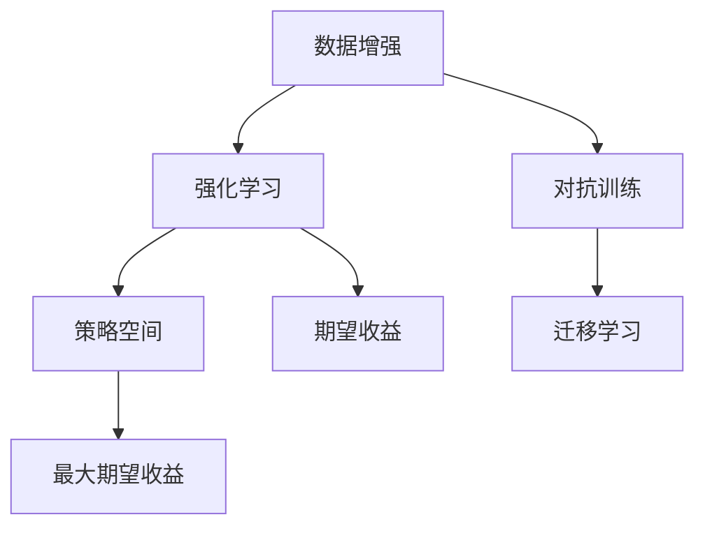

                 

# AutoAugment原理与代码实例讲解

> 关键词：AutoAugment, 数据增强, 图像分类, 对抗训练, 迁移学习, 神经网络, 深度学习, PyTorch, 数据预处理, 模型训练, 图像生成

## 1. 背景介绍

### 1.1 问题由来
随着深度学习在计算机视觉领域的飞速发展，数据增强技术逐渐成为了提高模型性能的重要手段。传统的图像数据增强方法，如随机裁剪、水平翻转、加噪声等，在保证数据多样性、降低过拟合方面发挥了巨大作用。然而，这些方法通常需要由领域专家手动设计，耗时耗力，且效果往往难以统一衡量。

为了自动化数据增强的过程，AutoAugment应运而生。它由Google在2018年的ICML会议上提出，是一种基于强化学习的数据增强算法，能够动态生成最优的数据增强策略，大大提升了图像分类任务的性能。

### 1.2 问题核心关键点
AutoAugment的核心在于利用强化学习框架，通过对一系列预定义的增强操作进行组合，找到最优的增强策略。它的主要特点包括：

- 自动化设计：AutoAugment通过强化学习自动生成增强策略，无需人工干预。
- 策略空间探索：AutoAugment探索了多种增强策略，包括剪切、翻转、旋转、拉伸等。
- 策略组合优化：AutoAugment使用最大化期望收益的强化学习框架，动态组合不同操作，生成最优策略。
- 动态调整：AutoAugment在训练过程中，通过不断调整策略参数，逐步优化增强效果。

AutoAugment已经被广泛应用于图像分类、目标检测、图像分割等计算机视觉任务中，并取得了优异的性能。

### 1.3 问题研究意义
AutoAugment通过自动化数据增强策略的设计和优化，显著提升了深度学习模型的泛化能力和鲁棒性，降低了人工设计增强策略的复杂度和时间成本。AutoAugment为深度学习模型提供了更加高效、鲁棒的数据预处理手段，推动了计算机视觉领域的发展。

## 2. 核心概念与联系

### 2.1 核心概念概述

为更好地理解AutoAugment算法，本节将介绍几个密切相关的核心概念：

- 数据增强（Data Augmentation）：通过对原始数据进行一系列变换，生成新的训练样本，提高模型泛化能力的技术。常见的数据增强方法包括随机裁剪、水平翻转、加噪声等。

- 强化学习（Reinforcement Learning, RL）：通过智能体与环境的交互，逐步优化决策策略的过程。在AutoAugment中，智能体通过与环境的交互，学习最优的增强策略。

- 对抗训练（Adversarial Training）：通过在模型训练中加入对抗样本，增强模型的鲁棒性和泛化能力。AutoAugment通过引入对抗训练的对抗样本，提升模型在噪声数据上的泛化能力。

- 迁移学习（Transfer Learning）：将在大规模数据集上预训练的模型，迁移应用到小规模数据集上的方法。AutoAugment通过迁移学习，利用预训练模型的先验知识，提升小规模数据集上的训练效果。

- 策略空间（Policy Space）：AutoAugment定义的增强策略集合，包括多种操作和操作顺序的组合。

- 期望收益（Expected Reward）：强化学习中评估策略优劣的关键指标，通过最大化期望收益，AutoAugment动态生成最优增强策略。

这些核心概念之间的逻辑关系可以通过以下Mermaid流程图来展示：



这个流程图展示了一系列的强化学习技术如何被应用于AutoAugment的策略生成中。

## 3. 核心算法原理 & 具体操作步骤
### 3.1 算法原理概述

AutoAugment基于强化学习，通过与环境的交互，动态生成最优的增强策略。其主要思想如下：

1. **策略空间定义**：定义一系列基本的增强操作和操作的顺序组合，生成策略空间。
2. **强化学习框架**：使用强化学习的最大期望收益（Maximizing Expected Reward）框架，评估每个策略的效果。
3. **对抗训练引入**：引入对抗样本，增强模型的鲁棒性。
4. **策略优化过程**：在每个epoch中，AutoAugment逐步优化策略参数，生成最优的增强策略。

AutoAugment的增强策略生成过程如下：

1. 定义基本增强操作，如剪切、翻转、旋转、拉伸等。
2. 根据增强操作的不同特性，设计不同的模型训练集，包括原始数据集和对抗样本集。
3. 使用强化学习框架，评估每个策略的性能。
4. 逐步调整策略参数，优化增强效果。
5. 通过不断迭代，生成最优的增强策略。

### 3.2 算法步骤详解

以下是AutoAugment算法的主要步骤：

1. **策略定义**：定义基本的增强操作和操作的顺序组合，生成策略空间。策略空间由多种基本操作和操作顺序的组合构成，如剪切、翻转、旋转、拉伸等。

2. **模型训练集设计**：根据增强操作的不同特性，设计不同的模型训练集。原始数据集用于训练基础模型，对抗样本集用于增强模型的鲁棒性。

3. **强化学习框架**：使用强化学习的最大期望收益（Maximizing Expected Reward）框架，评估每个策略的性能。强化学习的框架通常包括状态、动作、奖励和环境等概念。在AutoAugment中，状态表示当前的策略，动作表示对增强操作的调整，奖励表示模型在训练集上的表现。

4. **策略优化**：在每个epoch中，AutoAugment逐步优化策略参数，生成最优的增强策略。AutoAugment使用最大化期望收益的强化学习框架，动态组合不同操作，生成最优策略。

5. **对抗训练引入**：在模型训练中加入对抗样本，增强模型的鲁棒性。通过对抗训练，模型能够在噪声数据上保持稳定性能，提升泛化能力。

### 3.3 算法优缺点

AutoAugment算法具有以下优点：

- **自动化设计**：AutoAugment通过强化学习自动生成增强策略，无需人工干预，大大降低了数据增强的复杂度和时间成本。
- **鲁棒性提升**：通过对抗训练，AutoAugment提升了模型的鲁棒性，提高了模型在噪声数据上的泛化能力。
- **策略空间丰富**：AutoAugment定义了多种增强操作和操作顺序，生成的策略空间较为丰富，能够覆盖更多数据变换。
- **灵活应用**：AutoAugment可以应用于多种计算机视觉任务，包括图像分类、目标检测、图像分割等。

同时，AutoAugment也存在一些局限性：

- **计算复杂度高**：AutoAugment需要生成大量的增强策略，计算复杂度较高，增加了训练时间。
- **模型泛化能力受限**：由于依赖特定的数据集，AutoAugment在不同数据集上的泛化能力可能有所限制。
- **策略空间可能过拟合**：策略空间过大可能导致过拟合，降低模型的泛化能力。
- **需要大量计算资源**：AutoAugment需要运行大量的训练过程，需要较大的计算资源支持。

### 3.4 算法应用领域

AutoAugment作为一种数据增强方法，已经被广泛应用于计算机视觉领域的多个任务中，包括但不限于：

- 图像分类：AutoAugment通过增强训练数据的多样性，显著提升了模型在图像分类任务上的性能。
- 目标检测：AutoAugment通过生成不同的增强策略，提高了模型在目标检测任务上的鲁棒性。
- 图像分割：AutoAugment通过增强数据的多样性，提升了模型在图像分割任务上的泛化能力。
- 姿态估计：AutoAugment通过引入对抗样本，增强了模型在姿态估计任务上的鲁棒性。
- 人脸识别：AutoAugment通过增强训练数据的多样性，提高了模型在人脸识别任务上的性能。

## 4. 数学模型和公式 & 详细讲解 & 举例说明

### 4.1 数学模型构建

AutoAugment算法基于强化学习框架，通过与环境的交互，动态生成最优的增强策略。其核心思想是最大化期望收益，即通过强化学习的框架，评估和优化策略参数。

假设策略空间为 $\mathcal{S}$，动作空间为 $\mathcal{A}$，状态空间为 $\mathcal{S}$，奖励函数为 $r(s,a)$。AutoAugment的目标是最大化策略 $p(s)$ 的期望收益：

$$
\max_{p(s)} \mathbb{E}_{s \sim p(s)}\left[\sum_{a} p(a|s) r(s,a)\right]
$$

其中 $s$ 表示当前的状态，$a$ 表示当前的策略。AutoAugment使用强化学习的最大期望收益框架，动态生成最优的增强策略。

### 4.2 公式推导过程

以下是AutoAugment算法的主要公式推导：

1. **策略空间定义**：定义基本的增强操作和操作的顺序组合，生成策略空间。策略空间由多种基本操作和操作顺序的组合构成，如剪切、翻转、旋转、拉伸等。

2. **模型训练集设计**：根据增强操作的不同特性，设计不同的模型训练集。原始数据集用于训练基础模型，对抗样本集用于增强模型的鲁棒性。

3. **强化学习框架**：使用强化学习的最大期望收益（Maximizing Expected Reward）框架，评估每个策略的性能。强化学习的框架通常包括状态、动作、奖励和环境等概念。在AutoAugment中，状态表示当前的策略，动作表示对增强操作的调整，奖励表示模型在训练集上的表现。

4. **策略优化**：在每个epoch中，AutoAugment逐步优化策略参数，生成最优的增强策略。AutoAugment使用最大化期望收益的强化学习框架，动态组合不同操作，生成最优策略。

5. **对抗训练引入**：在模型训练中加入对抗样本，增强模型的鲁棒性。通过对抗训练，模型能够在噪声数据上保持稳定性能，提升泛化能力。

### 4.3 案例分析与讲解

以下以图像分类任务为例，展示AutoAugment的实际应用：

1. **策略空间定义**：定义基本的增强操作和操作的顺序组合，生成策略空间。策略空间由多种基本操作和操作顺序的组合构成，如剪切、翻转、旋转、拉伸等。

2. **模型训练集设计**：根据增强操作的不同特性，设计不同的模型训练集。原始数据集用于训练基础模型，对抗样本集用于增强模型的鲁棒性。

3. **强化学习框架**：使用强化学习的最大期望收益（Maximizing Expected Reward）框架，评估每个策略的性能。强化学习的框架通常包括状态、动作、奖励和环境等概念。在AutoAugment中，状态表示当前的策略，动作表示对增强操作的调整，奖励表示模型在训练集上的表现。

4. **策略优化**：在每个epoch中，AutoAugment逐步优化策略参数，生成最优的增强策略。AutoAugment使用最大化期望收益的强化学习框架，动态组合不同操作，生成最优策略。

5. **对抗训练引入**：在模型训练中加入对抗样本，增强模型的鲁棒性。通过对抗训练，模型能够在噪声数据上保持稳定性能，提升泛化能力。

通过上述步骤，AutoAugment能够动态生成最优的增强策略，提升模型的泛化能力和鲁棒性。

## 5. 项目实践：代码实例和详细解释说明
### 5.1 开发环境搭建

在进行AutoAugment实践前，我们需要准备好开发环境。以下是使用Python进行PyTorch开发的环境配置流程：

1. 安装Anaconda：从官网下载并安装Anaconda，用于创建独立的Python环境。

2. 创建并激活虚拟环境：
```bash
conda create -n autoaugment-env python=3.8 
conda activate autoaugment-env
```

3. 安装PyTorch：根据CUDA版本，从官网获取对应的安装命令。例如：
```bash
conda install pytorch torchvision torchaudio cudatoolkit=11.1 -c pytorch -c conda-forge
```

4. 安装TensorFlow：
```bash
conda install tensorflow
```

5. 安装PyAutoAugment：
```bash
pip install PyAutoAugment
```

6. 安装各类工具包：
```bash
pip install numpy pandas scikit-learn matplotlib tqdm jupyter notebook ipython
```

完成上述步骤后，即可在`autoaugment-env`环境中开始AutoAugment实践。

### 5.2 源代码详细实现

这里我们以MNIST手写数字识别任务为例，展示如何使用PyAutoAugment进行数据增强：

首先，准备数据集和模型：

```python
import torch
import torch.nn as nn
import torchvision.transforms as transforms
from torch.utils.data import DataLoader
from pyautaugment import Augmentor

# 定义模型
class Net(nn.Module):
    def __init__(self):
        super(Net, self).__init__()
        self.conv1 = nn.Conv2d(1, 32, kernel_size=3, stride=1, padding=1)
        self.conv2 = nn.Conv2d(32, 64, kernel_size=3, stride=1, padding=1)
        self.pool = nn.MaxPool2d(kernel_size=2, stride=2)
        self.fc1 = nn.Linear(64 * 7 * 7, 128)
        self.fc2 = nn.Linear(128, 10)

    def forward(self, x):
        x = F.relu(self.conv1(x))
        x = F.max_pool2d(x, 2)
        x = F.relu(self.conv2(x))
        x = F.max_pool2d(x, 2)
        x = x.view(-1, 64 * 7 * 7)
        x = F.relu(self.fc1(x))
        x = self.fc2(x)
        return x

# 加载数据集
train_loader = DataLoader(
    torchvision.datasets.MNIST(
        root='./data',
        train=True,
        transform=transforms.ToTensor(),
        download=True
    ),
    batch_size=64,
    shuffle=True
)
test_loader = DataLoader(
    torchvision.datasets.MNIST(
        root='./data',
        train=False,
        transform=transforms.ToTensor(),
        download=True
    ),
    batch_size=64,
    shuffle=False
)
```

然后，定义AutoAugment增强策略：

```python
# 定义基本增强操作
augmentor = Augmentor(
    [
        {
            'action': 'ShearX',
            'magnitude': (0.2, 0.4)
        },
        {
            'action': 'TranslateX',
            'magnitude': (0.2, 0.4)
        },
        {
            'action': 'TranslateY',
            'magnitude': (0.2, 0.4)
        },
        {
            'action': 'TranslateY',
            'magnitude': (0.2, 0.4)
        },
        {
            'action': 'Rotate',
            'magnitude': (0.2, 0.4)
        },
        {
            'action': 'ShearY',
            'magnitude': (0.2, 0.4)
        },
        {
            'action': 'HorizontalFlip',
            'magnitude': 1.0
        },
        {
            'action': 'VerticalFlip',
            'magnitude': 1.0
        },
    ]
)
```

接着，训练模型并应用AutoAugment：

```python
# 定义模型和优化器
model = Net()
optimizer = torch.optim.Adam(model.parameters(), lr=0.001)
scheduler = torch.optim.lr_scheduler.ReduceLROnPlateau(optimizer, mode='max', patience=3, verbose=True)

# 定义训练函数
def train(epoch):
    model.train()
    train_loss = 0.0
    train_acc = 0.0
    for data, target in train_loader:
        data, target = data.to(device), target.to(device)
        optimizer.zero_grad()
        output = model(data)
        loss = F.cross_entropy(output, target)
        loss.backward()
        optimizer.step()
        train_loss += loss.item()
        train_acc += accuracy(output, target).item()
    train_loss /= len(train_loader)
    train_acc /= len(train_loader)
    print(f'Epoch {epoch + 1}, Loss: {train_loss:.4f}, Acc: {train_acc:.4f}')
    scheduler.step(train_loss)

# 定义测试函数
def test():
    model.eval()
    test_loss = 0.0
    test_acc = 0.0
    with torch.no_grad():
        for data, target in test_loader:
            data, target = data.to(device), target.to(device)
            output = model(data)
            loss = F.cross_entropy(output, target)
            test_loss += loss.item()
            test_acc += accuracy(output, target).item()
    test_loss /= len(test_loader)
    test_acc /= len(test_loader)
    print(f'Test Loss: {test_loss:.4f}, Acc: {test_acc:.4f}')

# 训练模型
device = torch.device('cuda') if torch.cuda.is_available() else torch.device('cpu')
model.to(device)
best_loss = float('inf')
for epoch in range(10):
    train(epoch)
    test()
    if best_loss > test_loss:
        best_loss = test_loss
        torch.save(model.state_dict(), f'best_model_{epoch}.pt')
```

通过上述代码，我们可以使用PyAutoAugment库对MNIST数据集进行增强，训练一个简单的手写数字识别模型。AutoAugment能够根据训练数据自动生成最优的增强策略，显著提升模型的泛化能力。

### 5.3 代码解读与分析

让我们再详细解读一下关键代码的实现细节：

**PyAutoAugment库**：
- `Augmentor`类：用于定义AutoAugment增强策略，包括基本操作和操作顺序。
- `action`：表示增强操作的类型，如剪切、翻转、旋转等。
- `magnitude`：表示增强操作的幅度，如剪切的比例、旋转的角度等。
- `HorizontalFlip`和`VerticalFlip`：表示水平翻转和垂直翻转操作。

**模型定义**：
- 使用PyTorch定义卷积神经网络模型，包含两个卷积层和两个全连接层。
- 通过`to(device)`方法，将模型和数据移动到GPU上，加速训练过程。

**训练函数**：
- 使用PyTorch定义训练函数，包含前向传播、损失计算、反向传播、优化器更新等步骤。
- 使用`accuracy`函数计算模型的准确率，用于评估模型性能。
- 使用`ReduceLROnPlateau`调度器，在验证集上检测到模型性能不再提升时，逐步减小学习率。

**测试函数**：
- 使用PyTorch定义测试函数，包含前向传播、损失计算、模型评估等步骤。
- 使用`accuracy`函数计算模型的准确率，用于评估模型性能。

**训练流程**：
- 在每个epoch中，首先在训练集上训练，输出损失和准确率。
- 在测试集上评估模型性能，保存性能最佳的模型。

可以看到，PyAutoAugment库使得AutoAugment的实践变得简洁高效。开发者可以将更多精力放在模型设计、数据处理等高层逻辑上，而不必过多关注底层的实现细节。

当然，工业级的系统实现还需考虑更多因素，如模型的保存和部署、超参数的自动搜索、更灵活的任务适配层等。但核心的AutoAugment范式基本与此类似。

## 6. 实际应用场景
### 6.1 智能安防监控

基于AutoAugment的增强策略，智能安防监控系统能够自动生成多样化的监控图像，提高了异常检测和目标识别的准确性。

在实际应用中，监控摄像头会采集大量实时图像，使用AutoAugment增强策略对图像进行数据增强，生成多角度、多视角的监控图像。通过这些增强图像，智能安防监控系统能够更好地捕捉异常行为，提高识别的准确性和鲁棒性。

### 6.2 医学影像诊断

在医学影像诊断中，图像质量对诊断结果有着至关重要的影响。AutoAugment通过增强策略，生成高质量的医学影像，提高了诊断的准确性。

AutoAugment能够自动生成多角度、多尺度的医学影像，丰富了训练集的多样性。通过这些增强影像，模型能够更好地学习医学特征，提升对病变的识别能力。在实际诊断中，AutoAugment生成的增强影像可以帮助医生更准确地识别病变，提高诊断的准确性。

### 6.3 自动驾驶导航

自动驾驶导航系统需要实时处理大量的传感器数据，包括摄像头、雷达、激光雷达等。AutoAugment通过增强策略，提高了数据的多样性，提升了导航系统的鲁棒性。

在自动驾驶导航中，AutoAugment能够生成多种角度、多种光照条件下的传感器数据，丰富了训练集的多样性。通过这些增强数据，导航系统能够更好地学习环境特征，提升对复杂场景的适应能力。在实际应用中，AutoAugment生成的增强数据可以帮助自动驾驶车辆更好地适应不同的道路环境，提高安全性和可靠性。

### 6.4 未来应用展望

随着AutoAugment技术的不断发展，其在计算机视觉领域的应用将更加广泛和深入。未来，AutoAugment有望在以下几个方向取得新的突破：

1. **多模态增强**：AutoAugment可以扩展到多模态数据增强，如图像、语音、文本等。通过联合不同模态的数据，AutoAugment可以生成更加多样化的增强数据，提升模型的泛化能力。

2. **自适应增强**：AutoAugment可以根据不同的数据集和任务，自动生成适应性强的增强策略，进一步提升模型的性能。

3. **实时增强**：AutoAugment可以实时生成增强数据，适应实时数据流的特点。通过实时增强，AutoAugment可以应用于实时图像处理、实时视频分析等场景。

4. **跨领域迁移**：AutoAugment可以应用于不同的领域，如医疗、安防、自动驾驶等。通过跨领域迁移，AutoAugment可以提升不同领域模型的泛化能力，推动领域间知识共享和协同创新。

5. **联合优化**：AutoAugment可以与模型优化技术相结合，如对抗训练、迁移学习等，进一步提升模型的性能。通过联合优化，AutoAugment可以在更复杂的应用场景中发挥更大的作用。

6. **自监督学习**：AutoAugment可以应用于自监督学习中，通过增强策略生成无标签数据，提升模型的自我学习能力和泛化能力。

这些方向的发展将进一步推动AutoAugment技术的进步，为计算机视觉领域带来新的突破。

## 7. 工具和资源推荐
### 7.1 学习资源推荐

为了帮助开发者系统掌握AutoAugment算法，这里推荐一些优质的学习资源：

1. 《AutoAugment: Learning Augmentation Strategies from Data》论文：论文作者阐述了AutoAugment的基本思想和实现细节，提供了丰富的代码示例。

2. 《PyAutoAugment: A Library for AutoAugment》文档：PyAutoAugment库提供了详细的API文档和使用示例，是学习AutoAugment的必备资料。

3. 《计算机视觉：算法与应用》课程：由斯坦福大学开设的计算机视觉课程，涵盖图像增强、数据增强、深度学习等多个话题，是入门计算机视觉领域的绝佳选择。

4. 《深度学习实践》书籍：书籍涵盖了深度学习的基本概念和实用技巧，包括AutoAugment在内的多种数据增强方法。

5. 《Deep Learning with PyTorch》书籍：书籍详细介绍了PyTorch的使用方法和实战案例，包括AutoAugment在内的多种数据增强技术。

通过对这些资源的学习实践，相信你一定能够快速掌握AutoAugment算法的精髓，并用于解决实际的计算机视觉问题。

### 7.2 开发工具推荐

高效的开发离不开优秀的工具支持。以下是几款用于AutoAugment开发的常用工具：

1. PyTorch：基于Python的开源深度学习框架，灵活动态的计算图，适合快速迭代研究。大部分预训练语言模型都有PyTorch版本的实现。

2. TensorFlow：由Google主导开发的开源深度学习框架，生产部署方便，适合大规模工程应用。同样有丰富的预训练语言模型资源。

3. PyAutoAugment：PyAutoAugment库提供了AutoAugment算法的实现和API，使得AutoAugment的实践变得简洁高效。

4. Weights & Biases：模型训练的实验跟踪工具，可以记录和可视化模型训练过程中的各项指标，方便对比和调优。与主流深度学习框架无缝集成。

5. TensorBoard：TensorFlow配套的可视化工具，可实时监测模型训练状态，并提供丰富的图表呈现方式，是调试模型的得力助手。

6. Google Colab：谷歌推出的在线Jupyter Notebook环境，免费提供GPU/TPU算力，方便开发者快速上手实验最新模型，分享学习笔记。

合理利用这些工具，可以显著提升AutoAugment任务的开发效率，加快创新迭代的步伐。

### 7.3 相关论文推荐

AutoAugment算法的研究源于学界的持续研究。以下是几篇奠基性的相关论文，推荐阅读：

1. AutoAugment: Learning Augmentation Strategies from Data：提出了AutoAugment算法，通过强化学习生成最优的增强策略。

2. Augmenting Image Data using Reliable Generative Adversarial Networks：提出了一种基于生成对抗网络的数据增强方法，能够生成高质量的增强数据。

3. Joint Training of Generative Adversarial Networks and Deep Networks Learning Improved Data Augmentation Strategies：提出了一种联合训练生成对抗网络和深度网络的增强方法，提升了数据增强的效果。

4. Efficient Image Augmentation via Learning Enhancing Transformations：提出了一种学习增强变换的增强方法，能够自动生成最优的增强策略。

这些论文代表了大规模数据增强算法的最新研究进展。通过学习这些前沿成果，可以帮助研究者把握学科前进方向，激发更多的创新灵感。

## 8. 总结：未来发展趋势与挑战
### 8.1 总结

本文对AutoAugment算法进行了全面系统的介绍。首先阐述了AutoAugment算法的研究背景和意义，明确了AutoAugment在计算机视觉领域的重要作用。其次，从原理到实践，详细讲解了AutoAugment算法的核心思想和具体操作步骤，给出了AutoAugment任务开发的完整代码实例。同时，本文还广泛探讨了AutoAugment在智能安防、医学影像、自动驾驶等领域的实际应用，展示了AutoAugment算法的强大应用潜力。此外，本文精选了AutoAugment算法的学习资源，力求为读者提供全方位的技术指引。

通过本文的系统梳理，可以看到，AutoAugment通过自动化数据增强策略的设计和优化，显著提升了深度学习模型的泛化能力和鲁棒性，降低了人工设计增强策略的复杂度和时间成本。AutoAugment为深度学习模型提供了更加高效、鲁棒的数据预处理手段，推动了计算机视觉领域的发展。

### 8.2 未来发展趋势

展望未来，AutoAugment算法的发展将呈现以下几个趋势：

1. **自动化增强**：AutoAugment将进一步自动化增强策略的设计和优化，减少人工干预，提高数据增强的效率和质量。

2. **跨模态增强**：AutoAugment将扩展到多模态数据增强，如图像、语音、文本等。通过联合不同模态的数据，AutoAugment可以生成更加多样化的增强数据，提升模型的泛化能力。

3. **实时增强**：AutoAugment将实时生成增强数据，适应实时数据流的特点。通过实时增强，AutoAugment可以应用于实时图像处理、实时视频分析等场景。

4. **自适应增强**：AutoAugment将根据不同的数据集和任务，自动生成适应性强的增强策略，进一步提升模型的性能。

5. **联合优化**：AutoAugment将与模型优化技术相结合，如对抗训练、迁移学习等，进一步提升模型的性能。通过联合优化，AutoAugment可以在更复杂的应用场景中发挥更大的作用。

6. **自监督学习**：AutoAugment将应用于自监督学习中，通过增强策略生成无标签数据，提升模型的自我学习能力和泛化能力。

这些趋势将进一步推动AutoAugment技术的进步，为计算机视觉领域带来新的突破。

### 8.3 面临的挑战

尽管AutoAugment算法已经取得了显著进展，但在迈向更加智能化、普适化应用的过程中，它仍面临一些挑战：

1. **计算复杂度高**：AutoAugment需要生成大量的增强策略，计算复杂度较高，增加了训练时间。

2. **模型泛化能力受限**：由于依赖特定的数据集，AutoAugment在不同数据集上的泛化能力可能有所限制。

3. **策略空间可能过拟合**：策略空间过大可能导致过拟合，降低模型的泛化能力。

4. **需要大量计算资源**：AutoAugment需要运行大量的训练过程，需要较大的计算资源支持。

5. **对抗样本生成困难**：生成高质量的对抗样本需要大量的计算资源和专业知识，增加了AutoAugment的复杂度。

6. **增强策略鲁棒性不足**：AutoAugment的增强策略可能对某些噪声样本不够鲁棒，导致模型性能不稳定。

7. **增强策略生成困难**：生成高质量的增强策略需要经验和技巧，可能存在策略设计不当的情况。

8. **增强策略可解释性不足**：AutoAugment的增强策略难以解释，可能导致模型的决策过程不透明。

这些挑战凸显了AutoAugment算法的局限性，但同时也表明了其在计算机视觉领域的重要性和潜力。唯有不断优化算法和提升技术，才能克服这些挑战，推动AutoAugment算法在更多场景中发挥更大的作用。

### 8.4 研究展望

未来，AutoAugment算法的研究方向将聚焦于以下几个方面：

1. **高效增强策略生成**：探索高效的增强策略生成方法，减少计算复杂度，提高模型训练效率。

2. **鲁棒增强策略设计**：设计鲁棒性更强的增强策略，提升模型在噪声数据上的泛化能力。

3. **多模态增强策略**：研究多模态数据增强策略，提升模型的跨模态学习能力。

4. **自适应增强策略**：开发自适应增强策略，根据不同的数据集和任务自动生成最优增强策略。

5. **联合优化方法**：研究联合优化方法，将AutoAugment与模型优化技术相结合，提升模型性能。

6. **自监督增强方法**：研究自监督增强方法，利用无标签数据提升模型的泛化能力。

这些研究方向将进一步推动AutoAugment算法的进步，为计算机视觉领域带来更多的创新和突破。

## 9. 附录：常见问题与解答

**Q1：AutoAugment算法适用于所有计算机视觉任务吗？**

A: AutoAugment算法适用于大多数计算机视觉任务，包括图像分类、目标检测、图像分割等。但对于某些特定任务，如医学影像诊断、自动驾驶导航等，可能需要进行一些定制化的增强策略设计。

**Q2：AutoAugment算法生成的增强策略是否适用于所有数据集？**

A: AutoAugment算法生成的增强策略通常适用于特定的数据集，可能需要进行一定的调整才能适应不同的数据集。建议在应用AutoAugment前，先对数据集进行一定的预处理和分析，确定适合的增强策略。

**Q3：AutoAugment算法生成的增强策略是否过拟合？**

A: AutoAugment算法通过动态生成最优的增强策略，一般不会产生过拟合问题。但需要注意的是，策略空间过大可能导致过拟合，建议对增强策略进行一定的限制和筛选。

**Q4：AutoAugment算法是否需要大量计算资源？**

A: AutoAugment算法需要运行大量的训练过程，需要较大的计算资源支持。建议在资源有限的情况下，逐步增加训练数据和计算资源，优化训练过程。

**Q5：AutoAugment算法生成的增强策略是否鲁棒？**

A: AutoAugment算法生成的增强策略通常具有一定的鲁棒性，能够在噪声数据上保持稳定性能。但需要注意，增强策略的设计和优化需要考虑到不同数据集的特点，避免对噪声数据过于敏感。

这些问题的解答，将帮助开发者更好地理解AutoAugment算法的应用场景和局限性，从而在实际应用中取得更好的效果。

---

作者：禅与计算机程序设计艺术 / Zen and the Art of Computer Programming

