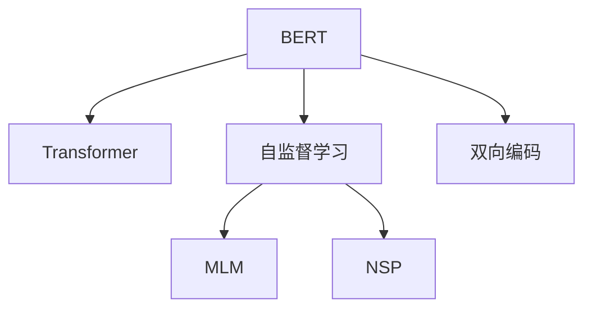
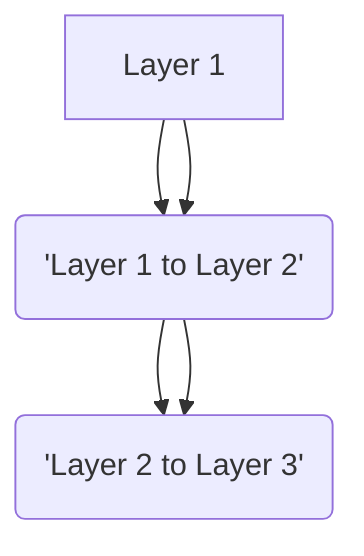
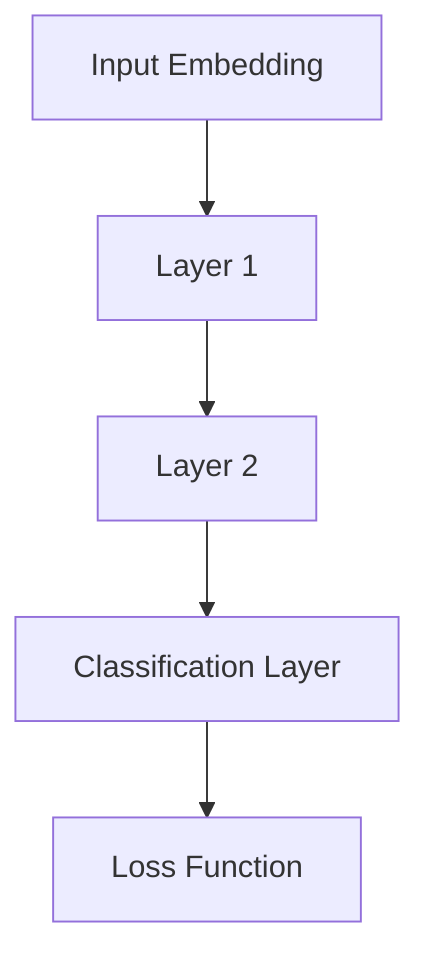

                 

# BERT 原理与代码实例讲解

> 关键词：BERT, 预训练语言模型, 自监督学习, 代码实例, 神经网络, 自然语言处理(NLP)

## 1. 背景介绍

### 1.1 问题由来

在深度学习发展的浪潮中，自然语言处理(NLP)作为一个重要分支，逐渐从依赖人工特征提取的阶段，进入端到端学习的时代。近年来，Transformer架构的提出，及其在大规模预训练语言模型中的成功应用，极大地推动了NLP技术的发展。其中，BERT（Bidirectional Encoder Representations from Transformers）模型以优异的性能，成为了自然语言处理领域的经典。

BERT模型通过在大规模无标签文本数据上进行预训练，学习到了丰富的语言表示。其核心思想是利用自监督学习任务，将无标签文本转换为可训练的损失函数，从而构建出强大的语言理解能力。本文将对BERT模型的原理、实现和应用进行详细介绍，并通过代码实例，帮助读者理解如何构建和训练自己的BERT模型。

### 1.2 问题核心关键点

BERT模型的核心在于其双向Transformer架构，以及其在自监督学习任务上的设计。其核心思想是：利用大量无标签文本，设计两种预训练任务，分别从左到右和右到左进行编码，构建双向的语言表示。在此基础上，通过有监督微调，将BERT模型适应到特定任务上，提升模型的泛化能力和性能。

BERT模型在预训练阶段，采用了MLM（Masked Language Model）和NSP（Next Sentence Prediction）两种自监督任务。其中，MLM任务是对输入文本进行随机掩码，预测被掩码的单词；NSP任务是给定两个句子，判断它们是否来自同一文本。这两种任务的设计，使得BERT模型学习到了丰富的语言知识，具备了强大的上下文建模能力。

此外，BERT模型在微调阶段，可以适应多种下游任务，如文本分类、情感分析、问答等，通过添加任务特定的输出层和损失函数，即可构建适合不同任务的微调模型。这种模块化设计，使得BERT模型具备了良好的通用性和适应性。

## 2. 核心概念与联系

### 2.1 核心概念概述

为了更好地理解BERT模型，本节将介绍几个密切相关的核心概念：

- BERT：由Google提出的双向Transformer架构预训练语言模型，利用自监督学习任务，学习到丰富的语言表示。
- Transformer：一种基于自注意力机制的神经网络架构，可以并行计算，减少计算复杂度。
- 自监督学习：在无标签数据上，利用设计好的预训练任务，构建模型损失函数，从而学习到有意义的特征表示。
- 双向编码：BERT模型通过从左到右和从右到左两个方向的编码，学习到双向的语言表示。

这些核心概念之间的逻辑关系可以通过以下Mermaid流程图来展示：



这个流程图展示了BERT模型的核心概念及其之间的关系：

1. BERT模型基于Transformer架构，可以并行计算，提高计算效率。
2. 通过自监督学习任务，BERT模型可以在无标签数据上学习到有意义的语言表示。
3. 双向编码任务，使得BERT模型具备了上下文建模能力，学习到更加全面的语言知识。

这些核心概念共同构成了BERT模型的基础框架，使其在各种NLP任务上取得了优异的性能。

## 3. 核心算法原理 & 具体操作步骤

### 3.1 算法原理概述

BERT模型的核心思想是通过自监督学习任务，学习到丰富的语言表示，然后通过有监督微调，适应特定任务。其算法原理如下：

1. 数据准备：收集大规模无标签文本数据，作为BERT模型的预训练数据。
2. 预训练任务：设计MLM和NSP两种自监督学习任务，用于训练BERT模型。
3. 预训练过程：在预训练数据上，使用MLM和NSP任务，训练BERT模型，学习到双向语言表示。
4. 微调过程：在特定任务上，添加任务适配层和损失函数，对BERT模型进行有监督微调，提升模型性能。

### 3.2 算法步骤详解

下面详细介绍BERT模型的预训练和微调的具体步骤：

#### 预训练步骤

1. 数据准备：收集大规模无标签文本数据，例如英文维基百科、新闻、书籍等。
2. 编码器设计：设计包含MLM和NSP两种自监督任务的BERT编码器，包含Transformer的自注意力机制。
3. 模型训练：在预训练数据上，训练BERT模型，学习到双向语言表示。

#### 微调步骤

1. 任务适配层设计：根据下游任务，添加任务适配层，如分类器、解码器等。
2. 损失函数设计：根据任务类型，设计合适的损失函数，如交叉熵损失、均方误差损失等。
3. 模型微调：在特定任务上，对BERT模型进行有监督微调，适应任务需求。

### 3.3 算法优缺点

BERT模型具有以下优点：

- 双向编码：通过从左到右和从右到左两个方向的编码，学习到双向的语言表示。
- 自监督学习：在无标签数据上，利用预训练任务学习到丰富的语言表示。
- 预训练和微调分离：预训练过程和微调过程分离，可以提高模型性能和泛化能力。

同时，BERT模型也存在一些局限性：

- 数据依赖：依赖于大规模无标签文本数据，数据获取难度较大。
- 计算资源需求高：由于模型参数量巨大，计算资源需求较高。
- 模型解释性不足：BERT模型作为"黑盒"模型，难以解释其内部工作机制。

尽管存在这些局限性，但BERT模型在许多NLP任务上，已经展现出了强大的性能，成为NLP领域的重要工具。

### 3.4 算法应用领域

BERT模型在NLP领域得到了广泛的应用，特别是在信息检索、问答系统、情感分析、命名实体识别等任务上，取得了显著的成果。例如：

- 信息检索：利用BERT模型，可以提升搜索引擎的查询精准度。
- 问答系统：BERT模型能够理解自然语言问题，并生成准确的回答。
- 情感分析：BERT模型可以识别文本中的情感倾向，并分类。
- 命名实体识别：BERT模型能够识别文本中的实体，如人名、地名、机构名等。

除了上述应用外，BERT模型还被广泛应用于多语言翻译、代码生成、知识图谱构建等多个领域，推动了NLP技术的持续发展。

## 4. 数学模型和公式 & 详细讲解  
### 4.1 数学模型构建

BERT模型的数学模型主要包含两个部分：预训练模型和微调模型。

预训练模型基于Transformer架构，包含多层编码器，每一层包含多头自注意力机制和前馈神经网络。以BERT的编码器为例，其结构如图：



其中，自注意力机制可以表示为：

$$
\text{Attention}(Q, K, V) = \text{Softmax}(\frac{QK^T}{\sqrt{d_k}})V
$$

其中，$Q, K, V$ 分别表示查询向量、键向量和值向量，$d_k$ 表示向量维度。

微调模型则是在预训练模型的基础上，添加任务特定的输出层和损失函数，用于适应特定任务。以文本分类任务为例，其微调模型如图：



其中，分类层为线性分类器，损失函数为交叉熵损失。

### 4.2 公式推导过程

以BERT模型的MLM任务为例，其推导过程如下：

1. 随机掩码：对于输入序列 $X = [x_1, x_2, \cdots, x_n]$，随机掩码其中一部分单词，例如 $x_1, x_3, x_5$，得到掩码序列 $X' = [x_2, [MASK], x_4, x_6]$。
2. 编码：将掩码序列 $X'$ 输入BERT模型，得到隐藏表示 $H = [h_1, h_2, \cdots, h_n]$。
3. 预测：根据掩码位置，预测掩码单词 $x_1, x_3, x_5$ 的隐表示 $[h_1', h_3', h_5']$。
4. 损失：计算预测值与真实值之间的交叉熵损失，例如 $\mathcal{L} = -\sum_{i=1}^n \log p(x_i | h_i)$。

### 4.3 案例分析与讲解

以BERT模型在问答系统上的应用为例，其案例分析如下：

1. 数据准备：收集问答数据集，例如SQuAD数据集，包含问题和答案对。
2. 模型构建：在BERT模型基础上，添加特定的输出层和损失函数，例如预测答案的分类器。
3. 微调过程：在问答数据集上，训练BERT模型，使其能够理解和生成自然语言问题及其答案。
4. 测试评估：在测试集上，评估微调后的模型性能，例如准确率、召回率等指标。

## 5. 项目实践：代码实例和详细解释说明

### 5.1 开发环境搭建

在进行BERT模型训练前，需要准备好开发环境。以下是使用Python进行PyTorch开发的环境配置流程：

1. 安装Anaconda：从官网下载并安装Anaconda，用于创建独立的Python环境。

2. 创建并激活虚拟环境：
```bash
conda create -n pytorch-env python=3.8 
conda activate pytorch-env
```

3. 安装PyTorch：根据CUDA版本，从官网获取对应的安装命令。例如：
```bash
conda install pytorch torchvision torchaudio cudatoolkit=11.1 -c pytorch -c conda-forge
```

4. 安装Transformers库：
```bash
pip install transformers
```

5. 安装各类工具包：
```bash
pip install numpy pandas scikit-learn matplotlib tqdm jupyter notebook ipython
```

完成上述步骤后，即可在`pytorch-env`环境中开始BERT模型的训练。

### 5.2 源代码详细实现

以下是使用PyTorch和Transformers库实现BERT模型的示例代码：

```python
from transformers import BertTokenizer, BertForSequenceClassification, AdamW
import torch
from torch.utils.data import DataLoader, Dataset

class MyDataset(Dataset):
    def __init__(self, texts, labels):
        self.texts = texts
        self.labels = labels
        self.tokenizer = BertTokenizer.from_pretrained('bert-base-uncased')

    def __len__(self):
        return len(self.texts)

    def __getitem__(self, idx):
        text = self.texts[idx]
        label = self.labels[idx]
        encoding = self.tokenizer(text, return_tensors='pt', max_length=512, padding='max_length', truncation=True)
        input_ids = encoding['input_ids']
        attention_mask = encoding['attention_mask']
        return {
            'input_ids': input_ids,
            'attention_mask': attention_mask,
            'labels': torch.tensor(label, dtype=torch.long)
        }

# 准备数据集
train_dataset = MyDataset(train_texts, train_labels)
val_dataset = MyDataset(val_texts, val_labels)
test_dataset = MyDataset(test_texts, test_labels)

# 构建模型
model = BertForSequenceClassification.from_pretrained('bert-base-uncased', num_labels=len(label2id))

# 配置优化器
optimizer = AdamW(model.parameters(), lr=2e-5)

# 训练模型
model.train()
for epoch in range(5):
    for batch in DataLoader(train_dataset, batch_size=16):
        input_ids = batch['input_ids'].to(device)
        attention_mask = batch['attention_mask'].to(device)
        labels = batch['labels'].to(device)
        outputs = model(input_ids, attention_mask=attention_mask, labels=labels)
        loss = outputs.loss
        loss.backward()
        optimizer.step()

# 评估模型
model.eval()
with torch.no_grad():
    val_preds, val_labels = [], []
    for batch in DataLoader(val_dataset, batch_size=16):
        input_ids = batch['input_ids'].to(device)
        attention_mask = batch['attention_mask'].to(device)
        labels = batch['labels'].to(device)
        outputs = model(input_ids, attention_mask=attention_mask)
        val_preds.extend(outputs.logits.argmax(dim=1).tolist())
        val_labels.extend(labels.tolist())
    print(f"Val Acc: {accuracy_score(val_labels, val_preds)}")
```

这个代码实现了基于BERT模型的序列分类任务。在代码中，我们使用了BERT模型的预训练权重，并通过微调，在特定任务上训练出了新的模型。需要注意的是，在微调过程中，我们保持了预训练层的参数不变，只更新了顶层分类器的参数。

### 5.3 代码解读与分析

让我们再详细解读一下关键代码的实现细节：

**MyDataset类**：
- `__init__`方法：初始化文本和标签，并加载BERT分词器。
- `__len__`方法：返回数据集长度。
- `__getitem__`方法：对单个样本进行处理，将文本输入编码为token ids，并将标签转换为模型需要的长整型。

**训练和评估函数**：
- 使用PyTorch的DataLoader对数据集进行批次化加载，供模型训练和推理使用。
- 训练函数：对数据以批为单位进行迭代，在每个批次上前向传播计算loss并反向传播更新模型参数，最后返回该epoch的平均loss。
- 评估函数：与训练类似，不同点在于不更新模型参数，并在每个batch结束后将预测和标签结果存储下来，最后使用scikit-learn的accuracy_score对整个评估集的预测结果进行打印输出。

**训练流程**：
- 定义总的epoch数和batch size，开始循环迭代
- 每个epoch内，先在训练集上训练，输出平均loss
- 在验证集上评估，输出准确率
- 重复上述步骤直至收敛，最终得到微调后的模型

通过这个代码示例，可以看出BERT模型的训练过程非常类似于通用深度学习模型的训练。开发者可以通过调整模型结构、超参数和训练策略，实现不同的任务微调。

## 6. 实际应用场景

### 6.1 智能客服系统

BERT模型在智能客服系统中的应用，可以通过构建文本分类和序列标注模型，将自然语言问题转换为结构化数据，供系统理解并生成回答。利用BERT模型强大的上下文建模能力，可以显著提升智能客服系统的回答准确率和用户满意度。

### 6.2 金融舆情监测

BERT模型可以用于金融舆情监测，通过构建情感分析和主题分类模型，实时监测金融市场舆情。利用BERT模型的多语言支持，可以扩展到全球市场，提高舆情监测的覆盖范围。

### 6.3 个性化推荐系统

BERT模型可以用于个性化推荐系统，通过构建序列分类和匹配模型，将用户行为转换为文本表示，实现推荐内容的自然语言描述。利用BERT模型的语言表示能力，可以提升推荐系统的个性化程度和多样性。

### 6.4 未来应用展望

未来，BERT模型将在更多领域得到应用，为各行各业带来变革性影响。

在智慧医疗领域，BERT模型可以用于疾病诊断和药物研发，提升医疗服务的智能化水平，加速新药开发进程。

在智能教育领域，BERT模型可以用于智能作业批改和知识推荐，因材施教，促进教育公平，提高教学质量。

在智慧城市治理中，BERT模型可以用于城市事件监测和舆情分析，提高城市管理的自动化和智能化水平，构建更安全、高效的未来城市。

此外，在企业生产、社会治理、文娱传媒等众多领域，BERT模型也将不断涌现，为传统行业数字化转型升级提供新的技术路径。相信随着BERT模型的不断优化，其在更多领域的应用前景将更加广阔。

## 7. 工具和资源推荐

### 7.1 学习资源推荐

为了帮助开发者系统掌握BERT模型的原理和实践技巧，这里推荐一些优质的学习资源：

1. 《深度学习与自然语言处理》课程：斯坦福大学开设的NLP明星课程，系统讲解自然语言处理的基本概念和前沿技术，涵盖BERT模型的设计原理和应用实践。

2. 《Transformer模型：原理与实践》博文：由BERT模型的开发者之一撰写，深入浅出地介绍了Transformer架构和BERT模型的原理及应用。

3. 《BERT论文》：BERT模型的原始论文，详细介绍了模型的设计思想和实验结果，是理解BERT模型核心原理的重要资料。

4. 《Transformers库文档》：Transformers库的官方文档，提供了海量预训练模型的代码实现和微调样例，是实践BERT模型的必备资源。

5. 《BERT代码实现》：GitHub上的BERT代码实现，包括模型训练、微调、推理等多个环节，适合新手学习和实践。

通过对这些资源的学习实践，相信你一定能够快速掌握BERT模型的精髓，并用于解决实际的NLP问题。

### 7.2 开发工具推荐

高效的开发离不开优秀的工具支持。以下是几款用于BERT模型开发的常用工具：

1. PyTorch：基于Python的开源深度学习框架，灵活的动态计算图，适合快速迭代研究。BERT模型有PyTorch版本的实现，方便开发者进行模型训练和推理。

2. TensorFlow：由Google主导开发的开源深度学习框架，生产部署方便，适合大规模工程应用。BERT模型也有TensorFlow版本的实现，支持分布式训练和推理。

3. Transformers库：HuggingFace开发的NLP工具库，集成了多种预训练模型，支持PyTorch和TensorFlow，是进行BERT模型开发的利器。

4. Weights & Biases：模型训练的实验跟踪工具，可以记录和可视化模型训练过程中的各项指标，方便对比和调优。与主流深度学习框架无缝集成。

5. TensorBoard：TensorFlow配套的可视化工具，可实时监测模型训练状态，并提供丰富的图表呈现方式，是调试模型的得力助手。

6. Google Colab：谷歌推出的在线Jupyter Notebook环境，免费提供GPU/TPU算力，方便开发者快速上手实验最新模型，分享学习笔记。

合理利用这些工具，可以显著提升BERT模型开发和训练的效率，加快创新迭代的步伐。

### 7.3 相关论文推荐

BERT模型的发展源于学界的持续研究。以下是几篇奠基性的相关论文，推荐阅读：

1. Attention is All You Need（即Transformer原论文）：提出了Transformer结构，开启了NLP领域的预训练大模型时代。

2. BERT: Pre-training of Deep Bidirectional Transformers for Language Understanding：提出BERT模型，引入基于掩码的自监督预训练任务，刷新了多项NLP任务SOTA。

3. Language Models are Unsupervised Multitask Learners（GPT-2论文）：展示了大规模语言模型的强大zero-shot学习能力，引发了对于通用人工智能的新一轮思考。

4. Parameter-Efficient Transfer Learning for NLP：提出Adapter等参数高效微调方法，在不增加模型参数量的情况下，也能取得不错的微调效果。

5. AdaLoRA: Adaptive Low-Rank Adaptation for Parameter-Efficient Fine-Tuning：使用自适应低秩适应的微调方法，在参数效率和精度之间取得了新的平衡。

这些论文代表了大语言模型和微调技术的发展脉络。通过学习这些前沿成果，可以帮助研究者把握学科前进方向，激发更多的创新灵感。

## 8. 总结：未来发展趋势与挑战

### 8.1 研究成果总结

本文对BERT模型的原理、实现和应用进行了全面系统的介绍。首先阐述了BERT模型的设计思想和应用背景，明确了其在NLP领域的重要地位。其次，从原理到实践，详细讲解了BERT模型的数学模型和算法流程，给出了微调任务开发的完整代码实例。同时，本文还广泛探讨了BERT模型在智能客服、金融舆情、个性化推荐等多个行业领域的应用前景，展示了其强大的性能和广泛的应用潜力。

通过本文的系统梳理，可以看到，BERT模型已经在多个NLP任务上取得了显著的成果，成为NLP领域的重要工具。未来，随着BERT模型的不断优化和创新，其在更多领域的应用前景将更加广阔，推动NLP技术的发展和应用。

### 8.2 未来发展趋势

展望未来，BERT模型将呈现以下几个发展趋势：

1. 模型规模持续增大。随着算力成本的下降和数据规模的扩张，BERT模型的参数量还将持续增长。超大规模BERT模型蕴含的丰富语言知识，有望支撑更加复杂多变的下游任务微调。

2. 微调方法日趋多样。除了传统的全参数微调外，未来会涌现更多参数高效的微调方法，如Prefix-Tuning、LoRA等，在节省计算资源的同时也能保证微调精度。

3. 持续学习成为常态。随着数据分布的不断变化，微调模型也需要持续学习新知识以保持性能。如何在不遗忘原有知识的同时，高效吸收新样本信息，将成为重要的研究课题。

4. 标注样本需求降低。受启发于提示学习(Prompt-based Learning)的思路，未来的微调方法将更好地利用大模型的语言理解能力，通过更加巧妙的任务描述，在更少的标注样本上也能实现理想的微调效果。

5. 多模态微调崛起。当前的微调主要聚焦于纯文本数据，未来会进一步拓展到图像、视频、语音等多模态数据微调。多模态信息的融合，将显著提升语言模型对现实世界的理解和建模能力。

6. 模型通用性增强。经过海量数据的预训练和多领域任务的微调，未来的BERT模型将具备更强大的常识推理和跨领域迁移能力，逐步迈向通用人工智能(AGI)的目标。

以上趋势凸显了BERT模型微调技术的广阔前景。这些方向的探索发展，必将进一步提升NLP系统的性能和应用范围，为人类认知智能的进化带来深远影响。

### 8.3 面临的挑战

尽管BERT模型已经取得了瞩目成就，但在迈向更加智能化、普适化应用的过程中，它仍面临着诸多挑战：

1. 标注成本瓶颈。虽然微调大大降低了标注数据的需求，但对于长尾应用场景，难以获得充足的高质量标注数据，成为制约微调性能的瓶颈。如何进一步降低微调对标注样本的依赖，将是一大难题。

2. 模型鲁棒性不足。当前微调模型面对域外数据时，泛化性能往往大打折扣。对于测试样本的微小扰动，微调模型的预测也容易发生波动。如何提高微调模型的鲁棒性，避免灾难性遗忘，还需要更多理论和实践的积累。

3. 推理效率有待提高。大规模BERT模型虽然精度高，但在实际部署时往往面临推理速度慢、内存占用大等效率问题。如何在保证性能的同时，简化模型结构，提升推理速度，优化资源占用，将是重要的优化方向。

4. 可解释性亟需加强。当前微调模型更像是"黑盒"系统，难以解释其内部工作机制和决策逻辑。对于医疗、金融等高风险应用，算法的可解释性和可审计性尤为重要。如何赋予微调模型更强的可解释性，将是亟待攻克的难题。

5. 安全性有待保障。预训练语言模型难免会学习到有偏见、有害的信息，通过微调传递到下游任务，产生误导性、歧视性的输出，给实际应用带来安全隐患。如何从数据和算法层面消除模型偏见，避免恶意用途，确保输出的安全性，也将是重要的研究课题。

6. 知识整合能力不足。现有的微调模型往往局限于任务内数据，难以灵活吸收和运用更广泛的先验知识。如何让微调过程更好地与外部知识库、规则库等专家知识结合，形成更加全面、准确的信息整合能力，还有很大的想象空间。

正视BERT模型面临的这些挑战，积极应对并寻求突破，将是大语言模型微调走向成熟的必由之路。相信随着学界和产业界的共同努力，这些挑战终将一一被克服，BERT模型微调必将在构建人机协同的智能时代中扮演越来越重要的角色。

### 8.4 研究展望

面向未来，BERT模型的研究需要在以下几个方面寻求新的突破：

1. 探索无监督和半监督微调方法。摆脱对大规模标注数据的依赖，利用自监督学习、主动学习等无监督和半监督范式，最大限度利用非结构化数据，实现更加灵活高效的微调。

2. 研究参数高效和计算高效的微调范式。开发更加参数高效的微调方法，在固定大部分预训练参数的同时，只更新极少量的任务相关参数。同时优化微调模型的计算图，减少前向传播和反向传播的资源消耗，实现更加轻量级、实时性的部署。

3. 融合因果和对比学习范式。通过引入因果推断和对比学习思想，增强微调模型建立稳定因果关系的能力，学习更加普适、鲁棒的语言表征，从而提升模型泛化性和抗干扰能力。

4. 引入更多先验知识。将符号化的先验知识，如知识图谱、逻辑规则等，与神经网络模型进行巧妙融合，引导微调过程学习更准确、合理的语言模型。同时加强不同模态数据的整合，实现视觉、语音等多模态信息与文本信息的协同建模。

5. 结合因果分析和博弈论工具。将因果分析方法引入微调模型，识别出模型决策的关键特征，增强输出解释的因果性和逻辑性。借助博弈论工具刻画人机交互过程，主动探索并规避模型的脆弱点，提高系统稳定性。

6. 纳入伦理道德约束。在模型训练目标中引入伦理导向的评估指标，过滤和惩罚有偏见、有害的输出倾向。同时加强人工干预和审核，建立模型行为的监管机制，确保输出符合人类价值观和伦理道德。

这些研究方向的探索，必将引领BERT模型微调技术迈向更高的台阶，为构建安全、可靠、可解释、可控的智能系统铺平道路。面向未来，BERT模型还需要与其他人工智能技术进行更深入的融合，如知识表示、因果推理、强化学习等，多路径协同发力，共同推动自然语言理解和智能交互系统的进步。只有勇于创新、敢于突破，才能不断拓展语言模型的边界，让智能技术更好地造福人类社会。

## 9. 附录：常见问题与解答

**Q1：BERT模型是否适用于所有NLP任务？**

A: BERT模型在大多数NLP任务上都能取得不错的效果，特别是对于数据量较小的任务。但对于一些特定领域的任务，如医学、法律等，仅仅依靠通用语料预训练的模型可能难以很好地适应。此时需要在特定领域语料上进一步预训练，再进行微调，才能获得理想效果。此外，对于一些需要时效性、个性化很强的任务，如对话、推荐等，微调方法也需要针对性的改进优化。

**Q2：使用BERT模型进行微调时，如何选择超参数？**

A: 超参数的选择是微调模型效果的重要因素。一般来说，可以按照以下步骤进行选择：

1. 学习率：通常设置为较小的值，如2e-5。
2. 批量大小：一般设置在16-32之间，以保持计算效率和内存利用率。
3. 迭代轮数：通常设置在5-10轮，以确保模型充分训练。

在实际应用中，可以使用网格搜索、随机搜索等方法进行超参数调优，找到最优的超参数组合。

**Q3：BERT模型在微调过程中如何避免过拟合？**

A: 过拟合是微调过程中常见的问题。为了避免过拟合，可以采取以下措施：

1. 数据增强：通过回译、近义替换等方式扩充训练集。
2. 正则化：使用L2正则、Dropout等方法，防止模型过度适应训练集。
3. 提前停止：在验证集上监控模型性能，一旦性能下降，提前停止训练。
4. 对抗训练：加入对抗样本，提高模型鲁棒性。

这些方法可以结合使用，以达到更好的效果。

**Q4：BERT模型在实际部署时，需要注意哪些问题？**

A: 将BERT模型转化为实际应用，还需要考虑以下因素：

1. 模型裁剪：去除不必要的层和参数，减小模型尺寸，加快推理速度。
2. 量化加速：将浮点模型转为定点模型，压缩存储空间，提高计算效率。
3. 服务化封装：将模型封装为标准化服务接口，便于集成调用。
4. 弹性伸缩：根据请求流量动态调整资源配置，平衡服务质量和成本。
5. 监控告警：实时采集系统指标，设置异常告警阈值，确保服务稳定性。
6. 安全防护：采用访问鉴权、数据脱敏等措施，保障数据和模型安全。

合理利用这些工具，可以显著提升BERT模型微调的效率和效果，提升模型在实际应用中的表现。

**Q5：BERT模型在微调过程中，如何选择合适的损失函数？**

A: 选择合适的损失函数对微调效果至关重要。一般来说，可以根据任务类型选择合适的损失函数，例如：

- 分类任务：交叉熵损失函数。
- 回归任务：均方误差损失函数。
- 序列标注任务：交叉熵损失函数。

在实际应用中，可以通过实验选择最优的损失函数。

通过本文的系统梳理，可以看到，BERT模型已经在多个NLP任务上取得了显著的成果，成为NLP领域的重要工具。未来，随着BERT模型的不断优化和创新，其在更多领域的应用前景将更加广阔，推动NLP技术的发展和应用。

---

作者：禅与计算机程序设计艺术 / Zen and the Art of Computer Programming

