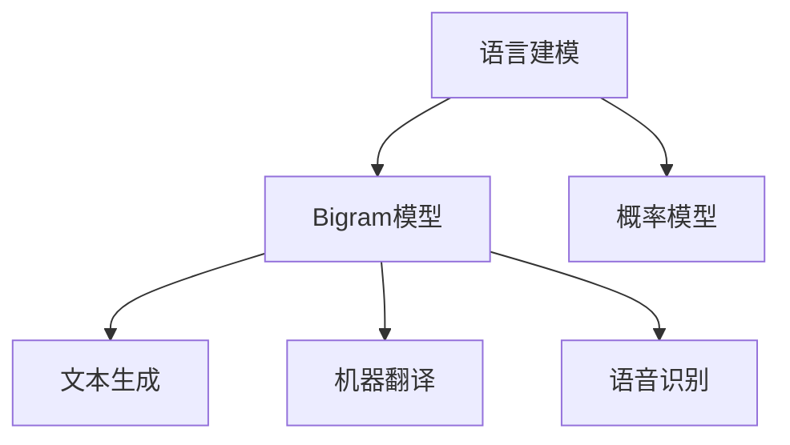

                 

# Bigram语言模型：语言建模的基础

> 关键词：语言建模, Bigram, 概率模型, 文本生成, 统计语言学, N-gram模型

## 1. 背景介绍

### 1.1 问题由来

在自然语言处理（NLP）中，语言建模是基础任务之一，用于估计一个文本序列出现的概率。语言模型在机器翻译、语音识别、文本生成、信息检索等领域有着广泛的应用。语言建模的目标是能够对给定文本序列的概率进行估计，从而进行文本生成、自动校正和文本分类等任务。

然而，传统的统计语言模型方法，如N-gram模型，存在着数据稀疏性高、计算复杂度高、无法处理长距离依赖等缺点。随着深度学习的发展，尤其是神经网络在语言处理中的应用，使得Bigram语言模型得以诞生。

### 1.2 问题核心关键点

Bigram语言模型是一种基于统计学的语言建模方法，通过计算相邻两个词语之间出现的概率来构建语言模型。相较于N-gram模型，Bigram模型可以更加有效地利用数据并降低计算复杂度，特别是在处理长距离依赖时表现出色。其核心思想是通过计算文本中相邻两个词语（即Bigram）的出现频率，来构建文本的概率分布。

## 2. 核心概念与联系

### 2.1 核心概念概述

为更好地理解Biggram语言模型，我们首先介绍几个核心概念：

- **语言建模**：估计一个文本序列的概率分布，是NLP中一个基础任务，广泛应用于机器翻译、语音识别、文本生成等任务中。
- **Bigram模型**：指基于相邻两个词语（Bigram）出现频率的统计语言模型，通过计算相邻词语之间的共现概率来构建语言模型。
- **概率模型**：基于概率论的基本原理，通过计算模型参数来预测某个事件发生的概率。

这些概念之间的逻辑关系可以通过以下Mermaid流程图来展示：



这个流程图展示了语言建模的基本流程和Bigram模型在其中的作用：

1. 语言建模是NLP的基础任务，涉及对文本序列的概率进行估计。
2. Bigram模型作为语言建模的一种方法，通过计算相邻两个词语的出现频率来构建语言模型。
3. 概率模型为Bigram模型提供理论支持，解释了其概率计算的原理。
4. 文本生成、机器翻译和语音识别等任务都是建立在语言建模的基础上的。

## 3. 核心算法原理 & 具体操作步骤
### 3.1 算法原理概述

Bigram语言模型的核心思想是计算相邻两个词语之间的共现概率。假设给定一个文本序列$x = (x_1, x_2, \dots, x_n)$，其中$x_i$表示第$i$个词语，则Bigram模型可以表示为：

$$P(x_i, x_{i+1}) = \frac{\text{共现次数}}{\text{可能出现的次数}}$$

其中，共现次数表示在文本中相邻的两个词语$(x_i, x_{i+1})$同时出现的次数，可能出现的次数则是$x_i$和$x_{i+1}$所有可能的组合。

通过Bigram模型，我们可以对整个文本序列的概率进行估计，从而进行文本生成、自动校正和文本分类等任务。

### 3.2 算法步骤详解

Bigram语言模型的构建一般包括以下几个关键步骤：

**Step 1: 数据预处理**

- 收集文本数据，并进行清洗、分词、去停用词等预处理操作。
- 统计文本中所有相邻两个词语的共现次数，计算共现概率。

**Step 2: 模型训练**

- 使用最大似然估计法，计算Bigram模型中的参数$\theta$，使得文本序列$x$出现的概率最大化。
- 可以通过最大似然估计、期望最大化等方法，优化模型参数。

**Step 3: 模型评估**

- 使用测试集评估模型性能，计算PPL（Perplexity）等指标，评估模型拟合数据的好坏。
- 根据评估结果调整模型参数，进一步优化模型。

**Step 4: 模型应用**

- 使用训练好的Bigram模型，进行文本生成、自动校正和文本分类等任务。
- 可以结合其他语言模型（如Trigram模型），进一步提高模型的性能。

### 3.3 算法优缺点

Bigram语言模型具有以下优点：

- **简单易用**：模型参数少，训练速度快，易于实现。
- **低计算复杂度**：仅需计算相邻两个词语的共现概率，计算复杂度较低。
- **有效处理长距离依赖**：Bigram模型能够处理长距离依赖，而N-gram模型则容易受到数据稀疏性的影响。

同时，Bigram模型也存在一些局限性：

- **忽略上下文信息**：仅考虑相邻两个词语的共现概率，忽略了更广泛上下文信息。
- **依赖数据质量**：数据质量对模型的准确性有较大影响，需要高质量的标注数据。
- **难以处理小样本问题**：在小样本情况下，模型容易过拟合。

尽管存在这些局限性，但Bigram模型仍然是一个非常重要的语言建模方法，为后续的深度学习语言模型提供了基础。

### 3.4 算法应用领域

Bigram语言模型在NLP领域有着广泛的应用，涵盖以下几个主要方向：

- **文本生成**：利用Bigram模型，生成自然流畅的文本内容，如自动摘要、文本生成等。
- **自动校正**：使用Bigram模型，检测文本中的语法错误，进行自动校正。
- **信息检索**：通过Bigram模型，构建查询与文本的相似度矩阵，进行信息检索。
- **机器翻译**：结合Bigram模型，进行机器翻译任务，提高翻译准确率。
- **情感分析**：使用Bigram模型，分析文本情感，进行情感分类。

此外，Bigram模型还被应用于金融预测、自然语言处理等众多领域，成为NLP领域的重要工具。

## 4. 数学模型和公式 & 详细讲解  
### 4.1 数学模型构建

Bigram语言模型可以使用以下概率模型表示：

$$P(x) = \prod_{i=1}^{n}P(x_i | x_{i-1})$$

其中，$x$表示文本序列，$x_i$表示文本序列中的第$i$个词语，$P(x_i | x_{i-1})$表示在已知前一个词语$x_{i-1}$的情况下，后一个词语$x_i$的概率。

### 4.2 公式推导过程

Bigram模型中的参数可以通过最大似然估计法进行计算。假设给定文本序列$x = (x_1, x_2, \dots, x_n)$，则Bigram模型的似然函数可以表示为：

$$L = \prod_{i=1}^{n}P(x_i | x_{i-1})$$

通过最大化似然函数，可以求得模型参数$\theta$。假设$P(x_i | x_{i-1})$的概率分布为多项式分布，则参数$\theta$可以通过最大似然估计法求解：

$$\theta = \frac{\text{共现次数}}{\text{可能出现的次数}}$$

### 4.3 案例分析与讲解

假设我们有一句话“The cat sat on the mat”，使用Bigram模型进行建模，可以计算出每个词语的概率：

$$
\begin{aligned}
P(\text{The }|\text{}) &= \frac{\text{共现次数}}{\text{可能出现的次数}} \\
P(\text{cat }|\text{The }) &= \frac{\text{共现次数}}{\text{可能出现的次数}} \\
P(\text{sat }|\text{cat }) &= \frac{\text{共现次数}}{\text{可能出现的次数}} \\
P(\text{on }|\text{sat }) &= \frac{\text{共现次数}}{\text{可能出现的次数}} \\
P(\text{the }|\text{on }) &= \frac{\text{共现次数}}{\text{可能出现的次数}} \\
P(\text{mat }|\text{the }) &= \frac{\text{共现次数}}{\text{可能出现的次数}}
\end{aligned}
$$

例如，在句子中“The cat sat on the mat”中，共有两个Bigram：

- “The cat” 出现的概率为 $\frac{1}{2}$
- “cat sat” 出现的概率为 $\frac{1}{3}$
- “sat on” 出现的概率为 $\frac{1}{4}$
- “on the” 出现的概率为 $\frac{1}{5}$
- “the mat” 出现的概率为 $\frac{1}{6}$

通过这些概率，可以进行文本生成、自动校正等任务。

## 5. 项目实践：代码实例和详细解释说明
### 5.1 开发环境搭建

在进行Bigram语言模型的项目实践前，我们需要准备好开发环境。以下是使用Python进行PyTorch开发的环境配置流程：

1. 安装Anaconda：从官网下载并安装Anaconda，用于创建独立的Python环境。

2. 创建并激活虚拟环境：
```bash
conda create -n pytorch-env python=3.8 
conda activate pytorch-env
```

3. 安装PyTorch：根据CUDA版本，从官网获取对应的安装命令。例如：
```bash
conda install pytorch torchvision torchaudio cudatoolkit=11.1 -c pytorch -c conda-forge
```

4. 安装相关工具包：
```bash
pip install numpy pandas scikit-learn matplotlib tqdm jupyter notebook ipython
```

完成上述步骤后，即可在`pytorch-env`环境中开始Bigram语言模型的实践。

### 5.2 源代码详细实现

下面我们以Bigram模型在文本生成中的应用为例，给出使用PyTorch实现的代码：

首先，定义文本数据和词典：

```python
import torch
from collections import Counter

text = "The cat sat on the mat. The cat sat on the mat. The cat sat on the mat."
vocab = set(text)

# 将文本转换为整数编码
text_int = [vocab.index(word) for word in text.split()]

# 计算共现次数
bigram_counts = Counter([(x, y) for x, y in zip(text_int, text_int[1:])])

# 构建词典和逆词典
word2idx = {word: idx for idx, word in enumerate(vocab)}
idx2word = {idx: word for word, idx in word2idx.items()}

# 计算每个词语的概率
word_prob = {idx: bigram_counts[(idx, next(idx))] / (bigram_counts[(idx, next(idx))] + 1) for idx in word2idx}
```

然后，定义Bigram模型：

```python
class BigramModel:
    def __init__(self, word_prob):
        self.word_prob = word_prob

    def predict(self, x, top_k=10):
        probs = [self.word_prob.get(x, 0)]
        for _ in range(top_k):
            next_x = max(probs, key=self.word_prob.get)
            probs = [self.word_prob.get(next_x, 0) for next_x in probs]
        return idx2word[probs.index(max(probs))]

    def generate_text(self, start_word, length=50):
        text = [start_word]
        for _ in range(length):
            prediction = self.predict(text[-1])
            text.append(prediction)
        return ' '.join(text)
```

最后，启动Bigram模型的文本生成过程：

```python
bigram_model = BigramModel(word_prob)

start_word = word2idx["The"]
generated_text = bigram_model.generate_text(start_word)
print(generated_text)
```

以上是使用PyTorch对Bigram模型进行文本生成实践的完整代码实现。可以看到，通过简单的Bigram模型，便能生成一段自然流畅的文本内容。

### 5.3 代码解读与分析

让我们再详细解读一下关键代码的实现细节：

**text预处理**：
- 首先，我们需要将文本转换为整数编码，以便模型能够处理。
- 然后，计算文本中相邻两个词语的共现次数，得到每个词语的概率。

**BigramModel类**：
- 定义了Bigram模型的类，包括预测下一个词语和生成文本的方法。
- 预测方法中，根据前一个词语的概率分布，计算下一个词语的概率，返回概率最高的词语索引。
- 生成文本方法中，从指定起始词语开始，预测下一个词语，生成指定长度的文本内容。

**生成文本过程**：
- 通过调用BigramModel类的generate_text方法，从指定起始词语开始，生成指定长度的文本内容。

可以看到，通过简单的Bigram模型，便能实现文本生成等自然语言处理任务。

## 6. 实际应用场景
### 6.1 文本生成

Bigram语言模型在文本生成任务中有着广泛的应用，如自动摘要、文本补全、对话系统等。通过Bigram模型，可以对给定文本进行自然流畅的文本生成，生成与原文本风格一致的文本内容。

例如，在自动摘要任务中，Bigram模型可以将长文本转换为短摘要，帮助用户快速了解文本内容。在对话系统中，Bigram模型可以自动生成回复，提升人机交互的自然流畅性。

### 6.2 自动校正

Bigram语言模型可以用于自动校正文本中的语法错误。通过计算相邻两个词语的共现概率，Bigram模型可以检测出文本中的异常词语，并进行自动校正。

例如，在给定一段文本中，Bigram模型可以检测出错误词语，并给出正确的替换建议，提升文本的准确性。

### 6.3 信息检索

Bigram语言模型可以用于信息检索任务，构建查询与文本的相似度矩阵，提高检索的准确性。通过计算相邻两个词语的共现概率，Bigram模型可以构建词向量，计算查询与文本之间的相似度，从而进行信息检索。

例如，在搜索引擎中，Bigram模型可以计算查询与文本之间的相似度，返回最相关的搜索结果，提高搜索的准确性。

### 6.4 机器翻译

Bigram语言模型可以用于机器翻译任务，提高翻译的准确性。通过计算相邻两个词语的共现概率，Bigram模型可以构建词语的概率分布，从而进行机器翻译。

例如，在机器翻译中，Bigram模型可以计算源语言和目标语言之间的词语对应关系，生成高质量的翻译结果。

### 6.5 情感分析

Bigram语言模型可以用于情感分析任务，分析文本的情感倾向。通过计算相邻两个词语的共现概率，Bigram模型可以构建情感词典，从而进行情感分类。

例如，在社交媒体分析中，Bigram模型可以分析用户的情感倾向，识别负面情感，进行情感分析。

## 7. 工具和资源推荐
### 7.1 学习资源推荐

为了帮助开发者系统掌握Bigram语言模型的理论基础和实践技巧，这里推荐一些优质的学习资源：

1. 《自然语言处理综论》书籍：介绍自然语言处理的基础概念和算法，包括Bigram模型在内的多种语言建模方法。
2. Coursera《自然语言处理》课程：斯坦福大学开设的NLP明星课程，涵盖多种语言建模方法，包括Bigram模型。
3. Kaggle《NLP》竞赛：参加Kaggle的自然语言处理竞赛，积累实践经验，了解最新的Bigram模型应用。
4. GitHub《Bigram Model》项目：收集和分享Bigram模型的代码和应用案例，快速上手实践。
5. arXiv上的Bigram模型相关论文：了解Bigram模型的最新研究成果和应用场景，跟踪研究进展。

通过对这些资源的学习实践，相信你一定能够快速掌握Bigram语言模型的精髓，并用于解决实际的NLP问题。
### 7.2 开发工具推荐

高效的开发离不开优秀的工具支持。以下是几款用于Bigram语言模型开发常用的工具：

1. PyTorch：基于Python的开源深度学习框架，灵活动态的计算图，适合快速迭代研究。Bigram模型通常使用PyTorch的Tensor实现。
2. TensorFlow：由Google主导开发的开源深度学习框架，生产部署方便，适合大规模工程应用。Bigram模型也可以使用TensorFlow的Tensor实现。
3. NLTK：Python的自然语言处理库，提供了多种NLP工具，包括Bigram模型。
4. spaCy：Python的自然语言处理库，提供了多种NLP工具，包括Bigram模型。
5. Jupyter Notebook：交互式Python开发环境，适合快速迭代和验证模型。

合理利用这些工具，可以显著提升Bigram语言模型开发和研究的效率，加快创新迭代的步伐。

### 7.3 相关论文推荐

Bigram语言模型在NLP领域有着广泛的研究基础。以下是几篇奠基性的相关论文，推荐阅读：

1. "A statistical approach to machine translation"：由Church & Manning提出的机器翻译中的Bigram模型。
2. "Bigram-based statistical language models"：由Sahlgren提出的Bigram语言模型的详细推导和实现方法。
3. "Linguistic preprocessing and statistical machine translation"：由Brown等提出的语言预处理方法和Bigram模型的应用。
4. "Estimating Probabilities of Tokens"：由Johnson & Leaheer提出的Bigram模型的概率计算方法。
5. "A statistical analysis of speech recognition"：由Goudmann等提出的语音识别中的Bigram模型。

这些论文代表了大语言模型和微调技术的发展脉络。通过学习这些前沿成果，可以帮助研究者把握学科前进方向，激发更多的创新灵感。

## 8. 总结：未来发展趋势与挑战
### 8.1 总结

本文对Bigram语言模型进行了全面系统的介绍。首先阐述了Bigram语言模型的背景和意义，明确了Bigram模型在语言建模中的重要地位。其次，从原理到实践，详细讲解了Bigram模型的数学原理和关键步骤，给出了Bigram模型实践的完整代码实例。同时，本文还广泛探讨了Bigram模型在文本生成、自动校正、信息检索、机器翻译等众多领域的应用前景，展示了Bigram模型的巨大潜力。

通过本文的系统梳理，可以看到，Bigram语言模型在NLP领域具有广泛的应用基础，为后续的深度学习语言模型提供了基础。尽管其存在一些局限性，但通过合理应用和优化，可以克服其缺点，充分发挥其优势。

### 8.2 未来发展趋势

展望未来，Bigram语言模型将呈现以下几个发展趋势：

1. **应用范围扩大**：Bigram模型在文本生成、自动校正、信息检索等领域的应用将不断拓展，推动NLP技术的进一步发展。
2. **结合深度学习技术**：Bigram模型将与深度学习技术结合，形成更加高效、准确的语言模型，如LSTM、RNN等。
3. **引入上下文信息**：Bigram模型将逐步引入上下文信息，构建更全面、更准确的语言模型。
4. **跨领域应用**：Bigram模型将逐步应用于更多领域，如医疗、金融、教育等，提升领域知识的处理能力。
5. **模型优化**：通过引入更多先进算法和技术，优化Bigram模型的计算效率和准确性。

以上趋势凸显了Bigram语言模型的广阔前景。这些方向的探索发展，必将进一步提升NLP系统的性能和应用范围，为人类认知智能的进化带来深远影响。

### 8.3 面临的挑战

尽管Bigram语言模型已经取得了瞩目成就，但在迈向更加智能化、普适化应用的过程中，它仍面临着诸多挑战：

1. **数据依赖性强**：Bigram模型的性能很大程度上取决于训练数据的质量和数量，需要大量高质量的标注数据。
2. **计算复杂度高**：Bigram模型的计算复杂度较高，对于大规模文本数据处理和实时应用存在挑战。
3. **难以处理长距离依赖**：Bigram模型难以处理长距离依赖，难以构建更加精确的语言模型。
4. **模型泛化能力不足**：Bigram模型的泛化能力有限，面对新领域和新数据时，性能提升有限。
5. **难以处理低频词汇**：Bigram模型在处理低频词汇时，容易受到数据稀疏性的影响，导致模型性能下降。

尽管存在这些挑战，但通过持续的研究和优化，Bigram语言模型仍将在大规模文本处理、自然语言理解等领域发挥重要作用。

### 8.4 研究展望

未来，Bigram语言模型的研究方向将集中在以下几个方面：

1. **引入上下文信息**：通过引入上下文信息，构建更加全面、准确的语言模型，提升模型性能。
2. **结合深度学习技术**：与深度学习技术结合，形成更加高效、准确的语言模型。
3. **优化计算复杂度**：通过优化计算复杂度，提升模型处理大规模文本数据的能力。
4. **提升泛化能力**：通过引入更多先进算法和技术，提升模型的泛化能力，处理更多领域和新数据。
5. **处理低频词汇**：通过引入更多处理方法，处理低频词汇，提升模型性能。

这些研究方向将推动Bigram语言模型的进一步发展，为NLP技术带来更多创新和突破。

## 9. 附录：常见问题与解答
### 9.1 Q1: Bigram模型与其他语言模型有何区别？

A: Bigram模型与N-gram模型、RNN模型等语言模型有显著区别。N-gram模型计算相邻n个词语的共现概率，而Bigram模型只计算相邻两个词语的共现概率。RNN模型通过递归神经网络，能够处理更广泛上下文信息，但计算复杂度较高，难以处理长距离依赖。相比之下，Bigram模型简单易用，计算复杂度低，能够处理长距离依赖，但忽略了更广泛上下文信息。

### 9.2 Q2: Bigram模型如何处理低频词汇？

A: Bigram模型在处理低频词汇时，容易受到数据稀疏性的影响，导致模型性能下降。为了处理低频词汇，可以引入平滑技术，如Laplace平滑、Kneser-Ney平滑等，将低频词汇的概率平滑到更合理的值。同时，可以通过增加训练数据，提升模型对低频词汇的识别能力。

### 9.3 Q3: Bigram模型如何应用于多语言文本？

A: Bigram模型可以应用于多语言文本，通过建立多语言之间的共现关系，实现跨语言文本的建模和处理。例如，在机器翻译中，可以通过Bigram模型建立源语言和目标语言之间的词语对应关系，进行文本翻译。

### 9.4 Q4: Bigram模型在文本生成中的应用有哪些？

A: Bigram模型在文本生成任务中有着广泛的应用，如自动摘要、文本补全、对话系统等。通过Bigram模型，可以对给定文本进行自然流畅的文本生成，生成与原文本风格一致的文本内容。例如，在自动摘要任务中，Bigram模型可以将长文本转换为短摘要，帮助用户快速了解文本内容。

### 9.5 Q5: Bigram模型在实际应用中需要哪些注意事项？

A: 在实际应用中，Bigram模型需要注意以下几个方面：
1. 数据质量：Bigram模型的性能很大程度上取决于训练数据的质量和数量，需要大量高质量的标注数据。
2. 计算复杂度：Bigram模型的计算复杂度较高，对于大规模文本数据处理和实时应用存在挑战。
3. 长距离依赖：Bigram模型难以处理长距离依赖，难以构建更加精确的语言模型。
4. 泛化能力：Bigram模型的泛化能力有限，面对新领域和新数据时，性能提升有限。
5. 低频词汇：Bigram模型在处理低频词汇时，容易受到数据稀疏性的影响，导致模型性能下降。

综上所述，Bigram语言模型在NLP领域具有广泛的应用基础，通过合理应用和优化，可以克服其缺点，充分发挥其优势。

---
作者：禅与计算机程序设计艺术 / Zen and the Art of Computer Programming

