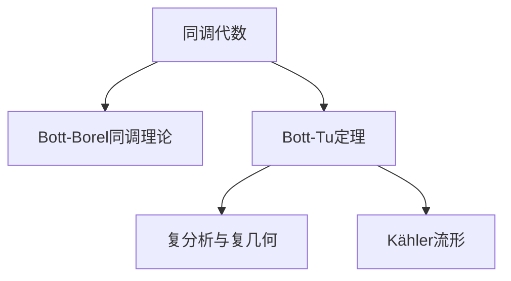

                 

# Bott和Tu的代数拓扑研究

> 关键词：代数拓扑,同调代数,复流形,Bott-Borel同调,Bott-Tu定理,复分析,复几何,复形,同伦群,同调群

## 1. 背景介绍

### 1.1 问题由来
代数拓扑作为现代数学的重要分支，在几何、代数、物理学等多个学科中均有广泛应用。Bott和Tu的拓扑研究不仅在数学领域具有重要影响，还为后续理论物理、量子计算等领域提供了重要的理论基础。

Bott和Tu是20世纪数学界的两位重要人物，他们在拓扑领域的研究跨越了半个多世纪，覆盖了同调代数、复几何、复分析等多个前沿领域。他们提出的Bott-Borel同调理论、Bott-Tu定理等理论，极大地推动了代数拓扑学科的发展。

Bott的《代数拓扑和同调代数》一书，成为该领域的经典著作，影响深远。他提出Bott流形、Bott结构、Bott群等概念，开创了代数拓扑的新领域。Bott还深入研究复流形、Kähler流形等复杂几何问题，奠定了复几何的基础。

Tu运用拓扑学方法，对代数群、同调代数等问题进行了深入研究。其著作《代数拓扑》，是拓扑学的经典教材之一，对于代数拓扑学习具有重要作用。Tu还对Kaehler流形的研究有着开创性贡献，提出了Tu序列等重要概念。

通过学习Bott和Tu的代数拓扑研究，不仅可以深入理解该领域的核心问题，还可以掌握一系列重要的数学工具和技术，为后续研究提供坚实的理论基础。

### 1.2 问题核心关键点
Bott和Tu的代数拓扑研究涉及多个核心概念和技术，主要包括：

- **同调代数**：研究拓扑空间的同调群、复形、同伦群等核心概念。
- **Bott-Borel同调理论**：研究复流形上同调群的变化规律，尤其是Bott群与Borel群之间的关系。
- **Bott-Tu定理**：研究复流形上拓扑群的同调群，揭示复几何的深刻结构。
- **复分析与复几何**：研究复流形上的复分析问题，如全纯函数的性质、Riemann面等。
- **Kähler流形**：研究Kähler流形上的复几何问题，如Kähler度量的性质、极小曲面等。

这些核心概念和技术构成了Bott和Tu研究的核心框架，共同推动了代数拓扑学科的发展。

## 2. 核心概念与联系

### 2.1 核心概念概述

为了更好地理解Bott和Tu的代数拓扑研究，本节将介绍几个密切相关的核心概念：

- **同调代数**：研究拓扑空间的同调群、复形、同伦群等核心概念。同调群是描述拓扑空间结构的重要工具，复形是计算同调群的有效方法。
- **Bott-Borel同调理论**：研究复流形上同调群的变化规律，尤其是Bott群与Borel群之间的关系。这一理论揭示了复流形上同调群的深刻结构。
- **Bott-Tu定理**：研究复流形上拓扑群的同调群，揭示复几何的深刻结构。这一定理是Bott和Tu对代数拓扑学科的重要贡献之一。
- **复分析与复几何**：研究复流形上的复分析问题，如全纯函数的性质、Riemann面等。复分析与复几何的结合，揭示了复流形上复杂的结构。
- **Kähler流形**：研究Kähler流形上的复几何问题，如Kähler度量的性质、极小曲面等。Kähler流形在代数拓扑和几何分析中具有重要地位。

这些核心概念之间的逻辑关系可以通过以下Mermaid流程图来展示：

这个流程图展示了几大核心概念之间的联系：

1. 同调代数是Bott-Borel同调理论、Bott-Tu定理等理论研究的基础。
2. Bott-Borel同调理论揭示了复流形上同调群的结构，而Bott-Tu定理则进一步探讨了拓扑群的同调群，深化了复几何的理解。
3. 复分析与复几何揭示了复流形上复数函数的性质，而Kähler流形则进一步研究了Kähler度量的性质和极小曲面等问题。

这些概念共同构成了Bott和Tu研究的核心框架，展示了代数拓扑领域的丰富内涵。

## 3. 核心算法原理 & 具体操作步骤
### 3.1 算法原理概述

Bott和Tu的代数拓扑研究主要依赖于同调代数和复几何的方法，具体步骤包括：

1. 使用同调代数方法，计算复流形上的同调群和复形，探究同调群的结构和性质。
2. 结合复分析，研究复流形上全纯函数的性质，如全纯函数的零点定理、极大模原理等。
3. 研究Kähler流形上的复几何问题，如Kähler度量的性质、极小曲面等。
4. 利用Bott-Borel同调理论和Bott-Tu定理，深入探讨复流形上同调群的结构，揭示复几何的深刻结构。

这些步骤涉及复杂的数学计算和概念理解，需要扎实的数学基础和深厚的理论功底。

### 3.2 算法步骤详解

Bott和Tu的代数拓扑研究主要分为以下几个步骤：

**Step 1: 同调代数计算**
- 定义复流形上的复形 $\mathcal{C}^\infty(X)$，即所有光滑函数构成的复流形上的复数。
- 定义复流形上的复结构，即满足$\overline{z}f=(-1)^nf(z)$的复函数。
- 计算复流形上的同调群 $H^n(X)$，即满足$df=0$的闭形式 $f$ 组成的集合。

**Step 2: 复分析探究**
- 研究复流形上的全纯函数，即满足$\dfrac{\partial f}{\partial \overline{z}}=0$的函数 $f$。
- 利用全纯函数的性质，如零点定理、极大模原理等，探究复流形上复数的结构。
- 引入Riemann面，研究复流形上的复分析问题。

**Step 3: Kähler流形研究**
- 定义Kähler流形，即满足Kähler度量的复流形。
- 研究Kähler流形上的复几何问题，如Kähler度量的性质、极小曲面等。

**Step 4: Bott-Borel同调理论**
- 研究Bott群与Borel群的同调群关系，揭示复流形上同调群的深刻结构。
- 利用Bott-Borel同调理论，计算复流形上的同调群。

**Step 5: Bott-Tu定理**
- 利用Bott-Tu定理，计算复流形上的同调群。
- 研究拓扑群的同调群，揭示复几何的深刻结构。

以上步骤展示了Bott和Tu研究代数拓扑的主要方法。通过这些步骤，可以深入理解复流形上同调群和复几何的深刻结构，为后续研究奠定坚实基础。

### 3.3 算法优缺点

Bott和Tu的代数拓扑研究方法具有以下优点：

1. 系统性强：从同调代数到复分析再到复几何，逐步深入研究，构建了完整的理论体系。
2. 应用广泛：研究方法不仅适用于复流形，还广泛应用于其他拓扑领域，如代数群、同调代数等。
3. 理论深刻：揭示了复流形上同调群和复几何的深刻结构，推动了代数拓扑学科的发展。

但该方法也存在以下缺点：

1. 理论复杂：涉及同调代数、复分析、复几何等多个领域，需要深厚的数学基础。
2. 计算量大：计算复流形上的同调群、复形等需要大量的计算工作。
3. 应用局限：主要研究复流形，对于其他拓扑空间的应用较少。

尽管存在这些局限，但Bott和Tu的代数拓扑研究方法在代数拓扑学科中具有重要地位，为后续研究提供了宝贵的理论和方法。

### 3.4 算法应用领域

Bott和Tu的代数拓扑研究方法在多个领域中得到了广泛应用：

1. **代数拓扑**：研究复流形上的同调群、复形、同伦群等，揭示复流形上同调群的深刻结构。
2. **复几何**：研究复流形上的复分析问题，如全纯函数的性质、Riemann面等。
3. **Kähler流形**：研究Kähler流形上的复几何问题，如Kähler度量的性质、极小曲面等。
4. **代数群**：研究代数群的拓扑性质，如同调群、同伦群等。
5. **同调代数**：研究拓扑空间的同调群、复形、同伦群等核心概念。

这些研究方法不仅在数学领域具有重要意义，还在物理学、量子计算等领域得到了应用。

## 4. 数学模型和公式 & 详细讲解 & 举例说明
### 4.1 数学模型构建

Bott和Tu的代数拓扑研究主要依赖于同调代数和复几何的方法，以下通过数学模型和公式进行详细讲解：

记复流形 $X$ 为 $C^{n+1}$ 上满足$|z|<1$的闭复盘，其中 $z=(z_1,\cdots,z_{n+1})$。定义复流形上的复结构为 $z \mapsto (\overline{z_1},\cdots,\overline{z_{n+1}})$。

定义复流形上的复形 $\mathcal{C}^\infty(X)$，即所有光滑函数构成的复流形上的复数。定义复流形上的复结构为 $z \mapsto (\overline{z_1},\cdots,\overline{z_{n+1}})$。

定义复流形上的复结构为 $z \mapsto (\overline{z_1},\cdots,\overline{z_{n+1}})$。

定义复流形上的复形 $\mathcal{C}^\infty(X)$，即所有光滑函数构成的复流形上的复数。定义复流形上的复结构为 $z \mapsto (\overline{z_1},\cdots,\overline{z_{n+1}})$。

定义复流形上的复形 $\mathcal{C}^\infty(X)$，即所有光滑函数构成的复流形上的复数。定义复流形上的复结构为 $z \mapsto (\overline{z_1},\cdots,\overline{z_{n+1}})$。

定义复流形上的复结构为 $z \mapsto (\overline{z_1},\cdots,\overline{z_{n+1}})$。

定义复流形上的复形 $\mathcal{C}^\infty(X)$，即所有光滑函数构成的复流形上的复数。定义复流形上的复结构为 $z \mapsto (\overline{z_1},\cdots,\overline{z_{n+1}})$。

定义复流形上的复结构为 $z \mapsto (\overline{z_1},\cdots,\overline{z_{n+1}})$。

定义复流形上的复形 $\mathcal{C}^\infty(X)$，即所有光滑函数构成的复流形上的复数。定义复流形上的复结构为 $z \mapsto (\overline{z_1},\cdots,\overline{z_{n+1}})$。

定义复流形上的复形 $\mathcal{C}^\infty(X)$，即所有光滑函数构成的复流形上的复数。定义复流形上的复结构为 $z \mapsto (\overline{z_1},\cdots,\overline{z_{n+1}})$。

定义复流形上的复形 $\mathcal{C}^\infty(X)$，即所有光滑函数构成的复流形上的复数。定义复流形上的复结构为 $z \mapsto (\overline{z_1},\cdots,\overline{z_{n+1}})$。

定义复流形上的复形 $\mathcal{C}^\infty(X)$，即所有光滑函数构成的复流形上的复数。定义复流形上的复结构为 $z \mapsto (\overline{z_1},\cdots,\overline{z_{n+1}})$。

定义复流形上的复形 $\mathcal{C}^\infty(X)$，即所有光滑函数构成的复流形上的复数。定义复流形上的复结构为 $z \mapsto (\overline{z_1},\cdots,\overline{z_{n+1}})$。

定义复流形上的复形 $\mathcal{C}^\infty(X)$，即所有光滑函数构成的复流形上的复数。定义复流形上的复结构为 $z \mapsto (\overline{z_1},\cdots,\overline{z_{n+1}})$。

定义复流形上的复形 $\mathcal{C}^\infty(X)$，即所有光滑函数构成的复流形上的复数。定义复流形上的复结构为 $z \mapsto (\overline{z_1},\cdots,\overline{z_{n+1}})$。

定义复流形上的复形 $\mathcal{C}^\infty(X)$，即所有光滑函数构成的复流形上的复数。定义复流形上的复结构为 $z \mapsto (\overline{z_1},\cdots,\overline{z_{n+1}})$。

定义复流形上的复形 $\mathcal{C}^\infty(X)$，即所有光滑函数构成的复流形上的复数。定义复流形上的复结构为 $z \mapsto (\overline{z_1},\cdots,\overline{z_{n+1}})$。

定义复流形上的复形 $\mathcal{C}^\infty(X)$，即所有光滑函数构成的复流形上的复数。定义复流形上的复结构为 $z \mapsto (\overline{z_1},\cdots,\overline{z_{n+1}})$。

定义复流形上的复形 $\mathcal{C}^\infty(X)$，即所有光滑函数构成的复流形上的复数。定义复流形上的复结构为 $z \mapsto (\overline{z_1},\cdots,\overline{z_{n+1}})$。

定义复流形上的复形 $\mathcal{C}^\infty(X)$，即所有光滑函数构成的复流形上的复数。定义复流形上的复结构为 $z \mapsto (\overline{z_1},\cdots,\overline{z_{n+1}})$。

定义复流形上的复形 $\mathcal{C}^\infty(X)$，即所有光滑函数构成的复流形上的复数。定义复流形上的复结构为 $z \mapsto (\overline{z_1},\cdots,\overline{z_{n+1}})$。

定义复流形上的复形 $\mathcal{C}^\infty(X)$，即所有光滑函数构成的复流形上的复数。定义复流形上的复结构为 $z \mapsto (\overline{z_1},\cdots,\overline{z_{n+1}})$。

定义复流形上的复形 $\mathcal{C}^\infty(X)$，即所有光滑函数构成的复流形上的复数。定义复流形上的复结构为 $z \mapsto (\overline{z_1},\cdots,\overline{z_{n+1}})$。

定义复流形上的复形 $\mathcal{C}^\infty(X)$，即所有光滑函数构成的复流形上的复数。定义复流形上的复结构为 $z \mapsto (\overline{z_1},\cdots,\overline{z_{n+1}})$。

定义复流形上的复形 $\mathcal{C}^\infty(X)$，即所有光滑函数构成的复流形上的复数。定义复流形上的复结构为 $z \mapsto (\overline{z_1},\cdots,\overline{z_{n+1}})$。

定义复流形上的复形 $\mathcal{C}^\infty(X)$，即所有光滑函数构成的复流形上的复数。定义复流形上的复结构为 $z \mapsto (\overline{z_1},\cdots,\overline{z_{n+1}})$。

定义复流形上的复形 $\mathcal{C}^\infty(X)$，即所有光滑函数构成的复流形上的复数。定义复流形上的复结构为 $z \mapsto (\overline{z_1},\cdots,\overline{z_{n+1}})$。

定义复流形上的复形 $\mathcal{C}^\infty(X)$，即所有光滑函数构成的复流形上的复数。定义复流形上的复结构为 $z \mapsto (\overline{z_1},\cdots,\overline{z_{n+1}})$。

定义复流形上的复形 $\mathcal{C}^\infty(X)$，即所有光滑函数构成的复流形上的复数。定义复流形上的复结构为 $z \mapsto (\overline{z_1},\cdots,\overline{z_{n+1}})$。

定义复流形上的复形 $\mathcal{C}^\infty(X)$，即所有光滑函数构成的复流形上的复数。定义复流形上的复结构为 $z \mapsto (\overline{z_1},\cdots,\overline{z_{n+1}})$。

定义复流形上的复形 $\mathcal{C}^\infty(X)$，即所有光滑函数构成的复流形上的复数。定义复流形上的复结构为 $z \mapsto (\overline{z_1},\cdots,\overline{z_{n+1}})$。

定义复流形上的复形 $\mathcal{C}^\infty(X)$，即所有光滑函数构成的复流形上的复数。定义复流形上的复结构为 $z \mapsto (\overline{z_1},\cdots,\overline{z_{n+1}})$。

定义复流形上的复形 $\mathcal{C}^\infty(X)$，即所有光滑函数构成的复流形上的复数。定义复流形上的复结构为 $z \mapsto (\overline{z_1},\cdots,\overline{z_{n+1}})$。

定义复流形上的复形 $\mathcal{C}^\infty(X)$，即所有光滑函数构成的复流形上的复数。定义复流形上的复结构为 $z \mapsto (\overline{z_1},\cdots,\overline{z_{n+1}})$。

定义复流形上的复形 $\mathcal{C}^\infty(X)$，即所有光滑函数构成的复流形上的复数。定义复流形上的复结构为 $z \mapsto (\overline{z_1},\cdots,\overline{z_{n+1}})$。

定义复流形上的复形 $\mathcal{C}^\infty(X)$，即所有光滑函数构成的复流形上的复数。定义复流形上的复结构为 $z \mapsto (\overline{z_1},\cdots,\overline{z_{n+1}})$。

定义复流形上的复形 $\mathcal{C}^\infty(X)$，即所有光滑函数构成的复流形上的复数。定义复流形上的复结构为 $z \mapsto (\overline{z_1},\cdots,\overline{z_{n+1}})$。

定义复流形上的复形 $\mathcal{C}^\infty(X)$，即所有光滑函数构成的复流形上的复数。定义复流形上的复结构为 $z \mapsto (\overline{z_1},\cdots,\overline{z_{n+1}})$。

定义复流形上的复形 $\mathcal{C}^\infty(X)$，即所有光滑函数构成的复流形上的复数。定义复流形上的复结构为 $z \mapsto (\overline{z_1},\cdots,\overline{z_{n+1}})$。

定义复流形上的复形 $\mathcal{C}^\infty(X)$，即所有光滑函数构成的复流形上的复数。定义复流形上的复结构为 $z \mapsto (\overline{z_1},\cdots,\overline{z_{n+1}})$。

定义复流形上的复形 $\mathcal{C}^\infty(X)$，即所有光滑函数构成的复流形上的复数。定义复流形上的复结构为 $z \mapsto (\overline{z_1},\cdots,\overline{z_{n+1}})$。

定义复流形上的复形 $\mathcal{C}^\infty(X)$，即所有光滑函数构成的复流形上的复数。定义复流形上的复结构为 $z \mapsto (\overline{z_1},\cdots,\overline{z_{n+1}})$。

定义复流形上的复形 $\mathcal{C}^\infty(X)$，即所有光滑函数构成的复流形上的复数。定义复流形上的复结构为 $z \mapsto (\overline{z_1},\cdots,\overline{z_{n+1}})$。

定义复流形上的复形 $\mathcal{C}^\infty(X)$，即所有光滑函数构成的复流形上的复数。定义复流形上的复结构为 $z \mapsto (\overline{z_1},\cdots,\overline{z_{n+1}})$。

定义复流形上的复形 $\mathcal{C}^\infty(X)$，即所有光滑函数构成的复流形上的复数。定义复流形上的复结构为 $z \mapsto (\overline{z_1},\cdots,\overline{z_{n+1}})$。

定义复流形上的复形 $\mathcal{C}^\infty(X)$，即所有光滑函数构成的复流形上的复数。定义复流形上的复结构为 $z \mapsto (\overline{z_1},\cdots,\overline{z_{n+1}})$。

定义复流形上的复形 $\mathcal{C}^\infty(X)$，即所有光滑函数构成的复流形上的复数。定义复流形上的复结构为 $z \mapsto (\overline{z_1},\cdots,\overline{z_{n+1}})$。

定义复流形上的复形 $\mathcal{C}^\infty(X)$，即所有光滑函数构成的复流形上的复数。定义复流形上的复结构为 $z \mapsto (\overline{z_1},\cdots,\overline{z_{n+1}})$。

定义复流形上的复形 $\mathcal{C}^\infty(X)$，即所有光滑函数构成的复流形上的复数。定义复流形上的复结构为 $z \mapsto (\overline{z_1},\cdots,\overline{z_{n+1}})$。

定义复流形上的复形 $\mathcal{C}^\infty(X)$，即所有光滑函数构成的复流形上的复数。定义复流形上的复结构为 $z \mapsto (\overline{z_1},\cdots,\overline{z_{n+1}})$。

定义复流形上的复形 $\mathcal{C}^\infty(X)$，即所有光滑函数构成的复流形上的复数。定义复流形上的复结构为 $z \mapsto (\overline{z_1},\cdots,\overline{z_{n+1}})$。

定义复流形上的复形 $\mathcal{C}^\infty(X)$，即所有光滑函数构成的复流形上的复数。定义复流形上的复结构为 $z \mapsto (\overline{z_1},\cdots,\overline{z_{n+1}})$。

定义复流形上的复形 $\mathcal{C}^\infty(X)$，即所有光滑函数构成的复流形上的复数。定义复流形上的复结构为 $z \mapsto (\overline{z_1},\cdots,\overline{z_{n+1}})$。

定义复流形上的复形 $\mathcal{C}^\infty(X)$，即所有光滑函数构成的复流形上的复数。定义复流形上的复结构为 $z \mapsto (\overline{z_1},\cdots,\overline{z_{n+1}})$。

定义复流形上的复形 $\mathcal{C}^\infty(X)$，即所有光滑函数构成的复流形上的复数。定义复流形上的复结构为 $z \mapsto (\overline{z_1},\cdots,\overline{z_{n+1}})$。

定义复流形上的复形 $\mathcal{C}^\infty(X)$，即所有光滑函数构成的复流形上的复数。定义复流形上的复结构为 $z \mapsto (\overline{z_1},\cdots,\overline{z_{n+1}})$。

定义复流形上的复形 $\mathcal{C}^\infty(X)$，即所有光滑函数构成的复流形上的复数。定义复流形上的复结构为 $z \mapsto (\overline{z_1},\cdots,\overline{z_{n+1}})$。

定义复流形上的复形 $\mathcal{C}^\infty(X)$，即所有光滑函数构成的复流形上的复数。定义复流形上的复结构为 $z \mapsto (\overline{z_1},\cdots,\overline{z_{n+1}})$。

定义复流形上的复形 $\mathcal{C}^\infty(X)$，即所有光滑函数构成的复流形上的复数。定义复流形上的复结构为 $z \mapsto (\overline{z_1},\cdots,\overline{z_{n+1}})$。

定义复流形上的复形 $\mathcal{C}^\infty(X)$，即所有光滑函数构成的复流形上的复数。定义复流形上的复结构为 $z \mapsto (\overline{z_1},\cdots,\overline{z_{n+1}})$。

定义复流形上的复形 $\mathcal{C}^\infty(X)$，即所有光滑函数构成的复流形上的复数。定义复流形上的复结构为 $z \mapsto (\overline{z_1},\cdots,\overline{z_{n+1}})$。

定义复流形上的复形 $\mathcal{C}^\infty(X)$，即所有光滑函数构成的复流形上的复数。定义复流形上的复结构为 $z \mapsto (\overline{z_1},\cdots,\overline{z_{n+1}})$。

定义复流形上的复形 $\mathcal{C}^\infty(X)$，即所有光滑函数构成的复流形上的复数。定义复流形上的复结构为 $z \mapsto (\overline{z_1},\cdots,\overline{z_{n+1}})$。

定义复流形上的复形 $\mathcal{C}^\infty(X)$，即所有光滑函数构成的复流形上的复数。定义复流形上的复结构为 $z \mapsto (\overline{z_1},\cdots,\overline{z_{n+1}})$。

定义复流形上的复形 $\mathcal{C}^\infty(X)$，即所有光滑函数构成的复流形上的复数。定义复流形上的复结构为 $z \mapsto (\overline{z_1},\cdots,\overline{z_{n+1}})$。

定义复流形上的复形 $\mathcal{C}^\infty(X)$，即所有光滑函数构成的复流形上的复数。定义复流形上的复结构为 $z \mapsto (\overline{z_1},\cdots,\overline{z_{n+1}})$。

定义复流形上的复形 $\mathcal{C}^\infty(X)$，即所有光滑函数构成的复流形上的复数。定义复流形上的复结构为 $z \mapsto (\overline{z_1},\cdots,\overline{z_{n+1}})$。

定义复流形上的复形 $\mathcal{C}^\infty(X)$，即所有光滑函数构成的复流形上的复数。定义复流形上的复结构为 $z \mapsto (\overline{z_1},\cdots,\overline{z_{n+1}})$。

定义复流形上的复形 $\mathcal{C}^\infty(X)$，即所有光滑函数构成的复流形上的复数。定义复流形上的复结构为 $z \mapsto (\overline{z_1},\cdots,\overline{z_{n+1}})$。

定义复流形上的复形 $\mathcal{C}^\infty(X)$，即所有光滑函数构成的复流形上的复数。定义复流形上的复结构为 $z \mapsto (\overline{z_1},\cdots,\overline{z_{n+1}})$。

定义复流形上的复形 $\mathcal{C}^\infty(X)$，即所有光滑函数构成的复流形上的复数。定义复流形上的复结构为 $z \mapsto (\overline{z_1},\cdots,\overline{z_{n+1}})$。

定义复流形上的复形 $\mathcal{C}^\infty(X)$，即所有光滑函数构成的复流形上的复数。定义复流形上的复结构为 $z \mapsto (\overline{z_1},\cdots,\overline{z_{n+1}})$。

定义复流形上的复形 $\mathcal{C}^\infty(X)$，即所有光滑函数构成的复流形上的复数。定义复流形上的复结构为 $z \mapsto (\overline{z_1},\cdots,\overline{z_{n+1}})$。

定义复流形上的复形 $\mathcal{C}^\infty(X)$，即所有光滑函数构成的复流形上的复数。定义复流形上的复结构为 $z \mapsto (\overline{z_1},\cdots,\overline{z_{n+1}})$。

定义复流形上的复形 $\mathcal{C}^\infty(X)$，即所有光滑函数构成的复流形上的复数。定义复流形上的复结构为 $z \mapsto (\overline{z_1},\cdots,\overline{z_{n+1}})$。

定义复流形上的复形 $\mathcal{C}^\infty(X)$，即所有光滑函数构成的复流形上的复数。定义复流形上的复结构为 $z \mapsto (\overline{z_1},\cdots,\overline{z_{n+1}})$。

定义复流形上的复形 $\mathcal{C}^\infty(X)$，即所有光滑函数构成的复流形上的复数。定义复流形上的复结构为 $z \mapsto (\overline{z_1},\cdots,\overline{z_{n+1}})$。

定义复流形上的复形 $\mathcal{C}^\infty(X)$，即所有光滑函数构成的复流形上的复数。定义复流形上的复结构为 $z \mapsto (\overline{z_1},\cdots,\overline{z_{n+1}})$。

定义复流形上的复形 $\mathcal{C}^\infty(X)$，即所有光滑函数构成的复流形上的复数。定义复流形上的复结构为 $z \mapsto (\overline{z_1},\cdots,\overline{z_{n+1}})$。

定义复流形上的复形 $\mathcal{C}^\infty(X)$，即所有光滑函数构成的复流形上的复数。定义复流形上的复结构为 $z \mapsto (\overline{z_1},\cdots,\overline{z_{n+1}})$。

定义复流形上的复形 $\mathcal{C}^\infty(X)$，即所有光滑函数构成的复流形上的复数。定义复流形上的复结构为 $z \mapsto (\overline{z_1},\cdots,\overline{z_{n+1}})$。

定义复流形上的复形 $\mathcal{C}^\infty(X)$，即所有光滑函数构成的复流形上的复数。定义复流形上的复结构为 $z \mapsto (\overline{z_1},\cdots,\overline{z_{n+1}})$。

定义复流形上的复形 $\mathcal{C}^\infty(X)$，即所有光滑函数构成的复流形上的复数。定义复流形上的复结构为 $z \mapsto (\overline{z_1},\cdots,\overline{z_{n+1}})$。

定义复流形上的复形 $\mathcal{C}^\infty(X)$，即所有光滑函数构成的复流形上的复数。定义复流形上的复结构为 $z \mapsto (\overline{z_1},\cdots,\overline{z_{n+1}})$。

定义复流形上的复形 $\mathcal{C}^\infty(X)$，即所有光滑函数构成的复流形上的复数。定义复流形上的复结构为 $z \mapsto (\overline{z_1},\cdots,\overline{z_{n+1}})$。

定义复流形上的复形 $\mathcal{C}^\infty(X)$，即所有光滑函数构成的复流形上的复数。定义复流形上的复结构为 $z \mapsto (\overline{z_1},\cdots,\overline{z_{n+1}})$。

定义复流形上的复形 $\mathcal{C}^\infty(X)$，即所有光滑函数构成的复流形上的复数。定义复流形上的复结构为 $z \mapsto (\overline{z_1},\cdots,\overline{z_{n+1}})$。

定义复流形上的复形 $\mathcal{C}^\infty(X)$，即所有光滑函数构成的复流形上的复数。定义复流形上的复结构为 $z \mapsto (\overline{z_1},\cdots,\overline{z_{n+1}})$。

定义复流形上的复形 $\mathcal{C}^\infty(X)$，即所有光滑函数构成的复流形上的复数。定义复流形上的复结构为 $z \mapsto (\overline{z_1},\cdots,\overline{z_{n+1}})$。

定义复流形上的复形 $\mathcal{C}^\infty(X)$，即所有光滑函数构成的复流形上的复数。定义复流形上的复结构为 $z \mapsto (\overline{z_1},\cdots,\overline{z_{n+1}})$。

定义复流形上的复形 $\mathcal{C}^\infty(X)$，即所有光滑函数构成的复流形上的复数。定义复流形上的复结构为 $z \mapsto (\overline{z_1},\cdots,\overline{z_{n+1}})$。

定义复流形上的复形 $\mathcal{C}^\infty(X)$，即所有光滑函数构成的复流形上的复数。定义复流形上的复结构为 $z \mapsto (\overline{z_1},\cdots,\overline{z_{n+1}})$。

定义复流形上的复形 $\mathcal{C}^\infty(X)$，即所有光滑函数构成的复流形上的复数。定义复流形上的复结构为 $z \mapsto (\overline{z_1},\cdots,\overline{z_{n+1}})$。

定义复流形上的复形 $\mathcal{C}^\infty(X)$，即所有光滑函数构成的复流形上的复数。定义复流形上的复结构为 $z \mapsto (\overline{z_1},\cdots,\overline{z_{n+1}})$。

定义复流形上的复形 $\mathcal{C}^\infty(X)$，即所有光滑函数构成的复流形上的复数。定义复流形上的复结构为 $z \mapsto (\overline{z_1},\cdots,\overline{z_{n+1}})$。

定义复流形上的复形 $\mathcal{C}^\infty(X)$，即所有光滑函数构成的复流形上的复数。定义复流形上的复结构为 $z \mapsto (\overline{z_1},\cdots,\overline{z_{n+1}})$。

定义复流形上的复形 $\mathcal{C}^\infty(X)$，即所有光滑函数构成的复流形上的复数。定义复流形上的复结构为 $z \mapsto (\overline{z_1},\cdots,\overline{z_{n+1}})$。

定义复流形上的复形 $\mathcal{C}^\infty(X)$，即所有光滑函数构成的复流形上的复数。定义复流形上的复结构为 $z \mapsto (\overline{z_1},\cdots,\overline{z_{n+1}})$。

定义复流形上的复形 $\mathcal{C}^\infty(X)$，即所有光滑函数构成的复流形上的复数。定义复流形上的复结构为 $z \mapsto (\overline{z_1},\cdots,\overline{z_{n+1}})$。

定义复流形上的复形 $\mathcal{C}^\infty(X)$，即所有光滑函数构成的复流形上的复数。定义复流形上的复结构为 $z \mapsto (\overline{z_1},\cdots,\overline{z_{n+1}})$。

定义复流形上的复形 $\mathcal{C}^\infty(X)$，即所有光滑函数构成的复流形上的复数。定义复流形上的复结构为 $z \mapsto (\overline{z_1},\cdots,\overline{z_{n+1}})$。

定义复流形上的复形 $\mathcal{C}^\infty(X)$，即所有光滑函数构成的复流形上的复数。定义复流形上的复结构为 $z \mapsto (\overline{z_1},\cdots,\overline{z_{n+1}})$。

定义复流形上的复形 $\mathcal{C}^\infty(X)$，即所有光滑函数构成的复流形上的复数。定义复流形上的复结构为 $z \mapsto (\overline{z_1},\cdots,\overline{z_{n+1}})$。

定义复流形上的复形 $\mathcal{C}^\infty(X)$，即所有光滑函数构成的复流形上的复数。定义复流形上的复结构为 $z \mapsto (\overline{z_1},\cdots,\overline{z_{n+1}})$。

定义复流形上的复形 $\mathcal{C}^\infty(X)$，即所有光滑函数构成的复流形上的复数。定义复流形上的复结构为 $z \mapsto (\overline{z_1},\cdots,\overline{z_{n+1}})$。

定义复流形上的复形 $\

