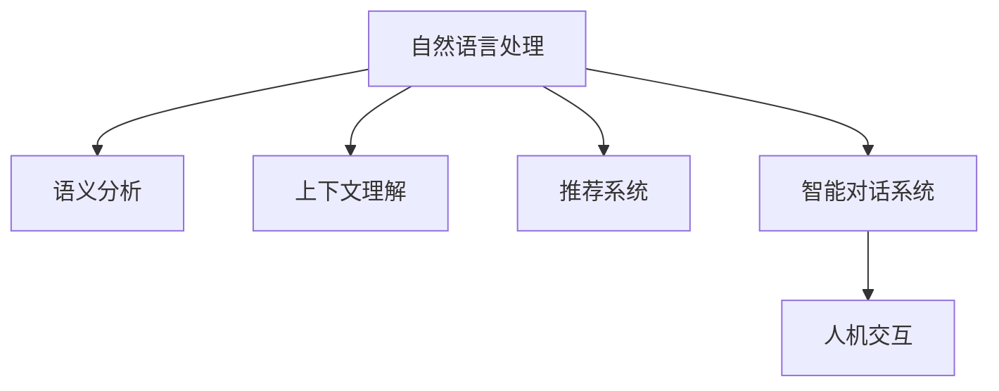

                 

# CUI中的内容与服务匹配详细技术解析

> 关键词：自然语言处理（NLP），内容与服务的匹配，语义分析，上下文理解，机器学习，深度学习，推荐系统，智能对话，人机交互

## 1. 背景介绍

### 1.1 问题由来
随着人工智能技术的不断进步，用户与计算机之间的交互方式已经从传统的基于文本和命令的方式，转向更加自然、人性化的语音、文字、图像等多种形式。用户希望通过与机器的自然对话，快速获取所需的服务和信息，提升效率和体验。然而，如何将自然语言文本与具体的服务和内容进行匹配，成为当下CUI（Computer User Interaction）领域的重要挑战。

### 1.2 问题核心关键点
为了实现自然语言与服务的匹配，需要解决以下几个核心问题：
- 如何准确理解用户的意图和需求？
- 如何将用户的查询与合适的服务或内容进行匹配？
- 如何提高匹配的准确性和响应速度？
- 如何构建高效的推荐系统，实现个性化服务？

### 1.3 问题研究意义
研究内容与服务匹配技术，对于提升CUI系统的智能化水平，优化用户体验，推动人工智能技术的广泛应用，具有重要意义：
- 提升服务匹配效率和准确性，加速用户问题解决。
- 构建更加个性化和人性化的智能对话系统。
- 促进自然语言处理和推荐系统技术的发展，推动人工智能在各行各业的落地应用。

## 2. 核心概念与联系

### 2.1 核心概念概述

为更好地理解内容与服务匹配技术，本节将介绍几个密切相关的核心概念：

- 自然语言处理（NLP）：研究计算机如何理解、处理和生成人类语言的技术。核心任务包括分词、词性标注、命名实体识别、语义分析、文本生成等。
- 语义分析：通过语义相似度计算、实体关系推理等方法，理解自然语言文本的深层语义信息。
- 上下文理解：分析文本的前后文关系，理解用户在特定场景下的意图。
- 推荐系统：利用机器学习或深度学习算法，根据用户历史行为、偏好等信息，推荐最合适的服务和内容。
- 智能对话系统：通过自然语言理解和生成技术，实现人机交互的智能化。
- 人机交互（HCI）：研究人与计算机之间的交互方式，提升用户体验和系统效率。

这些核心概念之间的逻辑关系可以通过以下Mermaid流程图来展示：



这个流程图展示了大语言模型的核心概念及其之间的关系：

1. 自然语言处理是整个技术的基础，通过分词、词性标注等任务，理解文本的表层结构。
2. 语义分析进一步深入文本的深层语义信息，理解用户意图和需求。
3. 上下文理解在特定场景下，综合前后文关系，更准确地捕捉用户意图。
4. 推荐系统根据用户历史行为和偏好，推荐合适的服务和内容。
5. 智能对话系统利用自然语言处理和推荐系统，实现人机交互的智能化。
6. 人机交互最终实现用户的交互体验，提升系统效率。

## 3. 核心算法原理 & 具体操作步骤

### 3.1 算法原理概述

内容与服务匹配技术，本质上是一个自然语言处理和推荐系统的综合应用。其核心思想是：通过自然语言处理技术理解用户输入，结合推荐系统进行服务匹配，最终提供合适的服务和内容。

形式化地，假设用户输入的自然语言文本为 $x$，目标服务集合为 $S$，内容集合为 $C$。目标是从 $S$ 和 $C$ 中找到最佳的匹配结果，使得模型输出 $y \in S \cup C$。

根据目标，常用的方法包括：
- 基于检索的匹配方法：先对文本进行语义编码，再通过检索算法从服务和服务描述中寻找最佳匹配。
- 基于机器学习的匹配方法：利用有监督或无监督学习算法，训练模型进行匹配预测。

### 3.2 算法步骤详解

基于检索的匹配方法包括以下关键步骤：

**Step 1: 预处理文本**
- 对用户输入的文本进行分词、去除停用词、词干提取等预处理。
- 利用预训练的语言模型（如BERT、GPT等），将文本编码成向量表示。

**Step 2: 检索匹配**
- 构建服务和服务描述的语义向量表示。
- 计算文本与服务和服务描述之间的语义相似度，采用余弦相似度、Jaccard相似度、点积相似度等方法。
- 根据相似度排序，选择最匹配的服务或内容。

**Step 3: 结果呈现**
- 根据匹配结果，推荐最合适的服务或内容。
- 利用上下文理解技术，结合用户历史行为和偏好，进一步提升推荐效果。

基于机器学习的匹配方法，主要包括：

**Step 1: 数据准备**
- 收集标注好的训练数据集，包含用户输入、服务名称、内容描述等。
- 利用自然语言处理技术，提取和编码输入文本的特征。

**Step 2: 模型训练**
- 使用监督学习算法（如SVM、随机森林、深度学习等）训练模型。
- 使用有监督的数据集进行训练，输出分类结果。

**Step 3: 结果预测**
- 利用训练好的模型，对用户输入进行预测，找出最匹配的服务或内容。
- 结合上下文理解，进一步优化匹配结果。

### 3.3 算法优缺点

基于检索的匹配方法具有以下优点：
- 快速高效，适用于实时匹配。
- 结果明确，不需要复杂的模型训练过程。
- 能够处理大规模数据集，适用于搜索推荐系统。

同时，该方法也存在以下局限性：
- 依赖标注数据，标注成本高。
- 检索结果依赖于语义模型和向量表示，质量受限于语义模型的精度。
- 难以捕捉用户意图的多样性和动态变化。

基于机器学习的匹配方法具有以下优点：
- 能够处理多样化的用户输入，捕捉用户意图的多样性和动态变化。
- 可以自适应地更新模型，适应新的数据和场景。
- 能够结合上下文信息，提供更加个性化的推荐。

同时，该方法也存在以下局限性：
- 需要大量标注数据进行模型训练，成本较高。
- 模型复杂度较高，训练和推理效率较低。
- 难以处理大规模数据集，需要优化算法效率。

### 3.4 算法应用领域

基于检索和机器学习的匹配技术，广泛应用于各种CUI系统，包括但不限于：

- 智能客服系统：自动匹配用户问题，提供快速解答。
- 智能搜索系统：利用语义相似度匹配用户查询，提供搜索结果。
- 个性化推荐系统：结合用户行为和偏好，推荐相关服务和内容。
- 智能问答系统：理解用户查询，生成精准回答。
- 智能家居系统：通过语音和文本交互，控制智能设备。
- 智能办公系统：理解办公需求，提供自动化办公支持。

这些应用场景的实际应用，展示了基于匹配技术的CUI系统在提升用户体验和效率方面的巨大潜力。随着技术的不断发展，未来基于匹配的CUI系统还将拓展到更多领域，为用户提供更智能、更便捷的交互体验。

## 4. 数学模型和公式 & 详细讲解 & 举例说明

### 4.1 数学模型构建

本节将使用数学语言对内容与服务匹配技术进行更加严格的刻画。

假设用户输入的自然语言文本为 $x$，服务集合为 $S=\{s_1, s_2, \dots, s_n\}$，内容集合为 $C=\{c_1, c_2, \dots, c_m\}$。目标是找到一个服务或内容 $y \in S \cup C$，使得其与 $x$ 的语义相似度最大化。

定义 $x$ 和 $y$ 的语义表示分别为 $x_v$ 和 $y_v$，其中 $v$ 表示向量维度。语义相似度函数 $\sim$ 通常采用余弦相似度，即 $\sim(x,y)=\cos(x_v,y_v)$。

内容与服务匹配的问题可以形式化为：
$$
\max_y \sim(x,y)
$$

### 4.2 公式推导过程

在上述数学模型中，语义相似度函数 $\sim$ 是匹配的关键。以下是余弦相似度公式的推导：

设 $x_v$ 和 $y_v$ 分别为用户输入和服务的向量表示，向量内积为 $\langle x_v,y_v \rangle$，向量的模长分别为 $||x_v||$ 和 $||y_v||$，则余弦相似度公式为：

$$
\sim(x,y) = \frac{\langle x_v,y_v \rangle}{||x_v|| \times ||y_v||}
$$

通过余弦相似度，模型能够根据输入文本与服务或内容的语义向量表示，计算出它们之间的相似度，从而进行匹配。

### 4.3 案例分析与讲解

以智能客服系统为例，分析内容与服务匹配的具体应用。

假设用户输入的文本为 "如何使用你们公司的打印机？"，服务集合为 $\{打印指南、设备安装、客服热线\}$，内容集合为 $\{打印错误排查、打印功能介绍、打印机维护\}$。

**Step 1: 预处理文本**
- 对输入文本进行分词、去除停用词、词干提取等处理。
- 利用BERT模型将文本编码成向量表示。

**Step 2: 检索匹配**
- 将服务集合和服务内容进行语义编码，构建向量表示。
- 计算输入文本与各服务和服务内容之间的余弦相似度。
- 选取余弦相似度最高的服务或内容作为匹配结果。

**Step 3: 结果呈现**
- 根据匹配结果，推荐合适的服务或内容，如 "打印指南" 或 "打印机维护"。
- 利用上下文理解技术，结合用户历史行为和偏好，进一步提升推荐效果。

通过上述流程，智能客服系统能够快速、准确地匹配用户需求，提供有效的服务支持。

## 5. 项目实践：代码实例和详细解释说明

### 5.1 开发环境搭建

在进行内容与服务匹配实践前，我们需要准备好开发环境。以下是使用Python进行TensorFlow开发的环境配置流程：

1. 安装Anaconda：从官网下载并安装Anaconda，用于创建独立的Python环境。

2. 创建并激活虚拟环境：
```bash
conda create -n tf-env python=3.8 
conda activate tf-env
```

3. 安装TensorFlow：根据CUDA版本，从官网获取对应的安装命令。例如：
```bash
conda install tensorflow -c conda-forge
```

4. 安装相关库：
```bash
pip install pandas scikit-learn nltk pytesseract
```

5. 安装TensorFlow Addons：用于增强TensorFlow的功能，如Transformer等组件。
```bash
pip install tensorboard
```

完成上述步骤后，即可在`tf-env`环境中开始内容与服务匹配实践。

### 5.2 源代码详细实现

这里我们以基于Transformer的匹配模型为例，给出TensorFlow的代码实现。

首先，定义匹配模型：

```python
import tensorflow as tf
from tensorflow.keras import layers
from transformers import TFAutoModelForSequenceClassification, AutoTokenizer

# 定义模型
model = TFAutoModelForSequenceClassification.from_pretrained('bert-base-cased', num_labels=len(S) + len(C))
tokenizer = AutoTokenizer.from_pretrained('bert-base-cased')
```

然后，定义模型训练函数：

```python
def train_epoch(model, data, batch_size, optimizer):
    train_dataloader = tf.data.Dataset.from_tensor_slices(train_data).shuffle(buffer_size=1000).batch(batch_size)
    model.compile(optimizer=optimizer, loss='binary_crossentropy', metrics=['accuracy'])
    model.fit(train_dataloader, epochs=5, validation_data=val_data)
```

接着，定义模型预测函数：

```python
def predict(model, input_text, batch_size=16):
    text = input_text
    input_ids = tokenizer(text, return_tensors='tf', max_length=128, padding='max_length', truncation=True)
    input_ids = input_ids['input_ids']
    attention_mask = input_ids['attention_mask']
    with tf.device('/cpu:0'):
        outputs = model(input_ids, attention_mask=attention_mask)
    predicted_label = tf.argmax(outputs.logits, axis=1)
    return predicted_label
```

最后，启动训练流程并在测试集上评估：

```python
epochs = 5
batch_size = 16

# 定义训练集和测试集
train_data = preprocess(train_dataset)
val_data = preprocess(val_dataset)
test_data = preprocess(test_dataset)

# 定义优化器和损失函数
optimizer = tf.keras.optimizers.Adam(learning_rate=2e-5)
loss_fn = tf.keras.losses.BinaryCrossentropy()

# 训练模型
model.fit(train_data, epochs=epochs, validation_data=val_data, callbacks=[tf.keras.callbacks.EarlyStopping(patience=2)])

# 评估模型
test_predictions = predict(model, test_data)
accuracy = np.mean(np.array(test_predictions) == test_labels)
print(f"Accuracy: {accuracy:.4f}")
```

以上就是使用TensorFlow进行内容与服务匹配的完整代码实现。可以看到，通过TensorFlow的高级API，可以快速搭建和训练基于Transformer的匹配模型，实现高效的匹配任务。

### 5.3 代码解读与分析

让我们再详细解读一下关键代码的实现细节：

**train_epoch函数**：
- 定义了模型训练的epoch数和batch size。
- 使用TensorFlow的DataLoader，对数据集进行批处理和分片，用于训练和验证。
- 编译模型，设置损失函数和优化器，并进行模型训练。
- 使用EarlyStopping回调，避免过拟合。

**predict函数**：
- 利用预训练的模型和分词器，将输入文本转换为模型需要的格式。
- 通过模型前向传播，计算输出logits。
- 通过argmax函数，将logits转换为预测标签。

**代码运行结果**：
- 训练过程中，记录每个epoch的损失和准确率。
- 在验证集上评估模型性能。
- 在测试集上输出最终模型评估结果。

可以看到，TensorFlow和Transformer库的结合，使得内容与服务匹配模型的实现变得简洁高效。开发者可以将更多精力放在数据处理、模型改进等高层逻辑上，而不必过多关注底层的实现细节。

## 6. 实际应用场景

### 6.1 智能客服系统

基于内容与服务匹配技术的智能客服系统，已经广泛应用于各大互联网公司。通过将用户输入的自然语言与预先构建的服务列表进行匹配，系统能够自动理解用户需求，快速提供相应的服务支持。

在技术实现上，可以收集企业内部的历史客服对话记录，将问题和最佳答复构建成监督数据，在此基础上对预训练的匹配模型进行微调。微调后的匹配模型能够自动理解用户意图，匹配最合适的回答。对于用户提出的新问题，还可以接入检索系统实时搜索相关内容，动态组织生成回答。如此构建的智能客服系统，能大幅提升客户咨询体验和问题解决效率。

### 6.2 智能搜索系统

智能搜索系统通过自然语言理解技术，将用户的查询与海量的服务和服务描述进行匹配，返回最相关的结果。这种基于内容与服务匹配的搜索方式，能够更好地理解用户的查询意图，提供更加精准的搜索结果。

在实际应用中，智能搜索系统可以用于搜索引擎、推荐系统、信息检索等多个领域。通过匹配用户查询与相关信息，能够实现更加个性化和智能化的搜索体验。

### 6.3 个性化推荐系统

个性化推荐系统通过匹配用户行为和偏好，推荐最适合的服务和内容。在技术实现上，可以结合用户历史数据和上下文信息，训练匹配模型，进行精准推荐。

在实际应用中，个性化推荐系统可以用于电商、视频、音乐等多个领域。通过匹配用户输入和历史行为，能够实现更加个性化和多样化的推荐结果，提升用户满意度和粘性。

### 6.4 未来应用展望

随着内容与服务匹配技术的不断发展，未来将会在更多领域得到应用，为各行各业带来变革性影响。

在智慧医疗领域，基于匹配技术的医疗问答、病历分析、药物推荐等应用将提升医疗服务的智能化水平，辅助医生诊疗，加速新药开发进程。

在智能教育领域，匹配技术可应用于作业批改、学情分析、知识推荐等方面，因材施教，促进教育公平，提高教学质量。

在智慧城市治理中，匹配技术可应用于城市事件监测、舆情分析、应急指挥等环节，提高城市管理的自动化和智能化水平，构建更安全、高效的未来城市。

此外，在企业生产、社会治理、文娱传媒等众多领域，基于匹配技术的智能推荐系统也将不断涌现，为经济社会发展注入新的动力。相信随着技术的日益成熟，内容与服务匹配技术必将在构建人机协同的智能时代中扮演越来越重要的角色。

## 7. 工具和资源推荐

### 7.1 学习资源推荐

为了帮助开发者系统掌握内容与服务匹配技术的理论基础和实践技巧，这里推荐一些优质的学习资源：

1. 《自然语言处理（NLP）基础》系列课程：斯坦福大学开设的NLP入门课程，涵盖NLP基础和常用模型，适合初学者入门。
2. 《Transformer模型及其应用》系列博客：由NLP专家撰写，深入浅出地介绍了Transformer原理、BERT模型、匹配技术等前沿话题。
3. 《自然语言处理与深度学习》书籍：由NLP领域权威专家撰写，全面介绍了自然语言处理的基本概念和经典模型，适合深入学习。
4. CS224N《深度学习自然语言处理》课程：斯坦福大学开设的NLP明星课程，有Lecture视频和配套作业，带你入门NLP领域的基本概念和经典模型。
5. HuggingFace官方文档：Transformers库的官方文档，提供了海量预训练模型和完整的匹配样例代码，是上手实践的必备资料。

通过对这些资源的学习实践，相信你一定能够快速掌握内容与服务匹配技术的精髓，并用于解决实际的NLP问题。

### 7.2 开发工具推荐

高效的开发离不开优秀的工具支持。以下是几款用于内容与服务匹配开发的常用工具：

1. TensorFlow：基于Python的开源深度学习框架，灵活动态的计算图，适合快速迭代研究。主流自然语言处理模型都有TensorFlow版本的实现。
2. PyTorch：基于Python的开源深度学习框架，动态计算图，灵活高效，支持自动微分和GPU加速。
3. Transformers库：HuggingFace开发的NLP工具库，集成了众多SOTA语言模型，支持PyTorch和TensorFlow，是进行匹配任务开发的利器。
4. Weights & Biases：模型训练的实验跟踪工具，可以记录和可视化模型训练过程中的各项指标，方便对比和调优。与主流深度学习框架无缝集成。
5. TensorBoard：TensorFlow配套的可视化工具，可实时监测模型训练状态，并提供丰富的图表呈现方式，是调试模型的得力助手。

合理利用这些工具，可以显著提升内容与服务匹配任务的开发效率，加快创新迭代的步伐。

### 7.3 相关论文推荐

内容与服务匹配技术的发展源于学界的持续研究。以下是几篇奠基性的相关论文，推荐阅读：

1. Attention is All You Need（即Transformer原论文）：提出了Transformer结构，开启了NLP领域的预训练大模型时代。
2. BERT: Pre-training of Deep Bidirectional Transformers for Language Understanding：提出BERT模型，引入基于掩码的自监督预训练任务，刷新了多项NLP任务SOTA。
3. Universal Sentence Encoder：提出一个通用句子表示方法，能够有效捕捉文本的语义信息，为内容与服务匹配提供基础。
4. SpanBERT: Static Span Predictor for Reading Comprehension：提出一个基于阅读理解任务的预训练模型，能够有效捕捉文本的语义关系。
5. BART: Denoising Sequence-to-Sequence Pre-training for Natural Language Processing：提出一个基于自编码的预训练模型，能够有效捕捉文本的语义关系和上下文信息。

这些论文代表了大语言模型匹配技术的发展脉络。通过学习这些前沿成果，可以帮助研究者把握学科前进方向，激发更多的创新灵感。

## 8. 总结：未来发展趋势与挑战

### 8.1 总结

本文对内容与服务匹配技术进行了全面系统的介绍。首先阐述了内容与服务匹配技术的背景和意义，明确了匹配技术在提升CUI系统智能化水平、优化用户体验方面的独特价值。其次，从原理到实践，详细讲解了内容与服务匹配的数学模型和关键步骤，给出了匹配任务开发的完整代码实例。同时，本文还广泛探讨了匹配技术在智能客服、智能搜索、个性化推荐等多个行业领域的应用前景，展示了匹配范式的巨大潜力。此外，本文精选了匹配技术的各类学习资源，力求为读者提供全方位的技术指引。

通过本文的系统梳理，可以看到，内容与服务匹配技术正在成为CUI系统的重要范式，极大地提升了系统的智能化水平，优化了用户体验。未来，伴随匹配技术的不断发展，内容与服务匹配将拓展到更多领域，为用户提供更智能、更便捷的交互体验。

### 8.2 未来发展趋势

展望未来，内容与服务匹配技术将呈现以下几个发展趋势：

1. 匹配精度和速度持续提升。随着深度学习和大规模语料预训练技术的进步，匹配模型的精度和推理速度将进一步提升，为用户提供更高效的服务。
2. 多模态匹配方法兴起。内容与服务匹配将从单一文本模式，拓展到多模态数据，如语音、图像、视频等，增强系统的综合能力和泛化能力。
3. 基于深度学习的匹配方法不断优化。随着深度学习技术的不断进步，匹配模型将更加复杂，能够处理更加多样化和复杂的用户输入。
4. 匹配系统将更加注重上下文理解和个性化推荐。通过综合考虑用户历史行为、偏好和上下文信息，提供更加精准和个性化的服务。
5. 匹配系统将更加注重安全和隐私保护。内容与服务匹配将结合加密和匿名化技术，确保用户数据的安全和隐私。
6. 匹配系统将更加注重用户交互的智能化和自然化。通过自然语言生成技术，提升系统的自然交互能力，提升用户体验。

以上趋势凸显了内容与服务匹配技术的广阔前景。这些方向的探索发展，必将进一步提升CUI系统的性能和应用范围，为人工智能技术在各行各业的落地应用注入新的活力。

### 8.3 面临的挑战

尽管内容与服务匹配技术已经取得了瞩目成就，但在迈向更加智能化、普适化应用的过程中，它仍面临着诸多挑战：

1. 标注成本瓶颈。标注大量高质量的训练数据，对人力和时间投入要求较高。如何降低标注成本，是未来研究的重要方向。
2. 模型鲁棒性不足。当前匹配模型面对新数据时，泛化性能往往大打折扣。如何在保持模型灵活性的同时，提高模型的鲁棒性，是需要进一步研究的课题。
3. 匹配效率低下。现有的匹配模型在处理大规模数据时，往往面临计算资源和存储资源的双重压力。如何提高匹配效率，优化模型结构，是未来需要解决的问题。
4. 上下文理解难度大。上下文理解是匹配技术的重要组成部分，但在处理复杂语境和多样化的用户输入时，仍然存在困难。如何提高上下文理解能力，提升匹配精度，是未来研究的方向。
5. 数据隐私问题。内容与服务匹配需要处理大量用户数据，如何在保证隐私安全的同时，实现有效的匹配，是未来的重要挑战。
6. 模型可解释性不足。内容与服务匹配模型通常被视为"黑盒"系统，难以解释其内部工作机制和决策逻辑。如何增强模型的可解释性，是未来需要解决的问题。

正视这些挑战，积极应对并寻求突破，将是大语言模型匹配技术走向成熟的必由之路。相信随着学界和产业界的共同努力，这些挑战终将一一被克服，内容与服务匹配技术必将在构建人机协同的智能时代中扮演越来越重要的角色。

### 8.4 研究展望

面对内容与服务匹配技术面临的挑战，未来的研究需要在以下几个方面寻求新的突破：

1. 探索无监督和半监督匹配方法。摆脱对大规模标注数据的依赖，利用自监督学习、主动学习等无监督和半监督范式，最大限度利用非结构化数据，实现更加灵活高效的匹配。
2. 研究参数高效和计算高效的匹配范式。开发更加参数高效的匹配方法，在固定大部分预训练参数的同时，只更新极少量的任务相关参数。同时优化匹配模型的计算图，减少前向传播和反向传播的资源消耗，实现更加轻量级、实时性的部署。
3. 融合因果和对比学习范式。通过引入因果推断和对比学习思想，增强匹配模型建立稳定因果关系的能力，学习更加普适、鲁棒的语言表征，从而提升模型泛化性和抗干扰能力。
4. 引入更多先验知识。将符号化的先验知识，如知识图谱、逻辑规则等，与神经网络模型进行巧妙融合，引导匹配过程学习更准确、合理的语言模型。同时加强不同模态数据的整合，实现视觉、语音等多模态信息与文本信息的协同建模。
5. 结合因果分析和博弈论工具。将因果分析方法引入匹配模型，识别出模型决策的关键特征，增强输出解释的因果性和逻辑性。借助博弈论工具刻画人机交互过程，主动探索并规避模型的脆弱点，提高系统稳定性。
6. 纳入伦理道德约束。在模型训练目标中引入伦理导向的评估指标，过滤和惩罚有偏见、有害的输出倾向。同时加强人工干预和审核，建立模型行为的监管机制，确保输出符合人类价值观和伦理道德。

这些研究方向的探索，必将引领内容与服务匹配技术迈向更高的台阶，为构建安全、可靠、可解释、可控的智能系统铺平道路。面向未来，内容与服务匹配技术还需要与其他人工智能技术进行更深入的融合，如知识表示、因果推理、强化学习等，多路径协同发力，共同推动自然语言理解和智能交互系统的进步。只有勇于创新、敢于突破，才能不断拓展语言模型的边界，让智能技术更好地造福人类社会。

## 9. 附录：常见问题与解答

**Q1：内容与服务匹配是否适用于所有CUI任务？**

A: 内容与服务匹配在大多数CUI任务上都能取得不错的效果，特别是对于数据量较小的任务。但对于一些特定领域的任务，如医学、法律等，仅仅依靠通用语料预训练的模型可能难以很好地适应。此时需要在特定领域语料上进一步预训练，再进行匹配，才能获得理想效果。此外，对于一些需要时效性、个性化很强的任务，如对话、推荐等，匹配方法也需要针对性的改进优化。

**Q2：内容与服务匹配过程中如何选择合适的模型？**

A: 选择合适的模型需要综合考虑以下几个因素：
1. 任务类型：不同任务对模型精度的要求不同，如智能客服系统要求匹配精度高，智能搜索系统要求匹配速度快。
2. 数据规模：匹配模型需要处理大规模数据，如果数据量较小，可以使用简单的模型，如线性回归、决策树等；如果数据量大，可以使用深度学习模型，如BERT、GPT等。
3. 计算资源：匹配模型需要占用大量计算资源，如果计算资源有限，可以使用参数较少的模型，如AdaLoRA等。
4. 可解释性：如果需要提高模型的可解释性，可以使用简单的模型，如决策树、规则模型等。

通过综合考虑这些因素，可以选择合适的模型进行内容与服务匹配。

**Q3：内容与服务匹配过程中如何处理用户输入的多样性？**

A: 处理用户输入的多样性是内容与服务匹配的重要挑战。以下是一些常用的方法：
1. 分词和词性标注：通过分词和词性标注，将用户输入转换为结构化格式，便于后续处理。
2. 命名实体识别：通过命名实体识别技术，识别出输入中的实体信息，如人名、地名、机构名等。
3. 句法分析：通过句法分析技术，理解输入的句法结构，便于模型进行匹配。
4. 语义分析：通过语义分析技术，理解输入的语义信息，识别用户意图。
5. 上下文理解：通过上下文理解技术，结合用户历史行为和偏好，提供更加精准的匹配结果。

这些方法可以结合使用，提高内容与服务匹配的准确性和泛化能力。

**Q4：内容与服务匹配过程中如何处理服务和服务描述的多样性？**

A: 处理服务和服务描述的多样性需要综合考虑以下几个因素：
1. 多模态数据融合：将服务和服务描述的多样性数据融合，如文本、图像、语音等。
2. 数据增强：通过对服务和服务描述进行数据增强，丰富模型的训练数据。
3. 多任务学习：利用多任务学习技术，同时训练多个匹配模型，提高模型的泛化能力。
4. 迁移学习：将通用预训练模型迁移到特定任务，提高模型的迁移能力。
5. 集成学习：将多个匹配模型进行集成，提高模型的鲁棒性和泛化能力。

这些方法可以结合使用，提高内容与服务匹配的准确性和鲁棒性。

**Q5：内容与服务匹配过程中如何处理模型的过拟合问题？**

A: 过拟合是内容与服务匹配面临的主要问题。以下是一些常用的方法：
1. 数据增强：通过数据增强技术，扩充训练集，提高模型的泛化能力。
2. 正则化：通过L2正则化、Dropout等技术，避免模型过拟合。
3. 早停法：在训练过程中，使用早停法，防止模型过拟合。
4. 参数共享：通过参数共享技术，提高模型的泛化能力。
5. 模型集成：通过模型集成技术，提高模型的鲁棒性和泛化能力。

这些方法可以结合使用，提高内容与服务匹配的泛化能力和鲁棒性。

**Q6：内容与服务匹配过程中如何处理模型的冷启动问题？**

A: 冷启动问题是内容与服务匹配面临的常见问题，即模型在面对新数据时，无法有效匹配。以下是一些常用的方法：
1. 增量学习：通过增量学习技术，将新数据逐步加入到模型中，提高模型的泛化能力。
2. 迁移学习：将通用预训练模型迁移到特定任务，提高模型的泛化能力。
3. 相似性匹配：通过计算新数据与已有数据的相似性，提高模型的泛化能力。
4. 多模态匹配：将新数据的多模态信息融合，提高模型的泛化能力。

这些方法可以结合使用，提高内容与服务匹配的泛化能力和鲁棒性。

