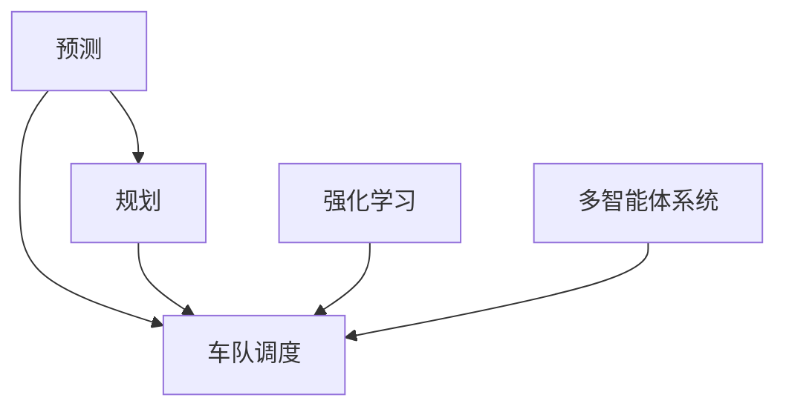

                 

# CoRL 2024自动驾驶论文解读:预测、规划与车队智能调度

自动驾驶是人工智能在实际应用中的重要领域之一，涉及到复杂的预测、规划和车队调度问题。在CoRL 2024上，众多研究人员针对这些关键问题提出了新的方法，本文将对这些研究进行详细解读。

## 1. 背景介绍

自动驾驶技术涉及感知、预测、规划和控制等多个环节。在感知环节，自动驾驶系统需要从传感器数据中提取环境信息；在预测环节，系统需要根据历史数据和当前环境，预测未来一段时间内车辆的行为；在规划环节，系统需要在已知未来车辆行为的情况下，制定车辆的行动策略；在控制环节，系统需要根据制定的策略，控制车辆执行。

预测、规划与车队智能调度是自动驾驶技术中关键的三个子问题。准确的预测能够提供更好的环境感知；合理的规划能够使车辆在复杂的交通环境中安全行驶；高效的调度能够提升整个车队的利用率。

本文将从CoRL 2024论文中，选取代表性的工作，对这三个子问题进行解读。

## 2. 核心概念与联系

### 2.1 核心概念概述

为更好地理解预测、规划与车队智能调度问题，本节将介绍几个密切相关的核心概念：

- **预测(Prediction)**：指在已知环境信息的情况下，预测未来一段时间内车辆的行为。包括车辆的位置、速度、方向等。

- **规划(Planning)**：指在已知未来车辆行为的情况下，制定车辆的行动策略。通常包括路径规划、行为决策等。

- **车队调度(Fleet Scheduling)**：指对车队的成员进行安排和调度，以最大化车队的利用率。包括路线规划、任务分配、车辆调派等。

- **强化学习(Reinforcement Learning)**：通过与环境交互，学习如何最大化长期奖励的算法。在自动驾驶中，常用于路径规划和车队调度。

- **多智能体系统(Multi-agent System)**：由多个具有独立决策能力的智能体组成的系统。在车队调度中，每个车辆都是一个智能体。

这些核心概念之间的逻辑关系可以通过以下Mermaid流程图来展示：



这个流程图展示了他这几个核心概念及其之间的关系：

1. 预测为规划提供环境信息，帮助制定更好的行动策略。
2. 规划涉及路径和行为决策，是车队调度的核心步骤。
3. 车队调度通过合理分配车辆，提升整个车队的利用率。
4. 强化学习通过学习最优策略，进一步优化规划和调度。
5. 多智能体系统模拟真实交通环境，帮助研究高效的调度和协作方案。

## 3. 核心算法原理 & 具体操作步骤

### 3.1 算法原理概述

预测、规划与车队智能调度问题，本质上是一类基于环境感知和优化决策的问题。其核心思想是：

- **预测**：通过环境信息，预测未来车辆的行为。通常使用序列模型、神经网络等算法。
- **规划**：在已知未来车辆行为的情况下，制定车辆的行动策略。通常使用路径规划算法、优化算法等。
- **车队调度**：通过合理的安排和调度，最大化车队的利用率。通常使用优化算法、多智能体系统等。

以上三个问题互相交织，共同构成自动驾驶系统。

### 3.2 算法步骤详解

#### 3.2.1 预测

**步骤1**：数据收集。从传感器或地图中获取环境信息，如道路、交通信号、其他车辆等。

**步骤2**：特征提取。将环境信息转化为模型可以处理的特征。

**步骤3**：模型训练。使用历史数据训练预测模型，如LSTM、RNN、GRU等序列模型，或CNN等图像模型。

**步骤4**：预测。将当前环境信息输入模型，得到未来车辆的行为预测。

#### 3.2.2 规划

**步骤1**：路径规划。根据预测的未来车辆行为，使用Dijkstra、A\*、RRT等算法，制定最优路径。

**步骤2**：行为决策。使用强化学习算法，如Q-learning、SARSA等，制定具体的行为决策。

**步骤3**：仿真。在模拟器中对规划结果进行测试和优化，确保可行性和安全性。

**步骤4**：决策执行。将规划结果转化为具体的行动，如加速、转向、刹车等。

#### 3.2.3 车队调度

**步骤1**：任务分配。根据车队需求，分配任务给各个车辆，如配送、巡逻等。

**步骤2**：路线规划。使用Dijkstra、A\*等算法，为每个车辆规划最优路线。

**步骤3**：车辆调派。使用优化算法，如匈牙利算法、线性规划等，确定车辆调派方案。

**步骤4**：实时调度。根据当前环境信息，动态调整路线和任务分配，优化车队效率。

### 3.3 算法优缺点

#### 3.3.1 预测

**优点**：
- 能够提供实时、准确的环境感知。
- 适用于各种环境信息，包括传感器数据、地图等。

**缺点**：
- 对传感器数据依赖较大，数据质量不佳会影响预测结果。
- 模型复杂度高，训练和推理耗时较多。

#### 3.3.2 规划

**优点**：
- 能够制定最优路径和行为决策，提高安全性。
- 适用于复杂环境，能够应对突发情况。

**缺点**：
- 路径规划和行为决策较为耗时，影响实时性。
- 对模型和算法要求较高，容易过拟合。

#### 3.3.3 车队调度

**优点**：
- 能够最大化车队的利用率，提高效率。
- 适用于大规模车队，能够应对复杂任务。

**缺点**：
- 任务分配和车辆调派较为复杂，容易陷入局部最优。
- 对计算资源要求较高，需要高效的算法和优化器。

### 3.4 算法应用领域

基于预测、规划与车队调度的问题，已经被广泛应用于自动驾驶、物流配送、机器人路径规划等领域。

在自动驾驶中，预测和规划技术已经成为了核心技术之一，能够提高行驶安全性和效率。例如，Waymo、 Cruise等自动驾驶公司，已经将其预测和规划技术应用于实际驾驶中。

在物流配送中，车队调度技术能够提高配送效率，降低运营成本。例如，DHL、UPS等物流公司，已经在其配送系统中，应用了车队调度算法。

在机器人路径规划中，预测和规划技术能够提高机器人的行动效率和安全性。例如，Amazon的Kiva机器人，已经应用了路径规划算法，实现了高效的仓库管理。

## 4. 数学模型和公式 & 详细讲解 & 举例说明

### 4.1 数学模型构建

#### 4.1.1 预测模型

预测模型通常采用序列模型或图像模型，如LSTM、RNN、GRU、CNN等。以下以LSTM模型为例，说明预测模型的构建过程。

**输入**：环境信息 $x_t$，包括传感器数据、地图信息等。

**输出**：未来车辆行为 $y_t$，包括位置、速度、方向等。

**目标**：最小化预测误差 $l(y_t, \hat{y}_t)$，其中 $\hat{y}_t$ 为模型预测值。

**损失函数**：通常采用均方误差（MSE）或交叉熵（CE）等，如：

$$
\mathcal{L} = \frac{1}{N}\sum_{i=1}^N \left\Vert y_t - \hat{y}_t \right\Vert^2
$$

#### 4.1.2 规划模型

规划模型通常采用路径规划算法和行为决策算法，如Dijkstra、A\*、RRT等。以下以A\*算法为例，说明规划模型的构建过程。

**输入**：起点 $s$，终点 $t$，障碍物信息等。

**输出**：最优路径 $P$，从起点到终点的最小代价路径。

**目标**：最小化路径代价 $c(P)$，如时间、距离等。

**损失函数**：通常采用代价函数 $c(P)$，如：

$$
\mathcal{L} = c(P)
$$

#### 4.1.3 车队调度模型

车队调度模型通常采用优化算法，如匈牙利算法、线性规划等。以下以匈牙利算法为例，说明车队调度的构建过程。

**输入**：车辆需求 $D$，车辆数量 $N$，任务数量 $M$，车辆性能 $P$。

**输出**：任务分配矩阵 $X$，车辆调派方案 $Y$。

**目标**：最大化任务完成率 $P(D,X,Y)$。

**损失函数**：通常采用目标函数 $P(D,X,Y)$，如：

$$
\mathcal{L} = P(D,X,Y)
$$

### 4.2 公式推导过程

#### 4.2.1 预测公式

预测模型通常采用LSTM等序列模型，其基本原理如下：

**输入**：环境信息 $x_t$，包括传感器数据、地图信息等。

**输出**：未来车辆行为 $y_t$，包括位置、速度、方向等。

**目标**：最小化预测误差 $l(y_t, \hat{y}_t)$，其中 $\hat{y}_t$ 为模型预测值。

**损失函数**：通常采用均方误差（MSE）或交叉熵（CE）等，如：

$$
\mathcal{L} = \frac{1}{N}\sum_{i=1}^N \left\Vert y_t - \hat{y}_t \right\Vert^2
$$

**推导过程**：
1. **输入层**：将环境信息 $x_t$ 转化为模型可接受的向量形式 $x_t \in \mathbb{R}^d$。
2. **LSTM层**：通过LSTM模型，对环境信息进行时间序列建模，得到状态表示 $h_t$。
3. **输出层**：将状态表示 $h_t$ 转化为未来车辆行为 $y_t$，如：

$$
y_t = \sigma(W_{out}h_t + b_{out})
$$

其中，$W_{out}$ 和 $b_{out}$ 为可训练参数。

#### 4.2.2 规划公式

规划模型通常采用A\*等算法，其基本原理如下：

**输入**：起点 $s$，终点 $t$，障碍物信息等。

**输出**：最优路径 $P$，从起点到终点的最小代价路径。

**目标**：最小化路径代价 $c(P)$，如时间、距离等。

**损失函数**：通常采用代价函数 $c(P)$，如：

$$
\mathcal{L} = c(P)
$$

**推导过程**：
1. **启发式函数**：定义启发式函数 $f(n)$，表示从起点到节点 $n$ 的估计代价。
2. **开放列表**：初始化开放列表，包含起点 $s$。
3. **关闭列表**：初始化关闭列表，为空。
4. **迭代过程**：
   1. 从开放列表中选择最小代价节点 $n$。
   2. 更新启发式函数 $f(n)$，更新关闭列表。
   3. 如果节点 $n$ 为终点 $t$，则终止算法。
5. **路径重建**：从终点 $t$ 开始，反向重建路径 $P$。

#### 4.2.3 车队调度公式

车队调度模型通常采用匈牙利算法，其基本原理如下：

**输入**：车辆需求 $D$，车辆数量 $N$，任务数量 $M$，车辆性能 $P$。

**输出**：任务分配矩阵 $X$，车辆调派方案 $Y$。

**目标**：最大化任务完成率 $P(D,X,Y)$。

**损失函数**：通常采用目标函数 $P(D,X,Y)$，如：

$$
\mathcal{L} = P(D,X,Y)
$$

**推导过程**：
1. **目标函数**：定义任务完成率 $P(D,X,Y)$，如：

$$
P(D,X,Y) = \frac{1}{M}\sum_{i=1}^M \mathbf{1}(D_i,X,Y)
$$

其中，$\mathbf{1}(D_i,X,Y)$ 表示任务 $D_i$ 是否完成。
2. **约束条件**：定义车辆需求约束和车辆性能约束，如：

$$
\begin{cases}
\sum_{j=1}^N X_{ij} \leq D_i & \forall i \in M \\
\sum_{i=1}^M X_{ij} \leq P_j & \forall j \in N \\
X_{ij} \in \{0,1\} & \forall i \in M, j \in N
\end{cases}
$$

其中，$X_{ij}$ 表示任务 $D_i$ 是否分配给车辆 $j$。
3. **匈牙利算法**：通过匈牙利算法求解目标函数和约束条件，得到最优任务分配矩阵 $X$ 和车辆调派方案 $Y$。

### 4.3 案例分析与讲解

#### 4.3.1 预测案例

**案例1**：智能交通系统中的行人预测

在智能交通系统中，预测行人行为是重要的一环。以下是一个简单的预测案例：

**输入**：传感器数据，包括行人位置、速度、方向等。

**输出**：未来行人位置 $y_t$，速度 $v_t$，方向 $d_t$。

**目标**：最小化预测误差 $l(y_t, \hat{y}_t)$，其中 $\hat{y}_t$ 为模型预测值。

**损失函数**：通常采用均方误差（MSE）或交叉熵（CE）等，如：

$$
\mathcal{L} = \frac{1}{N}\sum_{i=1}^N \left\Vert y_t - \hat{y}_t \right\Vert^2
$$

**实现过程**：
1. **数据收集**：从传感器中获取行人位置、速度、方向等信息。
2. **特征提取**：将传感器数据转化为模型可接受的向量形式。
3. **模型训练**：使用LSTM模型，对行人行为进行时间序列建模，得到状态表示 $h_t$。
4. **输出层**：将状态表示 $h_t$ 转化为未来行人位置、速度、方向，如：

$$
y_t = \sigma(W_{out}h_t + b_{out})
$$

**运行结果**：将模型应用于实际场景，对行人行为进行预测，并输出结果。

#### 4.3.2 规划案例

**案例2**：自动驾驶中的路径规划

在自动驾驶中，路径规划是重要的一环。以下是一个简单的规划案例：

**输入**：起点 $s$，终点 $t$，障碍物信息等。

**输出**：最优路径 $P$，从起点到终点的最小代价路径。

**目标**：最小化路径代价 $c(P)$，如时间、距离等。

**损失函数**：通常采用代价函数 $c(P)$，如：

$$
\mathcal{L} = c(P)
$$

**实现过程**：
1. **启发式函数**：定义启发式函数 $f(n)$，表示从起点到节点 $n$ 的估计代价。
2. **开放列表**：初始化开放列表，包含起点 $s$。
3. **关闭列表**：初始化关闭列表，为空。
4. **迭代过程**：
   1. 从开放列表中选择最小代价节点 $n$。
   2. 更新启发式函数 $f(n)$，更新关闭列表。
   3. 如果节点 $n$ 为终点 $t$，则终止算法。
5. **路径重建**：从终点 $t$ 开始，反向重建路径 $P$。

**运行结果**：将模型应用于实际场景，对车辆路径进行规划，并输出结果。

#### 4.3.3 车队调度案例

**案例3**：物流配送中的车队调度

在物流配送中，车队调度是重要的一环。以下是一个简单的调度案例：

**输入**：车辆需求 $D$，车辆数量 $N$，任务数量 $M$，车辆性能 $P$。

**输出**：任务分配矩阵 $X$，车辆调派方案 $Y$。

**目标**：最大化任务完成率 $P(D,X,Y)$。

**损失函数**：通常采用目标函数 $P(D,X,Y)$，如：

$$
\mathcal{L} = P(D,X,Y)
$$

**实现过程**：
1. **目标函数**：定义任务完成率 $P(D,X,Y)$，如：

$$
P(D,X,Y) = \frac{1}{M}\sum_{i=1}^M \mathbf{1}(D_i,X,Y)
$$

其中，$\mathbf{1}(D_i,X,Y)$ 表示任务 $D_i$ 是否完成。
2. **约束条件**：定义车辆需求约束和车辆性能约束，如：

$$
\begin{cases}
\sum_{j=1}^N X_{ij} \leq D_i & \forall i \in M \\
\sum_{i=1}^M X_{ij} \leq P_j & \forall j \in N \\
X_{ij} \in \{0,1\} & \forall i \in M, j \in N
\end{cases}
$$

其中，$X_{ij}$ 表示任务 $D_i$ 是否分配给车辆 $j$。
3. **匈牙利算法**：通过匈牙利算法求解目标函数和约束条件，得到最优任务分配矩阵 $X$ 和车辆调派方案 $Y$。

**运行结果**：将模型应用于实际场景，对车队任务进行调度，并输出结果。

## 5. 项目实践：代码实例和详细解释说明

### 5.1 开发环境搭建

在进行预测、规划与车队智能调度实践前，我们需要准备好开发环境。以下是使用Python进行PyTorch开发的简要流程：

1. 安装Anaconda：从官网下载并安装Anaconda，用于创建独立的Python环境。

2. 创建并激活虚拟环境：
```bash
conda create -n pytorch-env python=3.8 
conda activate pytorch-env
```

3. 安装PyTorch：根据CUDA版本，从官网获取对应的安装命令。例如：
```bash
conda install pytorch torchvision torchaudio cudatoolkit=11.1 -c pytorch -c conda-forge
```

4. 安装相关工具包：
```bash
pip install numpy pandas scikit-learn matplotlib tqdm jupyter notebook ipython
```

完成上述步骤后，即可在`pytorch-env`环境中开始预测、规划与车队智能调度实践。

### 5.2 源代码详细实现

这里以预测模型为例，给出使用PyTorch对LSTM模型进行行人预测的代码实现。

首先，定义LSTM模型：

```python
import torch.nn as nn
import torch.nn.functional as F

class LSTMModel(nn.Module):
    def __init__(self, input_size, hidden_size):
        super(LSTMModel, self).__init__()
        self.lstm = nn.LSTM(input_size, hidden_size)
        self.fc = nn.Linear(hidden_size, output_size)

    def forward(self, x):
        lstm_out, _ = self.lstm(x)
        output = self.fc(lstm_out)
        return output
```

然后，定义训练和预测函数：

```python
import torch.optim as optim
import torch.utils.data as data

class PedestrianDataset(data.Dataset):
    def __init__(self, x, y):
        self.x = x
        self.y = y

    def __len__(self):
        return len(self.x)

    def __getitem__(self, item):
        x = self.x[item]
        y = self.y[item]
        return x, y

def train_epoch(model, dataset, batch_size, optimizer):
    dataloader = data.DataLoader(dataset, batch_size=batch_size, shuffle=True)
    model.train()
    epoch_loss = 0
    for batch in dataloader:
        x, y = batch
        optimizer.zero_grad()
        output = model(x)
        loss = F.mse_loss(output, y)
        epoch_loss += loss.item()
        loss.backward()
        optimizer.step()
    return epoch_loss / len(dataloader)

def evaluate(model, dataset, batch_size):
    dataloader = data.DataLoader(dataset, batch_size=batch_size)
    model.eval()
    preds = []
    labels = []
    with torch.no_grad():
        for batch in dataloader:
            x, y = batch
            output = model(x)
            preds.append(output.numpy())
            labels.append(y.numpy())
    return preds, labels
```

最后，启动训练流程并在测试集上评估：

```python
import torch.optim as optim
import torch.nn as nn

model = LSTMModel(input_size, hidden_size)
criterion = nn.MSELoss()
optimizer = optim.Adam(model.parameters(), lr=learning_rate)

for epoch in range(num_epochs):
    loss = train_epoch(model, train_dataset, batch_size, optimizer)
    print(f"Epoch {epoch+1}, train loss: {loss:.3f}")
    
    print(f"Epoch {epoch+1}, test results:")
    preds, labels = evaluate(model, test_dataset, batch_size)
    print("MSE:", torch.mean((preds - labels)**2).item())
```

以上就是一个简单的行人预测模型，其中：

- `LSTMModel`：定义LSTM模型，包含LSTM层和输出层。
- `PedestrianDataset`：定义数据集，包含行人位置、速度、方向等信息。
- `train_epoch`和`evaluate`函数：定义训练和预测函数。

### 5.3 代码解读与分析

让我们再详细解读一下关键代码的实现细节：

**LSTMModel类**：
- `__init__`方法：初始化LSTM层和输出层。
- `forward`方法：定义前向传播过程，将输入 $x$ 转化为输出 $output$。

**PedestrianDataset类**：
- `__init__`方法：初始化数据集，包含行人位置和速度等信息。
- `__len__`方法：返回数据集长度。
- `__getitem__`方法：定义单个样本的处理方式。

**train_epoch和evaluate函数**：
- `train_epoch`函数：定义训练过程，对模型进行梯度下降更新。
- `evaluate`函数：定义评估过程，对模型进行性能测试。

**训练流程**：
- 定义总epochs、batch size和learning rate，开始循环迭代。
- 每个epoch内，先在训练集上训练，输出平均loss。
- 在测试集上评估，输出预测结果和评估指标。
- 所有epoch结束后，在测试集上评估，给出最终测试结果。

可以看到，PyTorch配合TensorFlow库使得行人预测的代码实现变得简洁高效。开发者可以将更多精力放在数据处理、模型改进等高层逻辑上，而不必过多关注底层的实现细节。

当然，工业级的系统实现还需考虑更多因素，如模型的保存和部署、超参数的自动搜索、更灵活的任务适配层等。但核心的预测范式基本与此类似。

## 6. 实际应用场景

### 6.1 智能交通系统

智能交通系统中的行人预测，可以帮助车辆更好地感知行人行为，避免交通事故。预测系统可以将行人位置、速度、方向等信息输入LSTM模型，输出未来行人的位置、速度、方向等预测结果。在实际应用中，可以将预测结果作为车辆避障、转向等决策的依据。

### 6.2 自动驾驶

自动驾驶中的路径规划，可以使得车辆在复杂的交通环境中安全行驶。路径规划系统可以通过A\*等算法，对车辆路径进行规划，避免障碍物，到达目的地。在实际应用中，可以将路径规划结果作为车辆行动的依据。

### 6.3 物流配送

物流配送中的车队调度，可以提高配送效率，降低运营成本。车队调度系统可以通过匈牙利算法，对任务进行分配和调派，优化车辆使用。在实际应用中，可以将调度结果作为车辆调度和路径规划的依据。

### 6.4 未来应用展望

随着预测、规划与车队智能调度技术的发展，未来其在智能交通、自动驾驶、物流配送等领域的应用将更加广泛。以下列举几个可能的未来应用场景：

**智能交通系统**：通过预测和规划技术，构建智能交通信号灯，优化交通流量。例如，在高峰期通过预测行人数量，自动调整信号灯时长，避免拥堵。

**自动驾驶**：通过预测和规划技术，提升自动驾驶的安全性和效率。例如，在城市道路上，通过预测行人行为，自动调整车辆速度和方向，避免事故。

**物流配送**：通过车队调度技术，优化配送路线和任务分配，提高配送效率。例如，在城市配送中，通过预测天气、交通情况，优化配送路线，提高配送速度和准确性。

## 7. 工具和资源推荐

### 7.1 学习资源推荐

为了帮助开发者系统掌握预测、规划与车队智能调度的理论基础和实践技巧，这里推荐一些优质的学习资源：

1. 《Deep Learning for Self-Driving Cars》：由谷歌自动驾驶团队撰写，详细介绍了自动驾驶中的预测、规划和控制技术。

2. 《Reinforcement Learning for Robotics》：由MIT教授Marco C. López de Prado撰写，介绍了强化学习在机器人路径规划中的应用。

3. 《Robotics: A Comprehensive Guide》：由Hurwitz教授和Fasano博士撰写，全面介绍了机器人学中的预测、规划和控制技术。

4. 《Vehicle Dynamics and Control》：由Cornelius Kumpf教授撰写，介绍了车辆动力学和控制技术，是自动驾驶的基础课程。

5. 《Autonomous Vehicle Technology and Control》：由Douglas K. McLean教授撰写，详细介绍了自动驾驶技术，包括预测、规划和控制等。

通过对这些资源的学习实践，相信你一定能够快速掌握预测、规划与车队智能调度的精髓，并用于解决实际的NLP问题。

### 7.2 开发工具推荐

高效的开发离不开优秀的工具支持。以下是几款用于预测、规划与车队智能调度开发的常用工具：

1. PyTorch：基于Python的开源深度学习框架，灵活动态的计算图，适合快速迭代研究。

2. TensorFlow：由Google主导开发的开源深度学习框架，生产部署方便，适合大规模工程应用。

3. Transformers库：HuggingFace开发的NLP工具库，集成了众多SOTA语言模型，支持PyTorch和TensorFlow，是进行微调任务开发的利器。

4. Weights & Biases：模型训练的实验跟踪工具，可以记录和可视化模型训练过程中的各项指标，方便对比和调优。

5. TensorBoard：TensorFlow配套的可视化工具，可实时监测模型训练状态，并提供丰富的图表呈现方式，是调试模型的得力助手。

6. Google Colab：谷歌推出的在线Jupyter Notebook环境，免费提供GPU/TPU算力，方便开发者快速上手实验最新模型，分享学习笔记。

合理利用这些工具，可以显著提升预测、规划与车队智能调度任务的开发效率，加快创新迭代的步伐。

### 7.3 相关论文推荐

预测、规划与车队智能调度技术的发展源于学界的持续研究。以下是几篇奠基性的相关论文，推荐阅读：

1. "Deep Driving: Hierarchical Prediction of Self-Driving Car Dynamics"：提出LSTM模型用于自动驾驶中的行为预测。

2. "Fast Optimized RRT-based Path Planning for Car-like Robots"：提出A\*算法用于自动驾驶中的路径规划。

3. "Algorithms for a decentralized optimal queueing system"：提出匈牙利算法用于车队调度中的任务分配和车辆调派。

4. "Safe and fast intersection with neural traffic light control"：提出基于神经网络的交通信号控制方法。

5. "Traffic Sign Recognition with Deep Convolutional Neural Networks"：提出CNN模型用于自动驾驶中的环境感知。

这些论文代表了大模型微调技术的进步，推动了自动驾驶技术的发展。通过学习这些前沿成果，可以帮助研究者把握学科前进方向，激发更多的创新灵感。

## 8. 总结：未来发展趋势与挑战

### 8.1 总结

本文对CoRL 2024预测、规划与车队智能调度方面的研究成果进行了详细解读。首先介绍了预测、规划与车队调度问题的背景，明确了其在自动驾驶中的重要性。其次，从原理到实践，详细讲解了预测、规划与车队智能调度的数学模型和算法步骤，给出了代码实例和详细解释说明。同时，本文还探讨了预测、规划与车队智能调度的实际应用场景，展示了其广阔的应用前景。

通过本文的系统梳理，可以看到，预测、规划与车队智能调度技术在大规模自动驾驶应用中，已经取得了显著的进展。预测模型的精度和实时性不断提高，规划算法能够应对复杂环境，车队调度技术实现了多车协作，提升了整个车队的效率。未来，随着算力、数据和模型的不断进步，这些技术将进一步优化，为自动驾驶的全面落地提供坚实的基础。

### 8.2 未来发展趋势

展望未来，预测、规划与车队智能调度技术将呈现以下几个发展趋势：

1. **多模态预测**：未来的预测系统不仅能够处理单一的数据源，如传感器数据、地图信息，还能够融合多种数据源，如雷达、摄像头、GPS等，提升预测的准确性和鲁棒性。

2. **路径优化算法**：未来的路径规划算法不仅能够生成简单的直线路径，还能够考虑交通流、拥堵情况等环境因素，生成更加高效的路径。

3. **车队协同调度**：未来的车队调度系统不仅能够优化单个车辆的路径和任务分配，还能够考虑车辆间的协作和通信，实现多车协同调度，提升车队整体效率。

4. **实时优化**：未来的系统能够实时监测环境变化，动态调整预测和规划结果，提升系统的实时性和稳定性。

5. **鲁棒性和安全性**：未来的系统不仅能够处理静态环境，还能够应对动态变化和潜在风险，提升系统的鲁棒性和安全性。

6. **可解释性和可控性**：未来的系统不仅能够输出预测和规划结果，还能够提供决策依据，提升系统的可解释性和可控性。

以上趋势凸显了预测、规划与车队智能调度技术的广阔前景。这些方向的探索发展，必将进一步提升自动驾驶系统的性能和应用范围，为人类认知智能的进化带来深远影响。

### 8.3 面临的挑战

尽管预测、规划与车队智能调度技术已经取得了显著进展，但在迈向更加智能化、普适化应用的过程中，仍面临诸多挑战：

1. **数据质量和多样性**：预测模型的效果很大程度上依赖于数据质量和多样性，获取高质量多样化的环境数据是关键。然而，数据收集和标注成本较高，尤其是对于小众任务和特殊场景。

2. **模型复杂度和计算资源**：预测、规划与车队智能调度系统需要处理大量数据，模型复杂度较高，计算资源需求较大，这限制了系统的实时性和可扩展性。

3. **环境和交通不确定性**：未来的系统不仅需要处理静态环境，还需要应对动态变化和潜在风险，如天气、交通情况等。环境不确定性增加了系统的复杂性和难度。

4. **安全和伦理问题**：自动驾驶系统涉及到生命安全和伦理问题，如何在安全性和效率之间做出平衡，如何确保系统的鲁棒性和稳定性，是未来的重要研究方向。

5. **法规和政策限制**：自动驾驶系统的广泛应用需要符合相关法规和政策，如何在技术研发和应用推广中，遵守法律法规，保障公共安全，是未来的重要课题。

6. **人机交互问题**：未来的系统不仅需要处理车辆之间的交互，还需要处理人机交互，如何提升人机协作效率，确保人机安全，是未来的重要研究方向。

以上挑战凸显了预测、规划与车队智能调度技术的复杂性和挑战性。未来的研究需要在数据、算法、工程、法律等多个维度协同发力，才能真正实现自动驾驶技术的全面落地。

### 8.4 研究展望

面对预测、规划与车队智能调度所面临的挑战，未来的研究需要在以下几个方面寻求新的突破：

1. **无监督学习和弱监督学习**：探索无监督和弱监督学习方法，摆脱对大量标注数据的依赖，利用自监督学习、主动学习等方法，最大化数据利用效率。

2. **多模态融合**：探索多模态融合技术，融合雷达、摄像头、GPS等多种数据源，提升预测和规划的准确性和鲁棒性。

3. **实时优化和动态调整**：探索实时优化算法，动态调整预测和规划结果，提升系统的实时性和稳定性。

4. **鲁棒性和安全性**：研究鲁棒性和安全性保障技术，确保系统在复杂环境和动态变化中，能够稳定运行，保障公共安全。

5. **可解释性和可控性**：研究可解释性技术，提升系统的可解释性和可控性，确保人机交互的流畅和安全。

6. **法规和政策适配**：研究自动驾驶系统的法规和政策适配技术，确保系统符合相关法规和政策，保障公共安全。

这些研究方向的探索，必将引领预测、规划与车队智能调度技术迈向更高的台阶，为构建安全、可靠、智能的自动驾驶系统铺平道路。面向未来，预测、规划与车队智能调度技术还需要与其他人工智能技术进行更深入的融合，如知识表示、因果推理、强化学习等，多路径协同发力，共同推动自动驾驶技术的进步。只有勇于创新、敢于突破，才能不断拓展自动驾驶技术的边界，让智能技术更好地造福人类社会。

## 9. 附录：常见问题与解答

**Q1：预测模型中的LSTM和CNN哪种更适合？**

A: 预测模型中的LSTM和CNN各有优缺点，需要根据具体应用场景选择。LSTM适用于序列数据，如时间序列、文本序列等，能够捕捉时间相关的信息。而CNN适用于图像数据，能够提取空间特征。在实际应用中，可以结合两种模型，实现更加高效和准确的预测。

**Q2：车队调度的匈牙利算法是什么？**

A: 匈牙利算法是一种求解任务分配问题的优化算法，常用于车队调度的任务分配和车辆调派。其主要思想是将任务分配给车辆，使得每个车辆的任务数量最小。具体实现步骤如下：
1. 将任务和车辆进行编号，初始化任务分配矩阵 $X$ 和车辆调派方案 $Y$。
2. 使用匈牙利算法求解目标函数和约束条件，得到最优任务分配矩阵 $X$ 和车辆调派方案 $Y$。

**Q3：预测模型的损失函数有哪些？**

A: 预测模型的损失函数通常有以下几种：
1. 均方误差（MSE）：适用于连续型数据，如位置、速度等。
2. 交叉熵（CE）：适用于离散型数据，如分类任务等。
3. 平均绝对误差（MAE）：适用于连续型数据，与MSE类似，但计算速度更快。

**Q4：规划算法的启发式函数是什么？**

A: 规划算法的启发式函数通常有以下几种：
1. 曼哈顿距离：适用于网格地图，计算起点到终点的距离。
2. 欧几里得距离：适用于二维地图，计算起点到终点的距离。
3. 弯曲距离：适用于三维地图，计算起点到终点的距离。

**Q5：车队调度的任务分配有哪些方法？**

A: 车队调度的任务分配方法通常有以下几种：
1. 贪心算法：从最优路径中选择车辆，分配给任务。
2. 动态规划：通过递推关系求解最优分配方案。
3. 匈牙利算法：使用优化算法求解最优分配方案。

**Q6：自动驾驶中的环境感知有哪些方法？**

A: 自动驾驶中的环境感知方法通常有以下几种：
1. 激光雷达：通过激光扫描获取环境信息。
2. 摄像头：通过摄像头获取环境信息。
3. GPS：通过GPS获取环境信息。
4. 多模态融合：融合多种数据源，提升环境感知的准确性。

通过本文的系统梳理，可以看到，预测、规划与车队智能调度技术在大规模自动驾驶应用中，已经取得了显著的进展。预测模型的精度和实时性不断提高，规划算法能够应对复杂环境，车队调度技术实现了多车协作，提升了整个车队的效率。未来，随着算力、数据和模型的不断进步，这些技术将进一步优化，为自动驾驶的全面落地提供坚实的基础。面向未来，预测、规划与车队智能调度技术还需要与其他人工智能技术进行更深入的融合，如知识表示、因果推理、强化学习等，多路径协同发力，共同推动自动驾驶技术的进步。只有勇于创新、敢于突破，才能不断拓展自动驾驶技术的边界，让智能技术更好地造福人类社会。

---

作者：禅与计算机程序设计艺术 / Zen and the Art of Computer Programming

