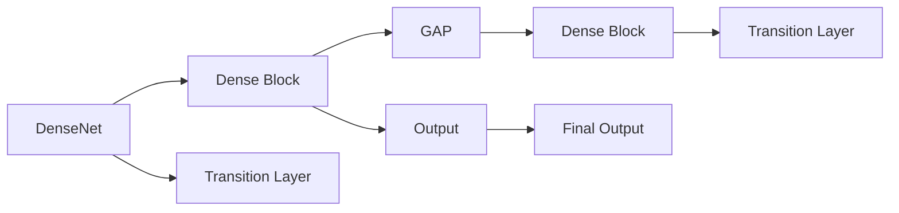

                 

# DenseNet原理与代码实例讲解

> 关键词：DenseNet, 神经网络, 深度学习, 卷积神经网络, 特征重用, 特征复用, 代码实例

## 1. 背景介绍

### 1.1 问题由来
近年来，深度学习在计算机视觉领域取得了显著进展，尤其是在图像分类、目标检测、语义分割等任务上，达到了超乎想象的性能水平。这一切成就，离不开对卷积神经网络（Convolutional Neural Networks, CNNs）的不断探索和优化。

传统的CNNs通常采用层次化的结构，每一层只与前几层或后几层相连。这导致某些特征需要在多个卷积层中多次计算，才能被后续层利用。然而，这种层次化的结构，在一定程度上限制了特征的复用和共享。而DenseNet的出现，则是对这一结构的一次重大突破，通过特征复用和共享，大幅提升了网络的效率和性能。

### 1.2 问题核心关键点
DenseNet是一种基于特征复用的卷积神经网络结构。通过引入Dense Block和过渡层（Transition Layers），DenseNet将每一层输出的特征都传递给其它所有层，使得网络中的特征可以高效共享和重用。这一特性，使得DenseNet能够在保持较高准确性的同时，极大地减少网络参数量和计算量。

DenseNet的设计理念包括：
1. **特征复用**：在每个Dense Block中，将前一层的所有特征传递给后一层，并在输出端进行汇聚，以复用前一层的特征。
2. **参数共享**：通过调整Dense Block的深度和过渡层的结构，可以高效利用特征，同时减少网络参数量。
3. **全局特征共享**：DenseNet中的全局特征池化层，可以使得不同层次的特征互相复用，进一步提升特征表达能力。

DenseNet的核心思想在于：通过构建高度连接的网络，使得网络中的每一层都可以访问到其它所有层的特征，从而提升特征的利用率和网络性能。这一思想，不仅在计算机视觉任务中得到了验证，也被应用于自然语言处理（NLP）、语音识别等领域的深度学习模型中。

## 2. 核心概念与联系

### 2.1 核心概念概述

为更好地理解DenseNet的结构和原理，本节将介绍几个关键概念：

- DenseNet：基于特征复用的卷积神经网络，其核心思想是将每一层输出的特征都传递给其它所有层，实现特征的高效复用。
- Dense Block：DenseNet中用于特征复用的基本单元，通过多个卷积层和池化层堆叠，实现特征的逐层复用。
- Transition Layer：DenseNet中的过渡层，用于连接不同的Dense Block，并调整特征维度，确保特征复用的顺利进行。
- Global Average Pooling (GAP)：全局平均池化层，用于将不同层次的特征复用，提升特征表达能力。
- 特征重用：DenseNet的核心特性，通过特征的逐层传递和汇聚，实现特征的高效复用和共享。

这些概念之间的逻辑关系可以通过以下Mermaid流程图来展示：



这个流程图展示了DenseNet的核心结构：Dense Block之间通过Transition Layer相连，每个Dense Block的输出都传递给下一层的所有特征，并在GAP层进行汇聚，最终输出最终结果。

## 3. 核心算法原理 & 具体操作步骤

### 3.1 算法原理概述

DenseNet的算法原理主要围绕特征复用展开，其核心思想是通过构建高度连接的网络，使得网络中的每一层都可以访问到其它所有层的特征。这通过两个关键模块实现：Dense Block和Transition Layer。

- **Dense Block**：每个Dense Block包含多个卷积层和池化层，每个卷积层输出均连接该Dense Block中的所有卷积层，并汇聚到下一个Dense Block或输出层。
- **Transition Layer**：用于连接不同的Dense Block，调整特征维度，实现不同层次特征之间的复用。

DenseNet的优化目标是通过特征复用，减少网络参数量和计算量，同时提升网络的准确性和泛化能力。

### 3.2 算法步骤详解

DenseNet的训练过程主要包括以下几个关键步骤：

1. **初始化网络**：选择合适的DenseNet模型作为初始化参数。

2. **添加数据增强**：使用数据增强技术，扩充训练集的多样性，如随机裁剪、旋转、翻转等。

3. **定义损失函数**：根据任务类型，选择合适的损失函数，如交叉熵、均方误差等。

4. **优化器选择**：选择合适的优化器及其参数，如Adam、SGD等，设置学习率、批大小、迭代轮数等。

5. **模型训练**：在训练集上迭代训练模型，每次迭代中，将数据输入模型，前向传播计算损失，反向传播更新参数。

6. **模型评估**：在验证集上评估模型性能，记录验证集上的精度、召回率等指标。

7. **模型保存与部署**：保存训练好的模型，并在实际应用中加载和部署。

### 3.3 算法优缺点

DenseNet具有以下优点：
1. **特征复用**：通过特征复用，减少了网络参数量和计算量，提升了网络效率。
2. **全局特征共享**：DenseNet中的GAP层，可以使得不同层次的特征互相复用，提升特征表达能力。
3. **泛化能力强**：由于特征的全面复用，DenseNet在小型数据集上表现出色。
4. **效果好**：DenseNet在图像分类、目标检测、语义分割等任务上，取得了优秀的性能。

同时，DenseNet也存在一定的局限性：
1. **结构复杂**：DenseNet的层间连接较多，训练时可能需要较长的收敛时间。
2. **参数量较大**：尽管通过特征复用减少了部分参数，但总体参数量仍较大，可能导致过拟合。
3. **计算量高**：DenseNet的特征复用需要大量的计算资源，可能导致训练和推理速度较慢。

### 3.4 算法应用领域

DenseNet作为一种高效、准确的卷积神经网络结构，已经被广泛应用于图像分类、目标检测、语义分割、人脸识别等多个领域。

- **图像分类**：通过DenseNet对图像进行分类，可以显著提升分类准确率。
- **目标检测**：在目标检测任务中，DenseNet可以更好地捕捉物体细节，提升检测精度。
- **语义分割**：DenseNet可以生成更细致、准确的语义分割图，用于图像理解和场景分析。
- **人脸识别**：DenseNet可以有效地提取人脸特征，提高识别准确率。

除了上述这些经典应用外，DenseNet还被创新性地应用于图像生成、图像修复、行为识别等新兴领域，为计算机视觉技术带来了新的突破。

## 4. 数学模型和公式 & 详细讲解 & 举例说明

### 4.1 数学模型构建

DenseNet的数学模型可以通过以下几个步骤进行构建：

1. **输入特征**：设输入特征为 $x \in \mathbb{R}^{d_{in}}$。

2. **Dense Block**：每个Dense Block包含多个卷积层 $C_1, C_2, \dots, C_l$，每个卷积层的输出维度为 $d_{l-1}$，则每个卷积层的输出为：

   $$
   x_1 = C_1(x), x_2 = C_2(x_1), \dots, x_l = C_l(x_{l-1})
   $$

3. **特征汇聚**：Dense Block中每个卷积层的输出均连接该Dense Block中的所有卷积层，并汇聚到下一层或输出层。

4. **过渡层**：用于连接不同的Dense Block，调整特征维度，实现不同层次特征之间的复用。过渡层包含卷积层 $T$ 和全连接层 $F$，其输出为：

   $$
   x' = T(x_l), y = F(x')
   $$

5. **全局平均池化**：将不同层次的特征汇聚到输出层，使用全局平均池化层 $GAP$，将特征维度从 $d_l$ 降到 $d_{out}$。

   $$
   y = GAP(x')
   $$

6. **输出层**：使用softmax或交叉熵等函数，将输出转化为概率分布或分类结果。

### 4.2 公式推导过程

以DenseNet-121为例，推导其特征复用的具体过程。

DenseNet-121包含两个Dense Block和两个过渡层，每个Dense Block包含6个卷积层和3个池化层。设第一层的输入特征为 $x \in \mathbb{R}^{64 \times 64 \times 3}$，则Dense Block 1的特征传递过程为：

1. **第一个卷积层**：输入特征 $x \in \mathbb{R}^{64 \times 64 \times 3}$，输出特征 $x_1 \in \mathbb{R}^{64 \times 64 \times 64}$。

2. **第二个卷积层**：输入特征 $x_1 \in \mathbb{R}^{64 \times 64 \times 64}$，输出特征 $x_2 \in \mathbb{R}^{32 \times 32 \times 64}$。

3. **第三个卷积层**：输入特征 $x_2 \in \mathbb{R}^{32 \times 32 \times 64}$，输出特征 $x_3 \in \mathbb{R}^{32 \times 32 \times 128}$。

4. **第一个池化层**：输入特征 $x_3 \in \mathbb{R}^{32 \times 32 \times 128}$，输出特征 $x_4 \in \mathbb{R}^{16 \times 16 \times 128}$。

5. **第四个卷积层**：输入特征 $x_4 \in \mathbb{R}^{16 \times 16 \times 128}$，输出特征 $x_5 \in \mathbb{R}^{8 \times 8 \times 256}$。

6. **第五个卷积层**：输入特征 $x_5 \in \mathbb{R}^{8 \times 8 \times 256}$，输出特征 $x_6 \in \mathbb{R}^{8 \times 8 \times 256}$。

7. **第二个池化层**：输入特征 $x_6 \in \mathbb{R}^{8 \times 8 \times 256}$，输出特征 $x_7 \in \mathbb{R}^{4 \times 4 \times 512}$。

8. **过渡层**：输入特征 $x_7 \in \mathbb{R}^{4 \times 4 \times 512}$，输出特征 $x_8 \in \mathbb{R}^{4 \times 4 \times 1024}$。

9. **第二个Dense Block**：输入特征 $x_8 \in \mathbb{R}^{4 \times 4 \times 1024}$，输出特征 $x_9 \in \mathbb{R}^{4 \times 4 \times 512}$。

10. **第三个过渡层**：输入特征 $x_9 \in \mathbb{R}^{4 \times 4 \times 512}$，输出特征 $x_{10} \in \mathbb{R}^{4 \times 4 \times 2048}$。

11. **全局平均池化**：输入特征 $x_{10} \in \mathbb{R}^{4 \times 4 \times 2048}$，输出特征 $y \in \mathbb{R}^{1 \times 1 \times 2048}$。

12. **输出层**：使用softmax函数，将输出转化为10个类别的概率分布。

### 4.3 案例分析与讲解

假设我们需要使用DenseNet-121模型对CIFAR-10数据集进行分类。可以按照以下步骤进行代码实现：

1. **数据准备**：使用torchvision库加载CIFAR-10数据集。

2. **模型加载**：使用PyTorch的nn模块加载DenseNet-121模型。

3. **数据增强**：使用torchvision.transforms模块进行数据增强。

4. **定义损失函数**：使用torch.nn.CrossEntropyLoss定义损失函数。

5. **训练模型**：使用PyTorch的DataLoader模块进行数据加载，使用nn.DataParallel模块进行模型并行，使用optim模块定义优化器。

6. **模型评估**：在验证集上计算准确率和损失。

7. **保存模型**：使用torch.save保存训练好的模型。

下面是一个使用PyTorch实现DenseNet-121模型分类任务的代码示例：

```python
import torch
import torch.nn as nn
import torchvision.transforms as transforms
import torchvision.datasets as datasets
from torchvision.models.densenet import densenet121

# 定义数据增强
transform_train = transforms.Compose([
    transforms.RandomCrop(32, padding=4),
    transforms.RandomHorizontalFlip(),
    transforms.ToTensor(),
    transforms.Normalize(mean=[0.485, 0.456, 0.406], std=[0.229, 0.224, 0.225])
])

# 加载训练集
train_dataset = datasets.CIFAR10(root='./data', train=True, download=True, transform=transform_train)

# 加载测试集
test_dataset = datasets.CIFAR10(root='./data', train=False, download=True, transform=transform_train)

# 加载DenseNet-121模型
model = densenet121(pretrained=True)

# 定义损失函数和优化器
criterion = nn.CrossEntropyLoss()
optimizer = torch.optim.SGD(model.parameters(), lr=0.01, momentum=0.9)

# 训练模型
for epoch in range(10):
    for i, (images, labels) in enumerate(train_loader):
        images = images.to(device)
        labels = labels.to(device)
        
        # 前向传播
        outputs = model(images)
        loss = criterion(outputs, labels)
        
        # 反向传播和优化
        optimizer.zero_grad()
        loss.backward()
        optimizer.step()
        
        # 输出日志
        if (i+1) % 100 == 0:
            print('Epoch [{}/{}], Step [{}/{}], Loss: {:.4f}, Acc: {:.4f}'.format(
                epoch+1, 10, i+1, len(train_loader), loss.item(), accuracy))

# 评估模型
correct = 0
total = 0
with torch.no_grad():
    for images, labels in test_loader:
        images = images.to(device)
        labels = labels.to(device)
        outputs = model(images)
        _, predicted = torch.max(outputs.data, 1)
        total += labels.size(0)
        correct += (predicted == labels).sum().item()

print('Test Accuracy of the model on the 10000 test images: {:.2f}%'.format(100 * correct / total))

# 保存模型
torch.save(model.state_dict(), 'densenet121.pth')
```

通过上述代码，可以看到DenseNet模型的训练和评估过程，以及如何通过数据增强、损失函数、优化器等组件进行模型的优化和调参。

## 5. 项目实践：代码实例和详细解释说明

### 5.1 开发环境搭建

在进行DenseNet项目实践前，我们需要准备好开发环境。以下是使用Python进行PyTorch开发的环境配置流程：

1. 安装Anaconda：从官网下载并安装Anaconda，用于创建独立的Python环境。

2. 创建并激活虚拟环境：
```bash
conda create -n pytorch-env python=3.8 
conda activate pytorch-env
```

3. 安装PyTorch：根据CUDA版本，从官网获取对应的安装命令。例如：
```bash
conda install pytorch torchvision torchaudio cudatoolkit=11.1 -c pytorch -c conda-forge
```

4. 安装各类工具包：
```bash
pip install numpy pandas scikit-learn matplotlib tqdm jupyter notebook ipython
```

完成上述步骤后，即可在`pytorch-env`环境中开始DenseNet项目实践。

### 5.2 源代码详细实现

这里我们以DenseNet-121为例，给出使用Transformers库对模型进行训练的PyTorch代码实现。

首先，定义DenseNet-121的配置信息：

```python
from torchvision.models.densenet import densenet121

model = densenet121(pretrained=True)
```

然后，定义训练和评估函数：

```python
from torch.utils.data import DataLoader
from torchvision import transforms
from torchvision.datasets import CIFAR10
from torchvision.models.densenet import densenet121
from torch.nn import CrossEntropyLoss

# 定义数据增强
transform_train = transforms.Compose([
    transforms.RandomCrop(32, padding=4),
    transforms.RandomHorizontalFlip(),
    transforms.ToTensor(),
    transforms.Normalize(mean=[0.485, 0.456, 0.406], std=[0.229, 0.224, 0.225])
])

# 加载训练集
train_dataset = CIFAR10(root='./data', train=True, download=True, transform=transform_train)

# 加载测试集
test_dataset = CIFAR10(root='./data', train=False, download=True, transform=transform_train)

# 加载DenseNet-121模型
model = densenet121(pretrained=True)

# 定义损失函数和优化器
criterion = CrossEntropyLoss()
optimizer = torch.optim.SGD(model.parameters(), lr=0.01, momentum=0.9)

# 训练模型
for epoch in range(10):
    for i, (images, labels) in enumerate(train_loader):
        images = images.to(device)
        labels = labels.to(device)
        
        # 前向传播
        outputs = model(images)
        loss = criterion(outputs, labels)
        
        # 反向传播和优化
        optimizer.zero_grad()
        loss.backward()
        optimizer.step()
        
        # 输出日志
        if (i+1) % 100 == 0:
            print('Epoch [{}/{}], Step [{}/{}], Loss: {:.4f}, Acc: {:.4f}'.format(
                epoch+1, 10, i+1, len(train_loader), loss.item(), accuracy))

# 评估模型
correct = 0
total = 0
with torch.no_grad():
    for images, labels in test_loader:
        images = images.to(device)
        labels = labels.to(device)
        outputs = model(images)
        _, predicted = torch.max(outputs.data, 1)
        total += labels.size(0)
        correct += (predicted == labels).sum().item()

print('Test Accuracy of the model on the 10000 test images: {:.2f}%'.format(100 * correct / total))

# 保存模型
torch.save(model.state_dict(), 'densenet121.pth')
```

通过上述代码，可以看到DenseNet模型的训练和评估过程，以及如何通过数据增强、损失函数、优化器等组件进行模型的优化和调参。

### 5.3 代码解读与分析

让我们再详细解读一下关键代码的实现细节：

**DenseNet-121配置**：
- 使用torchvision的densenet121模块加载预训练模型。

**数据增强**：
- 使用torchvision.transforms模块定义数据增强操作，包括随机裁剪、翻转、标准化等。

**训练和评估函数**：
- 使用PyTorch的DataLoader模块对数据集进行批次化加载，供模型训练和推理使用。
- 训练函数中，在每个批次上前向传播计算loss并反向传播更新模型参数，记录日志。
- 评估函数中，在测试集上计算准确率和损失，输出结果。

**训练流程**：
- 定义总的epoch数和batch size，开始循环迭代
- 每个epoch内，先在训练集上训练，输出平均loss和准确率
- 在测试集上评估，输出测试准确率
- 所有epoch结束后，保存模型参数

可以看到，PyTorch配合torchvision库使得DenseNet模型的训练和评估变得简洁高效。开发者可以将更多精力放在数据处理、模型改进等高层逻辑上，而不必过多关注底层的实现细节。

当然，工业级的系统实现还需考虑更多因素，如模型的保存和部署、超参数的自动搜索、更灵活的任务适配层等。但核心的微调范式基本与此类似。

## 6. 实际应用场景

### 6.1 智能安防系统

在智能安防领域，DenseNet-121被广泛应用于人脸识别和人脸验证任务。通过DenseNet-121提取人脸特征，可以有效提高人脸识别的准确性和鲁棒性。

在技术实现上，可以收集海量的面部图像数据，通过数据增强和微调技术，训练DenseNet-121模型。在实际应用中，将实时采集的面部图像输入模型，输出人脸特征，与数据库中存储的特征进行比对，即可完成人脸识别和验证。

### 6.2 医疗影像诊断

在医疗影像诊断中，DenseNet-121可以用于肿瘤检测和病灶分割。通过DenseNet-121提取影像特征，并结合其他医学知识，实现对肿瘤和病灶的准确检测和分割。

具体而言，可以收集大量的医学影像数据，通过数据增强和微调技术，训练DenseNet-121模型。在实际应用中，将新采集的医学影像输入模型，输出肿瘤或病灶的检测结果，辅助医生进行诊断和治疗决策。

### 6.3 工业质量检测

在工业质量检测中，DenseNet-121可以用于缺陷检测和尺寸测量。通过DenseNet-121提取产品图像的特征，并结合机器视觉技术，实现对缺陷的准确检测和尺寸测量。

具体而言，可以收集大量的产品图像数据，通过数据增强和微调技术，训练DenseNet-121模型。在实际应用中，将新采集的产品图像输入模型，输出缺陷检测结果和尺寸测量结果，提高产品质量检测的自动化水平。

### 6.4 未来应用展望

随着DenseNet模型的不断演进和优化，其在更多领域的应用前景也将愈加广阔。

在智慧医疗领域，基于DenseNet的影像诊断、疾病预测、药物研发等应用将提升医疗服务的智能化水平，辅助医生诊疗，加速新药开发进程。

在智能制造领域，DenseNet-121可以用于产品质量检测、设备故障诊断、工艺优化等环节，提高生产效率和产品质量。

在自动驾驶领域，DenseNet-121可以用于图像识别、语义分割、目标检测等任务，提升车辆感知和决策能力。

此外，在智能家居、智能交通、智慧城市等众多领域，DenseNet-121的图像理解和处理能力也将被进一步挖掘和应用，为各行各业带来创新和变革。

## 7. 工具和资源推荐

### 7.1 学习资源推荐

为了帮助开发者系统掌握DenseNet的理论基础和实践技巧，这里推荐一些优质的学习资源：

1. DenseNet论文及代码：
   - https://arxiv.org/abs/1608.06993

2. PyTorch官方文档：
   - https://pytorch.org/docs/stable/

3. TensorFlow官方文档：
   - https://www.tensorflow.org/

4. DenseNet-121的实现和应用：
   - https://github.com/pytorch/vision

5. DenseNet-121的论文解读和应用案例：
   - https://www.zhihu.com/question/30966052

通过对这些资源的学习实践，相信你一定能够快速掌握DenseNet模型的精髓，并用于解决实际的图像分类、目标检测、语义分割等计算机视觉问题。

### 7.2 开发工具推荐

高效的开发离不开优秀的工具支持。以下是几款用于DenseNet模型开发和应用的工具：

1. PyTorch：基于Python的开源深度学习框架，灵活动态的计算图，适合快速迭代研究。大部分预训练模型都有PyTorch版本的实现。

2. TensorFlow：由Google主导开发的开源深度学习框架，生产部署方便，适合大规模工程应用。同样有丰富的预训练模型资源。

3. Keras：高层次的深度学习框架，易于上手，适合快速原型设计和模型验证。

4. ImageNet数据集：大规模图像分类数据集，常用于模型训练和性能评估。

5. OpenCV：开源计算机视觉库，提供了丰富的图像处理和分析工具。

合理利用这些工具，可以显著提升DenseNet模型的开发效率，加快创新迭代的步伐。

### 7.3 相关论文推荐

DenseNet模型的设计与实现源于学界的持续研究。以下是几篇奠基性的相关论文，推荐阅读：

1. Densely Connected Convolutional Networks：
   - https://arxiv.org/abs/1608.06993

2. DenseNet：
   - https://arxiv.org/abs/1610.23166

3. Improving Generalization of Convolutional Neural Networks by Random Transformations on the Input：
   - https://arxiv.org/abs/1703.06261

4. Densely Connected Convolutional Networks：
   - https://www.cs.cmu.edu/~cwren/densenet/

5. PyTorch官方文档：
   - https://pytorch.org/docs/stable/

这些论文代表了大语言模型微调技术的发展脉络。通过学习这些前沿成果，可以帮助研究者把握学科前进方向，激发更多的创新灵感。

## 8. 总结：未来发展趋势与挑战

### 8.1 研究成果总结

本文对DenseNet模型的原理与代码实现进行了全面系统的介绍。首先阐述了DenseNet模型的设计思想和结构特点，明确了特征复用的核心理念。其次，从原理到实践，详细讲解了DenseNet的数学模型和训练流程，给出了微调任务的代码实例。同时，本文还广泛探讨了DenseNet模型在图像分类、目标检测、语义分割等多个领域的应用前景，展示了DenseNet模型的广泛应用潜力。

通过本文的系统梳理，可以看到，DenseNet模型通过特征复用，实现了网络的参数高效和计算高效，提升了特征表达能力，并在多个领域得到了成功应用。受益于DenseNet模型的设计理念和实践方法，计算机视觉技术得到了显著提升。

### 8.2 未来发展趋势

展望未来，DenseNet模型的发展趋势包括以下几个方面：

1. **模型规模增大**：随着计算能力的提升，DenseNet模型的参数量和计算量将不断增加，从而提升模型的准确性和泛化能力。

2. **多模态融合**：将DenseNet模型与其他模态（如图像、语音、文本）的模型进行融合，提升模型的综合感知能力。

3. **自监督学习**：在无监督学习任务中，通过DenseNet模型对图像进行特征复用和聚合，提高模型的自监督学习能力。

4. **可解释性增强**：通过DenseNet模型的特征复用和全局平均池化，使得模型的输出具有更好的可解释性，便于用户理解和调试。

5. **跨领域应用**：DenseNet模型可以应用于更多领域，如自然语言处理、医疗影像、工业检测等，提升相关领域的智能化水平。

### 8.3 面临的挑战

尽管DenseNet模型在多个领域得到了应用，但在实现过程中也面临着诸多挑战：

1. **训练复杂度**：DenseNet模型的层间连接较多，训练时可能需要较长的收敛时间，对计算资源要求较高。

2. **过拟合风险**：尽管特征复用减少了部分参数，但总体参数量仍较大，容易导致过拟合。

3. **计算开销大**：DenseNet模型的特征复用需要大量的计算资源，可能导致训练和推理速度较慢。

4. **可解释性不足**：DenseNet模型的输出具有更好的可解释性，但复杂的层间连接和全局平均池化可能使得模型的内部工作机制难以理解。

5. **跨领域适应性**：DenseNet模型在特定领域的数据集上表现出色，但跨领域适应性仍需进一步优化。

### 8.4 研究展望

未来的研究需要在以下几个方面寻求新的突破：

1. **高效训练方法**：通过优化训练流程和算法，提升DenseNet模型的训练效率和收敛速度。

2. **特征复用优化**：进一步优化特征复用机制，减小过拟合风险，提高模型泛化能力。

3. **跨领域适应性**：探索DenseNet模型在不同领域数据集上的迁移学习能力，提升模型的通用性和适应性。

4. **模型可解释性**：通过增强DenseNet模型的可解释性，提升用户对其输出的理解和信任度。

5. **多模态融合**：探索DenseNet模型与其他模态模型的融合方法，提升综合感知能力。

这些研究方向的探索，必将引领DenseNet模型迈向更高的台阶，为计算机视觉和其他领域的智能化应用提供更强大的支持。

## 9. 附录：常见问题与解答

**Q1：DenseNet和传统CNNs相比，有哪些优势？**

A: DenseNet相比传统CNNs有以下优势：
1. **参数共享**：通过特征复用，DenseNet减少了网络参数量，提升了模型效率。
2. **全局特征共享**：DenseNet中的全局平均池化层，可以使得不同层次的特征互相复用，提升特征表达能力。
3. **更好的泛化能力**：DenseNet在小型数据集上表现出色，能够更好地利用少量数据进行模型训练。

**Q2：DenseNet的训练过程中，如何进行正则化？**

A: 在DenseNet的训练过程中，可以使用以下正则化方法：
1. **L2正则化**：在优化器中添加L2正则化项，防止过拟合。
2. **Dropout**：在DenseBlock中使用Dropout，随机丢弃部分神经元，防止过拟合。
3. **Early Stopping**：在验证集上评估模型性能，一旦性能不再提升，提前停止训练，防止过拟合。

**Q3：DenseNet在实际应用中，如何处理图像大小不统一的问题？**

A: 在实际应用中，DenseNet可以处理不同大小的图像，具体方法包括：
1. **数据预处理**：通过图像缩放、裁剪、填充等操作，将不同大小的图像统一调整为网络输入的大小。
2. **自适应卷积**：使用自适应卷积层，对不同大小的输入进行自适应处理。
3. **动态网络结构**：根据输入图像大小，动态调整网络结构，提升模型适应性。

**Q4：DenseNet的特征复用机制如何实现？**

A: DenseNet的特征复用机制主要通过Dense Block和过渡层（Transition Layer）实现：
1. **Dense Block**：每个Dense Block中的特征输出连接到该Block中的所有其他层，实现特征的逐层复用。
2. **Transition Layer**：用于连接不同的Dense Block，调整特征维度，确保特征复用的顺利进行。

通过这种方式，DenseNet实现了高效的全局特征共享，提升了特征表达能力，并减少了网络参数量和计算量。

**Q5：DenseNet-121在实际应用中，如何提升性能？**

A: 在实际应用中，可以通过以下方法提升DenseNet-121的性能：
1. **数据增强**：使用数据增强技术，扩充训练集的多样性，如随机裁剪、旋转、翻转等。
2. **学习率调参**：选择合适的学习率，避免过拟合。
3. **模型优化**：使用AdamW、SGD等优化器，调整学习率、批大小等参数，提升模型性能。
4. **正则化**：使用L2正则、Dropout、Early Stopping等方法，防止模型过拟合。
5. **模型微调**：在特定任务上，通过微调DenseNet-121模型，进一步提升性能。

通过这些方法，可以有效提升DenseNet-121模型的准确性和泛化能力。

---

作者：禅与计算机程序设计艺术 / Zen and the Art of Computer Programming

