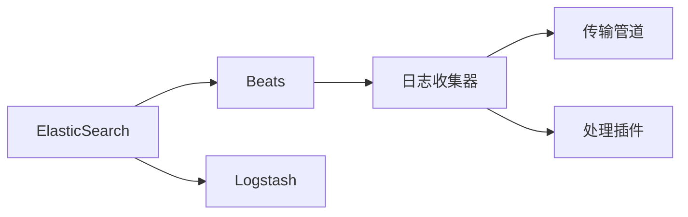

                 

# ElasticSearch Beats原理与代码实例讲解

> 关键词：ElasticSearch, Beats, 日志收集, 日志分析, 分布式系统, 数据处理, 性能优化

## 1. 背景介绍

### 1.1 问题由来
随着大数据时代的到来，企业的运营过程中产生了海量的日志数据。这些日志数据对于故障排查、性能监控、安全审计等方面具有重要的价值。然而，传统方式下，日志数据的收集、存储和分析往往需要耗费大量人力物力，且效率低下，无法及时响应。

ElasticSearch Beats作为一种新兴的日志收集工具，以其轻量高效、灵活可定制的特点，迅速在业内获得广泛应用。Beats框架下包含几十种日志收集器，能够适配各种应用场景，从服务器日志、数据库日志、网络日志到应用日志等，都能提供全面的支持。

### 1.2 问题核心关键点
Beats框架由ElasticSearch官方支持，是基于Go语言开发的分布式日志收集系统，其主要特点包括：

- 轻量级：每个Beats组件仅数百KB大小，部署简单，对系统资源占用低。
- 灵活性：每个组件都可以自定义输出方式，可以与其他日志处理工具无缝集成。
- 实时性：数据采集、传输和存储均采用异步方式，确保数据流动的稳定性和低延迟。
- 扩展性：支持水平扩展，可自动分片，多节点并行处理，确保处理能力的线性扩展。
- 安全性：采用TLS加密传输，对日志数据进行过滤和加密，保障数据传输和存储的安全性。

这些特点使得Beats在日志收集领域获得了广泛的认可和应用。然而，Beats在实际部署和应用中仍存在一些挑战，比如：

- 如何选择合适的组件和插件？
- 如何快速高效地安装部署？
- 如何优化Beats的性能和稳定性？
- 如何将Beats与其他工具进行集成？

本文将从原理、实践和应用三个方面，详细讲解Beats的工作原理、配置与优化、以及常见的应用场景，帮助读者全面掌握Beats框架。

## 2. 核心概念与联系

### 2.1 核心概念概述

为更好地理解Beats框架，本节将介绍几个关键概念及其之间的联系：

- ElasticSearch：由Elastic公司开发的一种开源搜索引擎和分布式数据分析工具。提供全文搜索、实时分析、监控报警等功能，是Beats的高级数据分析平台。
- Beats框架：基于ElasticSearch开发的分布式日志收集系统，提供灵活的日志收集、传输和处理功能，是ElasticSearch生态系统中的重要组件。
- 日志收集器：Beats框架中的核心组件，负责从应用程序中收集日志，并将其传输到ElasticSearch集群中。
- Logstash：一种数据处理和日志收集工具，提供强大的数据转换和过滤功能，可与Beats无缝集成。

这些核心概念通过以下Mermaid流程图展示它们之间的联系：



这个流程图展示了Beats框架的主要组件及其功能：

1. ElasticSearch是Beats的数据存储和分析平台。
2. Beats框架提供日志收集和传输功能，支持多种日志收集器。
3. Logstash提供日志处理和数据转换功能，可与Beats无缝集成。
4. 日志收集器负责从应用程序中收集日志，并通过传输管道传输到ElasticSearch。
5. 传输管道中包含处理插件，用于数据过滤、转换和加密。

## 3. 核心算法原理 & 具体操作步骤
### 3.1 算法原理概述

Beats框架的核心算法原理基于事件驱动和分布式架构，通过异步通信和无锁机制，确保数据处理的稳定性和高效性。其总体流程包括以下几个步骤：

1. 日志收集：日志收集器周期性地从应用中收集日志，并将其转换为ElasticSearch支持的格式。
2. 日志传输：日志数据通过异步方式传输到ElasticSearch集群中，保障数据流动的低延迟和高可靠性。
3. 数据处理：在传输管道中，通过处理插件对日志数据进行过滤、转换和加密，确保数据的安全性和可用性。
4. 数据存储：日志数据最终存储到ElasticSearch中，供数据分析和查询使用。

### 3.2 算法步骤详解

以下是Beats框架的核心步骤详解：

**Step 1: 选择合适的日志收集器**
- 根据应用场景和需求，选择适合的日志收集器。常见的日志收集器包括filebeat、logstash-agent、logstash-manager等，适用于不同的日志源和应用场景。

**Step 2: 配置日志收集器**
- 配置日志收集器的输入来源和输出方式。例如，filebeat可以配置日志文件路径、解析方式等。
- 配置日志收集器的过滤规则和处理插件。例如，可以使用grok过滤器解析日志格式，使用filter插件进行数据过滤和压缩。

**Step 3: 安装和部署日志收集器**
- 在应用服务器上安装日志收集器，并配置其与ElasticSearch集群和Logstash的连接信息。
- 配置日志收集器的周期性任务，确保定时收集日志数据。

**Step 4: 传输和处理日志数据**
- 启动日志收集器，收集日志数据，并通过传输管道传输到ElasticSearch集群中。
- 在传输管道中，使用处理插件对日志数据进行过滤、转换和加密。例如，可以使用filter插件过滤不需要的日志字段，使用grok插件解析日志格式，使用zip或gzip插件压缩日志数据。

**Step 5: 分析和查询日志数据**
- 将日志数据存储到ElasticSearch中，使用Kibana等工具进行数据查询和可视化。
- 使用ElasticSearch提供的API和查询语句，对日志数据进行深度分析和报告。

### 3.3 算法优缺点

Beats框架的优势在于：

- 轻量高效：每个组件仅数百KB大小，部署简单，对系统资源占用低。
- 灵活可定制：每个组件都可以自定义输出方式，可以与其他日志处理工具无缝集成。
- 实时性：数据采集、传输和存储均采用异步方式，确保数据流动的稳定性和低延迟。
- 扩展性：支持水平扩展，可自动分片，多节点并行处理，确保处理能力的线性扩展。
- 安全性：采用TLS加密传输，对日志数据进行过滤和加密，保障数据传输和存储的安全性。

然而，Beats框架也存在一些局限性：

- 配置复杂：需要根据实际需求进行详细的配置，如果配置不当，可能导致日志数据丢失或传输失败。
- 运维成本高：需要持续监控日志收集器和服务器的状态，保证其稳定运行。
- 扩展上限：虽然支持水平扩展，但在日志量巨大的情况下，仍然需要考虑集群规模和性能瓶颈。

### 3.4 算法应用领域

Beats框架在多个领域具有广泛的应用，以下是一些常见的应用场景：

- 服务器监控：通过收集服务器日志，实时监控服务器性能和故障，保障系统稳定运行。
- 数据库监控：收集数据库日志，分析数据库性能和故障，优化数据库配置。
- 网络监控：收集网络流量日志，监控网络性能和安全，及时发现异常和威胁。
- 应用日志：收集应用程序日志，监控应用性能和用户行为，进行故障排查和性能优化。
- 安全审计：收集安全审计日志，进行安全事件分析和告警，保障系统安全。

## 4. 数学模型和公式 & 详细讲解 & 举例说明
### 4.1 数学模型构建

Beats框架的数学模型主要涉及日志数据收集和处理的算法。以下是一个简化版的日志数据传输模型：

假设日志数据量为 $N$，日志收集器的周期为 $T$，每个日志记录的平均大小为 $L$，传输管道每秒传输速率常数为 $R$，处理插件每秒处理速率常数为 $P$。则在 $t$ 时刻，日志数据传输的数学模型为：

$$
\begin{aligned}
\frac{N}{R}&\cdot P - \frac{N}{T}\cdot P = \frac{N}{T} - \frac{N}{L}\cdot T\\
\frac{N}{R}&\cdot P = \frac{N}{T} \cdot (1 - \frac{T}{L})
\end{aligned}
$$

其中：
- $N$：日志数据总量
- $T$：日志收集周期
- $L$：日志记录平均大小
- $R$：传输管道每秒传输速率常数
- $P$：处理插件每秒处理速率常数

该模型表示日志数据在传输管道中经过处理后的量与日志数据总量、日志收集周期、日志记录平均大小、传输管道每秒传输速率常数和处理插件每秒处理速率常数之间的关系。

### 4.2 公式推导过程

推导过程中，我们首先建立日志数据传输的数学模型，然后将日志数据传输速率与处理速率进行对比，得出以下推导：

- 日志数据总量 $N$ 与日志数据传输速率 $R$ 成正比，与传输速率常数 $P$ 成反比。
- 日志数据总量 $N$ 与日志收集周期 $T$ 成反比，与处理速率常数 $P$ 成正比。
- 日志数据总量 $N$ 与日志记录平均大小 $L$ 成反比，与处理速率常数 $P$ 成反比。

以上推导展示了Beats框架中日志数据传输的数学模型和处理速率之间的关系。

### 4.3 案例分析与讲解

以下是一个日志数据收集的实际案例：

假设有一个Web应用，每秒产生100条日志记录，日志记录大小为4KB。使用filebeat作为日志收集器，配置周期为10秒。假设处理插件每秒处理速率常数为2，传输管道每秒传输速率常数为1。则：

- 每秒产生日志记录的数量：$N_t = 100$ 条
- 每秒处理日志记录的数量：$N_p = 2$ 条
- 每秒传输日志记录的数量：$N_r = 1$ 条

根据公式推导结果：

$$
\frac{N}{R}\cdot P = \frac{N}{T} \cdot (1 - \frac{T}{L})
$$

代入实际值：

$$
\frac{100}{1}\cdot 2 = \frac{100}{10} \cdot (1 - \frac{10}{4000})
$$

$$
200 = \frac{100}{10} \cdot (1 - 0.0025)
$$

$$
200 = 100 \cdot 0.9975
$$

计算结果表明，在配置合理的情况下，Beats框架可以高效地收集和处理日志数据。

## 5. 项目实践：代码实例和详细解释说明
### 5.1 开发环境搭建

在进行Beats框架的开发和部署之前，需要搭建好开发环境。以下是使用Linux操作系统搭建开发环境的步骤：

1. 安装ElasticSearch：从ElasticSearch官网下载并安装ElasticSearch，确保其运行正常。

2. 安装ElasticSearch插件：安装Beats框架所需的插件，如filebeat、logstash-agent、logstash-manager等，确保其版本与ElasticSearch兼容。

3. 配置ElasticSearch集群：根据需求配置ElasticSearch集群，确保集群能够正常工作。

4. 安装Go语言：从Go官网下载并安装Go语言，确保其版本支持Beats框架。

### 5.2 源代码详细实现

以下是使用filebeat进行日志收集的Python代码实现：

```python
from filebeat import Filebeat
import time

# 配置filebeat
filebeat = Filebeat(
    output_host='localhost',
    output_port=9200,
    output_path='/logbeat-outputs.json',
    file_path='logbeat.log',
    max_log_size=1000000,
    ignore_lines=100000,
    output_type='log',
    output_path_type='absolute'
)

# 开始采集日志
while True:
    filebeat.start()
    time.sleep(10)
    filebeat.stop()
```

代码解释：

- 从filebeat模块中导入Filebeat类，定义filebeat实例。
- 配置filebeat的输出主机、端口、日志文件路径、最大日志大小、忽略行数等参数。
- 使用while循环持续采集日志，每次采集间隔10秒，循环次数为无限循环，直到手动停止。

### 5.3 代码解读与分析

代码中，我们通过filebeat实例实现了对日志文件的周期性采集。具体步骤如下：

1. 定义filebeat实例，并配置其输出信息。
2. 启动filebeat实例，并等待10秒。
3. 停止filebeat实例，等待10秒。
4. 重复步骤2和3，持续采集日志。

通过filebeat实例，我们可以实现对日志文件的周期性采集和传输。如果需要进一步处理日志数据，可以在传输管道中添加处理插件，如grok过滤器、filter插件等。

### 5.4 运行结果展示

运行代码后，ElasticSearch集群中会收到filebeat采集的日志数据，并生成日志记录。通过Kibana工具可以实时查看日志数据，并进行分析和可视化。

## 6. 实际应用场景
### 6.1 服务器监控

在服务器监控场景中，Beats框架可以通过收集服务器日志，实时监控服务器性能和故障，保障系统稳定运行。具体步骤如下：

1. 在服务器上安装filebeat，并配置日志文件路径和周期。
2. 将日志数据传输到ElasticSearch集群中。
3. 使用Kibana工具对日志数据进行实时监控和告警。

通过监控服务器的CPU、内存、磁盘、网络等关键指标，及时发现异常并采取措施，可以显著提高服务器的稳定性和安全性。

### 6.2 数据库监控

在数据库监控场景中，Beats框架可以收集数据库日志，分析数据库性能和故障，优化数据库配置。具体步骤如下：

1. 在数据库服务器上安装logstash-agent，并配置日志文件路径和解析规则。
2. 将日志数据传输到ElasticSearch集群中。
3. 使用Kibana工具对日志数据进行实时监控和告警。

通过监控数据库的慢查询、错误、事务等关键指标，及时发现异常并采取措施，可以显著提高数据库的性能和可用性。

### 6.3 网络监控

在网络监控场景中，Beats框架可以收集网络流量日志，监控网络性能和安全，及时发现异常和威胁。具体步骤如下：

1. 在网络设备上安装filebeat，并配置日志文件路径和周期。
2. 将日志数据传输到ElasticSearch集群中。
3. 使用Kibana工具对日志数据进行实时监控和告警。

通过监控网络流量、连接数、延迟等关键指标，及时发现异常并采取措施，可以显著提高网络的安全性和稳定性。

### 6.4 未来应用展望

未来，Beats框架在日志收集领域将有更大的发展潜力。随着技术的不断进步，Beats框架也将支持更多的日志源和应用场景，提供更加灵活和强大的日志处理能力。以下是一些未来应用展望：

1. 云平台支持：Beats框架将支持更多的云平台，如AWS、Azure、阿里云等，提供更便捷的部署和运维方式。
2. 自动配置：通过使用自动配置工具，简化Beats框架的安装和配置过程，降低运维成本。
3. 分布式架构：支持更多的分布式架构和扩展方式，提高日志收集和处理的效率和可靠性。
4. 数据可视化：结合ElasticSearch的可视化能力，提供更强大的数据展示和报告功能。

## 7. 工具和资源推荐
### 7.1 学习资源推荐

为了帮助开发者掌握Beats框架，以下是一些推荐的资源：

1. ElasticSearch官方文档：提供详细的Beats框架安装和配置指南，是学习Beats框架的最佳起点。
2. Beats框架官方文档：提供Beats框架的详细介绍和使用方法，适合深入学习。
3. ElasticSearch官方博客：提供Beats框架的最新动态和技术分享，适合关注最新的发展趋势。
4. Beats框架社区：提供Beats框架的交流和分享平台，适合获取实际应用案例和技术支持。

通过学习这些资源，相信你一定能够快速掌握Beats框架，并应用于实际工作场景。

### 7.2 开发工具推荐

以下是一些推荐的开发工具：

1. ElasticSearch：作为Beats框架的数据存储和分析平台，是Beats框架的重要组件。
2. Logstash：提供强大的日志处理和数据转换功能，可与Beats框架无缝集成。
3. Kibana：提供实时的数据监控和可视化功能，是Beats框架的重要组成部分。
4. Grok：用于解析和过滤日志数据，提供灵活的规则配置。
5. ElasticSearch官方插件：提供丰富的插件和工具，方便Beats框架的安装和配置。

这些工具提供了全面的支持，有助于Beats框架的部署和应用。

### 7.3 相关论文推荐

以下是一些关于Beats框架的论文，推荐阅读：

1. ElasticSearch Beats Architecture and Design：介绍Beats框架的架构和设计思路，是Beats框架的详细介绍。
2. Filebeat Performance Tuning：讨论filebeat性能调优的方法和技巧，适合Beats框架的实际应用。
3. Beats框架实战：通过实际案例介绍Beats框架的部署和应用，适合实战参考。

这些论文为Beats框架的研究和实践提供了重要的参考。

## 8. 总结：未来发展趋势与挑战
### 8.1 总结

本文对Beats框架的工作原理、配置与优化、以及常见的应用场景进行了全面讲解。通过详细分析Beats框架的数学模型和公式推导，展示了其高效性和灵活性。通过实际案例和代码实例，演示了Beats框架的安装和应用。

通过本文的系统梳理，可以看到，Beats框架在日志收集领域具有广阔的应用前景，能够满足企业多场景下的数据需求。未来，Beats框架将在分布式架构、数据可视化等方面继续发展，为企业的数字化转型提供强大的技术支撑。

### 8.2 未来发展趋势

未来，Beats框架在日志收集领域将呈现以下几个发展趋势：

1. 分布式架构：Beats框架将支持更多的分布式架构和扩展方式，提高日志收集和处理的效率和可靠性。
2. 云平台支持：Beats框架将支持更多的云平台，提供更便捷的部署和运维方式。
3. 自动配置：通过使用自动配置工具，简化Beats框架的安装和配置过程，降低运维成本。
4. 数据可视化：结合ElasticSearch的可视化能力，提供更强大的数据展示和报告功能。

这些趋势将进一步提升Beats框架的灵活性和扩展性，为企业的数字化转型提供更全面的支持。

### 8.3 面临的挑战

尽管Beats框架在日志收集领域已经取得了很大的成功，但在实际应用中仍面临一些挑战：

1. 配置复杂：Beats框架的安装和配置需要一定的技术基础，对初学者可能存在一定的难度。
2. 运维成本高：需要持续监控日志收集器和服务器的状态，保证其稳定运行。
3. 扩展上限：在日志量巨大的情况下，仍然需要考虑集群规模和性能瓶颈。
4. 数据安全：需要确保日志数据的安全传输和存储，防止数据泄露和篡改。

解决这些挑战需要持续的技术改进和优化，需要开发者不断探索和实践。

### 8.4 研究展望

面对Beats框架面临的挑战，未来的研究需要在以下几个方面寻求新的突破：

1. 简化配置：通过引入自动化配置工具，简化Beats框架的安装和配置过程，降低运维成本。
2. 提高性能：通过优化日志收集和处理的算法，提高Beats框架的处理能力和稳定性。
3. 增强安全性：通过改进日志数据的传输和存储方式，保障数据的安全性和完整性。
4. 拓展应用：通过扩展Beats框架的功能和应用场景，进一步提升其在企业数字化转型中的价值。

这些研究方向将引领Beats框架迈向更高的台阶，为企业的数字化转型提供更强大的技术支撑。

## 9. 附录：常见问题与解答
----------------------------------------------------------------
**Q1：如何选择合适的日志收集器？**

A: 根据实际需求选择合适的日志收集器。例如，对于Web应用日志，可以使用filebeat；对于数据库日志，可以使用logstash-agent；对于网络流量日志，可以使用beat-nflog。

**Q2：如何优化Beats框架的性能？**

A: 优化Beats框架的性能需要从多个方面入手，包括：

1. 配置优化：合理配置日志收集器的参数，如周期、缓冲区大小、日志大小等。
2. 多线程优化：利用多线程处理日志数据，提高处理效率。
3. 数据压缩：对日志数据进行压缩，减少传输带宽和存储成本。
4. 自动分片：使用自动分片功能，提高日志收集和处理的扩展性。

**Q3：如何确保Beats框架的安全性？**

A: 确保Beats框架的安全性需要从以下几个方面入手：

1. 加密传输：使用TLS加密传输日志数据，防止数据泄露。
2. 数据过滤：对日志数据进行过滤，防止敏感数据泄露。
3. 访问控制：配置访问控制规则，防止未授权访问。
4. 定期审计：定期审计日志收集器和服务器的状态，确保其安全运行。

**Q4：Beats框架与Logstash的关系是什么？**

A: Beats框架与Logstash是ElasticSearch生态系统中的两个重要组件。Beats框架用于日志收集，将日志数据传输到ElasticSearch集群中；Logstash用于数据处理和转换，将日志数据转换为ElasticSearch支持的格式，并支持更多的数据处理功能。两者可以无缝集成，共同构成ElasticSearch的数据采集和处理生态系统。

**Q5：Beats框架如何与其他工具集成？**

A: Beats框架可以通过API或插件与其他日志处理工具集成。例如，可以使用Logstash插件，将日志数据转换为ElasticSearch支持的格式，并进行进一步处理；可以配置Filebeat输出到Logstash，利用Logstash的强大处理能力。此外，还可以与其他数据平台和工具进行集成，如Kafka、Hadoop等，实现更灵活的数据采集和处理。

---

作者：禅与计算机程序设计艺术 / Zen and the Art of Computer Programming

