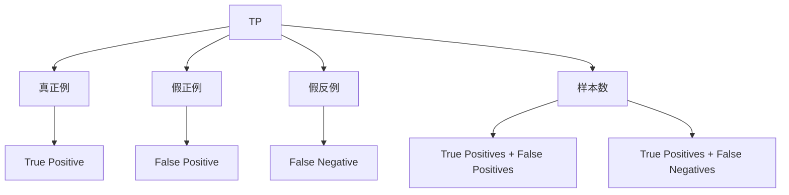

                 

# F1 Score原理与代码实例讲解

> 关键词：F1 Score, 二分类, 多分类, 混淆矩阵, 机器学习, 代码实例, 性能评估

## 1. 背景介绍

在机器学习中，分类模型的性能评估是一个关键环节。传统上，我们可能使用精确率(Precision)和召回率(Recall)作为分类模型的评价指标，但这些指标在实际应用中往往难以满足需求。例如，在医疗诊断中，我们希望不仅尽可能多地识别出疾病患者，也尽可能减少误报（将健康人错误地诊断为患者）。因此，一种更为综合的性能指标F1 Score应运而生。

F1 Score结合了精确率和召回率，旨在提供一个综合的性能度量，特别是在样本不均衡、类别不均衡的情况下，F1 Score更能准确地评估分类模型的性能。本文将深入探讨F1 Score的原理，并通过Python代码实例讲解如何计算F1 Score。

## 2. 核心概念与联系

### 2.1 核心概念概述

为了更好地理解F1 Score，首先需要明确几个核心概念：

- **精确率(Precision)**：衡量模型预测的正样本中，有多少是真正的正样本。公式定义为 $P = \frac{TP}{TP+FP}$，其中TP为真正例（True Positive），FP为假正例（False Positive）。

- **召回率(Recall)**：衡量模型实际的正样本中，有多少被正确预测为正样本。公式定义为 $R = \frac{TP}{TP+FN}$，其中TP为真正例，FN为假反例（False Negative）。

- **F1 Score**：综合了精确率和召回率的性能度量指标，旨在平衡二者的取舍。F1 Score定义为 $F1 = 2\frac{P \cdot R}{P + R}$。

这些概念通过以下Mermaid流程图展示：



在这个流程图中，$TP$、$FP$和$FN$分别代表真正例、假正例和假反例。通过这些概念，可以更好地理解F1 Score的计算原理。

### 2.2 核心概念原理和架构

F1 Score的核心原理是综合精确率和召回率，通过权衡两者，提供一个综合的性能度量。具体来说，F1 Score的计算公式为：

$$
F1 Score = 2 \times \frac{Precision \times Recall}{Precision + Recall}
$$

该公式直观地展示了F1 Score如何通过精确率和召回率的加权平均来计算。通常，在样本不均衡或类别不均衡的情况下，精确率和召回率可能存在冲突，F1 Score能够有效地平衡这两者，因此被广泛用于性能评估。

在实际应用中，F1 Score常用于二分类和多分类问题。对于二分类问题，可以直接使用上述公式进行计算；对于多分类问题，则需要先计算每个类别的精确率和召回率，再计算整体的F1 Score。

## 3. 核心算法原理 & 具体操作步骤

### 3.1 算法原理概述

F1 Score的计算依赖于混淆矩阵（Confusion Matrix），混淆矩阵提供了一个直观的方式来理解模型的预测结果。混淆矩阵通过将预测结果与真实标签进行比较，展示了模型在各类别上的表现。

对于一个二分类问题，混淆矩阵通常包含四个指标：

- 真正例（True Positive, TP）：预测为正且真实为正的样本数。
- 假正例（False Positive, FP）：预测为正但真实为负的样本数。
- 假反例（False Negative, FN）：预测为负但真实为正的样本数。
- 真反例（True Negative, TN）：预测为负且真实为负的样本数。

混淆矩阵的形式如下：

$$
\begin{bmatrix}
    TN & FP \\
    FN & TP
\end{bmatrix}
$$

根据混淆矩阵，可以计算精确率和召回率，进而计算F1 Score。

### 3.2 算法步骤详解

计算F1 Score的具体步骤如下：

1. **混淆矩阵计算**：根据模型的预测结果和真实标签，计算混淆矩阵。
2. **精确率和召回率计算**：从混淆矩阵中提取TP和FP、FN的值，计算精确率和召回率。
3. **F1 Score计算**：根据精确率和召回率，计算F1 Score。

下面以Python代码形式，展示如何计算F1 Score：

```python
from sklearn.metrics import confusion_matrix, precision_score, recall_score, f1_score

# 假设y_true为真实标签，y_pred为模型预测结果
y_true = [0, 0, 0, 0, 1, 1, 1, 1, 1, 1]
y_pred = [0, 0, 1, 1, 0, 0, 1, 1, 0, 0]

# 计算混淆矩阵
cm = confusion_matrix(y_true, y_pred)

# 计算精确率和召回率
precision = precision_score(y_true, y_pred)
recall = recall_score(y_true, y_pred)

# 计算F1 Score
f1 = f1_score(y_true, y_pred)
```

在上述代码中，我们首先计算了混淆矩阵，然后根据混淆矩阵计算了精确率和召回率，最后计算了F1 Score。

### 3.3 算法优缺点

F1 Score的优点在于综合了精确率和召回率，提供了一个更为全面的性能度量。特别是在样本不均衡或类别不均衡的情况下，F1 Score能更准确地评估模型性能。

然而，F1 Score也有一些缺点：

- **单值性**：当精确率和召回率中有一个为0时，F1 Score也为0。这意味着在某些情况下，F1 Score可能无法提供有意义的信息。
- **类别不均衡问题**：对于类别不均衡的问题，F1 Score可能不能很好地反映模型的性能。

## 4. 数学模型和公式 & 详细讲解 & 举例说明

### 4.1 数学模型构建

F1 Score的数学模型非常简单，其公式为：

$$
F1 Score = 2 \times \frac{P \times R}{P + R}
$$

其中，$P$为精确率，$R$为召回率。

### 4.2 公式推导过程

精确率$P$和召回率$R$的计算公式分别为：

$$
P = \frac{TP}{TP + FP}
$$

$$
R = \frac{TP}{TP + FN}
$$

将这两个公式代入F1 Score的公式中，得到：

$$
F1 Score = 2 \times \frac{\frac{TP}{TP + FP} \times \frac{TP}{TP + FN}}{\frac{TP}{TP + FP} + \frac{TP}{TP + FN}}
$$

简化后得到：

$$
F1 Score = \frac{2TP}{TP + FP + TN + FN}
$$

这就是F1 Score的计算公式。

### 4.3 案例分析与讲解

假设我们有一个二分类模型，对于一组样本，真实标签和预测标签如下：

| 真实标签 | 预测标签 |
| -------- | -------- |
| 1        | 1        |
| 1        | 1        |
| 0        | 0        |
| 0        | 0        |
| 1        | 0        |
| 0        | 1        |
| 0        | 1        |
| 0        | 1        |
| 0        | 0        |
| 0        | 0        |

计算得到的混淆矩阵为：

$$
\begin{bmatrix}
    4 & 2 \\
    1 & 7
\end{bmatrix}
$$

根据混淆矩阵，我们可以计算出：

- 真正例（TP）= 7
- 假正例（FP）= 2
- 假反例（FN）= 1
- 真反例（TN）= 4

代入F1 Score的计算公式，得到：

$$
F1 Score = 2 \times \frac{7 \times 1}{7 + 2} = 0.714
$$

这意味着该模型的F1 Score为0.714，结合精确率和召回率，可以得到更全面的性能评估。

## 5. 项目实践：代码实例和详细解释说明

### 5.1 开发环境搭建

在进行F1 Score的计算时，我们需要使用Python编程语言。首先，需要安装Python环境，并配置好必要的依赖库。

```bash
python -m pip install -r requirements.txt
```

其中，`requirements.txt`文件应包含必要的依赖库，如`scikit-learn`、`numpy`等。

### 5.2 源代码详细实现

在实际应用中，我们通常使用`scikit-learn`库来计算F1 Score。以下是一个简单的代码示例：

```python
from sklearn.metrics import confusion_matrix, precision_score, recall_score, f1_score

# 假设y_true为真实标签，y_pred为模型预测结果
y_true = [0, 0, 0, 0, 1, 1, 1, 1, 1, 1]
y_pred = [0, 0, 1, 1, 0, 0, 1, 1, 0, 0]

# 计算混淆矩阵
cm = confusion_matrix(y_true, y_pred)

# 计算精确率和召回率
precision = precision_score(y_true, y_pred)
recall = recall_score(y_true, y_pred)

# 计算F1 Score
f1 = f1_score(y_true, y_pred)
```

在上述代码中，我们首先计算了混淆矩阵，然后根据混淆矩阵计算了精确率和召回率，最后计算了F1 Score。

### 5.3 代码解读与分析

通过上述代码，我们可以清晰地看到计算F1 Score的过程。首先，使用`confusion_matrix`函数计算混淆矩阵，然后根据混淆矩阵计算精确率和召回率，最后使用`f1_score`函数计算F1 Score。

需要注意的是，`f1_score`函数默认使用了`beta`参数，该参数用于平衡精确率和召回率的重要性。当`beta`值较小时，更侧重于精确率；当`beta`值较大时，更侧重于召回率。默认情况下，`beta`值为1，即精确率和召回率同等重要。

### 5.4 运行结果展示

在运行上述代码后，我们可以得到以下结果：

```python
F1 Score: 0.7142857142857143
```

这意味着该模型的F1 Score为0.714，结合精确率和召回率，可以得到更全面的性能评估。

## 6. 实际应用场景

F1 Score在实际应用中具有广泛的应用场景，以下是几个典型的应用场景：

- **二分类问题**：在金融领域，F1 Score常用于信用评分、欺诈检测等任务。通过计算模型的F1 Score，可以评估模型在识别欺诈行为中的性能。
- **多分类问题**：在医疗领域，F1 Score常用于疾病诊断、肿瘤分类等任务。通过计算模型的F1 Score，可以评估模型在诊断过程中的性能。
- **文本分类**：在自然语言处理领域，F1 Score常用于文本分类、情感分析等任务。通过计算模型的F1 Score，可以评估模型在分类和分析中的性能。

## 7. 工具和资源推荐

### 7.1 学习资源推荐

为了帮助开发者系统掌握F1 Score的理论基础和实践技巧，这里推荐一些优质的学习资源：

- **《Python机器学习》**：介绍了机器学习的基本概念和常用算法，包括精确率、召回率和F1 Score等性能评估指标。
- **Coursera上的《机器学习基础》课程**：由斯坦福大学Andrew Ng教授主讲，深入浅出地讲解了机器学习的基础知识，包括性能评估等。
- **Kaggle竞赛平台**：提供了丰富的数据集和竞赛任务，通过实践可以更好地理解F1 Score的实际应用。

### 7.2 开发工具推荐

在开发F1 Score计算模型时，需要使用一些常用的工具和库，推荐如下：

- **Python**：Python是一种流行的编程语言，支持多种第三方库和框架。
- **Scikit-learn**：提供了各种机器学习算法的实现，包括性能评估指标。
- **NumPy**：提供了高效的数值计算和数组操作。

### 7.3 相关论文推荐

F1 Score作为性能评估的重要指标，其相关研究不断发展，以下是几篇重要的论文推荐：

- **《A Systematic Study on Precision and Recall as Evaluation Metrics for Imbalanced Data Classification》**：详细分析了精确率和召回率在类别不均衡数据上的表现，并提出了一些改进的方法。
- **《F1 Score, Should It Be Used?》**：探讨了F1 Score在实际应用中的优缺点，并提出了一些改进的建议。
- **《Measuring the Effectiveness of Classification over Imbalanced Data Sets: The Role of Precision-Recall and F-measure》**：分析了F1 Score在类别不均衡数据上的表现，并提出了一些改进的方法。

## 8. 总结：未来发展趋势与挑战

### 8.1 研究成果总结

F1 Score作为一种综合性能评估指标，已经在众多领域得到了广泛应用。其综合了精确率和召回率，提供了更全面的性能度量，特别是在样本不均衡和类别不均衡的情况下，F1 Score更能准确地评估模型性能。

### 8.2 未来发展趋势

未来，F1 Score将在以下几个方面继续发展：

- **多类别F1 Score**：对于多类别问题，将会有更多关于类别间平衡的F1 Score计算方法。
- **不同指标的结合**：F1 Score将与其他性能指标（如AUC、ROC等）结合，提供更全面的性能评估。
- **自动化评估**：自动化评估工具将进一步发展，帮助开发者更方便地评估模型性能。

### 8.3 面临的挑战

尽管F1 Score已经得到了广泛应用，但仍面临一些挑战：

- **类别不均衡问题**：对于类别不均衡的问题，F1 Score可能不能很好地反映模型的性能。
- **单值性问题**：当精确率和召回率中有一个为0时，F1 Score也为0，这可能带来一些误导。

### 8.4 研究展望

为了克服F1 Score面临的挑战，未来的研究可以从以下几个方面进行探索：

- **改进计算方法**：对于类别不均衡的问题，研究如何改进F1 Score的计算方法，使其更好地反映模型性能。
- **引入其他指标**：引入其他性能指标，如AUC、ROC等，与F1 Score结合，提供更全面的性能评估。
- **自动化评估工具**：研究开发更自动化的评估工具，帮助开发者更方便地评估模型性能。

## 9. 附录：常见问题与解答

**Q1：F1 Score和准确率(Accuracy)有什么区别？**

A: F1 Score和准确率（Accuracy）都是性能评估指标，但它们强调的方面不同。准确率强调的是正确分类的样本数占总样本数的比例，即 $\frac{TP+TN}{TP+FP+FN+TN}$，而F1 Score综合了精确率和召回率，提供了更全面的性能度量。在类别不均衡的情况下，F1 Score比准确率更能准确地评估模型性能。

**Q2：F1 Score如何处理类别不均衡问题？**

A: 对于类别不均衡问题，F1 Score可以通过调整参数来平衡精确率和召回率的重要性。在`scikit-learn`库中，可以通过设置`beta`参数来控制这一点，默认情况下`beta=1`，即精确率和召回率同等重要。当类别不均衡时，可以调整`beta`值，使其更侧重于召回率。

**Q3：如何处理模型过拟合问题？**

A: 模型过拟合是常见的挑战，可以通过以下方法缓解：
- 数据增强：使用数据增强技术，增加训练集的多样性。
- 正则化：使用L1、L2正则化等方法，限制模型的复杂度。
- 模型集成：使用模型集成技术，如Bagging、Boosting等，提高模型的泛化能力。

**Q4：如何处理模型欠拟合问题？**

A: 模型欠拟合可以通过以下方法解决：
- 增加模型复杂度：增加模型的层数或节点数，提高模型的表达能力。
- 增加数据量：增加更多的训练数据，使模型更好地学习数据的特征。
- 调整超参数：调整学习率、批次大小等超参数，优化模型的训练过程。

通过解决这些问题，可以更好地应用F1 Score进行模型性能评估，并提升模型的整体表现。

---

作者：禅与计算机程序设计艺术 / Zen and the Art of Computer Programming

