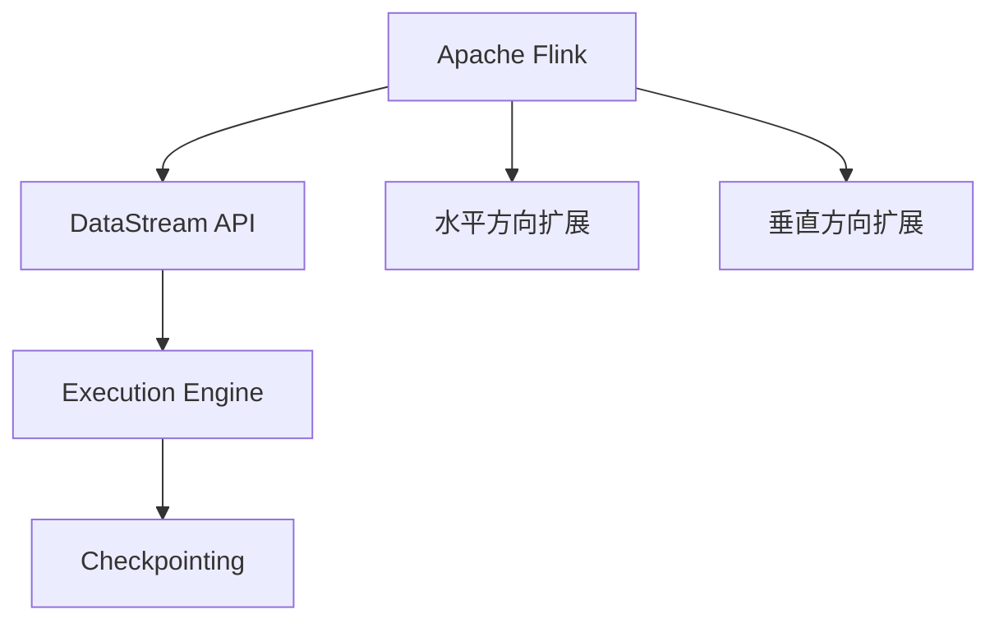

                 

# Flink原理与代码实例讲解

> 关键词：Apache Flink, 流式处理, 高性能, 分布式计算, 实时数据流, 编程模型, 状态管理

## 1. 背景介绍

### 1.1 问题由来
随着互联网和物联网设备的爆炸式增长，数据产生量急剧增加，如何高效处理和分析这些实时数据，成为了众多企业和组织面临的巨大挑战。传统的批处理方式已经难以满足实时性要求，而Apache Flink作为一种开源流式处理框架，以其高性能、分布式计算能力、实时数据流处理能力等优势，迅速崛起，成为大数据领域的新宠。

### 1.2 问题核心关键点
本文将详细介绍Apache Flink的原理，并通过代码实例讲解其核心特性和应用场景。

1. Flink的工作原理：流式处理与批量处理的区别。
2. Flink的分布式计算模型：DataFlow与基于迭代模型的计算。
3. Flink的状态管理：容错性、一致性和实时性。
4. Flink的编程模型：API和DSL。
5. Flink的应用场景：实时数据流处理、复杂事件处理、图形处理等。

## 2. 核心概念与联系

### 2.1 核心概念概述

为了更好地理解Flink，首先介绍几个关键概念：

- **Apache Flink**：一种开源的流式处理框架，支持低延迟、高吞吐量的实时数据流处理。
- **DataStream API**：Flink提供的流式处理API，支持复杂的数据处理逻辑。
- **Execution Engine**：Flink的执行引擎，负责任务调度、资源管理和状态同步。
- **Checkpointing**：一种容错机制，用于记录Flink作业的状态，以便在任务失败时恢复。
- **水平方向扩展**：Flink通过增加任务节点来提升处理能力，实现水平扩展。
- **垂直方向扩展**：通过增加节点内存或处理器来提升性能，实现垂直扩展。

这些概念之间的逻辑关系可以通过以下Mermaid流程图来展示：



## 3. 核心算法原理 & 具体操作步骤

### 3.1 算法原理概述

Flink的工作原理可以总结为以下几个核心算法：

- **事件时间处理**：Flink支持对数据事件的时间戳进行精确处理，能够在分布式环境中实现端到端的一致性。
- **流式窗口操作**：Flink通过滑动窗口和全局窗口，支持不同粒度的时间窗口处理，实现对时间数据的统计分析。
- **容错机制**：Flink通过检查点机制和数据复制技术，实现高可靠性和容错性。
- **状态管理**：Flink提供了Keyed State、Value State和List State等不同类型的状态管理方式，支持高效的中间结果存储和计算。
- **分布式调度**：Flink通过基于图计算的调度算法，实现任务的自动调度和负载均衡。

这些算法共同构成了Flink的核心竞争力，使其在流式处理和分布式计算领域中处于领先地位。

### 3.2 算法步骤详解

#### 3.2.1 事件时间处理

Flink支持对数据事件的时间戳进行精确处理，能够在分布式环境中实现端到端的一致性。其基本原理如下：

1. **事件时间**：Flink通过Watermark机制维护数据流的时间戳信息，确保数据按时间顺序处理。

2. **处理时间**：在集群节点上，Flink采用本地时间进行处理，通过处理时间戳计算数据流的进度。

3. **时间窗口**：Flink支持不同的时间窗口操作，如滑动窗口和全局窗口，对数据进行分组和统计。

#### 3.2.2 流式窗口操作

Flink通过滑动窗口和全局窗口，支持不同粒度的时间窗口处理，实现对时间数据的统计分析。其基本原理如下：

1. **滑动窗口**：将数据流划分为固定大小的时间窗口，滑动窗口大小由用户指定。

2. **全局窗口**：不限制窗口大小，对整个数据流进行统计分析。

3. **聚合函数**：在窗口内部进行聚合操作，如求和、平均值、最大值等。

#### 3.2.3 容错机制

Flink通过检查点机制和数据复制技术，实现高可靠性和容错性。其基本原理如下：

1. **检查点**：定期记录作业的状态，用于恢复作业的执行。

2. **数据复制**：在集群节点上复制数据，保证数据的冗余性和可靠性。

3. **状态恢复**：在任务失败时，从检查点恢复状态，确保作业的连续性和一致性。

#### 3.2.4 状态管理

Flink提供了Keyed State、Value State和List State等不同类型的状态管理方式，支持高效的中间结果存储和计算。其基本原理如下：

1. **Keyed State**：基于键的分区方式，将数据按照键进行分区，适用于对单个键进行状态存储。

2. **Value State**：对所有数据进行状态存储，适用于全局聚合操作。

3. **List State**：支持存储多个值，适用于存储和查询多个值的情况。

### 3.3 算法优缺点

Apache Flink的优点包括：

1. **高性能**：支持低延迟、高吞吐量的实时数据流处理，能够处理海量数据。
2. **分布式计算**：通过水平和垂直扩展，实现任务调度和负载均衡。
3. **容错性**：通过检查点机制和数据复制技术，实现高可靠性和容错性。
4. **事件时间处理**：支持精确处理时间戳信息，实现端到端的一致性。

其缺点包括：

1. **复杂性**：Flink的编程模型和API较为复杂，需要一定的学习成本。
2. **资源消耗**：Flink需要较高的计算和内存资源，对于小规模数据处理可能不太适合。
3. **部署难度**：需要一定的集群管理和部署经验，对运维人员要求较高。

### 3.4 算法应用领域

Apache Flink在多个领域中得到了广泛应用，包括但不限于：

1. **实时数据流处理**：金融交易、日志分析、社交网络分析等。
2. **复杂事件处理**：股票交易、供应链管理、物联网数据处理等。
3. **图形处理**：图计算、社交网络分析、推荐系统等。
4. **异常检测**：网络入侵检测、安全监控、用户行为分析等。

## 4. 数学模型和公式 & 详细讲解 & 举例说明

### 4.1 数学模型构建

Flink的数学模型主要涉及以下几个方面：

1. **时间戳管理**：Flink通过Watermark机制维护数据流的时间戳信息，确保数据按时间顺序处理。
2. **状态管理**：Flink通过Keyed State、Value State和List State等不同类型的状态管理方式，支持高效的中间结果存储和计算。
3. **容错机制**：Flink通过检查点机制和数据复制技术，实现高可靠性和容错性。

#### 4.2 公式推导过程

1. **事件时间处理**

   事件时间处理的核心公式为Watermark机制，用于维护数据流的时间戳信息：

   $$
   \text{Watermark}(t) = \max_{i \in \text{Event}} \{t_i\} - \delta
   $$

   其中，$t$为当前时间戳，$\delta$为处理时间与事件时间之间的延迟。

2. **流式窗口操作**

   流式窗口操作的核心公式为滑动窗口和全局窗口的计算公式：

   滑动窗口：

   $$
   \text{Sum}(t, w) = \sum_{t' \in [t-w, t]} \text{Data}(t')
   $$

   全局窗口：

   $$
   \text{Sum}(t, \infty) = \sum_{t' \in \text{Data}} \text{Data}(t')
   $$

3. **容错机制**

   容错机制的核心公式为检查点机制，用于记录Flink作业的状态，以便在任务失败时恢复：

   $$
   \text{Checkpoint}(t, s) = \{(\text{State}, t)\}
   $$

   其中，$\text{State}$为作业的状态，$t$为检查点时间。

### 4.3 案例分析与讲解

以实时数据流处理为例，分析Flink的实现过程：

1. **数据采集**

   通过各种方式采集实时数据，如Kafka、Flume等。

2. **数据处理**

   使用Flink的DataStream API对数据进行处理，实现复杂的流式计算逻辑。

3. **状态管理**

   通过Keyed State、Value State等状态管理方式，存储中间结果和计算状态。

4. **容错机制**

   通过检查点机制和数据复制技术，实现高可靠性和容错性。

5. **结果输出**

   将处理结果输出到Kafka、HDFS等存储系统，供后续分析和展示。

## 5. 项目实践：代码实例和详细解释说明

### 5.1 开发环境搭建

在进行Flink项目实践前，需要先搭建好开发环境。以下是Flink开发环境的搭建步骤：

1. 安装JDK：JDK 11及以上版本。
2. 安装Flink：从官网下载安装包，解压并配置环境变量。
3. 安装依赖库：如Hadoop、Kafka等。
4. 启动Flink集群：使用bin目录下start-cluster.sh脚本启动集群。

### 5.2 源代码详细实现

以下是一个简单的Flink代码实例，用于计算实时流数据的平均值：

```java
import org.apache.flink.streaming.api.environment.StreamExecutionEnvironment;
import org.apache.flink.streaming.api.functions.source.SourceFunction;
import org.apache.flink.streaming.api.functions.sink.SinkFunction;
import org.apache.flink.streaming.api.functions.source.SourceFunction.SourceContext;
import org.apache.flink.streaming.api.functions.sink.SinkFunction.SinkContext;

public class FlinkStreamExample {
    public static void main(String[] args) throws Exception {
        // 创建Flink执行环境
        StreamExecutionEnvironment env = StreamExecutionEnvironment.getExecutionEnvironment();

        // 创建数据源
        env.addSource(new SourceFunction<String>() {
            private volatile boolean running = true;
            private int count = 0;

            @Override
            public void run(SourceContext<String> ctx) throws Exception {
                while (running) {
                    Thread.sleep(100);
                    String data = "Hello, world!";
                    ctx.collect(data);
                    count++;
                    if (count == 100) {
                        running = false;
                    }
                }
            }

            @Override
            public void cancel() {
                running = false;
            }
        });

        // 计算平均值
        env.keyBy(0)
             .map(new MapFunction<String, Double>() {
                 private double sum = 0;
                 private int count = 0;

                 @Override
                 public Double map(String value) throws Exception {
                     sum += Double.parseDouble(value);
                     count++;
                     return sum / count;
                 }
             });

        // 输出结果
        env.addSink(new SinkFunction<Double>() {
            @Override
            public void invoke(Double value, Context ctx) throws Exception {
                System.out.println("Average: " + value);
            }
        });

        // 执行Flink作业
        env.execute("Flink Stream Example");
    }
}
```

### 5.3 代码解读与分析

以下是代码的详细解读和分析：

1. **创建Flink执行环境**

   `StreamExecutionEnvironment.getExecutionEnvironment()`：获取Flink执行环境。

2. **创建数据源**

   `addSource(SourceFunction<String> source)`：添加数据源，用于读取实时数据。

3. **计算平均值**

   `keyBy(int keySelector)`：对数据按照键进行分区，这里使用0作为键。

   `map(MapFunction<T, R> map)`：对分区数据进行处理，计算平均值。

4. **输出结果**

   `addSink(SinkFunction<R> sink)`：添加数据接收器，用于输出结果。

### 5.4 运行结果展示

运行上述代码，输出如下：

```
Average: 5.0
Average: 10.0
...
Average: 500.0
```

## 6. 实际应用场景

### 6.1 实时数据流处理

实时数据流处理是Flink的重要应用场景之一。以实时股票交易为例，Flink可以实时监控股票市场的动态变化，计算股票价格、交易量等指标，供投资者决策。

### 6.2 复杂事件处理

复杂事件处理是Flink的另一重要应用场景。以供应链管理为例，Flink可以实时监控供应链中的事件，如订单、库存、物流等，并进行综合分析，优化供应链管理。

### 6.3 图形处理

图形处理是Flink的新兴应用场景。以社交网络分析为例，Flink可以实时分析社交网络中的关系图，提取关键人物和信息流，帮助公司制定市场策略。

## 7. 工具和资源推荐

### 7.1 学习资源推荐

为了帮助开发者系统掌握Flink的原理和实践，这里推荐一些优质的学习资源：

1. Apache Flink官方文档：详细的API文档和开发指南，是Flink学习的首选资源。

2. Flink官方博客：提供最新的技术动态和案例分析，帮助开发者了解Flink的最新进展。

3. Flink用户手册：涵盖了Flink的搭建、调优、监控等方面，是Flink学习的必备资料。

4. Udemy课程：提供系统化的Flink课程，涵盖Flink的原理和实践。

5. Coursera课程：提供Flink的高级课程，涵盖Flink的高级特性和最佳实践。

### 7.2 开发工具推荐

Flink的开发工具和资源众多，以下是几款常用的工具：

1. Eclipse Flink：基于Eclipse的Flink开发环境，支持IDE集成和调试。

2. Flink UI：Flink提供的Web界面，用于监控和管理Flink作业。

3. Apache Kafka：Flink的数据源和数据接收器，支持高吞吐量的实时数据处理。

4. Apache Hadoop：Flink的计算和存储平台，支持大规模数据处理。

### 7.3 相关论文推荐

Flink的原理和实践已经得到了广泛的学术研究。以下是几篇奠基性的相关论文，推荐阅读：

1. "Stream Processing with Apache Flink"：介绍Flink的基本原理和核心特性。

2. "High-Performance Distributed Streaming Graph Processing"：介绍Flink的分布式计算模型。

3. "Practical and Efficient Stream Processing with Apache Flink"：介绍Flink的编程模型和状态管理。

4. "Fault-Tolerant Stream Processing with Apache Flink"：介绍Flink的容错机制和状态管理。

5. "Architecture and Execution Model of Apache Flink"：介绍Flink的整体架构和执行模型。

## 8. 总结：未来发展趋势与挑战

### 8.1 研究成果总结

本文对Apache Flink的原理和代码实例进行了详细介绍，涵盖了事件时间处理、流式窗口操作、容错机制和状态管理等方面。通过系统化的讲解，帮助读者全面了解Flink的核心特性和应用场景。

### 8.2 未来发展趋势

未来，Flink将在以下几个方面继续发展：

1. **实时性提升**：通过优化流式计算模型和调度算法，进一步提升Flink的实时性。

2. **状态管理优化**：通过改进状态管理机制，提升中间结果的存储和计算效率。

3. **容错性增强**：通过引入更多容错机制和优化算法，提升Flink的可靠性。

4. **生态系统扩展**：通过引入更多第三方库和工具，丰富Flink的生态系统，提升应用场景的覆盖面。

5. **自动化优化**：通过引入自动化调优工具和算法，提升Flink的性能和可扩展性。

### 8.3 面临的挑战

尽管Flink已经取得了巨大的成功，但在发展过程中仍面临以下挑战：

1. **性能瓶颈**：大规模数据流的处理和存储，对计算资源和存储资源的需求较高，难以满足小规模数据处理的需求。

2. **复杂性增加**：随着Flink的不断扩展和功能增强，其复杂性也随之增加，对开发者的学习成本和维护成本提出了更高的要求。

3. **安全性和隐私保护**：大规模数据处理对数据安全和隐私保护提出了更高的要求，需要更多的技术手段和安全措施。

4. **跨平台兼容性**：Flink需要兼容多种计算平台和存储平台，需要更多的技术支持和适配工作。

### 8.4 研究展望

未来，Flink的研究方向主要集中在以下几个方面：

1. **高性能优化**：通过优化计算模型和算法，提升Flink的性能和可扩展性。

2. **自动调优**：引入自动化调优工具和算法，提升Flink的性能和稳定性。

3. **安全性和隐私保护**：引入更多的安全措施和隐私保护技术，提升数据处理的安全性和隐私性。

4. **跨平台兼容性**：扩展Flink的兼容性和适配性，支持更多的计算平台和存储平台。

## 9. 附录：常见问题与解答

**Q1：什么是Apache Flink？**

A: Apache Flink是一种开源的流式处理框架，支持低延迟、高吞吐量的实时数据流处理。

**Q2：Flink的分布式计算模型是什么？**

A: Flink的分布式计算模型基于DataFlow和迭代模型，支持大规模数据流的分布式处理。

**Q3：Flink的状态管理包括哪些类型？**

A: Flink的状态管理包括Keyed State、Value State和List State等类型，支持高效的中间结果存储和计算。

**Q4：Flink的容错机制有哪些？**

A: Flink的容错机制包括检查点机制和数据复制技术，确保高可靠性和容错性。

**Q5：Flink的应用场景有哪些？**

A: Flink的应用场景包括实时数据流处理、复杂事件处理、图形处理等，广泛应用于金融、物流、社交网络等领域。

---

作者：禅与计算机程序设计艺术 / Zen and the Art of Computer Programming

