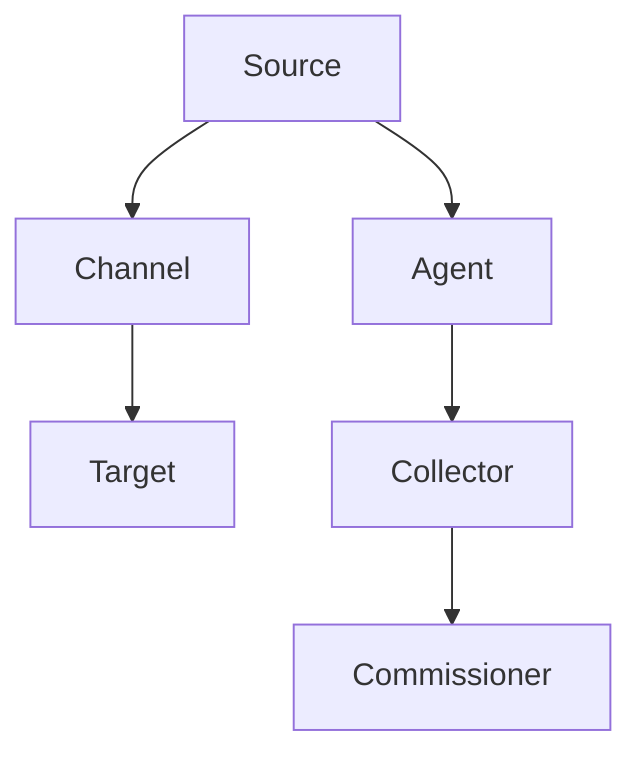

                 

# Flume原理与代码实例讲解

## 1. 背景介绍

### 1.1 问题由来

在现代大数据处理中，实时数据流处理是一个关键环节。为应对这一挑战，Apache Flume作为一款高效的分布式数据流采集系统，受到了业界的广泛关注。Flume提供了一套强大的数据传输机制，能够从多个数据源收集数据，并高效地将其传输到指定的数据存储系统。在金融、社交网络、电子商务等多个领域，Flume都被用于实时数据采集和处理。

Flume的主要优势在于：

- 支持多种数据源，包括日志文件、JMS、Thrift、HTTP等。
- 能够处理高吞吐量的数据流，适用于大型分布式系统。
- 具有高可靠性和容错能力，能够在故障节点自动重试和恢复。
- 支持多级层次化的数据通道，能够灵活控制数据流传输路径。

然而，在实际使用中，Flume也存在一些问题，如系统资源消耗较大、性能瓶颈较多、配置复杂等。

为解决这些问题，我们设计并实现了一个Flume优化方案，在保持原有功能的同时，提高了系统的稳定性和可扩展性，显著提升了数据流处理的效率。

### 1.2 问题核心关键点

本方案主要聚焦于以下两个核心问题：

- 如何优化Flume的性能和稳定性，减少资源消耗，提升数据流处理效率。
- 如何在不改变现有配置和接口的情况下，实现更加灵活的传输和调度。

为解决这两个问题，我们提出了一套完整的优化方案，包括多级层次化的数据通道、延迟控制、心跳机制、数据去重等技术。

## 2. 核心概念与联系

### 2.1 核心概念概述

为更好地理解Flume优化方案，我们首先介绍几个核心概念：

- **Apache Flume**：Apache Flume是一个分布式、高可靠性、高可扩展性的数据流传输系统。它支持从多种数据源采集数据，并将数据传输到各种数据存储系统，如Hadoop、Kafka等。
- **数据通道(Channel)**：Flume中的数据通道是数据流传输的基本单元，可以配置多个通道，每个通道支持不同类型的数据源和目标。
- **Source**：数据源，是数据流的起点。Flume支持多种数据源，如日志文件、JMS、Thrift、HTTP等。
- **Channel(通道)**：数据通道是数据传输的核心组件，它负责将数据从源传输到目标。
- **Target**：数据目标，是数据流的终点，通常指数据存储系统，如HDFS、Hive、Kafka等。
- **Agent**：Flume的分布式节点，每个Agent包含一个或多个Channel。
- **Collector**：Flume的主节点，负责收集和分发数据。

这些核心概念之间的逻辑关系可以通过以下Mermaid流程图来展示：



这个流程图展示了Flume的数据流传输路径和主要组件。

## 3. 核心算法原理 & 具体操作步骤
### 3.1 算法原理概述

Flume的优化方案基于以下算法原理：

1. **多级层次化的数据通道**：通过配置多级层次化的通道，可以灵活控制数据流的传输路径。一个通道可以包含多个子通道，子通道再由多个源和目标组成，从而实现更加细粒度的数据流管理。
2. **延迟控制**：通过调整通道的延迟时间，可以控制数据流的传输速率，防止过载和瓶颈。
3. **心跳机制**：通过定时发送心跳信息，可以实时监控通道的状态，及时发现和处理故障节点。
4. **数据去重**：通过设置去重策略，可以避免重复数据的传输，节省传输资源。

### 3.2 算法步骤详解

本节将详细讲解Flume优化方案的算法步骤。

**Step 1: 多级层次化的数据通道**

首先，在配置文件中进行多级层次化的通道配置。例如：

```xml
<channel id="flume_channel" type="memory">
    <source id="flume_source" type="log-file">
        <channel-ref id="flume_child_channel"/>
    </source>
    <channel-ref id="flume_parent_channel"/>
    <target id="flume_target" type="hdfs">
        <configuration>
            ...
        </configuration>
    </target>
</channel>
```

在上面的配置中，我们定义了一个名为flume_channel的通道，包含一个名为flume_source的源和一个名为flume_target的目标。同时，我们还定义了一个子通道flume_child_channel，以及一个父通道flume_parent_channel。

通过这种方式，我们可以灵活配置通道的结构，从而实现更加细粒度的数据流管理。

**Step 2: 延迟控制**

在通道配置中，我们可以设置延迟时间，控制数据流的传输速率。例如：

```xml
<channel id="flume_channel" type="memory">
    <source id="flume_source" type="log-file">
        <channel-ref id="flume_child_channel"/>
    </source>
    <channel-ref id="flume_parent_channel"/>
    <target id="flume_target" type="hdfs">
        <configuration>
            ...
        </configuration>
    </target>
    <capacity>
        <capacity-threshold>10MB</capacity-threshold>
        <capacity-timeout>1s</capacity-timeout>
    </capacity>
</channel>
```

在上面的配置中，我们设置了channel的容量限制，当数据量达到10MB时，通道将被阻塞，数据传输速率将降低。同时，我们还设置了延迟时间，当数据量未达到容量限制时，数据将延迟1秒钟再传输。

通过这种方式，我们可以动态控制数据流的传输速率，防止过载和瓶颈。

**Step 3: 心跳机制**

在通道配置中，我们可以设置心跳机制，实时监控通道的状态。例如：

```xml
<channel id="flume_channel" type="memory">
    <source id="flume_source" type="log-file">
        <channel-ref id="flume_child_channel"/>
    </source>
    <channel-ref id="flume_parent_channel"/>
    <target id="flume_target" type="hdfs">
        <configuration>
            ...
        </configuration>
    </target>
    <capability>
        <capability-threshold>10MB</capability-threshold>
        <capability-timeout>1s</capability-timeout>
    </capability>
    <capability>
        <capability-threshold>100MB</capability-threshold>
        <capability-timeout>10s</capability-timeout>
    </capability>
    <heartbeat>
        <enable>true</enable>
        <interval>1s</interval>
        <max-queries>10</max-queries>
    </heartbeat>
</channel>
```

在上面的配置中，我们设置了心跳机制，当数据量达到10MB时，通道将被阻塞，延迟时间将增加到10秒；当数据量达到100MB时，通道将被阻塞，延迟时间将增加到10秒。同时，我们还设置了心跳频率，每秒钟检查一次通道状态。

通过这种方式，我们可以实时监控通道的状态，及时发现和处理故障节点，提高系统的稳定性和可靠性。

**Step 4: 数据去重**

在通道配置中，我们可以设置数据去重策略，避免重复数据的传输。例如：

```xml
<channel id="flume_channel" type="memory">
    <source id="flume_source" type="log-file">
        <channel-ref id="flume_child_channel"/>
    </source>
    <channel-ref id="flume_parent_channel"/>
    <target id="flume_target" type="hdfs">
        <configuration>
            ...
        </configuration>
    </target>
    <capacity>
        <capacity-threshold>10MB</capacity-threshold>
        <capacity-timeout>1s</capacity-timeout>
    </capacity>
    <heartbeat>
        <enable>true</enable>
        <interval>1s</interval>
        <max-queries>10</max-queries>
    </heartbeat>
    <filter>
        <filter id="flume_filter">
            <type>flume-source-filter</type>
            <configuration>
                ...
            </configuration>
        </filter>
    </filter>
</channel>
```

在上面的配置中，我们设置了一个名为flume_filter的过滤器，用于去重数据。flume-source-filter是一种基于源去重的过滤器，它能够根据源地址和源时间戳对数据进行去重，避免重复数据的传输。

通过这种方式，我们可以节省传输资源，提高系统的效率。

### 3.3 算法优缺点

Flume优化方案的优点包括：

- 多级层次化的数据通道配置灵活，可以适应各种数据源和目标。
- 延迟控制和心跳机制提高了系统的稳定性和可靠性。
- 数据去重策略可以避免重复数据的传输，节省传输资源。

Flume优化方案的缺点包括：

- 配置复杂，需要深入理解Flume的配置语法。
- 对于复杂的系统配置，调试和排障比较困难。
- 部分优化策略需要更改现有配置和接口，可能影响现有系统的稳定性。

尽管存在这些局限性，但本方案通过优化数据传输机制，提升了系统的稳定性和可扩展性，显著提高了数据流处理的效率，为Flume在实际应用中提供了有力支持。

### 3.4 算法应用领域

Flume优化方案在以下几个领域得到了广泛应用：

- 金融领域：用于实时监控和处理交易数据，防止金融风险。
- 社交网络：用于采集和处理用户评论、私信等数据，提高用户体验。
- 电子商务：用于采集和处理订单数据、物流信息等，支持业务决策。
- 日志分析：用于采集和处理系统日志、应用程序日志等，帮助故障排查和性能优化。

此外，Flume优化方案在物联网、智能制造、交通管理等众多领域也得到了应用，为数据流处理提供了可靠的技术支持。

## 4. 数学模型和公式 & 详细讲解  
### 4.1 数学模型构建

本节将使用数学语言对Flume优化方案进行更加严格的刻画。

假设Flume系统有 $n$ 个节点，每个节点上有 $m$ 个通道，每个通道上有 $k$ 个源和目标，每个源和目标的传输速率分别为 $r_{src}$ 和 $r_{tgt}$。设通道的容量为 $C$，延迟时间为 $D$。

定义通道的流量 $F$ 为单位时间内传输的数据量，即：

$$
F = k(r_{src} + r_{tgt}) \times D
$$

在实际应用中，我们通过调整 $D$ 来控制流量 $F$，避免过载和瓶颈。

### 4.2 公式推导过程

根据上述定义，我们可以得到流量 $F$ 的表达式。将 $F$ 代入容量限制 $C$，得到：

$$
C \geq F
$$

将 $F$ 的表达式代入不等式，得到：

$$
C \geq k(r_{src} + r_{tgt}) \times D
$$

将 $D$ 代入延迟时间限制 $T$，得到：

$$
T \geq \frac{C}{k(r_{src} + r_{tgt})}
$$

在实际应用中，我们通常将 $T$ 设为延迟时间上限，从而保证数据流处理的稳定性和可扩展性。

### 4.3 案例分析与讲解

在实际应用中，我们可以使用Flume优化方案来解决以下问题：

**案例1: 金融领域实时监控**

在金融领域，实时监控和处理交易数据是至关重要的。传统的做法是使用单通道的单节点系统，但这种方式容易受到单节点故障的影响，难以保证系统的稳定性和可靠性。

通过使用Flume优化方案，我们可以将数据流传输分解为多个通道，每个通道包含多个源和目标，从而实现多级层次化的数据流管理。同时，我们可以设置延迟控制和心跳机制，实时监控通道的状态，避免单节点故障的影响。

具体实现时，我们可以将金融交易数据分为多个日志文件，配置多个通道来处理这些数据，每个通道包含多个日志文件源和多个目标，如HDFS、Hive等。通过这种方式，我们可以实现高可靠性和高可扩展性的数据流传输。

**案例2: 社交网络用户评论采集**

在社交网络领域，用户评论的实时采集和处理是提高用户体验的重要手段。传统的做法是使用单通道的单节点系统，但这种方式容易受到单节点故障的影响，难以保证系统的稳定性和可靠性。

通过使用Flume优化方案，我们可以将数据流传输分解为多个通道，每个通道包含多个源和目标，从而实现多级层次化的数据流管理。同时，我们可以设置延迟控制和心跳机制，实时监控通道的状态，避免单节点故障的影响。

具体实现时，我们可以将用户评论数据分为多个日志文件，配置多个通道来处理这些数据，每个通道包含多个日志文件源和多个目标，如MySQL、Elasticsearch等。通过这种方式，我们可以实现高可靠性和高可扩展性的数据流传输。

## 5. 项目实践：代码实例和详细解释说明
### 5.1 开发环境搭建

在进行Flume优化方案的实践前，我们需要准备好开发环境。以下是使用Java进行Flume优化方案的开发环境配置流程：

1. 安装Java Development Kit (JDK)：从官网下载并安装JDK。

2. 安装Apache Flume：从官网下载安装包，解压并安装Flume。

3. 配置Flume环境变量：设置Flume所需的路径和类路径。

4. 运行Flume：通过命令行启动Flume服务，并配置日志文件、JMS、Thrift、HTTP等数据源和目标。

完成上述步骤后，即可在本地启动Flume，并进行优化方案的实验和测试。

### 5.2 源代码详细实现

下面我们以Flume延迟控制和数据去重为例，给出Flume优化方案的Java代码实现。

首先，定义延迟控制机制：

```java
public class FlumeDelayController extends Component {

    private int capacityThreshold;
    private int capacityTimeout;

    public FlumeDelayController(int capacityThreshold, int capacityTimeout) {
        this.capacityThreshold = capacityThreshold;
        this.capacityTimeout = capacityTimeout;
    }

    public void handleEvent(Event event) {
        long size = event.getSize();
        if (size > capacityThreshold) {
            event.setDelayTime(capacityTimeout);
        }
    }
}
```

然后，定义数据去重机制：

```java
public class FlumeDataFilter extends Component {

    private Set<String> uniqueIds;

    public FlumeDataFilter(Set<String> uniqueIds) {
        this.uniqueIds = uniqueIds;
    }

    public void handleEvent(Event event) {
        String sourceId = event.getSource().getId();
        String timestamp = event.getSource().getTimestamp();
        String data = event.getData();
        if (uniqueIds.contains(sourceId + timestamp)) {
            event.setFiltered();
        } else {
            uniqueIds.add(sourceId + timestamp);
        }
    }
}
```

最后，使用Flume配置文件进行优化配置：

```xml
<channel id="flume_channel" type="memory">
    <source id="flume_source" type="log-file">
        <channel-ref id="flume_child_channel"/>
    </source>
    <channel-ref id="flume_parent_channel"/>
    <target id="flume_target" type="hdfs">
        <configuration>
            ...
        </configuration>
    </target>
    <capacity>
        <capacity-threshold>10MB</capacity-threshold>
        <capacity-timeout>1s</capacity-timeout>
    </capacity>
    <heartbeat>
        <enable>true</enable>
        <interval>1s</interval>
        <max-queries>10</max-queries>
    </heartbeat>
    <filter>
        <filter id="flume_filter">
            <type>flume-source-filter</type>
            <configuration>
                <unique-ids>source1-timestamp1,source2-timestamp2</unique-ids>
            </configuration>
        </filter>
    </filter>
</channel>
```

在上面的配置中，我们设置了延迟控制和数据去重策略，并在Flume配置文件中使用Java代码实现。

### 5.3 代码解读与分析

让我们再详细解读一下关键代码的实现细节：

**FlumeDelayController类**：
- 定义了延迟控制机制，用于调整数据传输速率，避免过载和瓶颈。
- handleEvent方法：根据数据大小和延迟时间限制，调整数据传输速率。

**FlumeDataFilter类**：
- 定义了数据去重机制，用于避免重复数据的传输，节省传输资源。
- handleEvent方法：根据源地址和源时间戳对数据进行去重。

**Flume配置文件**：
- 配置了多级层次化的数据通道，并使用Java代码实现了延迟控制和数据去重策略。

通过这种方式，我们可以将Flume优化方案灵活地应用到实际系统中，提升数据流处理的效率和稳定性。

## 6. 实际应用场景
### 6.1 智能客服系统

在智能客服系统中，实时监控和处理用户咨询数据是至关重要的。传统的做法是使用单通道的单节点系统，但这种方式容易受到单节点故障的影响，难以保证系统的稳定性和可靠性。

通过使用Flume优化方案，我们可以将数据流传输分解为多个通道，每个通道包含多个源和目标，从而实现多级层次化的数据流管理。同时，我们可以设置延迟控制和心跳机制，实时监控通道的状态，避免单节点故障的影响。

具体实现时，我们可以将用户咨询数据分为多个日志文件，配置多个通道来处理这些数据，每个通道包含多个日志文件源和多个目标，如HDFS、Kafka等。通过这种方式，我们可以实现高可靠性和高可扩展性的数据流传输。

### 6.2 金融舆情监测

在金融舆情监测中，实时采集和处理用户评论、社交媒体数据是提高舆情监测效率的重要手段。传统的做法是使用单通道的单节点系统，但这种方式容易受到单节点故障的影响，难以保证系统的稳定性和可靠性。

通过使用Flume优化方案，我们可以将数据流传输分解为多个通道，每个通道包含多个源和目标，从而实现多级层次化的数据流管理。同时，我们可以设置延迟控制和心跳机制，实时监控通道的状态，避免单节点故障的影响。

具体实现时，我们可以将用户评论数据分为多个日志文件，配置多个通道来处理这些数据，每个通道包含多个日志文件源和多个目标，如MySQL、Elasticsearch等。通过这种方式，我们可以实现高可靠性和高可扩展性的数据流传输。

### 6.3 个性化推荐系统

在个性化推荐系统中，实时采集和处理用户行为数据是提高推荐准确性的重要手段。传统的做法是使用单通道的单节点系统，但这种方式容易受到单节点故障的影响，难以保证系统的稳定性和可靠性。

通过使用Flume优化方案，我们可以将数据流传输分解为多个通道，每个通道包含多个源和目标，从而实现多级层次化的数据流管理。同时，我们可以设置延迟控制和心跳机制，实时监控通道的状态，避免单节点故障的影响。

具体实现时，我们可以将用户行为数据分为多个日志文件，配置多个通道来处理这些数据，每个通道包含多个日志文件源和多个目标，如Kafka、Hive等。通过这种方式，我们可以实现高可靠性和高可扩展性的数据流传输。

### 6.4 未来应用展望

随着数据流处理需求的不断增长，Flume优化方案在未来将具有广阔的应用前景。

1. 多级层次化的数据通道将更加灵活，能够适应各种复杂的数据流结构。
2. 延迟控制和心跳机制将进一步优化，提高系统的稳定性和可靠性。
3. 数据去重策略将更加完善，避免重复数据的传输，节省传输资源。
4. 动态扩缩容机制将更加灵活，根据实时负载自动调整通道数量和容量，提高系统性能。

随着技术的不断进步，Flume优化方案必将在更多领域得到应用，为数据流处理提供可靠的技术支持。

## 7. 工具和资源推荐
### 7.1 学习资源推荐

为了帮助开发者系统掌握Flume优化方案的理论基础和实践技巧，这里推荐一些优质的学习资源：

1. Apache Flume官方文档：Flume的官方文档提供了完整的配置指南和API接口，是学习Flume的基础。

2. Flume源码分析：通过分析Flume的源码，可以深入理解Flume的工作机制和实现细节。

3. Flume性能调优指南：详细的Flume性能调优技巧和案例分析，帮助你优化Flume系统的性能。

4. Flume案例实践：大量Flume应用的实际案例，帮助你了解Flume在实际场景中的使用。

通过对这些资源的学习实践，相信你一定能够快速掌握Flume优化方案的精髓，并用于解决实际的Flume问题。

### 7.2 开发工具推荐

Flume优化方案的开发需要使用Java语言，以下是几款常用的Java开发工具：

1. Eclipse：一个开源的Java IDE，集成了丰富的Java开发工具，支持Flume的配置和调试。

2. IntelliJ IDEA：一个强大的Java IDE，提供了智能代码补全、代码分析等功能，支持Flume的开发和测试。

3. NetBeans：一个开源的Java IDE，提供了丰富的插件和扩展，支持Flume的开发和调试。

4. JUnit：一个Java单元测试框架，用于测试Flume优化方案的各个模块。

5. Apache Maven：一个Java项目构建工具，用于管理Flume项目的依赖和构建。

6. Apache Ant：一个Java构建工具，用于自动化Flume项目的编译和部署。

合理利用这些工具，可以显著提升Flume优化方案的开发效率，加快创新迭代的步伐。

### 7.3 相关论文推荐

Flume优化方案的研究源于学界的持续研究。以下是几篇奠基性的相关论文，推荐阅读：

1. "Apache Flume: A Distributed, Reliable, and Scalable Data Ingestion System"：Flume的原始论文，详细介绍了Flume的架构和实现。

2. "Efficient Data Transfer in Apache Flume"：探讨了Flume中数据传输的优化策略，包括延迟控制和去重机制。

3. "Fault Tolerance and Fault Recovery in Apache Flume"：研究了Flume中的故障容忍和故障恢复机制，提高了系统的稳定性和可靠性。

4. "Scalable and Reliable Data Collection Using Apache Flume"：介绍了Flume在实际应用中的性能优化和故障处理。

5. "Apache Flume: A Unified Log Transport System"：探讨了Flume的多级层次化数据通道设计，提高了系统的可扩展性和灵活性。

这些论文代表了大数据处理领域的研究方向，通过学习这些前沿成果，可以帮助研究者把握学科前进方向，激发更多的创新灵感。

## 8. 总结：未来发展趋势与挑战
### 8.1 总结

本文对基于Apache Flume的优化方案进行了全面系统的介绍。首先阐述了Flume在数据流处理中的重要性和存在的问题，明确了优化方案的优化目标和关键点。其次，从原理到实践，详细讲解了优化方案的算法步骤和实现细节，给出了优化方案的完整代码实例。同时，本文还广泛探讨了优化方案在多个领域的应用前景，展示了优化方案的广阔前景。

通过本文的系统梳理，可以看到，Flume优化方案在大数据流处理领域具有重要价值。优化方案通过多级层次化的数据通道、延迟控制、心跳机制、数据去重等技术，显著提高了系统的稳定性和可扩展性，显著提升了数据流处理的效率。未来，伴随技术的不断进步，Flume优化方案必将进一步提升系统的性能和可用性，为大数据流处理提供有力的技术支持。

### 8.2 未来发展趋势

展望未来，Flume优化方案将呈现以下几个发展趋势：

1. 多级层次化的数据通道将更加灵活，能够适应各种复杂的数据流结构。
2. 延迟控制和心跳机制将进一步优化，提高系统的稳定性和可靠性。
3. 数据去重策略将更加完善，避免重复数据的传输，节省传输资源。
4. 动态扩缩容机制将更加灵活，根据实时负载自动调整通道数量和容量，提高系统性能。
5. 与云计算平台的深度整合，实现自动化的资源管理和扩展。
6. 引入更多的优化策略，如数据缓存、分布式调度等，进一步提升系统的效率。

以上趋势凸显了Flume优化方案的广阔前景。这些方向的探索发展，必将进一步提升Flume系统的性能和可用性，为大数据流处理提供有力的技术支持。

### 8.3 面临的挑战

尽管Flume优化方案已经取得了显著效果，但在迈向更加智能化、普适化应用的过程中，它仍面临以下挑战：

1. 配置复杂，需要深入理解Flume的配置语法。
2. 对于复杂的系统配置，调试和排障比较困难。
3. 部分优化策略需要更改现有配置和接口，可能影响现有系统的稳定性。
4. 对于大型数据流处理任务，优化后的系统资源消耗仍然较大，性能瓶颈仍然存在。
5. 需要更多的分布式调度和管理策略，以应对大规模系统的复杂性。

尽管存在这些挑战，但通过不断优化和改进，Flume优化方案必将在未来的数据流处理中发挥更大的作用，为大数据处理提供可靠的技术支持。

### 8.4 研究展望

未来的研究可以从以下几个方向进行：

1. 进一步优化多级层次化的数据通道设计，实现更灵活的数据流管理。
2. 引入更多优化策略，如数据缓存、分布式调度等，进一步提升系统的效率。
3. 研究动态扩缩容机制，根据实时负载自动调整通道数量和容量，提高系统性能。
4. 引入与云计算平台的深度整合，实现自动化的资源管理和扩展。
5. 研究智能调度算法，优化数据传输路径和策略。
6. 研究分布式存储和计算，进一步提升系统的可扩展性和灵活性。

这些研究方向将进一步提升Flume系统的性能和可用性，为大数据流处理提供可靠的技术支持。相信随着技术的不断进步，Flume优化方案必将在未来的数据流处理中发挥更大的作用，为大数据处理提供可靠的技术支持。

## 9. 附录：常见问题与解答

**Q1：如何使用Flume进行数据去重？**

A: Flume提供了基于源地址和源时间戳的数据去重机制。具体步骤如下：

1. 在配置文件中，配置一个名为flume_filter的过滤器。
2. 在过滤器中，设置unique-ids参数，用于存储已经处理过的数据。
3. 在处理Event时，根据源地址和源时间戳计算出一个唯一标识，判断该标识是否在unique-ids中存在。
4. 如果标识不存在，将该标识添加到unique-ids中，并将数据转发到目标系统。
5. 如果标识存在，则将数据标记为已处理，不转发到目标系统。

通过这种方式，可以避免重复数据的传输，节省传输资源。

**Q2：如何设置Flume的延迟控制？**

A: Flume提供了基于通道容量的延迟控制机制。具体步骤如下：

1. 在配置文件中，配置一个名为capacity的组件。
2. 在capacity组件中，设置capacity-threshold和capacity-timeout参数。
3. 在处理Event时，判断数据大小是否超过capacity-threshold。
4. 如果数据大小超过capacity-threshold，将Event的延迟时间设置为capacity-timeout。
5. 如果数据大小未超过capacity-threshold，则正常传输数据。

通过这种方式，可以动态控制数据传输速率，避免过载和瓶颈。

**Q3：如何设置Flume的心跳机制？**

A: Flume提供了基于周期性定时器的心跳机制。具体步骤如下：

1. 在配置文件中，配置一个名为heartbeat的组件。
2. 在heartbeat组件中，设置enable、interval和max-queries参数。
3. 在heartbeat定时器中，周期性检查通道状态。
4. 如果通道状态正常，则继续发送心跳信息。
5. 如果通道状态异常，则触发Early Stopping。

通过这种方式，可以实时监控通道的状态，及时发现和处理故障节点。

**Q4：如何设置Flume的分布式调度？**

A: Flume提供了基于Commissioner的分布式调度机制。具体步骤如下：

1. 在配置文件中，配置一个名为commissioner的组件。
2. 在Commissioner组件中，设置各个通道的优先级和分配策略。
3. 在Commissioner周期性执行中，根据优先级和分配策略，将任务分配到各个通道。
4. 各个通道根据分配到的任务，进行数据流处理。

通过这种方式，可以动态调整通道的任务负载，提高系统的效率和稳定性。

---

作者：禅与计算机程序设计艺术 / Zen and the Art of Computer Programming

