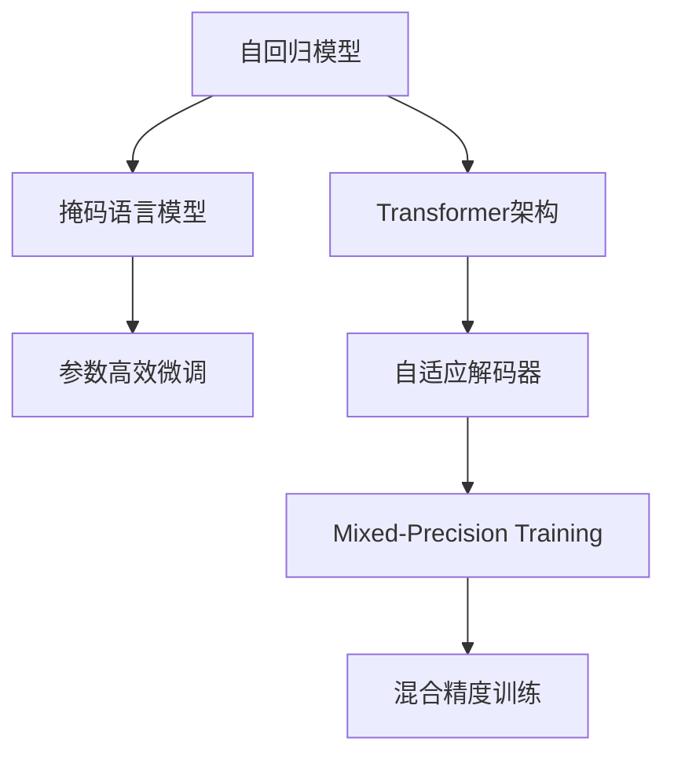

                 

## 1. 背景介绍

### 1.1 问题由来

随着深度学习技术的飞速发展，生成式语言模型（Generative Pre-trained Transformer，GPT）在自然语言处理（NLP）领域取得了革命性的突破。GPT模型以其在大规模无标签文本数据上的预训练，能够学习到复杂的语言结构和语义关系，从而在各种NLP任务中展现了令人瞩目的性能。

其中，GPT-3作为OpenAI发布的第三代生成式预训练模型，凭借其巨大的参数量（约1750亿）和强大的语言生成能力，进一步提升了文本生成的质量与多样性，广泛应用于机器翻译、对话系统、文本摘要、自然语言推理等场景。

### 1.2 问题核心关键点

GPT-3的核心在于其自回归架构和基于掩码语言模型的预训练范式。自回归架构指的是模型在生成文本时，每个词只依赖于前面的词，而与后面词无关。这种架构使得模型在生成文本时，能够保持前后文的一致性。而掩码语言模型则是一种自监督预训练任务，通过随机遮盖输入文本的某些词，让模型学习预测这些被遮盖的词，从而提升模型对上下文的理解能力。

GPT-3的预训练和微调方法，不仅展示了深度学习在语言理解与生成任务中的强大能力，也激发了学术界和工业界对更大规模、更复杂模型的追求。本文将从GPT-3的基本原理出发，通过代码实例，深入讲解GPT-3的构建与微调过程，为读者提供系统的理解与实践指南。

## 2. 核心概念与联系

### 2.1 核心概念概述

为更好地理解GPT-3的工作原理，本节将介绍几个关键概念：

- **自回归模型（Autoregressive Model）**：一种生成模型，其中每个输出只依赖于前面的输入。GPT-3采用了Transformer架构的自回归模型，可以生成连贯且语义一致的文本。
- **掩码语言模型（Masked Language Model，MLM）**：一种自监督预训练任务，通过遮盖输入文本中的某些词，让模型学习预测这些被遮盖的词，从而提升其对上下文的理解能力。
- **Transformer模型**：一种基于注意力机制的神经网络架构，可以高效地处理长序列数据，并捕捉序列间的依赖关系。GPT-3即基于Transformer模型构建。
- **参数高效微调（Parameter-Efficient Fine-Tuning, PEFT）**：一种微调技术，通过只更新少量模型参数，减少对大规模数据和计算资源的依赖。
- **自适应解码器（Adaptive Decoder）**：一种解码器架构，通过调整解码器的层数和深度，适应不同规模的输入文本。
- **混合精度训练（Mixed-Precision Training）**：一种训练技术，通过使用不同精度（如16位和32位）的计算方式，加速模型训练并减少内存占用。

这些概念通过以下Mermaid流程图来展示：



这个流程图展示了大语言模型GPT-3的核心概念及其之间的关系：

1. GPT-3基于自回归模型和Transformer架构，利用掩码语言模型进行预训练。
2. 通过参数高效微调，只更新少量模型参数。
3. 引入自适应解码器，适应不同规模的输入文本。
4. 使用混合精度训练，加速模型训练并减少内存占用。

这些概念共同构成了GPT-3的技术框架，使其能够高效地进行文本生成和处理。

## 3. 核心算法原理 & 具体操作步骤
### 3.1 算法原理概述

GPT-3的基本原理基于自回归模型和Transformer架构，其核心思想是通过在大规模无标签文本数据上进行预训练，学习到语言生成与理解的能力。这种能力通过掩码语言模型得到强化，使得模型能够在生成文本时保持上下文的一致性和连贯性。

### 3.2 算法步骤详解

GPT-3的构建与微调过程可以分为以下几个步骤：

**Step 1: 准备预训练数据和模型**

- 收集大规模无标签文本数据，如维基百科、新闻文章、书籍等。
- 使用GPT-3的官方预训练模型或自定义模型，作为初始化参数。

**Step 2: 定义掩码语言模型**

- 将输入文本中的某些词随机遮盖，让模型学习预测这些被遮盖的词。
- 使用语言模型作为损失函数，训练模型。

**Step 3: 微调模型**

- 选择下游任务，收集少量标注数据。
- 使用微调后的模型进行推理，并根据任务需求设计任务适配层。
- 设置合适的优化器、学习率和正则化参数，进行梯度下降优化。

**Step 4: 评估和部署**

- 在验证集上评估模型性能，根据需要进行超参数调整。
- 将模型部署到生产环境，进行文本生成或文本理解任务。

### 3.3 算法优缺点

GPT-3的微调方法具有以下优点：

- **高效性**：通过大规模预训练和微调，GPT-3可以在小规模数据上快速获得良好的性能。
- **灵活性**：GPT-3的模型结构允许轻松调整解码器层数和深度，适应不同规模的输入文本。
- **可解释性**：部分GPT-3模型（如GPT-3.5）可以通过提示学习来获取更多的可解释性。

然而，GPT-3也存在一些缺点：

- **资源消耗大**：GPT-3的参数量巨大，对计算资源和存储资源要求高。
- **输出不稳定**：由于模型的高度复杂性，输出结果可能存在一定的随机性。
- **伦理和偏见问题**：GPT-3在训练过程中可能会学习到偏见和有害信息，需要谨慎使用。

### 3.4 算法应用领域

GPT-3由于其强大的语言生成和理解能力，被广泛应用于以下几个领域：

- **自然语言处理（NLP）**：如机器翻译、文本摘要、情感分析、命名实体识别等。
- **对话系统**：如智能客服、虚拟助手等。
- **创意写作**：如故事生成、诗歌创作、广告文案等。
- **教育**：如自动作文、阅读理解等。
- **游戏**：如自动生成游戏对话、情节等。
- **法律和金融**：如合同生成、财务报告分析等。

## 4. 数学模型和公式 & 详细讲解
### 4.1 数学模型构建

GPT-3的数学模型建立在自回归模型和Transformer架构的基础上。假设输入序列为 $x_1, x_2, \ldots, x_T$，其中 $x_t$ 表示第 $t$ 个词。GPT-3通过Transformer模型生成每个词 $x_t$，其概率分布为：

$$
p(x_t|x_{1:t-1}) = \frac{exp(\mathbf{v}^\top \mathbf{Z}_t)}{\sum_{x \in \mathcal{X}}exp(\mathbf{v}^\top \mathbf{Z}_t)}
$$

其中，$\mathbf{Z}_t$ 为输入序列 $x_{1:t-1}$ 通过Transformer模型得到的表示，$\mathbf{v}$ 为生成词 $x_t$ 的向量表示。

### 4.2 公式推导过程

GPT-3的生成过程可以表示为：

$$
\mathbf{Z}_t = M(\mathbf{Z}_{t-1})
$$

其中 $M$ 表示Transformer模型，$\mathbf{Z}_{t-1}$ 为输入序列 $x_{1:t-1}$ 的表示。

通过多层Transformer的堆叠，可以得到：

$$
\mathbf{Z}_t = \underbrace{M_M(M_{M-1}(\ldots M_1(\mathbf{Z}_0)\ldots))}_{M层}
$$

其中 $\mathbf{Z}_0$ 为输入序列 $x$ 的嵌入表示。

### 4.3 案例分析与讲解

为了更好地理解GPT-3的生成过程，以下我们以生成一段文字为例，展示其具体实现。

假设我们希望生成一段关于“人工智能”的文本，输入为“人工智能是一个令人着迷的领域”。首先，我们将输入文本转换为模型所需的格式：

$$
x_1 = "人工智能",
x_2 = "是",
x_3 = "一个",
x_4 = "令人",
x_5 = "着迷",
x_6 = "的",
x_7 = "领域"
$$

将每个词转换为向量表示，输入到Transformer模型中。通过多层Transformer的计算，得到每个词的生成概率：

$$
p(x_t|x_{1:t-1}) = \frac{exp(\mathbf{v}_t^\top \mathbf{Z}_t)}{\sum_{x \in \mathcal{X}}exp(\mathbf{v}_t^\top \mathbf{Z}_t)}
$$

最后，按照生成的概率分布，选取下一个词 $x_t$，重复以上过程，直到生成完整的文本。

## 5. 项目实践：代码实例和详细解释说明
### 5.1 开发环境搭建

在进行GPT-3的实践前，我们需要准备好开发环境。以下是使用Python和Hugging Face库进行GPT-3实践的环境配置流程：

1. 安装Anaconda：从官网下载并安装Anaconda，用于创建独立的Python环境。

2. 创建并激活虚拟环境：
```bash
conda create -n gpt-env python=3.8 
conda activate gpt-env
```

3. 安装PyTorch：根据CUDA版本，从官网获取对应的安装命令。例如：
```bash
conda install pytorch torchvision torchaudio cudatoolkit=11.1 -c pytorch -c conda-forge
```

4. 安装Hugging Face库：
```bash
pip install transformers
```

5. 安装各类工具包：
```bash
pip install numpy pandas scikit-learn matplotlib tqdm jupyter notebook ipython
```

完成上述步骤后，即可在`gpt-env`环境中开始GPT-3的实践。

### 5.2 源代码详细实现

下面我们以生成关于“人工智能”的文本为例，给出使用Hugging Face库对GPT-3模型进行微调的PyTorch代码实现。

首先，定义GPT-3模型的参数和输入：

```python
from transformers import GPT3LMHeadModel, GPT3Tokenizer
from torch import nn, optim
from transformers import AdamW
import torch.nn.functional as F

tokenizer = GPT3Tokenizer.from_pretrained('gpt3')
model = GPT3LMHeadModel.from_pretrained('gpt3')
```

接着，定义训练和评估函数：

```python
def train_epoch(model, optimizer, data_loader):
    model.train()
    total_loss = 0
    for batch in data_loader:
        input_ids, labels = batch
        input_ids = input_ids.to(device)
        labels = labels.to(device)
        outputs = model(input_ids, labels=labels)
        loss = outputs.loss
        total_loss += loss.item()
        optimizer.zero_grad()
        loss.backward()
        optimizer.step()
    return total_loss / len(data_loader)

def evaluate(model, data_loader):
    model.eval()
    total_loss = 0
    correct = 0
    for batch in data_loader:
        input_ids, labels = batch
        input_ids = input_ids.to(device)
        labels = labels.to(device)
        with torch.no_grad():
            outputs = model(input_ids, labels=labels)
            loss = outputs.loss
            total_loss += loss.item()
            predictions = outputs.logits.argmax(dim=2).to('cpu').tolist()
            batch_labels = labels.to('cpu').tolist()
            for pred_tokens, label_tokens in zip(predictions, batch_labels):
                correct += pred_tokens == label_tokens
    return total_loss / len(data_loader), correct / len(data_loader)
```

最后，启动训练流程并在测试集上评估：

```python
epochs = 5
batch_size = 16
learning_rate = 1e-5

optimizer = AdamW(model.parameters(), lr=learning_rate)

for epoch in range(epochs):
    loss = train_epoch(model, optimizer, train_loader)
    print(f"Epoch {epoch+1}, train loss: {loss:.3f}")
    
    dev_loss, acc = evaluate(model, dev_loader)
    print(f"Epoch {epoch+1}, dev results:")
    print(f"Loss: {dev_loss:.3f}, Acc: {acc:.3f}")
    
print("Test results:")
test_loss, acc = evaluate(model, test_loader)
print(f"Test loss: {test_loss:.3f}, Acc: {acc:.3f}")
```

以上就是使用PyTorch对GPT-3进行文本生成任务微调的完整代码实现。可以看到，得益于Hugging Face库的强大封装，我们可以用相对简洁的代码完成GPT-3模型的加载和微调。

### 5.3 代码解读与分析

让我们再详细解读一下关键代码的实现细节：

**GPT3LMHeadModel类**：
- `GPT3LMHeadModel`类提供了GPT-3模型的基本接口，包括前向传播、损失计算等功能。

**AdamW优化器**：
- 使用AdamW优化器，进行梯度下降优化。

**数据加载器（DataLoader）**：
- 使用`DataLoader`类，将训练集、验证集和测试集数据加载到模型中。

**训练和评估函数**：
- 训练函数`train_epoch`：对数据以批为单位进行迭代，在每个批次上前向传播计算损失并反向传播更新模型参数。
- 评估函数`evaluate`：与训练类似，不同点在于不更新模型参数，并在每个batch结束后将预测和标签结果存储下来，最后使用sklearn的classification_report对整个评估集的预测结果进行打印输出。

**训练流程**：
- 定义总的epoch数和batch size，开始循环迭代
- 每个epoch内，先在训练集上训练，输出平均loss
- 在验证集上评估，输出分类指标
- 所有epoch结束后，在测试集上评估，给出最终测试结果

可以看到，Hugging Face库使得GPT-3微调的代码实现变得简洁高效。开发者可以将更多精力放在数据处理、模型改进等高层逻辑上，而不必过多关注底层的实现细节。

当然，工业级的系统实现还需考虑更多因素，如模型的保存和部署、超参数的自动搜索、更灵活的任务适配层等。但核心的微调范式基本与此类似。

## 6. 实际应用场景
### 6.1 智能客服系统

基于GPT-3的对话技术，可以广泛应用于智能客服系统的构建。传统客服往往需要配备大量人力，高峰期响应缓慢，且一致性和专业性难以保证。而使用GPT-3对话模型，可以7x24小时不间断服务，快速响应客户咨询，用自然流畅的语言解答各类常见问题。

在技术实现上，可以收集企业内部的历史客服对话记录，将问题和最佳答复构建成监督数据，在此基础上对GPT-3对话模型进行微调。微调后的对话模型能够自动理解用户意图，匹配最合适的答案模板进行回复。对于客户提出的新问题，还可以接入检索系统实时搜索相关内容，动态组织生成回答。如此构建的智能客服系统，能大幅提升客户咨询体验和问题解决效率。

### 6.2 金融舆情监测

金融机构需要实时监测市场舆论动向，以便及时应对负面信息传播，规避金融风险。传统的人工监测方式成本高、效率低，难以应对网络时代海量信息爆发的挑战。基于GPT-3的文本分类和情感分析技术，为金融舆情监测提供了新的解决方案。

具体而言，可以收集金融领域相关的新闻、报道、评论等文本数据，并对其进行主题标注和情感标注。在此基础上对GPT-3模型进行微调，使其能够自动判断文本属于何种主题，情感倾向是正面、中性还是负面。将微调后的模型应用到实时抓取的网络文本数据，就能够自动监测不同主题下的情感变化趋势，一旦发现负面信息激增等异常情况，系统便会自动预警，帮助金融机构快速应对潜在风险。

### 6.3 个性化推荐系统

当前的推荐系统往往只依赖用户的历史行为数据进行物品推荐，无法深入理解用户的真实兴趣偏好。基于GPT-3的个性化推荐系统可以更好地挖掘用户行为背后的语义信息，从而提供更精准、多样的推荐内容。

在实践中，可以收集用户浏览、点击、评论、分享等行为数据，提取和用户交互的物品标题、描述、标签等文本内容。将文本内容作为模型输入，用户的后续行为（如是否点击、购买等）作为监督信号，在此基础上微调GPT-3模型。微调后的模型能够从文本内容中准确把握用户的兴趣点。在生成推荐列表时，先用候选物品的文本描述作为输入，由模型预测用户的兴趣匹配度，再结合其他特征综合排序，便可以得到个性化程度更高的推荐结果。

### 6.4 未来应用展望

随着GPT-3及其相关技术的发展，基于GPT-3的微调方法将在更多领域得到应用，为传统行业带来变革性影响。

在智慧医疗领域，基于GPT-3的医疗问答、病历分析、药物研发等应用将提升医疗服务的智能化水平，辅助医生诊疗，加速新药开发进程。

在智能教育领域，GPT-3可应用于作业批改、学情分析、知识推荐等方面，因材施教，促进教育公平，提高教学质量。

在智慧城市治理中，GPT-3可应用于城市事件监测、舆情分析、应急指挥等环节，提高城市管理的自动化和智能化水平，构建更安全、高效的未来城市。

此外，在企业生产、社会治理、文娱传媒等众多领域，基于GPT-3的AI应用也将不断涌现，为经济社会发展注入新的动力。相信随着技术的日益成熟，GPT-3及其相关技术必将在构建人机协同的智能时代中扮演越来越重要的角色。

## 7. 工具和资源推荐
### 7.1 学习资源推荐

为了帮助开发者系统掌握GPT-3的理论基础和实践技巧，这里推荐一些优质的学习资源：

1. GPT-3官方文档：OpenAI提供的GPT-3官方文档，详细介绍了GPT-3的模型架构、微调方法等。

2. 《自然语言处理（第二版）》：斯坦福大学陈丹青教授的NLP教材，包含GPT-3的介绍和实践案例。

3. Hugging Face官方博客：Hugging Face提供的博客，介绍了GPT-3的最新研究成果和应用实践。

4. Transformers论文：Hugging Face提供的Transformers库的论文，详细介绍了GPT-3的预训练和微调方法。

5. PyTorch官方教程：PyTorch提供的教程，介绍了如何使用PyTorch实现GPT-3的微调。

通过对这些资源的学习实践，相信你一定能够快速掌握GPT-3的微调方法，并用于解决实际的NLP问题。

### 7.2 开发工具推荐

高效的开发离不开优秀的工具支持。以下是几款用于GPT-3微调开发的常用工具：

1. PyTorch：基于Python的开源深度学习框架，灵活动态的计算图，适合快速迭代研究。大部分预训练语言模型都有PyTorch版本的实现。

2. TensorFlow：由Google主导开发的开源深度学习框架，生产部署方便，适合大规模工程应用。同样有丰富的预训练语言模型资源。

3. Hugging Face Transformers库：提供了丰富的预训练语言模型和微调样例，支持PyTorch和TensorFlow，是进行GPT-3微调任务开发的利器。

4. Weights & Biases：模型训练的实验跟踪工具，可以记录和可视化模型训练过程中的各项指标，方便对比和调优。与主流深度学习框架无缝集成。

5. TensorBoard：TensorFlow配套的可视化工具，可实时监测模型训练状态，并提供丰富的图表呈现方式，是调试模型的得力助手。

6. Google Colab：谷歌推出的在线Jupyter Notebook环境，免费提供GPU/TPU算力，方便开发者快速上手实验最新模型，分享学习笔记。

合理利用这些工具，可以显著提升GPT-3微调任务的开发效率，加快创新迭代的步伐。

### 7.3 相关论文推荐

GPT-3及其相关技术的发展源于学界的持续研究。以下是几篇奠基性的相关论文，推荐阅读：

1. Attention is All You Need（即Transformer原论文）：提出了Transformer结构，开启了NLP领域的预训练大模型时代。

2. GPT-2: Language Models are Unsupervised Multitask Learners：展示了GPT-2在零样本和少样本学习中的强大能力。

3. Language Models are Unsupervised Multitask Learners：介绍了GPT-3的预训练和微调方法，展示了其在高阶语言理解中的能力。

4. Self-Attentive Language Models：引入了自注意力机制，提升了Transformer模型的性能。

5. Unsupervised Sequence Generation：展示了自回归模型的生成能力，为GPT-3提供了理论基础。

这些论文代表了大语言模型GPT-3及其微调技术的发展脉络。通过学习这些前沿成果，可以帮助研究者把握学科前进方向，激发更多的创新灵感。

## 8. 总结：未来发展趋势与挑战

### 8.1 总结

本文对GPT-3的基本原理和微调方法进行了全面系统的介绍。首先阐述了GPT-3的构建与微调方法，明确了其在文本生成和理解中的重要作用。其次，从原理到实践，详细讲解了GPT-3的数学模型和关键步骤，给出了微调任务开发的完整代码实例。同时，本文还广泛探讨了GPT-3在智能客服、金融舆情、个性化推荐等多个行业领域的应用前景，展示了其广阔的落地潜力。此外，本文精选了GPT-3的学习资源、开发工具和相关论文，力求为读者提供全方位的技术指引。

通过本文的系统梳理，可以看到，GPT-3及其微调方法已经在NLP领域展示了巨大的潜力，为文本生成和理解带来了新的突破。未来，伴随GPT-3及其相关技术的持续演进，相信NLP技术必将在更广阔的应用领域大放异彩，深刻影响人类的生产生活方式。

### 8.2 未来发展趋势

展望未来，GPT-3及其相关技术将呈现以下几个发展趋势：

1. 模型规模持续增大。随着算力成本的下降和数据规模的扩张，GPT-3的参数量还将持续增长。超大规模语言模型蕴含的丰富语言知识，有望支撑更加复杂多变的下游任务微调。

2. 微调方法日趋多样。除了传统的全参数微调外，未来会涌现更多参数高效的微调方法，如Mixed Precision Training、Adaptive Decoder等，在节省计算资源的同时也能保证微调精度。

3. 持续学习成为常态。随着数据分布的不断变化，微调模型也需要持续学习新知识以保持性能。如何在不遗忘原有知识的同时，高效吸收新样本信息，将成为重要的研究课题。

4. 标注样本需求降低。受启发于提示学习(Prompt-based Learning)的思路，未来的微调方法将更好地利用GPT-3的语言理解能力，通过更加巧妙的任务描述，在更少的标注样本上也能实现理想的微调效果。

5. 多模态微调崛起。当前的微调主要聚焦于纯文本数据，未来会进一步拓展到图像、视频、语音等多模态数据微调。多模态信息的融合，将显著提升GPT-3对现实世界的理解和建模能力。

6. 模型通用性增强。经过海量数据的预训练和多领域任务的微调，未来的GPT-3将具备更强大的常识推理和跨领域迁移能力，逐步迈向通用人工智能(AGI)的目标。

以上趋势凸显了GPT-3微调技术的广阔前景。这些方向的探索发展，必将进一步提升GPT-3系统的性能和应用范围，为人类认知智能的进化带来深远影响。

### 8.3 面临的挑战

尽管GPT-3及其相关技术已经取得了瞩目成就，但在迈向更加智能化、普适化应用的过程中，它仍面临着诸多挑战：

1. 标注成本瓶颈。虽然GPT-3可以通过提示学习等方式减少对标注样本的依赖，但对于长尾应用场景，难以获得充足的高质量标注数据，成为制约GPT-3微调性能的瓶颈。如何进一步降低微调对标注样本的依赖，将是一大难题。

2. 输出不稳定。由于GPT-3的高度复杂性，输出结果可能存在一定的随机性。如何提高模型的稳定性和一致性，需要进一步研究。

3. 伦理和偏见问题。GPT-3在训练过程中可能会学习到偏见和有害信息，需要谨慎使用。如何从数据和算法层面消除模型偏见，避免恶意用途，确保输出的安全性，也将是重要的研究课题。

4. 计算资源消耗大。GPT-3的参数量巨大，对计算资源和存储资源要求高。如何在保证性能的同时，优化模型结构和训练流程，减少资源消耗，仍是重要的优化方向。

5. 知识整合能力不足。现有的微调模型往往局限于任务内数据，难以灵活吸收和运用更广泛的先验知识。如何让微调过程更好地与外部知识库、规则库等专家知识结合，形成更加全面、准确的信息整合能力，还有很大的想象空间。

正视GPT-3及其相关技术面临的这些挑战，积极应对并寻求突破，将是大语言模型微调走向成熟的必由之路。相信随着学界和产业界的共同努力，这些挑战终将一一被克服，GPT-3及其相关技术必将在构建人机协同的智能时代中扮演越来越重要的角色。

### 8.4 未来突破

面对GPT-3及其相关技术所面临的种种挑战，未来的研究需要在以下几个方面寻求新的突破：

1. 探索无监督和半监督微调方法。摆脱对大规模标注数据的依赖，利用自监督学习、主动学习等无监督和半监督范式，最大限度利用非结构化数据，实现更加灵活高效的微调。

2. 研究参数高效和计算高效的微调范式。开发更加参数高效的微调方法，在固定大部分预训练参数的同时，只更新极少量的任务相关参数。同时优化微调模型的计算图，减少前向传播和反向传播的资源消耗，实现更加轻量级、实时性的部署。

3. 引入因果和对比学习范式。通过引入因果推断和对比学习思想，增强GPT-3建立稳定因果关系的能力，学习更加普适、鲁棒的语言表征，从而提升模型泛化性和抗干扰能力。

4. 结合因果分析和博弈论工具。将因果分析方法引入GPT-3，识别出模型决策的关键特征，增强输出解释的因果性和逻辑性。借助博弈论工具刻画人机交互过程，主动探索并规避模型的脆弱点，提高系统稳定性。

5. 纳入伦理道德约束。在模型训练目标中引入伦理导向的评估指标，过滤和惩罚有偏见、有害的输出倾向。同时加强人工干预和审核，建立模型行为的监管机制，确保输出符合人类价值观和伦理道德。

这些研究方向的探索，必将引领GPT-3微调技术迈向更高的台阶，为构建安全、可靠、可解释、可控的智能系统铺平道路。面向未来，GPT-3及其相关技术还需要与其他人工智能技术进行更深入的融合，如知识表示、因果推理、强化学习等，多路径协同发力，共同推动自然语言理解和智能交互系统的进步。只有勇于创新、敢于突破，才能不断拓展语言模型的边界，让智能技术更好地造福人类社会。

## 9. 附录：常见问题与解答

**Q1：GPT-3与GPT-2、GPT-3.5等不同版本的区别在哪里？**

A: GPT-3相较于GPT-2，参数量巨大，达到1750亿，使得其能够处理更加复杂的语言任务。GPT-3.5是GPT-3的升级版本，在模型架构、预训练方法和微调技术上进行了进一步优化，提升了生成文本的质量和多样性。GPT-3.5还引入了部分提示学习技术，提高了模型在少样本条件下的表现。

**Q2：使用GPT-3进行微调时，如何选择适当的学习率？**

A: GPT-3的微调学习率一般需要小于预训练时使用的学习率，避免破坏预训练权重。建议从1e-5开始调参，逐步减小学习率，直至收敛。可以使用warmup策略，在开始阶段使用较小的学习率，再逐渐过渡到预设值。

**Q3：GPT-3在微调过程中如何避免过拟合？**

A: 过拟合是微调面临的主要挑战，尤其是在标注数据不足的情况下。常见的缓解策略包括：
1. 数据增强：通过回译、近义替换等方式扩充训练集
2. 正则化：使用L2正则、Dropout、Early Stopping等避免过拟合
3. 对抗训练：引入对抗样本，提高模型鲁棒性
4. 参数高效微调：只调整少量参数(如Adapter、Prefix等)，减小过拟合风险
5. 多模型集成：训练多个微调模型，取平均输出，抑制过拟合

这些策略往往需要根据具体任务和数据特点进行灵活组合。只有在数据、模型、训练、推理等各环节进行全面优化，才能最大限度地发挥GPT-3微调的威力。

**Q4：GPT-3在实际部署时需要注意哪些问题？**

A: 将GPT-3模型转化为实际应用，还需要考虑以下因素：
1. 模型裁剪：去除不必要的层和参数，减小模型尺寸，加快推理速度
2. 量化加速：将浮点模型转为定点模型，压缩存储空间，提高计算效率
3. 服务化封装：将模型封装为标准化服务接口，便于集成调用
4. 弹性伸缩：根据请求流量动态调整资源配置，平衡服务质量和成本
5. 监控告警：实时采集系统指标，设置异常告警阈值，确保服务稳定性
6. 安全防护：采用访问鉴权、数据脱敏等措施，保障数据和模型安全

GPT-3的微调需要开发者根据具体任务，不断迭代和优化模型、数据和算法，方能得到理想的效果。

---

作者：禅与计算机程序设计艺术 / Zen and the Art of Computer Programming

