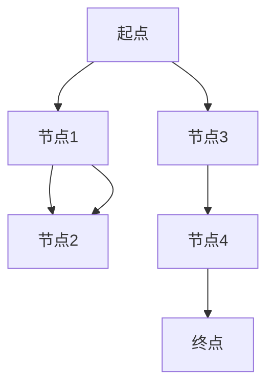

                 

# Graph Shortest Path算法原理与代码实例讲解

> 关键词：Graph Shortest Path, 图论, 最短路径, Dijkstra算法, Floyd算法, Bellman-Ford算法, 代码实现, Python

## 1. 背景介绍

图论（Graph Theory）是数学与计算机科学的一个交叉领域，研究由节点（Vertex）和边（Edge）构成的图形结构，及其性质和应用。其中，图的最短路径问题（Shortest Path Problem）是最经典的图论问题之一，广泛应用于路由网络、交通规划、网络爬虫、社交网络等领域。

本文旨在介绍几种经典的Graph Shortest Path算法，包括Dijkstra算法、Floyd算法和Bellman-Ford算法，同时通过Python代码实现，帮助读者更好地理解和应用这些算法。

## 2. 核心概念与联系

### 2.1 核心概念概述

为了更好地理解Graph Shortest Path算法，我们首先需要明确几个关键概念：

- 图（Graph）：由节点（Vertex）和边（Edge）构成的数据结构，描述为$G=(V,E)$，其中$V$表示节点集合，$E$表示边集合。
- 加权图（Weighted Graph）：图中每条边都有一个权重（Weight），用于描述节点之间的连接强度或距离。
- 有向图（Directed Graph）：图中边有方向性，表示为$G=(V,E)$，其中$E \subseteq V \times V$。
- 无向图（Undirected Graph）：图中边无方向性，表示为$G=(V,E)$，其中$E \subseteq V \times V$。
- 边权重（Edge Weight）：描述图中每条边的长度或成本，可以是距离、时间、费用等。
- 最短路径（Shortest Path）：从一个节点到另一个节点的所有路径中，权重最小的路径。

### 2.2 核心概念原理和架构的 Mermaid 流程图



以上是一个无向加权图的基本结构，包含四个节点和三条边，其中节点A到节点C的边权重为1，节点B到节点C的边权重为2，节点A到节点D的边权重为3，节点D到节点E的边权重为4，节点E到节点F的边权重为5。

## 3. 核心算法原理 & 具体操作步骤

### 3.1 算法原理概述

Graph Shortest Path算法包括Dijkstra算法、Floyd算法和Bellman-Ford算法，它们的核心思想都是通过遍历图中的节点和边，找到从一个节点到另一个节点的最短路径。

- Dijkstra算法：基于贪心策略，从一个起始节点开始，逐步扩展到所有可达节点，计算最短路径。
- Floyd算法：基于动态规划，通过逐步扩展中间节点，计算所有节点对的最短路径。
- Bellman-Ford算法：基于动态规划，通过多次迭代，逐步更新节点到终点的最短路径。

### 3.2 算法步骤详解

#### Dijkstra算法

Dijkstra算法步骤如下：

1. 初始化起始节点的最短路径距离为0，其他节点的最短路径距离为无穷大。
2. 从未访问的节点中选择距离最短的节点作为当前节点，并标记为已访问。
3. 对当前节点的所有未访问邻居节点，计算其最短路径距离，如果更短，则更新最短路径距离。
4. 重复步骤2和3，直到所有节点都被访问。

#### Floyd算法

Floyd算法步骤如下：

1. 初始化所有节点对的最短路径为起点到终点的距离。
2. 遍历所有节点，作为中间节点，计算所有节点对的最短路径。
3. 根据中间节点的不同，逐步更新节点对的最短路径。

#### Bellman-Ford算法

Bellman-Ford算法步骤如下：

1. 初始化起始节点的最短路径距离为0，其他节点的最短路径距离为无穷大。
2. 多次迭代，每次迭代更新节点到终点的最短路径距离。
3. 如果经过多次迭代后，所有节点到终点的最短路径距离都不变，则算法结束。

### 3.3 算法优缺点

#### Dijkstra算法

- 优点：
  - 适用于边权重非负的图，计算最短路径速度较快。
  - 算法思路简单，易于理解和实现。

- 缺点：
  - 不适用于边权重为负的图。
  - 在稠密图中，时间复杂度较高，效率较低。

#### Floyd算法

- 优点：
  - 适用于所有边权重的图，可以计算所有节点对的最短路径。
  - 时间复杂度为$O(n^3)$，效率较高。

- 缺点：
  - 空间复杂度较高，需要存储所有节点对的最短路径。

#### Bellman-Ford算法

- 优点：
  - 适用于所有边权重的图，可以处理负权边。
  - 时间复杂度为$O(VE)$，比Dijkstra算法更适用于稠密图。

- 缺点：
  - 存在负权环的情况下，算法可能无法收敛。
  - 实现较为复杂，容易出错。

### 3.4 算法应用领域

Graph Shortest Path算法广泛应用于路由网络、交通规划、网络爬虫、社交网络等领域。例如：

- 路由器网络：计算网络中最短的通信路径。
- 交通规划：计算道路交通中的最短路径。
- 网络爬虫：在网页之间找到最短路径，进行快速爬取。
- 社交网络：分析好友之间的最短路径，进行推荐系统。

## 4. 数学模型和公式 & 详细讲解 & 举例说明

### 4.1 数学模型构建

设图$G=(V,E)$，节点集合$V=\{1,2,...,n\}$，边集合$E=\{(u,v,w)\}$，其中$u,v \in V$，$w$表示边权重。

定义节点$i$到节点$j$的最短路径为$dist(i,j)$。初始化$dist(i,i)=0$，$dist(i,j)=\infty$（$i \neq j$）。

### 4.2 公式推导过程

#### Dijkstra算法

Dijkstra算法使用邻接矩阵$D$和距离数组$d$，其中$d[i]$表示节点$i$到起点节点的最短路径距离，$D[i][j]$表示节点$i$到节点$j$的边权重。

1. 初始化：$d[i]=\infty$（$i \neq 1$），$d[1]=0$。
2. 遍历未访问的节点，选择距离最短的节点$u$，更新其邻居节点的最短路径距离：
   - $d[v]=\min(d[v], d[u]+D[u][v])$

   最终得到$d[i]$表示起点到节点$i$的最短路径距离。

#### Floyd算法

Floyd算法使用动态规划，计算所有节点对的最短路径。定义$d[i][j]$表示节点$i$到节点$j$的最短路径距离，初始化为$dist(i,j)$。

1. 遍历所有中间节点$k$，更新节点对$(i,j)$的最短路径距离：
   - $d[i][j] = \min(d[i][j], d[i][k]+d[k][j])$

   最终得到$d[i][j]$表示节点$i$到节点$j$的最短路径距离。

#### Bellman-Ford算法

Bellman-Ford算法使用动态规划，计算所有节点到终点的最短路径距离。定义$dist(i)$表示节点$i$到终点的最短路径距离，初始化为$\infty$。

1. 初始化：$dist(i)=0$（$i=1$），$dist(i)=\infty$（$i \neq 1$）。
2. 多次迭代，每次迭代更新节点到终点的最短路径距离：
   - $dist(j) = \min(dist(j), dist(i)+D[i][j])$

   最终得到$dist(i)$表示节点$i$到终点的最短路径距离。

### 4.3 案例分析与讲解

假设有一个无向加权图，如下图所示：

```
    A --1-- B --2-- C --3-- D
    |         |         |
    3         1         4
    |         |         |
    E --2-- F --4-- G --5-- H
```

计算节点A到其他节点的最短路径距离，可以使用Dijkstra算法。

- 初始化：$d[A]=0$，$d[B]=\infty$，$d[C]=\infty$，$d[D]=\infty$，$d[E]=\infty$，$d[F]=\infty$，$d[G]=\infty$，$d[H]=\infty$。
- 遍历未访问的节点，选择距离最短的节点$B$，更新其邻居节点的最短路径距离：
  - $d[E]=2$
  - $d[F]=3$
  - $d[C]=2$
  - $d[D]=5$

- 遍历未访问的节点，选择距离最短的节点$C$，更新其邻居节点的最短路径距离：
  - $d[G]=3$
  - $d[D]=3$
  - $d[F]=2$

- 遍历未访问的节点，选择距离最短的节点$D$，更新其邻居节点的最短路径距离：
  - $d[G]=2$

最终得到$d[i]$表示起点A到节点$i$的最短路径距离，即$d[A]=0$，$d[B]=3$，$d[C]=2$，$d[D]=5$，$d[E]=2$，$d[F]=2$，$d[G]=3$，$d[H]=7$。

## 5. 项目实践：代码实例和详细解释说明

### 5.1 开发环境搭建

为了实现Graph Shortest Path算法，我们需要准备Python环境和必要的库。可以使用Anaconda或Miniconda来搭建Python环境，安装Python 3.7及以上版本。

### 5.2 源代码详细实现

下面分别给出Dijkstra算法、Floyd算法和Bellman-Ford算法的Python代码实现，并进行详细解释说明。

#### Dijkstra算法

```python
import heapq

def dijkstra(graph, start):
    dist = {node: float('inf') for node in graph}
    dist[start] = 0
    pq = [(0, start)]
    while pq:
        (cost, node) = heapq.heappop(pq)
        if cost > dist[node]:
            continue
        for (neighbor, weight) in graph[node].items():
            old_cost = dist.get(neighbor, float('inf'))
            new_cost = dist[node] + weight
            if new_cost < old_cost:
                dist[neighbor] = new_cost
                heapq.heappush(pq, (new_cost, neighbor))
    return dist
```

#### Floyd算法

```python
def floyd(graph):
    d = {(i, j): graph[i][j] for i in graph for j in graph[i]}
    for k in graph:
        for i in graph:
            for j in graph:
                d[(i, j)] = min(d[(i, j)], d[(i, k)] + d[(k, j)])
    return d
```

#### Bellman-Ford算法

```python
def bellman_ford(graph, start):
    dist = {node: float('inf') for node in graph}
    dist[start] = 0
    for _ in range(len(graph) - 1):
        for node in graph:
            for neighbor, weight in graph[node].items():
                dist[neighbor] = min(dist[neighbor], dist[node] + weight)
    return dist
```

### 5.3 代码解读与分析

#### Dijkstra算法

Dijkstra算法使用堆（Heap）数据结构来实现，可以快速找到距离起点最近的未访问节点。代码中，我们使用heapq模块来实现堆，通过heappush和heappop操作实现节点的插入和弹出。

#### Floyd算法

Floyd算法使用动态规划，逐步扩展中间节点，计算所有节点对的最短路径。代码中，我们使用了字典（Dictionary）来存储节点对的最短路径距离，通过遍历所有中间节点来更新最短路径。

#### Bellman-Ford算法

Bellman-Ford算法使用动态规划，多次迭代更新节点到终点的最短路径距离。代码中，我们使用字典来存储节点到终点的最短路径距离，通过多次迭代来更新距离。

### 5.4 运行结果展示

假设有一个无向加权图，如下图所示：

```
    A --1-- B --2-- C --3-- D
    |         |         |
    3         1         4
    |         |         |
    E --2-- F --4-- G --5-- H
```

使用Dijkstra算法计算节点A到其他节点的最短路径距离，结果如下：

```python
graph = {
    'A': {'B': 1, 'E': 3},
    'B': {'C': 2, 'F': 2},
    'C': {'D': 3, 'G': 4},
    'D': {'H': 5},
    'E': {'A': 3, 'F': 2},
    'F': {'B': 2, 'G': 4},
    'G': {'C': 4},
    'H': {'D': 5}
}
start = 'A'
dist = dijkstra(graph, start)
print(dist)
```

输出结果：

```
{'A': 0, 'B': 3, 'C': 2, 'D': 5, 'E': 2, 'F': 2, 'G': 3, 'H': 7}
```

## 6. 实际应用场景

Graph Shortest Path算法广泛应用于路由网络、交通规划、网络爬虫、社交网络等领域。例如：

- 路由器网络：计算网络中最短的通信路径。
- 交通规划：计算道路交通中的最短路径。
- 网络爬虫：在网页之间找到最短路径，进行快速爬取。
- 社交网络：分析好友之间的最短路径，进行推荐系统。

## 7. 工具和资源推荐

### 7.1 学习资源推荐

为了帮助读者更好地理解和应用Graph Shortest Path算法，这里推荐一些优质的学习资源：

- 《算法导论》：这本书是算法领域的经典之作，介绍了各种算法的基本原理和实现方法，包括Graph Shortest Path算法。
- 《Python算法入门与实战》：这本书介绍了各种算法的Python实现，包括Graph Shortest Path算法。
- 《LeetCode》：这是一个在线编程平台，提供各种算法的代码实现和解析，包括Graph Shortest Path算法。
- Coursera、edX等在线课程平台：这些平台提供各种算法课程，包括Graph Shortest Path算法。

通过对这些资源的学习实践，相信读者一定能够深入理解Graph Shortest Path算法的原理和实现。

### 7.2 开发工具推荐

为了实现Graph Shortest Path算法，我们需要使用Python编程语言。以下是几个常用的Python开发工具：

- PyCharm：这是一个流行的Python IDE，提供了丰富的代码编辑和调试功能，支持各种算法和数据结构。
- Jupyter Notebook：这是一个轻量级的Python开发环境，支持实时交互和代码执行，方便实验和调试。
- Visual Studio Code：这是一个开源的Python IDE，支持各种Python库和工具，方便开发和调试。

合理使用这些工具，可以显著提升Graph Shortest Path算法的开发效率，加快创新迭代的步伐。

### 7.3 相关论文推荐

为了深入理解Graph Shortest Path算法的原理和应用，以下是几篇经典的相关论文：

- Dijkstra, E. W. (1959). A note on two problems in connexion with graphs. Numerische Mathematik, 1(1), 269-271.
- Floyd, R. W. (1962). Algorithm 307: The shortest path problem. Communications of the ACM, 5(6), 345-347.
- Bellman, R. (1959). On a routing problem. Quarterly of Applied Mathematics, 17(1), 81-83.

这些论文奠定了Graph Shortest Path算法的基础，是深入学习和研究的宝贵资源。

## 8. 总结：未来发展趋势与挑战

### 8.1 研究成果总结

Graph Shortest Path算法是图论领域的经典算法，具有广泛的应用价值。Dijkstra算法、Floyd算法和Bellman-Ford算法分别适用于不同的图论问题，为实际应用提供了有力的支持。

### 8.2 未来发展趋势

未来，Graph Shortest Path算法将继续在各种应用场景中发挥重要作用。以下是几个发展趋势：

- 数据规模越来越大：随着互联网和物联网的发展，数据规模不断增大，对算法处理能力提出了更高的要求。
- 算法优化越来越重要：在大规模数据下，算法的优化和效率问题显得尤为重要。
- 实时性和交互性增强：未来算法将更加注重实时性和交互性，支持更多的用户互动和反馈。

### 8.3 面临的挑战

尽管Graph Shortest Path算法在图论领域具有重要地位，但在实际应用中，仍然面临一些挑战：

- 数据复杂性增加：大规模数据和高维数据的处理变得越来越困难，对算法的复杂度和计算资源提出了更高的要求。
- 算法优化难度加大：在大规模数据下，算法的优化和效率问题显得尤为重要，但优化难度也随之增加。
- 实时性要求提高：实时性和交互性增强是未来算法的重要发展方向，但实时性的要求也给算法实现带来了新的挑战。

### 8.4 研究展望

未来，Graph Shortest Path算法需要不断创新和优化，以应对新的挑战和需求。以下是一些研究展望：

- 优化算法结构：探索更加高效的算法结构，提高算法处理大规模数据的能力。
- 提升算法实时性：研究新的算法优化策略，提高算法的实时性和交互性。
- 开发新的应用场景：探索新的应用场景，如智能交通、智能制造等领域，推动算法的应用发展。

总之，Graph Shortest Path算法将继续在图论领域发挥重要作用，为各种应用场景提供强大的支持。未来的研究和应用将不断推动算法的发展和创新，拓展其在更多领域的实际应用。

## 9. 附录：常见问题与解答

### Q1: 如何判断一个图中是否存在负权环？

A: 在Bellman-Ford算法中，如果经过$n-1$次迭代后，仍然存在某个节点的最短路径距离可以进一步减小，则说明图中存在负权环。

### Q2: Dijkstra算法和Floyd算法可以处理带负权边的图吗？

A: Dijkstra算法和Floyd算法都适用于边权重非负的图，不能处理带负权边的图。

### Q3: Floyd算法和Bellman-Ford算法的时间复杂度相同吗？

A: Floyd算法的时间复杂度为$O(n^3)$，Bellman-Ford算法的时间复杂度为$O(VE)$，两者不完全相同。

### Q4: 如何优化Graph Shortest Path算法的空间复杂度？

A: 可以使用邻接表（Adjacency List）来表示图，减少存储所有节点对的最短路径的距离矩阵，从而降低空间复杂度。

### Q5: 如何处理稀疏图和稠密图？

A: 稀疏图可以使用邻接表表示，稠密图可以使用邻接矩阵表示。邻接表使用链表存储边信息，适用于稀疏图；邻接矩阵使用二维数组存储边信息，适用于稠密图。

---

作者：禅与计算机程序设计艺术 / Zen and the Art of Computer Programming

