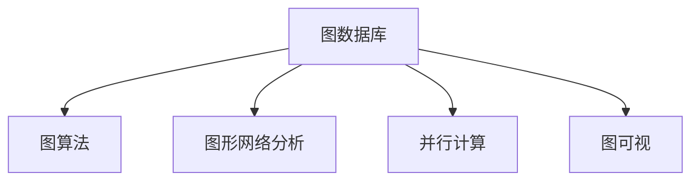

                 

# GraphX 原理与代码实例讲解

> 关键词：
- GraphX
- 图算法
- 图数据库
- 并行计算
- 复杂网络分析
- 社区检测
- 图可视

## 1. 背景介绍

### 1.1 问题由来

随着互联网和大数据技术的发展，图形网络分析（Graph Analysis）成为了一种重要的数据处理和分析方法。图形网络分析旨在通过研究节点和边之间的关系，揭示出网络结构中蕴含的重要信息。在金融领域，图形网络分析可以用于风险管理、社交网络分析、推荐系统等多个方向。因此，高效、准确的图形网络分析工具具有重要的应用价值。

在图形网络分析中，图数据库是主要的工具之一。图数据库用于存储和管理图数据，便于进行复杂的图查询和分析。由于图形网络数据的复杂性，传统的SQL数据库无法有效处理，图数据库成为更为合适的选择。

### 1.2 问题核心关键点

目前，市面上存在众多图数据库产品，例如：

- Neo4j：使用Cypher语言进行查询，支持丰富的图算法和高级特性。
- OrientDB：支持SQL查询、图查询、JSON查询等多种查询方式。
- JanusGraph：支持多种存储引擎，如Hadoop、BerkeleyDB、In-Memory Store等。
- ArangoDB：支持多模型数据存储，包括文档、图形、键值等多种数据类型。

然而，由于图形网络数据的复杂性，图数据库的设计和应用具有一定的技术门槛。本文将从原理上阐述GraphX工具，并结合代码实例，讲解其基本使用流程。

## 2. 核心概念与联系

### 2.1 核心概念概述

为更好地理解GraphX工具，本节将介绍几个密切相关的核心概念：

- 图数据库(Graph Database)：一种用于存储和管理图数据的数据库。图数据库通过节点和边的关系进行数据存储和查询。
- 图算法(Graph Algorithm)：对图数据进行操作的算法，例如：最短路径算法、最小生成树算法、社区检测算法等。
- 图形网络分析(Graph Network Analysis)：通过分析图形网络数据的结构、属性等信息，揭示其潜在特征和规律。
- 并行计算(Parallel Computing)：将计算任务分配到多个处理器或计算节点上同时执行，提高计算效率。
- 图可视(Graph Visualization)：将图形网络数据可视化展示，便于直观理解数据结构和特征。

这些核心概念之间的逻辑关系可以通过以下Mermaid流程图来展示：



这个流程图展示了大数据背景下图形网络分析的各个关键组件及其之间的关系：

1. 图数据库存储和管理图形网络数据，是图形网络分析的基础。
2. 图算法对图数据进行操作，揭示网络结构中的重要特征。
3. 图形网络分析揭示图形网络数据中的规律和规律，如社交网络中的社区结构。
4. 并行计算提高了图算法的计算效率，支持大规模数据处理。
5. 图可视提供了直观的数据展示，便于对图形网络数据的理解和分析。

这些概念共同构成了图形网络分析的完整框架，使得图形网络分析能够高效、准确地进行。

## 3. 核心算法原理 & 具体操作步骤

### 3.1 算法原理概述

GraphX工具是基于Apache Spark的大数据图形处理工具，提供了一套完整的图形算法和操作接口，支持在分布式环境下进行高效的图形网络分析。GraphX的主要算法包括：

- 最短路径算法：用于计算两个节点之间的最短路径。
- 最小生成树算法：用于生成一个最小代价的树，连接所有节点。
- 社区检测算法：用于将图形网络数据分为多个社区。
- 图可视算法：用于可视化图形网络数据。

GraphX工具的核心思想是通过分布式计算框架Apache Spark，实现并行化图算法的处理，从而支持大规模图形网络数据的分析。

### 3.2 算法步骤详解

GraphX的基本使用流程包括以下几个关键步骤：

**Step 1: 创建图形网络数据**

GraphX工具提供多种方式创建图形网络数据，例如：

- 从图数据库导入数据：
```python
from graphx import Graph
graph = Graph.load("path/to/graph.gpgraph")
```

- 使用Spark GraphData创建图形网络数据：
```python
from pyspark.sql.functions import col
from graphx import SparkGraph

spark = SparkSession.builder.appName("GraphX Example").getOrCreate()
graph_data = spark.createDataFrame(list(zip(graph_v, graph_e)), ["src", "dst", "attr"])
graph = SparkGraph(spark, graph_data)
```

**Step 2: 执行图形网络分析**

GraphX工具提供了丰富的图算法接口，用于对图形网络数据进行复杂的分析操作。例如：

- 计算最短路径：
```python
from graphx import shortestPath

result = shortestPath(graph, "source", "destination")
```

- 生成最小生成树：
```python
from graphx import minimumSpanningTree

result = minimumSpanningTree(graph)
```

- 进行社区检测：
```python
from graphx import communityDetection

result = communityDetection(graph)
```

**Step 3: 可视化图形网络数据**

GraphX工具还提供了图可视化的接口，方便用户对图形网络数据进行直观展示。例如：

- 创建图形网络可视化对象：
```python
from graphx import GViz

gv = GViz(graph)
```

- 保存图形网络可视化结果到文件：
```python
gv.save("path/to/graph.png")
```

**Step 4: 输出结果**

完成以上步骤后，GraphX工具将输出最终的图形网络分析结果。根据具体任务，可以是路径、树、社区等结构化数据，也可以是图形网络可视化的图片。

### 3.3 算法优缺点

GraphX工具具有以下优点：

- 高性能：基于Apache Spark的大规模并行计算框架，GraphX工具能够高效处理大规模图形网络数据。
- 丰富的图算法支持：GraphX提供了丰富的图算法接口，包括最短路径、最小生成树、社区检测等常见算法。
- 开源免费：GraphX工具是Apache Foundation下的开源项目，免费提供丰富的图算法和操作接口。
- 易于集成：GraphX工具支持与多种大数据平台和图数据库的集成，易于与其他工具配合使用。

同时，GraphX工具也存在一些缺点：

- 学习曲线陡峭：GraphX工具提供了丰富的图算法接口，但使用前需要一定的学习和理解成本。
- 性能瓶颈：由于需要与Apache Spark框架配合使用，在特定数据集上的性能瓶颈问题可能突出。
- 数据格式限制：GraphX工具对图数据格式的要求较高，可能限制了某些数据源的兼容性。

尽管存在这些缺点，但GraphX工具在大规模图形网络数据分析中仍具有重要的应用价值。

### 3.4 算法应用领域

GraphX工具在多个领域中得到广泛应用，例如：

- 社交网络分析：通过对社交网络数据的分析，揭示社交关系中的社区结构和影响力。
- 推荐系统：基于用户和物品之间的交互关系，计算推荐路径，实现个性化推荐。
- 金融风险管理：通过分析金融网络中的企业关系，预测风险传播路径和金融危机。
- 医疗疾病研究：分析患者之间的疾病传播路径，辅助流行病学研究和公共卫生决策。
- 城市交通分析：通过分析城市交通网络中的节点和边关系，优化交通流量和路线规划。

除了上述这些经典应用外，GraphX工具还被创新性地应用于更多场景中，如知识图谱构建、智能问答系统、时间序列分析等，为图形网络分析提供了全新的思路。

## 4. 数学模型和公式 & 详细讲解 & 举例说明

### 4.1 数学模型构建

GraphX工具的数学模型建立在图论的基础上，主要涉及到节点、边、路径、树、社区等图结构的概念。

设G为一个图，其中N表示节点集合，E表示边集合。节点的表示为n，边的表示为e。

定义节点之间的权重为w(n, m)，边之间的权重为w(e)。

GraphX工具的核心算法主要包括最短路径算法、最小生成树算法、社区检测算法等。这些算法均基于图论的数学模型构建。

### 4.2 公式推导过程

以最短路径算法为例，其核心思想是从起点节点到目标节点，通过不断更新节点的最短路径长度，最终计算出起点到目标节点的最短路径。

设G为一个无向图，V为节点集合，E为边集合。

从节点s到节点t的最短路径长度d(s, t)可以表示为：

$$
d(s, t) = \min_{p \in \Pi(s, t)} \sum_{e \in p} w(e)
$$

其中，Π(s, t)表示从节点s到节点t的所有路径集合。

最短路径算法的具体推导过程如下：

1. 初始化：从节点s开始，将所有节点的最短路径长度设置为无穷大，仅起点s的最短路径长度设置为0。

2. 迭代更新：从起点节点开始，不断更新其他节点的最短路径长度，直到到达目标节点。

3. 输出结果：遍历所有节点，得到从起点节点到其他节点的最短路径长度。

### 4.3 案例分析与讲解

以社交网络分析为例，通过GraphX工具计算社交网络中的社区结构。社交网络数据可以表示为一个图G，其中节点表示用户，边表示用户之间的连接关系。

使用GraphX工具进行社交网络社区检测的步骤如下：

1. 导入社交网络数据：
```python
graph = Graph.load("path/to/social_network.gpgraph")
```

2. 计算社交网络中的社区结构：
```python
from graphx import communityDetection

result = communityDetection(graph)
```

3. 可视化社区结构：
```python
from graphx import GViz

gv = GViz(graph)
```

4. 保存社区结构可视化结果到文件：
```python
gv.save("path/to/community.png")
```

通过GraphX工具，可以高效地分析社交网络数据，揭示用户之间的关系和社区结构。

## 5. 项目实践：代码实例和详细解释说明

### 5.1 开发环境搭建

在进行GraphX实践前，我们需要准备好开发环境。以下是使用Python进行Apache Spark开发的环境配置流程：

1. 安装Apache Spark：从官网下载并安装Apache Spark，安装过程中需选择支持图处理的功能。

2. 安装GraphX工具包：
```python
pip install graphx
```

3. 安装Spark GraphX扩展模块：
```python
pip install spark-graphx
```

完成上述步骤后，即可在Spark环境中开始GraphX实践。

### 5.2 源代码详细实现

下面我们以社交网络分析为例，给出使用GraphX工具对社交网络数据进行社区检测的Python代码实现。

首先，导入相关库：

```python
from pyspark.sql import SparkSession
from graphx import Graph, shortestPath, minimumSpanningTree, communityDetection
from pyspark.sql.functions import col
```

然后，创建Spark会话和图形网络数据：

```python
spark = SparkSession.builder.appName("GraphX Example").getOrCreate()

graph_data = spark.createDataFrame(list(zip(graph_v, graph_e)), ["src", "dst", "attr"])
graph = Graph(spark, graph_data)
```

接着，执行社区检测算法：

```python
result = communityDetection(graph)
```

最后，保存社区检测结果：

```python
result.save("path/to/community")
```

以上就是使用Python对社交网络数据进行社区检测的完整代码实现。

### 5.3 代码解读与分析

让我们再详细解读一下关键代码的实现细节：

- `graph_data`：表示图数据的Spark DataFrame，包含了节点和边信息。
- `Graph(spark, graph_data)`：创建GraphX工具中的图形网络对象。
- `communityDetection(graph)`：对图形网络数据进行社区检测，返回社区结构结果。
- `result.save("path/to/community")`：保存社区结构结果到文件。

通过GraphX工具，可以简单、高效地进行社交网络社区检测，揭示网络中的社区结构和关系。

### 5.4 运行结果展示

完成以上步骤后，GraphX工具将输出社交网络社区检测的结果，其中包含了各个节点的社区标签和所属社区的节点数量。

通过可视化工具，可以将社区结构结果展示为图形网络可视化图片，便于直观理解数据结构和特征。

## 6. 实际应用场景

### 6.1 智能问答系统

基于GraphX工具的智能问答系统可以通过图形网络分析技术，从用户提问和知识库中构建知识图谱，从而实现智能问答。通过将用户提问和知识库中的知识进行图形网络表示，GraphX工具可以高效计算出相关知识点的路径，从而回答用户问题。

在技术实现上，可以使用知识图谱中节点和边的关系，对用户提问和知识库中的知识进行图形网络表示，并使用GraphX工具进行计算。具体流程如下：

1. 将用户提问和知识库中的知识进行图形网络表示，生成知识图谱。
2. 使用GraphX工具计算知识图谱中各个知识点的路径。
3. 根据计算结果，给出最佳答案。

通过GraphX工具，智能问答系统可以高效地从知识图谱中提取相关信息，实现准确、快速的智能问答。

### 6.2 推荐系统

基于GraphX工具的推荐系统可以通过图形网络分析技术，计算用户和物品之间的相似度，从而实现个性化推荐。通过将用户和物品的关系表示为图形网络，GraphX工具可以高效计算出用户和物品之间的相似度，从而推荐用户可能感兴趣的物品。

在技术实现上，可以使用GraphX工具计算用户和物品之间的相似度，具体流程如下：

1. 将用户和物品的关系表示为图形网络，生成用户-物品图。
2. 使用GraphX工具计算用户和物品之间的相似度。
3. 根据相似度排序，推荐用户可能感兴趣的物品。

通过GraphX工具，推荐系统可以高效地计算用户和物品之间的相似度，实现个性化推荐。

### 6.3 城市交通分析

基于GraphX工具的城市交通分析可以通过图形网络分析技术，优化交通流量和路线规划，从而提升城市交通效率。通过将城市交通网络中的节点和边关系进行图形网络表示，GraphX工具可以高效计算出最优的交通路线，从而优化交通流量。

在技术实现上，可以使用GraphX工具计算城市交通网络中的最短路径，具体流程如下：

1. 将城市交通网络中的节点和边关系表示为图形网络，生成城市交通图。
2. 使用GraphX工具计算城市交通图中的最短路径。
3. 根据最短路径结果，优化交通流量和路线规划。

通过GraphX工具，城市交通分析可以高效地计算最优的交通路线，提升城市交通效率。

### 6.4 未来应用展望

随着图算法和大数据技术的不断发展，GraphX工具将在更多领域得到应用，为各个行业带来变革性影响。

在智慧医疗领域，基于GraphX工具的医疗问答、病历分析、药物研发等应用将提升医疗服务的智能化水平，辅助医生诊疗，加速新药开发进程。

在智能教育领域，GraphX工具可应用于作业批改、学情分析、知识推荐等方面，因材施教，促进教育公平，提高教学质量。

在智慧城市治理中，GraphX工具可用于城市事件监测、舆情分析、应急指挥等环节，提高城市管理的自动化和智能化水平，构建更安全、高效的未来城市。

此外，在企业生产、社会治理、文娱传媒等众多领域，基于GraphX工具的人工智能应用也将不断涌现，为经济社会发展注入新的动力。

## 7. 工具和资源推荐

### 7.1 学习资源推荐

为了帮助开发者系统掌握GraphX工具的理论基础和实践技巧，这里推荐一些优质的学习资源：

1. GraphX官方文档：Apache Foundation下的GraphX官方文档，提供了完整的工具使用教程和接口参考。

2. Apache Spark官方文档：Apache Foundation下的Apache Spark官方文档，提供了丰富的分布式计算技术支持。

3. 《Spark GraphX 数据处理与分析实战》书籍：详细介绍了GraphX工具的基本原理和实际应用，适合初学者和开发者。

4. GraphX实战案例：GitHub上提供了大量GraphX工具的实际应用案例，可以直观学习GraphX工具的使用。

5. GraphX社区：Apache Foundation下的GraphX社区，提供交流和技术支持。

通过对这些资源的学习实践，相信你一定能够快速掌握GraphX工具的精髓，并用于解决实际的图形网络分析问题。

### 7.2 开发工具推荐

高效的开发离不开优秀的工具支持。以下是几款用于GraphX工具开发和应用推荐的常用工具：

1. Apache Spark：基于内存计算的分布式计算框架，支持大规模数据处理。

2. Jupyter Notebook：开源的交互式笔记本，可以方便地进行代码编写和结果展示。

3. PyCharm：功能强大的Python IDE，支持自动代码补全、调试等功能。

4. Spark GraphX扩展模块：Apache Foundation下的Spark GraphX扩展模块，提供了丰富的图算法接口。

5. Neo4j：支持Cypher语言查询和图算法，是常用的图形数据库之一。

合理利用这些工具，可以显著提升GraphX工具的开发效率，加快创新迭代的步伐。

### 7.3 相关论文推荐

GraphX工具的发展源于学界的持续研究。以下是几篇奠基性的相关论文，推荐阅读：

1. GraphX: A Graph Processing Framework for Spark：GraphX工具的原始论文，介绍了GraphX工具的基本原理和使用方法。

2. GraphX: A Scalable Framework for Bulk Graph Processing：进一步探讨了GraphX工具在大规模图数据上的处理能力。

3. Combining GraphX and Scalability to make Heterogeneous Graph Databases Practical：探讨了GraphX工具在异构图数据库上的应用。

4. A Survey on the Design and Implementation of Graph Processing Systems：综述了当前图形网络分析工具的研究现状和应用。

这些论文代表了大规模图处理技术的发展脉络。通过学习这些前沿成果，可以帮助研究者把握学科前进方向，激发更多的创新灵感。

## 8. 总结：未来发展趋势与挑战

### 8.1 总结

本文对GraphX工具的原理和代码实现进行了全面系统的介绍。首先阐述了GraphX工具的研究背景和应用意义，明确了GraphX工具在大规模图数据处理中的重要价值。其次，从原理到实践，详细讲解了GraphX工具的基本使用流程和核心算法，给出了GraphX工具的代码实例。同时，本文还广泛探讨了GraphX工具在社交网络分析、推荐系统、城市交通分析等多个领域的应用前景，展示了GraphX工具的广泛应用潜力。此外，本文精选了GraphX工具的学习资源和开发工具，力求为读者提供全方位的技术指引。

通过本文的系统梳理，可以看到，GraphX工具在图形网络分析领域具有重要的应用价值，能够高效处理大规模图数据，揭示网络结构和关系。未来，伴随图形网络分析技术的不断发展，GraphX工具必将在更多领域得到应用，为人类社会带来新的变革。

### 8.2 未来发展趋势

展望未来，GraphX工具将呈现以下几个发展趋势：

1. 图处理技术更加成熟：随着分布式计算和图处理技术的发展，GraphX工具将具备更强的处理能力和更高效率。

2. 图算法多样化：GraphX工具将提供更多的图算法接口，支持更多的图处理任务。

3. 可视化增强：GraphX工具将提供更丰富的可视化工具，便于直观展示图数据结构和特征。

4. 与其他工具集成：GraphX工具将与其他大数据平台和图数据库实现更好的集成，扩展应用范围。

5. 云计算支持：GraphX工具将更好地支持云环境下的图处理任务，提供更高的性能和更好的扩展性。

6. 图数据采集和处理：GraphX工具将提供更强大的图数据采集和处理能力，支持更多数据源的接入和处理。

以上趋势凸显了GraphX工具的广阔前景。这些方向的探索发展，必将进一步提升GraphX工具的性能和应用范围，为图形网络分析带来新的突破。

### 8.3 面临的挑战

尽管GraphX工具在图形网络分析中已经取得了一定成就，但在迈向更加智能化、普适化应用的过程中，仍面临以下挑战：

1. 学习曲线陡峭：GraphX工具提供了丰富的图算法接口，但使用前需要一定的学习和理解成本。

2. 性能瓶颈：由于需要与Apache Spark框架配合使用，在特定数据集上的性能瓶颈问题可能突出。

3. 数据格式限制：GraphX工具对图数据格式的要求较高，可能限制了某些数据源的兼容性。

4. 社区和生态系统不够成熟：GraphX社区和生态系统仍在发展中，缺乏大范围的应用案例和社区支持。

尽管存在这些挑战，但GraphX工具在大规模图数据处理和分析中仍具有重要的应用价值。

### 8.4 研究展望

未来，GraphX工具的研究方向主要集中在以下几个方面：

1. 图处理性能优化：优化图处理算法，提高GraphX工具的计算效率和处理能力。

2. 图算法多样化：开发新的图算法，支持更多的图处理任务，增强GraphX工具的适用范围。

3. 图数据采集和处理：优化图数据采集和处理机制，支持更多数据源的接入和处理。

4. 可视化增强：提供更丰富的可视化工具，便于直观展示图数据结构和特征。

5. 与其他工具集成：实现更好的与其他大数据平台和图数据库的集成，扩展应用范围。

6. 社区和生态系统建设：加强社区和生态系统建设，提供更多应用案例和社区支持。

这些研究方向将推动GraphX工具在图形网络分析领域的发展，提升其在各个行业中的应用价值。

## 9. 附录：常见问题与解答

**Q1：GraphX工具适用于所有图处理任务吗？**

A: GraphX工具适用于大多数图处理任务，尤其是大规模图数据处理。但对于某些特殊场景，如图数据格式复杂、图算法特定等，可能需要结合其他工具或方法进行优化。

**Q2：GraphX工具支持分布式计算吗？**

A: GraphX工具是建立在Apache Spark框架上的分布式图处理工具，支持大规模图数据处理。

**Q3：GraphX工具如何进行图数据采集和处理？**

A: GraphX工具提供了多种图数据采集和处理接口，可以方便地从不同数据源中提取和处理图数据。

**Q4：GraphX工具如何进行图可视化和展示？**

A: GraphX工具提供了多种图可视化和展示工具，可以方便地将图数据转换为图形网络可视化图片。

通过这些问答，可以看出GraphX工具在图形网络分析领域具有重要的应用价值，但同时也面临着一定的挑战。只有不断优化GraphX工具的性能和应用范围，才能更好地满足用户需求，推动图形网络分析技术的不断进步。

---

作者：禅与计算机程序设计艺术 / Zen and the Art of Computer Programming

