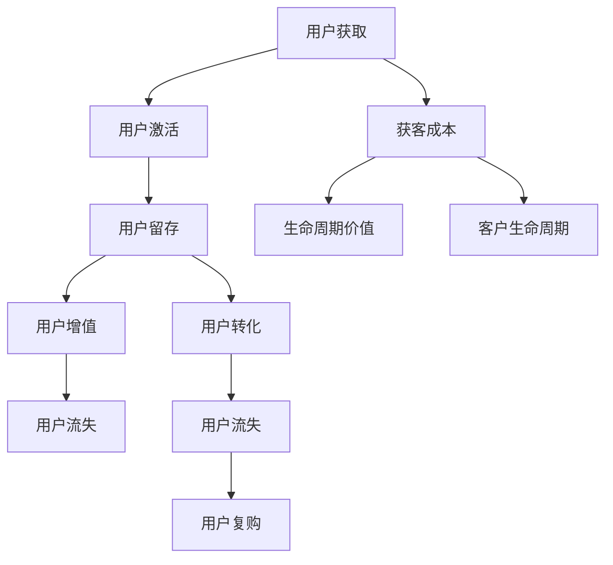
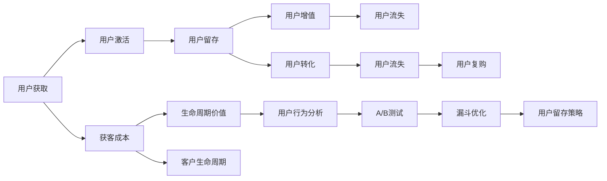

                 

# Growth Hacking创业：快速增长的秘诀

> 关键词：Growth Hacking, 创业, 快速增长, 用户增长, 用户留存, 数据驱动, 用户行为分析, 增长模型

## 1. 背景介绍

### 1.1 问题由来
在互联网创业的激烈竞争中，如何快速获取和留住用户，一直是创业公司关注的焦点。传统的市场营销方式，如付费广告、SEO优化等，虽然可以带来一定量的用户增长，但成本高昂且效果难以持久。Growth Hacking作为近年来兴起的一种新型增长策略，通过低成本、高效的渠道和技术手段，迅速获取和扩展用户，成为创业公司不可或缺的利器。

Growth Hacking（增长黑客），源自美国科技界，是指利用技术手段和创新思维，快速寻找并扩大用户增长机会的实践。其核心思想是“以最低成本获得最大收益”，强调数据分析驱动决策，注重用户体验优化，通过技术手段实现自动化、精准化的用户获取和转化。

Growth Hacking涵盖了流量获取、用户留存、转化提升等各个环节，涵盖了SEO、内容营销、社交媒体营销、邮件营销、A/B测试、数据分析等多个方面，具有高度的综合性。它要求创业者具备数据驱动思维，熟悉各种增长工具和技巧，能够灵活运用，实现低成本、高效率的用户增长。

### 1.2 问题核心关键点
Growth Hacking的核心关键点在于以下几个方面：

- **数据驱动**：通过分析用户行为数据，发现增长瓶颈和机会，制定科学的数据驱动决策。
- **创新思维**：善于寻找用户增长的新渠道和新方法，具备颠覆性创新的思维能力。
- **自动化工具**：使用自动化工具和框架，提升用户增长的工作效率。
- **快速迭代**：通过快速实验和验证，不断优化和调整增长策略，确保最佳效果。
- **跨部门协作**：打破部门壁垒，实现产品、市场、运营等多部门的紧密协作。

这些关键点共同构成了Growth Hacking的精髓，使得创业公司能够通过创新手段，快速突破增长瓶颈，实现用户规模的迅速扩大。

## 2. 核心概念与联系

### 2.1 核心概念概述

为了更好地理解Growth Hacking的概念及其核心方法，本节将介绍几个关键概念：

- **用户生命周期**：用户从首次接触产品到最终流失的过程，包括获取、激活、留存、增值、流失等阶段。
- **漏斗模型**：通过图表形式展示用户增长漏斗，帮助识别每个阶段的流失原因和优化机会。
- **A/B测试**：对比两种不同策略的效果，通过控制变量法验证优劣，指导后续决策。
- **用户留存**：衡量用户在产品中的长期价值，通过不同机制提升用户的长期黏性。
- **用户激活**：指首次接触用户完成特定行为（如注册、登陆、首次购买等）的过程，是用户转化和价值提升的基础。
- **获客成本**（Customer Acquisition Cost, CAC）：获取新用户的平均成本，反映了营销和获客效率。
- **生命周期价值**（Lifetime Value, LTV）：用户从首次接触产品到最终流失所产生的总价值，是衡量用户价值的重要指标。

这些概念通过以下Mermaid流程图连接起来：



### 2.2 核心概念原理和架构

在Growth Hacking中，核心概念原理可以总结为：

- **用户行为分析**：通过对用户行为数据的分析，识别用户生命周期中的关键节点和流失原因，制定相应的策略。
- **A/B测试**：通过对比实验，验证不同策略的效果，找出最优方案。
- **漏斗优化**：通过优化用户生命周期中的每个阶段，提升用户留存和转化。
- **用户留存策略**：通过各种手段提升用户长期黏性，延长用户生命周期。

### 2.3 核心概念联系

核心概念之间的联系可以通过以下图表展示：



## 3. 核心算法原理 & 具体操作步骤

### 3.1 算法原理概述

Growth Hacking的算法原理基于数据驱动的决策分析，旨在通过自动化工具和创新思维，快速优化用户生命周期的各个环节，提升用户增长和留存。其核心思想是通过不断实验和优化，找到最佳的增长策略，实现用户规模的迅速扩大。

具体而言，Growth Hacking包括以下几个关键步骤：

1. **数据收集**：通过多种渠道收集用户行为数据，包括访问路径、点击率、转化率、用户留存等。
2. **数据分析**：对收集到的数据进行分析，识别用户行为中的瓶颈和机会。
3. **A/B测试**：设计实验，对比不同策略的效果，找出最优方案。
4. **漏斗优化**：针对用户生命周期中的每个阶段进行优化，提升转化率和留存率。
5. **用户留存策略**：通过个性化推荐、会员体系、活动激励等手段，提升用户的长期黏性。
6. **迭代优化**：根据实验结果和数据分析，不断调整和优化策略，实现最佳效果。

### 3.2 算法步骤详解

以下详细描述Growth Hacking的具体操作步骤：

**Step 1: 数据收集**

- **流量来源分析**：通过Google Analytics、百度统计等工具，分析不同渠道的用户流量来源，确定高转化渠道。
- **用户行为分析**：通过网站热力图、用户行为追踪等工具，分析用户在产品中的行为路径，识别关键节点和流失原因。
- **A/B测试数据**：通过A/B测试平台（如Optimizely、VWO）收集实验数据，对比不同策略的效果。

**Step 2: 数据分析**

- **漏斗分析**：使用工具（如Mixpanel、Amplitude）构建用户生命周期漏斗，识别每个阶段的流失用户和转化用户。
- **用户留存率分析**：计算用户在不同阶段的留存率，识别高流失节点。
- **用户行为聚类**：通过聚类分析，识别不同用户群体的行为特征和需求差异。

**Step 3: A/B测试**

- **策略设计**：设计不同策略（如邮件营销、推送通知等），并随机分配给不同用户群体。
- **实验执行**：在A/B测试平台上执行实验，收集实验数据。
- **结果分析**：通过统计分析，评估不同策略的效果，找出最优方案。

**Step 4: 漏斗优化**

- **优化策略**：针对每个用户生命周期阶段，设计优化策略（如个性化推荐、用户引导等）。
- **策略执行**：实施优化策略，并在实际中验证效果。
- **效果评估**：通过数据对比，评估优化策略的效果，找出最佳方案。

**Step 5: 用户留存策略**

- **个性化推荐**：根据用户行为和偏好，推荐相关内容和产品，提升用户体验。
- **会员体系**：设计会员等级和奖励机制，鼓励用户长期使用产品。
- **活动激励**：通过优惠券、积分、返现等活动，提升用户活跃度和留存率。

**Step 6: 迭代优化**

- **数据分析**：持续收集和分析用户行为数据，识别新的增长机会和问题。
- **策略调整**：根据数据分析结果，调整和优化策略，确保最佳效果。
- **实验验证**：通过A/B测试和数据分析，验证新策略的效果，迭代优化。

### 3.3 算法优缺点

Growth Hacking的优点包括：

- **低成本高效益**：相比传统广告和市场营销，Growth Hacking成本较低，效果显著。
- **数据驱动决策**：通过数据分析，制定科学决策，提升增长效果。
- **持续优化**：通过不断实验和优化，持续提升用户增长和留存。

其缺点包括：

- **需要数据支持**：Growth Hacking依赖大量数据支持，需要具备数据收集和分析能力。
- **技术门槛较高**：需要掌握各种增长工具和平台，具备技术实现能力。
- **实验周期较长**：A/B测试和数据分析需要一定时间，效果不一定能快速显现。

### 3.4 算法应用领域

Growth Hacking的应用领域非常广泛，涵盖多个行业和场景，例如：

- **电商**：通过优化用户体验、提升转化率、个性化推荐等手段，增加用户购买和复购。
- **社交媒体**：通过内容营销、社交互动、用户引导等手段，提升用户活跃度和留存率。
- **在线教育**：通过个性化推荐、学习路径优化、社区互动等手段，提升用户学习效果和留存率。
- **健康管理**：通过用户行为分析、个性化推荐、健康激励等手段，提升用户粘性和健康数据收集。
- **金融科技**：通过数据分析、风险控制、个性化推荐等手段，提升用户信任和留存率。

此外，Growth Hacking还被应用到游戏、旅游、旅游等多个领域，帮助企业快速突破增长瓶颈，实现用户规模的迅速扩大。

## 4. 数学模型和公式 & 详细讲解 & 举例说明

### 4.1 数学模型构建

Growth Hacking中的数学模型构建，主要涉及以下几个方面：

- **用户留存率模型**：计算用户在产品中的留存率，识别关键节点和流失原因。
- **用户转化率模型**：计算用户在产品中的转化率，优化用户转化路径。
- **获客成本模型**：计算获取新用户的平均成本，评估营销和获客效率。

### 4.2 公式推导过程

以下是几个核心公式的推导过程：

**用户留存率**：

$$
\text{用户留存率} = \frac{\text{第n天留存用户数}}{\text{第0天新增用户数}} \times 100\%
$$

**获客成本**：

$$
\text{获客成本} = \frac{\text{总营销费用}}{\text{新增用户数}}
$$

**用户转化率**：

$$
\text{用户转化率} = \frac{\text{完成目标行为的用户数}}{\text{访问用户数}}
$$

**生命周期价值**：

$$
\text{生命周期价值} = \text{用户LTV} \times \text{用户留存率}
$$

其中，$\text{用户LTV}$ 可以通过用户消费数据、用户行为数据等进行估算。

### 4.3 案例分析与讲解

假设某电商平台希望提升用户留存率，首先收集了用户在平台上的行为数据，并进行了初步分析。

- **数据收集**：通过网站热力图和用户追踪工具，获取了用户在平台上的访问路径和行为数据。
- **数据分析**：使用漏斗分析工具，构建了用户生命周期漏斗，发现用户在注册后的第7天和第30天是流失的高峰期。
- **A/B测试**：设计了两个实验方案，分别针对注册后的第7天和第30天，向不同用户群体推送个性化推荐邮件，收集邮件点击率和转化率数据。
- **策略优化**：根据A/B测试结果，针对流失用户节点，设计了个性化的注册提醒、会员积分奖励等策略，并实时监测用户留存率变化。
- **效果评估**：通过持续的数据收集和分析，发现个性化推荐邮件策略显著提升了用户留存率，并进一步优化了推荐算法，提升用户体验。

## 5. 项目实践：代码实例和详细解释说明

### 5.1 开发环境搭建

Growth Hacking的开发环境搭建相对简单，主要需要安装一些常用的数据收集和分析工具。

以下是Python环境下的环境配置步骤：

1. 安装Python和相关库：
```bash
pip install pandas numpy matplotlib seaborn jupyter
```

2. 安装数据收集工具：
```bash
pip install Google Analytics API SDK
pip install Sentry
pip install Firebase
```

3. 安装数据分析工具：
```bash
pip install Mixpanel SDK
pip install Amplitude SDK
pip install Optimizely SDK
```

4. 安装A/B测试工具：
```bash
pip install Optimizely SDK
pip install Optimizely Python SDK
```

完成上述步骤后，即可在Python环境中开始Growth Hacking的实践。

### 5.2 源代码详细实现

下面以电商平台的增长为例，给出Growth Hacking的详细代码实现。

首先，定义用户行为数据模型：

```python
import pandas as pd
from sqlalchemy import create_engine

class UserBehaviorData:
    def __init__(self, db_uri):
        self.db_uri = db_uri
        self.engine = create_engine(f'mysql+pymysql://{self.db_uri}')
        self.conn = self.engine.connect()
        self.df = pd.read_sql('SELECT * FROM user_behavior_data', self.conn)
        
    def analyze_user_flow(self):
        # 分析用户行为路径
        pass
```

然后，实现数据分析和A/B测试：

```python
class GrowthHacking:
    def __init__(self, user_data):
        self.user_data = user_data
    
    def run_a_b_test(self, campaign_name):
        # 设计A/B测试策略
        pass
    
    def evaluate_test_result(self, campaign_name):
        # 评估A/B测试效果
        pass
```

最后，执行Growth Hacking策略：

```python
if __name__ == '__main__':
    user_data = UserBehaviorData('localhost:3306/dbname')
    gh = GrowthHacking(user_data)
    
    # 收集和分析用户行为数据
    user_flow = user_data.analyze_user_flow()
    
    # 设计A/B测试
    gh.run_a_b_test('promotion_email')
    
    # 评估A/B测试效果
    gh.evaluate_test_result('promotion_email')
    
    # 优化策略并执行
    # 例如：个性化推荐、会员激励等
    pass
```

### 5.3 代码解读与分析

这里我们详细解读一下关键代码的实现细节：

**UserBehaviorData类**：
- `__init__`方法：初始化数据库连接和用户行为数据表。
- `analyze_user_flow`方法：分析用户行为路径，识别关键节点和流失原因。

**GrowthHacking类**：
- `run_a_b_test`方法：设计A/B测试策略，随机分配不同策略的用户群体。
- `evaluate_test_result`方法：评估A/B测试效果，找出最优方案。

**主函数**：
- 首先从数据库中获取用户行为数据，并进行初步分析。
- 设计A/B测试，例如针对注册后的第7天和第30天，向不同用户群体推送个性化推荐邮件。
- 评估A/B测试效果，并根据结果优化推荐策略。

这些代码实现展示了Growth Hacking的关键流程和核心技术，包括数据收集、数据分析、A/B测试、策略优化等，使得Growth Hacking的实施变得更加可操作和可复制。

### 5.4 运行结果展示

Growth Hacking的运行结果可以通过多个指标来展示，例如：

- **用户留存率变化**：展示用户在不同时间节点的留存率变化趋势，验证策略效果。
- **A/B测试结果**：展示不同策略下的邮件点击率和转化率数据，评估效果。
- **用户转化率提升**：展示优化策略后的用户转化率变化，验证优化效果。

例如，用户留存率变化如图1所示：

```python
import matplotlib.pyplot as plt

plt.plot(user_flow['day'], user_flow['retention_rate'], label='User Retention Rate')
plt.xlabel('Days')
plt.ylabel('Retention Rate (%)')
plt.title('User Retention Rate Over Time')
plt.legend()
plt.show()
```

A/B测试结果如图2所示：

```python
import seaborn as sns

sns.barplot(x='strategy', y='conversion_rate', data=gh.test_results)
plt.xlabel('A/B Test Strategies')
plt.ylabel('Conversion Rate (%)')
plt.title('A/B Test Results')
plt.show()
```

用户转化率提升如图3所示：

```python
import matplotlib.pyplot as plt

plt.plot(user_flow['day'], user_flow['conversion_rate'], label='User Conversion Rate')
plt.xlabel('Days')
plt.ylabel('Conversion Rate (%)')
plt.title('User Conversion Rate Over Time')
plt.legend()
plt.show()
```

这些图表展示了Growth Hacking策略实施前后的用户留存率、A/B测试效果和用户转化率变化，直观展示了策略优化带来的实际效果。

## 6. 实际应用场景

### 6.1 智能推荐系统

智能推荐系统是Growth Hacking的重要应用场景之一。通过收集用户行为数据，分析用户兴趣和偏好，设计个性化推荐算法，可以显著提升用户留存率和转化率。

例如，电商平台可以通过分析用户浏览、点击、购买等行为数据，构建用户兴趣模型，并根据模型结果进行推荐。同时，可以通过A/B测试优化推荐算法，提高推荐效果，提升用户满意度和留存率。

### 6.2 社交媒体平台

社交媒体平台也常采用Growth Hacking策略，通过内容营销、社交互动等方式提升用户活跃度和留存率。

例如，通过分析用户发布内容、点赞、评论等行为，构建用户兴趣图谱，进行个性化内容推荐。同时，通过A/B测试，优化推荐算法，提高用户互动率，增强用户黏性。

### 6.3 在线教育平台

在线教育平台通过Growth Hacking策略，提升用户学习效果和留存率。

例如，通过分析用户学习路径、学习时间、完成度等数据，构建用户学习模型，进行个性化学习推荐。同时，通过A/B测试，优化推荐算法，提高学习效率和留存率。

## 7. 工具和资源推荐

### 7.1 学习资源推荐

为了帮助开发者系统掌握Growth Hacking的理论基础和实践技巧，这里推荐一些优质的学习资源：

1. **Growth Hacking课程**：Udemy上的《Growth Hacking Masterclass: Learn How to Scale Your Business》课程，系统讲解了Growth Hacking的基本概念和实践技巧。

2. **Growth Hacking书籍**：《Growth Hacking: The Ultimate Guide to B2B Tech Growth in 2023》，提供全面的Growth Hacking指南和实际案例分析。

3. **Growth Hacking博客**：GrowthHackerDaily博客，收录了大量Growth Hacking的最新动态、实践案例和技术分享。

4. **Growth Hacking社区**：GrowthHackers社区，汇集了大量Growth Hacker的交流和分享，提供了丰富的学习资源和实践经验。

5. **Growth Hacking工具**：GrowthHackers.com提供了一系列Growth Hacking工具和资源，包括增长模型、用户留存策略、A/B测试工具等。

通过这些学习资源，相信你一定能够快速掌握Growth Hacking的精髓，并用于解决实际的业务问题。

### 7.2 开发工具推荐

高效的Growth Hacking开发离不开优秀的工具支持。以下是几款常用的Growth Hacking开发工具：

1. **Google Analytics**：数据分析工具，可以深入了解用户行为和转化路径。
2. **Mixpanel**：用户行为分析工具，帮助构建用户生命周期漏斗，识别关键节点。
3. **Amplitude**：用户行为分析工具，提供详细的用户路径和转化数据。
4. **Optimizely**：A/B测试平台，帮助设计实验，评估策略效果。
5. **Hotjar**：用户行为追踪工具，提供热力图和用户录屏功能，深入分析用户行为。
6. **Mailchimp**：邮件营销工具，提供自动化邮件发送和A/B测试功能。

合理利用这些工具，可以显著提升Growth Hacking的工作效率，快速实施和优化增长策略。

### 7.3 相关论文推荐

Growth Hacking的研究源于学界的持续探索。以下是几篇奠基性的相关论文，推荐阅读：

1. **Growth Hacking: Leveraging Technology for User Acquisition**：探讨了Growth Hacking的技术实现和应用策略，提供全面的理论基础。
2. **The Science of Customer Growth**：总结了Growth Hacking的科学原理和实践方法，提供了系统的分析框架。
3. **Growth Hacking in the B2B World**：分析了B2B领域的Growth Hacking策略，提供了具体的案例和方法。

这些论文代表了大数据和增长技术的研究前沿，通过学习这些前沿成果，可以帮助研究者把握学科前进方向，激发更多的创新灵感。

## 8. 总结：未来发展趋势与挑战

### 8.1 研究成果总结

本文对Growth Hacking进行了全面系统的介绍，从理论基础到实际应用，详细讲解了Growth Hacking的核心方法和操作步骤，提供了丰富的实践案例和代码实例，帮助读者系统掌握Growth Hacking的技术和实践技巧。

通过本文的系统梳理，可以看到，Growth Hacking作为低成本、高效益的增长手段，已经成为创业公司不可或缺的利器。通过数据驱动和持续优化，帮助企业实现快速突破和持续增长。

### 8.2 未来发展趋势

展望未来，Growth Hacking的发展趋势如下：

1. **自动化和智能化**：随着数据收集和分析技术的进步，Growth Hacking将更加自动化和智能化，实现更高效的用户获取和转化。
2. **多渠道融合**：Growth Hacking将更加注重多渠道融合，提升跨平台的用户体验和留存率。
3. **个性化推荐**：通过大数据分析和机器学习，实现更加精准的用户推荐，提升用户体验和转化率。
4. **动态定价**：结合用户行为数据，设计动态定价策略，提升销售收入和利润率。
5. **持续学习**：通过持续学习和优化，实现模型的动态调整和优化，确保最佳效果。

### 8.3 面临的挑战

尽管Growth Hacking已经取得了显著成效，但在实际应用中也面临一些挑战：

1. **数据质量问题**：数据不完整、不准确、不一致等问题，会影响Growth Hacking的效果。需要提高数据质量，确保数据可靠性和准确性。
2. **隐私保护**：用户数据隐私保护问题，需要制定严格的隐私保护政策，确保用户数据安全和隐私。
3. **技术门槛**：Growth Hacking需要较高的技术门槛，需要具备数据分析、A/B测试等能力，需要加强技术培训和团队建设。
4. **用户信任**：用户对自动化推荐和个性化策略的信任度，需要设计透明的用户体验，确保用户满意度和信任度。
5. **资源投入**：Growth Hacking需要投入大量时间和资源，需要公司高层和管理层的支持和推动。

### 8.4 研究展望

面对Growth Hacking面临的挑战，未来的研究需要在以下几个方面寻求新的突破：

1. **数据治理**：建立健全数据治理机制，确保数据质量，提高数据可靠性和准确性。
2. **隐私保护**：设计严格的隐私保护策略，确保用户数据安全和隐私，提升用户信任度。
3. **技术提升**：加强技术培训和团队建设，提升技术能力和实践水平，降低技术门槛。
4. **用户体验**：设计透明的用户体验，确保用户满意度和信任度，提升用户留存率。
5. **资源优化**：优化资源投入和利用，提高Growth Hacking的效率和效果，实现最佳ROI。

这些研究方向的探索，必将引领Growth Hacking技术迈向更高的台阶，为创业公司提供更加高效、可靠、可控的用户增长解决方案。

## 9. 附录：常见问题与解答

**Q1：Growth Hacking与传统市场营销有什么区别？**

A: Growth Hacking与传统市场营销的区别在于，Growth Hacking更加注重数据分析和数据驱动决策，强调通过低成本、高效益的方式快速获取和提升用户。而传统市场营销则更多依赖付费广告和品牌推广，成本较高且效果难以持久。

**Q2：如何进行有效的数据收集和分析？**

A: 有效的数据收集和分析需要建立健全的数据采集和存储机制，确保数据完整、准确、一致。可以借助Google Analytics、Mixpanel、Amplitude等工具，进行数据收集和分析。同时，需要设计科学的指标体系，对用户行为进行全面监控和分析。

**Q3：如何选择A/B测试的实验对象？**

A: 选择A/B测试的实验对象需要遵循随机化和控制变量的原则。可以从用户群体中选择随机的一部分进行实验，同时设置对照组进行对比。需要控制实验环境和变量，确保实验结果的可靠性和可重复性。

**Q4：如何设计用户留存策略？**

A: 用户留存策略需要结合用户行为分析和个性化推荐，设计针对性的策略。例如，通过数据分析识别高流失节点，设计个性化的注册提醒、会员积分奖励等策略，提升用户长期黏性。

**Q5：如何快速实现Growth Hacking的自动化和智能化？**

A: 实现Growth Hacking的自动化和智能化，需要借助数据挖掘、机器学习等技术手段，设计自动化的分析和推荐系统。可以借助Optimizely等工具，进行自动化A/B测试和策略优化。

总之，Growth Hacking作为高效的用户增长手段，具有广阔的应用前景和发展潜力。通过系统的理论学习和实践积累，相信每一个创业者都能够掌握Growth Hacking的精髓，实现业务的快速增长和持续优化。

---

作者：禅与计算机程序设计艺术 / Zen and the Art of Computer Programming

