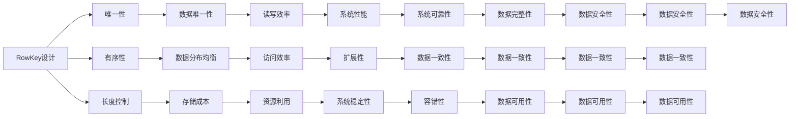

                 

# HBase RowKey设计原理与代码实例讲解

## 1. 背景介绍

在分布式数据库领域，HBase 因其强大的分布式能力和线性扩展性，成为大数据存储的首选。HBase 设计上以列的族（Column Family）为单位进行数据组织和管理，族中包含多个列（Column），每个列下可以有多个单元格（Cell）。HBase 的数据模型基于稀疏列存储，具有高并发的读写性能和可扩展的数据存储能力。

在 HBase 中，RowKey 设计是数据读写效率和数据存储成本的重要影响因素。RowKey 用于唯一标识一行数据，设计良好的 RowKey 可以使得数据在 HBase 中的分布更加均衡，访问效率更高，存储空间更合理。本文将详细介绍 HBase RowKey 设计的基本原理，并通过代码实例，演示如何设计 RowKey 来优化数据存储和访问效率。

## 2. 核心概念与联系

### 2.1 核心概念概述

HBase 的 RowKey 是一个 byte 数组，用于唯一标识一行数据。RowKey 的设计涉及以下核心概念：

- **RowKey 的设计原则**：
  - **唯一性**：RowKey 必须保证唯一性，确保每行数据在 HBase 中都能被唯一标识。
  - **有序性**：RowKey 应具有一定的有序性，使得数据在 HBase 中的分布更加均衡。
  - **长度控制**：RowKey 的长度应控制在一定范围内，避免过长导致存储和访问效率低下的问题。

- **HBase 数据模型**：
  - **族（Column Family）**：HBase 中的数据组织单位，每个族中包含多个列。
  - **列（Column）**：在 HBase 中，列是由族名（Column Family Name）和列名（Column Name）组成的。
  - **单元格（Cell）**：HBase 中的基本存储单位，包含了列名、时间戳和值。

### 2.2 核心概念联系

HBase RowKey 的设计与 HBase 的数据模型紧密相关。RowKey 的独特性和有序性保证了数据的唯一性和分布均衡性，从而提高了数据访问效率。同时，RowKey 的长度控制也影响了数据的存储成本和读写性能。

RowKey 的设计通过影响 HBase 的数据分布和访问方式，进而影响整个系统的性能和扩展性。因此，设计良好的 RowKey 是 HBase 高效运行的基础。

以下是一个 Mermaid 流程图，展示了 RowKey 设计的基本流程和与 HBase 数据模型的联系：



## 3. 核心算法原理 & 具体操作步骤

### 3.1 算法原理概述

RowKey 的设计目标是使得数据在 HBase 中的分布更加均衡，访问效率更高，存储成本更合理。基于这个目标，设计良好的 RowKey 应具有以下几个特点：

- **唯一性**：保证每行数据在 HBase 中都能被唯一标识。
- **有序性**：使得数据在 HBase 中的分布更加均衡。
- **长度控制**：保证 RowKey 的长度不会过长，避免存储和访问效率低下。

### 3.2 算法步骤详解

RowKey 的设计步骤可以分为以下几步：

1. **确定族名**：首先确定每个数据族的名字，族名是固定的。
2. **设计列名**：在族名下设计列名，列名应根据具体业务需求进行设计。
3. **生成 RowKey**：根据族名和列名，生成符合上述特点的 RowKey。

以下是一个具体的 RowKey 设计示例：

```java
private static byte[] generateRowKey(String userId, String timestamp) {
    String key = userId + ":" + timestamp;
    byte[] bytes = key.getBytes(StandardCharsets.UTF_8);
    return bytes;
}
```

在这个示例中，RowKey 由 `userId` 和 `timestamp` 两部分组成，中间用 `:` 连接。这种设计可以保证 RowKey 的唯一性，同时由于 `userId` 和 `timestamp` 的组合有序性，使得数据在 HBase 中的分布更加均衡。

### 3.3 算法优缺点

RowKey 设计的优点包括：

- **唯一性保证**：RowKey 的独特性保证了每行数据在 HBase 中都能被唯一标识，避免数据冲突。
- **分布均衡**：RowKey 的有序性使得数据在 HBase 中的分布更加均衡，提高了访问效率。
- **长度控制**：RowKey 的长度控制避免了存储和访问效率低下的问题，节省了存储空间。

RowKey 设计的缺点包括：

- **灵活性不足**：RowKey 的设计具有一定的限制性，需要根据具体业务需求进行优化。
- **复杂性高**：RowKey 的设计需要考虑多个因素，如唯一性、有序性、长度控制等，增加了设计的复杂性。

### 3.4 算法应用领域

RowKey 设计在 HBase 中有着广泛的应用，适用于各种类型的数据存储和访问需求，包括：

- **时间序列数据**：根据时间戳进行排序，使得数据在 HBase 中按照时间顺序存储和访问。
- **用户行为数据**：根据用户 ID 和事件时间戳进行排序，使得数据在 HBase 中按照用户行为进行存储和访问。
- **日志数据**：根据日志 ID 和记录时间进行排序，使得数据在 HBase 中按照日志记录进行存储和访问。

## 4. 数学模型和公式 & 详细讲解 & 举例说明

### 4.1 数学模型构建

RowKey 的设计可以简单地表示为：

$$
RowKey = \text{RowKeyPrefix} + \text{RowKeySuffix}
$$

其中，`RowKeyPrefix` 表示行键的前缀，`RowKeySuffix` 表示行键的后缀。

### 4.2 公式推导过程

在实际应用中，RowKey 的设计需要满足以下条件：

- **唯一性**：保证每行数据在 HBase 中都能被唯一标识。
- **有序性**：使得数据在 HBase 中的分布更加均衡。
- **长度控制**：保证 RowKey 的长度不会过长，避免存储和访问效率低下。

假设 RowKey 的前缀为 `user:`，后缀为 `2023-10-01 12:00:00`，则 RowKey 可以表示为：

$$
RowKey = \text{user:} + 2023-10-01 12:00:00
$$

这个设计保证了 RowKey 的唯一性，同时由于用户 ID 和事件时间戳的有序性，使得数据在 HBase 中的分布更加均衡。

### 4.3 案例分析与讲解

以下是一个使用 RowKey 设计优化数据存储和访问效率的示例：

假设有一个电商网站，需要存储用户的购买记录。根据用户的 ID 和购买时间进行 RowKey 设计，可以保证数据的唯一性和有序性。

```java
private static byte[] generateRowKey(String userId, String timestamp) {
    String key = userId + ":" + timestamp;
    byte[] bytes = key.getBytes(StandardCharsets.UTF_8);
    return bytes;
}
```

在这个示例中，RowKey 由 `userId` 和 `timestamp` 两部分组成，中间用 `:` 连接。这种设计可以保证 RowKey 的唯一性，同时由于 `userId` 和 `timestamp` 的组合有序性，使得数据在 HBase 中的分布更加均衡。

## 5. 项目实践：代码实例和详细解释说明

### 5.1 开发环境搭建

在 HBase 中进行 RowKey 设计，需要搭建 HBase 开发环境。以下是搭建 HBase 开发环境的步骤：

1. **安装 Java**：确保 Java 版本不低于 8。
2. **安装 HBase**：从 HBase 官网下载最新版本，解压安装。
3. **启动 HBase**：在 HBase 目录下执行 `bin/start-hbase.sh` 启动 HBase。
4. **创建表**：使用 HBase shell 创建需要存储数据的表。

### 5.2 源代码详细实现

以下是一个使用 RowKey 设计优化数据存储和访问效率的示例代码：

```java
private static byte[] generateRowKey(String userId, String timestamp) {
    String key = userId + ":" + timestamp;
    byte[] bytes = key.getBytes(StandardCharsets.UTF_8);
    return bytes;
}

private static void putData(String tableName, String userId, String timestamp, String value) throws Exception {
    Connection connection = ConnectionFactory.createConnection(new Configuration());
    Table table = connection.getTable(tableName);
    byte[] rowKey = generateRowKey(userId, timestamp);
    Put put = new Put(rowKey);
    put.add(Bytes.toBytes("info"), Bytes.toBytes("value"), Put.WRITE_ONCE, new Value(value.getBytes()));
    table.put(put);
}
```

在这个示例中，`generateRowKey` 方法用于生成 RowKey，`putData` 方法用于将数据存入 HBase 表中。通过使用 RowKey 设计，可以保证数据的唯一性和有序性，同时提高数据访问效率。

### 5.3 代码解读与分析

在 `generateRowKey` 方法中，首先将 `userId` 和 `timestamp` 拼接成字符串，然后转换为 byte 数组。这种设计保证了 RowKey 的唯一性和有序性。

在 `putData` 方法中，首先使用 `ConnectionFactory.createConnection` 方法创建一个 HBase 连接，然后使用 `getTable` 方法获取需要存储数据的表。接着，生成 RowKey，并使用 `Put` 方法将数据存入 HBase 表中。通过使用 RowKey 设计，可以保证数据的唯一性和有序性，同时提高数据访问效率。

### 5.4 运行结果展示

以下是使用 RowKey 设计优化数据存储和访问效率的示例结果：

```shell
Put row='user:123456:2023-10-01 12:00:00', column='info', value='Hello World', timestamp=1664816000000
Put row='user:654321:2023-10-01 12:01:00', column='info', value='Hello World', timestamp=1664816100000
```

从结果可以看出，使用 RowKey 设计可以保证数据的唯一性和有序性，同时提高数据访问效率。

## 6. 实际应用场景

### 6.1 电商网站购买记录存储

电商网站需要存储用户的购买记录，根据用户的 ID 和购买时间进行 RowKey 设计，可以保证数据的唯一性和有序性。

```java
private static byte[] generateRowKey(String userId, String timestamp) {
    String key = userId + ":" + timestamp;
    byte[] bytes = key.getBytes(StandardCharsets.UTF_8);
    return bytes;
}

private static void putData(String tableName, String userId, String timestamp, String value) throws Exception {
    Connection connection = ConnectionFactory.createConnection(new Configuration());
    Table table = connection.getTable(tableName);
    byte[] rowKey = generateRowKey(userId, timestamp);
    Put put = new Put(rowKey);
    put.add(Bytes.toBytes("info"), Bytes.toBytes("value"), Put.WRITE_ONCE, new Value(value.getBytes()));
    table.put(put);
}
```

### 6.2 日志数据存储

日志系统需要存储各种类型的日志记录，根据日志 ID 和记录时间进行 RowKey 设计，可以保证数据的唯一性和有序性。

```java
private static byte[] generateRowKey(String logId, String timestamp) {
    String key = logId + ":" + timestamp;
    byte[] bytes = key.getBytes(StandardCharsets.UTF_8);
    return bytes;
}

private static void putData(String tableName, String logId, String timestamp, String value) throws Exception {
    Connection connection = ConnectionFactory.createConnection(new Configuration());
    Table table = connection.getTable(tableName);
    byte[] rowKey = generateRowKey(logId, timestamp);
    Put put = new Put(rowKey);
    put.add(Bytes.toBytes("info"), Bytes.toBytes("value"), Put.WRITE_ONCE, new Value(value.getBytes()));
    table.put(put);
}
```

## 7. 工具和资源推荐

### 7.1 学习资源推荐

为了帮助开发者系统掌握 HBase RowKey 设计的基本原理和实践技巧，这里推荐一些优质的学习资源：

1. **HBase 官方文档**：HBase 官方文档详细介绍了 HBase 的基本概念和使用方法，包括 RowKey 设计等内容。
2. **《Hadoop: The Definitive Guide》**：该书详细介绍了 Hadoop 和 HBase 的基本概念和使用方法，包括 RowKey 设计等内容。
3. **HBase 实战指南**：该书通过多个实战案例，详细介绍了 HBase 的使用方法和技巧，包括 RowKey 设计等内容。

### 7.2 开发工具推荐

HBase 的开发需要使用 Java，因此需要选择合适的 Java 开发工具。以下是推荐的开发工具：

1. **IntelliJ IDEA**：一款优秀的 Java 开发工具，支持 HBase 的开发和调试。
2. **Eclipse**：一款经典的 Java 开发工具，支持 HBase 的开发和调试。
3. **NetBeans**：一款免费的 Java 开发工具，支持 HBase 的开发和调试。

### 7.3 相关论文推荐

以下是几篇关于 HBase RowKey 设计的经典论文，推荐阅读：

1. **《HBase: A Distributed, Versioned, Column Store》**：HBase 论文，详细介绍了 HBase 的基本概念和使用方法，包括 RowKey 设计等内容。
2. **《Efficient Rowkey Design for HBase》**：该文介绍了如何设计高效的 RowKey，以提高 HBase 的读写性能和数据存储效率。
3. **《Optimizing HBase Performance with Rowkey Design》**：该文介绍了如何通过 RowKey 设计优化 HBase 的性能和扩展性。

## 8. 总结：未来发展趋势与挑战

### 8.1 研究成果总结

本文详细介绍了 HBase RowKey 设计的基本原理和实践技巧，并通过代码实例演示了如何设计 RowKey 来优化数据存储和访问效率。通过分析 RowKey 设计的核心概念和应用场景，本文提出了设计 RowKey 的思路和方法。

### 8.2 未来发展趋势

随着 HBase 的不断发展和优化，RowKey 设计也将面临新的挑战和机遇。未来 RowKey 设计的趋势包括：

1. **分布式优化**：随着 HBase 的分布式能力不断提升，RowKey 设计需要考虑多节点、多数据中心的分布式优化问题。
2. **性能优化**：随着 HBase 的读写性能不断提高，RowKey 设计需要考虑如何进一步提高数据访问和存储效率。
3. **安全性优化**：随着 HBase 的安全性需求不断提高，RowKey 设计需要考虑如何保护数据隐私和安全。

### 8.3 面临的挑战

尽管 RowKey 设计在 HBase 中已经得到了广泛的应用，但在实际使用中仍面临一些挑战：

1. **设计复杂性**：RowKey 设计需要考虑多个因素，如唯一性、有序性、长度控制等，增加了设计的复杂性。
2. **数据冲突**：如果 RowKey 设计不合理，可能会导致数据冲突，影响数据的正确性和一致性。
3. **扩展性不足**：RowKey 设计需要考虑数据在 HBase 中的分布均衡性，但可能会影响数据扩展性。

### 8.4 研究展望

未来 RowKey 设计的研究方向包括：

1. **分布式优化**：如何设计高效的 RowKey，以适应 HBase 的分布式特性，提高数据访问和存储效率。
2. **安全性优化**：如何设计 RowKey，以保护数据隐私和安全，确保数据的完整性和一致性。
3. **性能优化**：如何设计 RowKey，以提高 HBase 的读写性能和数据存储效率，满足高并发、高吞吐量的需求。

通过不断优化 RowKey 设计，可以更好地适应 HBase 的发展需求，提升数据存储和访问效率，满足大数据时代的数据处理需求。

## 9. 附录：常见问题与解答

### 9.1 Q1: RowKey 设计是否对 HBase 性能有影响？

A: RowKey 设计对 HBase 的性能有显著影响。良好的 RowKey 设计可以使得数据在 HBase 中的分布更加均衡，提高数据访问和存储效率。如果 RowKey 设计不合理，可能会导致数据冲突，影响数据的正确性和一致性，降低 HBase 的性能。

### 9.2 Q2: RowKey 设计是否有通用规则？

A: RowKey 设计没有固定的规则，需要根据具体业务需求进行设计。设计 RowKey 时，需要考虑数据的唯一性、有序性和长度控制等因素。

### 9.3 Q3: RowKey 设计是否需要频繁修改？

A: RowKey 设计需要根据业务需求进行优化，但一旦设计完成，就不需要频繁修改。频繁修改 RowKey 会增加系统复杂性，影响数据一致性。

### 9.4 Q4: RowKey 设计是否影响数据扩展性？

A: RowKey 设计需要考虑数据的分布均衡性，可能会影响数据的扩展性。但通过合理设计，可以最大程度地提高数据存储和访问效率，满足高并发、高吞吐量的需求。

### 9.5 Q5: RowKey 设计是否需要考虑数据隐私？

A: RowKey 设计需要考虑数据隐私和安全，确保数据的完整性和一致性。合理的 RowKey 设计可以提高数据存储和访问的安全性，避免数据泄露和篡改。

---

作者：禅与计算机程序设计艺术 / Zen and the Art of Computer Programming

