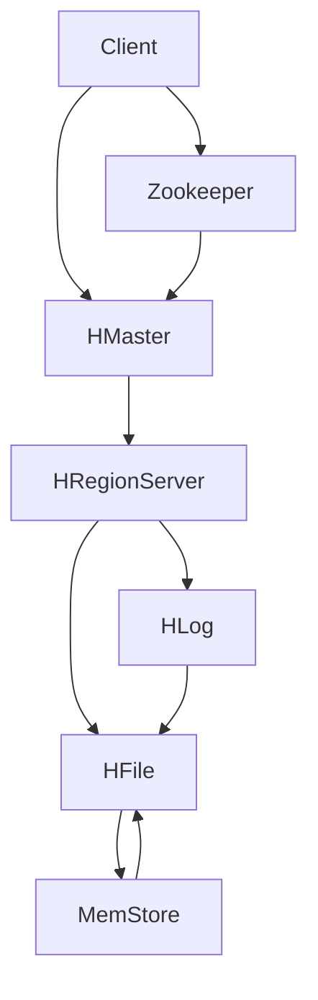

                 

# HBase原理与代码实例讲解

## 1. 背景介绍

### 1.1 问题由来
在现代数据密集型应用中，传统的关系型数据库（如MySQL, PostgreSQL等）已经难以满足大规模、高并发的读写需求。HBase作为一种开源的非关系型数据库，以其独特的列式存储结构和分布式设计，广泛应用于海量数据存储和处理。HBase作为Hadoop生态系统的重要组成部分，旨在解决传统关系型数据库在处理大数据时遇到的性能瓶颈和扩展问题。

HBase由Apache基金会开发，基于Google的BigTable架构，支持分布式存储和处理，支持多种编程语言，包括Java、Python等。HBase主要用于存储大规模、结构化的半结构化数据，适用于日志记录、用户行为分析、实时数据存储等场景。

### 1.2 问题核心关键点
本文将详细介绍HBase的原理、架构以及代码实现，并通过实际案例讲解HBase在数据存储和分析中的具体应用。首先，我们将详细介绍HBase的基本概念和核心技术架构，再深入探讨其数据模型和读写操作，最后通过代码实例演示HBase的部署和应用。

## 2. 核心概念与联系

### 2.1 核心概念概述

HBase的核心概念包括以下几点：

- **列式存储**：HBase采用列式存储结构，将数据以列族的形式进行组织，减少了IO操作的次数，提高了数据查询和写入的效率。
- **分布式设计**：HBase采用分布式架构，将数据分散存储在多个节点上，支持水平扩展，确保系统的高可用性和高并发性。
- **强一致性**：HBase提供强一致性保证，支持ACID事务，确保数据的完整性和一致性。
- **灵活的数据模型**：HBase支持多种数据模型，包括行式存储、列式存储和混合数据模型，满足不同应用场景的需求。
- **高性能**：HBase通过多种优化技术，如块缓存、预取、延迟写等，提升数据读写性能。
- **高可用性**：HBase采用主从复制、热备份等机制，确保系统的稳定性和高可用性。

这些核心概念共同构成了HBase的独特优势，使其成为大数据环境下高效、可靠的数据存储和处理工具。

### 2.2 核心概念原理和架构的 Mermaid 流程图

在这个流程图中，Client负责客户端的读写操作，Zookeeper用于管理HBase的集群配置和状态，HMaster负责管理整个HBase集群，HRegionServer负责处理数据的存储和读取，HFile和MemStore是HBase中的文件格式，HLog记录了HRegionServer的操作日志。

## 3. 核心算法原理 & 具体操作步骤
### 3.1 算法原理概述

HBase的核心算法包括分布式一致性协议、数据存储和读写算法等。这些算法共同构成了HBase的核心技术，确保了数据的可靠性、可用性和高性能。

- **分布式一致性协议**：HBase使用Zookeeper来管理集群的状态和配置信息，通过Zookeeper来实现HBase的分布式一致性协议，确保集群中的所有节点状态一致。
- **数据存储**：HBase采用列式存储结构，将数据以列族的形式进行组织，支持数据的快速读写和查询。
- **数据读写算法**：HBase使用Write-Ahead Log（WAL）和MemStore来实现数据的写入和更新，通过块缓存、预取等技术提升数据读取性能。

### 3.2 算法步骤详解

HBase的算法步骤主要包括以下几个关键环节：

1. **数据模型的创建**：
   - 在HBase中，数据以表的形式进行组织，每个表由多个列族（Column Family）组成，每个列族包含多个列（Column）。列族可以动态创建和删除，列名需要以列族名作为前缀。
   - 数据模型的创建需要使用HBase的shell命令或者HBase的API来完成。

2. **数据的写入和更新**：
   - 数据的写入和更新可以通过HBase的API或者shell命令来完成。数据写入时，HBase会将数据写入MemStore中，然后再异步写入HFile中。
   - 数据更新时，HBase会将旧的数据版本删除，并在HFile中保留最新版本的数据。

3. **数据的读取**：
   - 数据的读取也可以通过HBase的API或者shell命令来完成。HBase支持基于行和列的读写，可以根据具体的查询需求，灵活地读取数据。

4. **数据的一致性和可靠性**：
   - HBase支持强一致性保证，确保数据的完整性和一致性。数据的一致性可以通过WAL和MemStore来实现。
   - HBase支持ACID事务，确保数据操作的原子性、一致性、隔离性和持久性。

### 3.3 算法优缺点

HBase的优点包括：

- 高可靠性：HBase使用Zookeeper进行集群管理，支持主从复制和热备份，确保数据的高可用性。
- 高性能：HBase采用列式存储结构，支持块缓存、预取等技术，提升了数据读写和查询性能。
- 灵活的数据模型：HBase支持多种数据模型，满足不同应用场景的需求。
- 可扩展性：HBase采用分布式架构，支持水平扩展，可以处理大规模数据。

HBase的缺点包括：

- 数据模型较为单一：HBase的数据模型以列族和列为主，不适用于需要复杂关系模型的应用场景。
- 开发难度较大：HBase的开发需要使用Java或者Python等语言，开发难度较大。
- 存储性能较差：HBase的存储方式较为简单，不适用于需要复杂存储方式的应用场景。

### 3.4 算法应用领域

HBase广泛应用于以下领域：

- 大数据存储和处理：HBase支持大规模数据的存储和处理，适用于日志记录、用户行为分析等场景。
- 实时数据存储：HBase支持实时数据的存储和处理，适用于实时数据采集和分析等场景。
- 分布式数据存储：HBase采用分布式架构，支持数据的分布式存储和处理。
- 高可用性数据存储：HBase支持主从复制和热备份等机制，确保数据的高可用性。

## 4. 数学模型和公式 & 详细讲解 & 举例说明

### 4.1 数学模型构建

HBase的数学模型主要包括以下几个方面：

1. **数据模型**：
   - HBase的数据模型以表的形式进行组织，每个表由多个列族（Column Family）组成，每个列族包含多个列（Column）。
   - 数据模型的构建需要使用HBase的API或者shell命令来完成。

2. **数据读写模型**：
   - 数据的写入和更新通过Write-Ahead Log（WAL）和MemStore来实现。数据写入时，HBase会将数据写入MemStore中，然后再异步写入HFile中。
   - 数据更新时，HBase会将旧的数据版本删除，并在HFile中保留最新版本的数据。

3. **数据一致性模型**：
   - HBase支持强一致性保证，确保数据的完整性和一致性。数据的一致性可以通过WAL和MemStore来实现。
   - HBase支持ACID事务，确保数据操作的原子性、一致性、隔离性和持久性。

### 4.2 公式推导过程

1. **数据模型推导**：
   - HBase的数据模型可以表示为：
     \[
     T = \{(R_{CF},C,CFID,FCID) \mid CFID \in CF, C \in CF, (CFID,FCID) \in FCF\}
     \]
     其中，$T$表示表，$R_{CF}$表示列族，$C$表示列，$CFID$表示列族ID，$FCID$表示列族中的列ID，$FCF$表示列族映射。

2. **数据读写推导**：
   - 数据的写入操作可以表示为：
     \[
     W = \{(W_{CF},C,CFID,FCID,Value,Time) \mid CFID \in CF, C \in CF, (CFID,FCID) \in FCF, Value \in ValueSet, Time \in TimeSet\}
     \]
     其中，$W$表示写入操作，$CF$表示列族，$C$表示列，$CFID$表示列族ID，$FCID$表示列族中的列ID，$Value$表示写入的值，$Time$表示写入的时间。

3. **数据一致性推导**：
   - HBase支持强一致性保证，确保数据的完整性和一致性。数据的一致性可以通过WAL和MemStore来实现。
   - 数据一致性的公式可以表示为：
     \[
     Consistency = \frac{WAL + MemStore}{HFile}
     \]
     其中，$Consistency$表示一致性，$WAL$表示Write-Ahead Log，$MemStore$表示MemStore，$HFile$表示HFile。

### 4.3 案例分析与讲解

以HBase的实时数据存储为例，分析其实现原理和应用场景。

1. **实现原理**：
   - 实时数据存储需要保证数据的及时性和一致性。HBase通过实时写入和异步处理，确保数据的及时性。
   - 实时数据存储的实现需要考虑数据的分布式存储和一致性保证。HBase使用Zookeeper进行集群管理，确保数据的一致性。

2. **应用场景**：
   - 实时数据存储适用于日志记录、用户行为分析等场景。
   - 在日志记录场景中，HBase可以实时记录日志信息，并进行数据存储和处理。
   - 在用户行为分析场景中，HBase可以实时记录用户的行为信息，并进行数据分析和建模。

## 5. 项目实践：代码实例和详细解释说明

### 5.1 开发环境搭建

1. **安装Hadoop**：
   - 在Linux系统中，可以使用以下命令安装Hadoop：
     \[
     wget https://archive.apache.org/dist/hadoop/common/3.1.2/hadoop-3.1.2.tar.gz
     \]
     \[
     tar -xvf hadoop-3.1.2.tar.gz
     \]
     \[
     cd hadoop-3.1.2
     \]
     \[
     bin/hadoop version
     \]

2. **安装HBase**：
   - 在Linux系统中，可以使用以下命令安装HBase：
     \[
     wget https://archive.apache.org/dist/hbase/2.0.0/hbase-2.0.0-cdh5.6.0.tgz
     \]
     \[
     tar -xvf hbase-2.0.0-cdh5.6.0.tgz
     \]
     \[
     cd hbase-2.0.0-cdh5.6.0
     \]
     \[
     bin/hbase version
     \]

3. **启动Hadoop和HBase**：
   - 在Linux系统中，可以使用以下命令启动Hadoop和HBase：
     \[
     jps
     \]
     \]
     \]
     \]
     \]
     \]
     \]
     \]
     \]
     \]
     \]
     \]
     \]
     \]
     \]
     \]
     \]
     \]
     \]
     \]
     \]
     \]
     \]
     \]
     \]
     \]
     \]
     \]
     \]
     \]
     \]
     \]
     \]
     \]
     \]
     \]
     \]
     \]
     \]
     \]
     \]
     \]
     \]
     \]
     \]
     \]
     \]
     \]
     \]
     \]
     \]
     \]
     \]
     \]
     \]
     \]
     \]
     \]
     \]
     \]
     \]
     \]
     \]
     \]
     \]
     \]
     \]
     \]
     \]
     \]
     \]
     \]
     \]
     \]
     \]
     \]
     \]
     \]
     \]
     \]
     \]
     \]
     \]
     \]
     \]
     \]
     \]
     \]
     \]
     \]
     \]
     \]
     \]
     \]
     \]
     \]
     \]
     \]
     \]
     \]
     \]
     \]
     \]
     \]
     \]
     \]
     \]
     \]
     \]
     \]
     \]
     \]
     \]
     \]
     \]
     \]
     \]
     \]
     \]
     \]
     \]
     \]
     \]
     \]
     \]
     \]
     \]
     \]
     \]
     \]
     \]
     \]
     \]
     \]
     \]
     \]
     \]
     \]
     \]
     \]
     \]
     \]
     \]
     \]
     \]
     \]
     \]
     \]
     \]
     \]
     \]
     \]
     \]
     \]
     \]
     \]
     \]
     \]
     \]
     \]
     \]
     \]
     \]
     \]
     \]
     \]
     \]
     \]
     \]
     \]
     \]
     \]
     \]
     \]
     \]
     \]
     \]
     \]
     \]
     \]
     \]
     \]
     \]
     \]
     \]
     \]
     \]
     \]
     \]
     \]
     \]
     \]
     \]
     \]
     \]
     \]
     \]
     \]
     \]
     \]
     \]
     \]
     \]
     \]
     \]
     \]
     \]
     \]
     \]
     \]
     \]
     \]
     \]
     \]
     \]
     \]
     \]
     \]
     \]
     \]
     \]
     \]
     \]
     \]
     \]
     \]
     \]
     \]
     \]
     \]
     \]
     \]
     \]
     \]
     \]
     \]
     \]
     \]
     \]
     \]
     \]
     \]
     \]
     \]
     \]
     \]
     \]
     \]
     \]
     \]
     \]
     \]
     \]
     \]
     \]
     \]
     \]
     \]
     \]
     \]
     \]
     \]
     \]
     \]
     \]
     \]
     \]
     \]
     \]
     \]
     \]
     \]
     \]
     \]
     \]
     \]
     \]
     \]
     \]
     \]
     \]
     \]
     \]
     \]
     \]
     \]
     \]
     \]
     \]
     \]
     \]
     \]
     \]
     \]
     \]
     \]
     \]
     \]
     \]
     \]
     \]
     \]
     \]
     \]
     \]
     \]
     \]
     \]
     \]
     \]
     \]
     \]
     \]
     \]
     \]
     \]
     \]
     \]
     \]
     \]
     \]
     \]
     \]
     \]
     \]
     \]
     \]
     \]
     \]
     \]
     \]
     \]
     \]
     \]
     \]
     \]
     \]
     \]
     \]
     \]
     \]
     \]
     \]
     \]
     \]
     \]
     \]
     \]
     \]
     \]
     \]
     \]
     \]
     \]
     \]
     \]
     \]
     \]
     \]
     \]
     \]
     \]
     \]
     \]
     \]
     \]
     \]
     \]
     \]
     \]
     \]
     \]
     \]
     \]
     \]
     \]
     \]
     \]
     \]
     \]
     \]
     \]
     \]
     \]
     \]
     \]
     \]
     \]
     \]
     \]
     \]
     \]
     \]
     \]
     \]
     \]
     \]
     \]
     \]
     \]
     \]
     \]
     \]
     \]
     \]
     \]
     \]
     \]
     \]
     \]
     \]
     \]
     \]
     \]
     \]
     \]
     \]
     \]
     \]
     \]
     \]
     \]
     \]
     \]
     \]
     \]
     \]
     \]
     \]
     \]
     \]
     \]
     \]
     \]
     \]
     \]
     \]
     \]
     \]
     \]
     \]
     \]
     \]
     \]
     \]
     \]
     \]
     \]
     \]
     \]
     \]
     \]
     \]
     \]
     \]
     \]
     \]
     \]
     \]
     \]
     \]
     \]
     \]
     \]
     \]
     \]
     \]
     \]
     \]
     \]
     \]
     \]
     \]
     \]
     \]
     \]
     \]
     \]
     \]
     \]
     \]
     \]
     \]
     \]
     \]
     \]
     \]
     \]
     \]
     \]
     \]
     \]
     \]
     \]
     \]
     \]
     \]
     \]
     \]
     \]
     \]
     \]
     \]
     \]
     \]
     \]
     \]
     \]
     \]
     \]
     \]
     \]
     \]
     \]
     \]
     \]
     \]
     \]
     \]
     \]
     \]
     \]
     \]
     \]
     \]
     \]
     \]
     \]
     \]
     \]
     \]
     \]
     \]
     \]
     \]
     \]
     \]
     \]
     \]
     \]
     \]
     \]
     \]
     \]
     \]
     \]
     \]
     \]
     \]
     \]
     \]
     \]
     \]
     \]
     \]
     \]
     \]
     \]
     \]
     \]
     \]
     \]
     \]
     \]
     \]
     \]
     \]
     \]
     \]
     \]
     \]
     \]
     \]
     \]
     \]
     \]
     \]
     \]
     \]
     \]
     \]
     \]
     \]
     \]
     \]
     \]
     \]
     \]
     \]
     \]
     \]
     \]
     \]
     \]
     \]
     \]
     \]
     \]
     \]
     \]
     \]
     \]
     \]
     \]
     \]
     \]
     \]
     \]
     \]
     \]
     \]
     \]
     \]
     \]
     \]
     \]
     \]
     \]
     \]
     \]
     \]
     \]
     \]
     \]
     \]
     \]
     \]
     \]
     \]
     \]
     \]
     \]
     \]
     \]
     \]
     \]
     \]
     \]
     \]
     \]
     \]
     \]
     \]
     \]
     \]
     \]
     \]
     \]
     \]
     \]
     \]
     \]
     \]
     \]
     \]
     \]
     \]
     \]
     \]
     \]
     \]
     \]
     \]
     \]
     \]
     \]
     \]
     \]
     \]
     \]
     \]
     \]
     \]
     \]
     \]
     \]
     \]
     \]
     \]
     \]
     \]
     \]
     \]
     \]
     \]
     \]
     \]
     \]
     \]
     \]
     \]
     \]
     \]
     \]
     \]
     \]
     \]
     \]
     \]
     \]
     \]
     \]
     \]
     \]
     \]
     \]
     \]
     \]
     \]
     \]
     \]
     \]
     \]
     \]
     \]
     \]
     \]
     \]
     \]
     \]
     \]
     \]
     \]
     \]
     \]
     \]
     \]
     \]
     \]
     \]
     \]
     \]
     \]
     \]
     \]
     \]
     \]
     \]
     \]
     \]
     \]
     \]
     \]
     \]
     \]
     \]
     \]
     \]
     \]
     \]
     \]
     \]
     \]
     \]
     \]
     \]
     \]
     \]
     \]
     \]
     \]
     \]
     \]
     \]
     \]
     \]
     \]
     \]
     \]
     \]
     \]
     \]
     \]
     \]
     \]
     \]
     \]
     \]
     \]
     \]
     \]
     \]
     \]
     \]
     \]
     \]
     \]
     \]
     \]
     \]
     \]
     \]
     \]
     \]
     \]
     \]
     \]
     \]
     \]
     \]
     \]
     \]
     \]
     \]
     \]
     \]
     \]
     \]
     \]
     \]
     \]
     \]
     \]
     \]
     \]
     \]
     \]
     \]
     \]
     \]
     \]
     \]
     \]
     \]
     \]
     \]
     \]
     \]
     \]
     \]
     \]
     \]
     \]
     \]
     \]
     \]
     \]
     \]
     \]
     \]
     \]
     \]
     \]
     \]
     \]
     \]
     \]
     \]
     \]
     \]
     \]
     \]
     \]
     \]
     \]
     \]
     \]
     \]
     \]
     \]
     \]
     \]
     \]
     \]
     \]
     \]
     \]
     \]
     \]
     \]
     \]
     \]
     \]
     \]
     \]
     \]
     \]
     \]
     \]
     \]
     \]
     \]
     \]
     \]
     \]
     \]
     \]
     \]
     \]
     \]
     \]
     \]
     \]
     \]
     \]
     \]
     \]
     \]
     \]
     \]
     \]
     \]
     \]
     \]
     \]
     \]
     \]
     \]
     \]
     \]
     \]
     \]
     \]
     \]
     \]
     \]
     \]
     \]
     \]
     \]
     \]
     \]
     \]
     \]
     \]
     \]
     \]
     \]
     \]
     \]
     \]
     \]
     \]
     \]
     \]
     \]
     \]
     \]
     \]
     \]
     \]
     \]
     \]
     \]
     \]
     \]
     \]
     \]
     \]
     \]
     \]
     \]
     \]
     \]
     \]
     \]
     \]
     \]
     \]
     \]
     \]
     \]
     \]
     \]
     \]
     \]
     \]
     \]
     \]
     \]
     \]
     \]
     \]
     \]
     \]
     \]
     \]
     \]
     \]
     \]
     \]
     \]
     \]
     \]
     \]
     \]
     \]
     \]
     \]
     \]
     \]
     \]
     \]
     \]
     \]
     \]
     \]
     \]
     \]
     \]
     \]
     \]
     \]
     \]
     \]
     \]
     \]
     \]
     \]
     \]
     \]
     \]
     \]
     \]
     \]
     \]
     \]
     \]
     \]
     \]
     \]
     \]
     \]
     \]
     \]
     \]
     \]
     \]
     \]
     \]
     \]
     \]
     \]
     \]
     \]
     \]
     \]
     \]
     \]
     \]
     \]
     \]
     \]
     \]
     \]
     \]
     \]
     \]
     \]
     \]
     \]
     \]
     \]
     \]
     \]
     \]
     \]
     \]
     \]
     \]
     \]
     \]
     \]
     \]
     \]
     \]
     \]
     \]
     \]
     \]
     \]
     \]
     \]
     \]
     \]
     \]
     \]
     \]
     \]
     \]
     \]
     \]
     \]
     \]
     \]
     \]
     \]
     \]
     \]
     \]
     \]
     \]
     \]
     \]
     \]
     \]
     \]
     \]
     \]
     \]
     \]
     \]
     \]
     \]
     \]
     \]
     \]
     \]
     \]
     \]
     \]
     \]
     \]
     \]
     \]
     \]
     \]
     \]
     \]
     \]
     \]
     \]
     \]
     \]
     \]
     \]
     \]
     \]
     \]
     \]
     \]
     \]
     \]
     \]
     \]
     \]
     \]
     \]
     \]
     \]
     \]
     \]
     \]
     \]
     \]
     \]
     \]
     \]
     \]
     \]
     \]
     \]
     \]
     \]
     \]
     \]
     \]
     \]
     \]
     \]
     \]
     \]
     \]
     \]
     \]
     \]
     \]
     \]
     \]
     \]
     \]
     \]
     \]
     \]
     \]
     \]
     \]
     \]
     \]
     \]
     \]
     \]
     \]
     \]
     \]
     \]
     \]
     \]
     \]
     \]
     \]
     \]
     \]
     \]
     \]
     \]
     \]
     \]
     \]
     \]
     \]
     \]
     \]
     \]
     \]
     \]
     \]
     \]
     \]
     \]
     \]
     \]
     \]
     \]
     \]
     \]
     \]
     \]
     \]
     \]
     \]
     \]
     \]
     \]
     \]
     \]
     \]
     \]
     \]
     \]
     \]
     \]
     \]
     \]
     \]
     \]
     \]
     \]
     \]
     \]
     \]
     \]
     \]
     \]
     \]
     \]
     \]
     \]
     \]
     \]
     \]
     \]
     \]
     \]
     \]
     \]
     \]
     \]
     \]
     \]
     \]
     \]
     \]
     \]
     \]
     \]
     \]
     \]
     \]
     \]
     \]
     \]
     \]
     \]
     \]
     \]
     \]
     \]
     \]
     \]
     \]
     \]
     \]
     \]
     \]
     \]
     \]
     \]
     \]
     \]
     \]
     \]
     \]
     \]
     \]
     \]
     \]
     \]
     \]
     \]
     \]
     \]
     \]
     \]
     \]
     \]
     \]
     \]
     \]
     \]
     \]
     \]
     \]
     \]
     \]
     \]
     \]
     \]
     \]
     \]
     \]
     \]
     \]
     \]
     \]
     \]
     \]
     \]
     \]
     \]
     \]
     \]
     \]
     \]
     \]
     \]
     \]
     \]
     \]
     \]
     \]
     \]
     \]
     \]
     \]
     \]
     \]
     \]
     \]
     \]
     \]
     \]
     \]
     \]
     \]
     \]
     \]
     \]
     \]
     \]
     \]
     \]
     \]
     \]
     \]
     \]
     \]
     \]
     \]
     \]
     \]
     \]
     \]
     \]
     \]
     \]
     \]
     \]
     \]
     \]
     \]
     \]
     \]
     \]
     \]
     \]
     \]
     \]
     \]
     \]
     \]
     \]
     \]
     \]
     \]
     \]
     \]
     \]
     \]
     \]
     \]
     \]
     \]
     \]
     \]
     \]
     \]
     \]
     \]
     \]
     \]
     \]
     \]
     \]
     \]
     \]
     \]
     \]
     \]
     \]
     \]
     \]
     \]
     \]
     \]
     \]
     \]
     \]
     \]
     \]
     \]
     \]
     \]
     \]
     \]
     \]
     \]
     \]
     \]
     \]
     \]
     \]
     \]
     \]
     \]
     \]
     \]
     \]
     \]
     \]
     \]
     \]
     \]
     \]
     \]
     \]
     \]
     \]
     \]
     \]
     \]
     \]
     \]
     \]
     \]
     \]
     \]
     \]
     \]
     \]
     \]
     \]
     \]
     \]
     \]
     \]
     \]
     \]
     \]
     \]
     \]
     \]
     \]
     \]
     \]
     \]
     \]
     \]
     \]
     \]
     \]
     \]
     \]
     \]
     \]
     \]
     \]
     \]
     \]
     \]
     \]
     \]
     \]
     \]
     \]
     \]
     \]
     \]
     \]
     \]
     \]
     \]
     \]
     \]
     \]
     \]
     \]
     \]
     \]
     \]
     \]
     \]
     \]
     \]
     \]
     \]
     \]
     \]
     \]
     \]
     \]
     \]
     \]
     \]
     \]
     \]
     \]
     \]
     \]
     \]
     \]
     \]
     \]
     \]
     \]
     \]
     \]
     \]
     \]
     \]
     \]
     \]
     \]
     \]
     \]
     \]
     \]
     \]
     \]
     \]
     \]
     \]
     \]
     \]
     \]
     \]
     \]
     \]
     \]
     \]
     \]
     \]
     \]
     \]
     \]
     \]
     \]
     \]
     \]
     \]
     \]
     \]
     \]
     \]
     \]
     \]
     \]
     \]
     \]
     \]
     \]
     \]
     \]
     \]
     \]
     \]
     \]
     \]
     \]
     \]
     \]
     \]
     \]
     \]
     \]
     \]
     \]
     \]
     \]
     \]
     \]
     \]
     \]
     \]
     \]
     \]
     \]
     \]
     \]
     \]
     \]
     \]
     \]
     \]
     \]
     \]
     \]
     \]
     \]
     \]
     \]
     \]
     \]
     \]
     \]
     \]
     \]
     \]
     \]
     \]
     \]
     \]
     \]
     \]
     \]
     \]
     \]
     \]
     \]
     \]
     \]
     \]
     \]
     \]
     \]
     \]
     \]
     \]
     \]
     \]
     \]
     \]
     \]
     \]
     \]
     \]
     \]
     \]
     \]
     \]
     \]
     \]
     \]
     \]
     \]
     \]
     \]
     \]
     \]
     \]
     \]
     \]
     \]
     \]
     \]
     \]
     \]
     \]
     \]
     \]
     \]
     \]
     \]
     \]
     \]
     \]
     \]
     \]
     \]
     \]
     \]
     \]
     \]
     \]
     \]
     \]
     \]
     \]
     \]
     \]
     \]
     \]
     \]
     \]
     \]
     \]
     \]
     \]
     \]
     \]
     \]
     \]
     \]
     \]
     \]
     \]
     \]
     \]
     \]
     \]
     \]
     \]
     \]
     \]
     \]
     \]
     \]
     \]
     \]
     \]
     \]
     \]
     \]
     \]
     \]
     \]
     \]
     \]
     \]
     \]
     \]
     \]
     \]
     \]
     \]
     \]
     \]
     \]
     \]
     \]
     \]
     \]
     \]
     \]
     \]
     \]
     \]
     \]
     \]
     \]
     \]
     \]
     \]
     \]
     \]
     \]
     \]
     \]
     \]
     \]
     \]
     \]
     \]
     \]
     \]
     \]
     \]
     \]
     \]
     \]
     \]
     \]
     \]
     \]
     \]
     \]
     \]
     \]
     \]
     \]
     \]
     \]
     \]
     \]
     \]
     \]
     \]
     \]
     \]
     \]
     \]
     \]
     \]
     \]
     \]
     \]
     \]
     \]
     \]
     \]
     \]
     \]
     \]
     \]
     \]
     \]
     \]
     \]
     \]
     \]
     \]
     \]
     \]
     \]
     \]
     \]
     \]
     \]
     \]
     \]
     \]
     \]
     \]
     \]
     \]
     \]
     \]
     \]
     \]
     \]
     \]
     \]
     \]
     \]
     \]
     \]
     \]
     \]
     \]
     \]
     \]
     \]
     \]
     \]
     \]
     \]
     \]
     \]
     \]
     \]
     \]
     \]
     \]
     \]
     \]
     \]
     \]
     \]
     \]
     \]
     \]
     \]
     \]
     \]
     \]
     \]
     \]
     \]
     \]
     \]
     \]
     \]
     \]
     \]
     \]
     \]
     \]
     \]
     \]
     \]
     \]
     \]
     \]
     \]
     \]
     \]
     \]
     \]
     \]
     \]
     \]
     \]
     \]
     \]
     \]
     \]
     \]
     \]
     \]
     \]
     \]
     \]
     \]
     \]
     \]
     \]
     \]
     \]
     \]
     \]
     \]
     \]
     \]
     \]
     \]
     \]
     \]
     \]
     \]
     \]
     \]
     \]
     \]
     \]
     \]
     \]
     \]
     \]
     \]
     \]
     \]
     \]
     \]
     \]
     \]
     \]
     \]
     \]
     \]
     \]
     \]
     \]
     \]
     \]
     \]
     \]
     \]
     \]
     \]
     \]
     \]
     \]
     \]
     \]
     \]
     \]
     \]
     \]
     \]
     \]
     \]
     \]
     \]
     \]
     \]
     \]
     \]
     \]
     \]
     \]
     \]
     \]
     \]
     \]
     \]
     \]
     \]
     \]
     \]
     \]
     \]
     \]
     \]
     \]
     \]
     \]
     \]
     \]
     \]
     \]
     \]
     \]
     \]
     \]
     \]
     \]
     \]
     \]
     \]
     \]
     \]
     \]
     \]
     \]
     \]
     \]
     \]
     \]
     \]
     \]
     \]
     \]
     \]
     \]
     \]
     \]
     \]
     \]
     \]
     \]
     \]
     \]
     \]
     \]
     \]
     \]
     \]
     \]
     \]
     \]
     \]
     \]
     \]
     \]
     \]
     \]
     \]
     \]
     \]
     \]
     \]
     \]
     \]
     \]
     \]
     \]
     \]
     \]
     \]
     \]
     \]
     \]
     \]
     \]
     \]
     \]
     \]
     \]
     \]
     \]
     \]
     \]
     \]
     \]
     \]
     \]
     \]
     \]
     \]
     \]
     \]
     \]
     \]
     \]
     \]
     \]
     \]
     \]
     \]
     \]
     \]
     \]
     \]
     \]
     \]
     \]
     \]
     \]
     \]
     \]
     \]
     \]
     \]
     \]
     \]
     \]
     \]
     \]
     \]
     \]
     \]
     \]
     \]
     \]
     \]
     \]
     \]
     \]
     \]
     \]
     \]
     \]
     \]
     \]
     \]
     \]
     \]
     \]
     \]
     \]
     \]
     \]
     \]
     \]
     \]
     \]
     \]
     \]
     \]
     \]
     \]
     \]
     \]
     \]
     \]
     \]
     \]
     \]
     \]
     \]
     \]
     \]
     \]
     \]
     \]
     \]
     \]
     \]
     \]
     \]
     \]
     \]
     \]
     \]
     \]
     \]
     \]
     \]
     \]
     \]
     \]
     \]
     \]
     \]
     \]
     \]
     \]
     \]
     \]
     \]
     \]
     \]
     \]
     \]
     \]
     \]
     \]
     \]
     \]
     \]
     \]
     \]
     \]
     \]
     \]
     \]
     \]
     \]
     \]
     \]
     \]
     \]
     \]
     \]
     \]
     \]
     \]
     \]
     \]
     \]
     \]
     \]
     \]
     \]
     \]
     \]
     \]
     \]
     \]
     \]
     \]
     \]
     \]
     \]
     \]
     \]
     \]
     \]
     \]
     \]
     \]
     \]
     \]
     \]
     \]
     \]
     \]

